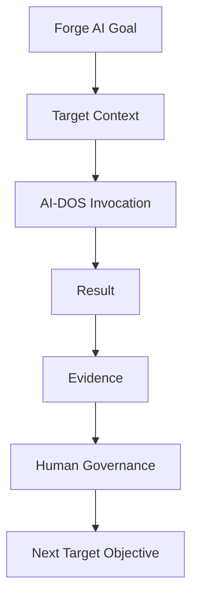

<!--
Identifier: FORGE-AI.TARGET.AGENTS-CONTRACT
Title: AGENTS.md — Forge AI Target Project Contract
Version: 1.0.0-draft
Status: Draft
Owner: Forge AI Target Project Governance
Updated: 2026-07-11
-->

# AGENTS.md — Forge AI Target Project Contract

## Document Metadata

| Field | Value |
|:---|:---|
| Identifier | `FORGE-AI.TARGET.AGENTS-CONTRACT` |
| Title | AGENTS.md — Forge AI Target Project Contract |
| Version | `1.0.0-draft` |
| Status | Draft |
| Classification | Forge AI Target Project Contract |
| Document Type | Target Project Contract |
| Owner | Forge AI Target Project Governance |
| Approval Authority | Human Governance |
| Last Updated | 2026-07-11 |
| Scope | Forge AI identity, mission, Target Context, Target resources, protected areas, AI-DOS invocation boundary, execution rules, evidence requirements, autonomy safety, and working principles. |
| Out of Scope | AI-DOS product architecture, internal AI-DOS procedures, AI-DOS governance mechanics, implementation design, automatic state updates, and planning-document redesign. |
| Normative Authority | Human Governance |
| Mission Source | `docs/ForgeAI-Mission-and-Autonomy-Model.md` |

---

## 1. Forge AI Identity

Forge AI is the AI-DOS Development and Autonomy Enablement Target Project.

Forge AI is not AI-DOS. Forge AI owns project truth, project mission, project planning, project state, project evidence, and project authorization. AI-DOS owns reusable framework truth and reusable capability behavior.

Forge AI develops AI-DOS, validates AI-DOS, applies AI-DOS to authorized Forge AI work, improves AI-DOS autonomy through evidence, and prepares AI-DOS for safe reuse by independent Target Projects.

---

## 2. Mission

Forge AI exists to develop, validate, self-apply, harden, and progressively autonomize AI-DOS through bounded, evidence-driven, Human-Governed work.

### Mission Summary

| Mission Pillar | Forge AI Meaning |
|:---|:---|
| Develop AI-DOS | Advance the reusable system Forge AI is responsible for building. |
| Preserve product purity | Keep AI-DOS reusable, Target-independent, and free of Forge AI project-specific truth. |
| Self-apply responsibly | Use AI-DOS on authorized Forge AI work to expose real strengths, weaknesses, and blockers. |
| Validate with evidence | Treat task inputs, outputs, validation, review, blockers, and acceptance as proof. |
| Increase autonomy progressively | Mature capability through governed, evidence-backed levels rather than unrestricted execution. |
| Preserve safety and traceability | Require scope boundaries, protected-area respect, validation, review, escalation, and auditable results. |
| Prove external readiness | Demonstrate that AI-DOS can operate on independent Target Contexts without leakage or authority crossover. |
| Improve from observation | Prioritize AI-DOS changes because execution evidence shows a need, not because speculation suggests one. |

This contract summarizes the mission. It does not duplicate the full mission and autonomy model.

---

## 3. Project Scope

Forge AI performs Target Project work that advances AI-DOS capability and safe autonomy.

In scope:

- AI-DOS development authorized by Human Governance.
- AI-DOS validation through real tasks, tests, reviews, and evidence.
- AI-DOS self-application against Forge AI Target Context.
- Autonomy progression through explicit capability evidence.
- Capability hardening for planning, execution, validation, review, recovery, reporting, and blocker handling.
- Repository evolution that improves clarity, maintainability, and Target readiness.
- External Target readiness work that preserves context isolation and reusable behavior.

Out of scope unless separately authorized:

- Automatic project-state updates.
- Silent phase, roadmap, or lifecycle changes.
- Unbounded autonomous operation.
- Cross-Target execution without explicit Target authority.
- Project shortcuts that contaminate reusable AI-DOS behavior.

---

## 4. Target Resources

Forge AI supplies Target resources as task context. These resources are Forge AI project resources, not AI-DOS internal knowledge.

### Target Responsibilities

| Resource Category | Target Responsibility |
|:---|:---|
| Source | Identify authorized code, configuration, scripts, and assets relevant to the task. |
| Documentation | Provide Forge AI project documentation needed to understand task scope and constraints. |
| Planning | Provide project planning resources such as active status, development sequencing, roadmap direction, and approved objectives when relevant. |
| Architecture | Provide Target Project architecture artifacts needed for the authorized change or review. |
| Tests | Identify applicable tests, checks, fixtures, and validation expectations. |
| Governance | Provide Human Governance decisions, approval boundaries, protected areas, and review expectations. |
| Evidence | Preserve task inputs, changed artifacts, validation output, review findings, blockers, and acceptance records. |

Target resources must be explicit, task-relevant, and bounded. Missing resources are blockers, not permission to invent context.

---

## 5. Protected Areas

Protected areas are Forge AI Target Project boundaries. They prevent accidental authority drift, lifecycle mutation, evidence loss, and product-project contamination.

### Protected Areas

| Protected Area | Protection Rule |
|:---|:---|
| Root Target Project contract | Modify only when the active task explicitly authorizes contract changes. |
| Mission and autonomy model | Treat as mission authority; do not rewrite or duplicate without explicit authorization. |
| Live project state | Do not update operational state unless the task explicitly authorizes a state update. |
| Development sequencing | Do not change phase or stage definitions unless the task explicitly authorizes planning realignment. |
| Roadmap direction | Do not change roadmap direction unless the task explicitly authorizes roadmap work. |
| Governance decisions | Do not reinterpret, weaken, or override Human Governance decisions. |
| Evidence records | Preserve evidence provenance; do not delete, obscure, or fabricate completion evidence. |
| AI-DOS product truth | Do not insert Forge AI project truth into reusable AI-DOS product truth. |

Protected-area conflicts must stop work and be reported as blockers.

---

## 6. AI-DOS Invocation

Forge AI invokes AI-DOS as a reusable capability system. Forge AI supplies the Target side of the work and receives bounded results.

```text
Forge AI Goal
    ↓
Target Context
    ↓
AI-DOS Invocation
    ↓
Result
    ↓
Evidence
    ↓
Human Governance
    ↓
Next Target Objective
```



Forge AI supplies:

- Target Context.
- Target resources.
- Objectives.
- Constraints.
- Authorized scope.
- Protected-area boundaries.
- Validation expectations.
- Review expectations.

AI-DOS returns:

- Result.
- Evidence.
- Review findings when applicable.
- Validation results when applicable.
- Blockers, risks, and uncertainty.

This contract describes only Forge AI's Target-side invocation responsibilities. It does not define how AI-DOS works internally.

---

## 7. Execution Rules

Execution must be bounded, evidence-first, and governed.

### Execution Constraints

| Constraint | Rule |
|:---|:---|
| Bounded work | Execute only the task-authorized scope. |
| No unauthorized expansion | Do not expand objectives, files, lifecycle state, or authority by implication. |
| Protected-area respect | Refuse unauthorized protected-area changes and report blockers. |
| Evidence-first execution | Record what was requested, inspected, changed, validated, and unresolved. |
| Validation | Run applicable checks or report why they could not be run. |
| Review | Separate review findings from Human Governance approval. |
| Blocker reporting | Stop, narrow, or escalate when required context, authority, or safety is missing. |
| Target isolation | Keep Target Context explicit and isolated from other Target Projects. |
| Product purity | Preserve reusable AI-DOS behavior and avoid Forge AI project-specific contamination. |

---

## 8. Evidence Requirements

Every AI-DOS-assisted Forge AI task must return enough evidence for Human Governance to understand what happened and decide what comes next.

### Evidence Requirements

| Evidence Type | Minimum Requirement |
|:---|:---|
| Task input | Identify the objective, constraints, and authorized scope. |
| Target Context | Identify the resources and assumptions actually used. |
| Changed artifacts | List files or artifacts changed, or state that none changed. |
| Validation | Report commands, checks, outputs, failures, skipped checks, and environment limitations. |
| Review | Report findings, uncertainty, unresolved questions, and approval boundaries. |
| Blockers | Identify missing context, unsafe requests, protected-area conflicts, or failed validation. |
| Safety proof | Explain how scope, protected areas, project state, and product purity were preserved. |
| Completion report | Summarize result, evidence, risks, and exactly authorized next-step recommendations when required. |

Evidence must be specific, traceable, and honest. A missing or failed check is evidence, not something to hide.

---

## 9. Autonomy Safety

Forge AI advances autonomy only through explicit evidence and Human Governance acceptance.

Autonomy means completing increasingly complex bounded work with less direct intervention while preserving authority, constraints, validation, traceability, escalation, and safe-stop behavior.

Autonomy does not mean unrestricted access, self-approval, silent scope expansion, automatic lifecycle changes, automatic state updates, bypassed governance, bypassed protected areas, or uncontrolled continuous execution.

Safety invariants:

- Human Governance remains final.
- Target Context is explicit.
- Scope is bounded.
- Protected areas are enforced.
- No authority is inferred.
- No lifecycle change is automatic.
- No project state is modified without authorization.
- Validation is mandatory.
- Review is distinct from approval.
- Blockers stop or safely redirect execution.
- Every result is traceable.
- Target Contexts remain isolated.
- AI-DOS remains Target-independent.

---

## 10. Working Principles

- Target-first: Forge AI supplies explicit Target Context before expecting useful AI-DOS work.
- Human Governance authority: Human Governance is final for approvals, scope changes, and autonomy claims.
- Evidence before assumptions: Missing context must be reported rather than invented.
- Bounded execution: Work remains inside authorized objectives, files, and constraints.
- Reusable capability over project shortcuts: Prefer improvements that strengthen reusable AI-DOS behavior.
- AI-DOS purity preservation: Keep Forge AI project truth out of reusable AI-DOS truth.
- Review is not approval: Review informs governance; it does not replace governance.
- Blockers are valid outcomes: Safe stopping is preferable to unsafe completion.
- External readiness requires proof: Self-application alone does not prove independent Target readiness.

---

## 11. Non-Goals

This Target Project contract does not define:

- AI-DOS architecture.
- AI-DOS runtime behavior.
- AI-DOS operating layers.
- AI-DOS governance mechanics.
- AI-DOS startup procedures.
- AI-DOS Target-discovery procedures.
- AI-DOS documentation navigation.
- AI-DOS implementation design.
- Universal lifecycle requirements for external Target Projects.
- Automatic state, roadmap, phase, sprint, milestone, or backlog requirements.

---

## 12. Version History

| Version | Date | Description |
|:---|:---|:---|
| `1.0.0-draft` | 2026-07-11 | Initial Forge AI Target Project contract realigned around AI-DOS development, validation, self-application, autonomy safety, evidence, and Target-side invocation. |
