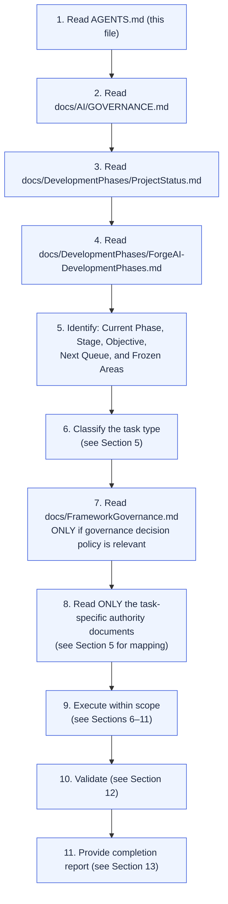
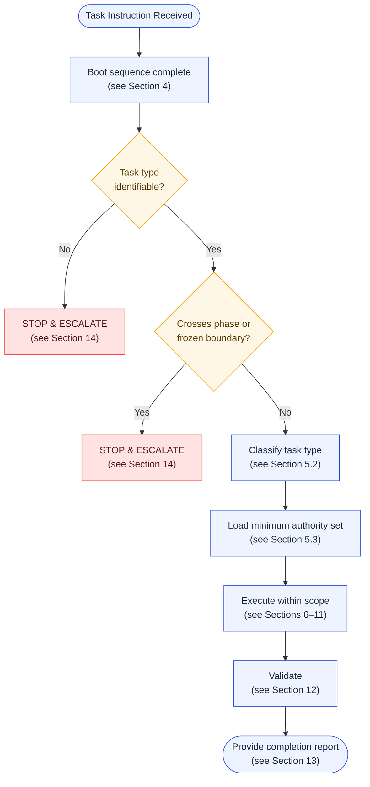
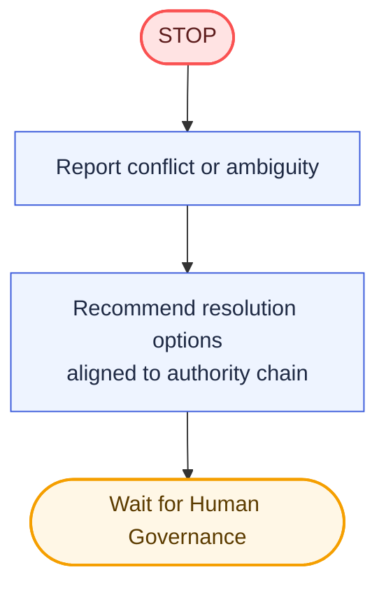
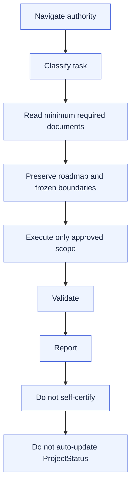

<!--
  ===================================================================================
  DOCUMENT CONTROL BLOCK — ENTERPRISE ARCHITECTURE SPECIFICATION
  ===================================================================================
  Identifier : FORGE-BOOTLOADER-AGENTS
  Title      : AGENTS.md — Forge AI Repository Bootloader
  Version    : 3.0.0-beta
  Status     : Draft for Human Governance Approval
  Classification : Repository Governance Bootloader
  Owner      : Human Governance
  Maintainer : Framework Architecture Team
  Created    : 2026-07-08
  Updated    : 2026-07-10
  Traceability ID : FORGE-AI.V4.BOOTLOADER.AGENTS
  ===================================================================================
-->

# AGENTS.md — Forge AI Repository Bootloader

**Enterprise Architecture Specification · Version 3.0.0-beta**

> **Repository entry point for AI assistants.** This file intentionally remains
> small. Its only responsibility is to bootstrap the correct authority chain for
> the current task. It does not duplicate the Constitution, Governance Atlas,
> Framework Governance, roadmap, runtime architecture, engine architecture,
> AGENTS v1, AGENTS v2, or swarm architecture.

---

## Document Control

### Identification

| Field | Value |
|:---|:---|
| **Document Identifier** | `FORGE-BOOTLOADER-AGENTS` |
| **Title** | AGENTS.md — Forge AI Repository Bootloader |
| **Version** | `3.0.0-beta` |
| **Status** | Draft for Human Governance Approval |
| **Canonical Status** | Canonical |
| **Classification** | Repository Governance Bootloader |
| **Document Type** | Repository Bootloader |
| **Traceability ID** | `FORGE-AI.V4.BOOTLOADER.AGENTS` |
| **Document Family** | Forge AI Architecture Specification Series |
| **Series Position** | Bootloader (entry-point document) |

### Ownership and Accountability

| Field | Value |
|:---|:---|
| **Owner** | Human Governance |
| **Maintainers** | Framework Architecture Team |
| **Review Authority** | Framework Governance |
| **Approval Authority** | Human Governance |
| **Change Control Authority** | Human Governance |
| **Escalation Authority** | Human Governance (Level 3); Framework Architecture Team (Level 2); Project Lead / Tech Lead (Level 1) |

### Lifecycle

| Field | Value |
|:---|:---|
| **Created** | 2026-07-08 |
| **Last Updated** | 2026-07-10 |
| **Lifecycle Phase** | Beta (pending re-approval) |
| **Supersedes** | Prior `AGENTS.md` repository bootloader drafts (versions ≤ 3.0.0-approved) |
| **Superseded By** | None |
| **Promotion Requirements** | Human Governance review, Governance Atlas alignment, Framework Governance alignment, ProjectStatus policy validation, and boot-sequence validation |
| **Certification Status** | Carry-over certification from `3.0.0-approved`; re-certification pending for `3.0.0-beta` |
| **Next Review Date** | To be assigned by Human Governance upon approval |

### Scope Statement

| Field | Value |
|:---|:---|
| **In Scope** | Repository boot, authority discovery, task classification, safety boundaries, validation routing, and completion reporting. |
| **Out of Scope** | Constitution, Governance Atlas content, framework architecture, roadmap ownership, runtime architecture, engine architecture, AGENTS v1 architecture, AGENTS v2 architecture, swarm architecture, implementation details, certification, and ProjectStatus updates. |

### Authority and References

| Field | Value |
|:---|:---|
| **Normative Authority** | Human Governance; `docs/AI/GOVERNANCE.md`; `docs/FrameworkGovernance.md`; `docs/DevelopmentPhases/ProjectStatus.md`; `docs/DevelopmentPhases/ForgeAI-DevelopmentPhases.md` |
| **Normative References** | `docs/AI/Architecture/Standards/STD-003-Terminology-Standard.md`; `docs/AI/Architecture/Standards/STD-010-Document-Metadata-Standard.md` |
| **Dependencies** | Governance Atlas v2, Framework Governance, ProjectStatus, DevelopmentPhases, active task authority documents |
| **Consumes** | Human task instruction, Governance Atlas navigation, ProjectStatus operational state, DevelopmentPhases roadmap state, task-specific authorities |
| **Produces** | Boot decision, task classification, required-reading set, execution boundary, validation expectation, completion report |
| **Related Specifications** | `docs/AI/Architecture/Agents/AGENTS-v2.md`; `docs/AI/Architecture/Agents/Reports/AGENTS-v2-Core-Freeze-Review.md`; `docs/AI/Architecture/Agents/AGENTS-v1-draft.md`; `docs/AI/Architecture/Agents/AGENTS-V2-Roadmap.md`; `docs/AI/Architecture/Agents/AGENTS-V2-DevelopmentPhases.md`; `docs/AI/Runtime/A.5.0-Engine-Specialization-RFC-Template.md` |

### Approval and Distribution

#### Approval Record

| Role | Name / Body | Decision | Date |
|:---|:---|:---|:---|
| **Author** | Framework Architecture Team | Submitted for review | 2026-07-10 |
| **Reviewer** | Framework Governance | Pending | — |
| **Approver** | Human Governance | Pending | — |

> This document SHALL NOT be cited as normative until Human Governance records an Approval decision. Until that time, the prior approved version (`3.0.0-approved`) remains the operational authority; this beta version is published for review only.

#### Distribution List

| Audience | Access | Purpose |
|:---|:---|:---|
| Human Governance | Full | Approval, override, escalation target. |
| Framework Architecture Team | Full | Maintenance, evolution, inter-document alignment. |
| Framework Governance | Full | Review, decision-policy alignment. |
| Project Leads / Tech Leads | Full | Operational use, Level 1 escalation target. |
| AI Agents (all roles) | Full | Mandatory reading on every task (Step 1 of the boot sequence). |
| External Stakeholders | Read-only summary | Awareness only; no operational authority. |

### Document Conventions

| Convention | Rule |
|:---|:---|
| **Normative verbs** | `SHALL`, `SHALL NOT`, `SHOULD`, `SHOULD NOT`, `MAY`, `MUST`, `MUST NOT` are used per IETF RFC 2119 / ISO style. `SHALL` and `MUST` are mandatory. |
| **Capitalization of defined terms** | Defined terms from [Section 3 — Glossary](#3-glossary-of-key-terms) are capitalized (e.g., Authority, Bootloader, Frozen Area). |
| **Cross-references** | Internal references use anchor links of the form `[Section N](#n-section-title)`. External references use repository-relative paths. |
| **Tables** | All tables are Markdown two-column or multi-column. The first row is the header row. |
| **Code blocks** | Pseudo-code, templates, and checklists are fenced with triple backticks and labeled with a language tag (`text`, `markdown`, `mermaid`). |
| **Diagrams** | All diagrams are Mermaid. No ASCII art is used in the normative body. |
| **Emphasis** | `**bold**` for normative rules and defined terms on first use; `*italics*` for document titles and foreign terms. |
| **Notes** | Blockquotes (`>`) are used for notes, exceptions, and advisory text. They are non-normative. |
| **Section numbering** | Top-level sections are numbered 1 through 17. Subsections use dot notation (e.g., 5.1, 5.2). |
| **Terminology** | All terminology SHALL conform to [STD-003](#references). See [Section 11](#11-std-003-terminology-compliance). |
| **Metadata** | All metadata SHALL conform to [STD-010](#references). See [Section 9.1](#91-markdown-documents). |

---

## Revision History

| Version | Date | Author | Reviewer | Approver | Summary of Changes |
|:---|:---|:---|:---|:---|:---|
| 1.0.0 | 2026-06-15 | Framework Architecture Team | Framework Governance | Human Governance | Initial repository bootloader draft. Established the mandatory boot sequence, the role of the AI agent, and the bootloader boundary. |
| 2.0.0 | 2026-06-28 | Framework Architecture Team | Framework Governance | Human Governance | Added task classification flow ([Section 5](#5-task-classification-flow)), escalation procedure ([Section 14](#14-escalation-procedure)), and completion report template ([Section 13.3](#133-completion-report-template)). |
| 3.0.0-approved | 2026-07-09 | Framework Architecture Team | Framework Governance | Human Governance | Promoted to Approved. Added Mermaid diagram placeholders, success criteria ([Section 16](#16-success-criteria)), and completion checklist ([Section 17](#17-completion-checklist)). |
| 3.0.0-beta | 2026-07-10 | Framework Architecture Team | Framework Governance (pending) | Human Governance (pending) | Editorial refactor to enterprise-publication quality. Converted ASCII diagrams to Mermaid (boot sequence, task classification flow, escalation flow, operating principle). Normalized all tables, bullet lists, capitalization, and terminology. Added Document Control block, Revision History, Table of Contents, List of Tables, List of Figures, References, and Annex placeholders. **No architectural changes**; all section numbering, authority, ownership, dependency rules, and conceptual content preserved verbatim. |

---

## Table of Contents

**Front Matter**

- [Document Control](#document-control)
- [Revision History](#revision-history)
- [Table of Contents](#table-of-contents)
- [List of Tables](#list-of-tables)
- [List of Figures](#list-of-figures)
- [Executive Summary](#executive-summary)

**Normative Body**

1. [Role of the AI Agent](#1-role-of-the-ai-agent)
2. [Bootloader Boundary](#2-bootloader-boundary)
3. [Glossary of Key Terms](#3-glossary-of-key-terms)
4. [Mandatory Boot Sequence](#4-mandatory-boot-sequence)
5. [Task Classification Flow](#5-task-classification-flow)
6. [ProjectStatus Policy](#6-projectstatus-policy)
7. [Roadmap Policy](#7-roadmap-policy)
8. [AGENTS Architecture Policy](#8-agents-architecture-policy)
9. [Document and RFC Rules](#9-document-and-rfc-rules)
10. [File Safety Rules](#10-file-safety-rules)
11. [STD-003 Terminology Compliance](#11-std-003-terminology-compliance)
12. [Validation Rules](#12-validation-rules)
13. [Completion Report Requirements](#13-completion-report-requirements)
14. [Escalation Procedure](#14-escalation-procedure)
15. [Operating Principle](#15-operating-principle)
16. [Success Criteria](#16-success-criteria)
17. [Completion Checklist](#17-completion-checklist)

**Back Matter**

- [Conformance](#conformance)
- [References](#references)
- [Annexes](#annexes)

---

## List of Tables

| Table | Title | Section |
|:---|:---|:---|
| T-01 | Identification | Document Control |
| T-02 | Ownership and Accountability | Document Control |
| T-03 | Lifecycle | Document Control |
| T-04 | Scope Statement | Document Control |
| T-05 | Authority and References | Document Control |
| T-06 | Approval Record | Document Control |
| T-07 | Distribution List | Document Control |
| T-08 | Document Conventions | Document Control |
| T-09 | Revision History | Revision History |
| T-10 | What This Bootloader Is NOT | 2.1 |
| T-11 | Where to Go For Details | 2.2 |
| T-12 | Glossary of Key Terms | 3 |
| T-13 | Common Task Types | 5.2 |
| T-14 | ProjectStatus Rules | 6.1 |
| T-15 | Roadmap Rules | 7.1 |
| T-16 | AGENTS Architecture Documents | 8.1 |
| T-17 | AGENTS Architecture Boundary Rules | 8.2 |
| T-18 | Markdown Document Requirements | 9.1 |
| T-19 | File Safety Rules | 10 |
| T-20 | Key Terminology Rules | 11.1 |
| T-21 | Common Forbidden Synonyms | 11.2 |
| T-22 | Minimum Validation Expectations | 12.1 |
| T-23 | Completion Report Required Sections | 13.1 |
| T-24 | Escalation Levels | 14.4 |
| T-25 | Core Rules Summary | 15.2 |
| T-26 | Success Criteria | 16 |
| T-27 | Completion Checklist | 17 |
| T-28 | Normative References | References |
| T-29 | Authority References | References |
| T-30 | Related Specifications | References |

---

## List of Figures

| Figure | Title | Section |
|:---|:---|:---|
| F-01 | Mandatory Boot Sequence (11 steps) | 4 |
| F-02 | Task Classification Flow | 5.1 |
| F-03 | Escalation Flow | 14.2 |
| F-04 | Default Safe Behavior | 15.1 |

---

## Executive Summary

### Purpose

`AGENTS.md` is the mandatory entry point for any AI agent working in the Forge AI repository. It establishes the boot sequence, authority discovery, task classification, safety boundaries, validation expectations, and completion reporting requirements. Every task the AI performs begins with this file; no agent may proceed to execution without completing the boot sequence defined in [Section 4](#4-mandatory-boot-sequence).

### Rationale

The Forge AI repository contains thousands of governed documents across multiple architecture layers. Without a standardized entry point, AI agents would:

- Misinterpret authority chains.
- Skip required roadmap phases.
- Modify frozen areas.
- Self-certify work.
- Update ProjectStatus without authorization.
- Produce inconsistent outputs.

This bootloader eliminates those failure modes by enforcing a single, mandatory boot sequence and a strict task-classification flow before any execution begins. The bootloader does not define architecture; it routes the agent to the correct architectural authority for the task at hand.

### Scope of Coverage

This document covers:

- The AI agent's role and boundaries ([Section 1](#1-role-of-the-ai-agent)).
- The mandatory boot sequence — 11 steps ([Section 4](#4-mandatory-boot-sequence)).
- Task classification flow with common task types ([Section 5](#5-task-classification-flow)).
- ProjectStatus and roadmap policies ([Section 6](#6-projectstatus-policy) and [Section 7](#7-roadmap-policy)).
- AGENTS architecture boundaries — v1, v2, and swarm ([Section 8](#8-agents-architecture-policy)).
- Document and RFC rules ([Section 9](#9-document-and-rfc-rules)).
- File safety rules ([Section 10](#10-file-safety-rules)).
- Validation expectations ([Section 12](#12-validation-rules)).
- Completion report requirements ([Section 13](#13-completion-report-requirements)).
- Escalation procedures ([Section 14](#14-escalation-procedure)).

### Explicit Exclusions

This document does **NOT**:

- Define the Constitution.
- Replace the Governance Atlas.
- Define runtime or engine architecture.
- Define AGENTS v1, v2, or swarm architecture.
- Update ProjectStatus automatically.
- Certify documents.
- Skip roadmap phases.

### Intended Audience

| Audience | Use of This Document |
|:---|:---|
| AI Agents (all roles) | Mandatory reading on every task. |
| Human Governance | Approval, override, and escalation authority. |
| Framework Architecture Team | Maintenance and inter-document alignment. |
| Framework Governance | Decision-policy alignment and review. |
| Project Leads / Tech Leads | Operational use and Level 1 escalation. |

---

## 1. Role of the AI Agent

The AI is an **execution participant** — not an authority. All decisions of governance, certification, promotion, and roadmap activation remain with Human Governance and the authorities established in the Governance Atlas. The AI's autonomy is bounded by the task scope and the active roadmap phase; it cannot extend that scope on its own initiative.

This section defines the AI agent's permissions, prohibitions, and the final authority that governs both. The permissions in [Section 1.1](#11-what-the-ai-may-do) and the prohibitions in [Section 1.2](#12-what-the-ai-shall-not-do) are exhaustive: any activity not listed as a permission SHALL be treated as a prohibition until Human Governance rules otherwise.

### 1.1 What the AI MAY Do

The AI **MAY**:

- Read governed documents.
- Classify the active task.
- Draft or edit artifacts when directed.
- Validate outputs.
- Report risks and blockers.
- Recommend next steps.

### 1.2 What the AI SHALL NOT Do

The AI **SHALL NOT**:

- Become architectural authority.
- Approve, certify, promote, or canonicalize documents.
- Update ProjectStatus automatically.
- Unfreeze frozen areas.
- Skip roadmap order.
- Silently resolve authority conflicts.
- Treat future agent, swarm, or enterprise plans as active scope unless Human Governance explicitly activates them.

### 1.3 Final Authority

**Human Governance is final.** When in doubt, stop and ask. The escalation procedure is defined in [Section 14](#14-escalation-procedure); escalation levels are tabulated in [Section 14.4](#144-escalation-levels).

---

## 2. Bootloader Boundary

This file is **only** the repository bootloader. It bootstraps the AI agent's understanding of repository governance and task-execution boundaries; it does not define architecture, governance policy, roadmap content, or runtime/engine behavior. Each of those concerns is owned by a dedicated canonical document referenced below. This section exists to prevent the bootloader from accreting architectural content over time — a common failure mode that would dilute its role as a stable entry point.

### 2.1 What This Bootloader Is NOT

| Document | Why It Is NOT This Bootloader |
|:---|:---|
| Constitution | Defines permanent Framework principles. |
| Governance Atlas | Navigates governance across the repository. |
| Framework Governance | Defines governance decision policy. |
| ProjectStatus | Records operational state. |
| Development Phases | Defines roadmap order. |
| Runtime Architecture | Defines execution coordination. |
| Engine Architecture | Defines specialized capability subsystems. |
| AGENTS v1 | Historical single-agent reference. |
| AGENTS v2 | Future multi-agent capability. |
| Swarm Architecture | Future multi-agent coordination. |

### 2.2 Where to Go For Details

| Need | Go To |
|:---|:---|
| Detailed governance navigation | `docs/AI/GOVERNANCE.md` |
| Decision policy | `docs/FrameworkGovernance.md` |
| Operational state | `docs/DevelopmentPhases/ProjectStatus.md` |
| Roadmap order | `docs/DevelopmentPhases/ForgeAI-DevelopmentPhases.md` |
| Document metadata | `docs/AI/Architecture/Standards/STD-010-Document-Metadata-Standard.md` |
| Canonical terminology | `docs/AI/Architecture/Standards/STD-003-Terminology-Standard.md` |

---

## 3. Glossary of Key Terms

The following terms are used throughout this document. Definitions are authoritative within the scope of this bootloader; for the full canonical glossary, refer to [STD-003](#references). Terms are listed alphabetically; the section in which each term is most heavily used is noted in the right-hand column to aid navigation.

| Term | Definition | Primary Use |
|:---|:---|:---|
| **Authority** | The documented source or body permitted to govern, constrain, approve, override, or invalidate decisions within a defined scope. | Sections 1, 5, 8, 12 |
| **Bootloader** | The entry point document that initializes the AI agent's understanding of repository governance and task execution boundaries. | Section 2 |
| **Canonical** | Authoritative within its declared scope; may govern downstream documents and validation. | Document Control |
| **Completion Report** | A required report at the end of every task summarizing what was done, what changed, validation results, risks, and next steps. | Section 13 |
| **Escalation** | The procedure for stopping work and reporting a conflict or ambiguity to Human Governance. | Section 14 |
| **Frozen Area** | A work area intentionally made unavailable until activated by roadmap governance. | Sections 4, 6, 7, 10 |
| **Governance Atlas** | The canonical repository governance navigation map located at `docs/AI/GOVERNANCE.md`. | Section 2 |
| **Human Governance** | The highest decision authority over Forge AI. | Sections 1, 6, 7, 8, 14 |
| **ProjectStatus** | The operational source of truth located at `docs/DevelopmentPhases/ProjectStatus.md`. | Section 6 |
| **Roadmap** | The planned sequencing of phases, stages, and capabilities defined in `docs/DevelopmentPhases/ForgeAI-DevelopmentPhases.md`. | Section 7 |

---

## 4. Mandatory Boot Sequence

Every task begins with this exact sequence. The AI agent SHALL execute the steps in order; skipping, reordering, or paralleling steps is forbidden. Each step narrows the scope of permissible action until the task-specific execution boundary is established.



**Figure F-01 — Mandatory Boot Sequence (11 steps).**

### 4.1 Stop Conditions

**STOP and ESCALATE** if any of the following is true. The escalation procedure is defined in [Section 14](#14-escalation-procedure).

- Any required file is missing.
- The current phase or stage is unclear.
- A frozen-area boundary is ambiguous.
- The task conflicts with authority.
- The task type cannot be classified.

---

## 5. Task Classification Flow

Before any execution begins, the AI agent SHALL classify the active task using the flow in [Section 5.1](#51-classification-flow-diagram). The classification determines the minimum authority set the agent must read before acting, as listed in [Section 5.2](#52-common-task-types). The minimum-authority rule in [Section 5.3](#53-minimum-authority-rule) constrains the agent from over-reading or over-writing the governance corpus.

### 5.1 Classification Flow Diagram



**Figure F-02 — Task Classification Flow.**

### 5.2 Common Task Types

| Task Type | Required Authority Set |
|:---|:---|
| **Governance / Authority** | Governance Atlas, Framework Governance, Constitution, applicable meta models, applicable standards, ProjectStatus, Development Phases. |
| **Markdown Document** | STD-010 plus the domain authority for the document. |
| **Engine RFC** | A.5.0 template, M.0, M.1, STD-003, STD-010, A.3 Runtime Architecture, A.4.x Engine Platform RFC family. |
| **Roadmap / Status** | ProjectStatus, Development Phases, Human Governance instruction, Framework Governance when decision policy is involved. |
| **Agent Architecture** | AGENTS v1, AGENTS v2 roadmap, AGENTS v2 development phases, Runtime, Engine Platform, Operational Layer, Governance Atlas. |
| **Multi-Agent / Swarm** | AGENTS v2 roadmap, AGENTS v2 development phases, Runtime, Engine Platform, Operational Layer, Swarm roadmap authority when present, Human Governance activation. |
| **Implementation** | Current phase/stage authority, applicable architecture, source-level instructions, frozen-area checks, validation commands. |
| **Review / Audit** | Relevant audit/review template, Governance Atlas, Framework Governance if decision policy is needed, affected domain authorities. |

### 5.3 Minimum Authority Rule

Read the **minimum authority set** needed for the task. Do NOT load or rewrite the entire governance corpus for trivial changes. Over-reading is not a safety measure; it is a scope violation that risks unintended authority coupling.

---

## 6. ProjectStatus Policy

`docs/DevelopmentPhases/ProjectStatus.md` is the operational source of truth for:

- Current phase.
- Current stage.
- Current objective.
- Completed work.
- Next queue.
- Frozen areas.
- Status update policy.

### 6.1 Rules

| Rule | Explanation |
|:---|:---|
| **NEVER update ProjectStatus automatically.** | Only Human Governance may authorize ProjectStatus changes. |
| **NEVER modify ProjectStatus unless explicitly instructed.** | Dedicated `ProjectStateUpdater` tasks are the only exception. |
| **Completion reports MAY recommend changes.** | Recommendations are separate from application; do NOT apply them automatically. |
| **ProjectStatus records state only.** | It does NOT define architecture, promote documents, supersede standards, or bypass roadmap order. |

---

## 7. Roadmap Policy

`docs/DevelopmentPhases/ForgeAI-DevelopmentPhases.md` is the roadmap authority. The roadmap defines the sequencing of phases, stages, and capabilities; the bootloader enforces — but does not define — that sequencing.

### 7.1 Rules

| Rule | Explanation |
|:---|:---|
| **NEVER skip phases.** | Phases must be completed in order. |
| **NEVER start future-phase work.** | Unless Human Governance explicitly activates it. |
| **Continue ONLY the active phase and stage.** | As identified from ProjectStatus, unless Human Governance explicitly narrows or changes scope. |
| **Escalate roadmap conflicts.** | When phase ambiguity or scope crossing occurs. See [Section 14](#14-escalation-procedure). |

---

## 8. AGENTS Architecture Policy

AGENTS architecture is **NOT owned by this bootloader**. This section only points the AI agent to the correct authority documents and states the boundary rules that protect the bootloader's role as repository entry point.

### 8.1 Where to Find AGENTS Architecture

| Document | Purpose |
|:---|:---|
| `docs/AI/Architecture/Agents/AGENTS-v2.md` | Primary entry point for AGENTS v2 architecture tasks. |
| `docs/AI/Architecture/Agents/Reports/AGENTS-v2-Core-Freeze-Review.md` | Core freeze review result (`PASS WITH OBSERVATIONS`). |
| `docs/AI/Architecture/Agents/AGENTS-V2-Roadmap.md` | Future multi-agent capability direction. |
| `docs/AI/Architecture/Agents/AGENTS-V2-DevelopmentPhases.md` | Future multi-agent delivery phases. |
| `docs/AI/Architecture/Agents/AGENTS-v1-draft.md` | Historical single-agent reference. |

### 8.2 Boundary Rules

| Rule | Explanation |
|:---|:---|
| **AGENTS v2 does NOT replace this bootloader.** | This bootloader remains the repository entry point. |
| **AGENTS v2 planning does NOT activate implementation.** | Multi-agent, swarm, runtime, or platform work requires explicit Human Governance activation. |
| **AGENTS v2 consumes v1, Runtime, Engine Platform, Operational Layer.** | It does NOT redefine them. |
| **Swarm/enterprise work remains future scope.** | Requires Human Governance activation AND ProjectStatus permission. |
| **Core Freeze Review result does NOT imply canonical promotion.** | `PASS WITH OBSERVATIONS` is NOT certification or activation. |

---

## 9. Document and RFC Rules

All authored artifacts in the Forge AI repository SHALL comply with the relevant metadata and terminology standards. This section states the rules for two recurring artifact families: Markdown documents and Engine RFCs.

### 9.1 Markdown Documents

Every new Markdown document MUST comply with `docs/AI/Architecture/Standards/STD-010-Document-Metadata-Standard.md`:

| Requirement | Details |
|:---|:---|
| `## Document Metadata` section | Required heading. |
| Required table shape | `| Field | Value |` two-column table. |
| Mandatory fields | Identifier, Title, Version, Status, Canonical Status, Classification, Document Type, Owner, Maintainers, Review Authority, Approval Authority, Created, Last Updated, Lifecycle Phase, Traceability ID, Scope, Out of Scope, Normative Authority, Normative References, Dependencies, Consumes, Produces, Related Specifications, Supersedes, Superseded By, Promotion Requirements, Certification Status. |

> **Exception:** Existing Markdown documents SHOULD NOT be normalized or reformatted unless the task explicitly requires it AND the work is within active roadmap scope.

### 9.2 Engine RFCs

Every Engine RFC MUST:

- Follow `docs/AI/Runtime/A.5.0-Engine-Specialization-RFC-Template.md`.
- Consume approved Meta Foundation, terminology, metadata, Runtime Architecture, and Engine Platform authorities.
- NOT redefine the authorities it consumes.

**Scope Rule:** Engine RFC work is documentation-only unless Human Governance explicitly authorizes implementation scope.

---

## 10. File Safety Rules

File-safety rules protect the repository from unintentional edits, relocation of legacy artifacts, and unauthorized scope expansion. Every task SHALL be evaluated against this table before any file is touched.

| Rule | Explanation |
|:---|:---|
| **Modify ONLY files required by the task.** | Do not touch unrelated files. |
| **Avoid unrelated refactoring, renaming, reformatting, or relocation.** | Stay within task scope. |
| **NEVER move legacy files unless explicitly authorized.** | Legacy migration requires roadmap activation. |
| **NEVER move RC2 files unless explicitly authorized.** | RC2 relocation requires roadmap activation. |
| **NEVER modify frozen areas without explicit Human Governance authorization.** | Frozen areas are intentionally unavailable. |
| **AI MAY create governance documents ONLY when explicitly instructed.** | Must be within active roadmap scope. |
| **Do NOT introduce implementation scope during documentation-only tasks.** | Documentation tasks stay documentation-only. |
| **Do NOT treat AGENTS v2 roadmap as implementation permission.** | Planning is not activation. |

---

## 11. STD-003 Terminology Compliance

All documents in the Forge AI repository SHALL use canonical terminology from `docs/AI/Architecture/Standards/STD-003-Terminology-Standard.md`. Terminology consistency is a precondition for governance consistency: when terms drift, authority and intent drift with them.

### 11.1 Key Terminology Rules

| Rule | Explanation |
|:---|:---|
| **Use canonical terms from STD-003.** | One concept, one canonical term. |
| **Do NOT create local aliases.** | Use the governed term. |
| **Do NOT redefine canonical terms.** | Definitions are authoritative. |
| **Do NOT use forbidden synonyms.** | See STD-003 Section 10 for the complete list. |
| **Report terminology conflicts as findings.** | Do NOT silently resolve. |

### 11.2 Common Forbidden Synonyms

The following pairs are commonly confused. The left column is forbidden as a synonym for the right column; both terms in each pair remain valid in their own scope.

| Forbidden (as synonym) | Use Instead |
|:---|:---|
| Runtime = Engine | **Runtime** (coordination) ; **Engine** (specialized capability) |
| Engine = Workflow | **Engine** ; **Workflow** |
| Artifact = Document | **Artifact** (governed object) ; **Document** (authored carrier) |
| Validation = Certification | **Validation** (conformance) ; **Certification** (gate completion) |
| Review = Approval | **Review** (assessment) ; **Approval** (authorization) |

---

## 12. Validation Rules

Validation MUST match task type. Every task SHALL be validated against the minimum expectations in [Section 12.1](#121-minimum-validation-expectations) using the checklist template in [Section 12.2](#122-validation-checklist-template).

### 12.1 Minimum Validation Expectations

| Validation Type | Requirement |
|:---|:---|
| **Authority Validation** | Confirm the correct authority set was used. |
| **Roadmap Validation** | Confirm phase, stage, and frozen-area boundaries were preserved. |
| **STD-010 Validation** | Required for new Markdown documents and metadata-affecting changes. |
| **STD-003 Validation** | Required for any document using Framework terminology. |
| **RFC Validation** | Required for Engine RFC work. |
| **File-Safety Validation** | Confirm unrelated files and frozen areas were NOT modified. |
| **ProjectStatus Validation** | Confirm ProjectStatus was NOT modified unless explicitly authorized. |

### 12.2 Validation Checklist Template

Use this checklist for every task:

```text
VALIDATION CHECKLIST
├── [ ] Authority validation: correct authority set used?
├── [ ] Roadmap validation: phase / stage / frozen boundaries preserved?
├── [ ] STD-010 validation: metadata fields complete and correct?
├── [ ] STD-003 validation: terminology is canonical?
├── [ ] File-safety validation: only required files modified?
├── [ ] ProjectStatus validation: not modified unless authorized?
└── [ ] Escalation check: any conflicts or ambiguities?
```

---

## 13. Completion Report Requirements

Every task MUST end with a completion report. The completion report is the AI agent's accountability artifact: it makes the work transparent, traceable, and reviewable by Human Governance.

### 13.1 Required Sections

| Section | Content |
|:---|:---|
| **Summary** | What was accomplished. |
| **Files Modified** | List of changed files. |
| **Authority Validation** | Confirmation of correct authority usage. |
| **Roadmap Validation** | Confirmation of phase / stage / frozen boundaries. |
| **Metadata / STD-010 Validation** | Confirmation of metadata compliance (when applicable). |
| **STD-003 Validation** | Confirmation of terminology compliance. |
| **AGENTS Architecture Validation** | Confirmation of AGENTS boundary compliance (when applicable). |
| **ProjectStatus Policy Confirmation** | Confirmation that ProjectStatus was not modified. |
| **Risks** | Identified risks or concerns. |
| **Recommended Next Step** | What should happen next. |

### 13.2 ProjectStatus Recommendation Rule

When work affects operational status:

- **RECOMMEND** the exact ProjectStatus update separately.
- **DO NOT** apply it automatically.

### 13.3 Completion Report Template

```markdown
## Completion Report

### Summary
[What was accomplished]

### Files Modified
- [file1]
- [file2]

### Authority Validation
[Confirmed authority set: ...]

### Roadmap Validation
[Confirmed phase: ..., stage: ..., frozen boundaries preserved]

### Metadata / STD-010 Validation
[Confirmed metadata compliance / N/A]

### STD-003 Validation
[Confirmed terminology compliance / N/A]

### ProjectStatus Policy Confirmation
[ProjectStatus was NOT modified]

### Risks
[Identified risks]

### Recommended Next Step
[Recommendation]
```

---

## 14. Escalation Procedure

Escalation is the AI agent's mandatory response to ambiguity, conflict, or boundary crossing. Escalation is not a failure mode; it is the correct behavior when the bootloader's rules cannot be applied deterministically.

### 14.1 When to Escalate

Escalate when:

- Task instruction conflicts with authority.
- Current phase, stage, or frozen areas cannot be determined.
- Required governing document is missing or inaccessible.
- Requested change affects a frozen area.
- Requested work crosses a phase boundary.
- Requested work introduces unauthorized implementation scope.
- Task type is unknown.
- AGENTS v2, swarm, or enterprise scope appears implied but not explicitly activated.
- Metadata, authority, roadmap, or validation rules are ambiguous.

### 14.2 Escalation Flow



**Figure F-03 — Escalation Flow.**

### 14.3 Escalation Report Template

```markdown
## ESCALATION REPORT

| Field | Value |
|:---|:---|
| Date | [YYYY-MM-DD] |
| Task ID | [Task identifier] |
| Task Description | [Brief description] |
| Conflict / Ambiguity | [Describe the issue] |
| Affected Documents | [List affected documents] |
| Recommended Resolution | [Option 1, Option 2] |
| Requested Decision | [What you need from Human Governance] |
```

### 14.4 Escalation Levels

| Level | Authority | When to Use |
|:---|:---|:---|
| **Level 1** | Project Lead / Tech Lead | Clear but unresolved ambiguity within the active phase. |
| **Level 2** | Framework Architecture Team | Authority conflict or scope boundary crossing. |
| **Level 3** | Human Governance | Constitutional conflict, roadmap override, or fundamental disagreement. |

---

## 15. Operating Principle

The operating principle is the behavioral baseline that every AI agent SHALL apply when no specific rule disambiguates a situation. It is the conservative default: navigate authority, classify, read minimally, preserve boundaries, execute approved scope, validate, report.

### 15.1 Default Safe Behavior



**Figure F-04 — Default Safe Behavior.**

### 15.2 Core Rules Summary

| Rule | Explanation |
|:---|:---|
| **Human Governance is final.** | No override without Human Governance. |
| **Read before acting.** | Boot sequence is mandatory. See [Section 4](#4-mandatory-boot-sequence). |
| **Stay in scope.** | Do not cross phase or frozen boundaries. |
| **Validate your work.** | Use the validation checklist. See [Section 12.2](#122-validation-checklist-template). |
| **Report everything.** | Completion report is mandatory. See [Section 13](#13-completion-report-requirements). |
| **Escalate when uncertain.** | Stop, report, and ask. See [Section 14](#14-escalation-procedure). |

---

## 16. Success Criteria

This bootloader succeeds when the following criteria are met consistently across all AI agent tasks in the repository.

| Criterion | Explanation |
|:---|:---|
| **AI agents consistently follow the boot sequence.** | All tasks start with the mandated 11 steps. See [Section 4](#4-mandatory-boot-sequence). |
| **Task classification is accurate.** | Tasks are correctly classified using [Section 5](#5-task-classification-flow). |
| **Roadmap boundaries are preserved.** | No phase skipping or frozen area modification. |
| **ProjectStatus remains controlled.** | Only Human Governance or authorized tasks update it. See [Section 6](#6-projectstatus-policy). |
| **Completion reports are consistently provided.** | Every task ends with a complete report. See [Section 13](#13-completion-report-requirements). |
| **Escalations are clear and actionable.** | Escalation reports contain necessary information. See [Section 14](#14-escalation-procedure). |
| **Terminology is consistent.** | STD-003 canonical terms are used throughout. See [Section 11](#11-std-003-terminology-compliance). |

---

## 17. Completion Checklist

This checklist records the structural completeness of this document. All items are marked **Complete**; the document is structurally whole and pending only Human Governance re-approval for version `3.0.0-beta`.

| Requirement | Status |
|:---|:---|
| Document Metadata section present and complete | Complete |
| Executive Summary present | Complete |
| Role of the AI Agent defined | Complete |
| Bootloader Boundary defined | Complete |
| Glossary of Key Terms present | Complete |
| Mandatory Boot Sequence defined | Complete |
| Task Classification Flow defined | Complete |
| ProjectStatus Policy defined | Complete |
| Roadmap Policy defined | Complete |
| AGENTS Architecture Policy defined | Complete |
| Document and RFC Rules defined | Complete |
| File Safety Rules defined | Complete |
| STD-003 Terminology Compliance defined | Complete |
| Validation Rules defined | Complete |
| Completion Report Requirements defined | Complete |
| Escalation Procedure defined | Complete |
| Operating Principle defined | Complete |
| Success Criteria defined | Complete |
| Completion Checklist present | Complete |
| Mermaid diagrams present (task classification, escalation) | Complete |
| STD-010 metadata compliance | Complete |
| STD-003 terminology compliance | Complete |
| Implementation scope NOT introduced | Complete |
| ProjectStatus NOT modified | Complete |
| Certification NOT self-applied | Complete |

---

## Conformance

This document uses normative verbs (`SHALL`, `SHALL NOT`, `SHOULD`, `SHOULD NOT`, `MAY`, `MUST`, `MUST NOT`) in the sense defined by IETF RFC 2119 and ISO/IEC style. The conformance levels applicable to this bootloader are summarized below.

| Verb | Conformance Level | Meaning in This Document |
|:---|:---|:---|
| **MUST / SHALL** | Mandatory | The action is strictly required. Violation is a defect. |
| **MUST NOT / SHALL NOT** | Mandatory prohibition | The action is strictly forbidden. Violation is a defect. |
| **SHOULD / SHOULD NOT** | Recommended | The action is recommended but exceptions may exist; exceptions SHALL be documented and escalated. |
| **MAY** | Optional | The action is permitted but not required. |

A task is **conformant** with this bootloader if and only if:

1. The 11-step boot sequence in [Section 4](#4-mandatory-boot-sequence) was executed in order.
2. The task was classified per [Section 5](#5-task-classification-flow).
3. The minimum authority set for the classified task type was read.
4. All `MUST` / `SHALL` and `MUST NOT` / `SHALL NOT` rules in [Sections 6](#6-projectstatus-policy) through [Section 11](#11-std-003-terminology-compliance) were satisfied.
5. The validation checklist in [Section 12.2](#122-validation-checklist-template) was completed.
6. A completion report per [Section 13](#13-completion-report-requirements) was produced.
7. Any escalation that arose was handled per [Section 14](#14-escalation-procedure).

Non-conformance in any of the above SHALL be recorded as a finding in the completion report and, where required, escalated per [Section 14](#14-escalation-procedure).

---

## References

References are categorized per ISO style: normative references establish provisions of this document; authority references identify the governing bodies and documents that hold authority over this bootloader; related specifications are documents that this bootloader references for navigation but that do not impose normative provisions on it.

### Normative References

| ID | Document | Path |
|:---|:---|:---|
| **STD-003** | Terminology Standard | `docs/AI/Architecture/Standards/STD-003-Terminology-Standard.md` |
| **STD-010** | Document Metadata Standard | `docs/AI/Architecture/Standards/STD-010-Document-Metadata-Standard.md` |

### Authority References

| ID | Document | Path |
|:---|:---|:---|
| **GOV** | Governance Atlas | `docs/AI/GOVERNANCE.md` |
| **FG** | Framework Governance | `docs/FrameworkGovernance.md` |
| **PS** | ProjectStatus | `docs/DevelopmentPhases/ProjectStatus.md` |
| **DP** | Forge AI Development Phases | `docs/DevelopmentPhases/ForgeAI-DevelopmentPhases.md` |

### Related Specifications

| ID | Document | Path |
|:---|:---|:---|
| **AGENTS-v2** | AGENTS v2 Architecture | `docs/AI/Architecture/Agents/AGENTS-v2.md` |
| **AGENTS-v2-Freeze** | AGENTS v2 Core Freeze Review | `docs/AI/Architecture/Agents/Reports/AGENTS-v2-Core-Freeze-Review.md` |
| **AGENTS-v1** | AGENTS v1 (historical draft) | `docs/AI/Architecture/Agents/AGENTS-v1-draft.md` |
| **AGENTS-V2-Roadmap** | AGENTS v2 Roadmap | `docs/AI/Architecture/Agents/AGENTS-V2-Roadmap.md` |
| **AGENTS-V2-DP** | AGENTS v2 Development Phases | `docs/AI/Architecture/Agents/AGENTS-V2-DevelopmentPhases.md` |
| **A.5.0** | Engine Specialization RFC Template | `docs/AI/Runtime/A.5.0-Engine-Specialization-RFC-Template.md` |

### Referenced Standards and External Conventions

| ID | Title | Note |
|:---|:---|:---|
| **RFC 2119** | *Key words for use in RFCs to Indicate Requirement Levels* — IETF, 1997. | Source of the normative-verb convention used in this document. |

---

## Annexes

The following annexes are placeholders for future expansion. They contain no normative content in this version and SHALL NOT be populated without Human Governance approval.

### Annex A — Boot Sequence Quick Reference

> *Placeholder.* Intended to provide a one-page condensed reference of the 11-step boot sequence defined in [Section 4](#4-mandatory-boot-sequence).

### Annex B — Authority Set Quick Reference

> *Placeholder.* Intended to provide a condensed matrix of task types and their minimum authority sets, derived from [Section 5.2](#52-common-task-types).

### Annex C — Glossary Index

> *Placeholder.* Intended to provide an alphabetical index of all canonical terms cross-referenced to STD-003 and the glossary in [Section 3](#3-glossary-of-key-terms).

### Annex D — Templates

> *Placeholder.* Intended to consolidate the validation checklist ([Section 12.2](#122-validation-checklist-template)), completion report template ([Section 13.3](#133-completion-report-template)), and escalation report template ([Section 14.3](#143-escalation-report-template)) into a single referenceable annex.

### Annex E — Change Log (External)

> *Placeholder.* Intended to capture external-facing change log entries beyond the [Revision History](#revision-history), including inter-document impact notes.
