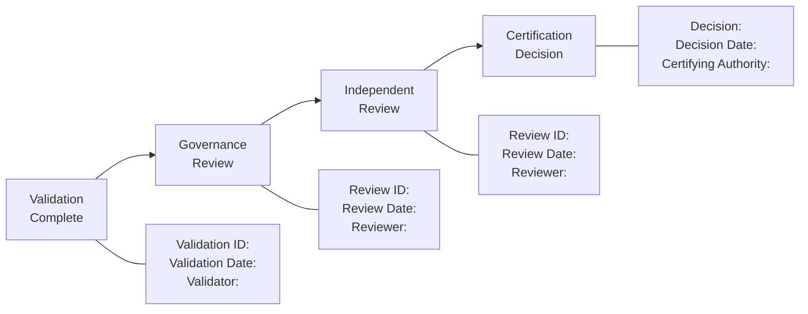

# Appendix B: Certification Templates

> **Parent Document:** [STD-000 — Framework Standards](../Standards/STD-000-Framework-Standards.md) (`AI-DOS-STD-000`)
> **Version:** 3.0.0-beta
> **Status:** Draft

---

## B.1 Purpose

This appendix provides the canonical certification templates for every Framework Standard progressing through the [Certification Workflow](../Standards/STD-000-Framework-Standards.md#15-certification). The templates are derived directly from the certification prerequisites, decision model, and record schema defined in [Section 15 — Certification](../Standards/STD-000-Framework-Standards.md#15-certification) of STD-000.

These templates ensure that every certification decision is documented, evidence-based, traceable, and governed consistently across theAI-DOS Standards Library.

---

## B.2 Template Conventions

| Convention | Description |
|:---|:---|
| **Template ID** | Unique identifier (format: `CERT-TPL-<SEQ>`). |
| **Usage** | The certification stage or decision type the template supports. |
| **Mandatory Fields** | Fields that must be populated for the certification record to be valid. |
| **Optional Fields** | Fields that may be populated when applicable. |

---

## B.3 Certification Prerequisite Verification Template

**Template ID:** `CERT-TPL-001`
**Usage:** Verify that all certification prerequisites from [Section 15 — Certification Prerequisites](../Standards/STD-000-Framework-Standards.md#15-certification) are satisfied before initiating the certification workflow.

### B.3.1 Prerequisite Checklist

| # | Prerequisite | Satisfied? | Evidence Reference | Notes |
|:---|:---|:---:|:---|:---|
| 1 | [Validation](../Standards/STD-000-Framework-Standards.md#14-validation) has been completed. | ☐ | | Validation ID: |
| 2 | All blocking validation findings have been resolved. | ☐ | | Finding resolution record: |
| 3 | Governance review has been documented. | ☐ | | Governance review ID: |
| 4 | Owner has been identified and is accountable. | ☐ | | Owner: |
| 5 | Authority has been identified and is valid. | ☐ | | Authority: |
| 6 | Complete metadata has been declared. | ☐ | | Metadata checklist reference: |
| 7 | All references are consistent and resolvable. | ☐ | | Cross-reference audit: |

### B.3.2 Prerequisite Assessment

| Field | Value |
|:---|:---|
| **Standard Identifier** | `AI-DOS-STD-___` |
| **Version** | |
| **Assessment Date** | |
| **Assessor** | |
| **All Prerequisites Met?** | ☐ Yes ☐ No |
| **Outstanding Items** | |
| **Recommendation** | Proceed to Certification / Return for Remediation |

---

## B.4 Certification Decision Template

**Template ID:** `CERT-TPL-002`
**Usage:** Document the certification decision and supporting rationale for a Framework Standard.

### B.4.1 Decision Record

| Field | Value |
|:---|:---|
| **Certification ID** | `CERT-STD-___-<SEQ>` |
| **Standard Identifier** | `AI-DOS-STD-___` |
| **Version** | |
| **Certification Date** | |
| **Certifying Authority** | |
| **Certification Decision** | ☐ Certified ☐ Certified with Conditions ☐ Deferred ☐ Rejected |

### B.4.2 Decision Rationale

| Field | Value |
|:---|:---|
| **Summary** | |
| **Constitutional Compliance** | |
| **Meta Model Alignment** | |
| **Validation Outcome** | |
| **Governance Review Outcome** | |
| **Independent Review Outcome** | |
| **Overall Assessment** | |

### B.4.3 Supporting Evidence

| Evidence ID | Description | Source | Impact on Decision |
|:---|:---|:---|:---|
| | | | |
| | | | |
| | | | |

### B.4.4 Review References

| Review ID | Reviewer | Outcome | Key Findings |
|:---|:---|:---|:---|
| | | | |
| | | | |

### B.4.5 Conditions (if Certified with Conditions)

| Condition ID | Description | Deadline | Owner | Resolution Status |
|:---|:---|:---|:---|:---|
| | | | | |
| | | | | |

### B.4.6 Deferral or Rejection Rationale (if Deferred or Rejected)

| Field | Value |
|:---|:---|
| **Reason** | |
| **Required Remediation** | |
| **Re-evaluation Criteria** | |
| **Estimated Re-evaluation Date** | |

---

## B.5 Certification Record Template

**Template ID:** `CERT-TPL-003`
**Usage:** Produce the permanent certification record that becomes part of the standard's governance history. This template consolidates all certification artifacts into the canonical record schema defined in [Section 15 — Certification Record](../Standards/STD-000-Framework-Standards.md#15-certification).

### B.5.1 Record Header

| Field | Value |
|:---|:---|
| **Certification ID** | `CERT-STD-___-<SEQ>` |
| **Standard Identifier** | `AI-DOS-STD-___` |
| **Standard Title** | |
| **Version Certified** | |
| **Certification Date** | |
| **Certifying Authority** | |
| **Decision** | |

### B.5.2 Certification Chain

*Figure B.1: Certification Chain. Each stage produces a traceable record feeding into the final certification decision.*

### B.5.3 Full Record Schema

| Field | Description | Value |
|:---|:---|:---|
| **Certification ID** | Unique identifier for this certification instance. | |
| **Standard Identifier** | The `AI-DOS-STD-*` identifier being certified. | |
| **Version** | The version of the standard being certified. | |
| **Certification Date** | Date the certification decision was made. | |
| **Certifying Authority** | The authority that approved the certification. | |
| **Decision** | Certified / Certified with Conditions / Deferred / Rejected. | |
| **Supporting Evidence** | List of evidence IDs supporting the decision. | |
| **Review References** | List of review IDs that informed the decision. | |
| **Conditions** | Conditions attached to certification (if any). | |

---

## B.6 Certification Lifecycle Tracking Template

**Template ID:** `CERT-TPL-004`
**Usage:** Track the certification status of all Framework Standards across the Standards Library.

### B.6.1 Standards Certification Status

| Standard | Identifier | Version | Lifecycle State | Validation Status | Certification Status | Certified Date | Conditions |
|:---|:---|:---|:---|:---|:---|:---|:---|
| STD-000 | `AI-DOS-STD-000` | 3.0.0-beta | Draft | — | — | — | — |
| STD-001 | `AI-DOS-STD-001` | — | Proposed | — | — | — | — |
| STD-002 | `AI-DOS-STD-002` | — | Proposed | — | — | — | — |
| STD-003 | `AI-DOS-STD-003` | — | Proposed | — | — | — | — |
| STD-004 | `AI-DOS-STD-004` | — | Proposed | — | — | — | — |
| STD-005 | `AI-DOS-STD-005` | — | Proposed | — | — | — | — |
| STD-006 | `AI-DOS-STD-006` | — | Proposed | — | — | — | — |
| STD-007 | `AI-DOS-STD-007` | — | Proposed | — | — | — | — |
| STD-008 | `AI-DOS-STD-008` | — | Proposed | — | — | — | — |

### B.6.2 Certification Decision Distribution

| Decision | Count | Standards |
|:---|:---:|:---|
| **Certified** | 0 | — |
| **Certified with Conditions** | 0 | — |
| **Deferred** | 0 | — |
| **Rejected** | 0 | — |
| **Not Yet Certified** | 9 | STD-000 through STD-008 |

---

## B.7 Condition Tracking Template

**Template ID:** `CERT-TPL-005`
**Usage:** Track and resolve conditions attached to certifications issued as "Certified with Conditions."

### B.7.1 Condition Record

| Condition ID | Certification ID | Standard | Condition Description | Owner | Deadline | Status | Resolution Date | Resolution Evidence |
|:---|:---|:---|:---|:---|:---|:---|:---|:---|
| | | | | | | Open | | |
| | | | | | | In Progress | | |
| | | | | | | Resolved | | |
| | | | | | | Overdue | | |

### B.7.2 Condition Escalation Rules

| Condition Status | Action |
|:---|:---|
| **Open** | Owner is responsible for resolution within the declared deadline. |
| **In Progress** | Active work is underway; no escalation required. |
| **Resolved** | Condition is closed with evidence; certification record is updated. |
| **Overdue** | Escalate to Framework Governance. If unresolved after governance review, escalate to Human Governance. |

---

## B.8 Recertification Template

**Template ID:** `CERT-TPL-006`
**Usage:** Govern the recertification of a Canonical or Maintenance standard following a significant change.

### B.8.1 Recertification Trigger Assessment

A recertification may be required when:

- A Minor version introduces governance-relevant changes.
- A [constitutional amendment](../Constitution/A.1-Constitution.md#18-amendment-process) affects the standard.
- The [Meta Model](../../Meta/M.0-Framework-Meta-Model.md) evolves in a way that affects the standard.
- A governance review identifies structural concerns with a canonical standard.

### B.8.2 Recertification Record

| Field | Value |
|:---|:---|
| **Recertification ID** | `RECERT-STD-___-<SEQ>` |
| **Standard Identifier** | `AI-DOS-STD-___` |
| **Previous Certification ID** | |
| **Previous Version Certified** | |
| **New Version** | |
| **Recertification Trigger** | |
| **Recertification Date** | |
| **Recertifying Authority** | |
| **Recertification Decision** | |
| **Rationale** | |
| **Evidence References** | |

---

## B.9 Relationship to Future Standards

When [STD-005 — Evidence Standard](../Standards/STD-000-Framework-Standards.md#18-references) is published, the evidence references in these templates should align with the canonical Evidence Artifact model. When [STD-006 — Identity Standard](../Standards/STD-000-Framework-Standards.md#18-references) is published, the certification identifiers defined here should be aligned with the canonical Identity model.

Until those standards are available, these templates serve as the authoritative certification reference for the Standards Library.

---

## B.10 Revision History

| Version | Date | Author | Description |
|:---|:---|:---|:---|
| 3.0.0-beta | 2026-07-04 | Framework Architecture Team | Initial release with 6 certification templates and lifecycle tracking. |
