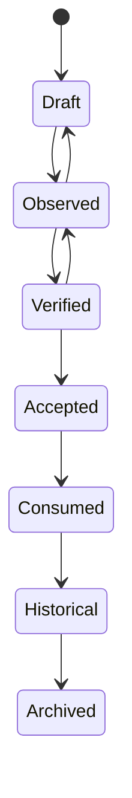

# Appendix A — Discovery Classification Catalog

> **Parent Document:** [STD-002 — Discovery Standard](../Standards/STD-002-Discovery-Standard.md) (`AI-DOS-STD-002`)
> **Version:** 1.0.0-alpha
> **Status:** Draft

---

# 1. Status

| Property | Value |
|:---|:---|
| **Document** | Appendix A — Discovery Classification Catalog |
| **Identifier** | `AI-DOS-STD-002-APP-A` |
| **Version** | 1.0.0-alpha |
| **Status** | Draft |
| **Type** | Standard Appendix |
| **Classification** | Discovery Classification Standard |
| **Authority** | STD-002 — Discovery Standard |
| **Owner** | Framework Governance |
| **Maintainers** | Framework Architecture Team |
| **Parent Standard** | STD-002 — Discovery Standard |
| **Created** | 2026-07-04 |
| **Last Updated** | 2026-07-04 |

---

## Position

This appendix defines the canonical classification system used by every Discovery artifact within theAI-DOS Framework.

It is the single authoritative source for assigning Discovery domains, discovery types, severity levels, confidence levels, ownership, lifecycle state, and classification metadata.

No Discovery record may introduce its own classification model.

All Discovery artifacts shall consume this appendix.

---

## Consumers

This appendix is consumed by:

- STD-002 Discovery Standard
- STD-003 Finding Standard
- STD-004 Recommendation Standard
- STD-005 Risk Standard
- STD-006 Evidence Standard
- Validation Engine
- Review Engine
- Certification Engine
- Runtime Engine
- Planning Engine
- AI Agents
- Swarm Runtime

---

## Produced Assets

This appendix defines:

- Discovery Domains
- Discovery Types
- Discovery Tags
- Severity Model
- Confidence Model
- Lifecycle Mapping
- Ownership Mapping
- Classification Rules
- Classification Decision Tree
- AI Classification Rules

---

## Success Criteria

This appendix is complete when:

- Every Discovery belongs to exactly one Primary Domain.
- Classification rules are deterministic.
- AI agents can classify Discoveries consistently.
- Runtime components consume the same taxonomy.
- Discovery metadata is reusable across the Framework.

# 2. Purpose

## Overview

The Discovery Classification Catalog establishes the canonical taxonomy used to classify every Discovery artifact created within theAI-DOS Framework.

Classification ensures that observations, architectural discoveries, runtime findings, governance gaps, documentation issues, and planning insights are organized consistently before they become Findings, Risks, Recommendations, or Decisions.

Without a shared classification model, Discovery records become ambiguous, duplicate concepts emerge, and downstream automation cannot reason reliably about architectural knowledge.

---

## Objectives

This appendix shall:

- Define one canonical Discovery taxonomy.
- Eliminate inconsistent classification.
- Standardize Discovery metadata.
- Enable deterministic AI classification.
- Support runtime automation.
- Improve traceability.
- Reduce ambiguity.

---

## Non-Goals

This appendix does not:

- Define Findings.
- Define Evidence.
- Define Recommendations.
- Define Risks.
- Define Runtime behavior.
- Define Validation procedures.

Those concepts are governed by their respective standards.

---

## Design Principles

The Discovery Classification Catalog follows five principles:

### One Discovery — One Primary Domain

Every Discovery shall belong to exactly one Primary Domain.

### Unlimited Secondary Tags

Additional context may be expressed through secondary tags.

### Classification Before Interpretation

Classification occurs before analysis or recommendation.

### Evidence-Based Classification

Classification shall be supported by observable evidence whenever possible.

### Framework-Wide Consistency

Every consumer of Discovery artifacts shall use the same classification model.

---

## Completion Statement

The purpose of this appendix is fulfilled when every Discovery artifact can be classified using one canonical, reusable, and governance-approved taxonomy.

# 3. Discovery Classification Philosophy

## Overview

The Discovery Classification Philosophy defines the foundational principles governing how every Discovery artifact shall be classified throughout theAI-DOS Framework.

Classification is not an administrative activity. It is an architectural responsibility that ensures Discoveries remain consistent, comparable, traceable, and reusable across all Framework components.

Every downstream process—including Findings, Evidence, Recommendations, Risks, Decisions, Validation, Certification, Runtime reasoning, AI Agents, and Swarm execution—depends upon the integrity of Discovery classification.

For this reason, classification is considered a canonical architectural concern.

---

## Philosophy Statement

A Discovery shall describe reality before it describes interpretation.

Classification exists to answer **what has been observed**, not **what should be done**.

Interpretation belongs to later stages of the Framework lifecycle.

---

## Foundational Principles

### Principle 1 — Observation Before Interpretation

A Discovery shall classify observable facts rather than assumptions.

The Discovery record shall avoid recommendations, implementation proposals, or architectural conclusions.

Those belong to subsequent Framework Standards.

---

### Principle 2 — One Primary Domain

Every Discovery shall belong to exactly one Primary Domain.

The Primary Domain represents the principal architectural responsibility affected by the Discovery.

Multiple primary domains are prohibited.

---

### Principle 3 — Unlimited Secondary Context

A Discovery may include any number of Secondary Classification Tags.

Secondary Tags provide additional context without changing the Primary Domain.

Examples include:

- performance
- security
- documentation
- governance
- migration
- compliance
- usability

Secondary Tags never replace the Primary Domain.

---

### Principle 4 — Classification Independence

Classification shall remain independent from:

- implementation technology;
- programming language;
- execution platform;
- project structure;
- repository organization.

The same Discovery shall receive the same classification regardless of implementation environment.

---

### Principle 5 — Deterministic Classification

Two qualified reviewers evaluating the same Discovery using the same evidence should assign the same Primary Domain.

Classification rules shall minimize subjective interpretation.

---

### Principle 6 — Evidence Preference

Whenever possible, every classification shall be supported by observable evidence.

Evidence may include:

- architectural documentation;
- runtime behavior;
- validation reports;
- audit findings;
- dependency analysis;
- governance records;
- execution logs.

Evidence strengthens classification confidence but does not replace professional judgment.

---

### Principle 7 — Traceability

Every Discovery shall remain traceable throughout its lifecycle.

The original classification shall remain linked to all derived artifacts, including:

- Findings
- Evidence
- Risks
- Recommendations
- Decisions
- Tasks
- Architecture Changes

Classification history shall never be lost.

---

### Principle 8 — Stability

Once a Discovery reaches the **Verified** lifecycle state, its Primary Domain shall not change unless a governance-approved reclassification occurs.

Secondary Tags may evolve as additional context becomes available.

---

### Principle 9 — AI Consistency

AI Agents shall apply the same classification rules as human reviewers.

Where confidence is insufficient, an AI Agent shall select the most probable classification and reduce the Confidence Level accordingly.

AI Agents shall never fabricate certainty.

---

### Principle 10 — Canonical Reuse

Classification models defined in this appendix shall be reused by every Framework component.

No document, project, runtime subsystem, or platform adapter may redefine Discovery Domains, Severity Levels, Confidence Levels, or Lifecycle classifications.

---

## Classification Invariants

The following invariants are mandatory.

| Invariant | Description |
|:---|:---|
| Single Primary Domain | Every Discovery has exactly one Primary Domain. |
| Canonical Taxonomy | Only the taxonomy defined in this appendix is valid. |
| Immutable Identity | Discovery identity remains stable throughout classification. |
| Traceable Evolution | All classification changes are recorded. |
| Evidence Preference | Evidence strengthens confidence. |
| Technology Neutrality | Classification never depends on implementation technology. |
| AI Alignment | Human and AI reviewers use identical classification rules. |

---

## Success Criteria

This philosophical model is considered complete when:

- Discovery classification is deterministic.
- Classification remains technology-neutral.
- AI and human reviewers reach equivalent classifications.
- Downstream standards consume a single taxonomy.
- Classification supports long-term traceability.

---

## Completion Statement

The Discovery Classification Philosophy establishes the immutable principles governing how Discovery artifacts are classified within theAI-DOS Framework.

These principles become mandatory for every consumer of STD-002 and shall remain stable unless superseded through Framework Governance.

# 4. Discovery Classification Model

## Overview

The Discovery Classification Model defines the canonical metadata structure that every Discovery artifact shall implement.

It establishes a uniform, machine-readable, and governance-controlled classification model that enables interoperability between Framework Standards, Runtime Engines, AI Agents, Validation systems, and future Platform Adapters.

The model is intentionally technology-neutral.

It defines architectural semantics rather than implementation formats.

Every Discovery artifact shall conform to this model regardless of where or how it is created.

---

## Design Goals

The Discovery Classification Model has the following objectives:

- establish a canonical metadata structure;
- ensure deterministic classification;
- support machine-readable processing;
- enable long-term traceability;
- support AI-assisted reasoning;
- minimize ambiguity;
- maximize interoperability across Framework components.

---

## Canonical Model

Every Discovery shall contain the following classification components.

```
Discovery
│
├── Identity
│
├── Classification
│   ├── Primary Domain
│   ├── Secondary Tags
│   ├── Discovery Type
│   ├── Severity
│   ├── Confidence
│
├── Governance
│   ├── Owner
│   ├── Authority
│   ├── Reviewer
│
├── Lifecycle
│
├── Relationships
│
├── Evidence
│
└── Metadata
```

The model is normative.

Consumers shall not remove mandatory components.

---

# 4.1 Identity

Every Discovery shall possess a permanent identity.

Identity remains immutable throughout the Discovery lifecycle.

### Required Identity Fields

| Field | Required | Description |
|:---|:---:|:---|
| Discovery Identifier | ✓ | Globally unique identifier. |
| Title | ✓ | Human-readable name. |
| Version | ✓ | Discovery version. |
| Status | ✓ | Current lifecycle status. |
| Created Date | ✓ | Creation timestamp. |
| Last Updated | ✓ | Most recent modification. |

Identity never changes because of classification updates.

---

# 4.2 Classification

Classification describes what the Discovery represents.

It consists of five canonical components.

| Component | Required | Cardinality |
|:---|:---:|:---:|
| Primary Domain | ✓ | Exactly one |
| Secondary Tags | Optional | Zero to many |
| Discovery Type | ✓ | Exactly one |
| Severity | ✓ | Exactly one |
| Confidence | ✓ | Exactly one |

These five fields collectively determine the architectural classification.

---

## Primary Domain

The Primary Domain identifies the principal architectural responsibility affected by the Discovery.

Exactly one Primary Domain shall be assigned.

Examples:

- Architecture
- Runtime
- Governance
- Documentation
- Validation

Primary Domain assignment shall remain stable after verification.

---

## Secondary Tags

Secondary Tags provide contextual information.

Tags may represent:

- security
- migration
- performance
- compliance
- documentation
- scalability
- usability

Tags shall never replace the Primary Domain.

---

## Discovery Type

Discovery Type defines the nature of the observation.

Examples include:

- Observation
- Gap
- Conflict
- Opportunity
- Weakness
- Constraint
- Question
- Improvement Candidate

Only one Discovery Type shall be assigned.

---

## Severity

Severity estimates the potential architectural impact if the Discovery is confirmed.

Severity is independent of Confidence.

A Discovery may have:

High Severity

and simultaneously

Low Confidence.

---

## Confidence

Confidence estimates how certain the Framework is that the Discovery accurately represents reality.

Confidence increases through additional evidence.

Confidence never represents business importance.

---

# 4.3 Governance

Every Discovery shall identify responsible governance metadata.

| Field | Required |
|:---|:---:|
| Owner | ✓ |
| Authority | ✓ |
| Reviewer | Optional |
| Approval State | Optional |

Ownership defines accountability.

Authority defines decision rights.

These concepts shall never be confused.

---

# 4.4 Lifecycle

Every Discovery participates in the canonical Discovery Lifecycle.

```
Draft

↓

Observed

↓

Verified

↓

Accepted

↓

Consumed

↓

Historical

↓

Archived
```

Lifecycle defines maturity.

It does not define correctness.

---

# 4.5 Relationships

A Discovery may participate in zero or more relationships.

Relationships include:

- Finding
- Evidence
- Risk
- Recommendation
- Decision
- Architecture Change
- Task
- Validation Report

Relationships shall remain traceable.

---

# 4.6 Evidence

Evidence strengthens Confidence.

Evidence may include:

- audit output;
- validation report;
- runtime observation;
- documentation review;
- dependency analysis;
- architecture review.

Evidence supports classification.

Evidence does not determine classification automatically.

---

# 4.7 Metadata

Metadata provides additional descriptive information.

Examples include:

| Metadata | Purpose |
|:---|:---|
| Keywords | Searchability |
| Labels | Organization |
| Source | Origin |
| Repository | Traceability |
| Project | Scope |
| Component | Ownership |
| Notes | Reviewer context |

Metadata shall never alter canonical classification.

---

# Model Constraints

The following constraints are mandatory.

| Constraint | Description |
|:---|:---|
| One Primary Domain | Mandatory |
| One Discovery Type | Mandatory |
| One Severity | Mandatory |
| One Confidence | Mandatory |
| Immutable Identity | Mandatory |
| Traceable Relationships | Mandatory |
| Canonical Lifecycle | Mandatory |
| Governance Ownership | Mandatory |

---

# Success Criteria

The Discovery Classification Model is complete when:

- every Discovery implements the canonical metadata model;
- governance metadata is explicit;
- relationships remain traceable;
- AI Agents can interpret the model deterministically;
- Runtime components consume the same metadata structure.

---

## Completion Statement

The Discovery Classification Model establishes the canonical metadata architecture for every Discovery artifact within theAI-DOS Framework.

All subsequent Framework Standards shall consume this model rather than redefining Discovery metadata.

# 5. Primary Discovery Domains

## Overview

Primary Discovery Domains define the principal architectural responsibility to which a Discovery belongs.

Every Discovery shall be assigned exactly one Primary Domain.

The Primary Domain identifies **what area of the Framework is primarily affected**, not where the Discovery was found.

For example, a Discovery observed during Runtime validation may still belong to the **Architecture** domain if the root cause is architectural rather than operational.

Primary Domains establish:

- ownership;
- governance authority;
- downstream routing;
- reporting structure;
- metrics aggregation;
- lifecycle responsibility.

They are therefore considered canonical Framework concepts.

---

# Domain Selection Rules

A Discovery shall:

- have exactly one Primary Domain;
- select the domain representing the root architectural responsibility;
- remain in that domain after verification unless formally reclassified.

Multiple Primary Domains are prohibited.

Secondary Tags shall be used whenever additional context is required.

---

# Primary Domain Catalog

## DISC-ARCH — Architecture

| Property | Value |
|:---|:---|
| Identifier | DISC-ARCH |
| Name | Architecture |
| Owner | Framework Architecture |
| Authority | Framework Governance |
| Lifecycle | Canonical |
| Consumers | Architecture Documents, Runtime, Validation |

### Purpose

Represents Discoveries related to architectural structure, design principles, boundaries, layering, ownership, dependency direction, and architectural integrity.

### Typical Examples

- Circular dependency detected
- Ownership violation
- Layer boundary violation
- Duplicate architecture
- Missing abstraction
- Architectural inconsistency

### Typical Consumers

- Architecture Team
- Runtime Team
- Governance
- Validation Engine

---

## DISC-RUNTIME — Runtime

| Property | Value |
|:---|:---|
| Identifier | DISC-RUNTIME |
| Name | Runtime |
| Owner | Runtime Architecture |
| Authority | Framework Governance |

### Purpose

Represents Discoveries related to execution behavior, runtime lifecycle, orchestration, engine behavior, scheduling, execution flow, and runtime coordination.

### Typical Examples

- Runtime deadlock
- Invalid execution order
- State transition issue
- Lifecycle inconsistency
- Engine synchronization problem

---

## DISC-GOV — Governance

| Property | Value |
|:---|:---|
| Identifier | DISC-GOV |
| Name | Governance |
| Owner | Framework Governance |
| Authority | Human Governance |

### Purpose

Represents Discoveries affecting governance policies, authority boundaries, approval chains, constitutional compliance, and governance processes.

### Typical Examples

- Missing approval
- Authority conflict
- Policy inconsistency
- Governance gap
- Missing accountability

---

## DISC-PLAN — Planning

| Property | Value |
|:---|:---|
| Identifier | DISC-PLAN |
| Name | Planning |
| Owner | Planning System |

### Purpose

Planning hierarchy, milestones, roadmap integrity, dependency sequencing, delivery strategy, and planning consistency.

### Examples

- Missing milestone
- Invalid dependency
- Circular roadmap
- Incomplete phase

---

## DISC-DOC — Documentation

| Property | Value |
|:---|:---|
| Identifier | DISC-DOC |
| Name | Documentation |
| Owner | Documentation Architecture |

### Purpose

Documentation quality, completeness, consistency, traceability, and canonical documentation structure.

### Examples

- Missing document
- Broken reference
- Duplicate definition
- Inconsistent terminology
- Missing appendix

---

## DISC-VAL — Validation

| Property | Value |
|:---|:---|
| Identifier | DISC-VAL |
| Name | Validation |
| Owner | Validation Framework |

### Purpose

Validation rules, quality gates, verification models, compliance checks, automated validation behavior.

---

## DISC-RISK — Risk

| Property | Value |
|:---|:---|
| Identifier | DISC-RISK |
| Name | Risk |
| Owner | Risk Management |

### Purpose

Potential threats discovered before they become managed Risk artifacts.

Examples include architectural, governance, operational, and strategic risks.

---

## DISC-SEC — Security

| Property | Value |
|:---|:---|
| Identifier | DISC-SEC |
| Name | Security |
| Owner | Security Governance |

### Purpose

Security-related observations affecting confidentiality, integrity, availability, authorization, authentication, or auditability.

---

## DISC-DEP — Dependency

| Property | Value |
|:---|:---|
| Identifier | DISC-DEP |
| Name | Dependency |
| Owner | Architecture |

### Purpose

Dependency graphs, coupling, dependency direction, hidden dependencies, cyclic dependencies, and dependency violations.

---

## DISC-OWN — Ownership

| Property | Value |
|:---|:---|
| Identifier | DISC-OWN |
| Name | Ownership |
| Owner | Governance |

### Purpose

Ownership boundaries, responsibility assignment, accountability, and ownership integrity.

---

## DISC-PERF — Performance

Performance bottlenecks, scalability observations, execution efficiency, resource utilization.

---

## DISC-COMP — Compliance

Compliance against constitutional rules, standards, governance requirements, and regulatory obligations.

---

## DISC-META — Meta Model

Discoveries affecting the Framework Meta Model, identity concepts, lifecycle definitions, relationships, metadata structures, and canonical abstractions.

---

## DISC-PLATFORM — Platform

Platform adapters, integrations, operating environments, platform-specific behavior.

---

## DISC-API — API

API contracts, interfaces, service boundaries, interoperability, protocol definitions.

---

## DISC-AGENT — Agent

Agent behavior, reasoning quality, delegation, authority compliance, execution integrity.

---

## DISC-SWARM — Swarm

Multi-agent collaboration, orchestration, coordination, conflict resolution, distributed execution.

---

## DISC-KNOWLEDGE — Knowledge

Knowledge graph, semantic consistency, ontology, retrieval quality, knowledge governance.

---

## DISC-MEMORY — Memory

Persistent memory, contextual memory, retrieval behavior, retention policies.

---

## DISC-CONTEXT — Context

Context acquisition, context propagation, context integrity, contextual reasoning.

---

# Domain Selection Guidelines

When multiple domains appear applicable:

1. Identify the root architectural responsibility.
2. Select that domain as Primary.
3. Represent every additional concern using Secondary Tags.
4. Never assign multiple Primary Domains.

---

# Success Criteria

The Primary Domain Catalog is complete when:

- every Discovery can be classified into exactly one domain;
- every domain has explicit ownership;
- governance authority is defined;
- downstream consumers are identifiable;
- routing decisions become deterministic.

---

## Completion Statement

The Primary Discovery Domain Catalog establishes the canonical architectural classification system for every Discovery artifact within theAI-DOS Framework.

Every future Framework Standard consuming Discovery artifacts shall reference this catalog instead of defining alternative domain taxonomies.

# 6. Secondary Classification Tags

## Overview

Secondary Classification Tags provide additional semantic context for a Discovery without changing its Primary Domain.

While the Primary Domain answers the question:

> **"What architectural area is primarily affected?"**

Secondary Tags answer:

> **"What characteristics describe this Discovery?"**

Tags improve discoverability, reporting, filtering, analytics, AI reasoning, and cross-domain traceability.

Secondary Tags shall never replace, override, or redefine the Primary Domain.

---

# Design Objectives

The Secondary Tag model shall:

- enrich Discovery metadata;
- improve semantic search;
- support AI reasoning;
- enable advanced reporting;
- facilitate cross-domain analysis;
- preserve Primary Domain integrity.

---

# Tag Classification Model

Every Secondary Tag belongs to exactly one Tag Category.

```

Secondary Tag

│

├── Category

├── Identifier

├── Display Name

├── Description

├── Lifecycle

├── Allowed Domains

└── Governance Owner

```

---

# Tag Categories

The Framework defines the following canonical categories.

| Category | Purpose |
|:---|:---|
| Architecture | Architectural characteristics |
| Runtime | Runtime behavior |
| Governance | Governance concerns |
| Documentation | Documentation quality |
| Validation | Validation context |
| Compliance | Compliance status |
| Performance | Performance characteristics |
| Security | Security implications |
| Quality | Software quality |
| Lifecycle | Lifecycle context |
| Migration | Migration activities |
| Dependency | Dependency information |
| Ownership | Responsibility information |
| Integration | External integrations |
| Metadata | Metadata quality |
| AI | AI reasoning context |

---

# Architecture Tags

| Identifier | Description |
|:---|:---|
| duplicate | Duplicate architecture |
| coupling | Excessive coupling |
| abstraction | Abstraction concern |
| modularity | Modularity issue |
| layering | Layering concern |
| boundary | Boundary violation |
| dependency | Dependency concern |

---

# Runtime Tags

| Identifier | Description |
|:---|:---|
| lifecycle | Lifecycle issue |
| execution | Execution concern |
| scheduling | Scheduling |
| orchestration | Orchestration |
| concurrency | Concurrent execution |
| synchronization | Synchronization |
| state | State management |

---

# Governance Tags

| Identifier | Description |
|:---|:---|
| authority | Authority concern |
| ownership | Ownership issue |
| policy | Policy issue |
| approval | Approval process |
| accountability | Accountability |
| governance-gap | Governance gap |

---

# Documentation Tags

| Identifier | Description |
|:---|:---|
| missing | Missing documentation |
| duplicate | Duplicate content |
| obsolete | Obsolete documentation |
| reference | Broken reference |
| terminology | Terminology inconsistency |
| formatting | Formatting issue |

---

# Validation Tags

| Identifier | Description |
|:---|:---|
| validation |
| verification |
| certification |
| review |
| audit |
| compliance-check |

---

# Compliance Tags

| Identifier |
|:---|
| constitutional |
| standard |
| governance |
| policy |
| regulatory |

---

# Performance Tags

| Identifier |
|:---|
| latency |
| scalability |
| throughput |
| optimization |
| bottleneck |

---

# Security Tags

| Identifier |
|:---|
| authentication |
| authorization |
| encryption |
| integrity |
| confidentiality |
| availability |

---

# AI Tags

| Identifier |
|:---|
| hallucination |
| ambiguity |
| confidence |
| reasoning |
| memory |
| context |
| planning |
| delegation |

---

# Lifecycle Tags

| Identifier |
|:---|
| draft |
| verified |
| accepted |
| historical |
| archived |

---

# Migration Tags

| Identifier |
|:---|
| breaking-change |
| migration |
| backward-compatible |
| deprecated |
| replacement |

---

# Tag Assignment Rules

A Discovery:

- may contain zero or more Secondary Tags;
- shall not contain duplicate tags;
- shall not redefine Primary Domain;
- shall only use canonical tags.

---

# Allowed Combinations

Example:

Primary Domain

Architecture

Allowed Tags

- dependency
- abstraction
- coupling
- modularity
- scalability
- migration

---

Primary Domain

Runtime

Allowed Tags

- execution
- concurrency
- lifecycle
- performance

---

# Forbidden Combinations

The following combinations are invalid.

| Combination | Reason |
|:---|:---|
| Two identical tags | Duplicate metadata |
| Unknown tag | Non-canonical |
| Primary Domain used as tag | Classification duplication |
| Historical + Draft | Conflicting lifecycle |
| Deprecated + Canonical | Conflicting status |

---

# Tag Normalization

Tags shall:

- use lowercase;
- use kebab-case;
- avoid abbreviations;
- remain technology-neutral;
- remain implementation-independent.

Examples:

Correct

```
breaking-change
```

Incorrect

```
BreakingChange
```

Incorrect

```
BREAKING_CHANGE
```

---

# AI Tagging Rules

AI Agents shall:

- infer tags only from available evidence;
- never invent tags;
- use canonical identifiers;
- prefer fewer tags over excessive tagging;
- reduce Confidence when tagging uncertainty exists.

---

# Governance

Framework Governance owns:

- Tag definitions
- Tag lifecycle
- Tag deprecation
- Tag additions
- Tag removal

Projects may introduce local tags only through approved Extension Standards.

---

# Success Criteria

The Secondary Tag model is complete when:

- every tag belongs to a category;
- tag identifiers are canonical;
- AI tagging is deterministic;
- reporting uses common metadata;
- duplicate taxonomies no longer exist.

---

## Completion Statement

The Secondary Classification Tag Model establishes the canonical semantic enrichment system for Discovery artifacts.

It complements Primary Domains while preserving deterministic classification across theAI-DOS Framework.

# 7. Discovery Types

## Overview

Discovery Types define the fundamental nature of a Discovery.

While the Primary Domain answers:

> "Where does this Discovery belong?"

the Discovery Type answers:

> "What kind of Discovery is this?"

Discovery Types describe the architectural intent of the observation rather than its impact, confidence, ownership, or lifecycle.

Every Discovery shall declare exactly one Discovery Type.

---

# Design Objectives

The Discovery Type model shall:

- classify observations consistently;
- eliminate ambiguous interpretation;
- support automated routing;
- improve AI reasoning;
- simplify reporting;
- enable deterministic downstream processing.

---

# Canonical Discovery Type Model

Each Discovery Type defines:

- Purpose
- Typical Characteristics
- Typical Outputs
- Common Consumers
- AI Classification Guidance

---

# Type Selection Rules

Every Discovery:

- shall contain exactly one Discovery Type;
- shall select the type representing the primary observation;
- shall not change type after verification unless governance approves reclassification.

---

# Discovery Type Catalog

## OBSERVATION

### Identifier

DISC-TYPE-OBS

### Purpose

Represents a neutral observation.

No architectural conclusion has yet been reached.

### Characteristics

- factual
- descriptive
- unbiased
- evidence-oriented

### Typical Examples

- undocumented behavior
- unexpected output
- inconsistent naming
- missing metadata

### Typical Outputs

- Finding
- Evidence request
- Validation

---

## GAP

### Identifier

DISC-TYPE-GAP

### Purpose

Represents something expected but currently absent.

### Examples

- missing documentation
- missing validation
- missing ownership
- missing authority
- missing relationship

### Typical Outputs

- Recommendation
- Task
- Improvement

---

## CONFLICT

### Identifier

DISC-TYPE-CONFLICT

### Purpose

Represents incompatible definitions, behaviors, responsibilities, or architectural decisions.

### Examples

- duplicate authority
- conflicting standards
- conflicting terminology
- incompatible lifecycle

### Typical Outputs

- Architecture Review
- Governance Review
- Decision Record

---

## CONSTRAINT

### Identifier

DISC-TYPE-CONSTRAINT

### Purpose

Represents an architectural limitation that influences future design decisions.

### Examples

- constitutional limitation
- platform limitation
- runtime limitation
- technology-neutral requirement

### Typical Outputs

- Design Decision
- Architecture Update

---

## OPPORTUNITY

### Identifier

DISC-TYPE-OPPORTUNITY

### Purpose

Represents an opportunity to improve the Framework.

Opportunities are not defects.

They identify possible evolution.

### Examples

- reusable abstraction
- simplification
- automation
- standardization

### Typical Outputs

- Recommendation
- Roadmap Item
- Improvement Proposal

---

## WEAKNESS

### Identifier

DISC-TYPE-WEAKNESS

### Purpose

Represents a fragile or insufficient architectural characteristic.

The system still functions but quality is degraded.

### Examples

- weak ownership
- weak validation
- insufficient documentation
- excessive coupling

---

## DEFECT

### Identifier

DISC-TYPE-DEFECT

### Purpose

Represents confirmed incorrect behavior.

Unlike an Observation, a Defect has already been verified.

### Examples

- broken dependency
- invalid lifecycle
- runtime failure
- inconsistent metadata

### Typical Outputs

- Finding
- Risk
- Corrective Action

---

## IMPROVEMENT

### Identifier

DISC-TYPE-IMPROVEMENT

### Purpose

Represents a possible enhancement rather than correction.

### Examples

- simplify workflow
- improve documentation
- reduce complexity
- improve automation

---

## QUESTION

### Identifier

DISC-TYPE-QUESTION

### Purpose

Represents uncertainty requiring investigation.

Questions do not imply defects.

### Examples

- unclear ownership
- ambiguous requirement
- unknown dependency

### Typical Outputs

- Investigation
- Evidence Collection

---

## HYPOTHESIS

### Identifier

DISC-TYPE-HYPOTHESIS

### Purpose

Represents an assumption requiring validation.

Hypotheses shall never become Findings without supporting evidence.

### Examples

- suspected performance issue
- possible governance conflict
- likely architectural duplication

---

# Type Comparison Matrix

| Type | Evidence Required | May Produce Finding | May Produce Recommendation |
|:---|:---:|:---:|:---:|
| Observation | Optional | ✓ | ✓ |
| Gap | Optional | ✓ | ✓ |
| Conflict | Recommended | ✓ | ✓ |
| Constraint | Recommended | ✓ | ✓ |
| Opportunity | Optional | — | ✓ |
| Weakness | Recommended | ✓ | ✓ |
| Defect | Mandatory | ✓ | ✓ |
| Improvement | Optional | — | ✓ |
| Question | No | — | — |
| Hypothesis | Mandatory | After validation | After validation |

---

# AI Classification Rules

AI Agents shall classify Discovery Types using the following precedence:

1. Defect
2. Conflict
3. Gap
4. Weakness
5. Observation
6. Constraint
7. Opportunity
8. Improvement
9. Hypothesis
10. Question

If uncertainty exists between two adjacent types, the Agent shall:

- select the less assertive type;
- reduce Confidence Level;
- request additional evidence where appropriate.

---

# Routing Matrix

| Discovery Type | Typical Next Artifact |
|:---|:---|
| Observation | Finding |
| Gap | Recommendation |
| Conflict | Governance Review |
| Constraint | Architecture Decision |
| Opportunity | Recommendation |
| Weakness | Risk Assessment |
| Defect | Finding |
| Improvement | Improvement Proposal |
| Question | Investigation |
| Hypothesis | Validation |

---

# Constraints

The following rules are mandatory.

- A Discovery shall have exactly one Discovery Type.
- Discovery Type shall not encode Severity.
- Discovery Type shall not encode Confidence.
- Discovery Type shall not encode Lifecycle.
- Discovery Type shall not replace Primary Domain.

---

# Success Criteria

The Discovery Type model is complete when:

- every Discovery has one deterministic type;
- AI Agents classify types consistently;
- downstream standards reuse the same type catalog;
- routing decisions become predictable.

---

## Completion Statement

The Discovery Type Catalog establishes the canonical semantic classification for the nature of every Discovery.

All subsequent Framework Standards shall consume this catalog rather than defining independent Discovery types.

# 8. Severity Model

## Overview

The Severity Model defines the architectural impact of a Discovery if the observation is determined to be valid.

Severity measures the **potential consequence** of the Discovery.

It does **not** measure:

- certainty;
- urgency;
- implementation priority;
- business value.

Those concerns are governed by independent Framework models.

---

# Design Objectives

The Severity Model shall:

- standardize impact assessment;
- enable deterministic routing;
- support AI-assisted reasoning;
- provide consistent governance reporting;
- remain independent from Confidence and Priority.

---

# Severity Principles

The following principles govern severity classification.

### Principle 1 — Impact, Not Certainty

Severity measures impact.

Confidence measures certainty.

These two concepts shall never be confused.

Example

A Discovery may have:

High Severity

Low Confidence

when a potentially critical architectural issue has not yet been verified.

---

### Principle 2 — Technology Neutral

Severity shall describe architectural consequences rather than implementation-specific effects.

---

### Principle 3 — Stable Classification

Severity should remain stable unless new evidence demonstrates a materially different impact.

---

### Principle 4 — Independent Assessment

Severity shall be determined independently from:

- Priority
- Confidence
- Risk
- Lifecycle
- Discovery Type

---

# Severity Levels

The Framework defines seven canonical severity levels.

```
None

↓

Informational

↓

Low

↓

Moderate

↓

High

↓

Critical

↓

Framework Critical
```

---

# SEV-0 — None

Identifier

SEV-0

Purpose

No measurable architectural impact.

Examples

- editorial improvement
- formatting inconsistency
- optional metadata

Typical Routing

Documentation only.

---

# SEV-1 — Informational

Identifier

SEV-1

Purpose

Architecturally relevant information.

No corrective action required.

Examples

- additional clarification
- useful observation
- future consideration

---

# SEV-2 — Low

Identifier

SEV-2

Purpose

Minor architectural concern.

Localized impact.

No significant downstream consequences.

Examples

- isolated terminology issue
- documentation enhancement

---

# SEV-3 — Moderate

Identifier

SEV-3

Purpose

Noticeable architectural degradation.

Requires review.

Examples

- duplicated ownership
- incomplete validation
- weak abstraction

---

# SEV-4 — High

Identifier

SEV-4

Purpose

Significant architectural concern.

Multiple Framework components are affected.

Examples

- dependency violation
- governance inconsistency
- runtime instability

---

# SEV-5 — Critical

Identifier

SEV-5

Purpose

Major architectural integrity issue.

Framework correctness is threatened.

Examples

- constitutional conflict
- invalid authority chain
- lifecycle corruption
- broken canonical model

---

# SEV-6 — Framework Critical

Identifier

SEV-6

Purpose

Threatens the integrity of theAI-DOS Framework itself.

Human Governance involvement becomes mandatory.

Examples

- multiple canonical truths
- constitutional violation
- corrupted meta model
- broken framework identity
- compromised governance

---

# Severity Matrix

| Severity | Local Impact | Cross-System Impact | Human Review |
|:---|:---:|:---:|:---:|
| None | ✓ | — | — |
| Informational | ✓ | — | — |
| Low | ✓ | — | Optional |
| Moderate | ✓ | Limited | Recommended |
| High | Multiple Components | ✓ | Required |
| Critical | Framework Layer | ✓ | Mandatory |
| Framework Critical | Entire Framework | ✓ | Human Governance |

---

# Severity Escalation

Severity may increase when:

- additional evidence appears;
- broader impact is discovered;
- constitutional implications emerge;
- downstream dependencies increase.

Severity shall never increase merely because implementation has been delayed.

---

# Severity Reduction

Severity may decrease when:

- evidence disproves impact;
- architectural scope is reduced;
- affected consumers are fewer than originally believed.

Every reduction shall preserve traceability.

---

# Relationship to Other Models

Severity interacts with several Framework concepts but remains independent.

| Model | Relationship |
|:---|:---|
| Confidence | Independent |
| Priority | Independent |
| Risk | May influence Risk |
| Finding | Consumed by Finding |
| Recommendation | May influence recommendation urgency |
| Decision | Provides impact context |

---

# AI Severity Rules

AI Agents shall classify Severity using observable architectural impact only.

Agents shall never:

- infer business urgency;
- estimate implementation effort;
- invent framework-wide consequences.

If insufficient evidence exists, the Agent shall lower the Confidence Level rather than lowering Severity.

---

# Validation Rules

Validation shall verify:

- Severity exists.
- Severity identifier is canonical.
- Severity matches documented impact.
- Severity is independent from Confidence.

---

# Constraints

The following are prohibited.

- Multiple Severity Levels.
- Undefined Severity.
- Severity based solely on opinion.
- Technology-specific Severity definitions.
- Priority encoded as Severity.

---

# Success Criteria

The Severity Model is complete when:

- every Discovery has one Severity Level;
- AI Agents classify severity consistently;
- governance reports become comparable;
- downstream standards reuse the same severity catalog.

---

## Completion Statement

The Severity Model establishes the canonical architectural impact classification for Discovery artifacts.

It provides a technology-neutral, governance-controlled assessment of impact while remaining independent from Confidence, Priority, Risk, and Lifecycle.

# 9. Confidence Model

## Overview

The Confidence Model defines the degree of certainty that a Discovery accurately represents reality.

Unlike Severity, which measures architectural impact, Confidence measures evidential certainty.

Confidence answers the question:

> **"How certain are we that this Discovery is correct?"**

It does not evaluate:

- architectural importance;
- implementation priority;
- governance urgency;
- business value.

Confidence exists solely to express the maturity and reliability of available evidence.

---

# Design Objectives

The Confidence Model shall:

- standardize evidential certainty;
- support AI-assisted reasoning;
- enable deterministic decision making;
- distinguish assumptions from verified knowledge;
- improve governance transparency.

---

# Fundamental Principles

## Principle 1 — Evidence Before Confidence

Confidence shall increase only through evidence.

Opinions, assumptions, intuition, or historical preference shall never increase Confidence.

---

## Principle 2 — Independent Assessment

Confidence is independent from:

- Severity
- Priority
- Risk
- Lifecycle
- Discovery Type

A Discovery may simultaneously have:

- Framework Critical Severity
- Observed Confidence

if evidence remains incomplete.

---

## Principle 3 — Continuous Evolution

Confidence is expected to evolve.

As additional evidence becomes available, Confidence may increase or decrease.

The history of Confidence changes shall remain traceable.

---

## Principle 4 — No Artificial Certainty

AI Agents shall never inflate Confidence.

If uncertainty exists, the Agent shall choose the lower Confidence Level.

---

# Confidence Lifecycle

```
Observed

↓

Likely

↓

Supported

↓

Verified

↓

Confirmed

↓

Canonical
```

Confidence always moves toward stronger evidence.

It never increases because of elapsed time.

---

# CONF-0 — Observed

Identifier

CONF-0

Purpose

Initial observation.

Very limited evidence exists.

Typical Sources

- visual inspection
- first observation
- isolated report
- preliminary review

Typical Usage

New Discovery records.

---

# CONF-1 — Likely

Identifier

CONF-1

Purpose

Evidence suggests the Discovery is probably correct.

Additional validation is still required.

Typical Sources

- repeated observations
- architectural review
- preliminary validation

---

# CONF-2 — Supported

Identifier

CONF-2

Purpose

Multiple independent evidence sources support the Discovery.

The likelihood of error becomes low.

Typical Sources

- documentation
- runtime logs
- dependency analysis
- validation reports

---

# CONF-3 — Verified

Identifier

CONF-3

Purpose

Evidence has been independently validated.

Independent reviewers reach the same conclusion.

Verification procedures have completed successfully.

---

# CONF-4 — Confirmed

Identifier

CONF-4

Purpose

Framework Governance accepts the Discovery as correct.

Remaining uncertainty is negligible.

---

# CONF-5 — Canonical

Identifier

CONF-5

Purpose

The Discovery has become canonical Framework knowledge.

It may now be consumed by:

- Standards
- Runtime
- Validation
- Certification
- AI Agents
- Swarm Runtime

Canonical Confidence represents Framework Truth.

---

# Confidence Matrix

| Confidence | Evidence | Independent Review | Governance |
|:---|:---:|:---:|:---:|
| Observed | Minimal | — | — |
| Likely | Limited | Optional | — |
| Supported | Multiple Sources | Recommended | — |
| Verified | Strong | Required | Optional |
| Confirmed | Complete | Required | Required |
| Canonical | Complete | Complete | Approved |

---

# Confidence Evolution

Confidence may increase when:

- additional evidence appears;
- independent validation succeeds;
- reviewers reach consensus;
- governance approves the Discovery.

Confidence may decrease when:

- evidence becomes invalid;
- conflicting evidence appears;
- assumptions are disproved;
- source credibility decreases.

---

# AI Confidence Rules

AI Agents shall:

- derive Confidence only from observable evidence;
- prefer lower Confidence over unsupported certainty;
- explicitly identify missing evidence;
- request additional validation when required.

AI Agents shall never:

- fabricate evidence;
- assume confirmation;
- promote a Discovery to Canonical.

Only Human Governance may approve Canonical Confidence.

---

# Relationship to Other Models

| Model | Relationship |
|:---|:---|
| Severity | Independent |
| Discovery Type | Independent |
| Lifecycle | Complementary |
| Evidence | Primary input |
| Validation | Confidence increases after validation |
| Review | Independent review strengthens confidence |
| Certification | May require minimum Confidence |

---

# Validation Rules

Validation shall verify:

- Confidence Level exists.
- Confidence identifier is canonical.
- Confidence matches available evidence.
- Evidence references are traceable.
- Confidence history is preserved.

---

# Constraints

The following are prohibited.

- Multiple Confidence Levels.
- Confidence without evidence.
- Artificially inflated Confidence.
- Canonical Confidence without Governance approval.
- Technology-specific Confidence definitions.

---

# Success Criteria

The Confidence Model is complete when:

- every Discovery has one Confidence Level;
- Confidence is evidence-driven;
- AI Agents classify Confidence consistently;
- governance decisions become traceable;
- downstream standards consume the same Confidence model.

---

## Completion Statement

The Confidence Model establishes the canonical measure of evidential certainty for Discovery artifacts.

It enables trustworthy AI-assisted reasoning while preserving transparency, traceability, and governance throughout theAI-DOS Framework.

# 10. Discovery Ownership Model

## Overview

The Discovery Ownership Model defines the governance responsibilities associated with every Discovery artifact.

Ownership is not limited to identifying who created a Discovery.

Instead, it establishes a complete accountability model covering creation, maintenance, validation, governance, consumption, and long-term stewardship.

Every Discovery shall explicitly declare its governance responsibilities using this model.

---

# Design Objectives

The Ownership Model shall:

- establish explicit accountability;
- separate authority from responsibility;
- support governance workflows;
- enable AI-assisted routing;
- eliminate ownership ambiguity;
- provide long-term maintainability.

---

# Ownership Philosophy

Ownership answers the question:

> **"Who is responsible for this Discovery?"**

Authority answers:

> **"Who has the right to make decisions?"**

These concepts shall never be treated as equivalent.

Similarly,

Stewardship,

Maintenance,

Review,

and Consumption

represent independent governance responsibilities.

---

# Governance Role Model

Every Discovery may involve multiple governance roles.

```
Discovery

│

├── Owner

├── Authority

├── Steward

├── Maintainer

├── Reviewer

└── Consumer
```

Each role has clearly defined responsibilities.

---

# Owner

## Purpose

The Owner is accountable for the Discovery throughout its lifecycle.

Ownership includes:

- completeness;
- correctness;
- metadata quality;
- lifecycle progression;
- relationship integrity.

Only one Owner shall exist.

---

## Responsibilities

The Owner shall:

- create the Discovery;
- maintain metadata;
- ensure traceability;
- initiate validation;
- coordinate reviews;
- request lifecycle transitions.

---

## Constraints

The Owner:

- may delegate execution;
- shall not delegate accountability.

---

# Authority

## Purpose

Authority defines decision rights.

Authority determines who may:

- approve;
- reject;
- archive;
- reclassify;
- promote.

Authority does not imply ownership.

---

## Examples

Authority may belong to:

- Framework Governance
- Architecture Board
- Runtime Governance
- Human Governance

depending on Discovery scope.

---

# Steward

## Purpose

The Steward preserves long-term quality.

Stewardship focuses on:

- consistency;
- canonical alignment;
- taxonomy integrity;
- governance compliance.

The Steward is not necessarily the Owner.

---

# Maintainer

## Purpose

The Maintainer performs operational updates.

Responsibilities include:

- metadata updates;
- reference maintenance;
- documentation improvements;
- relationship synchronization.

Maintainers execute work on behalf of the Owner.

---

# Reviewer

## Purpose

Reviewers independently assess the Discovery.

Reviewers evaluate:

- evidence;
- classification;
- severity;
- confidence;
- completeness.

Reviewers shall remain independent whenever practical.

---

# Consumer

## Purpose

Consumers reuse Discovery information.

Consumers include:

- Findings
- Evidence
- Risks
- Recommendations
- Runtime
- Validation
- Certification
- AI Agents
- Swarm Runtime

Consumers shall never modify Discovery ownership.

---

# Ownership Matrix

| Role | Accountability | Decision Rights | Operational Work |
|:---|:---:|:---:|:---:|
| Owner | ✓ | Limited | ✓ |
| Authority | — | ✓ | — |
| Steward | Shared | Advisory | ✓ |
| Maintainer | — | — | ✓ |
| Reviewer | Independent | Advisory | ✓ |
| Consumer | — | — | Read Only |

---

# Ownership Lifecycle

Ownership responsibilities evolve with the Discovery lifecycle.

| Lifecycle | Primary Responsible Role |
|:---|:---|
| Draft | Owner |
| Observed | Owner |
| Verified | Reviewer |
| Accepted | Authority |
| Consumed | Steward |
| Historical | Steward |
| Archived | Authority |

Ownership itself remains stable unless governance approves reassignment.

---

# Ownership Delegation

Execution responsibilities may be delegated.

Accountability shall never be delegated.

Examples:

Owner delegates metadata updates to a Maintainer.

Authority delegates review scheduling to Governance Operations.

Neither delegation changes accountability.

---

# Ownership Constraints

The following are prohibited.

- Multiple Owners.
- Undefined Authority.
- Anonymous ownership.
- Authority without governance.
- Reviewer acting as final Authority.
- Consumer modifying ownership metadata.

---

# AI Ownership Rules

AI Agents may:

- recommend Owners;
- identify missing ownership;
- propose governance routing;
- detect ownership conflicts.

AI Agents shall never:

- assign final ownership;
- replace Human Governance;
- approve ownership changes.

Ownership changes require governance approval.

---

# Validation Rules

Validation shall verify:

- exactly one Owner exists;
- Authority is declared;
- governance roles are valid;
- lifecycle responsibilities are consistent;
- ownership relationships remain traceable.

---

# Success Criteria

The Ownership Model is complete when:

- every Discovery has one accountable Owner;
- Authority is explicitly declared;
- governance roles are unambiguous;
- AI Agents can reason about ownership consistently;
- downstream standards reuse the same governance model.

---

## Completion Statement

The Discovery Ownership Model establishes the canonical governance responsibility model for Discovery artifacts.

It separates accountability, authority, stewardship, maintenance, review, and consumption into explicit architectural roles, ensuring consistent governance across theAI-DOS Framework.

# 11. Discovery Lifecycle State Machine

## Overview

The Discovery Lifecycle State Machine defines the canonical lifecycle governing every Discovery artifact within theAI-DOS Framework.

Unlike a simple lifecycle diagram, the State Machine defines:

- valid states;
- legal transitions;
- prohibited transitions;
- transition authorities;
- transition evidence requirements;
- AI transition rules.

Every Discovery shall comply with this lifecycle.

---

# Design Objectives

The Lifecycle State Machine shall:

- provide deterministic lifecycle behavior;
- support governance workflows;
- enable AI-assisted progression;
- preserve traceability;
- eliminate invalid state transitions.

---

# Lifecycle States

The Framework defines seven canonical lifecycle states.

```

Draft

↓

Observed

↓

Verified

↓

Accepted

↓

Consumed

↓

Historical

↓

Archived

```

Each state represents a governance milestone rather than implementation progress.

---

# STATE-01 — Draft

## Purpose

The Discovery has been created but has not yet been observed or evaluated.

Typical Characteristics

- initial metadata
- incomplete evidence
- editable classification
- working state

Allowed Transitions

- Draft → Observed

Forbidden Transitions

- Draft → Accepted
- Draft → Historical
- Draft → Archived

Responsible Role

Owner

---

# STATE-02 — Observed

## Purpose

An observable architectural fact has been recorded.

Evidence collection has begun.

Characteristics

- initial evidence
- preliminary classification
- severity assigned
- confidence established

Allowed Transitions

- Observed → Verified

- Observed → Draft

Allowed only before review completion.

---

# STATE-03 — Verified

## Purpose

Evidence has been independently validated.

Characteristics

- reviewer approved
- evidence sufficient
- classification stable

Allowed Transitions

Verified →

Accepted

Verified →

Observed

Only when contradictory evidence appears.

---

# STATE-04 — Accepted

## Purpose

Framework Governance accepts the Discovery as valid.

The Discovery becomes eligible for consumption.

Characteristics

- governance approval
- official routing
- downstream consumers enabled

Allowed Transitions

Accepted →

Consumed

Accepted →

Historical

---

# STATE-05 — Consumed

## Purpose

The Discovery has produced one or more downstream artifacts.

Examples

Finding

Risk

Recommendation

Decision

Task

Architecture Change

Characteristics

- traceability complete
- reusable knowledge
- governance complete

---

# STATE-06 — Historical

## Purpose

The Discovery remains historically valuable but is no longer active.

Characteristics

- read-only
- preserved
- searchable

Allowed Transition

Historical →

Archived

---

# STATE-07 — Archived

## Purpose

The Discovery is permanently archived.

Characteristics

- immutable
- retained
- historical only

No outgoing transitions.

---

# Lifecycle Diagram



---

# Transition Matrix

| From | To | Allowed | Authority |
|:---|:---|:---:|:---|
| Draft | Observed | ✓ | Owner |
| Observed | Verified | ✓ | Reviewer |
| Verified | Accepted | ✓ | Governance |
| Accepted | Consumed | ✓ | Runtime / Governance |
| Consumed | Historical | ✓ | Steward |
| Historical | Archived | ✓ | Authority |

---

# Forbidden Transitions

The following transitions shall never occur.

| Transition | Reason |
|:---|:---|
| Draft → Accepted | Missing validation |
| Draft → Archived | Never evaluated |
| Observed → Consumed | Not verified |
| Verified → Archived | Governance bypass |
| Archived → Draft | Immutable archive |
| Historical → Verified | History cannot become active |

---

# Evidence Requirements

| Transition | Required Evidence |
|:---|:---|
| Draft → Observed | Initial observation |
| Observed → Verified | Independent validation |
| Verified → Accepted | Governance review |
| Accepted → Consumed | Downstream artifact |
| Consumed → Historical | Lifecycle completion |
| Historical → Archived | Retention policy |

---

# Authority Model

| Transition | Responsible Authority |
|:---|:---|
| Draft → Observed | Owner |
| Observed → Verified | Reviewer |
| Verified → Accepted | Framework Governance |
| Accepted → Consumed | Runtime Governance |
| Historical → Archived | Framework Governance |

---

# AI Lifecycle Rules

AI Agents may:

- recommend transitions;
- detect blocked lifecycle progress;
- identify missing evidence;
- recommend reviewers.

AI Agents shall never:

- verify Discoveries;
- accept Discoveries;
- archive Discoveries;
- bypass governance.

Human Governance remains the final authority.

---

# Lifecycle Invariants

The following invariants are mandatory.

- Every Discovery has exactly one lifecycle state.
- State history shall be preserved.
- Forbidden transitions shall be rejected.
- Every transition shall be traceable.
- Every transition shall identify the responsible authority.

---

# Validation Rules

Validation shall verify:

- current lifecycle state;
- legal transition path;
- authority correctness;
- evidence completeness;
- transition history.

---

# Success Criteria

The Lifecycle State Machine is complete when:

- every Discovery follows one deterministic lifecycle;
- governance responsibilities are explicit;
- transition rules are enforceable;
- AI Agents can reason about progression safely.

---

## Completion Statement

The Discovery Lifecycle State Machine establishes the canonical governance lifecycle for Discovery artifacts.

It ensures deterministic progression, traceability, governance compliance, and safe AI-assisted lifecycle management throughout theAI-DOS Framework.

# 12. Discovery Relationship Model

## Overview

The Discovery Relationship Model defines the canonical relationships between Discovery artifacts and every downstream artifact within theAI-DOS Framework.

A Discovery never exists in isolation.

Instead, it serves as the origin of architectural knowledge that may evolve into Findings, Evidence, Risks, Recommendations, Decisions, Tasks, Architecture Changes, and other Framework artifacts.

This model establishes the only approved relationship topology for Discovery artifacts.

---

# Design Objectives

The Relationship Model shall:

- establish deterministic artifact relationships;
- preserve end-to-end traceability;
- eliminate orphaned artifacts;
- support AI-assisted reasoning;
- provide governance transparency;
- enable impact analysis.

---

# Architectural Principle

Discovery represents the earliest structured architectural observation.

Every downstream artifact shall remain traceable to the originating Discovery.

Relationship direction always flows forward.

Knowledge may evolve.

History shall never be rewritten.

---

# Canonical Relationship Graph

```text
Reality
    │
    ▼
Discovery
    │
    ├──────────────┐
    ▼              ▼
Evidence        Finding
                    │
         ┌──────────┼──────────┐
         ▼          ▼          ▼
      Risk   Recommendation   Decision
         │          │          │
         └──────────┼──────────┘
                    ▼
                 Task
                    │
                    ▼
          Architecture Change
                    │
                    ▼
              Validation
                    │
                    ▼
             Certification
```

The graph represents logical evolution rather than execution order.

---

# Relationship Principles

Every relationship shall satisfy the following principles.

## Principle 1 — Forward Traceability

Every downstream artifact shall reference its originating Discovery.

Traceability shall never be lost.

---

## Principle 2 — Immutable Origin

The originating Discovery never changes.

Derived artifacts may evolve.

Origins remain permanent.

---

## Principle 3 — No Circular Relationships

Relationships shall never create cycles.

Forbidden example

Discovery

↓

Finding

↓

Discovery

---

## Principle 4 — Independent Consumers

Multiple artifacts may consume the same Discovery.

Example

One Discovery may produce

- three Findings;
- one Risk;
- five Recommendations.

---

## Principle 5 — Relationship Integrity

Every relationship shall identify

- Source Artifact
- Target Artifact
- Relationship Type
- Creation Date
- Responsible Authority

---

# Canonical Relationship Types

## DISCOVERED_BY

Represents the original discovery source.

Example

Finding

DISCOVERED_BY

Discovery

---

## SUPPORTED_BY

Evidence supporting another artifact.

Example

Finding

SUPPORTED_BY

Evidence

---

## PRODUCES

Represents lifecycle progression.

Example

Discovery

PRODUCES

Finding

---

## IDENTIFIES

Represents identification relationships.

Example

Finding

IDENTIFIES

Risk

---

## RECOMMENDS

Represents advisory relationships.

Example

Finding

RECOMMENDS

Recommendation

---

## RESULTS_IN

Represents implemented outcomes.

Example

Recommendation

RESULTS_IN

Architecture Change

---

## VALIDATED_BY

Represents successful validation.

Example

Architecture Change

VALIDATED_BY

Validation Report

---

## CERTIFIED_BY

Represents governance certification.

Example

Validation

CERTIFIED_BY

Certification

---

# Relationship Matrix

| Source | Target | Allowed |
|:---|:---|:---:|
| Discovery | Evidence | ✓ |
| Discovery | Finding | ✓ |
| Discovery | Recommendation | ✓ |
| Discovery | Risk | ✓ |
| Discovery | Decision | ✓ |
| Finding | Evidence | ✓ |
| Finding | Recommendation | ✓ |
| Finding | Risk | ✓ |
| Recommendation | Task | ✓ |
| Task | Architecture Change | ✓ |
| Architecture Change | Validation | ✓ |
| Validation | Certification | ✓ |

---

# Cardinality Rules

The Framework supports the following relationship cardinalities.

| Relationship | Cardinality |
|:---|:---|
| Discovery → Finding | One-to-Many |
| Discovery → Evidence | One-to-Many |
| Discovery → Recommendation | One-to-Many |
| Discovery → Risk | One-to-Many |
| Finding → Recommendation | One-to-Many |
| Recommendation → Task | One-to-Many |
| Task → Architecture Change | One-to-One or One-to-Many |
| Validation → Certification | One-to-One |

---

# Relationship Metadata

Every relationship shall declare:

| Metadata | Required |
|:---|:---:|
| Relationship Identifier | ✓ |
| Relationship Type | ✓ |
| Source Artifact | ✓ |
| Target Artifact | ✓ |
| Created Date | ✓ |
| Responsible Authority | ✓ |
| Lifecycle Status | ✓ |

---

# Relationship Constraints

The following are prohibited.

- Circular relationships.
- Self-referencing artifacts.
- Duplicate canonical relationships.
- Relationships without identifiers.
- Relationships without traceability.
- Hidden relationships.

---

# AI Relationship Rules

AI Agents may:

- propose relationships;
- identify missing links;
- detect orphaned artifacts;
- recommend downstream artifacts;
- perform impact analysis.

AI Agents shall never:

- remove canonical relationships;
- create circular references;
- alter historical traceability.

---

# Validation Rules

Validation shall verify:

- relationship integrity;
- identifier uniqueness;
- cardinality compliance;
- absence of circular references;
- traceability completeness.

---

# Success Criteria

The Relationship Model is complete when:

- every Discovery can be traced to all derived artifacts;
- downstream artifacts preserve their origin;
- relationship graphs remain acyclic;
- AI Agents can traverse the graph deterministically.

---

## Completion Statement

The Discovery Relationship Model establishes the canonical relationship architecture for Discovery artifacts.

It provides a deterministic, governance-controlled graph connecting Discovery to every downstream artifact while preserving complete traceability throughout theAI-DOS Framework.

# 13. AI Classification & Decision Rules

## Overview

The AI Classification & Decision Rules define the constitutional boundaries governing how AI systems interact with Discovery artifacts.

These rules ensure that AI contributes to architectural analysis without becoming an architectural authority.

AI exists to assist discovery.

Human Governance remains responsible for truth.

---

# Design Objectives

This model shall:

- define deterministic AI behaviour;
- preserve Human Governance;
- prevent fabricated certainty;
- support explainable reasoning;
- enable reproducible classification;
- guarantee traceability.

---

# Constitutional Principle

AI assists.

Humans govern.

AI may analyze.

AI may recommend.

AI may explain.

AI shall never become the source of architectural truth.

---

# AI Responsibilities

AI may perform the following activities.

## Discovery Identification

AI may identify potential Discoveries from:

- documentation;
- source code;
- runtime observations;
- dependency analysis;
- audit reports;
- validation output;
- planning artifacts.

---

## Metadata Completion

AI may recommend:

- title;
- description;
- domain;
- tags;
- severity;
- confidence;
- relationships.

All recommendations remain provisional until governance approval.

---

## Classification

AI may classify Discoveries using the canonical taxonomy defined by this appendix.

Classification shall always include an explanation.

Example

Primary Domain:

Architecture

Reasoning:

"Circular dependency detected between Runtime and Governance modules."

---

## Confidence Estimation

AI shall derive Confidence exclusively from available evidence.

Missing evidence shall reduce Confidence.

AI shall never increase Confidence because of probability or intuition.

---

## Relationship Discovery

AI may identify potential relationships between artifacts.

Examples:

Discovery → Finding

Finding → Risk

Recommendation → Task

Architecture Change → Validation

Every proposed relationship shall remain traceable.

---

## Duplicate Detection

AI may detect:

- duplicate Discoveries;
- similar Discoveries;
- overlapping Findings;
- duplicated Recommendations.

AI shall never automatically merge canonical artifacts.

---

## Gap Analysis

AI may identify:

- missing metadata;
- missing evidence;
- missing ownership;
- missing validation;
- missing relationships.

Gap detection shall include explicit reasoning.

---

# AI Decision Boundaries

The following activities are permitted.

| Activity | AI |
|:---|:---:|
| Identify Discovery | ✓ |
| Classify Discovery | ✓ |
| Recommend Severity | ✓ |
| Recommend Confidence | ✓ |
| Recommend Relationships | ✓ |
| Detect Missing Evidence | ✓ |
| Detect Duplicates | ✓ |
| Recommend Owner | ✓ |
| Recommend Reviewer | ✓ |

---

# Restricted Activities

AI may perform these activities only with human confirmation.

| Activity | Human Confirmation |
|:---|:---:|
| Reclassify Discovery | Required |
| Close Discovery | Required |
| Promote Discovery | Required |
| Archive Discovery | Required |
| Merge Discoveries | Required |
| Remove Relationships | Required |

---

# Prohibited Activities

AI shall never:

- invent evidence;
- fabricate observations;
- alter historical records;
- create canonical truth;
- redefine taxonomy;
- override governance;
- certify Discoveries;
- assign Constitutional Authority;
- bypass validation;
- delete traceability.

These prohibitions are constitutional invariants.

---

# Explainability Requirements

Every AI recommendation shall include:

- reasoning;
- supporting evidence;
- assumptions;
- uncertainty;
- confidence level.

Black-box recommendations are prohibited.

---

# Deterministic Behaviour

Given identical inputs,

the AI shall produce equivalent classifications.

Random behaviour shall never influence canonical metadata.

---

# Uncertainty Handling

When uncertainty exists,

AI shall:

1. reduce Confidence;
2. explain uncertainty;
3. identify missing evidence;
4. request human review.

AI shall never conceal uncertainty.

---

# Human Override

Human Governance may:

- reject any recommendation;
- modify classifications;
- change Severity;
- change Confidence;
- reject relationships;
- invalidate Discoveries.

Human decisions always override AI.

---

# AI Traceability

Every AI-generated recommendation shall record:

| Field | Required |
|:---|:---:|
| AI Identifier | ✓ |
| Model Version | ✓ |
| Timestamp | ✓ |
| Prompt Context Reference | ✓ |
| Reasoning Summary | ✓ |
| Confidence | ✓ |

Recommendations without provenance shall be rejected.

---

# Validation Rules

Validation shall verify:

- reasoning exists;
- evidence exists;
- prohibited actions did not occur;
- uncertainty is documented;
- traceability is complete.

---

# Success Criteria

This section is complete when:

- AI behaviour is deterministic;
- Human Governance remains authoritative;
- recommendations are explainable;
- uncertainty is explicit;
- constitutional boundaries are preserved.

---

## Completion Statement

The AI Classification & Decision Rules establish the constitutional operating boundaries for AI systems interacting with Discovery artifacts.

They ensure that AI enhances architectural analysis while preserving transparency, traceability, governance, and human authority throughout theAI-DOS Framework.

# 14. Canonical Examples

## Overview

This section provides canonical examples demonstrating the correct application of the Discovery Classification Model.

Examples are normative references.

Consumers shall follow these examples unless an approved governance exception exists.

Examples illustrate proper usage of:

- Primary Domains
- Secondary Tags
- Discovery Types
- Severity
- Confidence
- Ownership
- Lifecycle
- Relationships

These examples are intended to eliminate ambiguity and improve consistency between human reviewers and AI Agents.

---

# Example 1 — Architectural Circular Dependency

## Scenario

A dependency audit detects that the Runtime module depends on Governance while Governance simultaneously depends on Runtime.

### Classification

| Property | Value |
|:---|:---|
| Primary Domain | DISC-ARCH |
| Discovery Type | Conflict |
| Severity | High |
| Confidence | Verified |
| Owner | Framework Architecture |
| Authority | Framework Governance |

### Secondary Tags

- dependency
- coupling
- architecture

### Expected Relationships

Discovery

↓

Finding

↓

Recommendation

↓

Architecture Change

↓

Validation

---

# Example 2 — Missing Documentation

## Scenario

A canonical Runtime component has no specification document.

### Classification

| Property | Value |
|:---|:---|
| Primary Domain | DISC-DOC |
| Discovery Type | Gap |
| Severity | Moderate |
| Confidence | Supported |

### Tags

- missing
- documentation

### Expected Outcome

Recommendation

↓

Documentation Update

---

# Example 3 — Governance Conflict

## Scenario

Two Framework Standards define different Owners for the same artifact.

### Classification

Primary Domain

DISC-GOV

Discovery Type

Conflict

Severity

Critical

Confidence

Confirmed

---

Expected Routing

Governance Review

↓

Decision Record

↓

Standard Revision

---

# Example 4 — Runtime Observation

## Scenario

A Runtime execution produces unexpected lifecycle ordering.

### Classification

Primary Domain

DISC-RUNTIME

Discovery Type

Observation

Severity

High

Confidence

Observed

---

Expected Action

Collect additional evidence.

No Finding shall be created until verification completes.

---

# Example 5 — AI Hallucination Detection

## Scenario

An AI Agent recommends a Discovery but cannot identify supporting evidence.

### Classification

Primary Domain

DISC-AGENT

Discovery Type

Weakness

Severity

Moderate

Confidence

Observed

---

Expected Action

Reject automatic promotion.

Require human review.

---

# Example 6 — Platform Limitation

## Scenario

A platform adapter cannot support a required Runtime capability.

Classification

Primary Domain

DISC-PLATFORM

Discovery Type

Constraint

Severity

Moderate

Confidence

Verified

---

Expected Outputs

Architecture Review

Recommendation

Roadmap Item

---

# Example 7 — Duplicate Discovery

## Scenario

Two Discoveries describe the same architectural problem.

### Classification

Primary Domain

DISC-ARCH

Discovery Type

Observation

Secondary Tags

- duplicate

Expected Action

Preserve both records.

Link them through canonical relationships.

Do not merge automatically.

---

# Example 8 — Weak Validation

## Scenario

A Validation Rule exists but is never executed.

Primary Domain

DISC-VAL

Discovery Type

Weakness

Severity

High

Confidence

Supported

---

Expected Outputs

Finding

Recommendation

Validation Improvement

---

# Example 9 — Knowledge Gap

## Scenario

Knowledge retrieval repeatedly fails because ontology mappings are incomplete.

Primary Domain

DISC-KNOWLEDGE

Discovery Type

Gap

Severity

Moderate

Confidence

Likely

---

Expected Outputs

Knowledge Review

Recommendation

Ontology Update

---

# Example 10 — Constitutional Violation

## Scenario

An AI Agent attempts to approve a Discovery without Human Governance.

Primary Domain

DISC-GOV

Discovery Type

Defect

Severity

Framework Critical

Confidence

Confirmed

---

Expected Outputs

Immediate Governance Review

Audit Record

Decision Record

Corrective Action

---

# Example Quality Rules

Every canonical example shall:

- represent a real architectural situation;
- use canonical terminology;
- include complete metadata;
- demonstrate correct routing;
- preserve traceability.

---

# Success Criteria

Canonical examples are complete when:

- every Primary Domain is represented;
- every Discovery Type appears at least once;
- examples remain technology-neutral;
- AI Agents and human reviewers reach identical classifications.

---

## Completion Statement

These canonical examples establish the reference implementation for Discovery classification throughout theAI-DOS Framework.

Future Framework Standards shall reference these examples rather than redefining equivalent scenarios.

# 15. Discovery Compliance Checklist

## Overview

The Discovery Compliance Checklist defines the mandatory compliance requirements that every Discovery artifact shall satisfy before it can be considered compliant with theAI-DOS Discovery Standard.

This checklist provides a uniform validation baseline for:

- Human reviewers
- AI Agents
- Validation Engine
- Review Engine
- Certification Engine
- Governance processes

Every Discovery shall successfully complete this checklist before progressing through the Discovery Lifecycle.

---

# Compliance Philosophy

Compliance is not intended to measure quality alone.

Its purpose is to verify that every Discovery conforms to the canonical governance, classification, metadata, traceability, and evidence requirements defined by STD-002.

Compliance establishes consistency.

Certification establishes trust.

---

# Compliance Categories

The Discovery Compliance Model consists of the following categories.

| Category | Purpose |
|:---|:---|
| Identity | Artifact identity completeness |
| Metadata | Canonical metadata validation |
| Classification | Domain, Type, Severity, Confidence |
| Ownership | Governance responsibility |
| Lifecycle | Valid lifecycle state |
| Relationships | Relationship integrity |
| Evidence | Evidence completeness |
| AI | AI explainability and provenance |
| Traceability | End-to-end traceability |
| Governance | Governance compliance |

---

# Identity Compliance

| ID | Requirement | Mandatory |
|:---|:---|:---:|
| DC-ID-001 | Discovery Identifier exists | ✓ |
| DC-ID-002 | Title exists | ✓ |
| DC-ID-003 | Version declared | ✓ |
| DC-ID-004 | Status declared | ✓ |
| DC-ID-005 | Created Date recorded | ✓ |
| DC-ID-006 | Last Updated recorded | ✓ |

Failure of any mandatory Identity requirement results in non-compliance.

---

# Metadata Compliance

| ID | Requirement |
|:---|:---|
| DC-META-001 | Primary Domain exists |
| DC-META-002 | Discovery Type exists |
| DC-META-003 | Severity assigned |
| DC-META-004 | Confidence assigned |
| DC-META-005 | Metadata is canonical |
| DC-META-006 | Secondary Tags are valid |

---

# Classification Compliance

Validation shall verify:

- exactly one Primary Domain;
- exactly one Discovery Type;
- one Severity;
- one Confidence;
- canonical taxonomy usage.

Unknown classifications are prohibited.

---

# Ownership Compliance

Validation shall verify:

- Owner exists;
- Authority exists;
- governance roles are complete;
- responsibilities are traceable.

Anonymous ownership is prohibited.

---

# Lifecycle Compliance

Validation shall verify:

- current lifecycle state;
- legal transition history;
- no forbidden transitions;
- state traceability.

Lifecycle history shall never be removed.

---

# Relationship Compliance

Validation shall verify:

- relationship identifiers;
- relationship direction;
- relationship cardinality;
- relationship traceability;
- absence of circular references.

Orphaned Discoveries shall be reported.

---

# Evidence Compliance

Validation shall verify:

- evidence references exist;
- evidence supports Confidence;
- evidence provenance is traceable;
- conflicting evidence is identified.

Evidence shall never be fabricated.

---

# AI Compliance

Every AI-generated Discovery shall include:

- reasoning summary;
- evidence references;
- confidence explanation;
- provenance metadata;
- model identifier.

Recommendations without provenance shall fail compliance.

---

# Traceability Compliance

Every Discovery shall be traceable to:

- source observation;
- downstream artifacts;
- governance decisions;
- validation history;
- review history.

Broken traceability is a blocking compliance failure.

---

# Governance Compliance

Validation shall verify:

- governance approval where required;
- authority correctness;
- ownership integrity;
- policy compliance;
- constitutional alignment.

---

# Compliance Levels

The Framework defines four compliance outcomes.

| Level | Meaning |
|:---|:---|
| Compliant | All mandatory requirements satisfied |
| Conditionally Compliant | Minor advisory issues remain |
| Non-Compliant | Mandatory requirements failed |
| Governance Review Required | Human Governance intervention required |

---

# Blocking Failures

The following failures automatically produce Non-Compliant status.

- Missing Identifier
- Missing Owner
- Missing Authority
- Missing Primary Domain
- Missing Discovery Type
- Missing Severity
- Missing Confidence
- Invalid Lifecycle
- Circular Relationships
- Missing Traceability
- Fabricated Evidence
- AI recommendation without provenance

---

# AI Validation Rules

AI Agents may:

- evaluate compliance;
- identify failures;
- recommend corrective actions;
- estimate readiness.

AI Agents shall never declare compliance final.

Compliance approval belongs to Governance.

---

# Validation Output

Validation Engines should produce a compliance report containing:

| Field | Required |
|:---|:---:|
| Validation Identifier | ✓ |
| Validation Timestamp | ✓ |
| Validator | ✓ |
| Compliance Level | ✓ |
| Failed Checks | ✓ |
| Recommendations | ✓ |

---

# Compliance Matrix

| Area | Mandatory | Blocking |
|:---|:---:|:---:|
| Identity | ✓ | ✓ |
| Metadata | ✓ | ✓ |
| Classification | ✓ | ✓ |
| Ownership | ✓ | ✓ |
| Lifecycle | ✓ | ✓ |
| Relationships | ✓ | ✓ |
| Evidence | ✓ | ✓ |
| AI Provenance | ✓ | ✓ |
| Traceability | ✓ | ✓ |
| Governance | ✓ | ✓ |

---

# Success Criteria

The Compliance Checklist is complete when:

- every Discovery can be validated consistently;
- compliance is deterministic;
- AI and human reviewers evaluate identical rules;
- downstream certification consumes the same compliance model.

---

## Completion Statement

The Discovery Compliance Checklist establishes the canonical validation baseline for all Discovery artifacts.

It ensures that every Discovery entering theAI-DOS ecosystem satisfies consistent governance, metadata, classification, evidence, lifecycle, relationship, and traceability requirements before it may be accepted as a compliant architectural artifact.

