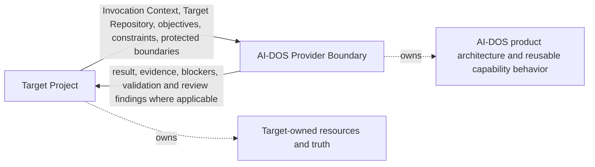
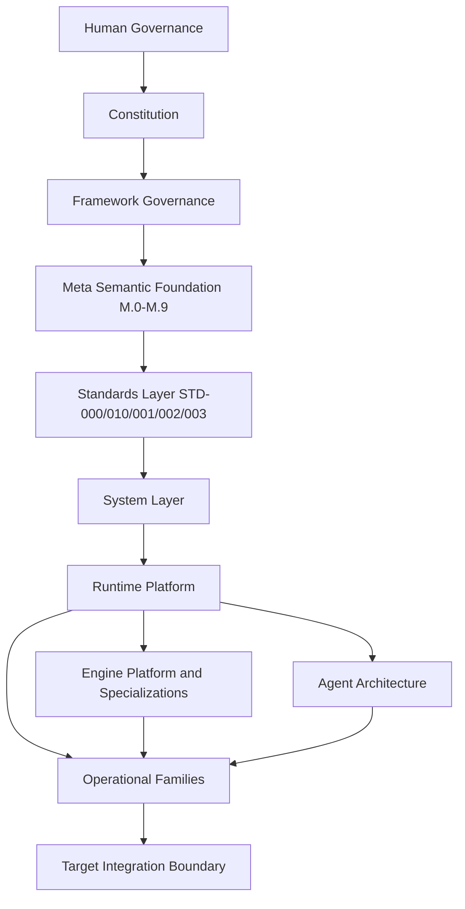
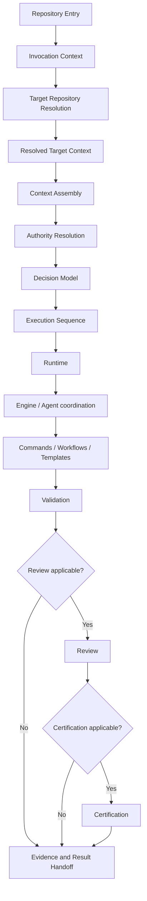
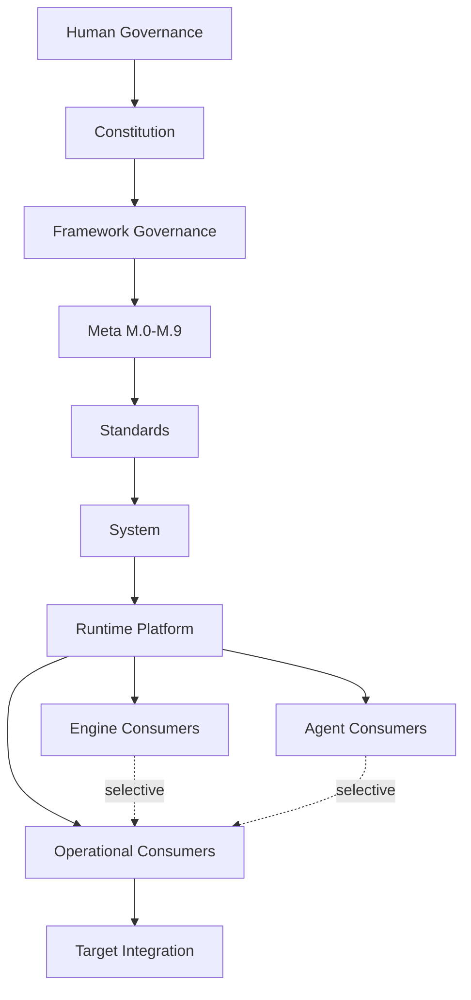

# AI-DOS Blueprint v1.1 — Architecture Integration Map

## 1. Document Metadata

| Field | Value |
| :--- | :--- |
| Identifier | `AI-DOS-BLUEPRINT-V1.1` |
| Title | AI-DOS Blueprint v1.1 — Architecture Integration Map |
| Version | `1.1.0-draft` |
| Status | Draft |
| Canonical Status | Non-canonical candidate pending Human Governance review |
| Certification Status | Not certified |
| Owner | Framework Governance |
| Canonical Path | `docs/AI-DOS/Architecture/Reports/AI-DOS-Blueprint-v1.0-RFC.md` |
| Scope | Concise, high-level product architecture map for AI-DOS. |
| Out of Scope | Detailed semantics, procedures, Runtime RFC detail, Engine RFC detail, Agent specifications, Target Project planning, implementation choices, approval, certification, freeze, or canonical promotion. |

## 2. Executive Architecture Summary

AI-DOS is the reusable provider product for governed AI-assisted operation. It supplies a Target-independent architecture for accepting an invocation, resolving a Target Repository, assembling bounded context, resolving authority, producing decisions, coordinating runtime capabilities, invoking engines, agents, commands, workflows, templates, validation, review, certification where applicable, and returning evidence.

The Blueprint explains how AI-DOS product architecture fits together. The owning documents define the detailed semantics, rules, contracts, and procedures. This Blueprint is therefore an architecture integration map, not a second Constitution, Governance model, Meta glossary, Standards catalog, Runtime specification, Engine RFC collection, Agents specification, Roadmap, DevelopmentPhases document, ProjectStatus document, or implementation plan.

## 3. Purpose

This Blueprint answers the high-level architecture questions for AI-DOS:

- what AI-DOS is and why it exists;
- how its architecture layers relate;
- how authority flows from Human Governance to execution consumers;
- how invocation, Target Repository resolution, context assembly, Authority Resolution, decision production, Execution Sequence, Runtime, Engine, Agent, and Operational Core participation fit together;
- how Commands, Workflows, Templates, Knowledge, Memory, Validation, Review, and Certification participate without becoming universal dependencies;
- where Meta and Standards sit;
- which source-of-truth concerns are owned by downstream documents;
- which boundaries protect AI-DOS from Target contamination and architectural duplication.

## 4. Authority Position

The Blueprint describes the authority topology. It does not become superior to the authorities it describes.

```text
Human Governance
    ↓
Constitutional Authority
    ↓
Framework Governance
    ↓
Meta M.0–M.9
    ↓
STD-000 and applicable Standards
    ↓
System / Runtime / Engine / Agent / Operational authorities
    ↓
AI-DOS consumers
    ↓
Target Projects
```

Detailed authority remains with the active governing documents listed in Section 31.

## 5. Scope

In scope:

- architecture layers and dependency topology;
- source-of-truth ownership at major concerns;
- AI-DOS / Target Project boundary;
- System Layer invocation and authority-resolution flow;
- Runtime Platform, Engine Platform, Agent Architecture, and Operational Families as architectural participants;
- Knowledge, Memory, Validation, Review, and Certification separation;
- selective consumption and protected boundaries.

## 6. Out of Scope

This Blueprint must not:

- define Target Project planning;
- define ProjectStatus;
- define DevelopmentPhases;
- define Roadmap;
- define implementation technology, storage technology, graph database choice, LLM vendor or model, programming language, deployment topology, or CI/CD;
- duplicate Meta definitions, Standards rules, Runtime RFC details, Engine specialization details, or Agent specifications;
- approve, certify, freeze, or promote itself.

## 7. AI-DOS Product Definition

AI-DOS is the reusable provider product. It provides governed AI operating architecture across invocation, context, authority, decision, execution, validation, review, evidence, and escalation concerns.

The Target Project is an external consumer context. Forge AI is a Target Project, not AI-DOS product truth. AI-DOS may consume Target Context inputs, but Target-owned planning and state do not become AI-DOS-owned architecture.

## 8. AI-DOS / Target Project Boundary

AI-DOS may consume:

- Invocation Context;
- Resolved Target Context;
- applicable Target resources;
- Target objectives and constraints;
- Target authority inputs;
- Target execution boundaries;
- Target validation requirements;
- Target protected boundaries.

AI-DOS must not consume as product-owned authority:

- Target Project Roadmap;
- Target DevelopmentPhases;
- Target ProjectStatus;
- Target project planning methodology;
- Target sprint, queue, milestone, or release schedule.



## 9. Architecture Principles

- Blueprint = architecture integration map; owning documents = detailed authority.
- Authority is explicit and evidence-backed.
- Source truth remains with the owning layer or family.
- Architecture position does not imply mandatory execution.
- AI-DOS remains Target-independent and consumes only bounded Target Context.
- Runtime, Engines, Agents, and Operational Families participate through contracts, not ownership crossover.
- Validation, Review, Certification, approval, and canonical promotion are distinct.
- Graph projections, registries, schemas, and templates represent or enable truth; they do not replace source truth.
- Missing authority, unsafe scope, unresolved conflicts, or protected-boundary risk trigger safe stop or escalation.

## 10. Architecture Layer Model



## 11. Governance and Authority Layer

The Governance and Constitutional Layer contains Human Governance, the Constitution, Framework Governance, authority resolution, protected boundaries, and decision escalation. Human Governance remains final for approval and canonical promotion. Constitutional Authority establishes foundational constraints. Framework Governance manages change, ownership, review, validation, certification review, canonical review, and Human Governance routing. Authority Resolution is executed through the System Layer and may consume Governance Engine support without delegating governance ownership to an engine.

## 12. Meta Semantic Foundation

Meta M.0–M.9 supplies the semantic foundation for framework meaning. The Blueprint does not restate Meta definitions.

| Meta Group | Documents | Blueprint Position |
| :--- | :--- | :--- |
| Meta Core | `docs/AI-DOS/Meta/README.md`, `M.0`, `M.1`, `M.2`, `M.3` | Foundation for framework ownership, artifacts, identity, and relationships. |
| Enterprise Semantic Profiles | `M.4`, `M.5`, `M.6`, `M.7`, `M.8`, `M.9` | Profiles lifecycle, evidence, versioning, compatibility, extension, and schema/validation meaning. |

## 13. Standards Layer

Standards specialize Meta semantics through normative requirements. The aligned Standards family dependency sequence is:

```text
STD-000
    ↓
STD-010
    ↓
STD-001
    ↓
STD-002
    ↓
STD-003
```

| Standard | Architectural Role |
| :--- | :--- |
| `STD-000` | Framework standards foundation and cross-standard governance. |
| `STD-010` | Document metadata requirements. |
| `STD-001` | Knowledge graph projection requirements; graph projection does not imply source truth. |
| `STD-002` | Discovery record, evidence, claim, and gap requirements. |
| `STD-003` | Canonical terminology requirements and forbidden synonym control. |

## 14. System Layer

The System Layer owns the canonical invocation and authority-resolution flow from repository entry to Operational Core handoff. Current active System Layer flow:

```text
Repository Entry
    ↓
Invocation Context
    ↓
Target Repository Resolution
    ↓
Resolved Target Context
    ↓
Context Assembly
    ↓
Authority Resolution
    ↓
Decision Model
    ↓
Execution Sequence
    ↓
Operational Core
```

System documents own boot, Target Repository Resolution, Context Assembly, Source of Truth handling, AuthorityModel, DecisionModel, ExecutionSequence, and System Layer freeze boundaries. The System Layer prepares and gates execution; it does not own Runtime internals, Engine specialization details, Agent specifications, or Target truth.

## 15. Runtime Platform

The Runtime Platform is the execution boundary beneath the System Layer. It coordinates runtime behavior through Runtime Architecture and Engine Architecture authorities. Architectural components include runtime boundary, kernel, contracts, registry, lifecycle, communication, state, and capability. Runtime owns platform mediation and contract enforcement; it does not own Meta, Standards, Target truth, or Agent identity semantics.

## 16. Engine Architecture

Engine Architecture consists of the Engine Platform plus selective specializations.

| Engine Area | Active Architectural Inventory |
| :--- | :--- |
| Platform | A.4 Engine Architecture; A.4.1 Kernel; A.4.2 Contract; A.4.3 Registry; A.4.4 Lifecycle; A.4.5 Communication; A.4.6 State; A.4.7 Capability. |
| Specializations | A.5.1 Context; A.5.2 Knowledge; A.5.3 Planning; A.5.4 Decision; A.5.5 Execution; A.5.6 Validation; A.5.7 Review; A.5.8 Certification; A.5.9 Memory; A.5.10 Governance; A.5.11 Workflow; A.5.12 Registry. |

Engine inventory does not imply every Engine participates in every invocation. Engines provide bounded capability behavior through Runtime contracts and must not become owners of System, Runtime, Agent, Meta, Standard, or Target truth.

## 17. Agent Architecture

AGENTS v2 defines Agent architecture. Agents participate through identity, registry, role/capability, lifecycle, communication, coordination, delegation, escalation, validation/review participation, workflow participation, and runtime consumption. Agents consume Runtime and Engine capabilities; they do not own Runtime, Engine, Meta, Standards, or Target Project source truth.

## 18. Operational Families

| Family | High-Level Purpose | Authority Boundary |
| :--- | :--- | :--- |
| Operational Core | Tool-facing operational entry, orchestration, and prompt behavior. | Owns operational boot and routing behavior, not architecture source truth. |
| Commands | Task-oriented invocation contracts for audit, implementation, documentation, bug fix, and task execution. | Own command contracts, not workflow or template source truth. |
| Workflows | Sequenced operational patterns such as state update and approval/handoff patterns. | Own workflow contracts, not command semantics or Target planning truth. |
| Templates | Reusable artifact structures for architecture, agents, context, knowledge, memory, runtime, workflow, validation, and project adapters. | Own reusable template shape, not completed artifact authority. |
| Knowledge | Governed knowledge consumption and graph projection support. | Owns knowledge architecture contracts and projections, not source truth. |
| Memory | Governed record and registry structures for memory consumption. | Owns memory record semantics, not canonical product truth. |
| Validation | Evidence-producing checks and validation lifecycle. | Validation does not imply Review. |
| Review | Independent assessment and findings. | Review does not imply Certification or approval. |
| Certification | Certification readiness and certification procedure where applicable. | Certification does not imply canonical promotion. |

## 19. Knowledge and Memory

Knowledge and Memory are consumed selectively. Knowledge makes product, evidence, discovery, terminology, and graph-projection information usable. Memory preserves bounded operational records and retrieval structures. Knowledge / Memory consumption must preserve source-of-truth boundaries: source documents remain authoritative; graph projection does not imply source truth; memory retrieval does not become approval or canonical status.

## 20. Validation, Review, and Certification

Validation, Review, and Certification are separate architectural concerns.

- Validation produces evidence that requirements, checks, or constraints were evaluated.
- Review evaluates work, evidence, risk, and conformance; Review is not approval.
- Certification assesses certification readiness or certification-specific criteria where applicable; Certification does not imply canonical promotion.
- Canonical promotion remains governed by Human Governance and Framework Governance.

## 21. Target Integration Boundary

Target Integration includes AI-DOS provider boundary, Target Context input, Target Repository, Target-owned resources, Target Adapter extension boundary, execution result handoff, evidence return, and safe stop / escalation boundary. Target Adapter extensions may map Target resources into AI-DOS-consumable context, but must not import Target-owned planning or state as AI-DOS product truth.

## 22. End-to-End Invocation Flow



This is an architectural flow. It does not imply every invocation uses every Engine, Agent, operational family, Review, or Certification path.

## 23. Selective Consumption Model

- Architecture position does not imply mandatory execution.
- Family numbering does not imply universal dependency.
- Engine inventory does not imply every Engine participates.
- Agent availability does not imply Agent activation.
- Validation does not imply Review.
- Review does not imply Certification.
- Certification does not imply canonical promotion.
- Registry presence does not imply approval.
- Graph projection does not imply source truth.

## 24. Source-of-Truth Matrix

| Concern | Source of Truth | Blueprint Role |
| :------ | :-------------- | :------------- |
| Governance authority | Human Governance, `docs/AI-DOS/FrameworkGovernance.md`, `docs/AI-DOS/GOVERNANCE.md`, Constitution | Describes topology only. |
| Framework semantic meaning | `docs/AI-DOS/Meta/M.0-Framework-Meta-Model.md` | Places Meta foundation. |
| Artifact meaning | `docs/AI-DOS/Meta/M.1-Artifact-Meta-Model.md` | References owner. |
| Identity | `docs/AI-DOS/Meta/M.2-Identity-Meta-Model.md` | References owner. |
| Relationships | `docs/AI-DOS/Meta/M.3-Relationships-Meta-Model.md` | References owner. |
| Lifecycle/status | `docs/AI-DOS/Meta/M.4-Lifecycle-Meta-Model.md` | References owner. |
| Evidence | `docs/AI-DOS/Meta/M.5-Evidence-Meta-Model.md` | References owner. |
| Versioning | `docs/AI-DOS/Meta/M.6-Versioning-Meta-Model.md` | References owner. |
| Compatibility | `docs/AI-DOS/Meta/M.7-Compatibility-Meta-Model.md` | References owner. |
| Extension | `docs/AI-DOS/Meta/M.8-Extension-Meta-Model.md` | References owner. |
| Schema/validation meaning | `docs/AI-DOS/Meta/M.9-Schema-Validation-Meta-Model.md` | References owner. |
| Standards requirements | `docs/AI-DOS/Architecture/Standards/STD-000-Framework-Standards.md` and dependent Standards | Shows standards position. |
| System invocation flow | `docs/AI-DOS/System/README.md` and active System documents | Summarizes canonical flow. |
| Runtime behavior | `docs/AI-DOS/Architecture/RFC/Runtime/A.3-Runtime-Architecture-RFC.md` | Positions Runtime. |
| Engine behavior | `docs/AI-DOS/Architecture/RFC/EnginePlatform/A.4-Engine-Architecture-RFC.md`, A.4.1–A.4.7, A.5.1–A.5.12 | Lists inventory. |
| Agent architecture | AGENTS v2 family under `docs/AI-DOS/Architecture/Agents/` | Positions Agents as consumers. |
| Command contracts | `docs/AI-DOS/Commands/` | Positions command family. |
| Workflow contracts | `docs/AI-DOS/Workflows/` and workflow templates | Positions workflow family. |
| Template contracts | `docs/AI-DOS/Templates/` | Positions template family. |
| Knowledge | `docs/AI-DOS/Templates/Knowledge/`, `STD-001`, Knowledge Engine | Positions consumption boundary. |
| Memory | `docs/AI-DOS/Templates/Memory/`, Memory Engine | Positions consumption boundary. |
| Validation procedure | `docs/AI-DOS/Validation/` and Validation Engine | Separates Validation. |
| Review procedure | Review templates, Agent review model, Review Engine | Separates Review. |
| Certification procedure | `docs/AI-DOS/Certification/`, `docs/AI-DOS/Validation/ValidationCertification.md`, Certification Engine | Separates Certification. |
| Target Project truth | Target Project contract and Target-owned resources | Excludes from AI-DOS product truth. |

## 25. Architecture Responsibility Matrix

| Layer / Family | Owns | Consumes | Must Not Own |
| :------------- | :--- | :------- | :----------- |
| Governance / Constitution | Authority, approval, protected boundaries | Evidence, reviews, escalation | Runtime execution detail. |
| Meta | Semantic meaning | Governance authority | Standards procedures or implementations. |
| Standards | Normative requirements over Meta semantics | Meta | Source documents or implementation technology. |
| System | Invocation flow, Target Repository Resolution, Context Assembly, Authority Resolution, Decision Model, Execution Sequence | Governance, Meta, Standards, Target Context | Runtime internals, Engine detail, Target truth. |
| Runtime | Runtime boundary, kernel mediation, platform contracts | System decisions, Engine/Agent/Operational contracts | Meta, Standards, Target truth. |
| Engines | Bounded specialized capability behavior | Runtime contracts, context, authority inputs | System, Runtime, Agent, or Target truth. |
| Agents | Agent identity, roles, capability participation, delegation, escalation | Runtime and Engine capabilities | Runtime, Engine, Meta, Standards, Target truth. |
| Commands | Command invocation contracts | System/Runtime context | Workflow or Target planning truth. |
| Workflows | Workflow sequencing contracts | Commands, templates, context | Approval or canonical promotion. |
| Templates | Reusable artifact forms | Standards and family contracts | Completed artifact truth. |
| Knowledge / Memory | Knowledge projection and memory records | Source documents and evidence | Source truth or approval. |
| Validation / Review / Certification | Distinct evidence, assessment, and certification procedures | Execution evidence | Each other's authority or canonical promotion. |
| Target Integration | Target input and result/evidence handoff | AI-DOS outputs | AI-DOS product truth. |

## 26. Dependency DAG



The DAG shows authority and dependency direction. It is not a mandatory linear execution path.

## 27. Protected Boundary Model

| Boundary | Protection |
| :--- | :--- |
| AI-DOS / Target Project boundary | Target resources remain external inputs; AI-DOS owns reusable provider truth. |
| Meta / Standards boundary | Meta defines semantics; Standards impose normative requirements. |
| Standards / implementation boundary | Standards constrain implementations without choosing implementation technology. |
| System / Runtime boundary | System resolves invocation, context, authority, and execution sequence; Runtime mediates execution behavior. |
| Runtime / Engine boundary | Runtime coordinates and enforces contracts; Engines provide specialized capabilities. |
| Engine / Agent boundary | Engines expose capabilities; Agents consume and coordinate but do not own Engine truth. |
| Command / Workflow boundary | Commands express task contracts; Workflows sequence operational patterns. |
| Workflow / Template boundary | Workflows use templates; templates do not define completed workflow authority. |
| Validation / Review boundary | Validation produces evidence; Review assesses evidence and work. |
| Review / Certification boundary | Review is not Certification; Certification is not approval or canonical promotion. |
| Knowledge / Memory boundary | Knowledge organizes source information; Memory records bounded operational memory. |
| Product truth / graph projection boundary | Source documents own truth; graph projection represents it. |
| Semantic definition / schema syntax boundary | Meta owns semantic meaning; schema expresses machine-readable constraints. |
| Extension semantics / extension implementation boundary | M.8 owns extension semantics; adapters or implementations instantiate them under governance. |

## 28. Extension and Compatibility Model

Extension and compatibility are governed semantic concerns. M.7 owns compatibility meaning and M.8 owns extension meaning. Standards and downstream families may specialize these concerns into requirements and contracts. Target Adapter extensions may map Target Context into AI-DOS-consumable structures, but extension implementation must not redefine AI-DOS product semantics or import Target truth as provider authority.

## 29. Schema and Machine-Readiness Boundary

M.9 owns schema and validation meaning. Standards and schemas may express machine-readable constraints. Machine-readable artifacts, registries, and graph projections support validation and discovery, but do not replace the source documents they represent and do not approve, certify, freeze, or promote artifacts.

## 30. Failure, Escalation, and Safe-Stop Boundaries

AI-DOS must safely stop or escalate when authority is missing, Target Repository Resolution fails, context is insufficient, protected boundaries conflict, validation requirements are impossible, Review or Certification is requested without applicable authority, or execution would contaminate product truth with Target truth. Escalation routes through System Authority Resolution, Governance, Agent delegation/escalation where applicable, and Human Governance when required.

## 31. Downstream Authority References

Resolved active references used by this Blueprint:

- Product and governance: `docs/AI-DOS/README.md`, `docs/AI-DOS/GOVERNANCE.md`, `docs/AI-DOS/FrameworkGovernance.md`, `docs/AI-DOS/AIFramework.md`, `docs/AI-DOS/AIOrchestrator.md`, `docs/AI-DOS/AgentSystemPrompt.md`, `docs/AI-DOS/Architecture/Constitution/A.1-Constitution.md`.
- Meta: `docs/AI-DOS/Meta/README.md`, `docs/AI-DOS/Meta/M.0-Framework-Meta-Model.md`, `docs/AI-DOS/Meta/M.1-Artifact-Meta-Model.md`, `docs/AI-DOS/Meta/M.2-Identity-Meta-Model.md`, `docs/AI-DOS/Meta/M.3-Relationships-Meta-Model.md`, `docs/AI-DOS/Meta/M.4-Lifecycle-Meta-Model.md`, `docs/AI-DOS/Meta/M.5-Evidence-Meta-Model.md`, `docs/AI-DOS/Meta/M.6-Versioning-Meta-Model.md`, `docs/AI-DOS/Meta/M.7-Compatibility-Meta-Model.md`, `docs/AI-DOS/Meta/M.8-Extension-Meta-Model.md`, `docs/AI-DOS/Meta/M.9-Schema-Validation-Meta-Model.md`.
- Standards: `docs/AI-DOS/Architecture/Standards/STD-000-Framework-Standards.md`, `docs/AI-DOS/Architecture/Standards/STD-010-Document-Metadata-Standard.md`, `docs/AI-DOS/Architecture/Standards/STD-001-Knowledge-Graph-Standard.md`, `docs/AI-DOS/Architecture/Standards/STD-002-Discovery-Standard.md`, `docs/AI-DOS/Architecture/Standards/STD-003-Terminology-Standard.md`.
- System: `docs/AI-DOS/System/README.md`, `docs/AI-DOS/System/BootSequence.md`, `docs/AI-DOS/System/TargetRepositoryResolution.md`, `docs/AI-DOS/System/ContextAssembly.md`, `docs/AI-DOS/System/SourceOfTruth.md`, `docs/AI-DOS/System/AuthorityModel.md`, `docs/AI-DOS/System/DecisionModel.md`, `docs/AI-DOS/System/ExecutionSequence.md`, `docs/AI-DOS/System/SystemLayerFreeze.md`.
- Runtime and Engines: `docs/AI-DOS/Architecture/RFC/Runtime/README.md`, `docs/AI-DOS/Architecture/RFC/Runtime/A.3-Runtime-Architecture-RFC.md`, `docs/AI-DOS/Architecture/RFC/EnginePlatform/A.4-Engine-Architecture-RFC.md`, `docs/AI-DOS/Architecture/RFC/EnginePlatform/A.4.1-Engine-Kernel-RFC.md`, `docs/AI-DOS/Architecture/RFC/EnginePlatform/A.4.2-Engine-Contract-RFC.md`, `docs/AI-DOS/Architecture/RFC/EnginePlatform/A.4.3-Engine-Registry-RFC.md`, `docs/AI-DOS/Architecture/RFC/EnginePlatform/A.4.4-Engine-Lifecycle-RFC.md`, `docs/AI-DOS/Architecture/RFC/EnginePlatform/A.4.5-Engine-Communication-RFC.md`, `docs/AI-DOS/Architecture/RFC/EnginePlatform/A.4.6-Engine-State-RFC.md`, `docs/AI-DOS/Architecture/RFC/EnginePlatform/A.4.7-Engine-Capability-RFC.md`, `docs/AI-DOS/Architecture/RFC/EngineSpecializations/A.5.0-Engine-Specialization-RFC-Template.md`, `docs/AI-DOS/Architecture/RFC/EngineSpecializations/A.5.1-Context-Engine-RFC.md`, `docs/AI-DOS/Architecture/RFC/EngineSpecializations/A.5.2-Knowledge-Engine-RFC.md`, `docs/AI-DOS/Architecture/RFC/EngineSpecializations/A.5.3-Planning-Engine-RFC.md`, `docs/AI-DOS/Architecture/RFC/EngineSpecializations/A.5.4-Decision-Engine-RFC.md`, `docs/AI-DOS/Architecture/RFC/EngineSpecializations/A.5.5-Execution-Engine-RFC.md`, `docs/AI-DOS/Architecture/RFC/EngineSpecializations/A.5.6-Validation-Engine-RFC.md`, `docs/AI-DOS/Architecture/RFC/EngineSpecializations/A.5.7-Review-Engine-RFC.md`, `docs/AI-DOS/Architecture/RFC/EngineSpecializations/A.5.8-Certification-Engine-RFC.md`, `docs/AI-DOS/Architecture/RFC/EngineSpecializations/A.5.9-Memory-Engine-RFC.md`, `docs/AI-DOS/Architecture/RFC/EngineSpecializations/A.5.10-Governance-Engine-RFC.md`, `docs/AI-DOS/Architecture/RFC/EngineSpecializations/A.5.11-Workflow-Engine-RFC.md`, `docs/AI-DOS/Architecture/RFC/EngineSpecializations/A.5.12-Registry-Engine-RFC.md`.
- Agents: AGENTS v2 family under `docs/AI-DOS/Architecture/Agents/`, especially `AGENTS-v2.md` and `AGENTS-v2-Architecture.md`.
- Operational families: `docs/AI-DOS/Commands/`, `docs/AI-DOS/Workflows/`, `docs/AI-DOS/Templates/`, `docs/AI-DOS/Validation/`, `docs/AI-DOS/Certification/`, `docs/AI-DOS/Testing/`, `docs/AI-DOS/Operational/Operational-Core-Replacement-Matrix.md`.

## 32. Information Preservation Matrix

| Existing Blueprint Concept | Previous Role | New Disposition | Current Owner | Blueprint Representation | Reason |
| :------------------------- | :------------ | :-------------- | :------------ | :----------------------- | :----- |
| Blueprint status and RFC posture | Declared v1.0 RFC status | UPDATE TO CURRENT AUTHORITY | Framework Governance / Human Governance | Metadata marks `1.1.0-draft`, Draft, non-canonical candidate, not certified. | Aligns with requested status. |
| Vision / why AI-DOS exists | Product motivation | REWRITE COMPACTLY | Product and governance docs | Executive summary, purpose, product definition. | Preserves intent without roadmap expansion. |
| Architectural problem statement | Explained coordination problem | MERGE | Blueprint | Purpose and architecture principles. | Removes duplicate prose while preserving problem framing. |
| Architectural principles | Product rules | UPDATE TO CURRENT AUTHORITY | Governance, Meta, Standards, System | Section 9. | Adds Target independence and selective consumption. |
| Full-stack architecture diagram | Layer map | REWRITE COMPACTLY | Blueprint | Section 10 layer diagram. | Updates layers to Meta v1.1, Standards, System, Runtime, Engine, Agent, Operational Families. |
| Governance concepts | Authority model | CONVERT TO REFERENCE | Constitution / Framework Governance | Sections 4 and 11. | Blueprint must not become governance model. |
| Semantic and terminology content | Definitions | CONVERT TO REFERENCE | Meta and STD-003 | Sections 12, 13, 24, 31. | Avoids Meta glossary duplication. |
| Knowledge graph architecture | Source-truth projection model | UPDATE TO CURRENT AUTHORITY | STD-001 / Knowledge Engine | Sections 13, 19, 24, 27. | Preserves graph boundary and source truth. |
| Runtime / engine design detail | Execution architecture | CONVERT TO REFERENCE | A.3/A.4/A.5 RFCs | Sections 15 and 16. | Avoids reproducing RFC detail. |
| Agent operating model | Agent participation | UPDATE TO CURRENT AUTHORITY | AGENTS v2 family | Section 17. | Removes AGENTS v1 reliance. |
| Commands / workflows / templates | Operational tooling | MERGE | Operational family documents | Section 18. | Represents architectural position only. |
| Validation and review content | Quality gates | UPDATE TO CURRENT AUTHORITY | Validation, Review, Certification owners | Section 20. | Separates Validation, Review, Certification. |
| Target-specific references | Project contamination risk | REMOVE TARGET CONTAMINATION | Target Project | Sections 7, 8, 21, 27 only as boundary/prohibition. | AI-DOS product truth must remain Target-independent. |
| Implementation or technology implications | Possible implementation direction | REMOVE AS DUPLICATE | Downstream implementation authorities if later created | Out-of-scope section. | Blueprint must not choose technologies. |
| Historical product roadmap posture | Planning context | REMOVE AS DUPLICATE | Target/project planning owners | Out-of-scope section. | Blueprint is not planning authority. |

## 33. Validation Assertions

- Active Blueprint resolved to `docs/AI-DOS/Architecture/Reports/AI-DOS-Blueprint-v1.0-RFC.md`.
- AI-DOS / Target Project separation is explicit.
- Meta M.0–M.9 position is represented without duplicating definitions.
- Standards sequence `STD-000 → STD-010 → STD-001 → STD-002 → STD-003` is represented.
- System Layer flow is represented from Repository Entry to Operational Core.
- Runtime, Engine, Agent, and Operational Families are represented as selective consumers/participants.
- Source-of-truth boundaries are explicit.
- No active Target contamination remains; retained Target terms are prohibitions, boundary definitions, or validation-report concerns.
- All active references in Section 31 resolve in the repository as of this draft.

## 34. Governance and Completion Status

Completion statement for this draft:

```text
AI-DOS BLUEPRINT V1.1
REALIGNMENT COMPLETE
```

Final verdict:

```text
PASS WITH OBSERVATIONS
```

Observation: this document remains a non-canonical candidate pending Human Governance review and is not certified.

Exactly one recommended next step:

```text
FORGE-AI.V2.AI-DOS-BLUEPRINT-V1.1-CONSISTENCY-REVIEW-001
— REVIEW THE REALIGNED AI-DOS BLUEPRINT
AGAINST THE CURRENT PRODUCT ARCHITECTURE,
SOURCE-OF-TRUTH BOUNDARIES,
AND TARGET-INDEPENDENCE REQUIREMENTS
```
