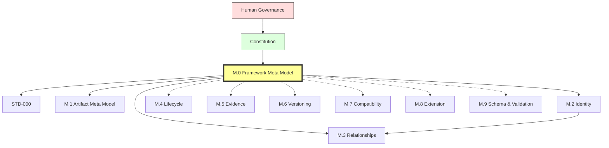
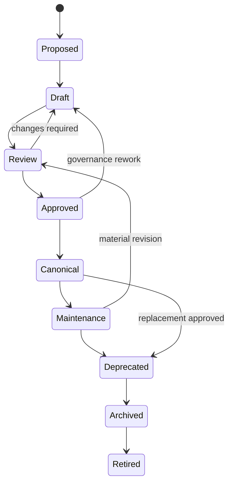
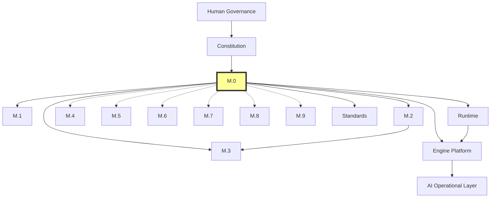

# M.0 — Framework Meta Model

> AI-DOS v1.1.0-draft · Meta Core

---

## Document Metadata

| Field | Value |
|:---|:---|
| Identifier | `AI-DOS-META-M.0` |
| Version | 1.1.0-draft |
| Status | Draft |
| Classification | Meta Core |
| Document Type | Meta Architecture Specification |
| Owner | Framework Governance |
| Review Authority | Enterprise Documentation Standards Board |
| Approval Authority | Human Governance |
| Created | 2026-07-04 |
| Last Updated | 2026-07-14 |
| Normative Authority | Human Governance; A.1 Constitution |
| Normative References | A.1 Constitution; A.0 Framework Audit; AI-DOS Meta Enterprise Foundation v1 |
| Consumed By | M.1–M.9; Standards; Runtime; Engine; Agents; Commands; Templates; Workflows; Operational Core |

---

## 1. Purpose

M.0 is the single canonical semantic type system of AI-DOS. It exists so every Framework artifact can answer the same foundational questions consistently—what type of thing this is, how it is identified, who owns it, what authority governs it, what lifecycle it follows, what relationships and dependencies it has, and how downstream systems may consume it without redefining it. M.0 prevents semantic duplication across Framework Core, Standards, Runtime, Engine Platform, Knowledge, Context, AI Operations, Validation, Review, Certification, and all future domains. M.0 defines meanings, types, abstractions, and dependency rules—not runtime behavior, not implementation, not storage, not APIs. AI-DOS is a reusable framework product; Target Projects consume AI-DOS; AI-DOS never consumes Target Projects.

---

## 2. Authority Position

M.0 sits below constitutional authority and above all downstream semantic consumers. Downstream documents consume M.0; they do not redefine its foundational concepts. Human Governance remains the highest authority, followed by the Constitution, followed by M.0.



M.0 through M.3 form **Meta Core** (hard dependencies). M.4 through M.9 are **Enterprise Semantic Profiles** (profile-driven consumption). This distinction is defined by the AI-DOS Meta Enterprise Foundation v1.

---

## 3. Scope

M.0 covers the root framework meanings for AI-DOS: the Meta Type system, the root semantic concepts (Semantic Entity, Artifact, Actor, Domain, Identity, Metadata, State, Authority, Ownership, Relationship, Dependency, Reference, Evidence, Validation, Review, Certification, Capability, Objective, Constraint, Boundary, Decision, Finding, Recommendation, Risk, Extension, Runtime Abstraction, Engine Abstraction, Context, Knowledge, AI Semantic Model), the artifact abstraction hierarchy, the canonical lifecycle, the canonical relationship types, the authority model, and the governed dependency model for the Enterprise Meta Family Architecture.

---

## 4. Out of Scope

M.0 does not cover: runtime implementation, engine implementation, registries, storage schemas, platform adapters, project code, Target Project documents or planning, validation tooling, automation scripts, file movement, legacy migration, API design, code structures, or the detailed contracts owned by M.2 through M.9. M.0 does not certify itself or approve downstream documents. M.0 does not modify the Constitution, A.0, STD-000, STD-010, ProjectStatus, DevelopmentPhases, or any Runtime/Engine RFC.

---

## 5. Owned Semantics

| Meta Type | Definition |
|:---|:---|
| AI-DOS Product | The reusable framework product consumed by Target Projects. |
| Domain | A bounded area of concern within AI-DOS (e.g., Standards, Runtime, Engine, Agents, Commands, Templates, Workflows, Operational Core). |
| Semantic Entity | The most general governed thing in AI-DOS—any identifiable, governable concept that participates in the Framework. |
| Artifact (root) | Any governed Framework object requiring identity, ownership, lifecycle, traceability, authority, or certification. |
| Actor | Any entity that performs actions on artifacts or other semantic entities (humans, AI agents, governance bodies, teams). |
| Capability | Bounded semantic unit of responsibility, ability, or approved work within the Framework. |
| Context | Bounded assembled information used for interpretation or execution. |
| Objective | A goal or intended outcome within the Framework. |
| Constraint | A limitation or rule that must be respected. |
| Boundary | A semantic or governance border. |
| Authority | Governing precedence over interpretation, approval, and change. |
| Ownership | Accountable responsibility for artifact correctness and lifecycle. |
| Relationship (root) | Explicit typed connection between artifacts or abstractions. |
| Dependency | Required upstream artifact, concept, authority, or semantic model. |
| Evidence (root) | Verifiable support for a claim, finding, validation result, review result, or certification. |
| Decision | A governed choice made by an authority or owner. |
| Finding | A result of analysis, review, or investigation. |
| Recommendation | A suggested action arising from analysis or review. |
| Risk | A potential negative outcome identified through analysis. |
| Extension (root) | A governed addition to the Framework that does not replace upstream meanings. |
| Validation (root) | Governed verification against defined requirements; produces evidence and findings; does not create authority. |
| Runtime Abstraction | Semantic description of runtime responsibilities, boundaries, and consumption rules. |
| Engine Abstraction | Semantic description of engine responsibilities, contracts, lifecycle, and capability boundaries. |
| AI Semantic Model | Rules by which AI agents consume, interpret, produce, validate, and report artifacts. |
| Identity (root) | Stable semantic reference for an artifact or abstraction. |
| Metadata | Structured descriptive, governance, relationship, and lifecycle information about an artifact. |
| State | Current lifecycle position of an artifact. |
| Lifecycle (root) | Governed state progression for artifacts and capabilities. |
| Reference | Traceable link to an artifact or source (normative, informative, historical, deprecated, or external). |
| Certification | Governed acceptance after review and validation; may promote artifacts when governance allows. |
| Knowledge | Governed reusable semantic memory or graph projection. |

---

## 6. Consumed Semantics

M.0 consumes from upstream:

- **Human Governance intent** — the ultimate authority for Meta creation, promotion, amendment, certification, and deprecation.
- **Constitutional principles** — A.1 Constitution provides the governance model and principles that M.0 expresses as semantic types.
- **Audit baseline** — A.0 Framework Audit provides the current-state assessment against which M.0 is the forward semantic model.

M.0 does not consume any Meta family (M.1–M.9) or downstream domain. M.0 does not consume Target Project authority or downstream domain procedures.

---

## 7. Core Definitions

### 7.1 Meta Type

A **Meta Type** is a canonical semantic category that defines what a governed Framework object is, what properties it must carry, what lifecycle rules apply to it, what relationships it may form, and how downstream systems may consume it. A Meta Type is not an implementation class, database table, runtime object, registry entry, API schema, or code construct.

### 7.2 Root Meta Type Hierarchy

```mermaid
graph TD
    MT["Meta Type"] --> SE["Semantic Entity"]
    SE --> Artifact["Artifact"]
    SE --> Actor["Actor"]
    SE --> Domain["Domain"]
    Artifact --> Identity["Identity"]
    Artifact --> Metadata["Metadata"]
    Artifact --> State["State"]
    Artifact --> Evidence["Evidence"]
    MT --> Relationship["Relationship"]
    MT --> Authority["Authority"]
    MT --> Ownership["Ownership"]
    MT --> Dependency["Dependency"]
    MT --> Capability["Capability"]
    MT --> Context["Context"]
    MT --> Knowledge["Knowledge"]
    MT --> Objective["Objective"]
    MT --> Constraint["Constraint"]
    MT --> Boundary["Boundary"]
    MT --> Decision["Decision"]
    MT --> Finding["Finding"]
    MT --> Recommendation["Recommendation"]
    MT --> Risk["Risk"]
    MT --> Extension["Extension (root meaning)"]
    MT --> Validation["Validation (root meaning)"]
    MT --> Runtime["Runtime Abstraction"]
    MT --> Engine["Engine Abstraction"]
    MT --> AI["AI Semantic Model"]

    style MT fill:#ff9,stroke:#333,stroke-width:4px
    style SE fill:#eef,stroke:#333,stroke-width:2px
```



### 7.3 Semantic Entity Family

Semantic Entity is the most general governed thing. It specializes into Artifact (root governed Framework object), Actor (entities that perform actions), and Domain (bounded areas of concern). Non-artifact semantic entities (Actor, Domain, Objective, Constraint, Boundary, Decision, Finding, Recommendation, Risk) are also governed by M.0 identity, authority, and relationship rules but are not artifacts.

### 7.4 Artifact Hierarchy

Artifact is the root abstraction for every governed thing in AI-DOS. Artifact subtypes include Document, Governance, Planning, Standard, Meta, Runtime, Engine, Operational, Evidence, Knowledge, and Capability artifacts.

```mermaid
graph TD
    Artifact["Artifact"] --> Document["Document Artifact"]
    Artifact --> Governance["Governance Artifact"]
    Artifact --> Planning["Planning Artifact"]
    Artifact --> Standard["Standard Artifact"]
    Artifact --> Meta["Meta Artifact"]
    Artifact --> RuntimeDoc["Runtime Artifact"]
    Artifact --> EngineDoc["Engine Artifact"]
    Artifact --> Operational["Operational Artifact"]
    Artifact --> EvidenceArtifact["Evidence Artifact"]
    Artifact --> KnowledgeArtifact["Knowledge Artifact"]
    Artifact --> CapabilityArtifact["Capability Artifact"]

    Document --> Constitution["Constitution"]
    Document --> Audit["Audit"]
    Document --> RFC["RFC"]
    Document --> Report["Report"]
    Document --> Roadmap["Roadmap"]

    Governance --> Review["Review"]
    Governance --> Certification["Certification"]

    Planning --> Phase["Phase"]
    Planning --> Stage["Stage"]
    Planning --> Task["Task"]

    Operational --> Command["Command"]
    Operational --> Workflow["Workflow"]
    Operational --> Template["Template"]
    Operational --> Checklist["Checklist"]

    style Artifact fill:#ff9,stroke:#333,stroke-width:4px
```



### 7.5 Canonical Relationship Types

| Relationship Type | Meaning |
|:---|:---|
| governs | Source has authority over target interpretation, lifecycle, or approval. |
| conforms to | Source must follow target rules but target may not directly own source lifecycle. |
| depends on | Source requires target to be understood or valid. |
| consumes | Source uses target as input. |
| produces | Source creates, defines, or emits target. |
| specializes | Source narrows a broader M.0 concept without redefining it. |
| derives from | Source inherits semantic meaning from target. |
| references | Source links to target for normative, informative, historical, deprecated, or external context. |
| validates | Source verifies target against requirements. |
| reviews | Source independently assesses target. |
| certifies | Source records governed acceptance of target. |
| blocks | Source prevents target progression. |
| blocked by | Source cannot progress until target is resolved. |
| supersedes | Source replaces target. |
| superseded by | Source has been replaced by target. |

### 7.6 Canonical Lifecycle States



| State | Meaning |
|:---|:---|
| Proposed | Concept exists but is not yet a working artifact. |
| Draft | Artifact is being authored or refactored. |
| Review | Artifact is under independent readiness and governance review. |
| Approved | Artifact has approval but is not necessarily canonical. |
| Canonical | Artifact is the approved source of truth for its scope. |
| Maintenance | Canonical or approved artifact is receiving governed upkeep. |
| Deprecated | Artifact remains traceable but should not be used for new work. |
| Archived | Artifact is preserved for history and audit. |
| Retired | Artifact is no longer active but identity remains reserved. |

### 7.7 Capability Model

A Capability is a bounded semantic unit of responsibility, ability, or approved work. Capabilities connect planning, runtime, engines, validation, review, certification, and AI operations without becoming implementation code. A Capability shall define: stable identity, purpose, scope, out-of-scope boundaries, owner, authority, required inputs, produced outputs, dependencies, lifecycle state, validation expectations, review expectations, certification expectations when applicable, and downstream consumers. Capability identifiers are immutable after certification.

### 7.8 Identifier Families

| Family | Example |
|:---|:---|
| Meta | `AI-DOS-META-M.0` |
| Architecture | `AI-DOS-ARCH-A.1` |
| Audit | `AI-DOS-AUDIT-A.0` |
| Standard | `AI-DOS-STD-000` |
| Evidence | `EVID-000001` |
| Finding | `FIND-000001` |
| Recommendation | `REC-000001` |
| Risk | `RISK-000001` |
| Decision | `ADR-000001` |
| Certification | `CERT-000001` |
| Capability | `CAP-000001` |

---

## 8. Semantic Rules

1. Every governed object shall derive from one or more M.0 Meta Types.
2. Semantic Entity is the most general governed thing; Artifact, Actor, and Domain are its specializations.
3. Artifact is the root type for governed Framework objects. If a Framework object is governed, it is an Artifact.
4. If a Framework object is referenced for authority, dependency, validation, certification, traceability, or AI consumption, it shall be represented as an Artifact or as a Relationship to an Artifact.
5. No downstream document may redefine a root Meta Type; downstream documents may only specialize it.
6. Authority relationships are not the same as dependency relationships.
7. Informative references do not create authority.
8. Consumption does not create ownership; production does not imply approval.
9. Validation does not imply certification.
10. Certification must not occur without required review and evidence.
11. State shall be explicit and shall not be inferred from conversation, branch name, or assumed roadmap position.
12. Promotion requires defined review and approval evidence. Canonical status requires governance approval.
13. Identity shall not be inferred from file path alone. File path may support identity but shall not replace identifier metadata.
14. Renaming a file shall not change artifact identity unless governance approves a new artifact. Deprecated identifiers remain reserved. Historical identifiers shall not be renumbered.
15. Ownership may delegate work but not accountability. Shared maintenance does not create shared accountability unless governance explicitly defines an accountable body.
16. Ownership changes require governance approval when the artifact is authoritative, canonical, or certification-bearing.
17. AI agents may perform work on artifacts but do not become owners unless explicitly assigned by governance.
18. AI agents shall not infer unstated relationships when reporting compliance.
19. Capabilities do not redefine Framework semantics; they derive type, identity, lifecycle, authority, ownership, relationship, and dependency rules from M.0.
20. Specialized lifecycles shall remain compatible with the canonical lifecycle states.
21. Artifact subtypes may add fields and lifecycle refinements but shall not remove M.0 identity, authority, ownership, relationship, and lifecycle requirements.
22. Lower authority documents shall not redefine higher authority concepts.
23. Implementation, runtime behavior, engine design, or project code shall not define Framework semantics.

---

## 9. Invariants

1. Every governed object derives from one or more M.0 Meta Types.
2. No downstream document may redefine a root Meta Type.
3. Identity is stable after publication and never reused for a different artifact.
4. Authority always flows downward: Human Governance → Constitution → M.0 → downstream. Lower authority never overrides higher authority.
5. The Meta Type hierarchy is acyclic.
6. Every Artifact has exactly one accountable owner.
7. Certification cannot occur without prior validation evidence and review.
8. State is always explicit—never inferred from conversation, file location, or branch name.
9. AI-DOS is Target-independent: AI-DOS never consumes Target Projects.
10. The dependency graph among M.0–M.9 is a directed acyclic graph with no cycles.
11. M.0 consumes only Human Governance and constitutional authority—no Meta family and no downstream domain.
12. Each semantic concern has exactly one intended Meta owner (Duplicate Ownership Result from Foundation v1).

---

## 10. Boundary Rules

M.0 is architecture-only. It defines meanings, not mechanisms.

- M.0 does not implement runtime behavior, engine behavior, registries, storage, tooling, validation automation, project code, platform adapters, or operational commands.
- M.0 does not define code structures, database schemas, API contracts, or serialization formats.
- M.0 is Target-independent: it does not consume Target Project authority, documents, or planning.
- M.0 does not modify the Constitution, A.0, STD-000, STD-010, ProjectStatus, DevelopmentPhases, or any downstream RFC.
- M.0 does not certify itself or approve downstream documents.
- M.0 does not define detailed contracts for M.2 through M.9—those are defined by their own family documents.
- M.0 is platform-independent: programming languages, databases, frameworks, editors, vendors, hosts, and product-specific architectures are outside its scope.
- AI agents may interpret, project, validate, and operationalize M.0 but must not create competing meta concepts.

---

## 11. Selective Dependencies

M.0 is the root of the Governed DAG. It depends only on Human Governance and constitutional authority. It has no conditional upstream dependencies and must not consume Target Project authority or downstream domain procedures.

### Selective Dependency Matrix

| Family | Required Upstream | Conditional Upstream | Must Not Consume |
|:---|:---|:---|:---|
| M.0 Framework | Human Governance; constitutional authority | None | Target Project authority; downstream domain procedures |
| M.1 Artifact | M.0 | None | M.2–M.9 as prerequisites |
| M.2 Identity | M.0 | M.1 for artifact identity specialization | M.3–M.9 |
| M.3 Relationships | M.0; M.2 | M.1 for artifact relationship binding | M.4–M.9 |
| M.4 Lifecycle | M.0; M.2; M.3 | M.1 for artifact lifecycle binding | M.5–M.9 |
| M.5 Evidence | M.0; M.2; M.3 | M.1 for evidence artifact binding; M.4 when evidence supports transitions | M.6–M.9 |
| M.6 Versioning | M.0; M.2; M.3 | M.1 for artifact version binding; M.4 for supersession effects; M.5 for evidenced version claims | M.7–M.9 |
| M.7 Compatibility | M.0; M.2; M.3; M.5; M.6 | None | M.8–M.9 |
| M.8 Extension | M.0; M.2; M.3; M.6; M.7 | Other families only when an extension profile uses them | M.9 as a universal prerequisite |
| M.9 Schema & Validation | M.0; M.1; M.2 | Applicable semantic families being validated | Families outside the active schema or validation profile |

### Dependency Graph



---

## 12. Downstream Consumption

All downstream consumers consume M.0 as semantic authority. The consumption contract is:

- **M.1–M.9**: Each Meta family consumes the root Meta Types it needs and specializes them for its owned semantic concern. No family redefines M.0 root concepts.
- **Standards (STD-000, STD-001, STD-002)**: Consume M.0 Meta Types for standards governance, knowledge graph projection, and discovery specialization without redefining Framework semantics.
- **Runtime**: Consumes M.0 for artifact identity, lifecycle state interpretation, authority resolution, ownership accountability, relationship traversal, dependency interpretation, capability boundaries, context assembly, knowledge consumption, and validation/review/certification evidence semantics. Runtime shall not redefine any M.0 concept.
- **Engine Platform and Engine RFCs**: Consume M.0 for engine artifact identity, ownership, authority boundaries, lifecycle semantics, capability definitions, dependency relationships, contract semantics, and engine-produced evidence. Engine specifications shall not redesign M.0 or define new root meta concepts.
- **AI Operational Layer**: Consumes M.0 through commands, workflows, context, state, capability, and evidence semantics. AI agents shall read applicable authority before work, preserve architecture-only boundaries, and distinguish authority from dependency from consumption.

No downstream consumer may promote artifacts without governance, treat operational execution as architectural authority, or infer authority from runtime availability.

---

## 13. Information Preservation

M.0 v1.1.0-draft replaces the prior v4.0.0-draft structure, normalizing it to the 16-section enterprise model. All semantic decisions from the prior version are preserved:

- The Framework Meta Type System, artifact abstraction, identity abstraction, metadata abstraction, lifecycle abstraction, authority abstraction, ownership abstraction, relationship abstraction, dependency abstraction, capability abstraction, runtime abstraction, engine abstraction, context abstraction, knowledge abstraction, and AI semantic model are retained.
- The Enterprise Meta Family Architecture position, Governed DAG, Selective Dependency Matrix, and ownership chain from Foundation v1 are retained.
- Terminology normalization (Appendix A from prior version) is preserved as governing semantic discipline.
- Non-goals (Appendix B from prior version) are preserved in §4 and §10.
- Downstream migration expectations are preserved: M.1 specializes M.0, STD-003 normalizes terms, Standards/Runtime/Engine consume M.0, legacy migration remains frozen until Phase 12.

This migration does not modify A.1, A.0, STD-000, STD-010, any Runtime/Engine RFC, ProjectStatus, DevelopmentPhases, or any downstream files.

---

## 14. Semantic Ownership

M.0 owns root meaning for the entire Enterprise Meta Family. The ownership chain (from Foundation v1 §8.1):

```text
M.0 owns root meaning.
  ↓
M.1 owns artifact meaning derived from root Artifact.
  ↓
M.2 owns stable identity for root and artifact entities.
  ↓
M.3 owns typed relationships between identified entities.
  ↓
M.4 owns lifecycle/status meaning for identified and related entities.
  ↓
M.5 owns evidence and traceability for claims about entities, relationships, and lifecycle events.
  ↓
M.6 owns versions and supersession of entities and artifacts.
  ↓
M.7 owns compatibility across versions and contracts.
  ↓
M.8 owns safe extension of applicable governed semantics without replacing upstream authorities.
  ↓
M.9 owns schema binding and validation semantics over the applicable semantic families included in a validation profile.
```

**Duplicate Ownership Result** (Foundation v1 §10.2):

```text
ZERO INTENDED DUPLICATE SEMANTIC OWNERSHIP
IN THE PROPOSED META FAMILY ARCHITECTURE
```

Each semantic concern has exactly one intended Meta owner. Downstream repository alignment has not yet been completed; current downstream duplication may remain. Implementation and downstream alignment must validate the intended ownership model before Human Governance treats duplicate ownership elimination as verified repository fact.

M.0 contributes root meanings to each family. Family-specific contracts are defined by their own documents:

| Family | M.0 Contribution | Family-Specific Contract |
|:---|:---|:---|
| M.1 | Artifact root, Identity root, Metadata root, State root, Evidence root | Defined by M.1 |
| M.2 | Semantic Entity, Artifact, Actor, Capability, Context, Authority, Ownership, Boundary | Defined by M.2 |
| M.3 | Relationship root, Boundary, Authority, Ownership, Constraint | Defined by M.3 |
| M.4 | Authority, Ownership, Constraint, Boundary, Validation root | Defined by M.4 |
| M.5 | Evidence root, Decision, Finding, Recommendation, Risk, Validation root, Authority, Context | Defined by M.5 |
| M.6 | Artifact, Authority, Ownership, Boundary | Defined by M.6 |
| M.7 | Boundary, Constraint, Capability, Validation root, Evidence | Defined by M.7 |
| M.8 | Extension root, Boundary, Authority, Ownership | Defined by M.8 |
| M.9 | Validation root, Evidence, Constraint, Boundary | Defined by M.9 |

---

## 15. Validation Assertions

- M.0 contains all required root Meta Types listed in §5.
- No downstream concept is redefined as a root type in M.0.
- The dependency graph in §11 has no cycles.
- M.0 consumes only Human Governance and constitutional authority.
- The Meta Type hierarchy in §7.2 is acyclic.
- Every Meta Type in §5 has exactly one one-line definition.
- The ownership chain in §14 assigns each semantic concern to exactly one Meta family.
- M.0 does not define implementation, storage, APIs, or runtime behavior.
- M.0 is Target-independent: no Target Project concept appears as a root Meta Type.
- All relationship types in §7.5 have distinct, non-overlapping meanings.
- All lifecycle states in §7.6 are reachable from Proposed and transition only to defined successors.
- Authority flow in §2 is strictly downward from Human Governance.

---

## 16. Completion / Governance Status

**Current Status**: Draft (1.1.0-draft). Non-canonical until reviewed, approved, and promoted through Framework Governance.

**Promotion Requirements**: Framework Governance review, approval, traceability validation, metadata validation, downstream impact review, and explicit promotion by Human Governance.

**Success Criteria**:
- M.0 is the canonical semantic model of AI-DOS.
- Every Framework artifact can derive from the Framework Meta Type System.
- M.1–M.9 consume M.0 without redefining M.0 concepts.
- Standards, Runtime, Engines, Knowledge Graph, and AI Operations consume M.0 without redefining M.0 concepts.
- Authority, ownership, lifecycle, relationship, dependency, and capability concepts are normalized.
- The document remains platform-independent and implementation-free.