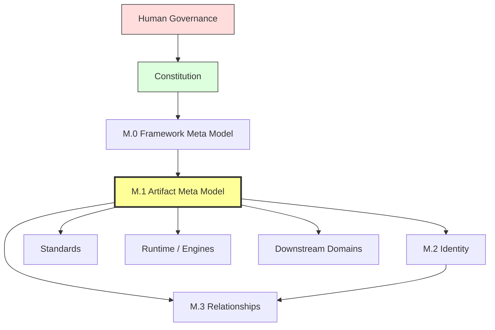
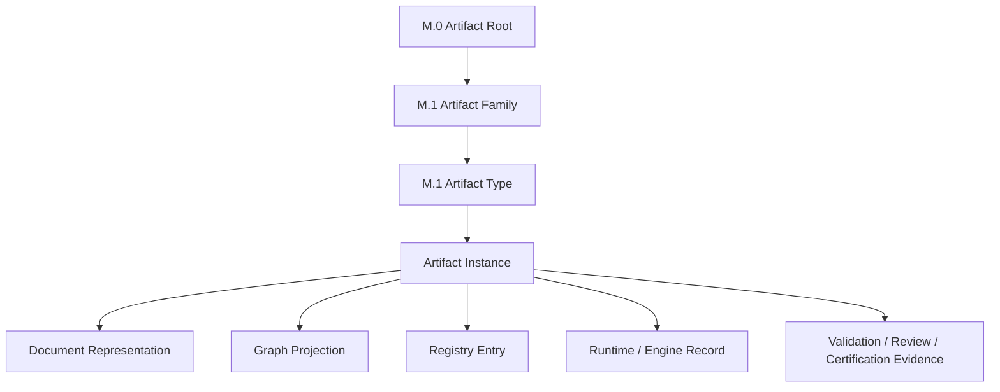
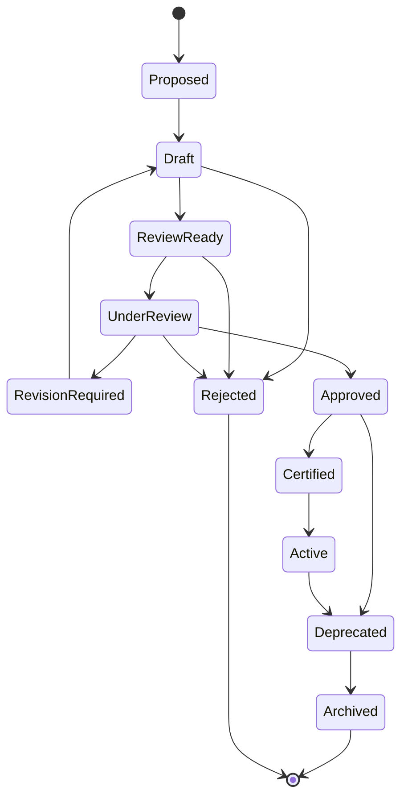
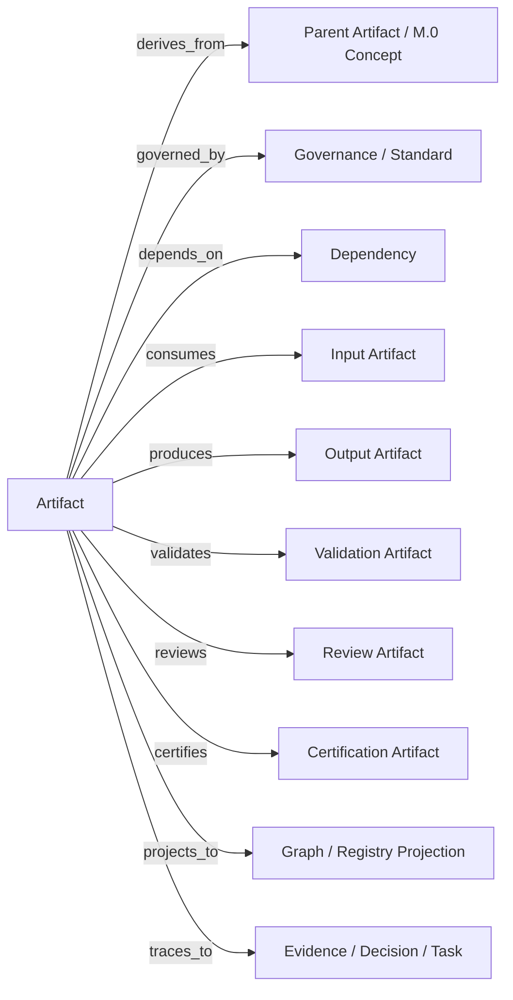
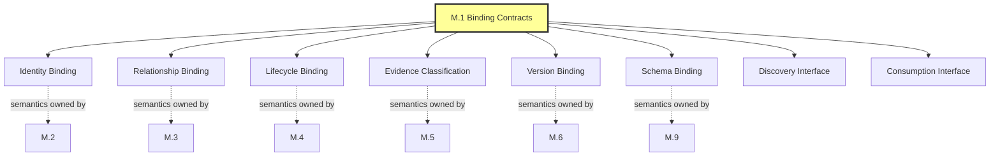
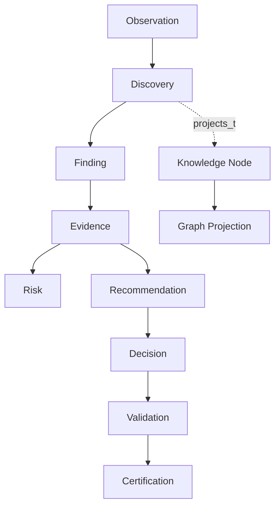
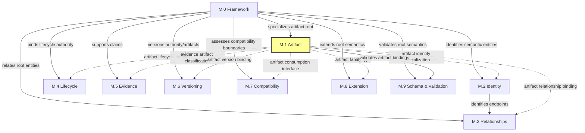

# M.1 — Artifact Meta Model

> AI-DOS v1.1.0-draft · Meta Core

---

## Document Metadata

| Field | Value |
|:---|:---|
| Identifier | `AI-DOS-META-001` |
| Version | 1.1.0-draft |
| Status | Draft |
| Classification | Meta Core |
| Document Type | Artifact Meta Model |
| Owner | Framework Governance |
| Review Authority | Enterprise Documentation Standards Board |
| Approval Authority | Human Governance |
| Created | 2026-07-06 |
| Last Updated | 2026-07-14 |
| Normative Authority | Human Governance; A.1 Constitution; M.0 |
| Normative References | A.1 Constitution; A.0 Framework Audit; M.0 Framework Meta Model; STD-010; AI-DOS Meta Enterprise Foundation v1 |
| Consumed By | M.2 (artifact identity specialization); M.3 (artifact relationship binding); M.4 (artifact lifecycle binding); M.5 (evidence artifact classification); M.6 (artifact version binding); M.7 (artifact consumption interface); M.8 (artifact family/type); M.9 (artifact schema binding); Standards; Runtime; Engine; Agents; Commands; Templates; Workflows; Operational Core |

---

## 1. Purpose

M.1 defines the canonical concrete artifact specialization layer for AI-DOS. M.0 defines abstract semantic types; M.1 specializes those types into governed artifact families, artifact types, and artifact instance rules. M.1 exists so every standard, RFC, report, audit, schema, registry entry, validation result, review record, certification package, runtime record, engine record, planning document, operational document, and historical document can be classified consistently without inventing competing artifact semantics. An Artifact is a governed knowledge object—it may be represented by a document, record, schema, graph node, registry entry, runtime trace, engine output, checklist, package, or status entry, but the representation is not the artifact itself. M.1 defines semantic contracts; downstream domains provide implementations. AI-DOS is a reusable framework product; Target Projects consume AI-DOS; AI-DOS never consumes Target Projects.

---

## 2. Authority Position

M.1 sits below M.0 and above artifact-consuming downstream domains. M.1 is a member of **Meta Core** alongside M.0, M.2, and M.3. M.1 is the artifact semantic authority derived from M.0 Artifact root. M.1 does not redefine M.0 concepts; it specializes them through governed artifact families.



---

## 3. Scope

M.1 covers: the concrete artifact type system (Artifact Root → Artifact Family → Artifact Type → Artifact Instance), the 15 governed artifact families and their specializations, artifact identity metadata, artifact metadata categories, artifact lifecycle specialization, artifact authority chain, artifact ownership roles, artifact relationship classes, artifact traceability requirements, artifact binding contracts to M.2–M.9, the Artifact Discovery Interface, and the Artifact Consumption Interface.

---

## 4. Out of Scope

M.1 does not cover: runtime implementation, engine implementation, registries, tooling, automation, validation scripts, project code, file movement, legacy migration, registry implementation, storage implementation, validation tooling, downstream content models, Target-specific planning, command execution, workflow execution, template content, or operational procedure. M.1 does not own relationship meaning (M.3), identity rules beyond artifact identity binding (M.2), lifecycle semantics beyond artifact lifecycle binding (M.4), evidence semantics beyond evidence artifact classification (M.5), versioning semantics beyond artifact version binding (M.6), compatibility semantics (M.7), extension semantics (M.8), or validation semantics beyond artifact schema binding (M.9). M.1 does not modify M.0, Constitution, A.0, STD-000, STD-010, ProjectStatus, DevelopmentPhases, or any downstream RFC.

---

## 5. Owned Semantics

| Concept | Definition |
|:---|:---|
| Artifact Family | A governed grouping that owns related artifact specializations. |
| Artifact Type | A concrete named specialization within an artifact family (e.g., Discovery, Validation Result, Engine Contract, Project Status). |
| Artifact Instance | A particular document, record, node projection, registry entry, or package with identity and metadata. |
| Artifact Identity Binding | Declaration that artifacts carry identity metadata requiring stable identity semantics (semantics owned by M.2). |
| Artifact Relationship Binding | Declaration that artifacts participate in typed relationships requiring relationship semantics (semantics owned by M.3). |
| Artifact Lifecycle Binding | Declaration that artifacts have lifecycle states and transitions requiring lifecycle semantics (semantics owned by M.4). |
| Evidence Artifact Classification | Classification of evidence, validation evidence, and certification evidence as Knowledge Artifacts (semantics consumed by M.5). |
| Artifact Version Binding | Declaration that artifacts carry version metadata requiring versioning semantics (semantics owned by M.6). |
| Artifact Schema Binding | Declaration that artifacts may have schema conformance expectations (semantics owned by M.9). |
| Artifact Representation | The material form (document, graph node, registry entry, runtime trace) that embodies an artifact instance—representation is not the artifact itself. |
| Artifact Classification | Assignment of every governed artifact to exactly one family and one type. |
| Artifact Discovery Interface | Semantic contract defining what discovery metadata an artifact must carry for downstream location, identification, and assessment. |
| Artifact Consumption Interface | Semantic contract defining what metadata, bindings, and contracts a consumer needs to correctly use an artifact. |

---

## 6. Consumed Semantics

M.1 consumes from M.0:

- **Artifact** — the root governed Framework object, from which all M.1 families derive.
- **Identity (root)** — stable semantic reference, specialized by M.1 for artifact instances.
- **Metadata** — structured descriptive and governance information, specialized by M.1 for artifact metadata categories.
- **Lifecycle (root)** — governed state progression, specialized by M.1 for artifact lifecycle states.
- **Authority** — governing precedence, specialized by M.1 for artifact authority chains.
- **Ownership** — accountable responsibility, specialized by M.1 for artifact ownership roles.
- **Relationship (root)** — explicit typed connections, specialized by M.1 for artifact relationship classes.
- **State** — current lifecycle position, specialized by M.1 for artifact state tracking.
- **Evidence (root)** — verifiable support for claims, specialized by M.1 for evidence artifact classification.
- **Reference** — traceable links, consumed for normative references and traceability.

M.1 also consumes STD-010 for document metadata field rules.

---

## 7. Core Definitions

### 7.1 Artifact Type System

The M.1 artifact type system has four layers:



All artifact types shall declare: artifact family, artifact type, identity, metadata, lifecycle state, authority, owner, relationships, traceability, validation expectations, review expectations when applicable, certification expectations when applicable, and representation boundaries.

### 7.2 Artifact Families

M.1 defines the following governed artifact families. Future families require governance approval and M.1 amendment.

| Family | Purpose | Examples |
|:---|:---|:---|
| Governance | Record governing authority, policies, decisions, compliance, and amendments. | Constitution; Governance Policy; Decision Record; Compliance Matrix |
| Architecture | Describe architecture proposals, maps, specifications, and architectural decisions. | Architecture RFC; Framework Architecture Specification; Runtime Architecture RFC; Blueprint |
| Standards | Define governed standards consumed by artifacts, graph, runtime, engines, and operations. | Framework Standard; Technical Standard; Metadata Standard; Graph Standard; Discovery Standard |
| Meta | Define framework semantic models, artifact models, type systems, taxonomies, and glossaries. | Framework Meta Model; Artifact Meta Model; Type System; Taxonomy |
| Knowledge | Capture observed, derived, or decided knowledge. | Discovery; Finding; Evidence; Risk; Recommendation; Decision; Knowledge Node; Graph Projection |
| Runtime | Record governed execution context and execution evidence. | Runtime Context; Runtime Invocation Record; Runtime State Snapshot; Runtime Trace; Runtime Failure Record |
| Engine | Declare, register, observe, invoke, trace, and capture engine outputs. | Engine Contract; Engine Registration; Engine Capability Declaration; Engine Lifecycle Record; Engine Trace |
| Workflow | Define or record planned execution procedures and handoffs. | Workflow; Command; Task; Task Plan; Execution Plan |
| Validation | Record evidence-based conformance checks. | Validation Result; Validation Evidence; Validation Checklist; Quality Gate Result |
| Review | Record independent readiness assessment and verdicts. | Review Record; Review Finding; Review Verdict |
| Certification | Package and record certification evidence and decisions. | Certification Package; Certification Record; Certification Decision |
| Registry | Record discoverability, indexing, synchronization, and resolution. | Registry Entry; Registry Snapshot; Registry Index; Registry Synchronization Record |
| Planning | Record approved roadmap, phase, stage, capability, status, and migration planning. | Roadmap; Phase; Stage; Capability; Project Status; Migration Plan |
| Operational Layer | Support agent operation and workflow execution; classified but not Framework Core by classification alone. | Agent System Prompt; AI Framework Entry Point; Agent Command; Agent Workflow; Agent Template |
| Legacy / Historical | Preserve historical, deprecated, archived, transitional, or frozen material. | Legacy Document; Deprecated Artifact; Archived Artifact; RC2 Transitional Artifact |

### 7.3 Artifact Identity

Every governed artifact instance shall identify: `identifier` (stable governance identifier), `title` (human-readable), `artifact_family` (one M.1 family), `artifact_type` (concrete M.1 type), `version` (governed version or draft marker), `canonical_path` (canonical document path when file-backed), `canonical_status` (canonical, candidate, draft, deprecated, archived, or transitional), `traceability_id` (governance trace ID), `aliases` (prior names when relevant), and `supersedes`/`superseded_by` (replacement relationships when applicable).

### 7.4 Artifact Metadata Categories

| Category | Required Content |
|:---|:---|
| Identity | Identifier, title, family, type, version, canonical path, traceability ID |
| Authority | Authority chain, normative authority, normative references, conflict rules |
| Lifecycle | Lifecycle phase, status, canonical status, certification status |
| Ownership | Owner, maintainers, review authority, approval authority |
| Relationship | Dependencies, consumes, produces, related specifications, supersession |
| Traceability | Upstream source, downstream consumers, evidence links, registry links, graph projection links |
| Validation | Validation requirements, quality gates, validation status |
| Review | Review expectations, review authority, review status when applicable |
| Certification | Certification expectations, certification status when applicable |
| Boundary | Scope, out of scope, implementation boundary, legacy boundary when applicable |

### 7.5 Artifact Lifecycle

Artifact lifecycle specializes M.0 Lifecycle for artifact governance. Specialized standards may refine lifecycle states but shall map back to this lifecycle.



### 7.6 Artifact Authority Chain

Authority is evaluated in this order: Human Governance → AGENTS.md → A.1 Constitution → A.0 Framework Audit → active roadmap and ProjectStatus constraints → M.0 → M.1 → governing standards → standards specializations, RFCs, reports, registries, workflows, runtime artifacts, engine artifacts, and operational artifacts. Lower-authority artifacts shall not redefine higher-authority artifacts. A downstream consumer may specialize within scope but may not change artifact identity, lifecycle, authority, ownership, or relationship semantics unless governance amends M.1.

### 7.7 Artifact Ownership

Every governed artifact shall declare: **Owner** (accountable governance owner), **Maintainers** (responsible authors or maintenance group), **Review Authority** (party responsible for independent readiness review), **Approval Authority** (party empowered to approve or promote), **Consumers** (downstream artifacts, systems, or processes), and **Stewards** (optional custodians of registry, graph, or archival representation). Owners do not override authority. Maintainers do not self-certify. Runtime and engines do not own governing standards. Registries index artifacts but do not own artifact truth. Graph projections represent artifact relationships but do not own artifact semantics.

### 7.8 Artifact Relationship Classes

| Relationship | Meaning |
|:---|:---|
| `derives_from` | Artifact specializes or inherits from an upstream artifact. |
| `governed_by` | Artifact is subject to an authority or standard. |
| `depends_on` | Artifact requires another artifact to be understood or valid. |
| `consumes` | Artifact uses another artifact as input. |
| `produces` | Artifact creates or defines downstream artifacts. |
| `validates` | Artifact evaluates conformance of another artifact. |
| `reviews` | Artifact records independent assessment of another artifact. |
| `certifies` | Artifact records certification decision or package for another artifact. |
| `references` | Artifact cites another artifact without dependency. |
| `supersedes` | Artifact replaces an earlier artifact. |
| `projects_to` | Artifact has graph, registry, schema, or operational projection. |
| `traces_to` | Artifact links to evidence, source, decision, task, or outcome. |



### 7.9 Artifact Traceability

Traceability links artifacts to source authority, evidence, decisions, validation, review, certification, registry entries, graph projections, tasks, and downstream consumers. Minimum requirements: upstream authority references, source documents or observations, artifact relationships, validation evidence, review evidence when applicable, certification evidence when applicable, registry references when registered, graph projection references when projected, and migration or historical references when applicable. Traceability shall be bidirectional where governance requires impact analysis. Traceability does not make a lower-authority artifact canonical.

### 7.10 Artifact Binding Contracts

M.1 declares binding points between artifacts and Enterprise Semantic Profiles (M.2–M.9). These bindings specify *that* an artifact has a connection to a particular semantic concern; the actual semantics at each binding point are defined by the respective M.2–M.9 authority.

| Binding Contract | M.1 Declares | Semantics Owned By |
|:---|:---|:---|
| Artifact Identity Binding | Artifacts carry identity metadata (identifier, version, canonical path, aliases, traceability ID). | M.2 |
| Artifact Relationship Binding | Artifacts participate in typed relationships. | M.3 |
| Artifact Lifecycle Binding | Artifacts have lifecycle states and transitions. | M.4 |
| Evidence Artifact Classification | Evidence, Validation Evidence, and Certification Evidence are classified as Knowledge Artifacts. | M.5 |
| Artifact Version Binding | Artifacts carry version metadata. | M.6 |
| Artifact Schema Binding | Artifacts may declare schema conformance expectations. | M.9 |



### 7.11 Artifact Discovery Interface

The Artifact Discovery Interface defines what discovery metadata an artifact must carry so downstream domains can locate, identify, and assess it. This is a semantic definition, not a registry implementation.

Every governed artifact participating in discovery shall carry: identity for discovery (identifier, title, family, type, version), authority for discovery (normative authority, normative references), lifecycle for discovery (status, canonical status, certification status), scope for discovery (declared scope and out-of-scope boundaries), relationship metadata for discovery (dependencies, consumes, produces, supersedes, superseded_by), and traceability for discovery (upstream source, downstream consumers).

Discovery systems may index and present artifacts using this metadata but shall not redefine artifact identity, lifecycle, authority, or ownership. Discovery does not imply endorsement, certification, or canonicality.

### 7.12 Artifact Consumption Interface

The Artifact Consumption Interface defines what metadata, bindings, and contracts a consumer needs to correctly use an artifact. This separates consumption semantics (what must be understood) from consumption procedure (how a consumer uses the artifact).

Every consumed artifact shall expose: identity for consumption (identifier, version, family, type), authority for consumption (normative authority, conflict rules), lifecycle for consumption (status, canonical status), binding references (to M.2 identity, M.3 relationships, M.4 lifecycle, M.5 evidence, M.6 versioning, M.9 schema), and consumption constraints (scope, out-of-scope, domain-specific restrictions).

Consumers shall read identity, authority, lifecycle, and binding references before consuming content. Consumers shall not assume canonicality from discovery alone. Consumers shall respect scope boundaries. Consumption does not transfer ownership or authority.

### 7.13 Domain-Specific Artifact Models

**Knowledge Artifacts**: Capture observed, analyzed, represented, or decided knowledge. STD-001 Knowledge Graph consumes M.1 artifact types; graph nodes may represent artifacts and edges may represent M.0/M.1 relationships. STD-001 shall not redefine artifact identity, lifecycle, authority, or ownership. STD-002 specializes Discovery but does not redefine Artifact.



**Validation → Review → Certification Flow**: Validation Artifacts record conformance checks. Review Artifacts record independent readiness assessment after validation evidence exists. Certification Artifacts package and record certification decisions after validation and review.


Artifacts cannot self-certify. AI agents cannot certify artifacts. Failed validation blocks review-ready and certification claims. Certification requires evidence. Review does not implement new scope.

**Runtime Artifacts**: Record governed execution context and execution evidence (Runtime Context, Invocation Record, State Snapshot, Trace, Failure Record, Handoff). They are evidence and coordination artifacts; they do not redefine standards, workflow, graph semantics, or artifact families.

**Engine Artifacts**: Produced by governed engine activity (Engine Contract, Registration, Capability Declaration, Lifecycle Record, State Snapshot, Communication Record, Invocation Record, Artifact Output, Trace). Engines shall not create new artifact families without M.1 governance.

**Registry Artifacts**: Record discoverability, indexing, synchronization, and resolution. A registry indexes artifact metadata and discoverability state; it does not own artifact truth.

**Planning Artifacts**: Record approved roadmap, phase, stage, capability, task, status, and migration planning. They are authoritative only within their governance position.

**Operational Artifacts**: Classified by M.1 but not Framework Core artifacts by classification alone. They consume governance, commands, workflows, and templates under the current RC2 compatibility layer until replaced through approved governance.

**Legacy / Historical Artifacts**: Preserve prior states, deprecated material, archives, and RC2 transitional material. Classification does not authorize movement or migration. Legacy movement remains frozen.

---

## 8. Semantic Rules

1. M.1 shall not introduce new root meta types.
2. M.1 shall not redefine Identity, Lifecycle, Authority, Ownership, Relationship, Capability, Runtime, Engine, Agent, Project, State, Context, Knowledge, Memory, Validation, Review, Certification, or Registry.
3. Every artifact type shall declare family, type, identity, metadata, lifecycle state, authority, owner, relationships, traceability, and representation boundaries.
4. Lower-authority artifacts shall not redefine higher-authority artifacts.
5. A downstream consumer may specialize within scope but may not change artifact identity, lifecycle, authority, ownership, or relationship semantics unless governance amends M.1.
6. Owners do not override authority; maintainers do not self-certify.
7. Runtime and engines do not own governing standards.
8. Registries index artifacts but do not own artifact truth; graph projections represent relationships but do not own artifact semantics.
9. Artifacts cannot self-certify; AI agents cannot certify artifacts.
10. Failed validation blocks review-ready and certification claims.
11. Review does not implement new scope; certification requires evidence.
12. Operational artifacts are classified but not promoted into Framework Core by classification alone.
13. Legacy and RC2 artifacts may be classified for traceability but shall not be moved, rewritten, deleted, or promoted.
14. Future artifact families require governance approval and M.1 amendment.
15. Metadata shall be explicit, governed, synchronized with lifecycle changes, and understandable to humans and AI agents.
16. Consumption does not transfer ownership or authority from the artifact to the consumer.
17. Specialized lifecycles shall remain compatible with the canonical artifact lifecycle.
18. M.1 binding contracts declare that artifacts have binding points; M.2–M.9 define what those binding points mean.
19. AI agents may classify artifacts, suggest relationships, create draft artifacts within approved scope, validate metadata, identify missing relationships, and recommend specialization—but shall never create canonical families without governance, redefine M.0 or M.1 types, change authority or ownership, bypass lifecycle rules, self-certify, move legacy artifacts, or treat operational artifacts as Framework Core.

---

## 9. Invariants

1. Every artifact instance belongs to exactly one artifact family and exactly one artifact type.
2. M.1 consumes only M.0 as a hard dependency; M.1 does not consume M.2–M.9 as prerequisites.
3. M.2–M.9 consume M.1 only for artifact-specific specialization; they do not become artifact authorities.
4. The dependency graph between M.1 and M.2–M.9 has no cycles.
5. Artifact identity is independent of temporary runtime context and not created by graph projection alone.
6. Legacy identity is preserved while legacy movement remains frozen.
7. No family may consume a later family as a prerequisite.
8. Downstream domains consume applicable Meta profiles; they do not become Meta authorities.
9. M.1 does not define the semantics within its binding contracts—those are owned by M.2–M.9.
10. Discovery does not imply endorsement, certification, or canonicality.
11. Canonical status is a property of authority, not discovery.

---

## 10. Boundary Rules

M.1 is architecture-only. It defines semantic contracts, not implementations.

- M.1 does not own relationship meaning (M.3), identity rules beyond artifact identity binding (M.2), lifecycle semantics beyond artifact lifecycle binding (M.4), evidence semantics beyond evidence artifact classification (M.5), versioning semantics beyond artifact version binding (M.6), compatibility semantics (M.7), extension semantics (M.8), or validation semantics beyond artifact schema binding (M.9).
- M.1 does not define procedure, storage, registry implementation, validation tooling, downstream content models, or Target-specific planning.
- M.1 does not implement runtime engines, registries, tooling, automation, validation scripts, or storage systems.
- M.1 does not own runtime behavior, engine behavior, agent behavior, command execution, workflow execution, or template content.
- M.1 does not own consumption procedures, integration patterns, API contracts, runtime loading, caching, or execution of artifact content.
- M.1 does not own compatibility assessment logic (M.7) or validation tooling (M.9).
- M.1 is Target-independent: it does not consume Target Project authority, documents, or planning.
- M.1 does not modify M.0, Constitution, A.0, STD-000, STD-010, ProjectStatus, DevelopmentPhases, or any downstream files.

---

## 11. Selective Dependencies

M.1 consumes only M.0 as a hard dependency. M.1 has no conditional upstream dependencies and must not consume M.2–M.9 as prerequisites. M.2–M.9 consume M.1 only for artifact-specific specialization (dotted/consumed dependency). M.9 has a hard dependency on M.1 for artifact schema binding.

### Selective Dependency Matrix

| Family | Required Upstream | Conditional Upstream | Must Not Consume |
|:---|:---|:---|:---|
| M.1 Artifact | M.0 | None | M.2–M.9 as prerequisites |
| M.2 Identity | M.0 | M.1 for artifact identity specialization | M.3–M.9 |
| M.3 Relationships | M.0; M.2 | M.1 for artifact relationship binding | M.4–M.9 |
| M.4 Lifecycle | M.0; M.2; M.3 | M.1 for artifact lifecycle binding | M.5–M.9 |
| M.5 Evidence | M.0; M.2; M.3 | M.1 for evidence artifact binding; M.4 when evidence supports transitions | M.6–M.9 |
| M.6 Versioning | M.0; M.2; M.3 | M.1 for artifact version binding; M.4 for supersession effects; M.5 for evidenced version claims | M.7–M.9 |
| M.7 Compatibility | M.0; M.2; M.3; M.5; M.6 | None | M.8–M.9 |
| M.8 Extension | M.0; M.2; M.3; M.6; M.7 | Other families only when an extension profile uses them | M.9 as a universal prerequisite |
| M.9 Schema & Validation | M.0; M.1; M.2 | Applicable semantic families being validated | Families outside the active schema or validation profile |

### Dependency Graph



---

## 12. Downstream Consumption

All downstream consumers consume M.1 as artifact semantic authority. The consumption contract is:

- **M.2–M.9**: Each Enterprise Semantic Profile consumes M.1 for artifact-specific binding to its owned concern. These are profile-driven dependencies; profiles consume the approved authority when they use the governed concern.
- **Standards (STD-000, STD-001, STD-002)**: Consume M.1 artifact governance expectations, artifact types, and relationship classes. STD-001 maps graph nodes/edges to artifact types. STD-002 specializes Discovery as a Knowledge Artifact. No standard redefines artifact identity, lifecycle, authority, or ownership.
- **Runtime**: Consumes Runtime Artifact family for runtime architecture consumers and runtime records. Does not create competing artifact definitions.
- **Engine Platform and Engine RFCs**: Consumes Engine Artifact family for engine contracts, registrations, lifecycle records, capability declarations, outputs, and traces. Engines shall not create new artifact families without M.1 governance.
- **Validation / Review / Certification Systems**: Consume Validation, Review, and Certification Artifact families. Follow the Validation → Review → Certification flow with evidence requirements.
- **Planning System**: Consumes Planning Artifact family for roadmap, phase, stage, capability, task, status, and migration artifacts. Planning artifacts are authoritative only within their governance position.
- **AI Operational Layer**: Consumes Operational Artifact family for prompts, commands, workflows, templates, and orchestration documents. Operational artifacts are not Framework Core by classification alone.
- **Registry / Discovery**: Consumes Registry Artifact family. Registry indexes artifact metadata but does not own artifact truth. Consumes Artifact Discovery Interface for indexing.
- **Legacy / Historical Archive**: Consumes Legacy / Historical Artifact family. Classification does not authorize movement.

---

## 13. Information Preservation

M.1 v1.1.0-draft replaces the prior v4.1.0-draft structure, normalizing it to the 16-section enterprise model. All semantic decisions from the prior version are preserved:

- The common artifact contract, identity, metadata, lifecycle, authority, ownership, relationship, validation, registry, graph, and extension concepts are retained as M.0-derived artifact specializations.
- All 15 artifact families and their specializations are retained.
- Knowledge graph participation is clarified as projection, not artifact definition.
- Discovery remains a Knowledge Artifact specialized by STD-002.
- Runtime and Engine RFCs consume Runtime and Engine Artifact families.
- Operational artifacts are classified at the Operational Layer boundary.
- Legacy artifacts are classified without movement.
- Binding contracts, Discovery Interface, and Consumption Interface are retained.
- The Enterprise Meta Family Architecture position and dependency rules from Foundation v1 are retained.
- No ProjectStatus, roadmap, standard, runtime, engine, M.0, Constitution, or implementation files are modified by this alignment.
- M.1 prepares the next Phase 1 task (STD-003 Terminology Standard alignment) by establishing artifact families and terms without starting STD-003.

---

## 14. Semantic Ownership

M.1 is the artifact semantic authority derived from M.0 Artifact root. The ownership chain (from Foundation v1 §8.1):

```text
M.0 owns root meaning.
  ↓
M.1 owns artifact meaning derived from root Artifact.
  ↓
M.2 owns stable identity for root and artifact entities.
  ↓
M.3 owns typed relationships between identified entities.
  ↓
M.4–M.9 own their respective enterprise semantic concerns.
```

**M.1's exclusive semantic ownership** (Foundation v1 §8): Artifact Family, Artifact Type, Artifact Instance, artifact bindings, Artifact Representation, Artifact Classification, Artifact Discovery Interface, and Artifact Consumption Interface.

**What M.1 does NOT own** (delegated to other families):
- Relationship meaning — M.3
- Identity rules beyond artifact identity binding — M.2
- Lifecycle semantics beyond artifact lifecycle binding — M.4
- Evidence semantics beyond evidence artifact classification — M.5
- Versioning semantics beyond artifact version binding — M.6
- Compatibility semantics — M.7
- Extension semantics — M.8
- Validation semantics beyond artifact schema binding — M.9
- Runtime behavior, engine behavior, agent behavior, command execution, workflow execution, template content
- Target Project concepts

**Duplicate Ownership Result** (Foundation v1 §10.2):

```text
ZERO INTENDED DUPLICATE SEMANTIC OWNERSHIP
IN THE PROPOSED META FAMILY ARCHITECTURE
```

M.1's binding contracts (§7.10) declare *that* artifacts have binding points. The actual semantics at those binding points are defined by M.2–M.9 respectively. This separation makes cross-document ownership verifiable.

---

## 15. Validation Assertions

- M.1 contains all 15 artifact families defined in §7.2.
- Every artifact family has at least one example type.
- Every artifact type declares family, type, identity, metadata, lifecycle, authority, owner, relationships, and traceability.
- M.1 consumes only M.0 as a hard upstream dependency (no M.2–M.9 prerequisites).
- The dependency graph in §11 has no cycles.
- M.1 does not redefine any M.0 root Meta Type.
- M.1 does not define semantics within binding contracts—semantics are owned by M.2–M.9.
- The Artifact Discovery Interface and Artifact Consumption Interface are semantic definitions, not implementations.
- Operational artifacts are classified but not promoted to Framework Core by classification alone.
- Legacy artifacts are classified without authorizing movement.
- No downstream consumer (M.2–M.9, Standards, Runtime, Engine, AI Operational Layer) redefines M.1 artifact semantics.
- Every binding contract in §7.10 maps to exactly one owning Meta family.
- The ownership chain assigns each semantic concern to exactly one intended Meta owner.

---

## 16. Completion / Governance Status

**Current Status**: Draft (1.1.0-draft). Non-canonical until reviewed, approved, and promoted through Framework Governance. Classified as Meta Core — Artifact Meta Model.

**Promotion Requirements**: Framework Governance review, approval, metadata validation, relationship validation, traceability validation, and explicit promotion by Human Governance.

**Success Criteria**:
- M.1 is the canonical candidate artifact type system of AI-DOS.
- Every artifact type derives from M.0.
- Artifact families are explicit and governed.
- Every document artifact has a defined artifact family.
- Standards, RFCs, reports, audits, schemas, registries, validation results, review records, and certification packages are modeled consistently.
- Knowledge Graph nodes and edges map to artifact types without redefining artifact semantics.
- Runtime and Engines consume artifact types without creating competing definitions.
- Operational artifacts are classified as Operational Layer artifacts.
- Legacy and RC2 artifacts remain frozen until future governance permits migration.
- M.2–M.9 can consume M.1 for artifact-specific binding without circular dependency.
- Artifact Discovery Interface and Artifact Consumption Interface provide clear semantic contracts.
- M.1 does not redefine semantics owned by M.2–M.9.