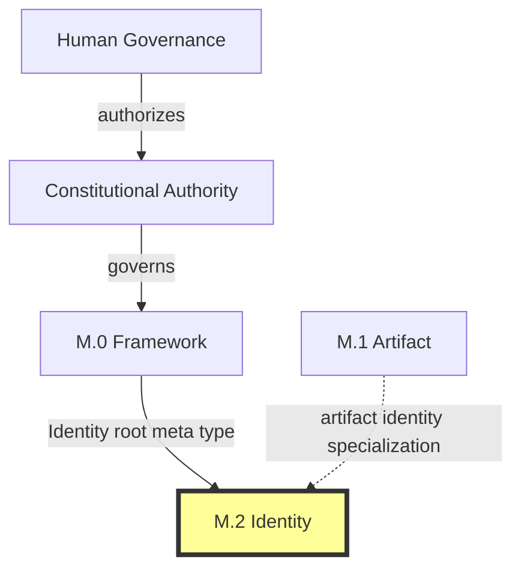
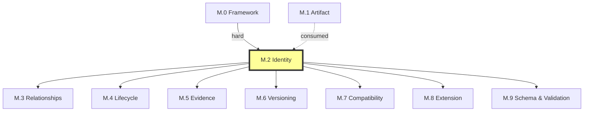

# M.2 — Identity Meta Model

> AI-DOS v1.1.0-draft · Meta Core

---

## Document Metadata

| Field | Value |
|:---|:---|
| Identifier | `AI-DOS-META-M.2` |
| Version | 1.1.0-draft |
| Status | Draft |
| Classification | Meta Core |
| Document Type | Meta Architecture Specification |
| Owner | Framework Governance |
| Review Authority | Enterprise Documentation Standards Board |
| Approval Authority | Human Governance |
| Created | 2026-07-14 |
| Last Updated | 2026-07-14 |
| Normative Authority | Human Governance; A.1 Constitution; M.0 Framework Meta Model |
| Normative References | M.0; M.1; AI-DOS Meta Enterprise Foundation v1 |
| Consumed By | M.3–M.9; Standards; Runtime; Engine; Agents; Commands; Templates; Workflows; Operational Core; registries; discovery |

---

## 1. Purpose

M.2 provides the single canonical identity semantic contract for AI-DOS, ensuring every governed entity — artifacts, families, types, instances, actors, capabilities, contexts, evidence, decisions, relationships, versions, schemas, registry entries, and extensions — can answer identity questions (stable identity, uniqueness scope, canonical reference, aliasing, collision, rename/move preservation, persistence, and registry entry identity) consistently without ambiguity, duplication, or silent collision across the entire Framework.

---

## 2. Authority Position

M.2 is part of **Meta Core**, alongside M.0, M.1, and M.3. M.2 holds enterprise identity semantic authority derived from M.0 and is above all downstream consumers. Enterprise Semantic Profiles (M.4–M.9) consume M.2; they do not modify it and must not introduce circular dependencies back into Meta Core.

M.2 specializes the M.0 Identity root meta type into a comprehensive identity contract. M.0 and M.1 define what an entity or artifact is; M.2 defines how it is identified, referenced, distinguished, and preserved through change.

---

## 3. Scope

Identity, identifier, identity scope, canonical reference, alias, external reference, collision, rename, move, identity persistence, version-independent reference, version-specific reference, registry entry identity, identity type classification, and the identity contract governing all of the above.

---

## 4. Out of Scope

Registry implementation, storage keys, URL routing, file paths as identity implementation, authentication identity, runtime session identity, user account identity, database primary keys, UUID generation algorithms, hash functions, authentication tokens, and all platform-specific identity services.

---

## 5. Owned Semantics

| Concept | Definition |
|:---|:---|
| Identity | Stable semantic reference for a governed entity, assigned once and never reused. |
| Identifier | Concrete symbolic representation of identity, composed of prefix, body, and optional version suffix. |
| Identity Scope | Boundary within which an identity must be unique (global, domain, family, type, instance, registry, namespace). |
| Identity Type | Semantic category of identity: semantic entity, artifact, instance, actor, capability, context, evidence, decision, registry entry, extension. |
| Canonical Reference | Single authoritative reference form derived from canonical identifier; used for normative references, dependencies, and traceability. |
| Version-Independent Reference | Reference to the entity itself regardless of version; used for dependency declarations and traceability links. |
| Version-Specific Reference | Reference to a particular versioned state; used for evidence pinning, certification, and audit. |
| Alias | Alternative name resolving to exactly one canonical identity; governed pointer, not independent identity. |
| External Reference | Reference to an entity outside AI-DOS governance boundary; no AI-DOS identity authority. |
| Collision | Two distinct entities sharing the same identifier within the same scope; a semantic violation. |
| Identity Persistence | Identity survives deprecation, archival, and retirement; reserved identities are never recycled. |
| Rename | Change of human-readable label or title; canonical identifier remains unchanged. |
| Move | Change of structural or contextual position; canonical identifier remains unchanged unless scope conflict requires reassignment. |
| Registry Entry Identity | Identity of a registry entry, distinct from the identity of the artifact it represents. |
| Identity Contract | Complete set of semantic rules M.2 produces for downstream consumption. |

---

## 6. Consumed Semantics

From **M.0**: Semantic Entity (entity identity binding), Artifact root meaning (artifact identity through family/type/version/instance), Actor (governance-role identity), Capability (capability identity), Context (context identity), Authority (identity assignment and reassignment authority), Ownership (identity correctness accountability), Boundary (scope boundaries), Identity root meta type (M.2 specialization target).

From **M.1** (consumed, not depended on): Artifact Instance (instance identity binding), artifact identity binding fields (identifier, version, canonical path, traceability ID, aliases), Registry Artifact (registry entry identity basis).

---

## 7. Core Definitions

### 7.1 Identity Type System

All governed entities carry exactly one canonical identity of the appropriate type. Identity types are not mutually exclusive when governance requires dual classification (e.g., an artifact instance has both artifact identity and instance identity). No downstream consumer may introduce an identity type not listed below without M.2 governance amendment.

| Identity Type | Applies To |
|:---|:---|
| Semantic Entity Identity | M.0 meta types, canonical relationship types, lifecycle states, authority levels, capability categories |
| Artifact Identity | All M.1 artifact families and their specializations |
| Instance Identity | M.1 artifact instances, validation results, review records, certification records |
| Actor Identity | Governance owners, maintainers, reviewers, approvers, AI agents (governance role only) |
| Capability Identity | M.0 capabilities, planning capabilities, engine capability declarations |
| Context Identity | Runtime contexts, engine contexts, validation contexts |
| Evidence Identity | Evidence records, findings, risk records, recommendation records |
| Decision Identity | Decision records, certification decisions, review verdicts |
| Registry Entry Identity | Registry entries, registry indexes, registry snapshots |
| Extension Identity | Extension artifacts, amendment records, supplement documents |

### 7.2 Identity Scope Model

Identity scope defines the boundary within which uniqueness is enforced. Scopes form a hierarchy; a narrower scope inherits uniqueness constraints of its parent. Scope boundaries do not change without governance approval. Two entities may share similar identifiers only if their scopes are disjoint and governance explicitly permits.

| Scope Level | Example |
|:---|:---|
| Global | `AI-DOS-META-M.0`, `AI-DOS-STD-000` |
| Domain | Meta domain: `AI-DOS-META-M.0`, `AI-DOS-META-M.1` |
| Family | Evidence family: `EVID-000001` |
| Type | Certification Package: `CERT-PKG-000001` |
| Instance | `AI-DOS-META-M.0` version `4.0.0-draft` |
| Registry | A specific standards registry index |
| Namespace | Governed by namespace profile (future) |

### 7.3 Identifier Semantics

An identifier consists of the following semantic components:

| Component | Required | Meaning |
|:---|:---|:---|
| Prefix | Yes for global/domain scope | Governed prefix indicating domain, family, or system of origin; prevents accidental cross-domain collision. |
| Body | Yes | Distinguishing part unique within scope; may contain numbers, letters, dots, hyphens, or other governed characters. |
| Separator | As defined by identifier family | Character or pattern separating prefix from body and body from version. |
| Version | No | Governed version suffix; absence implies version-independent canonical form. |

The structure is semantic, not syntactic — downstream specifications define character-level syntax for their identifier families.

| Identifier Family | Prefix Pattern | Scope |
|:---|:---|:---|
| Meta | `AI-DOS-META-` | Global |
| Architecture | `AI-DOS-ARCH-` | Global |
| Audit | `AI-DOS-AUDIT-` | Global |
| Standard | `AI-DOS-STD-` | Global |
| Evidence | `EVID-` | Family |
| Finding | `FIND-` | Family |
| Recommendation | `REC-` | Family |
| Risk | `RISK-` | Family |
| Decision | `ADR-` | Family |
| Certification | `CERT-` | Family |
| Capability | `CAP-` | Family |
| Registry Entry | Governed by registry | Registry |

New identifier families require governance approval and M.2 amendment.

### 7.4 Canonical Reference Model

Every governed entity has exactly one canonical reference that resolves to exactly one entity, is stable across rename and move, does not depend on lifecycle state or file path, and is the form used in normative references and dependency declarations.

**Version-independent references** point to the entity itself regardless of version; used for dependency declarations and traceability links that must remain valid as the entity evolves. **Version-specific references** point to a particular versioned state; used when evidence, validation, certification, or audit must pin to an exact version. Version-specific references to draft versions carry lower trust than references to approved versions. Broken references are governance violations.

### 7.5 Alias and External Reference Model

An **alias** resolves to exactly one canonical identity, shall not chain (resolves directly, not to another alias), must be declared explicitly in identity metadata, and is governed by the same authority as the canonical identity. A deprecated alias shall not be reassigned to a different canonical identity. Downstream consumers use aliases for convenience but resolve to canonical identity for normative references. Aliases may be deprecated independently of the entity they reference.

An **external reference** identifies a non-governed entity; carries no AI-DOS identity authority; shall be marked as external in metadata; and shall not be used as canonical identity for any governed entity. External references may become broken if the external entity changes, moves, or is removed.

| Reference Type | Resolves To | Governed? | Normative Use? |
|:---|:---|:---|:---|
| Canonical Identity | Itself | Yes | Yes, exclusively |
| Alias | One canonical identity | Yes | No; resolve to canonical first |
| External Reference | Non-governed entity | No | No; informative only |

### 7.6 Collision Semantics

A collision exists when: (1) two distinct governed entities carry identifiers equal under their shared scope's comparison rules, (2) an alias resolves to more than one canonical identity, or (3) an identifier creates ambiguity in a broader scope sharing the same prefix or body pattern. Detection considers exact match, case-insensitive match (when family-defined), and normalized-form match.

Collision resolution actions (governance-approved):

| Resolution | Description | Governance Significance |
|:---|:---|:---|
| Identifier Reassignment | One entity receives new identity; old becomes alias. | Significant — changes canonical identity. |
| Scope Separation | Entities moved to non-overlapping scopes. | Requires governance approval of scope change. |
| Entity Merger | Same entity under different identities; one becomes canonical, other becomes alias. | Governance determination, not implementation optimization. |
| Entity Retirement | Erroneous/superseded entity removed; identity reserved. | Identity permanently reserved. |

Collisions shall not be silently ignored or resolved by implementation convention alone. Collision resolution shall preserve historical identity and shall not break existing canonical references without a migration plan. Prevention is preferred over resolution: identifier assignment practices shall minimize collision probability.

### 7.7 Rename and Move Semantics

A **rename** changes the human-readable label or title; canonical identifier remains unchanged. Prior name becomes an alias if governance determines it is still referenced. A rename that changes the identifier (not just the title) is identity reassignment, requiring governance approval.

A **move** changes structural position; canonical identifier remains unchanged. If the move changes identity scope, governance shall verify uniqueness in the new scope. If uniqueness cannot be guaranteed, the move is blocked. If a new identifier is required due to scope conflict, the old identifier becomes an alias (identity reassignment triggered by scope migration). A move does not create a new entity. The entity retains its identity, lifecycle state, authority, ownership, and traceability.

All rename, move, and reassignment actions shall be recorded in the entity's identity metadata for audit and traceability. Identity reassignment is a significant governance action distinct from rename and move.

### 7.8 Identity Persistence

Identity persists for the lifetime of the Framework. Deprecated, archived, or retired identities remain permanently reserved and resolvable for audit and traceability. Historical identity — the record of an entity's identity through all states, renames, moves, and reassignments — shall be recorded but does not create competing identities. At every point in history, the entity had exactly one canonical identity.

When an entity is deprecated: its identifier is immediately reserved; no new entity may receive the same identifier; aliases pointing to the deprecated entity remain valid but are marked as pointing to a deprecated entity; references resolve to the entity's identity record showing deprecated status.

### 7.9 Registry Entry Identity

A registry entry is a governed artifact (M.1 Registry Artifact family) with its own artifact identity. Registry entry identity is unique within the registry scope and is governed by the registry's authority, not the represented entity's authority. The registry entry references the represented entity by canonical identity; it does not create, modify, or replace that identity. A represented entity may have multiple registry entries across different registries. Discovery through a registry shall return the canonical identity of the represented entity when the consumer's intent is to reference the governed entity.

---

## 8. Semantic Rules

1. Every governed entity shall have exactly one canonical identity assigned by an authority with identity assignment permission.
2. Every identity shall have a declared identity type from the M.2 type hierarchy.
3. Every identity shall declare or inherit its uniqueness scope.
4. No two distinct entities shall share the same identifier within the same scope.
5. An identifier shall not change after assignment unless governance approves identity reassignment.
6. A deprecated, archived, or retired identifier shall never be reassigned to a different entity.
7. Every entity shall have exactly one canonical reference form derived from its canonical identifier.
8. Every entity shall be referenceable by its version-independent identity.
9. Every versioned entity shall be referenceable by its version-specific identity when version pinning is required.
10. All aliases shall be declared explicitly and resolve to exactly one canonical identity; aliases shall not chain.
11. All external references shall be marked as external and distinguished from canonical identity references.
12. Identity collisions within a scope are semantic violations and shall be detected and resolved by governance.
13. A rename shall not change canonical identity; prior names become declared aliases.
14. A move shall not change canonical identity; scope uniqueness shall be revalidated after move.
15. Identity reassignment requires governance approval and creates an alias from the old identifier.
16. Identity persists through deprecation, archival, and retirement; reserved identities are never recycled.
17. The full history of an identity shall be recorded and traceable.
18. Registry entry identity is distinct from the identity of the represented entity.
19. Identity assignment, reassignment, and reservation authority is defined by the entity's governance chain.
20. Identifiers shall be human-readable and AI-consumable.
21. Identifiers shall not be inferred from file paths, URL paths, database keys, or other implementation artifacts.
22. Version suffixes are part of version-specific identity but not part of version-independent identity.
23. Global-scope identifiers shall use a prefix structure that prevents accidental collision with narrower-scope identifiers.
24. New identifier families require governance approval and M.2 amendment.
25. Collision resolution shall preserve historical identity and shall not break existing canonical references without a migration plan.
26. Identity is semantic and architectural; M.2 does not govern authentication identity, session identity, or user account identity.
27. Downstream consumers shall not redefine what identity means or how uniqueness is bounded.

---

## 9. Invariants

1. **Uniqueness**: No two distinct governed entities share the same identifier within the same scope.
2. **Stability**: An identifier assigned to an entity shall not be reassigned to a different entity.
3. **Permanence**: A deprecated, archived, or retired identifier shall not be recycled.
4. **Explicitness**: Identity shall be stated explicitly in metadata; it shall not be inferred from context, naming convention, or file location.
5. **Authority**: Only entities with identity assignment authority may assign identifiers within their governed scope.
6. **Scope Clarity**: The scope within which an identifier is unique shall be determinable from the identifier itself or from the entity's governance metadata.
7. **Non-Reuse**: A reserved identity shall never be assigned to a different entity.
8. **Resolvability**: A reserved identity shall remain resolvable for audit and traceability purposes.
9. **State Transparency**: The lifecycle state of a reserved identity shall be accessible and unambiguous.
10. **Historical Continuity**: The full history of an identity shall be traceable from assignment through all changes to current state.
11. **Rename Preservation**: Canonical identity is independent of human-readable label.
12. **Move Preservation**: Canonical identity is independent of structural position.
13. **Alias Uniqueness**: Every alias resolves to exactly one canonical identity.
14. **Reference Stability**: Canonical reference is independent of lifecycle state, file path, URL, and storage location.

---

## 10. Boundary Rules

M.2 must not:
- Implement identity resolution, registry storage, file path management, or authentication systems.
- Define storage schemas, database keys, URL routing, or file system paths.
- Govern authentication identity, session identity, or user account identity.
- Introduce new root meta types beyond what M.0 defines.
- Redefine Artifact, Lifecycle, Authority, Ownership, Relationship, Capability, Context, Knowledge, Evidence, Validation, Review, or Certification.
- Depend on M.3 through M.9 as prerequisites.
- Certify itself or approve downstream documents.
- Modify M.0 or M.1.
- Consume Target Project authority or Target Project concepts.

---

## 11. Selective Dependencies

Per AI-DOS Meta Enterprise Foundation v1 §7.2:

| Dependency Class | Family | Status |
|:---|:---|:---|
| Required Upstream | M.0 | Hard dependency |
| Conditional Upstream | M.1 | Consumed for artifact identity specialization only |
| Must Not Consume | M.3–M.9 | Prohibited as prerequisites |

---

## 12. Downstream Consumption

**Standards** consume M.2 for metadata field definitions (STD-010), discovery rules (STD-002), knowledge graph node identity (STD-001), and terminology identity. Standards shall not define competing identity semantics, introduce new identity types without M.2 amendment, or relax uniqueness/persistence invariants.

**Registries** consume M.2 for registry entry identity distinct from represented entity identity, uniqueness enforcement within registry scope, alias resolution, and collision detection. Registries shall not treat registry entry identity as the canonical identity of the represented entity.

**Runtime and Engine** consume M.2 for artifact resolution during context assembly and capability invocation, version-specific identity pinning, and actor identity for governance role attribution. They shall not define new identity types, generate identifiers violating M.2 scope/uniqueness rules, or conflate runtime session identity with semantic identity.

**Agents** consume M.2 for referencing governed entities by canonical identity, resolving aliases before normative claims, and reporting identity metadata. Agents shall not invent identifier schemes outside M.2 families, create aliases without governance awareness, treat file paths or URLs as canonical identity, or silently resolve collisions.

**Validation, Review, Certification** consume M.2 for identity contract compliance verification, identity integrity assessment, and identity contract as certification prerequisite. None shall redefine identity semantics, create new identity types, or bypass identity invariants.

---

## 13. Information Preservation

M.2 extracts and normalizes identity semantics previously embedded in M.0 Section 7 and M.1 Section 7. All prior semantic decisions are preserved:

From **M.0**: Identity requirements (uniqueness, stability, non-reuse, resolvability, readability) preserved as §9 invariants. Identifier families preserved and extended in §7.3. Identity rules (no inference from file path, file path does not replace identifier, rename does not change identity without governance, deprecated identifiers reserved, historical identifiers not renumbered) preserved across §7–§8.

From **M.1**: Artifact identity fields (identifier, title, artifact_family, artifact_type, version, canonical_path, canonical_status, traceability_id, aliases, supersedes, superseded_by) generalized as the identity contract in §8. Artifact identity invariants (explicit, stable, independent of runtime context, not created by graph projection alone, not changed by file movement without governance) preserved in §9. Registry artifact identity concepts specialized in §7.9.

Identity semantics are now owned by M.2. Downstream consumers shall consume M.2 for identity rules. No existing identifiers, artifact identities, or registry entries change.

---

## 14. Semantic Ownership

M.2 owns enterprise identity semantics. In the ownership chain: M.0 owns root meaning → M.1 owns artifact meaning → **M.2 owns stable identity for root and artifact entities** → M.3 owns typed relationships between identified entities → M.4–M.9 own their respective concerns. No downstream domain may redefine M.2 concepts. M.2 produces the identity contract consumed by all downstream families and domains.

---

## 15. Validation Assertions

1. Every governed entity in AI-DOS has exactly one identity of a type listed in §7.1.
2. Every identity declares or inherits a scope from the hierarchy in §7.2.
3. No two active entities share an identifier within the same scope.
4. Every entity has exactly one canonical reference form.
5. Every alias resolves to exactly one canonical identity without chaining.
6. Every external reference is marked as external in metadata.
7. No deprecated, archived, or retired identifier has been reassigned.
8. Registry entry identity is distinct from the identity of the represented artifact.
9. M.2 depends on M.0 (hard) and consumes M.1 (conditional); M.2 does not depend on M.3–M.9.
10. No implementation details (storage schemas, URL routing, authentication, session management) appear in this document.
11. All M.0 and M.1 identity concepts are preserved without redefinition of their root meanings.

---

## 16. Completion / Governance Status

| Dimension | Status |
|:---|:---|
| Phase | Phase 1 — Meta Core |
| Stage | v1.1.0-draft — 16-section enterprise model rewrite |
| Canonical Status | Non-canonical until reviewed, approved, and promoted through Framework Governance |
| Certification Status | Not certified |
| M.0/M.1 Preservation | All identity semantics extracted without redefinition of root concepts |
| Dependency Integrity | Hard on M.0; conditional on M.1; no dependency on M.3–M.9 |
| Architecture-Only | Confirmed — no implementation, storage, routing, authentication, or session identity |
| Target Independence | Confirmed — no Target Project authority consumed |
| Next Steps | Framework Governance review; downstream consumer alignment; namespace profiles; external identifier bridges |