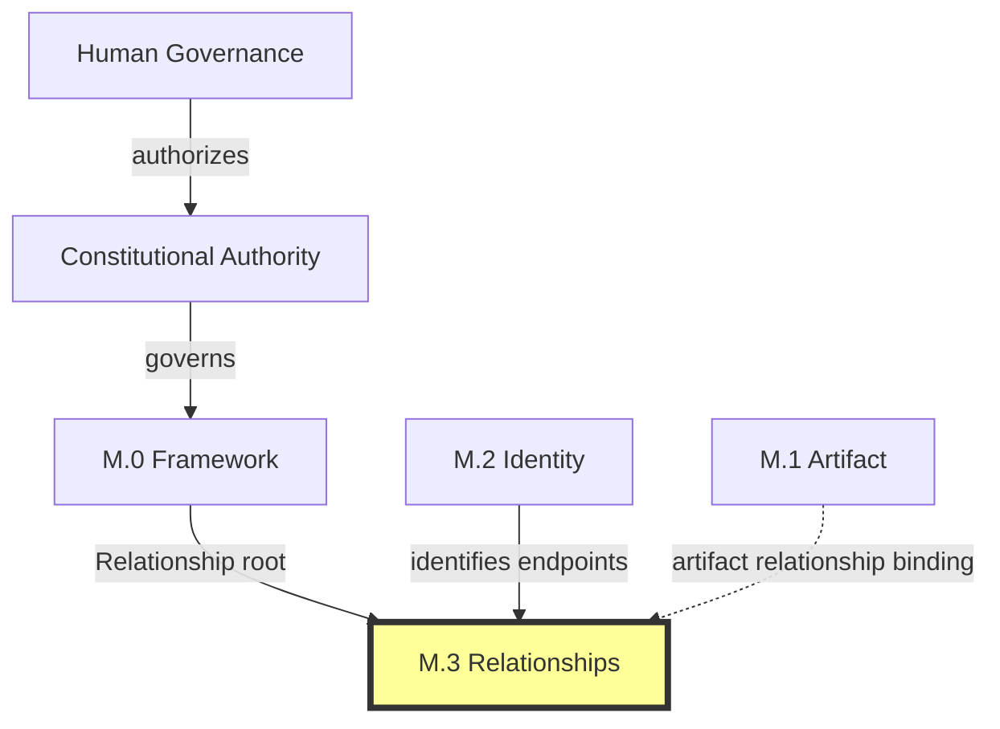
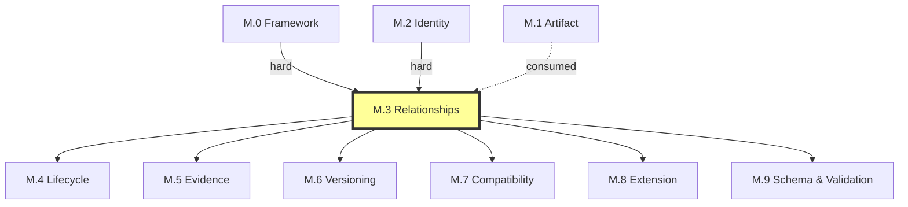

# M.3 — Relationships Meta Model

> AI-DOS v1.1.0-draft · Meta Core

---

## Document Metadata

| Field | Value |
|:---|:---|
| Identifier | `AI-DOS-META-M.3` |
| Version | 1.1.0-draft |
| Status | Draft |
| Classification | Meta Core |
| Document Type | Meta Architecture Specification |
| Owner | Framework Governance |
| Review Authority | Enterprise Documentation Standards Board |
| Approval Authority | Human Governance |
| Created | 2026-07-14 |
| Last Updated | 2026-07-14 |
| Normative Authority | Human Governance; A.1 Constitution; M.0 Framework Meta Model |
| Normative References | M.0; M.1; M.2; AI-DOS Meta Enterprise Foundation v1 |
| Consumed By | M.4–M.9; Standards; Runtime; Engine; Agents; Commands; Templates; Workflows; Operational Core |

---

## 1. Purpose

M.3 provides the single canonical relationship semantics model for the AI-DOS Enterprise Meta Family, ensuring every relationship between identified semantic entities and artifacts can answer foundational questions — type, source, target, direction, cardinality, optionality, transitivity, symmetry, inverse, invalid-edge constraints, forbidden cycles, assertion authority, and governance effects — consistently, preventing relationship semantics from becoming ambiguous, duplicated, or redefined across downstream consumers.

---

## 2. Authority Position

M.3 is part of **Meta Core**, alongside M.0, M.1, and M.2. M.3 holds enterprise relationship semantic authority derived from M.0 (Relationship root meaning) and M.2 (Identity of endpoints). Enterprise Semantic Profiles (M.4–M.9) consume M.3; they do not modify it and must not introduce circular dependencies back into Meta Core.

M.3 specializes the M.0 Relationship root abstraction into a complete relationship type system with full direction, cardinality, transitivity, symmetry, inverse, invalid-edge, cycle, assertion, and authority effect semantics. M.3 consumes M.2 identity as a precondition for relationship formation.

---

## 3. Scope

Relationship type system, relationship anatomy, direction semantics, cardinality semantics, optionality, transitivity, symmetry, inverse relationship model, invalid-edge semantics, cycle rules, relationship assertion model (normative, informative, historical), relationship authority effect, and relationship graph interpretation rules.

---

## 4. Out of Scope

Knowledge graph storage, database edges, graph query language, runtime routing, engine orchestration, workflow order, relationship storage, indexing, traversal algorithms, validation tooling, certification automation, and all implementation mechanisms.

---

## 5. Owned Semantics

| Concept | Definition |
|:---|:---|
| Relationship Type | Typed connection drawn from the M.3 root type hierarchy governing how entities relate. |
| Source | The identified entity (M.2) from which the relationship originates. |
| Target | The identified entity (M.2) to which the relationship points. |
| Direction | Declared orientational property: unidirectional, bidirectional, or inverse-paired. |
| Cardinality | Multiplicity constraint: 1:1, 1:N, N:1, or N:M; violation is a semantic error. |
| Optionality | Whether the relationship is required (mandatory) or optional for the source entity. |
| Transitivity | Whether the relationship propagates through intermediate nodes: transitive, non-transitive, or conditionally transitive. |
| Symmetry | Whether the relationship holds equally in both directions: symmetric, asymmetric, or antisymmetric. |
| Inverse Relationship | Separate relationship type representing reverse semantic direction; explicit declared pair, not inferred. |
| Invalid Edge | Semantically prohibited connection violating type, identity, authority, cardinality, direction, cycle, lifecycle, boundary, self-reference, or assertion constraints. |
| Cycle Rule | Governance over which cycles are permitted (traceability, reference, projection) and forbidden (dependency, governance, supersession, certification, lifecycle, ownership). |
| Relationship Assertion | Act of declaring a governed relationship exists, carrying assertion class: normative, informative, or historical. |
| Normative Relationship | Required by governance; consumers must respect it; evidence required; violation is governance failure. |
| Informative Relationship | Provided for context; not binding; evidence recommended but not required. |
| Historical Relationship | Existed at a prior point; relevant for audit and impact analysis but not for current governance. |
| Relationship Authority Effect | How governance authority propagates through a relationship: authority flow, delegation, containment, reflection, or none. |

---

## 6. Consumed Semantics

From **M.0**: Relationship root meaning (governed connection carrying type, source, target, direction, meaning, authority, evidence, lifecycle), Semantic Entity, Boundary, Authority, Ownership, Constraint.

From **M.2** (hard dependency): Identity of source and target. A relationship may only be asserted between entities holding stable identity under M.2. If M.2 identity is unstable, deprecated, or reserved, the relationship carries that status as a constraint on its own validity. M.3 does not redefine identity, identity assignment, or identity validation.

From **M.1** (consumed, not depended on): Artifact Relationship Binding — relationship classes artifacts may form (derives_from, governed_by, depends_on, consumes, produces, validates, reviews, certifies, references, supersedes, projects_to, traces_to). These become typed edges under M.3, gaining direction rules, cardinality constraints, transitivity classifications, and inverse declarations.

---

## 7. Core Definitions

### 7.1 Relationship Type System

All governed relationships shall derive from or instantiate a root type. Downstream domains may introduce specialized subtypes that map back to a root type. The type system is closed at the root level and open at the specialization level within each domain. New root types require M.3 amendment through Framework Governance.

| Root Type | Meaning |
|:---|:---|
| Governance | Source holds governing authority over target interpretation, lifecycle, or approval. |
| Dependency | Source requires target to be understood, present, or valid. |
| Consumption | Source uses target as input. |
| Production | Source creates, defines, or emits target. |
| Specialization | Source narrows a broader concept without redefining it. |
| Derivation | Source inherits semantic meaning from target. |
| Reference | Source links to target without dependency. |
| Validation | Source verifies target against requirements. |
| Review | Source independently assesses target. |
| Certification | Source records governed acceptance of target. |
| Traceability | Source links to evidence, decision, or outcome for auditability. |
| Supersession | Source replaces target. |
| Projection | Source has a graph, registry, schema, or operational projection of or to target. |

### 7.2 Direction Semantics

Direction is an explicit declared property of every relationship; it is not inferred from naming, position, or convention. Undeclared direction defaults to unidirectional.

| Direction | Meaning |
|:---|:---|
| Unidirectional | Holds from source to target only; reverse navigation requires a declared inverse. |
| Bidirectional | Holds equally in both directions with the same meaning (rare; genuinely symmetric only). |
| Inverse-Paired | Forward relationship plus a declared inverse relationship type with distinct reverse semantics. |

Direction is independent of traversal and does not change when stored or projected. Direction affects authority propagation: in unidirectional governance relationships, authority flows source→target; the target may not reverse-authorize through the same relationship.

### 7.3 Cardinality Semantics

Every relationship type shall declare a default cardinality. Domain specializations may tighten but shall not loosen it. Cardinality violations are semantic errors, not cardinality reclassification.

| Cardinality | Meaning |
|:---|:---|
| 1:1 | Source has at most one target; target is related to by at most one source of this type. |
| 1:N | Source may relate to many targets; each target is related to by at most one source. |
| N:1 | Many sources may relate to the same target; each source relates to at most one target. |
| N:M | Many sources relate to many targets; no ordering or priority implied. |

Cardinality is per relationship type and per optionality. Required 1:1 means exactly one target; optional 1:1 means zero or one. Many-to-many does not imply ordering, ranking, or priority.

### 7.4 Transitivity and Symmetry

Every relationship type shall declare transitivity and symmetry. Undeclared transitivity defaults to non-transitive; undeclared symmetry defaults to asymmetric.

**Transitivity**: Transitive (A→B and B→C implies A→C), Non-Transitive (no propagation), Conditionally Transitive (propagates only under declared conditions referencing lifecycle, authority, boundary, or other M.3 properties).

**Symmetry**: Symmetric (same type and meaning in both directions; inherently bidirectional; no inverse required), Asymmetric (one direction only; may participate in inverse pairs), Antisymmetric (if A→B and B→A, then A and B are the same entity).

Transitive closure is semantically valid only for relationships declared transitive. Symmetric relationships do not require inverse declarations; symmetry and inverse are distinct concepts.

### 7.5 Invalid Edge Semantics

A relationship is an invalid edge when it violates one or more constraints:

| Constraint Category | Example |
|:---|:---|
| Type Violation | Untyped connection claimed as governed relationship. |
| Identity Violation | Relationship to an entity without stable M.2 identity. |
| Authority Violation | Lower-authority artifact claiming to govern higher-authority artifact. |
| Cardinality Violation | One-to-one relationship with two targets. |
| Direction Violation | Unidirectional type claimed as bidirectional. |
| Cycle Violation | Relationship creates a forbidden cycle. |
| Lifecycle Violation | Deprecated artifact entering new governance relationship. |
| Boundary Violation | Operational artifact claiming to govern constitutional artifact. |
| Self-Reference Violation | Entity certifying itself when type prohibits self-reference. |
| Assertion Class Violation | Normative claim without required evidence. |

Invalid edges are not stored as governed relationships, do not become valid through persistence, and when detected after assertion shall be flagged for remediation. M.3 defines what constitutes an invalid edge; downstream consumers define detection mechanisms.

### 7.6 Cycle Rules

**Allowed cycles**: traceability cycles (through distinct evidence/decision paths), reference cycles (composed entirely of reference relationships), projection cycles (composed of projection relationships).

**Forbidden cycles**: dependency cycles (circular dependency), governance cycles (authority hierarchy violation), supersession cycles (logically impossible replacement chains), certification cycles (independence violation), lifecycle cycles (state progression violation), ownership cycles (accountability violation).

Cycle detection is a semantic operation: a cycle that exists but is undetected is still a violation. M.3 defines the violation; downstream consumers define detection mechanisms.

### 7.7 Relationship Assertion Model

A relationship assertion provides: source identity (M.2), target identity (M.2), relationship type (M.3), direction, cardinality, optionality, assertion class, permitting authority, evidence (when normative), and lifecycle state (when material to governance).

| Assertion Class | Evidence Required | Governance Weight |
|:---|:---|:---|
| Normative | Yes — verifiable and traceable | Highest; violation is governance failure |
| Informative | Recommended but not required | Medium; useful for interpretation, not binding |
| Historical | Historical record only | Lowest; relevant for history, not current governance |

Undeclared assertion class defaults to informative. Assertion class is independent of lifecycle state. Class changes (promotion, demotion) require governance approval. AI agents may prepare informative assertions within approved scope; shall not assert normative relationships without human governance approval.

### 7.8 Relationship Authority Effect

Every relationship type shall declare its authority effect. Undeclared defaults to no authority effect.

| Effect | Meaning |
|:---|:---|
| Authority Flow | Governance authority flows from source to target. |
| Authority Delegation | Source delegates bounded authority to target within delegation scope. |
| Authority Containment | Source contains target within a governance boundary; authority does not escape. |
| Authority Reflection | Both derive authority from a common parent; neither gains authority over the other. |
| No Authority Effect | Relationship carries no authority propagation. |

Authority effect is directional, independent of assertion class, and independent of cardinality. One-to-many governance relationships propagate authority to all targets. Authority delegation is bounded and does not exceed the delegator's authority.

### 7.9 Relationship Contract

Complete relationship contract for all canonical types:

| Type | Root | Direction | Cardinality | Transitivity | Symmetry | Inverse | Authority Effect | Self-Ref |
|:---|:---|:---|:---|:---|:---|:---|:---|:---:|
| `governs` | Governance | Uni | 1:N | Non | Asym | `governed_by` | Flow | No |
| `governed_by` | Governance | Uni | N:1 | Non | Asym | `governs` | Reflection | No |
| `conforms_to` | Governance | Uni | N:1 | Non | Asym | None | Reflection | No |
| `depends_on` | Dependency | Uni | N:M | Cond | Asym | `required_by` | None | No |
| `required_by` | Dependency | Uni | N:M | Cond | Asym | `depends_on` | None | No |
| `blocked_by` | Dependency | Uni | N:M | Non | Asym | `blocks` | None | No |
| `blocks` | Dependency | Uni | N:M | Non | Asym | `blocked_by` | None | No |
| `consumes` | Consumption | Uni | N:M | Non | Asym | `consumed_by` | None | Yes |
| `consumed_by` | Consumption | Uni | N:M | Non | Asym | `consumes` | None | Yes |
| `produces` | Production | Uni | 1:N | Non | Asym | `produced_by` | None | No |
| `produced_by` | Production | Uni | N:1 | Non | Asym | `produces` | None | No |
| `specializes` | Specialization | Uni | N:1 | Trans | Asym | `generalized_by` | Containment | No |
| `generalized_by` | Specialization | Uni | 1:N | Trans | Asym | `specializes` | Containment | No |
| `derives_from` | Derivation | Uni | N:1 | Trans | Anti | `basis_for` | Reflection | No |
| `basis_for` | Derivation | Uni | 1:N | Trans | Anti | `derives_from` | Reflection | No |
| `references` | Reference | Uni | N:M | Non | Asym | `referenced_by` | None | Yes |
| `referenced_by` | Reference | Uni | N:M | Non | Asym | `references` | None | Yes |
| `validates` | Validation | Uni | N:M | Non | Asym | `validated_by` | Delegation | No |
| `validated_by` | Validation | Uni | N:M | Non | Asym | `validates` | Delegation | No |
| `reviews` | Review | Uni | N:M | Non | Asym | `reviewed_by` | Delegation | No |
| `reviewed_by` | Review | Uni | N:M | Non | Asym | `reviews` | Delegation | No |
| `certifies` | Certification | Uni | N:M | Non | Asym | `certified_by` | Delegation | No |
| `certified_by` | Certification | Uni | N:M | Non | Asym | `certifies` | Delegation | No |
| `supersedes` | Supersession | Uni | 1:1 | Non | Asym | `superseded_by` | Flow | No |
| `superseded_by` | Supersession | Uni | 1:1 | Non | Asym | `supersedes` | None | No |
| `traces_to` | Traceability | Uni | N:M | Non | Asym | `traced_from` | None | Yes |
| `traced_from` | Traceability | Uni | N:M | Non | Asym | `traces_to` | None | Yes |
| `projects_to` | Projection | Uni | 1:N | Non | Asym | `projected_from` | None | Yes |
| `projected_from` | Projection | Uni | N:1 | Non | Asym | `projects_to` | None | Yes |
| `related_to` | Reference | Bi | N:M | Non | Sym | None | None | Yes |

Domains may add specialized types that map to a root type, inherit defaults unless explicitly overridden with governance approval, may tighten cardinality, and may add additional invalid-edge or forbidden-cycle constraints. Extensions are additive and do not modify the base contract.

---

## 8. Semantic Rules

1. Every governed relationship shall declare a type drawn from the root type hierarchy or a domain-specialized subtype mapping to a root type.
2. A relationship without a declared type is not a governed relationship under M.3.
3. Source and target must each hold stable identity under M.2 before the relationship may be asserted.
4. Direction must be declared explicitly; undeclared defaults to unidirectional.
5. Every relationship type shall declare a default cardinality; domain specializations may tighten but shall not loosen.
6. Every relationship type shall declare transitivity; undeclared defaults to non-transitive.
7. Every relationship type shall declare symmetry; undeclared defaults to asymmetric.
8. Every asymmetric relationship type should declare an inverse; consumers may not invent inverses.
9. The inverse of an inverse is the original type; inverse chains do not create new types.
10. Assertion of a forward relationship does not automatically assert the inverse.
11. Inverse relationships inherit cardinality rules of the forward type unless explicitly overridden.
12. Every governed relationship shall carry an assertion class; undeclared defaults to informative.
13. Normative assertions require verifiable, traceable evidence.
14. Historical assertions record prior state and do not imply current activity.
15. Assertion class is independent of lifecycle state.
16. Every relationship type shall declare its authority effect; undeclared defaults to none.
17. Authority flow follows relationship direction.
18. Authority delegation is bounded and does not exceed the delegator's authority.
19. Authority containment prevents escape from the governance boundary.
20. Invalid edges shall be rejected and recorded; they do not become valid through persistence.
21. Invalid edge rules are cumulative; a relationship violating multiple constraints is invalid on all counts.
22. Forbidden cycles corrupt graph semantics; consumers shall detect and report them.
23. Nodes in the relationship graph correspond to entities with M.2 identity; edges correspond to M.3-governed relationships.
24. Transitive closure may only be computed for relationships declared transitive.
25. Reverse navigation requires a declared inverse or a symmetric relationship.
26. Multiple valid interpretations are possible when the graph contains only informative or historical assertions.
27. M.1 artifact relationship classes are instances of M.3 root types.
28. Downstream consumers shall not redefine M.2 identity when asserting relationships.
29. Relationships must be stated explicitly; proximity, naming, file location, or temporal coincidence do not constitute relationships.
30. M.3 defines how relationship graphs should be interpreted semantically; it does not define storage, indexing, or querying.

---

## 9. Invariants

1. **Identity Precondition**: No governed relationship exists between entities lacking stable M.2 identity.
2. **Type Closure**: Every governed relationship type traces to an M.3 root type.
3. **Direction Explicitness**: No relationship assumes bidirectionality by default.
4. **Cardinality Contract**: Cardinality is a semantic constraint; violation is an error, not a reclassification.
5. **Transitivity Determinism**: Transitive closure is valid only when the relationship type declares transitivity.
6. **Inverse Uniqueness**: Every inverse pair is a declared explicit pair; no inverse is inferred.
7. **Assertion Classification**: Every governed relationship carries exactly one assertion class.
8. **Evidence Binding**: Normative assertions without evidence are invalid.
9. **Authority Boundedness**: Authority delegation cannot exceed delegator's authority.
10. **Invalid Edge Permanence**: An invalid edge remains invalid regardless of storage or persistence.
11. **Forbidden Cycle Prohibition**: Forbidden cycles are violations whether detected or not.
12. **Graph Semantic Integrity**: M.3-defined interpretation rules apply regardless of storage mechanism or visualization.

---

## 10. Boundary Rules

M.3 must not:
- Implement knowledge graph storage, database edges, or graph query language.
- Define runtime routing, engine orchestration, or workflow ordering.
- Redefine M.2 identity concepts, M.1 artifact type concepts, or M.0 root meta type concepts.
- Depend on M.4 through M.9 as prerequisites.
- Infer lifecycle, evidence, versioning, or compatibility effects except by consuming those concepts from their owning specifications.
- Implement relationship storage, indexing, or traversal.
- Define validation tooling, certification automation, or review procedures.
- Modify M.0, M.1, or M.2.
- Consume Target Project authority or Target Project concepts.
- Certify itself or approve downstream documents.

---

## 11. Selective Dependencies

Per AI-DOS Meta Enterprise Foundation v1 §7.2:

| Dependency Class | Family | Status |
|:---|:---|:---|
| Required Upstream | M.0; M.2 | Hard dependency |
| Conditional Upstream | M.1 | Consumed for artifact relationship binding only |
| Must Not Consume | M.4–M.9 | Prohibited as prerequisites |

---

## 12. Downstream Consumption

**STD-001 Knowledge Graph** uses M.3 relationship types as edge types; respects direction, cardinality, transitivity, and inverse for traversal. Shall not redefine relationship types; may add storage-specific properties.

**STD-002 Discovery** uses M.3 relationship types for evidence and finding linkage; uses assertion class for governance weight. Shall not create new relationship types without M.3 amendment.

**STD-000 Framework Standards** consumes M.3 relationship contract for standards governance relationships; uses authority effect for standard-to-standard governance.

**Runtime** uses M.3 for context assembly relationships; respects authority effect. Shall not redefine relationship direction or cardinality.

**Engine Platform** uses M.3 for capability and dependency relationships; respects cycle rules to prevent execution deadlocks. Shall not bypass forbidden cycle rules.

**Validation** uses M.3 to determine normative relationships requiring verification; uses invalid-edge constraints. Shall flag M.3-invalid edges as validation failures.

**Review** uses M.3 assertion class and authority effect for readiness assessment and governance weight.

**Certification** uses M.3 normative assertion requirements and evidence expectations. Shall not certify artifacts with unresolved M.3-invalid edges.

**AI Agents** use M.3 for planning, interpretation, summarization, and reporting. Shall not invent relationship types, invent inverses, assert normative relationships without governance approval, or infer relationships from proximity/naming/file location.

**Commands, Templates, Workflows, Operational Core** consume M.3 for domain-specific relationships. Shall declare relationship types for all governed connections and respect cycle rules when crossing artifact boundaries.

---

## 13. Information Preservation

M.3 is a new specification that extracts, formalizes, and extends relationship semantics from M.0 and M.1 into a dedicated relationship meta model. All prior semantic decisions are preserved:

From **M.0**: Relationship root abstraction (governed connection carrying type, source, target, direction, meaning, authority, evidence, lifecycle) preserved and specialized into the M.3 type system. M.0 concepts of Semantic Entity, Boundary, Authority, Ownership, and Constraint consumed as inputs to relationship formation and authority propagation.

From **M.1**: Artifact Relationship Binding (derives_from, governed_by, depends_on, consumes, produces, validates, reviews, certifies, references, supersedes, projects_to, traces_to) preserved as concrete instances within the M.3 relationship type system, gaining direction rules, cardinality constraints, transitivity classifications, and inverse declarations.

No M.0, M.1, or M.2 files are modified. No implementation files are created or modified. Downstream consumers shall align to M.3 for relationship semantics.

---

## 14. Semantic Ownership

M.3 owns enterprise relationship semantics. In the ownership chain: M.0 owns root meaning → M.1 owns artifact meaning → M.2 owns stable identity → **M.3 owns typed relationships between identified entities** → M.4–M.9 own their respective concerns. No downstream domain may redefine M.3 concepts. M.3 produces the relationship contract consumed by all downstream families and domains.

---

## 15. Validation Assertions

1. Every governed relationship in AI-DOS has a type mapping to an M.3 root type.
2. Both source and target of every governed relationship hold stable M.2 identity.
3. Every relationship declares direction, cardinality, transitivity, symmetry, and authority effect.
4. Every asymmetric relationship type with practical reverse navigation has a declared inverse.
5. No normative relationship assertion exists without verifiable evidence.
6. No forbidden cycle pattern exists in the governed relationship graph.
7. No invalid edge exists in the governed relationship graph.
8. M.3 depends on M.0 and M.2 (hard); consumes M.1 (conditional); does not depend on M.4–M.9.
9. No implementation details (storage, query language, routing, orchestration) appear in this document.
10. All M.0 Relationship root concepts and M.1 Artifact Relationship Binding classes are preserved without redefinition.
11. The relationship contract table covers all canonical relationship types with complete attributes.

---

## 16. Completion / Governance Status

| Dimension | Status |
|:---|:---|
| Phase | Phase 1 — Meta Core |
| Stage | v1.1.0-draft — 16-section enterprise model rewrite |
| Canonical Status | Non-canonical until reviewed, approved, and promoted through Framework Governance |
| Certification Status | Not certified |
| M.0/M.1/M.2 Preservation | All relationship semantics extracted without redefinition of root concepts |
| Dependency Integrity | Hard on M.0 and M.2; conditional on M.1; no dependency on M.4–M.9 |
| Architecture-Only | Confirmed — no storage, query language, routing, orchestration, or implementation |
| Target Independence | Confirmed — no Target Project authority consumed |
| Next Steps | Framework Governance review; STD-001/STD-002 alignment; domain relationship profiles; cross-repository relationship projection |