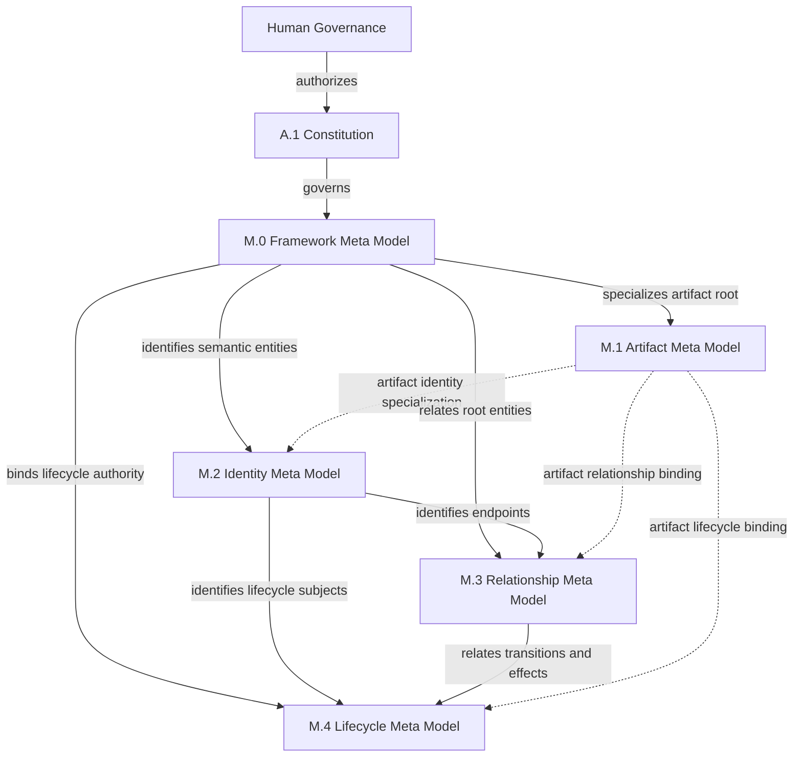
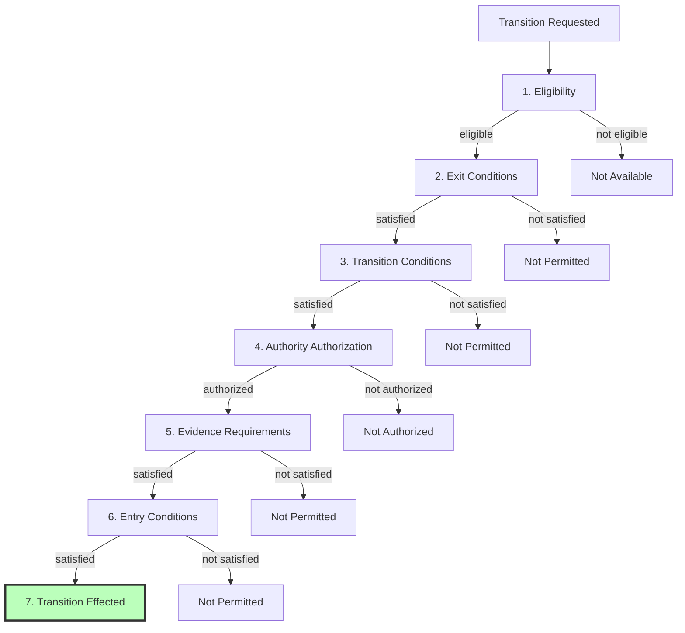
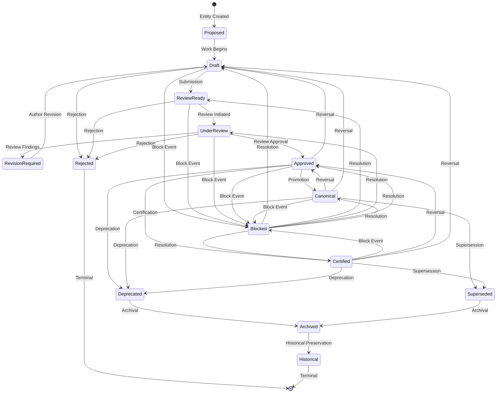
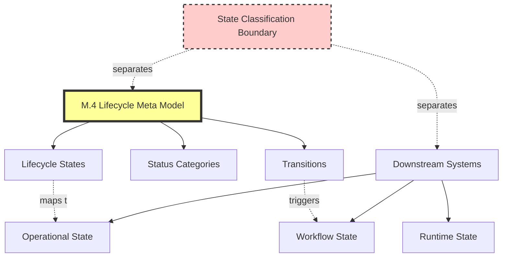
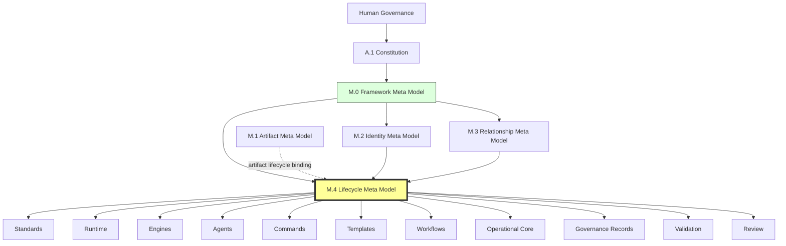

# M.4 — Lifecycle Meta Model

> AI-DOS v1.1.0-draft · Enterprise Semantic Profile

---

## Document Metadata

| Field | Value |
|:---|:---|
| Identifier | `AI-DOS-META-M.4` |
| Version | 1.1.0-draft |
| Status | Draft |
| Classification | Enterprise Semantic Profile |
| Document Type | Meta Architecture Specification |
| Owner | Framework Governance |
| Review Authority | Enterprise Documentation Standards Board |
| Approval Authority | Human Governance |
| Created | 2026-07-14 |
| Last Updated | 2026-07-14 |
| Normative Authority | Human Governance; A.1 Constitution; M.0 Framework Meta Model |
| Normative References | M.0; M.1; M.2; M.3; AI-DOS Meta Enterprise Foundation v1 |
| Consumed By | M.5–M.9; Standards; Runtime; Engine; Agents; Commands; Templates; Workflows; Operational Core; Governance Records; Validation; Review |

---

## 1. Purpose

M.4 provides the single canonical semantic model for lifecycle, status, transition, promotion, deprecation, supersession, canonicality, certification, archival, reversal, exception states, and state classification boundary in AI-DOS. Every governed entity can answer what lifecycle profile governs it, what state it occupies, what status category that state belongs to, what transitions are available, what authority and evidence each transition requires, and where lifecycle semantics end and downstream operational semantics begin. M.4 defines meanings, not procedures.

---

## 2. Authority Position

M.4 is an **Enterprise Semantic Profile** (Foundation v1 §5.4). It is not a Meta Core model. The Meta Core (README, M.0, M.1, M.2, M.3) establishes family navigation, framework meaning, artifact meaning, identity, and relationships. M.4 specializes lifecycle and status semantics as a downstream authority.

Human Governance → Constitution → M.0 → M.2 → M.3 → M.4. M.4 has hard dependency on M.0, M.2, and M.3; consumes M.1 for artifact lifecycle binding only (dotted). M.4 must not depend on M.5–M.9.

---

## 3. Scope

Lifecycle profile definition and governance. Lifecycle state, status category, and status dimension semantics. Transition anatomy, types, eligibility, conditions, authority binding, reversibility, and evaluation flow. Entry conditions, exit conditions, and terminal states. Promotion, deprecation, superseded-state effect, canonical status, certification status, archival, historical state, reversal, and exception state semantics. State classification boundary and operational status binding.

---

## 4. Out of Scope

Project planning, target project phase or stage definition, runtime active or inactive behavior, agent activation procedure, release management process, approval workflow mechanics, storage schemas, APIs, implementation code, registries, tooling, and automation.

---

## 5. Owned Semantics

| Concept | Definition |
|:---|:---|
| Lifecycle Profile | A governed template defining the set of states, transitions, authorities, and evidence requirements applicable to a class of entities. |
| Lifecycle State | A named position within a lifecycle profile that an entity may occupy, carrying defined semantics, constraints, and conditions. |
| Status Category | A classification grouping that labels a set of lifecycle states for downstream consumption (e.g., Formative, Substantive, Approved, Canonical, Certified, Deprecated, Terminal, Exceptional). |
| Transition | A governed movement of an entity from one lifecycle state to another, subject to authority, evidence, and constraint requirements. |
| Transition Authority | The authority role or entity authorized to effect a specific transition, consumed from M.0 Authority. |
| Transition Evidence Requirement | The type and sufficiency of verifiable material required to support a transition, consumed from M.0 Evidence. |
| Promotion Event | A transition that moves an entity to a state of higher trust, broader authority, or wider consumption scope. |
| Deprecation | A lifecycle event marking an entity as no longer recommended for new consumption while preserving identity, references, and historical truth. |
| Superseded-State Effect | The semantic consequences when an entity is replaced by another through a governed supersession relationship (consumed from M.3). |
| Archived | A pre-terminal state marking an entity as no longer actively maintained but not yet transitioned to historical preservation. |
| Historical | A terminal lifecycle state preserving an entity for long-term reference, audit, and traceability. |
| Canonical Status | The declaration that an entity meets governance requirements to serve as the authoritative source for its defined scope. |
| Certification Status | The declaration that an entity has completed a governed certification process and is formally accepted for its intended use. |
| Reversal | A backward transition moving an entity from a higher-trust state to a lower-trust or prior state, subject to explicit profile authorization. |
| Exception State | A lifecycle state outside the normal progression path, entered under defined abnormal conditions, requiring special authority and resolution. |
| State Classification Boundary | The semantic line separating M.4 lifecycle state from downstream operational, runtime, or planning state. |
| Status Dimension | A named axis of classification for artifact state, independent of lifecycle state; multiple dimensions apply simultaneously. |
| Status Value | A specific value within a status dimension; mutually exclusive within a single dimension. |
| Transition Eligibility | The semantic conditions under which a transition is a candidate for consideration; evaluated before conditions, authority, and evidence. |
| Transition Authority Binding | The semantic contract linking a specific transition to the authority required to authorize it. |
| Transition Condition | Semantic conditions (evidence, upstream dependency states, prior transitions, temporal) that must be satisfied for a transition, evaluated after eligibility. |
| Entry Condition | Semantic conditions that must be true to enter a lifecycle state; define what it means to be in that state. |
| Exit Condition | Semantic conditions that must be true to leave a lifecycle state; ensure obligations are met before departure. |
| Terminal State | A lifecycle state from which no further transitions are defined; lifecycle is complete but entity persists. |
| Reversible Transition | A transition with a defined inverse; the backward movement is a valid lifecycle progression. |
| Irreversible Transition | A transition with no defined inverse; the default assumption for all transitions. |
| Exception Transition | A transition triggered by exceptional circumstances, bypassing normal eligibility but requiring higher authority and stronger evidence. |
| Availability Status | A status dimension indicating whether an artifact is available for consumption (available, restricted, unavailable), independent of lifecycle status. |
| Operational Status Binding | The semantic mapping from lifecycle status to operational readiness; a meaning definition only, not runtime behavior. |

---

## 6. Consumed Semantics

| Source | Consumed Concept | M.4 Specialization |
|:---|:---|:---|
| M.0 | Authority | Transition authority — the authority authorized to effect a specific lifecycle transition |
| M.0 | Ownership | Lifecycle ownership — the accountable party for an entity's lifecycle correctness |
| M.0 | Constraint | Transition constraint — a rule that limits, conditions, or forbids a transition |
| M.0 | Boundary | State classification boundary — where lifecycle semantics end and downstream state begins |
| M.0 | Validation | Transition validation — verification that a transition meets requirements before it is effected |
| M.0 | Lifecycle (root Meta Type) | Specialized into profiles, states, transitions, and effects |
| M.0 | State (root Meta Type) | Specialized into state categories, hierarchies, and condition semantics |
| M.0 | Evidence | Transition evidence — verifiable material supporting a transition request |
| M.1 | Artifact Lifecycle Binding | Consumed only — defines what artifact lifecycle binding means in terms of state, transition, and status |
| M.2 | Identity | Stable identifiers for states, transitions, profiles, and entity traceability |
| M.3 | Relationships | State relationships through transitions; supersession as a relationship type |

---

## 7. Core Definitions

### 7.1 Lifecycle Profile Model

A **Lifecycle Profile** is a governed template that defines the complete lifecycle contract for a class of entities. Each profile declares its scope (artifact family, entity type, or governance domain), authority, stability class, and identity (consumed from M.2).

**Profile types:**

| Type | Meaning | Scope |
|:---|:---|:---|
| Foundation Profile | Base profile from which all others derive; defines universal state and transition semantics | All governed entities |
| Domain Profile | Specializes the Foundation Profile for a specific governance domain (standards, meta models, architecture specs) | Entities within a domain |
| Artifact Profile | Specializes a Domain Profile for a specific artifact family (validation, review, certification artifacts) | Entities within an artifact family |
| Regulated Profile | Future extension point for profiles complying with external regulatory requirements | Entities subject to regulation |

**Profile rules:** Every profile shall derive from the Foundation Profile or a profile that ultimately derives from it. A profile shall not conflict with Foundation Profile universal semantics. A profile may add states, restrict transitions, increase evidence requirements, or add authority constraints, but may not reduce authority, evidence, or transition constraints unless the parent explicitly permits relaxation. An entity shall be governed by exactly one primary lifecycle profile. Profile amendments require the same authority as initial definition. A profile must define all states, transitions, authorities, and evidence requirements for its scope.

### 7.2 State Model

**Status categories** group related lifecycle states for downstream consumption. The canonical categories are:

| Category | Meaning | Example States |
|:---|:---|:---|
| Formative | Early, incomplete, or not-yet-submitted; content may change significantly | Proposed, Draft, In Development |
| Substantive | Substantively complete; undergoing or awaiting independent assessment | Review Ready, Under Review, Revision Required, Awaiting Evidence |
| Approved | Passed required assessment; authorized for intended purpose | Approved, Accepted, Authorized |
| Canonical | Promoted to canonical standing; authoritative source for its scope | Canonical, Active Canonical |
| Certified | Completed governed certification; formally accepted for production or operational use | Certified, Production Certified |
| Deprecated | No longer recommended for new consumption; existing references preserved | Deprecated, Superseded, Sunset |
| Terminal | End of active lifecycle; preserved for historical reference | Archived, Retired, Historical |
| Exceptional | Outside normal progression; uncertain status pending resolution | Blocked, Suspended, On Hold |

```mermaid
graph TD
    ROOT["Foundation States"] --> FORM["Formative"]
    ROOT --> SUB["Substantive"]
    ROOT --> APPR["Approved"]
    ROOT --> CANON["Canonical"]
    ROOT --> CERT["Certified"]
    ROOT --> DEPR["Deprecated"]
    ROOT --> TERM["Terminal"]
    ROOT --> EXC["Exceptional"]

    FORM --> PROP["Proposed"]
    FORM --> DRAFT["Draft"]
    FORM --> INDEV["In Development"]

    SUB --> REVREADY["Review Ready"]
    SUB --> UNDERREV["Under Review"]
    SUB --> REVREQ["Revision Required"]
    SUB --> AWAIT["Awaiting Evidence"]

    APPR --> APPROVED["Approved"]
    APPR --> ACCEPTED["Accepted"]

    CANON --> CANONICAL["Canonical"]
    CANON --> ACTIVECANON["Active Canonical"]

    CERT --> CERTIFIED["Certified"]
    CERT --> PRODCERT["Production Certified"]

    DEPR --> DEPRECATED["Deprecated"]
    DEPR --> SUPERSEDED["Superseded"]
    DEPR --> SUNSET["Sunset"]

    TERM --> ARCHIVED["Archived"]
    TERM --> RETIRED["Retired"]
    TERM --> HISTORICAL["Historical"]

    EXC --> BLOCKED["Blocked"]
    EXC --> SUSPENDED["Suspended"]
    EXC --> ONHOLD["On Hold"]

    style ROOT fill:#ff9,stroke:#333,stroke-width:4px
```

Each state within a profile shall declare: name, identity (M.2), status category, entry conditions, exit conditions, allowed transitions, state constraints, state effects, and state authority. States may form a hierarchy where specialized states inherit general state semantics and add refinements.

**Entry conditions** define what must be true to enter a state; evaluated at transition time. An artifact not meeting entry conditions is not in that state, regardless of any label. **Exit conditions** define what must be true to leave; evaluated before transition eligibility. Terminal states have no exit conditions and no forward transitions. An entity in a terminal state retains identity, content, relationships, and historical truth — terminal does not mean ceases to exist.

Every entity governed by a lifecycle profile occupies exactly one state at any time. States are declared, not inferred. If undeclared, the state is unknown.

### 7.3 Status Model

M.4 rigorously separates status from state. **Status categories** (§7.2) are derived from state — an entity's status is the status category of its current lifecycle state. An entity may not have a status without a state. Status transitions occur only as a consequence of state transitions; a status change without a state change is a semantic error.

**Status dimensions** are named axes of classification independent of lifecycle state. Multiple dimensions apply simultaneously; the entity's full status is the combination of all applicable dimension values. Each dimension has a defined set of valid **status values**, mutually exclusive within a single dimension. A value on one dimension does not imply a value on another. Status dimensions are independent of lifecycle status category but may be influenced by lifecycle transitions.

**Availability status** is a status dimension indicating consumption permissibility:

| Value | Meaning |
|:---|:---|
| Available | May be consumed by downstream systems without restriction |
| Restricted | May be consumed only by authorized systems or under defined conditions |
| Unavailable | May not be consumed; lifecycle state preserved but consumption blocked |

Availability is independent of lifecycle status. A draft may be available for review; a canonical artifact may be temporarily unavailable. Availability changes shall be traceable and auditable. Availability does not override lifecycle authority — an unavailable canonical entity remains canonical.

### 7.4 Transition Model

**Transition anatomy:** Every transition declares: identity (M.2), source state, target state, transition authority (M.0), evidence requirements (M.0), constraints, effects, and reversibility.

**Transition types:**

| Type | Meaning |
|:---|:---|
| Forward | Normal progression to a higher-trust or later state |
| Lateral | Movement between states of equivalent trust/position |
| Promotion | Forward transition elevating to higher-trust, higher-authority, or wider-consumption state |
| Deprecation | Moves entity to Deprecated status category |
| Supersession | Marks entity as superseded by another (consumed from M.3) |
| Reversal | Backward transition to a lower-trust or prior state; exceptional |
| Exception | Moves entity from normal to exceptional state; bypasses normal eligibility |
| Resolution | Moves entity from exceptional back to normal state |
| Terminal | Moves entity to a terminal state |

**Transition evaluation flow** (semantic invariant — order is the meaning of permission, not a procedural sequence):

**Eligibility** is the first gate: a transition is eligible when source exit conditions and target entry conditions are both satisfiable. Eligibility does not guarantee permission; it determines candidacy.

**Transition conditions** are evaluated after eligibility, before authority. They are logical and evidential prerequisites specific to the transition — upstream dependency states, prior transition completion, temporal conditions, completeness criteria. Conditions are meanings, not automation triggers.

**Transition authority binding** links each transition to exactly one primary authority (consumed from M.0). Authority varies per transition. Delegation is permitted but traceable. If no binding is declared, the transition is invalid. The authority for a reversal must be at least as high as the authority that effected the original forward transition.

**Reversibility** is a semantic property. Irreversibility is the default. Reversible transitions (typically working states) have a defined inverse with its own eligibility, conditions, authority, and evidence. Reversal does not erase forward transition history. Irreversible transitions (typically promotion to Canonical, certification, terminal transitions, supersession) have no valid backward path.

**Exception transitions** bypass normal eligibility but require authority at least as high as the highest-authority normal transition, stronger evidence, full traceability (trigger, authority, evidence, timestamp), and a defined resolution path. Every exception transition into an exceptional state must have a corresponding resolution transition.

### 7.5 Promotion, Deprecation, Canonical Status, and Certification

**Promotion** is a trust-elevating transition requiring authority at least as high as the entity's current state and verifiable evidence specific to the entity. Generic or template evidence does not suffice. Passive aging, time-based triggers, or absence of objection does not constitute promotion.

**Deprecation** preserves identity, content, relationships, and historical truth. New entities shall not depend on a deprecated entity for authority or normative reference; existing references remain valid until migrated. Deprecation is one-directional; an entity does not become un-deprecated through a simple state change. Deprecation does not automatically trigger archival. Self-deprecation by the owner is not permitted.

**Canonical status** is never self-declared; it requires authority action by a party other than the entity owner. Canonical status is exclusive within scope — if a new entity is promoted for a scope already served, the prior entity must be transitioned to Superseded or Deprecated. Canonical status does not guarantee correctness; it guarantees the entity passed required governance processes.

**Certification status** is a lifecycle state, not a badge. It requires a distinct certification authority — the entity owner, maintainer, or reviewer may not self-certify, and AI agents may not certify. Certification in one scope does not imply certification in another. Certification evidence must be retained for the duration of certification and applicable retention periods.

### 7.6 Superseded-State Effect, Archival, Historical, and Exception States

**Supersession** transfers authoritative role to the superseding entity. The superseded entity retains identity, content, and relationships; a new superseded-by relationship is added. New adoption is prohibited for the superseded scope. Existing references retain continuity until migrated. If the superseded entity held canonical status, it is revoked for the superseded scope. Supersession requires explicit authority; it is not inferred from naming, versioning, or file existence.

**Archived** is pre-terminal: the entity is no longer actively maintained, content and metadata shall not be modified, and the entity no longer holds governance authority. Reactivation is possible only through explicit governance reversal with full re-validation.

**Historical** is terminal: permanent, read-only, no further transitions except through explicit governance reversal. Historical identifiers shall not be reused.

**Exception states** (Blocked, Suspended, On Hold) are defined by the lifecycle profile with specified entry triggers and resolution conditions. Resolution requires explicit authority action — time passing or inactivity is not sufficient unless the profile defines it. Exception states may have time limits; exceeding them may trigger escalation or automatic transition.

### 7.7 State Classification Boundary

M.4 defines lifecycle states, status categories, and transitions. Downstream systems define their own operational states (running, stopped, loaded), workflow states, and planning states. These are separate concepts.

**Boundary rules:** Lifecycle state is not operational state. Lifecycle transition is not a workflow step. Lifecycle status is not runtime status. Lifecycle profile is not a process definition. Project phases are not lifecycle states.

Downstream systems may map lifecycle states to operational behaviors, derive workflow triggers from transitions, and display lifecycle status alongside operational status — but the mapping is downstream; M.4 does not define it. A violation occurs when a downstream system redefines a lifecycle state, status category, or transition meaning.

**Operational status binding** is the semantic mapping from lifecycle status to operational readiness — a meaning definition only, not runtime behavior. The direction is unidirectional: lifecycle status informs operational behavior; operational state does not retroactively change lifecycle status. The binding crosses the State Classification Boundary explicitly and governed. Multiple downstream systems may define different bindings for the same lifecycle status within their governance domains.

---

## 8. Semantic Rules

1. Every governed entity shall be bound to exactly one primary lifecycle profile.
2. Every entity shall occupy exactly one lifecycle state at any given time, declared explicitly.
3. Status is derived from state through status category mapping; never declared independently.
4. Every transition shall be defined in the governing lifecycle profile with a declared transition authority.
5. No transition may occur without satisfying its evidence requirements unless the profile explicitly waives evidence.
6. A transition's effects shall be defined before the transition is available for use.
7. A transition that would leave an entity in an undefined state is invalid.
8. Transitions crossing profile boundaries require explicit profile-to-profile mapping and authority.
9. Entry conditions define what it means for an artifact to be in a state — an artifact not meeting them is not in that state.
10. Exit conditions are evaluated before transition eligibility and transition conditions.
11. Entry conditions are evaluated after authority authorization but before the transition is effected.
12. Terminal states have no exit transitions except reversal where the profile explicitly permits.
13. All transitions are irreversible unless the profile explicitly defines a reversal path; reversibility is a semantic property, not a procedural convenience.
14. A reversal does not erase the forward transition from history; both are permanently recorded.
15. The authority for a reversal transition must be at least as high as the authority that effected the original forward transition.
16. Exception transitions bypass normal eligibility but require higher authority, stronger evidence, full traceability, and a defined resolution path.
17. Every exception transition into an exceptional state must have a corresponding resolution transition.
18. Promotion requires explicit authority action; passive aging, time-based triggers, or absence of objection does not constitute promotion.
19. Promotion evidence shall be specific to the entity being promoted; generic evidence does not suffice.
20. Canonical status is never self-declared; it requires authority action by a party other than the entity owner.
21. Canonical status is exclusive within scope; a prior canonical entity must be transitioned when a new entity is promoted.
22. Certification requires a distinct certification authority; the entity owner and AI agents may not self-certify.
23. Deprecation is one-directional; it preserves identity, content, relationships, and historical truth.
24. Self-deprecation by the owner is not permitted.
25. Supersession requires explicit authority and an existing superseding entity with a state permitting it to assume the scope.
26. Archival preserves the entity exactly as it was at the point of archival; it does not delete, invalidate, or modify.
27. Historical entities are permanent records; identity and content shall not be reused, overwritten, or deleted.
28. Exception states require defined entry triggers and explicit resolution authority; time passing is not sufficient unless profile-defined.
29. Status dimensions are independent axes; a value on one dimension does not imply a value on another.
30. An entity shall hold exactly one status value per applicable status dimension.
31. Status dimension changes do not imply lifecycle state changes and vice versa.
32. Availability status is independent of lifecycle status but may be influenced by lifecycle transitions.
33. Operational status bindings are meaning definitions only — they do not define runtime behavior.
34. Lifecycle status informs operational behavior; operational state does not retroactively change lifecycle status.
35. Downstream consumers may filter or route based on status category or dimension but shall not redefine meanings.
36. Lifecycle profiles, status categories, and transitions are consumed by downstream domains; downstream domains do not invent competing lifecycle concepts.

---

## 9. Invariants

1. An entity has exactly one lifecycle state at any given time.
2. Status is derived from state, not declared independently.
3. Promotion requires authority and evidence.
4. Certification requires a distinct authority from the entity owner.
5. Deprecation preserves identity and historical truth.
6. Archival preserves content without modification.
7. The State Classification Boundary separates lifecycle semantics from operational semantics.
8. All transitions are irreversible unless the profile explicitly defines a reversal path.
9. Transition evaluation order: eligibility → exit conditions → transition conditions → authority → evidence → entry conditions.
10. Status dimensions are independent axes; a value on one does not imply a value on another.
11. Terminal states have no forward transitions; terminal does not mean the entity ceases to exist.
12. Exception transitions require a defined resolution path.
13. A transition is eligible when source exit conditions and target entry conditions are both satisfiable.
14. Transition conditions are meanings, not automation triggers.
15. Entry conditions define state occupancy; an artifact not meeting them is not in that state regardless of label.
16. Operational status bindings are meaning definitions only — they do not define runtime behavior.
17. Canonical status requires exclusive scope and explicit governance authorization by a party other than the owner.

---

## 10. Boundary Rules

- M.4 shall not define project planning phases or stages.
- M.4 shall not define runtime active or inactive behavior.
- M.4 shall not define agent activation procedures.
- M.4 shall not define release management processes.
- M.4 shall not define approval workflow mechanics.
- M.4 shall not define storage schemas, APIs, implementation code, registries, tooling, or automation.
- M.4 shall not redefine M.0 Authority, M.2 Identity, or M.3 Relationship meanings.
- M.4 shall not depend on M.5 through M.9.
- M.4 is platform-independent and Target-independent.

---

## 11. Selective Dependencies

Per Foundation v1 §7.2:

| Family | Required Upstream | Conditional Upstream | Must Not Consume |
|:---|:---|:---|:---|
| M.4 Lifecycle | M.0; M.2; M.3 | M.1 for artifact lifecycle binding | M.5–M.9 |

---

## 12. Downstream Consumption

| Consumer | Consumes from M.4 | Must Not |
|:---|:---|:---|
| M.5 Evidence | Transition evidence semantics (conditional) | Redefine lifecycle concepts |
| Standards | Lifecycle profiles, status categories, transition rules, promotion requirements | Create competing lifecycle type systems |
| Runtime | Lifecycle state, transition semantics, state classification boundary | Treat operational states as lifecycle states |
| Engines | Lifecycle state, transition semantics, certification semantics | Bypass transition authority or evidence requirements |
| Agents | Lifecycle state, status, transition authority; request transitions through proper channels | Self-certify, bypass authority, infer state from file location |
| Commands | Lifecycle state validation, status categories | Infer state from naming or proximity |
| Templates | Lifecycle state, status categories | Redefine state meanings |
| Workflows | Transition semantics, state classification boundary | Treat transitions as workflow steps |
| Operational Core | Status categories, state classification boundary | Conflate lifecycle status with operational status |
| Governance Records | Transition records, authority actions, evidence | Initiate promotion/certification without authority |
| Validation | Transition validation, evidence requirements | Redefine lifecycle concepts |
| Review | Promotion readiness, evidence sufficiency | Redefine lifecycle concepts |

All downstream consumers may map lifecycle states to operational behaviors, derive workflow triggers, and display lifecycle status alongside operational status. All downstream consumers shall not redefine lifecycle states, status categories, or transition meanings; create competing lifecycle type systems; bypass transition authority or evidence requirements; infer lifecycle state from file location, naming, or proximity; treat project phases as lifecycle states; treat operational states as lifecycle states; or violate the State Classification Boundary.

---

## 13. Information Preservation

M.4 establishes lifecycle semantics that were previously implicit, distributed, or undefined across the enterprise. All existing lifecycle meanings from scattered sources are consolidated into M.4 as the single authoritative source. No existing documents are modified. Downstream consumers align by referencing M.4 for lifecycle meanings rather than defining their own. Legacy lifecycle terminology is mapped to M.4 concepts under existing legacy freeze rules.

---

## 14. Semantic Ownership

M.0 owns lifecycle and state as root Meta Types. M.4 owns the full semantic specialization: lifecycle profiles, lifecycle states, status categories, status dimensions, transitions, promotion, deprecation, superseded-state effects, canonical status, certification status, archival, historical state, reversal, exception states, and state classification boundary. M.4 does not redefine M.0 Authority, M.2 Identity, or M.3 Relationship meanings — it consumes them and specializes them for lifecycle-specific purposes.

---

## 15. Validation Assertions

- For any governed entity, a governing lifecycle profile can be identified.
- For any entity in a lifecycle state, exactly one state is declared; the status category is derivable.
- For any transition in a governing profile, a transition authority binding exists and is traceable to M.0.
- For any canonical entity, canonical status was authorized by a party other than the owner.
- For any canonical scope, no two entities simultaneously hold canonical status.
- For any deprecated entity, identity, content, and relationships are preserved.
- For any terminal-state entity, no forward transition is defined in the governing profile.
- No downstream consumer redefines an M.4 owned concept.
- M.4 depends on M.0, M.2, and M.3; does not depend on M.5–M.9.
- The State Classification Boundary is respected in all downstream consumption.

---

## 16. Completion / Governance Status

| Dimension | Value |
|:---|:---|
| Document Status | Draft |
| Promotion Path | Review → Approval → Canonical promotion by Human Governance |
| Readiness | Ready for Enterprise Documentation Standards Board review |
| Blocking Issues | None |
| Downstream Alignment | Pending — Standards, Runtime, Engines, Agents, Workflows, Operational Core to consume M.4 post-approval |