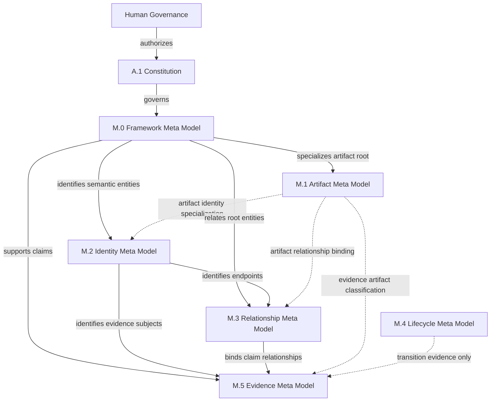
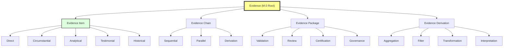
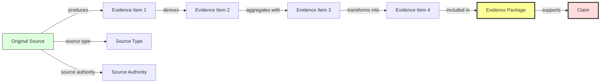
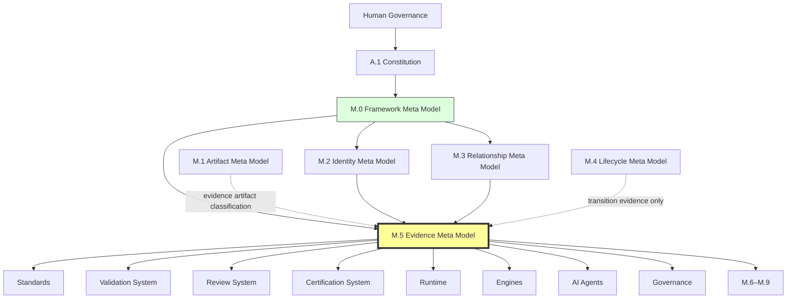

# M.5 — Evidence Meta Model

> AI-DOS v1.1.0-draft · Enterprise Semantic Profile

---

## Document Metadata

| Field | Value |
|:---|:---|
| Identifier | `AI-DOS-META-M.5` |
| Version | 1.1.0-draft |
| Status | Draft |
| Classification | Enterprise Semantic Profile |
| Document Type | Meta Architecture Specification |
| Owner | Framework Governance |
| Review Authority | Enterprise Documentation Standards Board |
| Approval Authority | Human Governance |
| Created | 2026-07-14 |
| Last Updated | 2026-07-14 |
| Normative Authority | Human Governance; A.1 Constitution; M.0 Framework Meta Model |
| Normative References | M.0; M.1; M.2; M.3; M.4 (conditional); AI-DOS Meta Enterprise Foundation v1 |
| Consumed By | M.6–M.9; Standards; Runtime; Engine; Agents; Commands; Templates; Workflows; Operational Core; Validation; Review; Certification; Governance |

---

## 1. Purpose

M.5 provides the canonical evidence semantics for AI-DOS. Evidence is the semantic material that grounds truth claims, supports governance decisions, underpins validation results, enables independent review, justifies certification, and provides auditable traceability for lifecycle transitions, compatibility declarations, and schema conformance. M.5 defines what evidence is, how it is structured, how it is bound to claims, how its quality is assessed, how long it remains relevant, how confident consumers may be in its support, and how its provenance is traced. M.5 does not define storage, collection infrastructure, or execution automation.

---

## 2. Authority Position

M.5 is an **Enterprise Semantic Profile** (Foundation v1 §5.4). It is not a Meta Core model. The Meta Core (README, M.0, M.1, M.2, M.3) establishes family navigation, framework meaning, artifact meaning, identity, and relationships. M.5 specializes evidence semantics as a downstream authority.

M.0 introduces Evidence as a root Meta Type. M.1 classifies evidence as an artifact family. M.5 provides the complete semantic specification. M.5 does not redefine what M.0 means by Evidence; it specializes the concept.

Human Governance → Constitution → M.0 → M.2 → M.3 → M.5. Hard dependency on M.0, M.2, and M.3; consumes M.1 for evidence artifact binding/classification; consumes M.4 conditionally when evidence supports lifecycle transitions. M.5 must not depend on M.6–M.9.

---

## 3. Scope

Evidence type system and root evidence types. Evidence item structure and required properties. Evidence identity semantics. Evidence source types and source authority. Evidence subject and claim binding. Evidence assertion semantics. Evidence quality dimensions and assessment. Validity, freshness, confidence, and reproducibility. Retention class categories. Provenance chain and traceability. Evidence sufficiency and limitation. Evidence contract.

---

## 4. Out of Scope

Evidence storage systems, log collection infrastructure, test command execution, telemetry implementation, report template formats, approval decisions, runtime evidence collection automation, and storage schema definitions.

---

## 5. Owned Semantics

| Concept | Definition |
|:---|:---|
| Evidence Item | The atomic unit of evidence: a single verifiable support element for a claim, carrying identity, source, subject, claim binding, quality, and provenance. |
| Evidence Identity | Stable, unique, governed identity for every evidence item, chain, package, and derivation, following M.2 rules. |
| Evidence Source | The origin of evidence, classified by type (direct observation, automated execution, human judgment, document reference, system record, external, derived) and authority level (constitutional, canonical, governed, operational, external, unverified). |
| Evidence Subject | The artifact, process, system, requirement, risk condition, or decision that the evidence is about. |
| Evidence Claim | The specific claim that evidence supports, partially supports, contradicts, or is neutral toward, bound as an M.3 relationship. |
| Evidence Assertion | The explicit declarative statement of what the evidence asserts about its subject, bridging raw content and the claim it supports. |
| Evidence Quality | Multidimensional assessment across six independent dimensions: accuracy, completeness, consistency, relevance, source authority, and provenance transparency. |
| Validity | Whether evidence is suitable for its intended use; categories: valid, conditionally valid, partially valid, invalid, superseded. |
| Freshness | Temporal relevance of evidence; classifications: current, approaching stale, stale, timeless, archived. |
| Confidence | How strongly evidence supports a claim; levels: very high (0.90–1.00), high (0.70–0.89), moderate (0.40–0.69), low (0.15–0.39), very low (0.00–0.14). |
| Reproducibility | Degree to which evidence can be independently produced again; classes: fully reproducible, conditionally reproducible, partially reproducible, not reproducible, not applicable. |
| Retention Class | How long evidence must remain available; categories: permanent, long-term, standard, short-term, transient. |
| Provenance | The complete, unbroken chain of origin, custody, derivation, and transformation for an evidence item. |
| Traceability | The governed semantic chain linking claims to evidence, evidence to sources, sources to artifacts, and artifacts to authority. Owned by M.5. |
| Evidence Chain | An ordered, traceable sequence of evidence items that together support a compound claim. |
| Evidence Sufficiency | Per-claim judgment that enough evidence exists to support the claim; assessed against coverage, depth, convergence, counterevidence, quality, freshness, confidence, and provenance integrity. |
| Evidence Limitation | Mandatory acknowledgment of known gaps, biases, temporal constraints, scope boundaries, dependencies, and assumptions. |

---

## 6. Consumed Semantics

| Source | Consumed Concept | M.5 Specialization |
|:---|:---|:---|
| M.0 | Evidence (root Meta Type) | Specialized into evidence items, chains, packages, and derivations |
| M.0 | Authority | Evidence governing authority; evidence supports authority but does not replace it |
| M.0 | Decision, Finding, Recommendation, Risk, Validation, Context | Evidence subjects and claim types for these root concepts |
| M.1 | Evidence artifact classification / consumption interface | Evidence as a governed artifact family with identity and lifecycle requirements |
| M.2 | Identity | Stable identifiers for evidence items, chains, packages, and derivations |
| M.3 | Relationships | Claim binding types (supports, partially supports, contradicts, neutral); provenance chains; evidence-to-evidence relationships |
| M.4 | Lifecycle transition evidence (conditional) | Evidence requirements for lifecycle transitions when M.4 is available |

---

## 7. Core Definitions

### 7.1 Evidence Type Hierarchy

All evidence in AI-DOS derives from four root types, each with subtypes:

| Root Type | Meaning |
|:---|:---|
| Evidence Item | Atomic unit of evidence; base type carrying identity, source, subject, claim binding, quality, and provenance |
| Evidence Chain | Ordered, traceable sequence of evidence items supporting a compound claim |
| Evidence Package | Named, governed collection of items and chains assembled for a specific purpose (validation, review, certification, governance) |
| Evidence Derivation | Evidence produced by transforming, aggregating, filtering, or interpreting source evidence items |

**Evidence Item subtypes:** Direct (observation record, measurement record, execution trace), Circumstantial, Analytical (statistical analysis, model output, automated assessment), Testimonial, Historical.

**Evidence Chain subtypes:** Sequential, Parallel, Derivation.

**Evidence Package subtypes:** Validation Package, Review Package, Certification Package, Governance Package.

**Evidence Derivation subtypes:** Aggregation, Filter, Transformation, Interpretation.

Every evidence item shall derive from one or more M.5 root evidence types. Chains shall reference only items with stable identity. Packages shall carry the identity, authority, and lifecycle state required by M.1 and M.4. Derivations shall record every source item and every transformation applied. Downstream consumers shall not create new root evidence types without M.5 extension governance.

### 7.2 Evidence Item Anatomy

**Evidence identity** follows M.2: unique within the governed evidence namespace, stable after creation, never reused, reserved after deprecation or archival, traceable through claim bindings and derivations, and compliant with M.2 identifier family rules (e.g., `EVID-000001` for items, `ECHAIN-000001` for chains, `EPKG-000001` for packages, `EDERIV-000001` for derivations). Identity may not be inferred from file path, log line, or storage location alone. When evidence is included in multiple packages, its identity remains the same; the package records the inclusion.

**Evidence assertion** bridges raw content and the claim. An assertion must be declarative (not interrogative or imperative), bounded in scope, state its derivation method (direct observation, automated analysis, human interpretation, statistical computation, or logical inference), and state its limitations explicitly. An assertion must not claim more than its supporting evidence justifies. Assertions are not claims — an assertion states what the evidence shows; a claim states what is being asserted about the world. Multiple assertions may be derived from a single evidence item. Assertion conflicts between evidence items must be resolved by governance, not by evidence precedence alone.

Every evidence item is a governed artifact carrying these required properties:

| Property | Definition |
|:---|:---|
| Identity | Stable identifier following M.2; unique within governed namespace |
| Evidence Type | M.5 type classification (direct, circumstantial, analytical, testimonial, historical) |
| Source | Source type and source authority per §7.2 |
| Subject | The artifact, process, or claim the evidence addresses |
| Claim Binding | At least one M.3 relationship with explicit binding type |
| Content | Actual evidence material: observation, measurement, analysis, testimony, or traceable reference |
| Assertion | Clear, declarative statement with scope, method, and limitations |
| Quality Assessment | Ratings for all six quality dimensions with justification |
| Validity | Validity category assessed against defined criteria |
| Freshness | Creation timestamp, assessment timestamp, freshness classification |
| Confidence | Confidence level and justification per claim binding |
| Reproducibility | Reproducibility class and reproduction conditions where applicable |
| Retention Class | Retention category |
| Provenance | Complete provenance chain |
| Limitations | Explicit statement of known limitations, biases, gaps, and constraints |
| Authority | Governing authority per M.0 |
| Owner | Accountable owner per M.0 |
| Lifecycle State | Current lifecycle state per M.1 and M.4 |

Evidence without identity is not governed evidence. Evidence without a source has no standing. Evidence without a claim binding is orphaned material. Evidence without a limitation statement is incomplete. Evidence without a freshness assessment cannot be used for time-sensitive claims. Evidence items may not self-certify their own validity, confidence, or quality.

### 7.3 Source Model

**Source types** and their trust bases:

| Source Type | Trust Basis |
|:---|:---|
| Direct Observation | High when conditions are documented and reproducible |
| Automated Execution | High when the automation is governed, versioned, and configuration is traceable |
| Human Judgment | Moderate to high depending on expertise documentation and independence |
| Document Reference | Depends on authority and currency of the referenced document |
| System Record | Moderate when the system is governed and the record is tamper-evident |
| External Source | Low to moderate; requires additional authority and validity assessment |
| Derived Source | Depends on quality and provenance of source evidence items |

**Source authority levels:** Constitutional, Canonical, Governed, Operational, External, Unverified.

Source type and source authority are independent dimensions. Source identity must be recorded; anonymous or unattributed evidence has no governed standing. Source authority does not guarantee quality; it supports trust assessment but does not replace quality evaluation.

### 7.4 Claim Binding Model

Evidence is always about something (subject) and for something (claim). The claim binding is an M.3 relationship of type `supports`, `partially supports`, `contradicts`, or `is neutral toward`.

**Claim types:** Conformance, Validation, Review, Certification, Risk, Recommendation, Decision, Compatibility, Lifecycle.

Every evidence item must have at least one claim binding. A claim binding without a subject is incomplete. Claim binding type must be stated explicitly; not inferred from content. Multiple evidence items may support the same claim (constituting an evidence chain). A single evidence item may support multiple claims when independently relevant.

### 7.5 Quality Model

Evidence quality is assessed across six independent dimensions. Every dimension must be rated (High / Moderate / Low / Unassessed) with justification for every evidence item.

| Dimension | Assesses |
|:---|:---|
| Accuracy | Degree to which evidence content correctly represents observed reality |
| Completeness | Degree to which all material aspects of the subject are covered |
| Consistency | Degree to which evidence does not contradict itself or related evidence |
| Relevance | Degree to which evidence is material to the claim it binds |
| Source Authority | Degree to which the evidence source carries governed authority |
| Provenance Transparency | Degree to which origin and derivation chain is fully traceable |

Dimensions are independent: high accuracy does not imply high completeness; high source authority does not imply high relevance. An item with any dimension rated Unassessed may not be used as sole support for a critical claim. Quality may degrade over time; reassessment is required when evidence age exceeds the freshness window. Downstream consumers may define minimum quality thresholds for specific use cases but may not redefine the dimensions.

**Validity** determines whether evidence is suitable for its intended use. Categories: Valid (meets all criteria), Conditionally Valid (valid only under stated conditions), Partially Valid (valid for some aspects but not all), Invalid (does not meet criteria; must not support the bound claim), Superseded (valid but replaced by newer, more authoritative evidence). Validity is assessed relative to a specific use, not absolutely — evidence valid for one claim may be invalid for another. Validity assessment must be recorded; assumed validity is not governed validity. Validity is not permanent; reassessment is required when conditions change. Invalid evidence must be flagged and excluded from packages until reassessed.

**Freshness** captures temporal relevance. Classifications: Current (within freshness window), Approaching Stale (final 20% of window; reassessment needed), Stale (beyond window; must be reassessed before use), Timeless (subject is immutable, e.g., canonical standard; must be justified), Archived (reuse requires governance review). Freshness windows are defined by the consuming use case — the same evidence may be current for one use case and stale for another. Freshness is independent of validity.

**Confidence** expresses how strongly evidence supports a claim. Levels: Very High (0.90–1.00), High (0.70–0.89), Moderate (0.40–0.69), Low (0.15–0.39), Very Low (0.00–0.14). Confidence is always bounded; no evidence may claim absolute certainty. Confidence is distinct from certainty (an epistemological state outside M.5's scope). Confidence is assessed per claim binding, not per evidence item. Confidence must be justified and must account for limitations, quality gaps, and counterevidence.

**Reproducibility** measures whether the same evidence can be independently produced again. Classes: Fully Reproducible (any qualified party can reproduce exactly), Conditionally Reproducible (reproducible under specific documented conditions), Partially Reproducible (some aspects reproducible), Not Reproducible (depends on transient/unique conditions), Not Applicable (meaningless for the evidence type). Non-reproducible evidence must state why and what alternative verification was used. Reproducibility degrades over time; periodic reassessment is expected.

**Retention** defines how long evidence must remain available. Classes: Permanent (constitutional, canonical, or certification-bearing claims), Long-Term (years; defined by policy), Standard (typically one to three years), Short-Term (days to months), Transient (seconds to hours). Retention class is assigned at creation, upgradable but not downgradable without governance approval. Evidence in active packages must not be purged regardless of retention class until the package is resolved.

### 7.6 Traceability Model

**Traceability** is owned by M.5. It is the governed ability to traverse the provenance chain in both directions:

- **Forward traceability:** from a source to all evidence items, chains, packages, and claims derived from it.
- **Backward traceability:** from a claim or evidence item to its complete provenance chain back to the original source.
- **Lateral traceability:** from an evidence item to all related evidence items, claim bindings, and packages.

**Evidence Chain** is an ordered, traceable sequence of evidence items supporting a compound claim. Chains have stable identity (M.2), may contain items of different types and sources, and are assessed for sufficiency as a composite.

**Evidence Sufficiency** is a per-claim judgment (not per-item). Criteria: coverage, depth, convergence, counterevidence assessment, quality threshold, freshness threshold, confidence threshold, and provenance integrity. Sufficiency levels: Sufficient, Partially Sufficient, Insufficient. Partially sufficient evidence may support provisional claims but not final or canonical claims. Insufficient evidence must not be used as sole support for any governed claim.

**Provenance** requires recording: original source, every derivation/transformation/aggregation step, identity of the party or process performing each step, timestamp, governing method or rule, and all input evidence item identities. The provenance chain must be unbroken and immutable (corrections appended, not overwritten). Broken chains must be flagged immediately and affected items reassessed.

---

## 8. Semantic Rules

1. Every evidence item must derive from one or more M.5 root evidence types (Evidence Item, Evidence Chain, Evidence Package, Evidence Derivation).
2. Evidence items, chains, packages, and derivations must have stable, unique, governed identity (M.2) assigned at creation and immutable thereafter.
3. Evidence identity may not be inferred from file path, log line, or storage location alone.
4. When evidence is included in multiple packages, its identity remains the same; the package records the inclusion.
5. Deprecated evidence identities remain reserved and must not be reassigned.
6. Every evidence item must record source type and source authority.
7. Every evidence item must bind to at least one claim with an explicit binding type.
8. Claim binding type must be stated explicitly; it must not be inferred from evidence content alone.
9. Claim bindings are M.3 relationships and must follow M.3 relationship rules.
10. Every evidence item must carry quality assessments for all six dimensions with justification.
11. Quality dimensions are independent; a rating on one does not imply a rating on another.
12. Quality assessments must be justified; bare ratings without justification are not governed quality assessments.
13. Downstream consumers may define minimum quality thresholds but may not redefine quality dimensions.
14. Every evidence item must carry a validity category assessed against defined criteria.
15. Validity is assessed relative to a specific use, not in absolute terms.
16. Validity assessment must be recorded; assumed validity is not governed validity.
17. Superseded evidence must not be used for new claims unless no alternative exists and the limitation is explicitly acknowledged.
18. Validity is not permanent; reassessment is required when conditions change.
19. Every evidence item must carry a creation timestamp, a last-assessed timestamp, and a freshness classification.
20. Freshness windows are defined by the consuming use case, not by the evidence item alone.
21. Stale evidence must not be used as sole support for a critical claim without explicit limitation acknowledgment.
22. Freshness is independent of validity; evidence may be fresh but invalid, or valid but stale.
23. Every evidence item must carry a confidence assessment per claim binding with justification.
24. Confidence is always bounded; no evidence item or chain may claim absolute certainty.
25. Confidence is assessed per claim binding, not per evidence item; the same evidence may carry different confidence levels for different claims.
26. Confidence must account for evidence limitations, quality gaps, and counterevidence.
27. Confidence ratings must use the defined levels; custom scales are not governed without extension.
28. Every evidence item must carry a reproducibility classification.
29. Fully and conditionally reproducible evidence must include procedures, configurations, and inputs for reproduction.
30. Partially reproducible evidence must state which aspects are reproducible and which are not.
31. Not reproducible evidence must state why reproduction is not possible and what alternative verification was used.
32. Every evidence item must carry a retention class, assigned at creation and upgradable but not downgradable without governance approval.
33. Permanent retention is reserved for evidence supporting constitutional, canonical, or certification-bearing claims.
34. Retention is a governance concern; M.5 defines the semantic class; storage implementation is downstream.
35. The provenance chain must be unbroken and immutable (corrections appended, not overwritten).
36. Traceability must be maintained through evidence derivations; a derived item must carry the full provenance of its source items.
37. When evidence is included in a package, the package records the inclusion but does not become part of the evidence's provenance chain.
38. Evidence sufficiency is assessed per claim, not per evidence item.
39. Limitation acknowledgment is mandatory; evidence without stated limitations is incomplete.
40. Limitation acknowledgment does not invalidate evidence; it makes applicability boundaries explicit and governable.
41. Evidence informs governance decisions; evidence does not make governance decisions.
42. Evidence that does not fulfill the evidence contract is not governed evidence and must not be used in governed proceedings.

---

## 9. Invariants

1. Every governed evidence item has stable, unique identity following M.2.
2. Every evidence item binds to at least one claim.
3. Every evidence item carries quality ratings for all six dimensions.
4. Every evidence item has a validity category, freshness classification, confidence level, reproducibility class, and retention class.
5. Every evidence item has a complete provenance chain.
6. Every evidence item states its limitations explicitly.
7. Confidence is always bounded; no evidence may claim certainty.
8. Evidence supports authority but does not replace it.
9. Traceability is owned by M.5; downstream consumers consume it but do not redefine it.
10. Sufficiency is per-claim, not per-item.
11. The provenance chain is immutable; corrections are appended, not overwritten.

---

## 10. Boundary Rules

- M.5 shall not define evidence storage systems, log collection infrastructure, or telemetry pipelines.
- M.5 shall not define test command execution or report template formats.
- M.5 shall not make approval decisions.
- M.5 shall not define runtime evidence collection automation.
- M.5 shall not define storage schema definitions.
- M.5 shall not redefine M.0 Authority, M.2 Identity, or M.3 Relationship meanings.
- M.5 shall not depend on M.6 through M.9.
- M.5 is platform-independent and Target-independent.

---

## 11. Selective Dependencies

Per Foundation v1 §7.2:

| Family | Required Upstream | Conditional Upstream | Must Not Consume |
|:---|:---|:---|:---|
| M.5 Evidence | M.0; M.2; M.3 | M.1 for evidence artifact binding/classification; M.4 when evidence supports transitions | M.6–M.9 |

---

## 12. Downstream Consumption

| Consumer | Consumes from M.5 | Must Not |
|:---|:---|:---|
| Standards | Evidence type system, evidence contract | Redefine evidence types, quality dimensions, or confidence levels |
| Runtime | Evidence contract, source model | Define competing evidence semantics |
| Engines | Evidence contract, derivation model | Define independent evidence models |
| Agents | Evidence interpretation rules | Fabricate, modify, or suppress evidence |
| Commands | Evidence for action justification | Create evidence without following the contract |
| Templates | Evidence fields following the contract | Define evidence semantics outside M.5 |
| Workflows | Evidence collection, assessment, packaging orchestration | Alter evidence semantics |
| Operational Core | Evidence contract, operational source authority | Redefine evidence concepts |
| Validation System | Evidence contract, quality model | Define competing evidence models |
| Review System | Evidence sufficiency, quality, confidence | Redefine evidence quality or confidence |
| Certification System | Evidence packages, sufficiency | Self-generate evidence |
| Governance | Evidence for decision support | Treat evidence as authority |
| M.6–M.9 | Evidence semantics as needed (profile-driven) | Depend on M.6–M.9 |

All consumers shall: consume evidence types from the M.5 hierarchy; follow the evidence contract when producing evidence; preserve evidence identity, provenance, and limitations; assess quality and confidence using M.5 dimensions and levels; report limitations when material. All consumers shall not: create new root evidence types; redefine quality dimensions or confidence levels; fabricate or modify evidence without governance authorization; suppress limitations; treat evidence as authority.

---

## 13. Information Preservation

M.5 is a new canonical specification establishing evidence semantics that were previously implicit, distributed, or undefined. No existing documents are modified. Downstream consumers align by referencing M.5 for evidence meanings rather than defining their own. Evidence terminology across validation, review, certification, governance, runtime, engines, and agents is normalized.

---

## 14. Semantic Ownership

M.0 owns Evidence as a root Meta Type. M.5 owns the full semantic specialization: evidence item structure, evidence identity, evidence source, evidence subject, claim binding, assertion, quality, validity, freshness, confidence, reproducibility, retention, provenance, traceability, evidence chain, evidence sufficiency, and evidence limitation. M.5 also owns traceability as an enterprise semantic concern — consumed by M.1 consumption interface, Standards, validation, and review. M.5 does not redefine M.0 Authority, M.2 Identity, or M.3 Relationship meanings — it consumes and specializes them. Evidence supports authority but does not replace it.

---

## 15. Validation Assertions

- For any governed evidence item, identity, source, subject, claim binding, quality assessment, validity, freshness, confidence, reproducibility, retention, provenance, and limitations are all present.
- For any evidence item, quality is assessed on all six dimensions.
- For any claim binding, a confidence level with justification is recorded.
- For any evidence item, the provenance chain is unbroken.
- For any evidence item, limitations are explicitly stated.
- No downstream consumer redefines an M.5 owned concept.
- M.5 depends on M.0, M.2, and M.3; does not depend on M.6–M.9.
- Evidence is never treated as a substitute for governance authority.

---

## 16. Completion / Governance Status

| Dimension | Value |
|:---|:---|
| Document Status | Draft |
| Promotion Path | Review → Approval → Canonical promotion by Human Governance |
| Readiness | Ready for Enterprise Documentation Standards Board review |
| Blocking Issues | None |
| Downstream Alignment | Pending — Standards, Validation, Review, Certification, Runtime, Engines, Agents to consume M.5 post-approval |