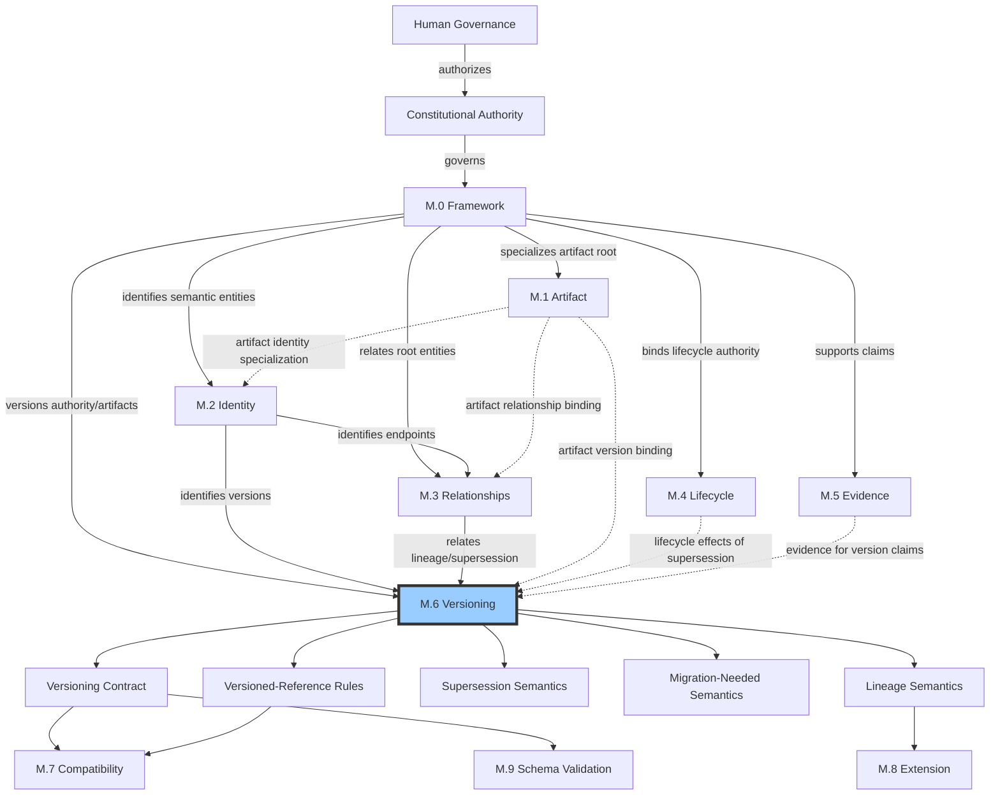
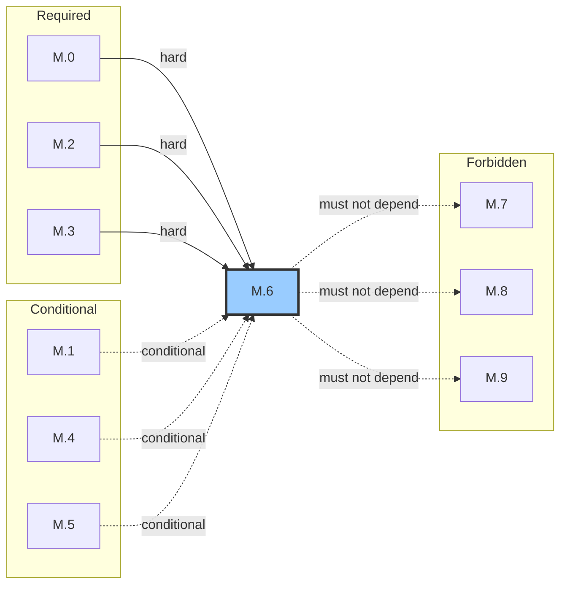

# M.6 — Versioning Meta Model
> AI-DOS v1.1.0-draft · Enterprise Semantic Profile
---
## Document Metadata
| Field | Value |
|:---|:---|
| Identifier | `AI-DOS-META-M.6` |
| Version | 1.1.0-draft |
| Status | Draft |
| Classification | Enterprise Semantic Profile |
| Document Type | Meta Architecture Specification |
| Owner | Framework Governance |
| Review Authority | Enterprise Documentation Standards Board |
| Approval Authority | Human Governance |
| Created | 2026-07-14 |
| Last Updated | 2026-07-14 |
| Normative Authority | Human Governance; A.1 Constitution; M.0 Framework Meta Model |
| Normative References | M.0; M.1; M.2; M.3; M.4; M.5; AI-DOS Meta Enterprise Foundation v1 |
| Consumed By | M.7–M.9; Standards; Runtime; Engine; Agents; Commands; Templates; Workflows; Operational Core; schemas; validation; migration |

---

## 1. Purpose

M.6 provides the single canonical semantic model for versioning within the AI-DOS Framework, ensuring every versioned artifact carries an unambiguous version designation with defined scope, traceable lineage, explicit supersession semantics, transparent migration obligations, and safe versioned-reference modes. M.6 exists so every versioned artifact can answer consistently: what version it carries and what that version means; what scope the version covers; what semantic significance each MAJOR, MINOR, PATCH component carries; from what prior versions it descends and what lineage chain it forms; whether it supersedes, replaces, or amends a prior version; whether migration is required and what obligation that creates; within what version window consumers may operate; and how downstream artifacts may reference it without ambiguity. M.6 prevents semantic duplication by centralizing all versioning meanings in one model so downstream specifications and consumers reason about version differences, migration requirements, and cross-artifact version dependencies through a shared vocabulary and contract.

## 2. Authority Position

M.6 is an Enterprise Semantic Profile. It sits below constitutional authority and above downstream consumers that depend on versioning semantics. M.6 holds enterprise versioning and supersession semantic authority. Downstream specifications consume M.6; they do not redefine versioning concepts.

## 3. Scope

M.6 governs: version designation, version scope, semantic versioning (MAJOR.MINOR.PATCH), document versioning, artifact versioning, schema versioning, model versioning, contract versioning, lineage chains, supersession, replacement, amendment, migration obligation, migration requirement, migration window, version window, version range, versioned references (all modes), revision, version branch, version merge, version authority binding, and version claims. M.6 does not govern release engineering, deployment, or operational procedures — it governs the meanings attached to version designations and their relationships.

## 4. Out of Scope

Release process, package publication, deployment mechanics, changelog format, source-control operations, CI/CD pipelines, container registries, build-system versioning, programming-language-specific package managers, and deployment orchestration.

## 5. Owned Semantics

| Term | Definition |
|:---|:---|
| Version | Canonical root abstraction for any version designation assigned to a governed artifact. |
| Version Scope | Boundary within which a version designation applies (Framework, Domain, Artifact, Schema, Contract). |
| Semantic Version | Version following `MAJOR.MINOR.PATCH[-PRERELEASE][+BUILD]` with defined component semantics. |
| Document Version | Semantic version applied to document artifacts with lifecycle alignment. |
| Artifact Version | Semantic version applied to non-document governed artifact instances. |
| Schema Version | Semantic version applied to structural definitions with breaking/additive/corrective rules. |
| Model Version | Semantic version applied to model instances. |
| Contract Version | Semantic version applied to behavioral agreements with bilateral obligation. |
| Lineage | Ordered chain of version predecessors tracing back to origin. |
| Supersession | Typed M.3 Relationship where one version assumes normative authority of another. |
| Replacement | Supersession form signaling the replaced version is withdrawn from active use. |
| Amendment | Version transition extending or clarifying an existing version without withdrawing it. |
| Migration Obligation | Declaration whether downstream consumers must act when a version change occurs. |
| Migration Requirement | Specific, actionable, testable step a consumer must satisfy to complete migration. |
| Migration Window | Defined period or condition during which migration is expected or supported. |
| Version Window | Bounded range of supported version values (Supported, Deprecated, Archival). |
| Versioned Reference | Typed link from one artifact to a specific version of another. |
| Immutable Version Reference | Reference to a fixed version designation that never resolves differently. |
| Latest Reference | Reference resolving to the most recent version in the Supported Window. |
| Rollback Reference | Reference to a prior version for rollback purposes. |
| Mutable Draft Reference | Reference to a draft version that may change before canonical promotion. |
| Current Reference | Reference to whichever version the authority currently designates as active. |
| Revision | Mutable working change within a version that does not create a new version. |
| Version Range | Bounded set of versions expressed as a range expression with inclusion/exclusion semantics. |
| Version Branch | Divergence in version lineage with multiple successors from a common predecessor. |
| Version Merge | Convergence of version branches into a single successor version. |
| Version Authority Binding | Declaration linking version lifecycle events to the governing M.0 authority. |
| Version Claim | Declared assertion about a version state, completeness, compatibility, or readiness. |

## 6. Consumed Semantics

| Source | Concepts Consumed | Consumption Mode |
|:---|:---|:---|
| M.0 | Artifact, Authority, Ownership, Boundary | Hard — version is a property of an M.0 Artifact; versioning authority derives from artifact authority |
| M.2 | Identity, stable identifier, traceability ID, uniqueness | Hard — each version receives a stable M.2 identity including its version designation |
| M.3 | Relationship types, direction, cardinality, supersession, replacement | Hard — supersession, replacement, and amendment are M.3 Relationship specializations |
| M.1 | Artifact version binding, artifact families, consumption interface | Consumed — provides the artifact surface to which versions attach; not a hard dependency |
| M.4 | Lifecycle states, transitions, promotion, deprecation, archival | Consumed — version lifecycle aligns with M.4; supersession triggers lifecycle effects |
| M.5 | Evidence types, claim-evidence binding, validity, freshness | Conditional — consumed only when version claims require M.5 evidence to substantiate |

## 7. Core Definitions

### 7.1 Version Type System

Every versioned entity must derive from the Version root type and declare its version type. Version types are semantic classifications, not implementation constructs. A single artifact carries exactly one active version at any lifecycle state. Historical versions remain accessible through versioned references. Downstream specifications may specialize version types only through governance amendment to M.6.

| Subtype | Parent | Scope |
|:---|:---|:---|
| Semantic Version | Version | All artifacts using MAJOR.MINOR.PATCH format |
| Document Version | Version | Document artifacts (Draft, Review, Canonical lifecycle alignment) |
| Artifact Version | Version | Non-document governed artifact instances |
| Schema Version | Version | Structural definitions (breaking/additive/corrective rules) |
| Model Version | Version | Model instances |
| Contract Version | Version | Behavioral agreements (bilateral obligation) |
| Revision | Version | Mutable working changes within a non-canonical version |

### 7.2 Version Scope Model

Version scope defines the boundary within which a version designation applies. Scope determines what the version covers, what entities it affects, and what it does not reach. Scope levels form a containment hierarchy: Framework Scope contains Domain Scope; Domain Scope contains Artifact, Schema, and Contract Scopes. A version change at a broader scope creates potential implications for all narrower scopes beneath it, but a version change at a narrower scope does not propagate upward.

| Scope Level | Applies To | Example |
|:---|:---|:---|
| Framework Scope | Entire AI-DOS Framework; affects all downstream artifacts and consumers | `AI-DOS v4` |
| Domain Scope | A governed domain (Meta, Standards, Runtime, Engines) | `Meta v1.0.0` |
| Artifact Scope | A single artifact instance identified by its M.2 identity | `M.0 v4.0.0` |
| Schema Scope | A data schema, type schema, or structural definition | `AgentState v2.1.0` |
| Contract Scope | A behavioral contract, API contract, or interface agreement | `EngineContract v1.3.0` |

### 7.3 Version Anatomy

Every version consists of the following components:

| Component | Required | Definition |
|:---|:---|:---|
| Version Designation | Yes | The human-readable version string (e.g., `1.0.0-draft`, `2.3.1`). |
| Version Scope | Yes | The scope level (§3) at which this version applies. |
| Version Type | Yes | The version type from §7.1. |
| Version Lifecycle State | Yes | The M.4 lifecycle state (Draft, Review, Canonical, etc.). |
| Lineage Chain | Yes | Ordered list of predecessor versions back to initial version. |
| Supersession Relationship | Conditional | If superseding a prior version, the relationship and type must be declared. |
| Migration Obligation | Yes | Whether downstream consumers must migrate and the category. |
| Evidence Reference | Yes | The M.5 evidence justifying this version's existence and change. |
| Assigning Authority | Yes | The M.0 authority that approved or assigned this version. |
| Assignment Date | Yes | The date on which this version was assigned. |
| Predecessor Version | Yes | The immediately preceding version in the lineage chain (if one exists). |

Version properties: Immutable (once assigned, permanently fixed), Unique (no two versions of the same artifact at the same scope share a designation), Traceable (traceable to predecessor, evidence, and assigning authority), Referencable (addressable through at least one versioned reference mode), Evidenced (every version change supported by M.5 evidence).

### 7.4 Semantic Version Model

Format: `MAJOR.MINOR.PATCH[-PRERELEASE][+BUILD]`. Pre-release versions have lower precedence than the corresponding normal version. Build metadata does not affect precedence.

| Component | Increment Signal | Migration Obligation |
|:---|:---|:---|
| MAJOR | Changes not backward-compatible; consumers may be required to modify consumption | `Migration-Needed` |
| MINOR | Backward-compatible additions; consumers may adopt new capabilities without migration | `Migration-Not-Needed` or `Migration-Recommended` |
| PATCH | Backward-compatible corrections; no consumer migration required | `Migration-Not-Needed` |
| PRERELEASE | Lower precedence than normal version; never mistaken for canonical | Inherited from component |

Precedence: compare MAJOR numerically, then MINOR, then PATCH. Pre-release identifiers compared left-to-right; numeric compared numerically, non-numeric lexicographically. Build metadata ignored.

### 7.5 Document and Artifact Version Model

Document versions follow semantic versioning with lifecycle alignment:

| M.4 Lifecycle State | Version Form | Reference Permitted | Authority |
|:---|:---|:---|:---|
| Draft | Pre-release (e.g., `1.0.0-draft`) | Internal only | Owner |
| Review | Pre-release (e.g., `1.0.0-review`) | Review participants only | Review Authority |
| Canonical | Normal (e.g., `1.0.0`) | All downstream consumers | Approval Authority |
| Maintenance | Normal or PATCH | All downstream consumers | Owner |
| Deprecated | Normal, no further increments | Historical reference only | Owner |
| Archived | Normal, frozen | Audit reference only | Owner |

Document titles may include the version designation for disambiguation, but the authoritative version is the metadata field. Documents in Draft should use a pre-release suffix. Every document version must be traceable through the lineage chain. Artifact versions carry M.2 identity including the version designation, bind to M.1 artifact families, and expose the version through the M.1 consumption interface. Cross-family version references must declare both target identity and target version.

### 7.6 Schema and Contract Version Model

Schema version rules: breaking structural change (required field added, field removed, type changed, constraint altered) requires MAJOR; additive structural change (optional field, extended enumeration, new type) requires MINOR; corrective structural change (documentation error, wrongly permissive constraint) requires PATCH. Schema consumers must declare minimum required version.

Contract version rules: breaking behavioral change (method removed, return type changed, error semantics altered) requires MAJOR; additive behavioral change (new method, optional parameters) requires MINOR; corrective behavioral change (documentation bug, misleading description) requires PATCH. Contract versions bind both provider and consumer. Contract deprecation requires a transition window.

When a schema MAJOR increment affects a contract, a corresponding contract MAJOR increment is required. MINOR or PATCH schema changes may or may not require contract version changes; the determination must be evidenced.

### 7.7 Lineage, Supersession, Replacement, and Amendment Model

**Lineage:** An ordered chain from a version's initial version through all predecessors. Every version must declare its immediate predecessor (except the lineage root). The chain must be continuous with no gaps. A version may have multiple successors but only one predecessor, permitting branching. Lineage is immutable once declared. The lineage root is the first version ever assigned and must exist. Branching is permitted for parallel development, variant versions, or experimental tracks.

**Supersession:** A typed M.3 Relationship where one version assumes normative authority of another. Requires explicit declaration, reference to superseded version, M.5 evidence, migration obligation declaration, and authority approval. A canonical version may supersede draft or review, but not the reverse. Supersession is irreversible and does not delete the superseded version. A version may supersede exactly one predecessor; multiple-supersession requires separate relationships.

**Replacement:** A stronger supersession form. The replaced version is marked Withdrawn or Replaced per M.4. New consumers must not adopt the replaced version. Must declare migration timeline. Reserved for versions containing errors, security issues, or fundamental design flaws. Requires evidence of why withdrawal is needed rather than simple supersession.

| Property | Supersession | Replacement | Amendment |
|:---|:---|:---|:---|
| Authority Transfer | Full to new version | Full; replaced version withdrawn | Authority remains with amended version |
| Predecessor Status | Superseded; accessible as historical reference | Replaced; withdrawn or archived | Amended; remains authoritative |
| Migration Obligation | Depends on version increment | Always `Migration-Needed` if MAJOR | Typically `Migration-Not-Needed` |
| Consumer Impact | Evaluate migration based on increment | Must migrate to replacement | May continue without disruption |

**Amendment:** Extends, corrects, or clarifies an existing version without withdrawing it. The amended version retains authority. Must declare what it modifies. If the change effectively alters normative meaning, it must be reclassified as supersession or replacement.

### 7.8 Revision Model

A Revision is a mutable working change within a version that does not create a new version. Permitted only in Draft or Working lifecycle states. The version designation remains unchanged. Revisions are recorded in an internal revision log but do not appear in the lineage chain. Distinct from PATCH: PATCH is a versioned, traceable correction in the lineage chain; Revision is an in-place correction that does not affect version identity. Once a version reaches Review, Canonical, or Approved state, no further revisions are permitted.

### 7.9 Versioned Reference Model

| Reference Mode | Stability | Risk | Resolution Rule |
|:---|:---|:---|:---|
| Immutable Version Reference | Highest | Lowest | Permanently fixed to one version designation |
| Latest Reference | Lowest | Highest | Resolves to most recent version in Supported Window |
| Rollback Reference | High | Low | References a specific prior version for rollback |
| Mutable Draft Reference | Lowest (pre-canonical) | High (pre-canonical) | Points to draft; may change until canonical promotion |
| Current Reference | Medium | Medium | Resolves to authority-designated active version |

Consumers must declare their reference mode for every cross-artifact version dependency. Immutable Version References must not be silently altered; changes require a new version of the referencing artifact. Latest References carry highest risk because a MAJOR increment in the referenced artifact may break the consumer without warning. Current References resolve to whichever version the assigning authority currently designates as active, which may differ from the latest version in the Supported Window.

### 7.10 Migration Model

**Migration Obligation Categories:**

| Category | Consumer Action | Evidence Required |
|:---|:---|:---|
| `Migration-Needed` | Must review change, assess impact, and adapt consumption | Evidence of incompatibility, impact analysis, migration guidance |
| `Migration-Not-Needed` | May continue without modification | Evidence that the change is backward-compatible |
| `Migration-Recommended` | Not required but strongly encouraged | Evidence of improvement and recommendation justification |
| `Migration-Deferred` | Not immediately; must plan before window closes | Evidence of future incompatibility, transition window, timeline |

**Migration Requirement** specifies what specific, testable action a consumer must take. Requirements exist only when obligation is `Migration-Needed` or `Migration-Deferred`. Each requirement links to M.5 evidence and is a semantic statement (what must change), not an implementation procedure (how to change). A single version transition may carry zero, one, or multiple Migration Requirements.

**Migration Window** states: Open (actively supported, consumers should plan and execute migration), Closing (encouraged with approaching deadline), Closed (no longer supported, non-migrated consumers are non-compliant). Windows may be extended by governing authority if evidence demonstrates consumers cannot reasonably complete migration. A Migration Window defines *when consumers must migrate*; a Version Window defines *which versions are supported*.

### 7.11 Version Branch and Merge Model

**Version Branch:** A divergent version line from a common ancestor. Must declare branch point (predecessor version) and branch purpose (experimental, maintenance, feature-specific). Each branch is an independent lineage chain from the branch point forward with its own identity and lifecycle. When abandoned, the terminal version enters Deprecated or Archived state.

**Version Merge:** Convergence of two or more branches into a single successor. The merged version must declare all contributing branch predecessors and record merged lineage. Must be evidence-backed per M.5. Cross-authority merges require a common higher authority. Must not create ambiguity about which branch's changes take precedence in conflict cases.

### 7.12 Version Window and Version Range Model

**Version Window** assigns governance support status: Supported (normative, recommended for new consumption), Deprecated (no new consumption, existing consumers must plan migration), Archival (historical/audit only, no governance support). Every versioned artifact must declare at least one Supported Window. A version exists in exactly one window at a time. Overlapping windows are prohibited. Transition from Supported to Deprecated requires deprecation notice with rationale, timeline, and migration guidance. Transition from Deprecated to Archival requires confirmation that known consumers have migrated or been notified.

**Version Range** is a semantic expression identifying a set of versions (e.g., `>=1.0.0 <2.0.0`). Has a required lower bound and optional upper bound. Evaluation uses M.6 precedence rules exclusively. Distinct from Version Window: Version Range is a mathematical set; Version Window is a governance classification. A consumer is compliant only if the resolved version falls within both its declared Version Range and the Supported Window. Once declared in a versioned reference, a Version Range must not be silently altered.

### 7.13 Version Authority Binding and Version Claim

**Version Authority Binding** links version lifecycle events (creation, promotion, supersession, deprecation) to the M.0 authority required to authorize each event. The assigning authority is fixed at assignment time and may not be altered. Authority chains (Owner → Review Authority → Approval Authority) must be recorded.

**Version Claim** is a declared assertion about a version's state, completeness, compatibility, or readiness. Requires M.5 evidence when affecting downstream consumers. Claims may be revoked by adding a revocation record without altering the version designation. Common claim types: backward-compatibility claim, completeness claim, conformance claim, security claim. Version Claims are the primary mechanism through which M.6 conditionally consumes M.5. Consumed by M.7 Compatibility and M.4 Lifecycle.

## 8. Semantic Rules

1. Every governed artifact carrying a version must declare its version type and scope level at assignment time.
2. Scope may not be changed after assignment; a new version with new scope must be created.
3. Framework Scope versions implicitly affect all narrower scopes within that framework.
4. Domain Scope versions affect all Artifact, Schema, and Contract scopes within that domain.
5. Artifact Scope versions affect only the single artifact to which they are attached.
6. Cross-scope version references must be explicit about the referenced version's scope.
7. Scope determines migration obligation breadth: Framework MAJOR affects all downstream consumers; Artifact PATCH affects only direct consumers.
8. MAJOR increments must carry `Migration-Needed` unless evidence demonstrates no consumer action is required.
9. MINOR increments must carry `Migration-Not-Needed` or `Migration-Recommended`.
10. PATCH increments must carry `Migration-Not-Needed`.
11. Every version transition must declare its migration obligation category in version metadata visible to all downstream consumers.
12. If migration obligation is incorrectly declared, a corrective version must be issued with correct obligation and explanatory evidence.
13. Migration obligation is a function of the version change, not the artifact type.
14. Every version must declare its immediate predecessor except the lineage root.
15. The lineage chain must be continuous with no gaps between predecessor and successor.
16. A version may have multiple successors but only one predecessor.
17. Lineage is immutable once declared; corrective versions must be created for lineage errors.
18. Supersession may occur only between versions of the same artifact at the same scope.
19. A version may supersede exactly one predecessor per supersession relationship.
20. The superseding version must be at higher or equal semantic precedence than the superseded version.
21. A canonical version may supersede a draft or review version; a draft may not supersede a canonical version.
22. Supersession is irreversible; a new version must be created if the supersession was in error.
23. Supersession does not delete the superseded version.
24. Replacement must be declared by authority equal to or higher than the authority that created the replaced version.
25. A replaced version must transition to Deprecated or Withdrawn lifecycle state per M.4.
26. Amendment must not alter normative meaning; if it does, it must be reclassified as supersession or replacement.
27. Revisions may only be applied to versions in Draft or Working lifecycle states.
28. Every versioned reference must declare its reference mode.
29. Immutable Version References must not be silently altered; changes require a new version of the referencing artifact.
30. Migration Windows must be declared when obligation is `Migration-Needed` or `Migration-Deferred`.
31. Version Range evaluation must use M.6 precedence rules exclusively.
32. A Version Branch must declare its branch point and branch purpose.
33. A Version Merge must declare all contributing branch predecessors and be evidence-backed.
34. Cross-authority merges require a common higher authority.
35. Every version must declare the authority that assigned or approved it.
36. Version Claims affecting downstream consumers require M.5 evidence.
37. Contract deprecation requires a transition window declaration.
38. Schema consumers must declare minimum schema version required.
39. Cross-family version references must declare both target identity and target version.
40. Migration obligation declarations must be supported by M.5 evidence demonstrating what changed, why it creates (or does not create) a migration obligation, what actions consumers must take, and the impact on non-migrating consumers.
41. A Version Range must have a lower bound; an upper bound may be explicit or implied.
42. Replacement must be accompanied by a migration guide or migration obligation declaration.
43. A replaced version may not be un-replaced; if replacement was in error, a new version must be created to restore the prior version's authority.
44. Multiple amendments may apply to a single version; each is a separate version in the lineage chain.
45. The amended version's lifecycle state does not change as a result of an amendment.
46. Consumers must be informed of amendments but are not required to adopt them unless the amendment changes binding requirements.
47. Version Authority Binding links each version to the governance hierarchy defined by M.0.
48. When a version transitions between authorities, each authority's role must be recorded.
49. A Version Claim may be revoked if evidence demonstrates the claim is invalid; revocation adds a revocation record without altering the version designation.
50. A Migration Window may be extended by the governing authority if evidence demonstrates consumers cannot reasonably complete migration within the original window.

## 9. Invariants

- Every version is immutable once assigned: designation, scope, type, lineage, predecessor, and assignment date are permanently fixed.
- Every version has exactly one immediate predecessor, except the lineage root which has none.
- Every version has an M.2 identity that includes its version designation and is unique within its artifact family.
- Every version is traceable to its predecessor, its evidence, and its assigning authority.
- Every version is addressable through at least one versioned reference mode.
- No version may be deleted from the lineage chain.
- A version exists in exactly one Version Window at any time.
- Lineage is a directed acyclic graph; cycles are prohibited.
- A draft version may never supersede a canonical version.
- M.6 must not depend on M.7, M.8, or M.9.
- All versioning concepts are specializations of M.0 root types; M.6 introduces no new root meta types.
- Version scope, once declared, is immutable for that version.
- A version window transition (Supported → Deprecated → Archival) is unidirectional; reverse transitions require a new version with new governance decision.
- Migration obligation is inseparable from the version transition it describes.
- The lineage root has no predecessor and must exist for every versioned artifact.
- A version's assigning authority is fixed at assignment time and may not be altered.
- Every version transition produces exactly one successor in the primary lineage chain (branches excepted).
- A Migration Window that has closed may not be reopened; a new migration decision requires a new version transition.
- Version Range immutability: once declared in a versioned reference, changes require a new version of the referencing artifact.
- The superseded version retains its full identity, lineage, and accessibility after supersession.
- Replacement requires the replaced version to enter Deprecated or Withdrawn state; it never enters Supported state again under the same designation.
- A Revision does not appear in the version lineage chain and does not increment any version component.
- Version Claims are the exclusive mechanism through which M.6 conditionally consumes M.5; when no claims are made or claims are self-evident, M.5 is not required.
- Amendment is appropriate for factual error correction, ambiguous language clarification, non-binding supplementary material, and minor metadata adjustments.
- Amendment is not appropriate when the change alters normative meaning, introduces breaking changes, removes or modifies required fields, or changes scope or authority.
- A contract version establishes obligations on both provider and consumer; both parties must acknowledge the contract version.

## 10. Boundary Rules

- M.6 defines meanings only; it does not own implementation, storage, runtime behavior, engine behavior, agent behavior, or Target Project concepts.
- M.6 does not define release processes, package publication, deployment pipelines, changelog formats, or source-control mechanics.
- M.6 does not prescribe when packages are removed from registries, when deployments are shut down, or when configurations are deleted.
- M.6 does not define migration tooling, migration procedures, or migration execution steps.
- AI-DOS is a reusable framework product; M.6 versioning semantics apply to AI-DOS artifacts consumed by Target Projects — M.6 never consumes Target Project concepts.
- Migration Requirements are semantic statements (what must change), not implementation procedures (how to change).
- Version Windows define semantic support boundaries only, not operational deployment states.
- M.6 shall not introduce new root meta types; all versioning concepts are specializations of M.0 root types.
- M.6 does not define platform-specific package management, build systems, version-control tools, or container registries.

## 11. Selective Dependencies

Per Foundation v1 §7.2, M.6 dependency rules:

| Dependency | Type | Justification |
|:---|:---|:---|
| M.0 | Hard | Version is a property of an M.0 Artifact; versioning authority derives from M.0 Authority |
| M.2 | Hard | Each version requires a stable M.2 identity |
| M.3 | Hard | Supersession, replacement, and amendment are M.3 Relationship specializations |
| M.1 | Conditional | Consumed for artifact version binding only; not a hard dependency |
| M.4 | Conditional | Consumed for lifecycle effects of supersession, replacement, deprecation, archival |
| M.5 | Conditional | Consumed only when version claims require evidence |
| M.7, M.8, M.9 | Must not | Compatibility, extension, and validation consume versioning — not the reverse |

## 12. Downstream Consumption

| Consumer | How M.6 Is Consumed |
|:---|:---|
| M.7 Compatibility | Consumes version surfaces, migration obligation, version ranges, and version claims to define compatibility relations and breaking-change semantics |
| M.8 Extension | Consumes lineage and version authority binding to govern extension versioning and namespace evolution |
| M.9 Schema Validation | Consumes schema version, version range, and versioned reference semantics for schema conformance validation |
| Standards | Consumes versioning contract, supersession semantics, and migration obligation when defining versioned standards |
| Runtime | Consumes contract version and versioned reference modes when exposing versioned runtime contracts |
| Engine | Consumes contract version and migration obligation when defining engine capability versioning |
| Agents | Consumes artifact version and versioned reference modes when agents consume versioned contracts |
| Commands | Consumes version scope and versioned reference when commands reference versioned dependencies |
| Templates | Consumes document version and migration requirement when templates carry versioned content |
| Workflows | Consumes version window and version range when workflow definitions declare version constraints |
| Operational Core | Consumes version window, migration window, and version authority binding for operational contracts |
| Schemas | Consume schema version rules (breaking/additive/corrective) and minimum version declarations |
| Validation | Consumes version precedence rules and version range evaluation for conformance checking |
| Migration | Consumes migration obligation, migration requirement, migration window, and version range for migration planning |
| Extension Governance | Consumes version authority binding and lineage when governing extension versioning |
| Schema Validation | Consumes schema version, version range, and versioned reference for schema conformance |

All downstream consumers must reference M.6 versioning concepts through their declared consumption profiles. No downstream consumer may redefine versioning semantics, version precedence, migration obligation categories, or versioned reference modes. Compatibility analysis (M.7) relies on M.6 version surfaces and migration obligations to determine whether a version transition is breaking or non-breaking. Extension governance (M.8) consumes M.6 lineage and authority binding to govern how extension versions relate to base versions. Schema validation (M.9) consumes M.6 version ranges and precedence rules to determine whether a validated artifact falls within its declared version constraints.

## 13. Information Preservation

Migration obligation, migration requirement, and migration window semantics ensure that version transitions are never silently breaking. The lineage model preserves complete ancestry from any version to its origin, enabling full historical traceability. Supersession preserves the superseded version's identity, lineage, and accessibility rather than deleting it. Replacement preserves lineage continuity by listing the replaced version as predecessor while recording the withdrawal. Amendment preserves the amended version's authority while recording the extension as a separate lineage entry. Version windows preserve historical support status through the Supported → Deprecated → Archival progression, ensuring no version disappears without a governance trail. Version authority binding preserves the governance chain for each version, recording which authority approved each lifecycle event. All version transitions require M.5 evidence linkage, preserving the justification for every version change. Version claims and their revocation records preserve the assertion history about a version. Version ranges preserve the declared compatibility boundaries in a form that is immutable once published. Migration requirements preserve the specific, testable obligations that consumers must satisfy, linked to evidence. Branch and merge records preserve the complete topology of parallel development tracks, including abandoned branches.

## 14. Semantic Ownership

M.6 owns enterprise versioning and supersession semantic authority. Versioning, lineage, supersession, replacement, amendment, migration obligation, migration requirement, migration window, version window, version range, versioned references, revision, version branch, version merge, version authority binding, and version claims are owned exclusively by M.6. Downstream consumers (M.7–M.9, Standards, Runtime, Engine, Agents, Commands, Templates, Workflows, Operational Core) consume M.6 semantics but do not redefine them. M.6 does not own compatibility meanings (M.7), extension meanings (M.8), or validation meanings (M.9). M.6 sits in the governed Meta Family DAG between M.3 Relationships (upstream hard dependency) and M.7 Compatibility (downstream consumer), with conditional consumption of M.1, M.4, and M.5. All versioning concepts are specializations of M.0 root types.

## 15. Validation Assertions

| # | Assertion | Checkable Criterion |
|:---|:---|:---|
| VA-1 | Every versioned artifact declares a version type | Version type field is non-empty and matches §7.1 subtypes |
| VA-2 | Every version declares its scope level | Scope field is one of Framework, Domain, Artifact, Schema, Contract |
| VA-3 | Every version has an M.2 identity including version designation | Identity field is present and unique within artifact family |
| VA-4 | Every version declares its immediate predecessor (except root) | Predecessor field is present, or version is declared as lineage root |
| VA-5 | Lineage chain is continuous with no gaps | Each successor's predecessor matches an existing version in the chain |
| VA-6 | No version appears in multiple Version Windows simultaneously | Window assignment is exclusive for each version |
| VA-7 | Every version transition declares migration obligation category | Migration obligation field is one of the four defined categories |
| VA-8 | MAJOR increments carry `Migration-Needed` unless evidenced otherwise | Evidence of no-consumer-impact is present when MAJOR carries `Migration-Not-Needed` |
| VA-9 | Supersession declarations reference a valid superseded version | Superseded version exists at same artifact and scope |
| VA-10 | Versioned references declare their reference mode | Reference mode is one of the five defined modes |
| VA-11 | M.6 does not depend on M.7, M.8, or M.9 | No normative reference to M.7–M.9 concepts as dependencies |
| VA-12 | Version Claims affecting downstream consumers have M.5 evidence | Evidence reference is present for each such claim |
| VA-13 | Contract deprecation declares a transition window | Transition window field is non-empty for deprecated contracts |
| VA-14 | Schema consumers declare minimum required version | Minimum version field is present in schema consumption declarations |
| VA-15 | Every version declares its assigning authority | Authority field is present and matches M.0 governance hierarchy |
| VA-16 | A Version Branch declares branch point and purpose | Both fields are present and non-empty |
| VA-17 | A Version Merge declares all contributing predecessors | All branch predecessor versions are enumerated |
| VA-18 | No cycles exist in any lineage graph | Graph traversal from any version terminates at the lineage root |
| VA-19 | Version Range expressions use M.6 precedence rules | Range evaluation yields deterministic results per §7.4 |
| VA-20 | Every migration obligation has a corresponding M.5 evidence reference | Evidence reference is present and links to a valid M.5 evidence item |
| VA-21 | Version Branch has declared branch point matching an existing version | Branch point version exists in the artifact's lineage |
| VA-22 | Version Merge lists all contributing branch predecessors | All predecessor branches are enumerated with valid version designations |
| VA-23 | Version Window transitions follow Supported → Deprecated → Archival order | No version transitions directly from Supported to Archival without Deprecated |
| VA-24 | No version has two different assigning authorities recorded | Authority field is singular and fixed at assignment time |

## 16. Completion / Governance Status

| Dimension | Status |
|:---|:---|
| Document Metadata | Complete |
| 16-section model compliance | Complete |
| All owned semantics from Foundation §6.6 present | Complete |
| All consumed semantics declared | Complete |
| Authority chain established | Complete |
| Dependency rules per Foundation §7.2 | Complete |
| Downstream consumption mapped | Complete |
| Validation assertions defined | Complete |
| Out-of-scope boundaries enforced | Complete |
| Semantic ownership exclusive and non-duplicative | Complete |
| Architecture-only / target-independent | Complete |
| No prohibited sections present | Complete |
| Governance | Draft — requires Framework Governance review and Human Governance approval before canonical promotion |

M.6 does not alter project state, certify itself, implement tooling, or define operational procedures. It remains a governance candidate until reviewed, approved, and promoted through Framework Governance.