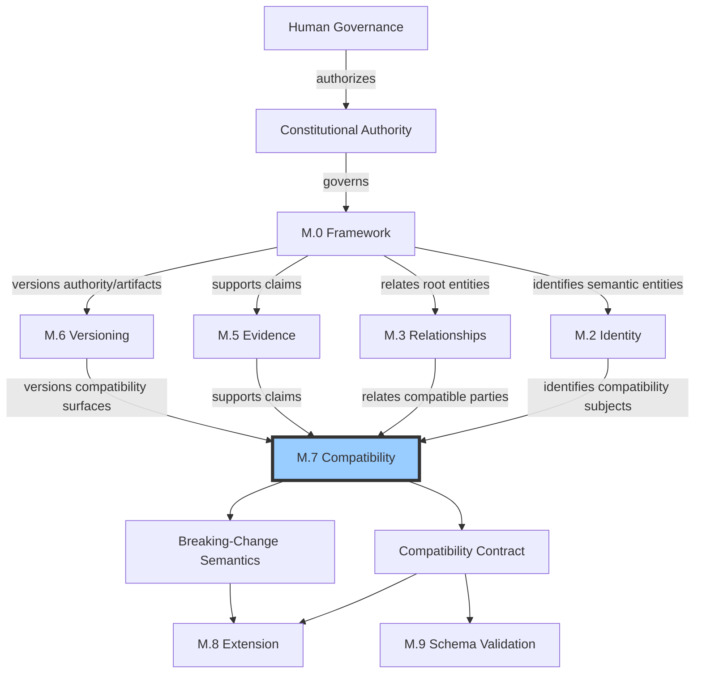
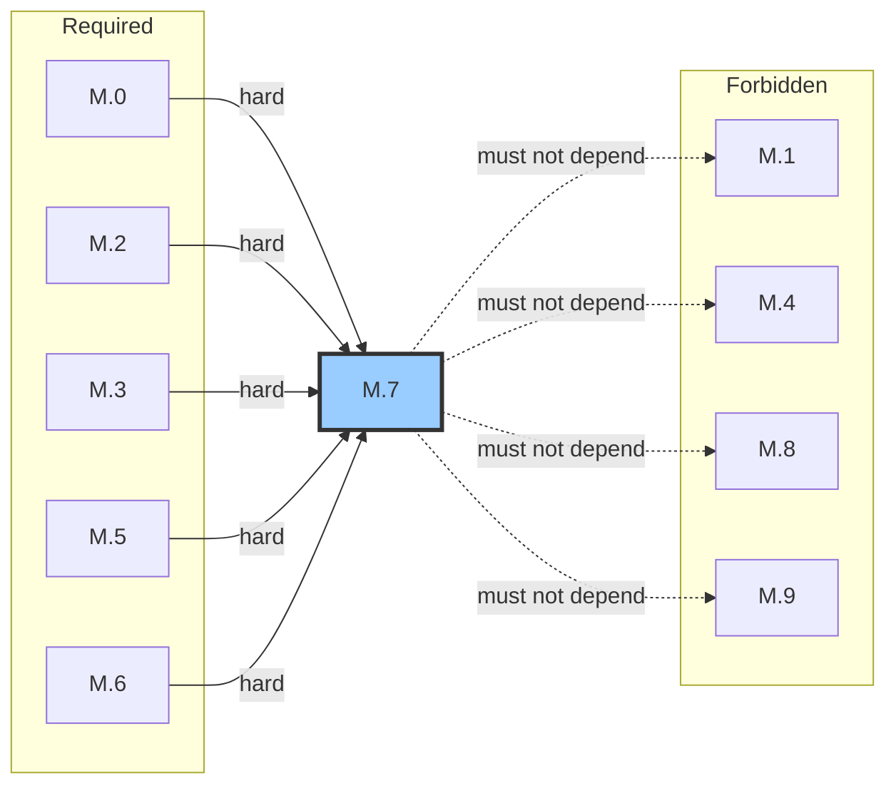

# M.7 — Compatibility Meta Model
> AI-DOS v1.1.0-draft · Enterprise Semantic Profile
---
## Document Metadata
| Field | Value |
|:---|:---|
| Identifier | `AI-DOS-META-M.7` |
| Version | 1.1.0-draft |
| Status | Draft |
| Classification | Enterprise Semantic Profile |
| Document Type | Meta Architecture Specification |
| Owner | Framework Governance |
| Review Authority | Enterprise Documentation Standards Board |
| Approval Authority | Human Governance |
| Created | 2026-07-14 |
| Last Updated | 2026-07-14 |
| Normative Authority | Human Governance; A.1 Constitution; M.0 Framework Meta Model |
| Normative References | M.0; M.2; M.3; M.5; M.6; AI-DOS Meta Enterprise Foundation v1 |
| Consumed By | M.8; M.9; Standards; Runtime; Engine; Agents; Commands; Templates; Workflows; Operational Core; extension governance; schema validation; migration planning |

---

## 1. Purpose

M.7 provides the single canonical semantic model for compatibility within the AI-DOS Framework, ensuring every compatibility assessment between versioned artifacts is classified, identified, evidenced, and traced through a shared vocabulary and contract. M.7 exists so every consumer can determine: whether two versions are compatible and in which direction; whether a version transition introduces breaking changes and what severity those changes carry; what evidence supports or refutes a compatibility claim; within what temporal window a compatibility declaration holds; how adapter boundaries and Target integration boundaries affect compatibility semantics; and whether a compatibility assessment is direct or mediated. M.7 prevents semantic duplication by centralizing all compatibility meanings so downstream specifications reason about breaking changes, compatibility claims, and cross-version consumption through governed semantics rather than local definitions. M.7 consumes M.6 versioning semantics and M.5 evidence semantics to define compatibility as a relationship between versioned, evidenced entities — it does not redefine versioning or evidence, and it does not depend on downstream consumers.

## 2. Authority Position

M.7 is an Enterprise Semantic Profile. It sits below constitutional authority and above downstream consumers that depend on compatibility semantics. M.7 holds enterprise compatibility semantic authority. Downstream specifications consume M.7; they do not redefine compatibility concepts.

## 3. Scope

M.7 governs: compatibility relation classification, compatible-with and incompatible-with declarations, backward compatibility, forward compatibility, partial compatibility, conditional compatibility, breaking change classification and severity, non-breaking change preservation, compatibility claims, compatibility evidence requirements, compatibility windows, adapter compatibility, and Target boundary compatibility. M.7 does not govern compatibility testing procedures, adapter implementation, or migration execution — it governs the meanings attached to compatibility assessments and their evidentiary requirements.

## 4. Out of Scope

Runtime behavior, adapter implementation, migration tooling, release approval procedure, specific backward-compatibility guarantees for downstream domains, platform-specific shim layers, deployment orchestration, and concrete adapter code.

## 5. Owned Semantics

| Term | Definition |
|:---|:---|
| Compatibility Relation | The root semantic relation between two versioned entities assessing whether they can coexist or transition without unacceptable impact. |
| Compatible-With | Declaration that a specific version pair satisfies a defined compatibility relation. |
| Incompatible-With | Declaration that a specific version pair does not satisfy a compatibility relation, specifying which relation is broken. |
| Backward Compatibility | Newer version preserves all consumption interfaces that the older version exposed; existing consumers operate without modification. |
| Forward Compatibility | Older version's consumption interfaces remain valid under a newer version's contract; the older version was designed to accommodate future changes. |
| Partial Compatibility | Two entities are compatible within a defined subset of the consumption interface but not the full interface. |
| Conditional Compatibility | Two entities are compatible only when specified conditions are met (configuration, feature-flag, version-coexistence, capability, or environment conditions). |
| Breaking Change | A version transition that breaks one or more compatibility relations previously holding between the older version and its consumers. |
| Non-Breaking Change | A version transition that preserves all compatibility relations previously holding between the older version and its consumers. |
| Compatibility Claim | A declared, evidenced assertion about the compatibility relation between two versioned entities. |
| Compatibility Evidence Requirement | The mandatory M.5 evidence binding that every compatibility claim must carry. |
| Compatibility Window | The temporal scope during which a compatibility declaration is valid and governed. |
| Adapter Compatibility | Compatibility achieved through an intermediary adapter rather than direct interface conformance. |
| Target Boundary Compatibility | Compatibility assessment at the boundary between AI-DOS and a Target Project, governed by extension and boundary authority rules. |

## 6. Consumed Semantics

| Source | Concepts Consumed | Consumption Mode |
|:---|:---|:---|
| M.0 | Boundary, Constraint, Capability, Validation, Evidence | Hard — compatibility is a boundary assessment; constraints define compatibility limits |
| M.2 | Identity, stable identifier | Hard — compatibility relations require identified subjects |
| M.3 | Relationship types, direction, cardinality | Hard — compatibility is itself a relationship type between identified entities |
| M.5 | Evidence types, claim-evidence binding, validity, freshness, confidence | Hard — compatibility claims require M.5 evidence; this dependency is non-negotiable |
| M.6 | Version surfaces, migration obligation, version ranges, version claims | Hard — compatibility is always between versioned entities; breaking-change assessment requires version semantics |

M.7 must not depend on M.1, M.4, M.8, or M.9.

## 7. Core Definitions

### 7.1 Compatibility Relation Model

The Compatibility Relation is the root abstraction. Every compatibility assessment classifies into one of the following relation types:

| Relation Type | Direction | Definition |
|:---|:---|:---|
| Backward Compatible | Newer → Older | Newer version preserves all consumption interfaces of the older version. |
| Forward Compatible | Older → Newer | Older version's interfaces remain valid under the newer version's contract. |
| Partially Compatible | Either | Compatibility holds within a declared subset of the consumption interface. |
| Conditionally Compatible | Either | Compatibility holds only when specified conditions are met. |
| Incompatible | Either | One or more compatibility relations are broken. |

Compatibility relations are always between identified, versioned entities. Unversioned compatibility assessments are not governed by M.7. Every compatibility relation must be assigned an M.2 identity and must bind to M.5 evidence.

### 7.2 Backward Compatibility

Backward compatibility holds when a newer version preserves all consumption interfaces that the older version exposed. Existing consumers operate without modification. Backward compatibility is assessed from the newer version toward the older version. The consumption interface includes all fields, operations, capabilities, contracts, schemas, and behavioral guarantees that the older version committed to.

Backward compatibility rules:
- Adding optional fields, operations, or capabilities preserves backward compatibility.
- Removing required fields, operations, or capabilities breaks backward compatibility.
- Changing field types, return types, or error semantics breaks backward compatibility unless the change is widening (e.g., int32 → int64).
- Renaming a field or operation without preserving the old name breaks backward compatibility.
- Tightening a constraint (e.g., max length reduced) breaks backward compatibility.
- Loosening a constraint (e.g., max length increased) preserves backward compatibility.

### 7.3 Forward Compatibility

Forward compatibility holds when an older version's consumption interfaces remain valid under a newer version's contract. This means the older version was designed to accommodate changes that a newer version might introduce. Forward compatibility is assessed from the older version toward the newer version.

Forward compatibility rules:
- Forward compatibility requires explicit design intent in the older version (e.g., unknown-field handling, extension points, tolerant parsing).
- Forward compatibility is not inferred from version proximity or naming conventions.
- A system that is forward-compatible with version N+1 will also be forward-compatible with version N+1.0.x (PATCH range) but not necessarily with N+2.0.0 (MAJOR range).
- Forward compatibility claims require M.5 evidence demonstrating the design mechanisms that enable it.

### 7.4 Partial Compatibility

Partial compatibility holds when two entities are compatible within a defined subset of the consumption interface but not within the full interface.

| Partial Type | Meaning |
|:---|:---|
| Subset Compatible | The newer version preserves a named subset of the consumption interface. Consumers using only that subset experience no breakage. |
| Behaviorally Partial | The consumption interface is preserved, but behavioral changes exist within a declared, bounded set of edge cases. |

Rules: Partial compatibility must be declared with an explicit scope boundary identifying which subset is covered. The uncovered subset must be enumerated. Requires M.5 evidence for the compatible subset. The incompatible subset must be acknowledged and documented. Downstream consumers must not treat partial compatibility as full compatibility.

### 7.5 Conditional Compatibility

Conditional compatibility holds when two entities are compatible only when specified conditions are met.

| Conditional Type | Meaning |
|:---|:---|
| Configuration-Conditional | Compatibility holds only when a specific configuration state is active. |
| Feature-Flag Conditional | Compatibility holds only when specified feature flags are set. |
| Version-Coexistence Conditional | Compatibility holds only when specific other version constraints are satisfied. |
| Capability-Conditional | Compatibility holds only when specified capabilities are available. |
| Environment-Conditional | Compatibility holds only in declared environment contexts. |

Rules: Conditions must be declared explicitly and unambiguously. A conditional compatibility claim without declared conditions is incomplete. M.5 evidence must demonstrate compatibility under each declared condition. When conditions are not met, the entities are incompatible — conditional compatibility does not degrade to partial compatibility.

### 7.6 Breaking and Non-Breaking Change Model

**Breaking Change:** A version transition that breaks one or more compatibility relations previously holding between the older version and its consumers. A breaking change is assessed relative to the consumption interface — not relative to internal implementation. Internal changes that do not affect the consumption interface are not breaking changes even if they alter implementation significantly.

Every breaking change must be assigned a severity level:

| Severity | Definition | Consumer Impact |
|:---|:---|:---|
| Critical | Core consumption interface removed or fundamentally altered; no consumer can operate without modification. | All consumers must migrate immediately. |
| Major | Significant portion of consumption interface changed; most consumers require modification. | Most consumers must migrate within the migration window. |
| Moderate | Subset of consumption interface changed; affected consumers require modification. | Affected consumers must migrate; unaffected consumers continue. |
| Minor | Edge-case behavioral change with limited consumer impact. | Affected consumers should evaluate and migrate if applicable. |

Breaking change rules: Every breaking change must be classified, scoped, severity-assigned, and evidenced before or at the time of the version transition. Retroactive breaking-change discovery is a governance concern. An undeclared breaking change is the most severe compatibility violation. Breaking changes must include a compatibility impact statement identifying which consumers, contracts, schemas, or behaviors are affected. Multiple breaking changes within a single transition must be enumerated individually.

**Non-Breaking Change:** A version transition that preserves all compatibility relations that previously held between the older version and its consumers.

| Non-Breaking Change Type | Meaning | Compatibility Preservation |
|:---|:---|:---|
| Additive Extension | Adding new fields, operations, capabilities, or contract terms without altering existing ones | All existing consumers unaffected |
| Internal Refactor | Changing internal implementation without altering the consumption interface, contracts, or observable behavior | All existing consumers unaffected |
| Performance Improvement | Changing performance characteristics without altering correctness, interface, or contracts | All existing consumers unaffected; may benefit |
| Corrective Fix | Error corrections that do not alter interface semantics | All existing consumers unaffected |

**Bug-Fix Special Case:** A corrective fix that changes observable behavior in a way consumers may depend on (even if the prior behavior was incorrect) must be assessed for compatibility impact. It may be classified as non-breaking only if the prior behavior was documented as incorrect. If consumers were not warned, the fix must be evaluated as a potential breaking change.

**Non-Breaking Change Rules:** Non-breaking changes must preserve all consumption interfaces, all behavioral contracts, and all schema constraints that existing consumers depend on. If a non-breaking change inadvertently affects a consumer (e.g., a performance improvement changes timing assumptions), the change must be reassessed.

### 7.7 Compatibility Claim Model

A Compatibility Claim is a declared, evidenced assertion about the compatibility relation between two versioned entities. Every compatibility claim must include: the two versioned entities (with M.6 version designations), the compatibility relation type, the compatibility direction, the scope of the claim, the M.5 evidence binding, the compatibility window, the claiming authority, and the claim lifecycle state (Draft, Declared, Superseded, Revoked).

Compatibility claims are the primary output of M.7. Downstream consumers use compatibility claims to determine whether they can adopt a new version, whether they need to migrate, and what the impact of migration will be. A Draft claim is not a Declared guarantee. A Superseded claim is replaced by a newer claim. A Revoked claim is withdrawn; revocation requires M.5 evidence demonstrating the claim is invalid.

### 7.8 Compatibility Window

A Compatibility Window defines the temporal scope during which a compatibility declaration is valid. Every compatibility claim must declare a compatibility window.

| Window State | Definition |
|:---|:---|
| Active | The compatibility declaration is valid and governed. |
| Expiring | The declaration remains valid but is approaching expiration. |
| Expired | The declaration is no longer valid. Consumers must reassess compatibility. |

Window rules: No compatibility claim may be window-free. Expiration triggers a reassessment obligation — consumers must verify whether compatibility still holds or whether a new claim has been issued. A compatibility window may be extended by the claiming authority with M.5 evidence. Compatibility window and M.6 Version Window are related but distinct: a compatibility window governs how long a claim is valid; a version window governs which versions are supported.

### 7.9 Adapter Compatibility

Adapter Compatibility is compatibility achieved through an intermediary adapter rather than direct interface conformance. The adapter translates between the consumption interfaces of two versions or entities.

Rules: Adapter compatibility must be declared separately from direct compatibility. Consumers must know whether they are relying on direct compatibility or adapter-mediated compatibility. An adapter does not change the underlying compatibility relation — if two versions are incompatible, an adapter may bridge the gap, but the incompatibility remains semantically true. Adapter compatibility carries its own evidence requirements: the adapter's translation coverage, behavioral fidelity, and performance characteristics must be evidenced per M.5. Adapter compatibility must not be treated as direct compatibility by downstream consumers.

### 7.10 Target Boundary Compatibility

Target Boundary Compatibility is compatibility assessment at the boundary between AI-DOS and a Target Project. This boundary is governed by extension and boundary authority rules.

Rules: AI-DOS compatibility semantics apply to the AI-DOS side of the boundary. Target Project compatibility semantics apply to the Target side. At the boundary, compatibility is assessed as the intersection of both sides' constraints. M.8 Extension governs the Target adapter extension boundary. Target boundary compatibility claims must declare which side's authority governs each aspect of the claim. Boundary stability requires that changes on the AI-DOS side do not silently break Target consumers without an M.7-compliant breaking-change declaration. Target boundary compatibility is distinct from internal AI-DOS compatibility — internal compatibility does not guarantee boundary compatibility.

## 8. Semantic Rules

1. Every compatibility assessment must classify into one of the defined relation types.
2. Compatibility is always between identified, versioned entities; unversioned compatibility is not governed by M.7.
3. Every compatibility relation must receive an M.2 identity.
4. Every compatibility claim must bind to M.5 evidence — this is non-negotiable and universally enforced.
5. Backward compatibility is assessed from newer to older; forward compatibility from older to newer.
6. Forward compatibility is not inferred from version proximity or naming conventions.
7. Partial compatibility must declare an explicit scope boundary and enumerate the uncovered subset.
8. Conditional compatibility must declare all conditions explicitly; undelcared conditions render the claim incomplete.
9. When conditional compatibility conditions are not met, the entities are incompatible.
10. Every breaking change must be classified, scoped, severity-assigned, and evidenced before or at the version transition.
11. An undeclared breaking change is the most severe compatibility violation.
12. Multiple breaking changes within a single transition must be enumerated individually.
13. Non-breaking changes must preserve all compatibility relations that previously held.
14. Every compatibility claim must declare a compatibility window.
15. A Draft compatibility claim is not a Declared compatibility guarantee.
16. Adapter compatibility must be declared separately from direct compatibility.
17. Adapter compatibility must not be treated as direct compatibility.
18. Target boundary compatibility must declare which authority governs each aspect.
19. M.7 must not depend on M.1, M.4, M.8, or M.9.
20. M.7 must not redefine M.6 versioning concepts.
21. A bug-fix that changes observable behavior must be assessed for compatibility impact.
22. Compatibility claim revocation requires M.5 evidence demonstrating the claim is invalid.
23. A compatibility window that has expired triggers a reassessment obligation on all consumers.
24. Breaking changes must include a compatibility impact statement.
25. M.5 evidence is required for every compatibility claim type without exception.
26. A compatibility claim made outside the claimant's authority scope is not governed by M.7.
27. Compatibility between unversioned entities is outside M.7 governance.
28. A Superseded compatibility claim must reference the superseding claim by M.2 identity.
29. An expired compatibility window does not revoke the claim; it triggers reassessment.

## 9. Invariants

- Every compatibility claim has an M.5 evidence binding.
- Every compatibility relation involves two identified, versioned entities.
- Backward compatibility and forward compatibility are distinct directional relations; one does not imply the other.
- Partial compatibility is not a degraded form of full compatibility; it is a distinct, governed state.
- Conditional compatibility without declared conditions is not a valid compatibility claim.
- An undeclared breaking change is always a compatibility violation, regardless of its actual impact.
- A compatibility window that has expired is no longer valid; consumers must reassess.
- Adapter compatibility does not alter the underlying direct compatibility relation.
- M.7 does not own versioning meanings (owned by M.6), evidence meanings (owned by M.5), or extension meanings (owned by M.8).
- M.7 must not depend on M.1, M.4, M.8, or M.9.
- Forward compatibility requires explicit design intent; it is never assumed.
- A revoked compatibility claim does not alter the versioned entities; only the claim is withdrawn.
- Backward compatibility preservation requires that every consumer operating against the older version's interface can operate against the newer version's interface without modification.
- Forward compatibility cannot be claimed without evidence of explicit design intent in the older version.
- An adapter does not create backward compatibility where none existed; it creates a mediated compatibility path.
- The consumption interface defines the compatibility boundary, not the implementation.
- A compatibility claim that is Superseded remains in the claim history for audit traceability.
- Compatibility severity levels are ordered: Critical > Major > Moderate > Minor.
- A single version transition may produce both breaking and non-breaking changes; each must be classified independently.
- Target boundary compatibility is the intersection of AI-DOS and Target Project constraints, not the union.

## 10. Boundary Rules

- M.7 defines meanings only; it does not own adapter implementation, migration tooling, or runtime behavior.
- M.7 does not define specific backward-compatibility guarantees for individual downstream domains — domains consume M.7 to define their own guarantees within the M.7 framework.
- M.7 does not define platform-specific shim layers or adapter code.
- M.7 does not define release approval procedures.
- M.7 does not define deployment orchestration.
- M.7 does not invent Runtime behavior, Engine behavior, Agent behavior, or Target Project truth.
- AI-DOS is a reusable framework product; M.7 compatibility semantics apply to AI-DOS artifacts consumed by Target Projects.
- Compatibility claims are semantic assertions; M.7 does not define how compatibility testing is performed.
- M.7 does not define how adapters are implemented, only what adapter compatibility means semantically.
- M.7 does not define migration procedures; migration planning consumes M.7 semantics to plan migrations.

## 11. Selective Dependencies

Per Foundation v1 §7.2, M.7 dependency rules:

| Dependency | Type | Justification |
|:---|:---|:---|
| M.0 | Hard | Compatibility is a boundary assessment; constraints and capabilities define compatibility limits |
| M.2 | Hard | Compatibility relations require identified subjects with stable M.2 identities |
| M.3 | Hard | Compatibility is a relationship type between identified entities |
| M.5 | Hard | Compatibility claims require M.5 evidence; this dependency is non-negotiable |
| M.6 | Hard | Compatibility is always between versioned entities; breaking-change assessment requires version surfaces |
| M.1, M.4, M.8, M.9 | Must not | M.7 does not depend on artifact bindings, lifecycle, extension, or validation |

## 12. Downstream Consumption

| Consumer | How M.7 Is Consumed |
|:---|:---|
| M.8 Extension | Consumes compatibility relation types and adapter compatibility to govern extension compatibility declarations and Target adapter boundaries |
| M.9 Schema Validation | Consumes breaking-change semantics and compatibility evidence requirements to define schema conformance compatibility checks |
| Standards | Consumes compatibility contract, compatibility claim model, and breaking-change classification when defining versioned standard contracts |
| Runtime | Consumes backward/forward compatibility and breaking-change semantics when exposing versioned runtime contracts |
| Engine | Consumes compatibility relation types and severity levels when defining engine capability compatibility |
| Agents | Consumes compatibility claims and partial/conditional compatibility when agents consume cross-version contracts |
| Commands | Consumes breaking-change impact statements when commands reference versioned dependencies |
| Templates | Consumes compatibility window and compatibility claim when templates carry versioned content |
| Workflows | Consumes compatibility window and breaking-change severity when workflows span version transitions |
| Operational Core | Consumes compatibility claims and adapter compatibility for operational contract boundaries |
| Extension Governance | Consumes compatibility claim model and Target boundary compatibility for governing extension compatibility |
| Schema Validation | Consumes compatibility evidence requirements for schema conformance validation |
| Migration Planning | Consumes breaking-change classification, compatibility impact statements, and compatibility windows for migration planning |

All downstream consumers must produce and consume compatibility claims through M.7 semantics without redefining compatibility relation types, breaking-change types, or severity levels.

Extension governance (M.8) consumes M.7 compatibility relation types and adapter compatibility when governing extension compatibility declarations and Target adapter boundaries. Schema validation (M.9) consumes M.7 breaking-change semantics and compatibility evidence requirements when defining schema conformance compatibility checks. Migration planning consumes M.7 breaking-change classification, compatibility impact statements, and compatibility windows to plan migration scope and timeline. No downstream consumer may fabricate compatibility claims or compatibility evidence, suppress breaking changes, overstate compatibility scope, or treat adapter compatibility as direct compatibility.

## 13. Information Preservation

M.7 preserves the complete history of compatibility claims through claim lifecycle states (Draft → Declared → Superseded or Revoked). Every claim carries M.5 evidence binding, preserving the evidentiary basis for every compatibility assessment. Breaking-change declarations preserve the classification, scope, severity, and impact statement for every breaking change, ensuring no breaking change is discovered without a governed record. Compatibility windows preserve the temporal validity of compatibility declarations, and expiration triggers reassessment rather than silent invalidation. Adapter compatibility records preserve the distinction between direct and mediated compatibility, preventing consumers from mistakenly assuming direct conformance. Target boundary compatibility records preserve which authority governs each aspect of a cross-boundary claim. Revocation records preserve why a claim was withdrawn, maintaining audit integrity. Partial compatibility records preserve the exact subset boundary, ensuring future reassessment can determine whether the subset has grown or shifted. Conditional compatibility records preserve the exact conditions, enabling reassessment when conditions change.

## 14. Semantic Ownership

M.7 owns enterprise compatibility semantic authority. Compatibility relation, compatible-with, incompatible-with, backward compatibility, forward compatibility, partial compatibility, conditional compatibility, breaking change, non-breaking change, compatibility claim, compatibility evidence requirement, compatibility window, adapter compatibility, and Target boundary compatibility are owned exclusively by M.7. Downstream consumers (M.8, M.9, Standards, Runtime, Engine, Agents, Commands, Templates, Workflows, Operational Core) consume M.7 semantics but do not redefine them. M.7 does not own versioning meanings (M.6), evidence meanings (M.5), identity meanings (M.2), relationship meanings (M.3), or extension meanings (M.8). M.7 sits in the governed Meta Family DAG downstream of M.0, M.2, M.3, M.5, and M.6, with no dependency on M.1, M.4, M.8, or M.9.

## 15. Validation Assertions

| # | Assertion | Checkable Criterion |
|:---|:---|:---|
| VA-1 | Every compatibility claim has an M.5 evidence binding | Evidence reference is present and links to a valid M.5 evidence item |
| VA-2 | Every compatibility relation is between identified, versioned entities | Both subjects have M.2 identities and M.6 version designations |
| VA-3 | Every compatibility claim declares its relation type | Relation type is one of the defined types |
| VA-4 | Every compatibility claim declares its direction | Direction is backward, forward, or bidirectional |
| VA-5 | Every compatibility claim declares a compatibility window | Window field is non-empty with valid states |
| VA-6 | Every breaking change is severity-assigned | Severity is Critical, Major, Moderate, or Minor |
| VA-7 | Every breaking change includes an impact statement | Impact statement identifies affected consumers, contracts, schemas, or behaviors |
| VA-8 | Partial compatibility declares scope boundary | Covered and uncovered subsets are enumerated |
| VA-9 | Conditional compatibility declares all conditions | All condition types and values are explicitly stated |
| VA-10 | Adapter compatibility is declared separately from direct compatibility | Claim type distinguishes adapter-mediated from direct |
| VA-11 | M.7 does not depend on M.1, M.4, M.8, or M.9 | No normative reference to these as dependencies |
| VA-12 | No compatibility claim is window-free | Every claim has a compatibility window declaration |
| VA-13 | A Draft claim is not treated as a Declared guarantee | Claim lifecycle state is checked before consumption |
| VA-14 | Multiple breaking changes are individually enumerated | No aggregated-only breaking-change summary |
| VA-15 | Target boundary compatibility declares governing authority per aspect | Authority assignment is present for each boundary aspect |
| VA-16 | Breaking change impact statement identifies specific affected entities | Consumers, contracts, schemas, or behaviors are enumerated |
| VA-17 | Forward compatibility claim has evidence of design intent | M.5 evidence references design mechanisms enabling forward compatibility |
| VA-18 | Adapter compatibility claim declares translation coverage | Covered and uncovered translation surfaces are enumerated |
| VA-19 | Compatibility window is not expired when claim is consumed | Window state is Active or Expiring at consumption time |
| VA-20 | No compatibility claim exists without M.2 identity for both subjects | Both subject identity fields are present and valid |

## 16. Completion / Governance Status

| Dimension | Status |
|:---|:---|
| Document Metadata | Complete |
| 16-section model compliance | Complete |
| All owned semantics from Foundation §6.7 present | Complete |
| All consumed semantics declared | Complete |
| Authority chain established | Complete |
| Dependency rules per Foundation §7.2 | Complete |
| M.5 evidence requirement universally enforced | Complete |
| M.6 hard dependency established | Complete |
| Downstream consumption mapped | Complete |
| Validation assertions defined | Complete |
| Out-of-scope boundaries enforced | Complete |
| Semantic ownership exclusive and non-duplicative | Complete |
| Architecture-only / target-independent | Complete |
| No prohibited sections present | Complete |
| Governance | Draft — requires Framework Governance review and Human Governance approval before canonical promotion |

M.7 does not alter project state, certify itself, implement tooling, or define operational procedures. It remains a governance candidate until reviewed, approved, and promoted through Framework Governance. No existing artifacts, standards, runtime specifications, engine specifications, or operational procedures are modified by this draft.