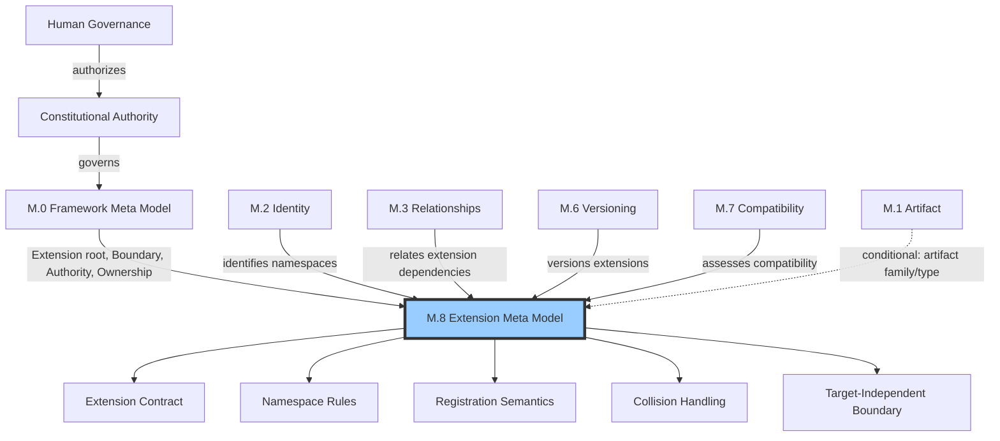
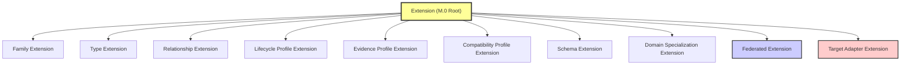
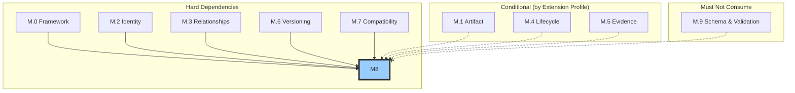

# M.8 — Extension Meta Model

> AI-DOS v1.1.0-draft · Enterprise Semantic Profile

---

## Document Metadata

| Field | Value |
|:---|:---|
| Identifier | `AI-DOS-META-M.8` |
| Version | 1.1.0-draft |
| Status | Draft |
| Classification | Enterprise Semantic Profile |
| Document Type | Meta Architecture Specification |
| Owner | Framework Governance |
| Review Authority | Enterprise Documentation Standards Board |
| Approval Authority | Human Governance |
| Created | 2026-07-14 |
| Last Updated | 2026-07-14 |
| Normative Authority | Human Governance; A.1 Constitution; M.0 Framework Meta Model |
| Normative References | M.0; M.1; M.2; M.3; M.6; M.7; AI-DOS Meta Enterprise Foundation v1 |
| Consumed By | M.9; Standards; Runtime; Engine; Agents; Commands; Templates; Workflows; Operational Core; schema owners; external Target adapters |

---

## 1. Purpose

M.8 provides the single canonical semantic model for how AI-DOS may be extended without corrupting or replacing upstream Meta Foundation meanings. Every extension — whether adding artifact families, types, relationships, lifecycle profiles, evidence profiles, compatibility profiles, schema extensions, or domain specializations — must satisfy the M.8 extension contract: derive from an upstream concept, register within a governed namespace, carry stable identity, declare authority and boundary, declare compatibility, and remain Target-independent unless explicitly governed as a Target adapter. M.8 prevents uncontrolled semantic proliferation across downstream consumers by providing one authoritative definition of what extension means and how it is governed.

---

## 2. Authority Position

M.8 is an Enterprise Semantic Profile as defined by AI-DOS Meta Enterprise Foundation v1 §5.4, sitting within the governed layer of M.4–M.9 below the Meta Core (README, M.0, M.1, M.2, M.3). Authority flows from Human Governance through Constitutional Authority through Framework Governance to M.8. M.8 specializes the M.0 Extension root concept into full extension governance; it does not introduce new root meta types.

M.8 produces five contracted outputs consumed by downstream: the Extension Contract (governs all extension acts), Namespace Rules (govern all extension identity), Registration Semantics (govern all extension records), Collision Handling (governs all conflict resolution), and the Target-Independent Boundary (governs product-purity separation).

---

## 3. Scope

M.8 governs: extension points and their lifecycle states (open, closed, deprecated, frozen); extension namespaces and the `aidos.<domain>.<category>.<name>` hierarchy; extension registration as a semantic contract recording identity, derivation, authority, boundary, namespace, and compatibility; extension collision detection and resolution across namespace, semantic, and boundary dimensions; extension profiles declaring which upstream families an extension consumes; extension dependency declarations and acyclicity; extension compatibility declarations per M.7; extension deprecation semantics per M.4; federated extension spanning multiple repositories or organizational boundaries; and the Target adapter extension boundary keeping Target-specific extensions outside product truth unless generalized and governed.

---

## 4. Out of Scope

Plugin implementation, package loading, registry tooling, runtime adapter behavior, Target-specific customization content, deployment mechanisms, release processes, schema syntax (JSON Schema, YAML Schema, etc.), validator construction, CI pipeline configuration, and any implementation concern of downstream consumers. M.8 defines what extension *means*; it does not define how an extension is *loaded*, *dispatched*, or *executed*.

---

## 5. Owned Semantics

| Semantic Concept | Definition |
|:---|:---|
| Extension | A governed semantic addition to AI-DOS that specializes an upstream Meta concept without replacing it |
| Extension Point | A declared, explicitly opened semantic location in M.0–M.7 where extensions are permitted |
| Extension Namespace | A hierarchical dot-separated governed identity scope (`aidos.<domain>.<category>.<name>`) preventing collision |
| Extension Registration | The semantic contract recording an extension's identity, derivation, authority, boundary, namespace, and compatibility |
| Extension Authority | The governance chain from Human Governance through Framework Governance authorizing a specific extension |
| Extension Boundary | The declared scope limit an extension must not cross without governance approval |
| Extension Collision | A detectable conflict between two or more extensions at the same namespace, meaning, or derivation point |
| Extension Profile | A defined set of upstream families an extension consumes (e.g., lifecycle profile, evidence profile, compatibility profile) |
| Extension Dependency | A declared relationship between one extension and another extension or upstream family it requires |
| Extension Compatibility Declaration | An explicit statement of an extension's compatibility with upstream Meta models per M.7 |
| Extension Deprecation | The governed transition of an extension from active to deprecated following M.4 lifecycle semantics |
| Federated Extension | An extension spanning multiple repositories or organizational boundaries under federated governance |
| Target Adapter Extension Boundary | The bidirectional boundary keeping Target-specific extensions outside AI-DOS product truth unless generalized and governed |

---

## 6. Consumed Semantics

| Source | Concept Consumed | Dependency Type |
|:---|:---|:---|
| M.0 | Extension root meaning, Boundary, Authority, Ownership | Hard |
| M.2 | Identity — stable identifiers for extensions, namespaces, and extension points | Hard |
| M.3 | Relationships — extension dependency relationships | Hard |
| M.6 | Versioning — extension versioning and version binding | Hard |
| M.7 | Compatibility — extension compatibility declarations and assessment | Hard |
| M.1 | Artifact Family, Artifact Type — consumed only when extension profile uses artifact types | Conditional |
| M.4 | Lifecycle — consumed only when extension profile uses lifecycle states | Conditional |
| M.5 | Evidence — consumed only when extension profile uses evidence profiles | Conditional |

---

## 7. Core Definitions

### 7.1 Extension Type System

An **Extension** is a governed semantic addition to AI-DOS that specializes, augments, or domain-adapts an upstream Meta concept without replacing it. An Extension is not a plugin, package, module, runtime adapter, or implementation artifact. Every Extension must derive from exactly one upstream concept, exist within a governed namespace, carry stable identity per M.2, declare authority and boundary, declare compatibility per M.7, and be registerable and deprecatable.

| Extension Type | Upstream Derivation | Product-Purity Required |
|:---|:---|:---|
| Family Extension | M.1 Artifact Family | Yes |
| Type Extension | M.1 Artifact Type | Yes |
| Relationship Extension | M.3 Relationship | Yes |
| Lifecycle Profile Extension | M.4 Lifecycle | Yes |
| Evidence Profile Extension | M.5 Evidence | Yes |
| Compatibility Profile Extension | M.7 Compatibility | Yes |
| Schema Extension | M.1 Artifact metadata or schema constructs | Yes |
| Domain Specialization Extension | Multiple upstream concepts as a governed set | Yes |
| Federated Extension | Extension with federated governance requirements | Yes |
| Target Adapter Extension | Extension under Target adapter boundary rules | No — governed separately |

Every extension must be exactly one type. Target Adapter Extensions are the only type not required to maintain product purity. Domain Specialization Extensions are composite and may contain subordinate extensions of different types, each independently governed. No extension type may redefine an upstream Meta concept; specialization is the only permitted relationship.

### 7.2 Extension Point Model

An **Extension Point** is a governed, explicitly declared semantic location in M.0–M.7 where extensions are permitted. Extension Points are not implementation hooks or plugin slots; they are semantic locations opened by upstream authority to permit specialization.

| Property | Governed By |
|:---|:---|
| Point Identity | M.2 |
| Point Location | Declaring upstream model |
| Point Authority | M.0 Authority |
| Point Cardinality | Declaring upstream model (zero, one, or many) |
| Point Constraints | Declaring upstream model |
| Point Lifecycle | M.4 |

Extension Points have four lifecycle states per M.4:

| State | New Registrations | Existing Extensions |
|:---|:---|:---|
| Open | Accepted | Unaffected |
| Closed | Rejected | Unaffected |
| Deprecated | Rejected | Must plan for deprecation |
| Frozen | Rejected (temporary) | Unaffected |

Extension Points not explicitly declared by upstream models are closed by default. Discovery proceeds through: upstream declaration → M.8 registration → downstream query → collision pre-check. Only Open Extension Points accept new registrations.

### 7.3 Extension Namespace Model

Every extension exists within a governed namespace following hierarchical dot-separated structure: `aidos.<domain>.<category>.<name>`.

| Segment | Example | Rule |
|:---|:---|:---|
| `aidos` | `aidos` | Root prefix, reserved exclusively for AI-DOS governed extensions |
| `<domain>` | `enterprise`, `healthcare`, `finance`, `target-adapter` | Unique within `aidos`; Target adapters must use `aidos.target-adapter.<target>` |
| `<category>` | `family`, `type`, `relationship`, `schema`, `federated` | Must correspond to a valid M.8 extension type |
| `<name>` | `clinical-record`, `trade-order` | Unique within domain and category |

Namespace rules: (1) `aidos` prefix is reserved — no alternative root may claim AI-DOS governance. (2) Domain segments must be unique; domain collisions are extension collisions. (3) Category must map to a valid M.8 extension type. (4) Name must be unique within domain and category. (5) Depth is limited to four segments; deeper nesting requires federated extension governance. (6) Target adapter extensions must use `aidos.target-adapter.<target>` exclusively. (7) No namespace may shadow or replace an upstream M.0–M.7 concept.

Namespaces serve as the primary collision prevention mechanism: identity collisions are prevented (same name, different domains do not collide), and semantic collisions become detectable (same domain and category with overlapping meanings are visible to collision detection).

### 7.4 Extension Registration Model

Extension Registration is the semantic act of recording an extension's contract — not its implementation. A registration must include: extension identity (M.2), extension type, upstream derivation source, governing namespace, authority chain (M.0), boundary declaration, compatibility declaration (M.7), dependency declarations (M.3), and version (M.6).

Registration prerequisites: the target Extension Point must be in Open state, collision pre-check must pass, all declared dependencies must be satisfied, and the extension must declare compatibility per M.7. Registration produces an **Extension Contract** — the stable, traceable semantic agreement between the extension and all downstream consumers. The contract is immutable once registered; changes require a new version per M.6. Downstream consumers rely on the contract without re-examining the extension's internals.

### 7.5 Extension Collision Model

An **Extension Collision** is a detectable conflict between two or more extensions. M.8 recognizes three collision types:

| Collision Type | Trigger | Detection Method |
|:---|:---|:---|
| Namespace Collision | Two extensions claim the same full namespace path | Namespace registry comparison |
| Semantic Collision | Two extensions define overlapping or contradictory meanings at the same derivation point | Meaning overlap analysis at registration |
| Boundary Collision | Two extensions claim overlapping boundaries without governance resolution | Boundary intersection analysis |

Resolution follows authority precedence: higher authority wins. When authorities are equal, the earlier-registered extension wins. Unresolvable collisions block the later registration. Collisions must not be silently overridden or ignored.

Semantic collision detection operates at the meaning level: when two extensions in the same domain and category both specialize the same upstream concept and define overlapping or contradictory meanings, the namespace structure makes the overlap visible. The declaring upstream model determines whether the overlap constitutes a true collision (contradiction) or a valid coexistence (complementary specializations). M.8 does not resolve semantic meaning — that judgment belongs to the upstream model's authority. M.8 enforces that the collision is detected and surfaced before registration completes.

### 7.6 Extension Profile Model

An **Extension Profile** declares which upstream families a specific extension consumes, enabling conditional dependency. An extension using only M.0, M.2, M.3, M.6, and M.7 carries a lighter profile than one that also consumes M.1, M.4, and M.5.

| Profile Component | Included When | Example |
|:---|:---|:---|
| Identity (M.2) | Always | Namespace identification |
| Relationship (M.3) | Always | Dependency relationships |
| Versioning (M.6) | Always | Extension versioning |
| Compatibility (M.7) | Always | Compatibility declaration |
| Artifact (M.1) | Extension uses artifact families or types | Family or type extensions |
| Lifecycle (M.4) | Extension uses lifecycle states | Lifecycle profile extensions |
| Evidence (M.5) | Extension uses evidence profiles | Evidence profile extensions |

Extension profiles are declared at registration time and are part of the extension contract.

### 7.7 Extension Dependency Model

Extensions may declare dependencies on other extensions or on upstream Meta families. Dependency relationships follow M.3 relationship semantics. A dependent extension must not register until all declared dependencies are satisfied. Dependencies are version-scoped per M.6. Circular extension dependencies are forbidden. When a dependency is deprecated, the dependent extension is notified and must plan for migration.

### 7.8 Extension Deprecation Model

Extensions follow the same deprecation semantics as governed artifacts per M.4. A deprecated extension: enters a governed transition (not silently removed); notifies all dependent extensions; may not receive new registrations; may continue to be consumed by existing consumers until a migration path is available; and requires M.5 evidence of the deprecation decision. The deprecation authority must be at least equal to the extension's registration authority.

### 7.9 Federated Extension Model

A **Federated Extension** spans multiple repositories or organizational boundaries. Federated extensions require: a single governing authority per M.0 (authority unity across boundaries), namespace coordination across all participating namespaces, collision pre-check across all participating namespaces, dependency resolution across organizational lines, and version coordination per M.6. Federated extensions may exceed the four-segment namespace depth limit provided federated governance is explicitly authorized.

### 7.10 Target Adapter Extension Boundary

Target Adapter Extensions exist because AI-DOS must adapt to different runtime targets without polluting the canonical semantic model. Per Foundation v1 §6.8, Target extensions must remain outside AI-DOS product truth unless generalized and governed.

| Rule | Definition |
|:---|:---|
| Namespace separation | Must use `aidos.target-adapter.<target>` prefix exclusively |
| No product truth alteration | May not alter, replace, or influence M.0–M.7 meanings |
| No upstream derivation claim | May consume upstream models but may not claim specialization affecting product truth |
| Bidirectional boundary | Product truth does not flow into Target adapters; Target adapters do not flow into product truth |
| Generalization path | A generalized, governed Target adapter pattern may be promoted to a standard extension through normal registration |

The Target adapter boundary is the only extension boundary where product purity is not required. A Target Adapter Extension pattern that is generalized and governed may be promoted to a standard extension through the normal registration process. Until promoted, it remains outside product truth.

---

## 8. Semantic Rules

1. **Extend without replacing** — An extension specializes an upstream Meta meaning; it never replaces, overrides, or redefines it.
2. **Namespace governance** — Every extension must exist within a governed namespace. Ungoverned namespaces are forbidden.
3. **Collision prevention** — Collision detection is required before registration. Collisions must be resolved through defined resolution rules.
4. **Authority before extension** — No extension is valid without an explicit authority chain from Human Governance through Framework Governance.
5. **Boundary enforcement** — Every extension must declare and respect its boundary. Boundary crossings require governance approval.
6. **Explicit compatibility** — Extensions must declare compatibility with upstream Meta models per M.7. Implicit assumptions are forbidden.
7. **Product purity** — Extensions that alter or contradict upstream product truth (M.0–M.7) are rejected, except Target Adapter Extensions under their separate boundary.
8. **Upstream consumption first** — An extension must consume and respect all applicable upstream Meta models before producing new semantics.
9. **Graceful deprecation** — Deprecated extensions transition through governed states; they are not silently removed.
10. **Target independence** — Extensions to AI-DOS product truth must remain Target-independent. Target-specific extensions exist under the separate Target adapter boundary.
11. **Registration completeness** — A registration must include identity, type, derivation, namespace, authority, boundary, compatibility, dependencies, and version.
12. **Dependency acyclicity** — Circular extension dependencies are forbidden.
13. **Extension Point openness** — Extensions may only attach to explicitly declared, Open Extension Points.
14. **Federated authority unity** — A federated extension must have exactly one governing authority across all boundaries.

---

## 9. Invariants

1. An extension must not replace, override, or redefine any upstream M.0–M.7 meaning. Specialization is the only permitted relationship.
2. Namespaces prevent collision: two extensions with valid namespaces in different domains or categories cannot identity-collide.
3. Target adapter extensions are outside AI-DOS product truth unless their pattern is generalized and promoted through standard registration.
4. No extension is valid without a complete, traceable authority chain ending at Human Governance.
5. Extension compatibility declarations are always explicit and follow M.7 semantics; implicit compatibility is not recognized.
6. The `aidos` namespace root is reserved; no alternative prefix may claim AI-DOS governance.
7. Extension Point Closed or Frozen states reject new registrations unconditionally.
8. Extension deprecation authority must be at least equal to the extension's registration authority.

---

## 10. Boundary Rules

- M.8 does not define plugin loading, package resolution, runtime dispatch, adapter invocation, or registry tooling. These are downstream implementation concerns.
- M.8 does not define schema syntax, validator construction, CI pipeline configuration, or test runner invocation.
- M.8 does not govern Target Project content. Target Projects consume AI-DOS; AI-DOS never consumes Target Projects.
- M.8 defines what extension *means*; it does not define how an extension is *loaded*, *dispatched*, or *executed*.
- M.8 must not depend on M.9 as a universal prerequisite. M.8 and M.9 are peer Enterprise Semantic Profiles.
- M.8 may not introduce new root meta types. M.8 may only specialize the M.0 Extension concept.
- M.8 defines extension semantics as architecture-only. Downstream consumers implement these semantics using specific technologies and tools.

---

## 11. Selective Dependencies

Per Foundation v1 §7.2:

| Family | Required Upstream | Conditional Upstream | Must Not Consume |
|:---|:---|:---|:---|
| M.8 Extension | M.0; M.2; M.3; M.6; M.7 | Other families only when an extension profile uses them | M.9 as a universal prerequisite |

M.8 consumes M.1 conditionally (when extension profile uses artifact families or types), M.4 conditionally (when extension profile uses lifecycle states), and M.5 conditionally (when extension profile uses evidence profiles). M.8 must not consume M.9 or any model outside M.0–M.8. This follows Foundation v1 §7.1 rule 9: "M.8 consumes M.0, M.2, M.3, M.6, and M.7; it consumes other families only when an extension profile uses them."

---

## 12. Downstream Consumption

| Consumer | Consumes from M.8 | Must Not |
|:---|:---|:---|
| M.9 | Extension validation domain; extension point compliance; extension constraint semantics | Invent competing extension definitions |
| Standards | Extension contract, namespace rules, registration semantics | Redefine extension governance |
| Runtime | Extension point model, boundary rules | Implement plugin loaders that violate M.8 contracts |
| Engine | Extension dependency model, collision rules | Bypass namespace governance |
| Agents | Extension authority chains, compatibility declarations | Self-authorize extensions |
| Commands | Extension registration semantics | Create extensions without namespace compliance |
| Templates | Extension profile expectations | Embed Target-specific content in product templates |
| Workflows | Extension deprecation and dependency sequencing | Skip collision pre-checks |
| Operational Core | Target adapter boundary, federated extension coordination | Redefine the Target adapter boundary |
| Schema owners | Extension point declarations, constraint declarations | Open extension points without M.8 governance |
| External Target adapters | Target adapter extension boundary, namespace separation rules | Enter AI-DOS product truth without promotion |

Downstream consumers extend AI-DOS through M.8; they do not invent competing extension semantics. Extensions must satisfy M.8 registration and collision rules before downstream consumption.

---

## 13. Information Preservation

M.8 consolidates extension semantics previously implicit across M.0–M.7 into a single authoritative model. Prior to M.8, extensions were governed through amendment-only processes without a dedicated namespace model, collision detection, or explicit compatibility declarations. The M.0 Extension root concept existed but lacked the full governance machinery that M.8 now provides.

M.8 preserves all valid extension patterns from prior practice while adding: governed namespace structure (`aidos.<domain>.<category>.<name>`), mandatory collision pre-checks across three collision types (namespace, semantic, boundary), explicit authority chains traceable to Human Governance, declared boundaries with enforcement, the Extension Contract as a stable downstream consumption artifact, extension profiles enabling conditional dependency, the Target adapter extension boundary per Foundation v1 §6.8, and federated extension governance for cross-organizational extensions. No existing valid extension meaning is lost; all prior extension patterns that satisfied implicit rules satisfy M.8 explicit rules or require only explicit declaration to do so.

---

## 14. Semantic Ownership

M.0 owns the root Extension concept. M.8 owns the full extension semantics: extension points, namespaces, registration, collision handling, extension profiles, extension dependencies, extension compatibility declarations, extension deprecation, federated extension, and the Target adapter extension boundary. No other Meta family or downstream domain owns these semantics. Downstream consumers may implement extension loading and dispatch but may not redefine what extension means within AI-DOS. Per Foundation v1 §8.1: "M.8 owns safe extension of applicable governed semantics without replacing upstream authorities." Per Foundation v1 §8 Ownership Chain, M.8 sits after M.7 and before M.9 in the ownership progression.

---

## 15. Validation Assertions

| ID | Assertion | Checkable Criterion |
|:---|:---|:---|
| VA-8.1 | Every extension has exactly one extension type | Extension type is declared and matches §7.1 table |
| VA-8.2 | Every extension exists within a governed namespace | Namespace matches `aidos.<domain>.<category>.<name>` pattern |
| VA-8.3 | No namespace shadows an upstream M.0–M.7 concept | Namespace path does not match any upstream concept identity |
| VA-8.4 | Every extension has stable M.2 identity | Extension identity is declared and unique |
| VA-8.5 | Every extension declares an authority chain | Authority traces to Human Governance |
| VA-8.6 | Every extension declares its boundary | Boundary is explicit and does not cross without approval |
| VA-8.7 | Every extension declares compatibility per M.7 | Compatibility declaration references M.7 compatibility classes |
| VA-8.8 | No extension replaces an upstream meaning | Extension derivation is specialization, not replacement |
| VA-8.9 | Target adapter extensions use `aidos.target-adapter.<target>` | Namespace prefix matches the required pattern |
| VA-8.10 | Target adapter extensions do not alter product truth | No M.0–M.7 meaning is affected |
| VA-8.11 | M.8 does not depend on M.9 as a universal prerequisite | M.9 does not appear in M.8 hard dependencies |
| VA-8.12 | Extension dependencies are acyclic | No circular dependency chain exists among extensions |
| VA-8.13 | Extension points are explicitly declared and in Open state | Registration targets a declared, Open Extension Point |
| VA-8.14 | Collision pre-check passes before registration | No namespace, semantic, or boundary collision detected |
| VA-8.15 | Deprecated extensions follow M.4 transition semantics | Deprecation is governed, not silent |
| VA-8.16 | Extension registration is complete | All required fields present per §7.4 |
| VA-8.17 | Extension profile is declared at registration | Profile component list is part of the registration contract |
| VA-8.18 | Federated extensions have a single governing authority | Authority unity across all organizational boundaries |

---

## 16. Completion / Governance Status

| Dimension | Status |
|:---|:---|
| Architecture-Only | Confirmed — no implementation, no plugin loading, no registry tooling |
| Target-Independent | Confirmed — all product-pure extensions are Target-independent |
| Foundation v1 Aligned | Confirmed — matches §6.8 owned concepts, §7.1 rule 9, §7.2 dependency matrix, §8 ownership |
| Semantic Completeness | All 13 owned semantic concepts from Foundation v1 §6.8 are defined |
| Dependency Compliance | Hard: M.0, M.2, M.3, M.6, M.7; Conditional: M.1, M.4, M.5; Must Not: M.9 |
| Downstream Consumption | M.9, Standards, Runtime, Engine, Agents, Commands, Templates, Workflows, Operational Core, schema owners, external Target adapters |
| Governance Status | Draft — pending Framework Governance review and Human Governance approval |
| Promotion Requirements | Framework Governance review, upstream consumption validation, collision rule validation, boundary validation, namespace governance validation, explicit promotion |