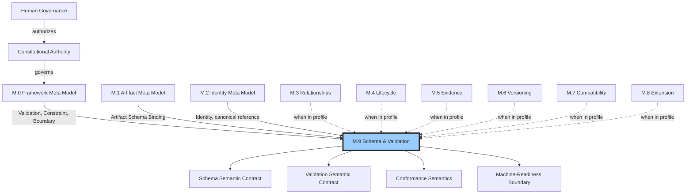
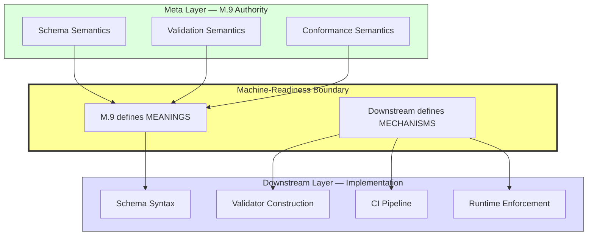
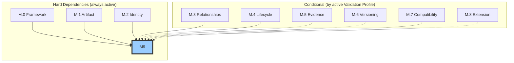

# M.9 — Schema & Validation Meta Model

> AI-DOS v1.1.0-draft · Enterprise Semantic Profile

---

## Document Metadata

| Field | Value |
|:---|:---|
| Identifier | `AI-DOS-META-M.9` |
| Version | 1.1.0-draft |
| Status | Draft |
| Classification | Enterprise Semantic Profile |
| Document Type | Meta Architecture Specification |
| Owner | Framework Governance |
| Review Authority | Enterprise Documentation Standards Board |
| Approval Authority | Human Governance |
| Created | 2026-07-14 |
| Last Updated | 2026-07-14 |
| Normative Authority | Human Governance; A.1 Constitution; M.0 Framework Meta Model |
| Normative References | M.0; M.1; M.2; M.3; M.4; M.5; M.6; M.7; M.8; AI-DOS Meta Enterprise Foundation v1 |
| Consumed By | Standards; Runtime; Engine; Agents; Commands; Templates; Workflows; Operational Core; validation tooling; review; certification |

---

## 1. Purpose

M.9 provides the single canonical semantic contract for schema binding and validation across AI-DOS, uniting these into one governed specification because schemas without validation are inert and validation without schema binding is ungrounded. Every governed artifact must answer consistently: what schema binds to it and what that binding means; what is being validated, by what rules, to what scope; what constitutes a validation result and when is an artifact conformant; how validation produces evidence for review and certification; and where Meta-family semantic definitions end and downstream tooling begins. M.9 prevents semantic duplication across Standards, Runtime, Engines, Agents, validation tooling, review, certification, templates, workflows, and Operational Core by providing one authoritative source for all schema binding and validation meaning.

---

## 2. Authority Position

M.9 is the terminal Enterprise Semantic Profile — the final Meta-family specification. No other M.x document depends on M.9. As defined by Foundation v1 §5.4, M.9 sits within the M.4–M.9 Enterprise Semantic Profile layer. M.9 has a unique position: it is the only family that may consume a variable subset of upstream families based on the active validation profile, making it the most flexible and the most context-dependent family in the architecture. M.9 shall not introduce new root meta types and shall not redefine concepts owned by M.0–M.8.

M.9 produces four contracted outputs consumed by downstream: the Schema Semantic Contract (governs what schema means), the Validation Semantic Contract (governs what validation means), Conformance Semantics (governs when an artifact conforms), and the Machine-Readiness Boundary (the terminal Meta contribution separating semantics from tooling).

---

## 3. Scope

M.9 governs: schema as semantic contract; schema binding to artifact types, instances, relationship types, extension points, lifecycle states, and versions; schema version binding as explicit and immutable; validation target identity and scope; validation profiles declaring which families are included; validation rules as declarative semantic constraints; validation assertions as rule-target evaluations; validation results as typed outcomes (pass, fail, warning, waived finding); conformance and non-conformance with domain-classified failure; semantic validation and structural validation as distinct layers; eight specialized validation domains; validation evidence per M.5; and the machine-readiness boundary separating Meta semantics from downstream implementation.

---

## 4. Out of Scope

Specific JSON/YAML/XML schema syntax; validator construction and configuration; CI pipeline integration; test runner invocation; runtime enforcement mechanisms; error reporting format; validation tooling UI; performance characteristics; storage of validation results; Standards procedures; Target Project content validation (unless explicitly profiled). M.9 defines what validation *means*; downstream consumers determine how validation is *performed*.

---

## 5. Owned Semantics

| Semantic Concept | Definition |
|:---|:---|
| Schema | A semantic contract that binds meaning to artifact structure, declaring what correctness means for a class of artifacts |
| Schema Binding | The governed act of connecting a schema to one or more artifacts, types, relationships, or extensions |
| Schema Version Binding | Explicit, immutable connection of a specific schema version to a specific target version using M.6 semantics |
| Validation Target | The artifact, relationship, extension, lifecycle state, or schema binding that validation examines |
| Validation Scope | The declared breadth and depth of validation examination: full, partial, or targeted |
| Validation Rule | A declarative semantic statement defining what must be true for a target to satisfy a constraint |
| Validation Assertion | The act of evaluating a validation rule against a validation target within a declared scope |
| Validation Result — Pass | Target satisfies the rule within scope; no evidence required |
| Validation Result — Fail | Target does not satisfy the rule; evidence is mandatory; blocks conformance |
| Validation Result — Warning | Target satisfies the rule with a non-blocking concern; evidence is mandatory |
| Validation Result — Waived Finding | Target does not satisfy the rule but governance has explicitly waived it; waiver evidence is mandatory |
| Conformance | State where a target satisfies all mandatory rules within full scope with no unwaived failures |
| Non-Conformance | State where a target fails one or more mandatory rules without waiver |
| Semantic Validation | Verification that a target's meaning is correct (values, labels, terminology, intent alignment) |
| Structural Validation | Verification that a target's form is correct (presence, absence, cardinality, composition, format) |
| Authority Validation | Verification that a target's governance chain is correct and no lower authority overrides higher |
| Relationship Validation | Verification that relationship types, cardinality, referential integrity, and cycle rules are satisfied |
| Lifecycle Validation | Verification that lifecycle states, transitions, and guard conditions are correct |
| Evidence Validation | Verification that evidence presence, quality, freshness, and claim binding are correct |
| Compatibility Validation | Verification that evolution respects compatibility constraints and breaking changes are detected |
| Extension Validation | Verification that extensions respect declared extension points and constraints |
| Validation Profile | A defined set of semantic families that a specific validation scope covers |
| Machine-Readiness Boundary | The semantic line where M.9 definitions end and downstream tooling implementation begins |

---

## 6. Consumed Semantics

| Source | Concept Consumed | Dependency Type |
|:---|:---|:---|
| M.0 | Validation root, Evidence, Constraint, Boundary | Hard |
| M.1 | Artifact Schema Binding, artifact families, artifact types | Hard |
| M.2 | Identity, identifier, canonical reference, alias | Hard |
| M.3 | Relationship types, cardinality, referential integrity | Conditional — only when M.3 is in the active validation profile |
| M.4 | Lifecycle states, transitions, guard conditions | Conditional — only when M.4 is in the active validation profile |
| M.5 | Evidence items, source, quality, claim binding, freshness | Conditional — only when M.5 is in the active validation profile |
| M.6 | Version, version binding, compatibility across versions | Conditional — only when M.6 is in the active validation profile |
| M.7 | Compatibility, breaking change, compatibility classes | Conditional — only when M.7 is in the active validation profile |
| M.8 | Extension, extension points, extension constraints, extension scope | Conditional — only when M.8 is in the active validation profile |

---

## 7. Core Definitions

### 7.1 Schema Model

A **Schema** in M.9 is a semantic contract binding meaning to artifact structure. A schema declares what an artifact of a given type must contain, what constraints its contents must satisfy, and what semantic expectations its structure implies. A schema is not a syntax definition, serialization format, or validator configuration.

Every schema has: identity (M.2), authority (M.0), owner (M.0), version (M.6), scope (M.1 artifact types), constraints (M.0 Constraint), extension points (M.8), compatibility class (M.7), and lifecycle (M.4). A schema is meaningful only when bound. An unbound schema is a declaration without application. A schema declares what must be true; validation is a separate act that checks against the schema's declarations.

A schema may declare constraints at multiple levels: required presence of semantic components, allowed values or value ranges, structural composition rules, relationship cardinality expectations, lifecycle state requirements, and extension boundaries. All are semantic declarations; none prescribe how a validator should check them.

### 7.2 Schema Binding Model

A **Schema Binding** is the governed act of connecting a schema to one or more targets. Binding is a semantic relationship, not a file reference or import statement.

| Binding Target | Governance Source |
|:---|:---|
| Artifact Type | M.1 artifact type governance |
| Artifact Instance | M.2 identity, M.1 artifact instance |
| Relationship Type | M.3 relationship governance |
| Extension Point | M.8 extension governance |
| Lifecycle State | M.4 lifecycle governance |
| Version | M.6 versioning governance |

Binding rules: both schema and target must have M.2 identity; bindings must not create circular dependencies; lower-authority schemas may not override higher-authority bindings on the same target; bindings must be traceable as evidence per M.5; a schema bound to version X does not automatically bind to version X+1 (version-scoped); multiple schemas may bind to the same target with authority precedence governing overlaps; bindings may be conditional on M.4 lifecycle states or M.7 compatibility conditions.

### 7.3 Schema Version Binding

Schema version binding connects a specific schema version to a specific target version using M.6 versioning semantics. An artifact's conformance status is always relative to a specific schema version binding. The unqualified statement "artifact A conforms" is semantically incomplete; the complete statement includes schema identity, version, binding, scope, authority, and result set.

Version binding rules: binding is explicit (implicit latest-version binding is not recognized); binding is immutable once established (changing requires a new binding, not a mutation); M.7 compatibility semantics determine whether a new schema version may bind to existing target versions; multiple schema versions may coexist, each bound to different target versions; when a target transitions versions, the schema binding must be re-evaluated.

### 7.4 Validation Target and Scope Model

A **Validation Target** is the subject of validation. Every target must have M.2 identity before validation begins and at least one schema binding before meaningful validation. Targets may be examined by multiple validation acts, each producing its own result set. A target's identity must be recorded in every validation result.

Target scope levels: single artifact instance, artifact type (all instances), relationship instance, relationship type, schema binding, extension point, and lifecycle transition.

**Validation Scope** determines breadth and depth of examination. Scope is a governed boundary, not an implementation optimization.

| Scope Level | Meaning | Conformance Implication |
|:---|:---|:---|
| Full | Every schema-bound constraint examined | Required for conformance claims |
| Partial | Defined subset of constraints | Draft-state or incremental checks only |
| Targeted | Single constraint or constraint family | Focused verification only |

Scope must be declared before validation begins and recorded in the result. Post-hoc scope reduction invalidates completeness. Full scope is required for canonical conformance claims. Scope interacts with M.4: draft artifacts may use partial or targeted scope; canonical artifacts require full scope. Scope may not be expanded silently; concerns discovered outside declared scope must be reported as out-of-scope observations.

### 7.5 Validation Rule and Assertion Model

A **Validation Rule** is a declarative semantic statement defining what must be true. Rules exist independent of any particular validation act. Every rule has: identity (M.2), authority, owner, domain, scope requirement, constraint (derived from M.0 Constraint), binding reference, severity (mandatory blocks conformance; advisory produces warning), and lifecycle (M.4).

M.9 defines eight rule types by domain:

| Rule Type | Domain | Enforces |
|:---|:---|:---|
| Semantic Rule | Semantic Validation | Meaning correctness: values, labels, terminology, intent |
| Structural Rule | Structural Validation | Form correctness: presence, absence, cardinality, composition |
| Authority Rule | Authority Validation | Governance correctness: authority chain, precedence |
| Relationship Rule | Relationship Validation | Connection correctness: types, cardinality, referential integrity |
| Lifecycle Rule | Lifecycle Validation | State correctness: states, transitions, guard conditions |
| Evidence Rule | Evidence Validation | Support correctness: presence, quality, freshness |
| Compatibility Rule | Compatibility Validation | Evolution correctness: breaking change detection |
| Extension Rule | Extension Validation | Extension correctness: point compliance, constraint adherence |

Rules are declarative, not imperative. They may compose (a semantic rule may reference a structural rule as prerequisite) but composition does not change individual rule meanings. Rules are authoritative within their domain; domain boundaries prevent overlap. Rules may be version-scoped: a rule bound to schema version 1.0 may be superseded in version 2.0.

A **Validation Assertion** is the act of evaluating a rule against a target within a declared scope. Each rule-target pair produces exactly one assertion. Assertions are ephemeral acts; their results and evidence persist. The collection of assertions forms a result set; the overall outcome is derived from the complete set, not from any individual assertion.

### 7.6 Validation Result Model

M.9 defines four canonical result types. Every assertion produces exactly one. No other result types exist.

| Result Type | Conformance Effect | Evidence Required |
|:---|:---|:---|
| Pass | Positive conformance contribution | Optional (may include audit trace) |
| Fail | Blocks conformance | Mandatory: rule violated, deficiency, expected state |
| Warning | Positive but annotated | Mandatory: concern, non-blocking rationale, recommended resolution |
| Waived Finding | Positive but conditional | Mandatory: deficiency, waiving authority, rationale, waiver scope |

Every result carries: identity, type, target identity, rule identity, declared scope, schema binding reference, assertion timestamp, evidence, rule severity, and assertion authority.

Result aggregation for a target with multiple results:

| Highest-Severity Result | Overall Outcome |
|:---|:---|
| Any Fail (unwaived) | Non-conformant |
| Any Waived Finding | Conformant with conditions |
| All Pass or Warning | Conformant |
| No results (empty set) | Inconclusive — not a conformance claim |

A target with no validation results has not been validated. Absence of failure is not evidence of conformance.

### 7.7 Conformance Model

**Conformance** is the state where a target satisfies all mandatory rules within full scope with all non-pass results being warnings or explicitly waived findings. Conformance is always relative to a specific schema binding, version, scope, authority, and result set.

Non-conformance is classified by domain:

| Non-Conformance Class | Resolution Path |
|:---|:---|
| Structural | Correct structural deficiency and re-validate |
| Semantic | Correct semantic deficiency and re-validate |
| Authority | Resolve authority conflict and re-validate |
| Relationship | Correct relationship and re-validate |
| Lifecycle | Resolve lifecycle violation and re-validate |
| Evidence | Provide required evidence and re-validate |
| Compatibility | Resolve compatibility violation and re-validate |
| Extension | Correct extension and re-validate |

Multiple classes may occur simultaneously; each is independently resolved. Non-conformance interacts with M.4: draft artifacts may be non-conformant; canonical artifacts must be conformant at full scope. Transition from Draft to Canonical requires full-scope validation with no unwaived failures.

### 7.8 Specialized Validation Domains

M.9 defines eight specialized validation domains. Authority and identity validation are always active (M.0, M.2 hard dependencies). The remaining domains are activated only when the corresponding Meta family is included in the active validation profile.

| Domain | Always Active | Activated When | Key Checks |
|:---|:---|:---|:---|
| Authority Validation | Yes | — | Authority chain completeness, precedence, conflict detection, ownership accountability |
| Relationship Validation | No | M.3 in profile | Type compliance, cardinality, referential integrity, cycle detection, bidirectional consistency |
| Lifecycle Validation | No | M.4 in profile | State validity, transition validity, guard condition satisfaction, promotion readiness |
| Evidence Validation | No | M.5 in profile | Presence, quality, freshness, source authority, claim binding |
| Compatibility Validation | No | M.7 in profile | Breaking change detection, compatibility class adherence, version coexistence, migration path |
| Extension Validation | No | M.8 in profile | Extension point compliance, constraint adherence, scope respect, identity, authority |

Domains are not isolated; a single validation act may produce results from multiple domains. Domain rules may cross-reference (a lifecycle rule may require evidence validation to pass before a transition is allowed). The unified result set captures findings from all applicable domains.

### 7.9 Validation Profile Model

A **Validation Profile** declares which Meta families (M.3–M.8) are included in a specific validation scope. This is the mechanism by which M.9 achieves its unique profile-driven consumption model.

| Profile Component | Included When |
|:---|:---|
| Root constraint validation (M.0) | Always — hard dependency |
| Artifact binding validation (M.1) | Always — hard dependency |
| Identity validation (M.2) | Always — hard dependency |
| Relationship validation (M.3) | When M.3 is in the profile |
| Lifecycle validation (M.4) | When M.4 is in the profile |
| Evidence validation (M.5) | When M.5 is in the profile |
| Versioning validation (M.6) | When M.6 is in the profile |
| Compatibility validation (M.7) | When M.7 is in the profile |
| Extension validation (M.8) | When M.8 is in the profile |

Profile rules: M.0, M.1, and M.2 are unconditional; optional families must be explicitly declared; a profile must not claim to validate a family not included; multiple profiles may exist for different contexts; profiles are defined by the schema owner or validation authority, not inferred by the validator.

### 7.10 Machine-Readiness Boundary

The **Machine-Readiness Boundary** is the semantic line where M.9 definitions end and downstream tooling implementation begins. M.9 defines what schema, validation, conformance, and evidence mean. Downstream consumers implement these meanings using specific technologies, languages, and tools. The boundary is not a cliff — semantic definitions do not cease to matter below it — but meanings flow downward while mechanism definitions do not flow upward.

| Above the Boundary (M.9 Authority) | Below the Boundary (Downstream Authority) |
|:---|:---|
| Schema as semantic contract | JSON Schema, YAML Schema, XML Schema, any schema syntax |
| Schema Binding as governed relationship | Validator construction and configuration |
| Validation Rule as declarative constraint | CI pipeline integration |
| Validation Assertion as rule-target evaluation | Test runner invocation |
| Validation Result as typed outcome | Runtime enforcement |
| Conformance as binary state | Error reporting format |
| Evidence as auditable support | Validation tooling UI |
| Machine-Readiness Boundary itself | Performance characteristics, storage |

---

## 8. Semantic Rules

1. **Schema binds meaning** — A schema is a semantic contract, not a syntax document. Binding is its purpose.
2. **Validation produces evidence** — Every non-pass result carries evidence per M.5. Validation without evidence is not validation.
3. **Conformance is binary** — An artifact conforms or it does not. Partial, approximate, and assumed conformance are not recognized.
4. **Semantic before structural** — Semantic validation is the higher-order concern; structural validation is necessary but subordinate.
5. **Scope governs precision** — Scope is a governed boundary. A narrow scope is deliberate, not deficient.
6. **Rules before assertions** — Rules define what must be true; assertions execute the check. Rules exist independent of acts.
7. **Results are typed and complete** — Only four result types exist. Omitted findings are not assumed to pass.
8. **Evidence is mandatory for non-pass** — Warnings and waivers carry evidence of their justification.
9. **Authority governs schema** — Lower-authority schemas may not override higher-authority bindings.
10. **Machine-readiness is a boundary, not a cliff** — M.9 defines meanings; downstream defines mechanisms.
11. **Explicit version binding** — Schema version binding is explicit and immutable. Implicit latest-version binding is not recognized.
12. **Full scope for conformance** — Conformance claims require full-scope validation. Partial-scope results may not support conformance claims.
13. **Profile-driven consumption** — M.9 consumes M.3–M.8 only when included in the active validation profile. Families outside the profile must not be consumed.
14. **No result type proliferation** — Downstream consumers may not introduce result types beyond the four defined by M.9.
15. **Validation domain separation** — Each specialized domain governs its own concern area; domain boundaries prevent rule overlap.

---

## 9. Invariants

1. Every validation result traces to exactly one assertion; every assertion traces to exactly one rule and exactly one target.
2. Every validation rule traces to exactly one schema binding; every schema binding traces to exactly one schema and at least one target.
3. Every non-pass result carries evidence satisfying M.5 quality requirements.
4. Every conformance claim references a full-scope validation with no unwaived failures.
5. Every schema version binding is explicit and immutable.
6. The machine-readiness boundary is respected: meanings flow downstream; mechanism definitions do not flow upstream.
7. M.9 is the terminal Meta-family specification — no M.x document depends on M.9.
8. M.0, M.1, and M.2 are always included in every validation profile; M.3–M.8 are included only when explicitly declared.
9. Absence of failure is not evidence of conformance; only explicit pass results constitute conformance.
10. Structural validation should generally precede semantic validation because structural failure makes semantic assessment unreliable (implementation ordering, not semantic requirement).

---

## 10. Boundary Rules

- M.9 defines meanings; downstream consumers define mechanisms. This is the fundamental boundary rule.
- Downstream consumers may not redefine M.9 concepts. They may implement, specialize for a domain, and extend through M.8 — but may not change what M.9 has established.
- Downstream consumers may add implementation-specific concepts below the boundary; these do not affect M.9 semantics.
- The boundary is stable — it does not shift based on implementation convenience, tooling maturity, or organizational structure.
- The boundary is the last semantic concept in the Meta-family chain. M.9 is terminal.
- Schema syntax (JSON Schema, YAML, XML, etc.) is entirely below the boundary.
- Validator construction, CI pipeline integration, test runners, runtime enforcement, error reporting format, and storage are entirely below the boundary.
- M.9 may extend through M.8 extension semantics for domain-specific validation rule types, scope types, and specialized result annotations, provided they derive from the M.9 root.

---

## 11. Selective Dependencies

Per Foundation v1 §7.2:

| Family | Required Upstream | Conditional Upstream | Must Not Consume |
|:---|:---|:---|:---|
| M.9 Schema & Validation | M.0; M.1; M.2 | Applicable semantic families being validated | Families outside the active schema or validation profile |

M.9's dependency model is unique among all Meta families: it is the only family that may consume a variable subset of upstream families based on the active validation profile. A profile validating only identity conformance (M.2) need not include lifecycle (M.4), versioning (M.6), or extension (M.8) validation. Families outside the active profile must not be consumed — this prevents M.9 from silently depending on all prior families. Per Foundation v1 §7.1 rule 10: "M.9 consumes M.0, M.1, M.2, and the applicable semantic families being validated; it must not consume every family when a schema profile validates only a subset."

---

## 12. Downstream Consumption

| Consumer | Consumes from M.9 | Must Not |
|:---|:---|:---|
| Standards | Schema contract, conformance semantics, evidence requirements | Redefine what conformance means |
| Runtime | Validation target semantics, result types, scope semantics | Invent validation mechanisms that conflict with M.9 |
| Engine | Validation rule semantics, assertion model, result types | Change result type definitions |
| Agents | Conformance semantics, evidence requirements, scope rules | Self-certify or bypass evidence requirements |
| Commands | Validation target identification, result consumption | Produce results without scope declaration |
| Templates | Schema binding expectations, validation expectations | Embed schema syntax in templates |
| Workflows | Validation sequencing, result aggregation, evidence flow | Skip evidence production for non-pass results |
| Operational Core | Machine-readiness boundary, conformance reporting | Redefine the boundary for operational convenience |
| Validation tooling | Full M.9 semantic contract | Implement only partial result types |
| Review | Validation evidence, result types, conformance claims | Accept conformance claims without evidence |
| Certification | Full-scope validation, evidence completeness, conformance claims | Certify artifacts with partial-scope validation |

Downstream consumers may extend M.9 through M.8 extension semantics for domain-specific validation rule types and specialized result annotations, provided they derive from the M.9 root and do not redefine existing concepts.

---

## 13. Information Preservation

M.9 is a new Meta-family specification. It unifies schema binding semantics previously referenced across M.0 and M.1 with validation semantics previously embedded in M.0, creating a single authoritative source. No prior document is superseded. The migration preserves all valid schema and validation patterns from prior practice while adding: explicit schema binding governance, the four canonical result types with mandatory evidence requirements, the machine-readiness boundary, profile-driven consumption, and the conformance/non-conformance classification system with eight domain classes. Prior implicit validation assumptions become explicit, governable contracts.

---

## 14. Semantic Ownership

M.9 owns schema binding semantics and validation semantics. It validates all other Meta families but owns only the schema-and-validation domain. Per Foundation v1 §8.1: "M.9 owns schema binding and validation semantics over the applicable semantic families included in a validation profile." M.9 does not own the semantic content it validates — M.0 owns framework meanings, M.1 owns artifact meanings, etc. M.9 owns *how validation is defined and structured*, not *what is validated*. No other Meta family or downstream domain owns schema binding, conformance semantics, validation result types, or the machine-readiness boundary. Downstream consumers implement these semantics; they do not redefine them. Per Foundation v1 §8 Ownership Chain, M.9 is the final entry: "M.9 owns schema binding and validation semantics over the applicable semantic families included in a validation profile."

---

## 15. Validation Assertions

| ID | Assertion | Checkable Criterion |
|:---|:---|:---|
| VA-9.1 | Every schema has M.2 identity, M.0 authority, M.6 version, and M.4 lifecycle | Schema anatomy is complete per §7.1 |
| VA-9.2 | Every schema binding has identity for both schema and target | Both sides have M.2 identity |
| VA-9.3 | Schema version binding is explicit and immutable | No implicit latest-version binding exists |
| VA-9.4 | Every validation target has M.2 identity before validation begins | Target identity is declared |
| VA-9.5 | Every validation scope is declared before validation begins | Scope is recorded in the result |
| VA-9.6 | Every assertion produces exactly one result from four types | Result is Pass, Fail, Warning, or Waived Finding |
| VA-9.7 | Every non-pass result carries mandatory evidence | Evidence satisfies M.5 quality requirements |
| VA-9.8 | Conformance claims require full scope | No partial-scope conformance claim exists |
| VA-9.9 | Validation profile includes M.0, M.1, M.2 unconditionally | Hard dependencies are present in every profile |
| VA-9.10 | Validation profile does not consume families outside the profile | No silent dependency on excluded families |
| VA-9.11 | Machine-readiness boundary is respected | No schema syntax, validator construction, or CI content in M.9 |
| VA-9.12 | Conformance claim includes schema identity, version, scope, authority, and result set | Conformance statement is fully qualified |
| VA-9.13 | No result type beyond the four defined types is produced | Downstream extensions use M.8, not new types |
| VA-9.14 | Waived findings include waiving authority, rationale, and waiver scope | Waiver evidence is complete |
| VA-9.15 | Lower-authority schema binding does not override higher-authority binding | Authority precedence is respected |

---

## 16. Completion / Governance Status

| Dimension | Status |
|:---|:---|
| Architecture-Only | Confirmed — no schema syntax, no validator implementation, no CI commands |
| Terminal Position | Confirmed — no M.x document depends on M.9 |
| Foundation v1 Aligned | Confirmed — matches §6.9 owned concepts, §7.1 rule 10, §7.2 dependency matrix, §8 ownership |
| Semantic Completeness | All 23 owned semantic concepts from Foundation v1 §6.9 are defined |
| Dependency Compliance | Hard: M.0, M.1, M.2; Conditional: M.3–M.8 (by active profile); Must Not: families outside profile |
| Profile-Driven Model | Confirmed — Validation Profile defines variable M.3–M.8 consumption |
| Downstream Consumption | Standards, Runtime, Engine, Agents, Commands, Templates, Workflows, Operational Core, validation tooling, review, certification |
| Governance Status | Draft — pending Framework Governance review and Human Governance approval |
| Promotion Requirements | Framework Governance review, dependency validation with M.0/M.1/M.2 and profile-dependent M.3–M.8, downstream impact review, explicit promotion |