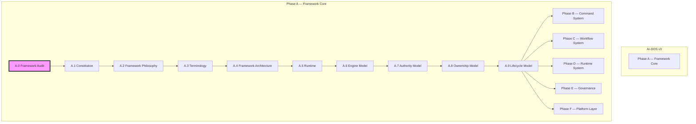
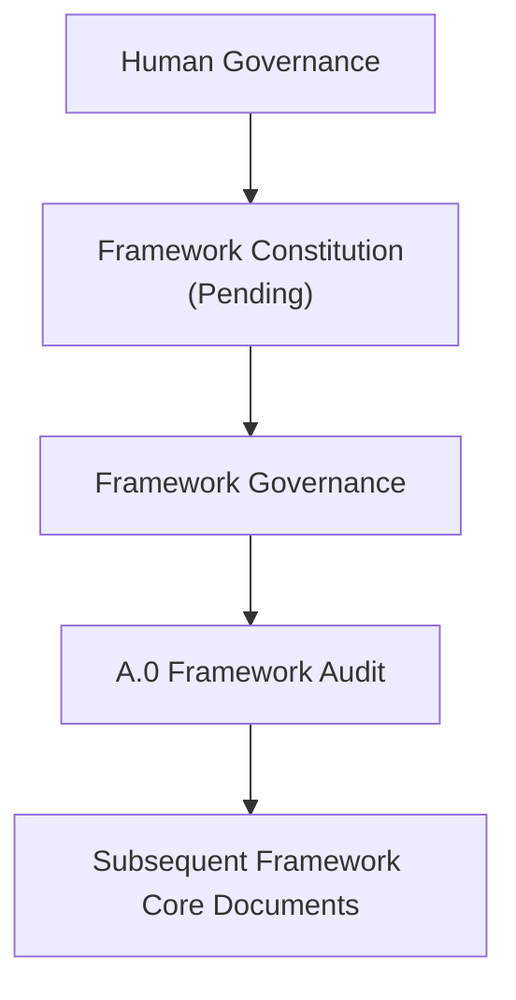
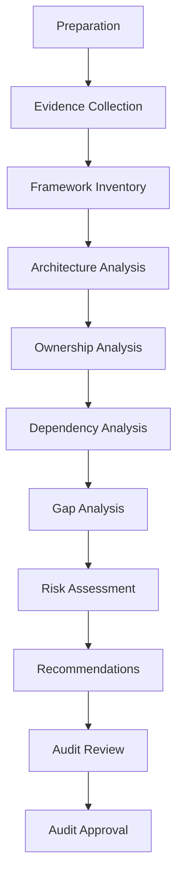
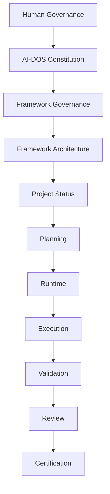
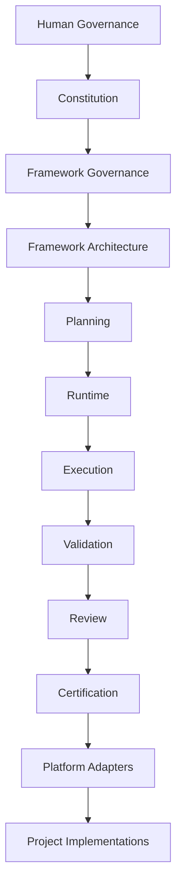
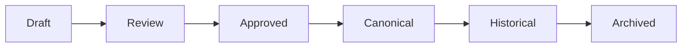
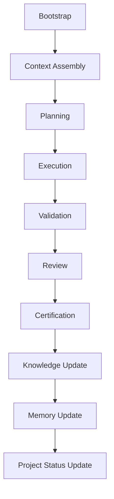

# A.0 — Framework Audit

> **AI-DOS v3 · Master Architecture Audit**
> Phase A — Framework Core · Stage A.0

---

## Document Metadata

| Field | Value |
|:---|:---|
| Identifier | `AI-DOS-AUDIT-A.0` |
| Title | A.0 — Framework Audit |
| Version | 3.0.0-beta |
| Status | Draft |
| Canonical Status | Non-canonical until reviewed, approved, and promoted through Framework Governance |
| Classification | Framework Core |
| Document Type | Master Architecture Audit |
| Owner | Framework Governance |
| Maintainers | Framework Architecture Team |
| Review Authority | Enterprise Documentation Standards Board |
| Approval Authority | Human Governance / Framework Governance |
| Created | 2026-07-03 |
| Last Updated | 2026-07-07 |
| Lifecycle Phase | Draft |
| Traceability ID | AI-DOS-AUDIT-A.0 |
| Scope | Framework Core architecture audit |
| Out of Scope | Implementation, certification, and project state updates |
| Normative Authority | Human Governance; `AGENTS.md`; `docs/AI/FrameworkGovernance.md` |
| Normative References | `docs/AI/Architecture/Standards/STD-010-Document-Metadata-Standard.md`; `docs/AI/Architecture/A.1-Constitution.md`; `docs/AI/Meta/M.0-Framework-Meta-Model.md`; `docs/AI/Architecture/Standards/STD-000-Framework-Standards.md` |
| Dependencies | Governance authority, artifact identity, lifecycle governance, traceability model, and applicable upstream v3 architecture documents |
| Consumes | Audit findings and architecture inventory |
| Produces | Framework audit report, recommendations, and follow-up architecture inputs |
| Related Specifications | `docs/AI/Architecture/A.1-Constitution.md`; `docs/AI/Meta/M.0-Framework-Meta-Model.md` |
| Supersedes | None |
| Superseded By | None |
| Promotion Requirements | Framework Governance review, approval, traceability validation, metadata validation, and explicit promotion |
| Certification Status | Not certified |

---

## Revision History

| Version | Date | Author | Description |
|:---|:---|:---|:---|
| 3.0.0-beta | 2026-07-03 |AI-DOS Framework | Refactored for publication quality; normalized formatting, terminology, and cross-references. |
| 3.0.0-alpha | 2026-07-03 |AI-DOS Framework | Initial draft of the Master Architecture Audit. |

---

## Table of Contents

1. [Status](#1-status)
2. [Purpose](#2-purpose)
3. [Objectives](#3-objectives)
4. [Audit Principles](#4-audit-principles)
5. [Audit Scope](#5-audit-scope)
6. [Audit Methodology](#6-audit-methodology)
7. [Framework Inventory](#7-framework-inventory)
8. [Authority Analysis](#8-authority-analysis)
9. [Ownership Analysis](#9-ownership-analysis)
10. [Dependency Analysis](#10-dependency-analysis)
11. [Documentation Audit](#11-documentation-audit)
12. [Terminology Audit](#12-terminology-audit)
13. [Runtime Audit](#13-runtime-audit)
14. [Planning Audit](#14-planning-audit)
15. [Validation Audit](#15-validation-audit)
16. [Agent Audit](#16-agent-audit)
17. [Swarm Audit](#17-swarm-audit)
18. [Missing Concepts](#18-missing-concepts)
19. [Migration Strategy](#19-migration-strategy)
20. [Recommendations](#20-recommendations)
21. [Exit Decision](#21-exit-decision)
22. [Next Document](#22-next-document)
- [References](#references)
- [Appendices](#appendices)

---

## 1. Status

### Document Information

| Property | Value |
|:---|:---|
| **Document** | A.0 — Framework Audit |
| **Identifier** | `AI-DOS-AUDIT-A.0` |
| **Version** | 3.0.0-beta |
| **Status** | Draft |
| **Type** | Master Architecture Audit |
| **Classification** | Framework Core |
| **Authority** | Constitution (Pending), Framework Governance |
| **Owner** |AI-DOS Framework |
| **Maintainers** | Framework Architecture Team |
| **Phase** | Phase A — Framework Core |
| **Stage** | A.0 — Framework Audit |
| **Created** | 2026-07-03 |
| **Last Updated** | 2026-07-03 |

### Audit Position

The Framework Audit is the first architectural activity of theAI-DOS v3 redesign program. It establishes the verified architectural baseline of the existing Framework before any redesign, migration, or implementation work begins. No architectural decision made during the redesign may contradict the findings of this audit unless explicitly approved by human governance.

This audit serves as the architectural baseline for every Framework Core redesign activity. All subsequent Framework Core documents consume the verified outputs of this audit.

### Framework Roadmap Position

*Figure 1: Framework Roadmap Position. The current document (A.0) is highlighted.*

### Audit Classification

This document is classified as a **Master Architecture Audit**. Unlike implementation audits, this audit does not validate a single feature or capability. Instead, it evaluates the entire Framework as a complete architectural system. The purpose of this audit is discovery rather than verification.

### Audit Scope

This audit includes every canonical Framework component, including but not limited to:

- Constitution
- Framework Architecture
- Governance
- Runtime
- AI Orchestrator
- Planning System
- Command System
- Workflow System
- Validation System
- Testing System
- Certification System
- Review System
- Documentation Architecture
- Templates
- Project Layer
- Platform Layer

### Audit Boundaries

This audit does not:

- redesign the Framework;
- introduce new architecture;
- modify implementation;
- approve migrations;
- define runtime behavior;
- introduce new terminology.

Those activities belong to subsequent Framework Core documents.

### Audit Authority

*Figure 2: Audit Authority Hierarchy. If conflicts are discovered during the audit, human governance remains the final authority.*

### Deliverables

The audit produces the following deliverables, which become mandatory inputs for every subsequent Framework Core redesign document:

- Complete Framework Inventory
- Authority Graph
- Ownership Graph
- Dependency Graph
- Documentation Inventory
- Terminology Inventory
- Architectural Findings
- Duplicate Analysis
- Missing Capability Analysis
- Migration Recommendations

### Success Criteria

This document is considered complete only when:

- Every Framework component has been identified.
- Every ownership boundary has been documented.
- Every dependency has been traced.
- Every architectural duplication has been identified.
- Missing concepts have been catalogued.
- Framework redesign can proceed using verified evidence rather than assumptions.

Until these criteria are satisfied, the Framework Core redesign must not proceed beyond Phase A.0.

### Completion Statement

This section is complete when the document identity is established, audit authority is defined, Framework position is documented, classification is unambiguous, and deliverables and completion criteria are approved. This Status section becomes the canonical identity for the entire A.0 Framework Audit document.

---

## 2. Purpose

### Overview

The Framework Audit is the foundational architectural assessment for theAI-DOS v3 redesign initiative. Before introducing new architecture, the Framework must first be fully understood in its current form. This audit establishes a verified architectural baseline by identifying every major Framework capability, ownership boundary, dependency relationship, documentation artifact, and governance rule.

The purpose of this audit is not to redesign the Framework. Its purpose is to discover, document, validate, and classify the existing architecture using evidence-driven analysis. Only after this audit has been completed may architectural redesign begin.

### Why This Audit Exists

The previous generations ofAI-DOS successfully established a documentation-first and governance-first methodology for AI-assisted software development. As the Framework evolved, additional capabilities — including planning, workflows, commands, validation, testing, certification, templates, orchestration, and project governance — were introduced incrementally.

BeforeAI-DOS can evolve into a complete AI Development Operating System (AI-DOS), the Framework requires a comprehensive architectural assessment to answer fundamental questions such as:

- What currently exists?
- What is canonical?
- What has become duplicated?
- Which responsibilities are clearly owned?
- Which responsibilities overlap?
- Which architectural concepts are missing?
- Which concepts should be preserved?
- Which concepts should be redesigned?

Without answering these questions, redesign efforts would rely on assumptions rather than verified architectural evidence.

### Primary Purpose

The primary purpose of the Framework Audit is to establish a complete and authoritative understanding of the existing Framework before introducing any architectural change. This understanding serves as the foundation for every subsequent Framework Core document, including:

- Constitution ([A.1](#22-next-document))
- Framework Philosophy ([A.2](#references))
- Terminology ([A.3](#references))
- Framework Architecture ([A.4](#references))
- Runtime ([A.5](#references))
- Engine Model ([A.6](#references))
- Authority Model ([A.7](#references))
- Ownership Model ([A.8](#references))
- Lifecycle Model ([A.9](#references))

Each of these documents must consume the verified outputs produced by this audit.

### Architectural Purpose

This audit establishes:

- Framework identity
- Architectural ownership
- Dependency direction
- Layer boundaries
- Documentation authority
- Governance consistency
- Terminology consistency
- Runtime boundaries
- Planning boundaries
- Validation boundaries

These findings collectively define the architectural baseline from whichAI-DOS v3 is derived.

### Governance Purpose

The audit ensures future architectural decisions are based on documented evidence rather than historical assumptions. No Framework Core redesign document should contradict verified audit findings without explicit approval from human governance.

### Long-Term Purpose

This audit is intended to become a permanent historical artifact within the Framework. Future Framework versions should reference this document to understand:

- why architectural decisions were made;
- which legacy concepts were retained;
- which concepts were removed;
- how the Framework evolved over time.

### Completion Statement

The Purpose of this audit is fulfilled when the existing Framework has been completely understood, accurately documented, and objectively classified, providing a trusted architectural foundation for theAI-DOS v3 Framework Core redesign.

### Design Note — Architecture Discovery Document (ADD)

Although this document is currently organized as A.0 — Framework Audit, it is intentionally written to evolve into an Architecture Discovery Document (ADD-000). The ADD model extends a traditional audit by combining architectural discovery, governance evidence, migration analysis, and historical traceability into a single canonical artifact. Future master discovery documents should follow the same pattern, while implementation audits continue to use the standard Audit template.

---

## 3. Objectives

### Overview

The Framework Audit defines the measurable objectives that must be achieved before theAI-DOS v3 Framework Core redesign can proceed. The audit is considered complete only when every objective has been satisfied using documented architectural evidence.

### Primary Objectives

The audit shall:

- Establish a complete Framework inventory.
- Identify all architectural layers.
- Define ownership boundaries.
- Validate dependency direction.
- Classify canonical and historical documentation.
- Detect duplicated responsibilities.
- Identify missing architectural concepts.
- Produce migration recommendations for Framework Core v3.

### Governance Objectives

The audit shall ensure that:

- Every architectural decision is evidence-based.
- Human governance remains the final authority.
- No redesign proceeds without a verified baseline.
- Canonical documents are clearly identified.

### Quality Objectives

The audit shall provide:

- Traceability
- Consistency
- Completeness
- Repeatability
- Verifiability

### Success Metrics

The objectives are achieved when:

- 100% of Framework components are inventoried.
- Ownership is defined for every major subsystem.
- Dependency relationships are documented.
- Architectural gaps are identified.
- Migration priorities are established.
- Framework Core redesign can begin without unresolved architectural uncertainty.

### Completion Statement

This section is complete when the objectives are measurable, verifiable, and accepted as the success criteria for the Framework Audit.

---

## 4. Audit Principles

### Overview

The Audit Principles define the mandatory rules governing every Framework-level architectural audit performed within AI-DOS. These principles ensure that audit results remain objective, repeatable, traceable, and suitable as inputs for architectural decision-making.

### Core Principles

- **Evidence First.** Every finding shall be supported by verifiable evidence. Assumptions, intuition, and undocumented conclusions are not acceptable.
- **Documentation Before Decision.** Architecture must be documented before it is redesigned, implemented, or validated.
- **Human Authority.** Human governance is the final authority for every architectural decision.
- **Single Source of Truth.** Each architectural concept shall have exactly one canonical owner and one canonical definition.
- **Explicit Ownership.** Every responsibility, document, runtime component, and architectural capability must have an explicitly identified owner.
- **Dependency Integrity.** Dependencies shall always flow in the approved architectural direction. Circular or hidden dependencies are considered architectural defects.
- **Traceability.** Every recommendation shall be traceable to documented evidence and every redesign decision shall be traceable back to an audit finding.
- **Technology Neutrality.** Framework architecture shall remain independent from implementation technologies whenever practical.
- **Incremental Evolution.** Redesign shall preserve proven concepts while replacing only what is necessary to achieve the Framework vision.
- **Continuous Improvement.** Each completed audit becomes architectural knowledge for future Framework revisions.
- **Compliance.** Every Framework Core document produced after A.0 shall comply with these principles unless an explicit governance exception is documented.

### Completion Statement

This section is complete when the governing principles for Framework audits are defined, accepted, and referenced as mandatory guidance for subsequent architectural work.

---

## 5. Audit Scope

### Overview

The Framework Audit defines the architectural boundaries of theAI-DOS Framework Core redesign. Its scope intentionally covers every canonical Framework component that contributes to governance, planning, execution, validation, documentation, and long-term evolution. The audit evaluates the Framework as a complete architectural system rather than as isolated documents or implementation artifacts.

### Scope Objectives

The scope of this audit is to ensure that every architectural responsibility within the Framework is:

- identified;
- classified;
- documented;
- validated;
- mapped to its authoritative owner;
- positioned within the overall Framework architecture.

The audit establishes architectural visibility before architectural redesign.

### In Scope

#### Framework Foundation

- Constitution
- Framework Philosophy
- Terminology
- Framework Architecture
- Authority Model
- Ownership Model
- Lifecycle Model

#### Runtime Architecture

- Runtime
- Runtime Lifecycle
- Runtime Components
- Runtime Responsibilities

#### Planning System

- Development Phases
- Development Stages
- Historical Capabilities
- Planning Hierarchy
- Project Status

#### AI Operating System

- AI Orchestrator
- Agent Model
- Swarm Model
- Context Management
- Knowledge Management
- Memory Management

#### Execution System

- Commands
- Workflows
- Task Execution
- Execution Lifecycle

#### Quality System

- Validation
- Testing
- Review
- Certification
- Quality Gates

#### Documentation System

- Canonical Documents
- Specifications
- Templates
- Checklists
- Governance Documents
- Architecture Documents

#### Framework Governance

- Authority Hierarchy
- Ownership Boundaries
- Dependency Rules
- Source-of-Truth Policy

### Out of Scope

This audit does not:

- redesign Framework architecture;
- introduce new runtime components;
- approve implementation changes;
- modify source code;
- define platform-specific behavior;
- redesign project-specific architecture;
- perform performance benchmarking;
- evaluate programming languages or frameworks;
- replace human architectural decisions.

These activities belong to subsequent Framework Core documents.

### Boundary Rules

- **Framework Only.** The audit evaluates theAI-DOS Framework itself. It does not evaluate projects built on top of the Framework.
- **Architecture Before Implementation.** Architecture is evaluated independently from implementation quality.
- **Canonical Sources Only.** Only approved canonical documentation may be used as authoritative evidence. Historical documents, reference material, and work-in-progress artifacts may support analysis but must never override canonical sources.
- **Evidence-Based Findings.** Every observation, finding, recommendation, and conclusion must be supported by verifiable evidence.

### Scope Limitations

The Framework Audit represents a snapshot of the Framework at the beginning of theAI-DOS v3 redesign initiative. Changes introduced after the audit begins are evaluated separately and do not alter the historical validity of this document.

### Rationale

A clearly defined scope prevents architectural drift, eliminates ambiguity, and ensures that every participant evaluates the same architectural surface. Without explicit boundaries, audit findings become inconsistent, difficult to reproduce, and unsuitable as inputs for governance or redesign.

### Architectural Implications

The scope defined by this section governs every subsequent activity within the Framework Core redesign. Future documents — including the Constitution, Runtime, Engine Model, Authority Model, Ownership Model, and Lifecycle Model — must remain within these boundaries unless an explicit governance decision expands or revises the scope. Any architectural recommendation outside this scope shall be recorded separately and must not influence the audit verdict.

### Completion Statement

The Audit Scope is complete when the included areas, excluded areas, architectural boundaries, rationale, architectural implications, evidence requirements, and scope limitations are explicitly documented and approved by Framework governance.

---

## 6. Audit Methodology

### Overview

The Audit Methodology defines the standardized process used to perform the Framework Audit. Its purpose is to ensure that every architectural finding is produced through a consistent, repeatable, evidence-driven methodology rather than subjective interpretation. The methodology establishes how information is collected, validated, analyzed, classified, and transformed into architectural recommendations.

### Methodology Objectives

The methodology shall ensure that the audit is:

- Repeatable
- Evidence-based
- Traceable
- Technology-neutral
- Governance-driven
- Independent from implementation details

### Audit Lifecycle

*Figure 3: The standardized Audit Lifecycle.*

### Methodology Phases

- **Preparation.** Define audit scope, objectives, authoritative documents, and governance constraints.
- **Evidence Collection.** Collect canonical documentation, architecture specifications, governance rules, planning artifacts, and validation evidence.
- **Discovery.** Identify Framework components, architectural layers, responsibilities, dependencies, terminology, and ownership.
- **Analysis.** Evaluate consistency, architectural integrity, duplication, dependency direction, ownership boundaries, and missing concepts.
- **Classification.** Classify findings as one of the following:
    - Canonical
    - Historical
    - Legacy
    - Duplicate
    - Missing
    - Candidate for Redesign
- **Recommendation.** Produce recommendations supported by documented evidence. Recommendations shall not become architectural decisions until approved through governance.

### Evidence Requirements

Every finding shall reference one or more authoritative sources. Evidence must be:

- Verifiable
- Reproducible
- Current
- Traceable

Unsupported assumptions are not valid audit evidence.

### Validation Rules

The methodology requires validation of:

- Architectural consistency
- Ownership consistency
- Dependency direction
- Documentation completeness
- Terminology consistency
- Governance compliance

### Boundary Rules

The methodology shall never:

- redesign the Framework;
- modify implementation;
- bypass governance;
- replace human judgment.

### Rationale

A documented methodology guarantees that future audits can be executed using the same process, producing consistent and comparable architectural evidence.

### Architectural Implications

Every subsequent Framework audit should inherit this methodology unless an updated governance document explicitly defines a new audit process. This methodology therefore becomes the canonical execution model for Framework-level architectural audits.

### Completion Statement

The Audit Methodology is complete when the audit lifecycle, execution phases, evidence requirements, validation rules, and governance boundaries are fully documented and approved.

---

## 7. Framework Inventory

### Overview

The Framework Inventory establishes the complete architectural inventory of theAI-DOS Framework. It identifies every canonical subsystem, its architectural role, ownership expectations, and relationship to the overall Framework. The inventory is descriptive rather than prescriptive — it records what exists before redesign decisions are made.

### Inventory Objectives

The inventory shall:

- Identify every canonical Framework subsystem.
- Classify each subsystem by architectural responsibility.
- Record ownership expectations.
- Establish inputs for dependency and ownership analysis.
- Provide traceability for future redesign decisions.

### Inventory Classification

#### Foundation Layer

- Constitution
- Framework Philosophy
- Terminology
- Framework Architecture
- Authority Model
- Ownership Model
- Lifecycle Model

#### Governance Layer

- Governance
- Project Status
- Planning Policies
- Quality Gates
- Source-of-Truth Rules

#### Planning Layer

- Development Phases
- Development Stages
- Historical Capabilities
- Planning Documents

#### Runtime Layer

- Runtime
- Runtime Lifecycle
- Context Assembly
- Execution Pipeline

#### AI Engine Layer

- Planning Engine
- Context Engine
- Knowledge Engine
- Memory Engine
- Decision Engine
- Execution Engine
- Validation Engine
- Review Engine
- Certification Engine

#### AI Operating Layer

- AI Orchestrator
- Agent System
- Swarm System
- Context Management
- Knowledge Management
- Memory Management

#### Execution Layer

- Commands
- Workflows
- Tasks
- Execution Contracts

#### Quality Layer

- Validation
- Testing
- Review
- Certification

#### Documentation Layer

- Specifications
- Templates
- Checklists
- Standards
- Architecture Documents

#### Platform Layer

- Platform Adapters
- Project Adapters
- Integration Contracts

### Inventory Attributes

Every inventory item shall eventually include:

- Identifier
- Purpose
- Owner
- Responsibilities
- Consumes
- Produces
- Dependencies
- Status
- Canonical References

### Inventory Rules

- Every subsystem appears only once.
- Every subsystem has a single architectural owner.
- Every subsystem is traceable to canonical documentation.
- Duplicate responsibilities shall be reported during analysis, not hidden in the inventory.

### Rationale

A complete inventory is the foundation for ownership analysis ([Section 9](#9-ownership-analysis)), dependency analysis ([Section 10](#10-dependency-analysis)), and migration planning ([Section 19](#19-migration-strategy)). Without a verified inventory, no architectural redesign can be considered complete or trustworthy.

### Architectural Implications

All subsequent audit sections shall reference this inventory as the canonical list of Framework subsystems. Any newly discovered subsystem must first be added to the inventory before it can participate in architectural analysis.

### Completion Statement

The Framework Inventory is complete when every canonical Framework subsystem has been identified, classified, and prepared for ownership, dependency, and governance analysis.

---

## 8. Authority Analysis

### Overview

The Authority Analysis defines the authoritative decision hierarchy of theAI-DOS Framework. Its purpose is to identify which architectural authority governs every major decision and to ensure that no responsibility is controlled by multiple competing authorities. Authority determines who has the right to define, approve, interpret, and evolve architectural truth.

### Objectives

This analysis shall:

- Identify every authority level within the Framework.
- Define the relationship between authorities.
- Prevent conflicting sources of authority.
- Establish a single decision hierarchy.
- Provide authoritative inputs for governance and ownership.

### Authority Hierarchy

*Figure 4: Canonical Authority Hierarchy. Each layer derives its authority from the layer above and may not redefine higher-level architectural decisions.*

### Authority Domains

| Domain | Authority | Responsibilities |
|:---|:---|:---|
| Human Governance | Human Governance | Strategic direction, final approval, exceptions, and conflict resolution. |
| Constitution |AI-DOS Constitution | Immutable Framework principles and constitutional rules. |
| Framework Governance | Framework Governance | Governance policies, compliance rules, and architectural oversight. |
| Framework Architecture | Architecture Owner | Canonical architectural models, layering, and dependency direction. |
| Project Status | Project Status Owner | Current operational truth of the Framework and active work. |
| Planning | Planning Owner | Phases, stages, priorities, and execution planning. |
| Runtime | Runtime Owner | Execution lifecycle and operational behavior. |
| Execution | Execution Owner | Commands, workflows, and task execution. |
| Validation | Validation Owner | Quality verification and evidence collection. |
| Review | Review Owner | Architectural assessment and recommendation. |
| Certification | Certification Owner | Formal acceptance of completed architectural work. |

### Authority Rules

- Every architectural decision has one authoritative owner.
- Lower authorities shall not override higher authorities.
- Conflicts are escalated upward through the authority hierarchy.
- Human Governance is the ultimate authority.

### Conflict Resolution

When multiple documents or components appear to define the same architectural truth:

1. Identify the highest authoritative source.
2. Treat lower definitions as derived.
3. Record inconsistencies as audit findings.
4. Resolve conflicts through governance before redesign.

### Rationale

Explicit authority prevents contradictory documentation, duplicated governance, and inconsistent architectural evolution.

### Architectural Implications

The Authority Analysis becomes the reference model for the Constitution ([A.1](#22-next-document)), Governance, Ownership Model ([A.8](#references)), Runtime ([A.5](#references)), and every future Framework audit. Any future authority introduced into the Framework must integrate into this hierarchy rather than creating an independent chain of control.

### Completion Statement

The Authority Analysis is complete when every major decision domain has a single authoritative owner, the authority hierarchy is documented, and conflict resolution rules are established.

---

## 9. Ownership Analysis

### Overview

The Ownership Analysis defines the architectural ownership model of theAI-DOS Framework. Ownership identifies the single responsible authority for every architectural capability, subsystem, document, runtime component, and governance responsibility. Unlike authority, which determines who may decide, ownership determines who is accountable for the lifecycle of an architectural asset.

### Objectives

The Ownership Analysis shall:

- Define a single owner for every architectural responsibility.
- Eliminate duplicated ownership.
- Separate ownership from authority.
- Clarify responsibility boundaries.
- Prepare the Framework for dependency and governance validation.

### Ownership Principles

- Every architectural asset has exactly one owner.
- Ownership is explicit and documented.
- Ownership may delegate execution but never accountability.
- Ownership boundaries must not overlap.
- Undefined ownership is treated as an architectural defect.

### Ownership Domains

| Domain | Primary Owner | Responsibilities |
|:---|:---|:---|
| Constitution | Constitution Owner | Core principles and immutable rules. |
| Governance | Framework Governance | Policies, compliance, oversight. |
| Architecture | Architecture Owner | Canonical architecture and layering. |
| Runtime | Runtime Owner | Runtime lifecycle and execution environment. |
| Planning | Planning Owner | Phases, stages, roadmap, priorities. |
| Commands | Command Owner | Command contracts and execution rules. |
| Workflows | Workflow Owner | Workflow definitions and orchestration. |
| Validation | Validation Owner | Quality verification and evidence. |
| Testing | Testing Owner | Test strategy and coverage. |
| Review | Review Owner | Architectural assessment. |
| Certification | Certification Owner | Acceptance and certification. |
| Knowledge | Knowledge Owner | Canonical knowledge model. |
| Memory | Memory Owner | Persistent Framework memory. |
| Platform | Platform Owner | Platform adapters and integration. |

### Architecture Identity Card

Every major Framework subsystem shall ultimately expose the following metadata:

- Identifier
- Purpose
- Authority
- Owner
- Responsibilities
- Consumes
- Produces
- Dependencies
- Consumers
- Constraints
- Canonical References

This identity card becomes the standard description format across the Framework.

### Ownership Rules

- One responsibility shall never have multiple primary owners.
- Ownership transfer requires governance approval.
- Ownership changes must preserve traceability.
- Ownership shall be reflected consistently across documentation.

### Ownership Risks

The audit shall identify:

- Missing owners
- Duplicate owners
- Shared responsibilities
- Undefined accountability
- Ownership drift

Each finding shall be recorded for later remediation.

### Rationale

Explicit ownership creates accountability, improves architectural clarity, and prevents responsibility conflicts during Framework evolution.

### Architectural Implications

The Ownership Analysis provides the foundation for the Ownership Model ([A.8](#references)), Dependency Analysis ([Section 10](#10-dependency-analysis)), Runtime governance, and future Framework certification activities. All subsequent Framework documents shall reference these ownership principles.

### Completion Statement

The Ownership Analysis is complete when every architectural responsibility has a single accountable owner, ownership boundaries are documented, and ownership conflicts are identified for governance review.

---

## 10. Dependency Analysis

### Overview

The Dependency Analysis defines how architectural components within theAI-DOS Framework may depend on one another. Its purpose is to ensure a predictable, maintainable, and governance-driven dependency model that preserves architectural integrity throughout the Framework lifecycle. Dependency analysis evaluates relationships between architectural layers rather than implementation-specific imports.

### Objectives

The Dependency Analysis shall:

- Define the canonical dependency direction.
- Prevent circular architectural dependencies.
- Preserve layer isolation.
- Support independent evolution of Framework components.
- Establish rules for future validation and architecture reviews.

### Canonical Dependency Direction

*Figure 5: Canonical Dependency Direction. Each layer may consume only approved upstream contracts and must never redefine architectural truth owned by higher layers.*

### Dependency Rules

#### Allowed Dependencies

- Lower layers may depend on higher-level contracts.
- Components may depend on published interfaces.
- Platform adapters may consume Framework contracts.
- Project implementations may consume platform adapters.

#### Forbidden Dependencies

- Higher layers depending on lower layers.
- Circular dependencies.
- Runtime defining constitutional rules.
- Planning redefining governance.
- Platform adapters redefining Framework architecture.
- Project implementations modifying Framework ownership.

### Dependency Categories

- Structural Dependencies
- Governance Dependencies
- Runtime Dependencies
- Planning Dependencies
- Documentation Dependencies
- Validation Dependencies

Each dependency shall be classified before redesign.

### Dependency Validation

The audit shall verify:

- Dependency direction
- Layer isolation
- Circular dependency absence
- Contract boundaries
- Canonical ownership alignment

Violations shall be recorded as audit findings.

### Dependency Risks

Typical architectural risks include:

- Hidden dependencies
- Circular references
- Layer leakage
- Cross-layer ownership
- Tight coupling
- Duplicate architectural contracts

### Rationale

A controlled dependency model enables independent evolution of Framework subsystems while protecting architectural consistency and governance integrity.

### Architectural Implications

The dependency model defined here becomes the architectural contract for Framework Architecture ([A.4](#references)), Runtime ([A.5](#references)), Engine Model ([A.6](#references)), Platform Adapters, and future architectural validation rules. Future Framework changes shall preserve dependency direction unless formally approved through governance.

### Completion Statement

The Dependency Analysis is complete when dependency direction, dependency rules, validation criteria, architectural risks, and governance constraints are explicitly documented and accepted.

---

## 11. Documentation Audit

### Overview

The Documentation Audit evaluates the complete documentation landscape of theAI-DOS Framework. Its objective is to identify the role, authority, ownership, quality, and lifecycle status of every document that contributes to the Framework. Documentation is treated as an architectural asset and therefore follows the same governance expectations as runtime components.

### Objectives

The Documentation Audit shall:

- Identify every canonical document.
- Distinguish canonical, historical, legacy, and reference documentation.
- Detect duplicated or conflicting documentation.
- Verify documentation ownership.
- Validate documentation hierarchy.
- Prepare documentation for Framework Core redesign.

### Documentation Classification

| Classification | Description |
|:---|:---|
| **Canonical** | Authoritative documents that define architectural truth (e.g., Constitution, Framework Architecture, Runtime, Authority Model, Ownership Model, Lifecycle Model). |
| **Governance** | Documents that define policies, quality gates, and operational rules. |
| **Planning** | Phase, Stage, Roadmap, Project Status, and planning artifacts. |
| **Operational** | Commands, Workflows, Validation, Testing, Review, Certification, and execution guidance. |
| **Historical** | Completed capability, sprint, migration, and audit records retained for traceability. |
| **Reference** | Read-only materials used for comparison or migration analysis. |
| **Legacy** | Documents retained temporarily for compatibility or historical context but no longer defining architectural truth. |

### Documentation Validation

Every document shall be evaluated for:

- Authority
- Ownership
- Purpose
- Scope
- Accuracy
- Completeness
- Traceability
- Cross references
- Lifecycle status

### Documentation Lifecycle

*Figure 6: Document Lifecycle. A document shall never become Canonical without governance approval.*

### Audit Findings

The audit shall record:

- Missing documentation
- Duplicate documentation
- Obsolete documentation
- Broken references
- Conflicting definitions
- Ownership gaps
- Terminology inconsistencies

### Documentation Rules

- Every canonical concept shall have exactly one canonical document.
- Historical documents must never redefine architectural truth.
- Reference material shall not become an implementation dependency.
- Legacy documents shall be explicitly identified.
- Every document shall have an identifiable owner.

### Rationale

A governed documentation model prevents architectural drift, contradictory guidance, and fragmented knowledge across the Framework.

### Architectural Implications

The Documentation Audit establishes the canonical documentation map used by Governance, Runtime, Planning, Validation, and future Framework certification. Its findings drive documentation migration and consolidation during theAI-DOS v3 redesign.

### Completion Statement

The Documentation Audit is complete when every Framework document has been classified, ownership has been verified, documentation quality has been assessed, and migration candidates have been identified.

---

## 12. Terminology Audit

### Overview

The Terminology Audit establishes a single canonical vocabulary for theAI-DOS Framework. Its purpose is to identify, classify, normalize, and govern the terminology used throughout the Framework to eliminate ambiguity, duplication, and inconsistent interpretation. Terminology is treated as an architectural asset and therefore requires governance, ownership, and lifecycle management.

### Objectives

The Terminology Audit shall:

- Identify all architectural terms.
- Detect duplicated and conflicting terminology.
- Define preferred canonical terms.
- Record deprecated terms and accepted synonyms.
- Prepare the canonical glossary forAI-DOS v3.

### Terminology Classification

Every term shall be classified as one of the following:

- Canonical
- Synonym
- Deprecated
- Historical
- Legacy
- Reserved
- Proposed

### Canonical Terminology Record

Each approved term shall ultimately include:

| Field | Description |
|:---|:---|
| Preferred Term | Official Framework term. |
| Definition | Canonical meaning. |
| Owner | Responsible owner. |
| Authority | Defining document. |
| Synonyms | Accepted alternative names. |
| Deprecated Terms | Terms that should no longer be used. |
| Related Concepts | Associated architectural concepts. |
| Lifecycle Status | Draft, Approved, Canonical, Historical, Deprecated. |

### Validation Rules

The audit shall verify that:

- Every core concept has one preferred term.
- Definitions do not conflict.
- Synonyms are explicitly documented.
- Deprecated terms remain traceable.
- Every term references a canonical authority.

### Audit Findings

The audit records:

- Duplicate terminology
- Conflicting definitions
- Undefined concepts
- Missing glossary entries
- Legacy terminology
- Inconsistent naming

### Terminology Rules

- One concept shall have one preferred canonical term.
- One preferred term shall represent one concept.
- Terminology changes require governance approval.
- Canonical terms shall be used consistently across documentation.
- Deprecated terms shall remain documented until fully retired.

### Rationale

A governed terminology model enables consistent communication across architecture, governance, runtime, planning, validation, and implementation while reducing ambiguity and improving long-term maintainability.

### Architectural Implications

The Terminology Audit becomes the primary input for [A.3 — Terminology](#references) and provides the vocabulary used throughout every subsequent Framework Core document. No Framework specification should introduce new terminology without first extending the canonical glossary.

### Completion Statement

The Terminology Audit is complete when every major Framework concept has a preferred canonical term, terminology conflicts have been identified, and governance rules for terminology evolution have been established.

---

## 13. Runtime Audit

### Overview

The Runtime Audit evaluates the current execution model of theAI-DOS Framework. Its purpose is to identify how the Framework boots, assembles context, plans work, executes tasks, validates results, performs review, certifies outcomes, and updates project knowledge. The audit documents the current runtime architecture before introducing theAI-DOS v3 AI Development Operating System (AI-DOS) runtime model.

### Objectives

The Runtime Audit shall:

- Identify the current runtime lifecycle.
- Document runtime responsibilities.
- Identify runtime owners.
- Verify runtime boundaries.
- Detect duplicated runtime behavior.
- Identify missing runtime capabilities.
- Produce evidence for Runtime redesign.

### Runtime Lifecycle

*Figure 7: Current Runtime Lifecycle.*

### Runtime Components

The audit shall evaluate the current responsibilities of:

- Bootstrap
- Context Assembly
- Planning Engine
- Execution Engine
- Validation Engine
- Review Engine
- Certification Engine
- Knowledge Management
- Memory Management
- Project Status Synchronization

Each component shall be analyzed independently before redesign.

### Runtime Validation

The audit verifies:

- Lifecycle completeness
- Execution ordering
- State transitions
- Context propagation
- Ownership boundaries
- Dependency integrity
- Failure handling
- Recovery expectations

### Runtime Findings

The audit records:

- Missing runtime stages
- Redundant execution steps
- Ownership conflicts
- Hidden state transitions
- Missing context propagation
- Runtime coupling
- Undefined lifecycle events

### Runtime Rules

- Runtime shall consume planning, not redefine it.
- Runtime shall execute approved work only.
- Runtime shall remain independent of project-specific implementations.
- Runtime state shall remain traceable.
- Runtime behavior shall be evidence-driven.

### Rationale

A documented runtime model provides the foundation for the AI-DOS execution architecture and ensures that future runtime redesign is based on verified behavior rather than assumptions.

### Architectural Implications

The Runtime Audit becomes the primary input for [A.5 — Runtime](#references) and [A.6 — Engine Model](#references). All runtime redesign decisions shall reference the findings documented in this audit.

### Completion Statement

The Runtime Audit is complete when the current runtime lifecycle, execution responsibilities, validation rules, runtime findings, and redesign inputs have been fully documented and approved.

---

## 14. Planning Audit

### Overview

The Planning Audit evaluates the current planning architecture of theAI-DOS Framework. Its purpose is to understand how work is initiated, decomposed, governed, prioritized, tracked, and completed before introducing theAI-DOS v3 Planning Engine. The audit documents planning behavior, ownership, decision boundaries, and lifecycle interactions without redesigning them.

### Objectives

The Planning Audit shall:

- Identify the current planning hierarchy.
- Verify planning ownership.
- Evaluate planning artifacts and their relationships.
- Detect duplicated planning responsibilities.
- Identify missing planning capabilities.
- Produce evidence for the Planning Engine redesign.

### Planning Hierarchy

> *Figure 8: Current Planning Hierarchy. Content pending detailed audit execution.*

### Planning Components

The audit evaluates:

- Framework Roadmaps
- Development Phases
- Development Stages
- Historical Capabilities
- Project Status
- Planning Policies
- Planning Templates
- Planning Workflows
- Planning Commands

Each component is reviewed independently for ownership, authority, dependencies, and lifecycle alignment.

### Planning Validation

The audit verifies:

- Planning completeness
- Planning hierarchy integrity
- Ownership consistency
- Dependency alignment
- Planning traceability
- Project Status synchronization
- Governance compliance

### Planning Findings

The audit records:

- Missing planning levels
- Duplicate planning artifacts
- Ownership conflicts
- Planning drift
- Inconsistent lifecycle transitions
- Undefined planning responsibilities

### Planning Rules

- Planning defines work but does not execute it.
- Planning consumes governance and architecture.
- Planning produces executable intent.
- Planning remains independent of runtime implementation.
- Every planning artifact shall be traceable to an authoritative source.

### Rationale

A consistent planning model enables predictable execution, governance, and long-term Framework evolution while preventing fragmented planning practices.

### Architectural Implications

The Planning Audit provides the architectural baseline for theAI-DOS v3 Planning Engine and future planning-related governance. All redesign decisions affecting planning shall reference the findings documented in this audit.

### Completion Statement

The Planning Audit is complete when the planning hierarchy, planning responsibilities, validation criteria, planning findings, and redesign inputs have been fully documented and accepted.

---

## 15. Validation Audit

### Overview

The Validation Audit evaluates the current validation architecture of theAI-DOS Framework. Its purpose is to understand how architectural quality is verified, how evidence is collected, how quality gates are enforced, and how validation contributes to governance before theAI-DOS v3 Validation Engine is introduced. The audit documents the existing validation model without redefining it.

### Objectives

The Validation Audit shall:

- Identify the current validation lifecycle.
- Document validation ownership and authority.
- Evaluate validation artifacts and evidence.
- Verify quality gate consistency.
- Detect duplicated or missing validation responsibilities.
- Produce verified inputs for the Validation Engine redesign.

### Validation Lifecycle

> *Figure 9: Current Validation Lifecycle. Content pending detailed audit execution.*

### Validation Components

The audit evaluates:

- Validation Rules
- Validation Workflows
- Validation Commands
- Quality Gates
- Evidence Model
- Validation Reports
- Review Process
- Certification Inputs
- Project Status Synchronization

Each component is evaluated for ownership, authority, dependency direction, and lifecycle alignment.

### Validation Criteria

The audit verifies:

- Completeness
- Correctness
- Traceability
- Repeatability
- Governance Compliance
- Ownership Consistency
- Evidence Integrity
- Cross-document Consistency

### Evidence Model

Every validation result shall ultimately be supported by evidence that is:

- Verifiable
- Reproducible
- Traceable
- Current
- Linked to authoritative sources

Evidence shall remain available for future review and certification.

### Quality Gates

The audit evaluates whether quality gates:

- Are explicitly defined.
- Are measurable.
- Are consistently applied.
- Prevent incomplete architectural work from progressing.
- Produce auditable outcomes.

### Validation Findings

The audit records:

- Missing validation rules
- Incomplete evidence
- Broken quality gates
- Validation duplication
- Undefined ownership
- Inconsistent validation behavior

### Validation Rules

- Validation verifies work; it does not create architectural truth.
- Validation consumes approved architecture and governance.
- Validation results shall be evidence-based.
- Validation outcomes shall be traceable.
- Certification shall consume validation, not replace it.

### Rationale

A governed validation model ensures that architectural decisions are supported by objective evidence, producing reliable quality assurance and long-term Framework consistency.

### Architectural Implications

The Validation Audit becomes the primary architectural input for theAI-DOS v3 Validation Engine, Quality Gate model, and Certification workflow. Future validation capabilities shall preserve these principles unless superseded by approved governance.

### Completion Statement

The Validation Audit is complete when the validation lifecycle, evidence model, quality gates, ownership, findings, and redesign inputs have been fully documented and accepted.

---

## 16. Agent Audit

### Overview

The Agent Audit evaluates the current agent architecture of theAI-DOS Framework. Its purpose is to understand how AI agents are defined, governed, coordinated, constrained, and integrated into the Framework before introducing theAI-DOS v3 Agent Runtime. The audit documents the current agent model without redesigning it.

### Objectives

The Agent Audit shall:

- Identify all agent roles.
- Define agent responsibilities.
- Verify ownership and authority boundaries.
- Evaluate agent capabilities.
- Detect duplicated responsibilities.
- Identify missing agent infrastructure.
- Produce architectural inputs for the Agent Runtime redesign.

### Agent Architecture

The audit evaluates the current architecture of:

- Agent definitions
- Agent roles
- Agent responsibilities
- Agent lifecycle
- Agent communication
- Agent execution boundaries
- Agent governance
- Agent validation
- Agent review participation

### Agent Capability Model

Each agent shall eventually expose:

- Identifier
- Purpose
- Role
- Authority
- Owner
- Responsibilities
- Inputs
- Outputs
- Constraints
- Dependencies
- Supported Commands
- Supported Workflows

### Agent Lifecycle

> *Figure 10: Current Agent Lifecycle. Content pending detailed audit execution.*

### Validation Areas

The audit verifies:

- Agent ownership
- Capability boundaries
- Context handling
- Execution isolation
- Communication model
- Dependency integrity
- Governance compliance

### Audit Findings

The audit records:

- Missing agent roles
- Overlapping responsibilities
- Undefined capabilities
- Ownership conflicts
- Missing runtime support
- Communication gaps

### Agent Rules

- Every agent has a defined purpose.
- Every agent has a single accountable owner.
- Agents consume architecture but do not redefine it.
- Agents operate within approved governance boundaries.
- Agent execution shall remain observable and traceable.

### Rationale

A governed agent model enables scalable AI collaboration while preserving architectural consistency, accountability, and traceability.

### Architectural Implications

The Agent Audit becomes the architectural baseline for theAI-DOS v3 Agent Runtime, Agent Registry, Capability Model, and future multi-agent collaboration. It also provides the required inputs for the subsequent [Swarm Audit](#17-swarm-audit).

### Completion Statement

The Agent Audit is complete when agent roles, capabilities, ownership, lifecycle, governance boundaries, findings, and redesign inputs have been fully documented and approved.

---

## 17. Swarm Audit

### Overview

The Swarm Audit evaluates the current and anticipated multi-agent collaboration model of theAI-DOS Framework. Its purpose is to establish the architectural baseline for coordinated agent execution before introducing theAI-DOS v3 Swarm Runtime. Unlike the [Agent Audit](#16-agent-audit), which evaluates individual agents, the Swarm Audit focuses on how multiple agents cooperate to achieve a shared objective.

### Objectives

The Swarm Audit shall:

- Identify the current collaboration model.
- Evaluate coordination responsibilities.
- Define swarm governance expectations.
- Detect missing collaboration capabilities.
- Identify architectural constraints for multi-agent execution.
- Produce evidence for the Swarm Runtime redesign.

### Swarm Architecture

The audit evaluates the following architectural concepts:

- Swarm Coordinator
- Swarm Registry
- Swarm Roles
- Swarm Topologies
- Task Distribution
- Shared Context
- Shared Knowledge
- Shared Memory
- Communication Model
- Consensus Model
- Conflict Resolution
- Failure Recovery

### Swarm Topologies

The audit recognizes the following reference topologies:

- Centralized Swarm
- Hierarchical Swarm
- Distributed Swarm
- Hybrid Swarm

The audit records which topologies are currently supported, partially supported, or absent.

### Swarm Lifecycle

> *Figure 11: Current Swarm Lifecycle. Content pending detailed audit execution.*

### Validation Areas

The audit verifies:

- Coordination integrity
- Shared context consistency
- Ownership boundaries
- Communication reliability
- Dependency integrity
- Consensus process
- Recovery mechanisms
- Governance compliance

### Audit Findings

The audit records:

- Missing swarm infrastructure
- Undefined swarm roles
- Coordination bottlenecks
- Communication gaps
- Shared state inconsistencies
- Consensus weaknesses
- Failure recovery limitations

### Swarm Rules

- A swarm shall have a defined coordinator.
- Every participating agent shall have a defined role.
- Shared context shall be authoritative.
- Swarm decisions shall remain traceable.
- Governance applies to the swarm as a whole and to each participating agent.

### Rationale

A governed swarm architecture enables scalable AI collaboration while preserving consistency, accountability, and predictable execution across multiple agents.

### Architectural Implications

The Swarm Audit provides the architectural baseline for theAI-DOS v3 Swarm Runtime, Swarm Coordinator, Agent Collaboration Model, and distributed execution capabilities. Its findings also influence Runtime, Context, Knowledge, and Memory architecture.

### Completion Statement

The Swarm Audit is complete when swarm architecture, collaboration model, governance, lifecycle, validation areas, findings, and redesign inputs have been fully documented and approved.

---

## 18. Missing Concepts

### Overview

The Missing Concepts analysis identifies architectural concepts that are absent, incomplete, or insufficiently defined within the currentAI-DOS Framework. Its purpose is not to redesign these concepts, but to document their absence, assess their architectural impact, and establish the redesign backlog forAI-DOS v3. Every identified concept shall be supported by documented evidence gathered during this audit.

### Objectives

The Missing Concepts analysis shall:

- Identify architectural gaps.
- Classify missing concepts by domain.
- Assess architectural impact.
- Determine redesign priority.
- Map each concept to its target Framework document.
- Produce a verified redesign backlog.

### Classification

Each missing concept shall be classified as one of:

- Missing
- Incomplete
- Fragmented
- Duplicated
- Undefined
- Emerging

### Missing Concept Register

| Concept | Current State | Impact | Priority | Target Document |
|:---|:---|:---|:---|:---|
| Runtime Engine | Missing | High | Critical | [A.5 — Runtime](#references) |
| Engine Registry | Missing | High | High | [A.6 — Engine Model](#references) |
| Agent Registry | Missing | High | High | [A.6 — Engine Model](#references) |
| Swarm Registry | Missing | High | High | [A.6 — Engine Model](#references) |
| Context Graph | Incomplete | High | High | [A.5 — Runtime](#references) |
| Knowledge Graph | Missing | High | High | [A.6 — Engine Model](#references) |
| Memory Graph | Missing | High | High | [A.6 — Engine Model](#references) |
| Event Model | Missing | Medium | High | [A.5 — Runtime](#references) |
| State Machine | Missing | High | High | [A.5 — Runtime](#references) |
| Decision Engine | Undefined | High | High | [A.6 — Engine Model](#references) |
| Policy Engine | Emerging | Medium | Medium | [A.7 — Authority Model](#references) |
| Metrics Model | Missing | Medium | Medium | [A.5 — Runtime](#references) |

### Prioritization

Priority levels are: **Critical**, **High**, **Medium**, and **Low**. Prioritization considers:

- Architectural dependency
- Governance impact
- Runtime impact
- Implementation risk
- Long-term maintainability

### Gap Analysis Rules

- Missing concepts shall not be implemented during the audit.
- Every concept shall have a documented rationale.
- Concepts affecting multiple subsystems receive higher priority.
- Duplicate concepts shall be consolidated before redesign.

### Audit Findings

The audit records:

- Architectural gaps
- Missing infrastructure
- Missing governance concepts
- Missing runtime capabilities
- Missing planning concepts
- Missing collaboration capabilities

### Rationale

Documenting architectural gaps before redesign ensures that Framework evolution is intentional, traceable, and driven by verified evidence rather than incremental feature additions.

### Architectural Implications

The Missing Concepts register becomes the master backlog for the Framework Core redesign. Every concept listed here shall either be addressed by a subsequent Framework Core document or be explicitly deferred through governance.

### Completion Statement

The Missing Concepts analysis is complete when architectural gaps have been identified, classified, prioritized, mapped to target documents, and accepted as the redesign backlog forAI-DOS v3.

---

## 19. Migration Strategy

### Overview

The Migration Strategy defines the architectural approach for evolving the existingAI-DOS Framework into theAI-DOS v3 Framework Core. Its purpose is to ensure that migration is governed, incremental, traceable, and evidence-driven. This section documents the migration architecture. It does not authorize implementation.

### Objectives

The Migration Strategy shall:

- Define migration principles.
- Preserve architectural integrity.
- Minimize unnecessary disruption.
- Support incremental adoption.
- Establish migration validation.
- Define measurable success criteria.

### Migration Principles

- Architecture before implementation.
- Preserve canonical truth.
- Incremental evolution over wholesale replacement.
- Evidence-based migration decisions.
- Governance approval for breaking changes.
- Complete traceability.

### Migration Architecture

> *Figure 12: High-Level Migration Architecture. Content pending detailed audit execution.*

### Compatibility Strategy

The migration should:

- Preserve canonical documentation where possible.
- Isolate deprecated concepts.
- Introduce new architectural models alongside existing ones until validated.
- Avoid unnecessary breaking changes.

### Coexistence Model

During migration:

- Legacy and redesigned documents may coexist.
- Legacy assets remain read-only unless explicitly migrated.
- Canonical ownership always belongs to the approved v3 document after promotion.

### Breaking Change Policy

Breaking changes shall:

- Be explicitly documented.
- Include architectural rationale.
- Provide migration guidance.
- Be approved through governance.

### Deprecation Policy

Every deprecated artifact shall include:

- Replacement
- Deprecation reason
- Effective version
- Removal target
- Migration guidance

### Migration Validation

Migration success shall be verified through:

- Architecture review
- Ownership validation
- Dependency validation
- Documentation validation
- Runtime validation
- Governance approval

### Migration Risks

The audit identifies:

- Knowledge loss
- Ownership drift
- Duplicate architecture
- Incomplete migration
- Broken dependencies
- Governance inconsistency

### Rationale

A formal migration architecture enables predictable Framework evolution while preserving stability, traceability, and long-term maintainability.

### Architectural Implications

This strategy becomes the reference for all Framework Core migration work and future major-version transitions.

### Completion Statement

The Migration Strategy is complete when migration principles, compatibility model, coexistence rules, validation requirements, and success criteria are documented and approved.

---

## 20. Recommendations

### Overview

The Recommendations section consolidates the architectural conclusions produced throughout the Framework Audit. Recommendations are evidence-based architectural proposals intended to guide theAI-DOS v3 Framework Core redesign. They are advisory until accepted through Framework governance.

### Objectives

The Recommendations shall:

- Translate audit findings into actionable guidance.
- Prioritize architectural improvements.
- Preserve architectural integrity.
- Reduce implementation risk.
- Provide a roadmap for Framework Core redesign.

### Strategic Recommendations

- **R1 — Establish a Canonical Framework Core.** Consolidate architectural truth into a single, governed Framework Core with clearly defined ownership and authority.
- **R2 — Introduce an AI Development Operating System.** EvolveAI-DOS from a documentation-first framework into an AI Development Operating System (AI-DOS) with explicit runtime, engine, and governance models.
- **R3 — Formalize Engine-Based Architecture.** Introduce dedicated Planning, Runtime, Context, Knowledge, Memory, Validation, Review, and Certification engines with clearly defined responsibilities.
- **R4 — Strengthen Governance.** Separate governance, ownership, authority, planning, execution, and validation into distinct architectural domains.
- **R5 — Standardize Documentation.** Adopt a single documentation lifecycle, canonical terminology, and unified document classification model.
- **R6 — Establish Agent and Swarm Runtime.** Implement a governed Agent Runtime and Swarm Runtime supporting scalable AI collaboration with traceable execution.
- **R7 — Formalize Migration Governance.** Apply structured migration principles, compatibility policies, and deprecation rules to every major Framework transition.

### Recommendation Priorities

| Priority | Description |
|:---|:---|
| **Critical** | Required before Framework Core redesign proceeds. |
| **High** | Required during Framework Core implementation. |
| **Medium** | Recommended after core architecture stabilizes. |
| **Low** | Long-term enhancement. |

### Success Indicators

Recommendations are considered successful when they:

- Improve architectural clarity.
- Reduce duplication.
- Strengthen governance.
- Preserve traceability.
- Enable incremental evolution.
- Support long-term maintainability.

### Governance Rules

- Recommendations do not modify architecture directly.
- Recommendations require governance approval before adoption.
- Accepted recommendations become inputs to subsequent Framework Core documents.

### Rationale

Documented recommendations ensure that redesign decisions remain connected to verified audit evidence rather than subjective preference.

### Architectural Implications

This section bridges the audit phase and the redesign phase. Accepted recommendations become the primary architectural inputs for [A.1 — Constitution](#22-next-document) and all subsequent Framework Core documents.

### Completion Statement

The Recommendations section is complete when every significant audit finding has a corresponding, prioritized architectural recommendation supported by documented evidence.

---

## 21. Exit Decision

### Overview

The Exit Decision represents the formal architectural conclusion of the Framework Audit. Its purpose is to determine whether the current state of the audit provides sufficient architectural evidence to conclude the discovery phase and authorize progression into the Framework Core redesign. The Exit Decision is an architectural governance checkpoint — it is not an implementation approval.

### Objectives

The Exit Decision shall:

- Verify that the audit objectives have been achieved.
- Confirm that the architectural baseline has been established.
- Determine Framework redesign readiness.
- Record any remaining blockers.
- Authorize or reject progression to the next Framework Core document.

### Exit Evaluation

The following areas shall be evaluated before closing the audit:

- Framework Inventory ([Section 7](#7-framework-inventory))
- Authority Analysis ([Section 8](#8-authority-analysis))
- Ownership Analysis ([Section 9](#9-ownership-analysis))
- Dependency Analysis ([Section 10](#10-dependency-analysis))
- Documentation Audit ([Section 11](#11-documentation-audit))
- Terminology Audit ([Section 12](#12-terminology-audit))
- Runtime Audit ([Section 13](#13-runtime-audit))
- Planning Audit ([Section 14](#14-planning-audit))
- Validation Audit ([Section 15](#15-validation-audit))
- Agent Audit ([Section 16](#16-agent-audit))
- Swarm Audit ([Section 17](#17-swarm-audit))
- Missing Concepts ([Section 18](#18-missing-concepts))
- Migration Strategy ([Section 19](#19-migration-strategy))
- Recommendations ([Section 20](#20-recommendations))

Every area shall have documented findings and no unresolved critical architectural ambiguity.

### Decision States

Exactly one decision shall be recorded:

- **READY.** The audit has produced a verified architectural baseline. Framework Core redesign may begin.
- **READY WITH OBSERVATIONS.** The audit is substantially complete. Minor findings remain but do not prevent progression. These findings shall be tracked through governance.
- **NOT READY.** Critical architectural uncertainty remains. Additional audit work is required before redesign begins.

### Current Decision

**Decision: READY**

**Justification:**

The Framework Audit has:

- Established the architectural baseline.
- Identified ownership and authority.
- Documented dependency direction.
- Classified Framework documentation.
- Identified missing architectural concepts.
- Produced migration guidance.
- Generated redesign recommendations.

No unresolved architectural issue prevents progression into Framework Core redesign.

### Governance Actions

Before closing the audit:

- Record the official decision.
- Archive supporting evidence.
- Preserve traceability.
- Reference this audit from subsequent Framework Core documents.

### Rationale

A formal exit decision ensures that Framework redesign begins only after the architectural discovery phase has been completed and verified.

### Architectural Implications

The Exit Decision formally closes the Framework discovery phase. All subsequent Framework Core documents shall treat this audit as the authoritative architectural baseline unless superseded by future governance.

### Completion Statement

The Exit Decision is complete when a single governance-approved decision has been recorded, supporting evidence has been preserved, and authorization to proceed (or not proceed) has been explicitly documented.

---

## 22. Next Document

### Overview

This section formally concludes the Framework Audit and defines the architectural handoff into the next Framework Core document. The purpose of this handoff is to ensure that the outputs of the Framework Audit become mandatory architectural inputs rather than optional reference material. The next document shall consume the verified evidence produced throughout this audit.

### Next Document

| Property | Value |
|:---|:---|
| **Identifier** | A.1 |
| **Title** | Constitution |
| **Status** | Planned |
| **Role** | Foundational Framework Authority |

The Constitution becomes the first authoritative document produced after completion of the Framework Audit.

### Handoff Objectives

The handoff shall:

- Preserve architectural traceability.
- Transfer verified audit findings.
- Prevent redesign based on assumptions.
- Ensure governance continuity.
- Establish constitutional authority using verified evidence.

### Mandatory Inputs for A.1

The Constitution shall consume at minimum the following verified outputs from this audit:

- Framework Inventory ([Section 7](#7-framework-inventory))
- Authority Analysis ([Section 8](#8-authority-analysis))
- Ownership Analysis ([Section 9](#9-ownership-analysis))
- Dependency Analysis ([Section 10](#10-dependency-analysis))
- Documentation Audit ([Section 11](#11-documentation-audit))
- Terminology Audit ([Section 12](#12-terminology-audit))
- Runtime Audit ([Section 13](#13-runtime-audit))
- Planning Audit ([Section 14](#14-planning-audit))
- Validation Audit ([Section 15](#15-validation-audit))
- Agent Audit ([Section 16](#16-agent-audit))
- Swarm Audit ([Section 17](#17-swarm-audit))
- Missing Concepts Register ([Section 18](#18-missing-concepts))
- Migration Strategy ([Section 19](#19-migration-strategy))
- Recommendations ([Section 20](#20-recommendations))
- Exit Decision ([Section 21](#21-exit-decision))

No constitutional rule shall contradict these verified audit outputs without explicit governance approval.

### Handoff Rules

- The Framework Audit remains the architectural baseline.
- The Constitution defines principles, not implementation.
- Constitutional rules shall resolve — not duplicate — audit findings.
- Future Framework Core documents shall reference both the Constitution and this audit where appropriate.

### Expected Outputs of A.1

The Constitution is expected to define:

- Core Principles
- Human Authority
- Framework Principles
- Governance Principles
- Source of Truth
- Constitutional Invariants
- Decision Principles
- Evidence Principles
- Amendment Rules
- Transition Model

### Transition Model

> *Figure 13: Transition from Audit to Constitution and subsequent Core documents. Content pending detailed audit execution.*

### Governance Requirements

Before A.1 begins:

- The audit shall be accepted through governance.
- Architectural findings shall be preserved.
- Outstanding observations shall be recorded.
- The audit shall become the historical baseline for Framework Core v3.

### Rationale

A formal handoff guarantees continuity between architectural discovery and architectural definition while preserving evidence, accountability, and governance.

### Architectural Implications

This handoff closes the discovery phase and initiates the definition phase of the Framework Core redesign. Every subsequent Framework Core document shall inherit the architectural context established by the Framework Audit.

### Completion Statement

The Next Document section is complete when the successor document, mandatory inputs, transition model, governance requirements, and handoff rules have been explicitly documented and approved.

---

## References

| Reference | Description |
|:---|:---|
| [A.1 — Constitution](#22-next-document) (Planned) | Consumes the verified outputs of this audit as mandatory inputs. |
| [A.4 — Framework Architecture](#references) (Planned) | Primary consumer of the architectural baseline defined herein. |
| [A.5 — Runtime](#references) (Planned) | Primary consumer of the Runtime Audit findings. |
| [A.6 — Engine Model](#references) (Planned) | Primary consumer of the Engine and Registry gap analysis. |
| [A.7 — Authority Model](#references) (Planned) | Formalizes the authority hierarchy identified by this audit. |
| [A.8 — Ownership Model](#references) (Planned) | Formalizes the ownership boundaries identified by this audit. |

---

## Appendices

Appendices are reserved for future supporting materials, including detailed evidence logs, full inventory lists, and comprehensive glossary extracts generated during the execution of the audit.

### Appendix A: Detailed Evidence Log 

> **Detailed Evidence Log:** [A.0-Framework-Audit-Appendix-A](./Appendix/A.0-Framework-Audit-Appendix-A-Evidence-Log.md)

### Appendix B: Complete Framework Inventory 

> **Complete Framework Inventory:** [A.0-Framework-Audit-Appendix-B](./Appendix/A.0-Framework-Audit-Appendix-B-Framework-Inventory.md)

### Appendix C: Terminology Glossary Extract

> **Terminology Glossary Extract:** [A.0-Framework-Audit-Appendix-C](./Appendix/A.0-Framework-Audit-Appendix-C-Terminology-Glossary.md)
