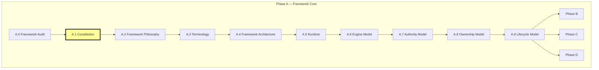
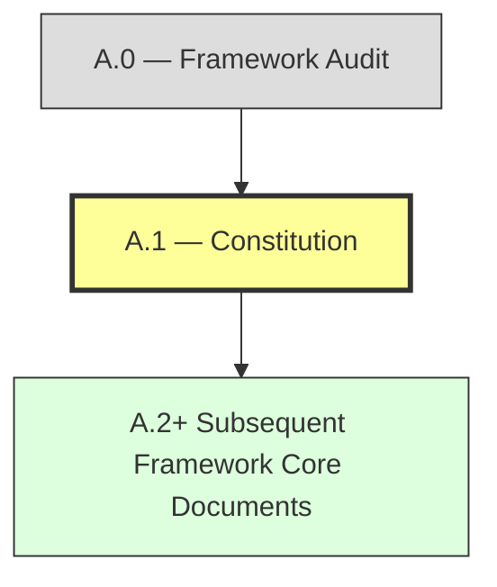
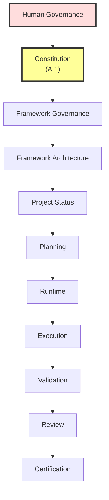
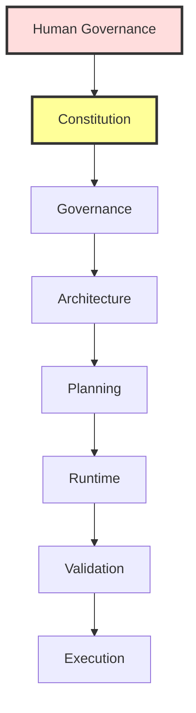
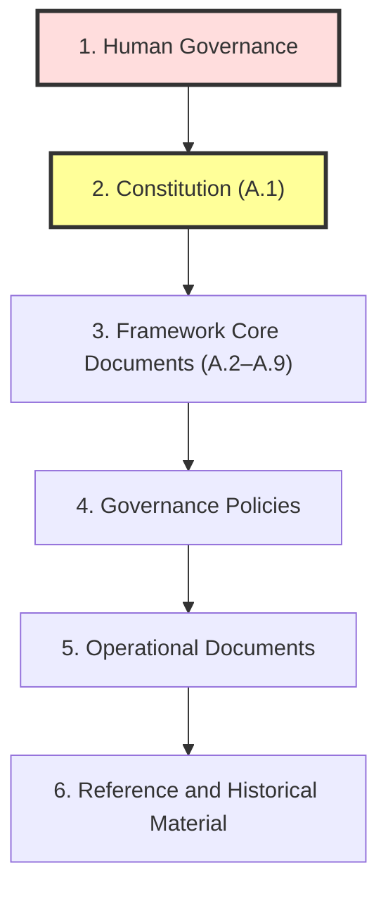
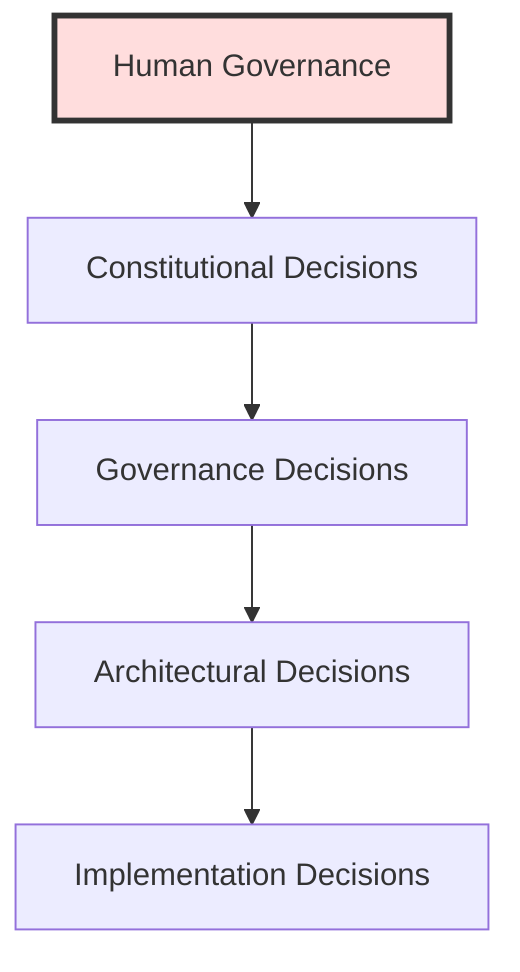
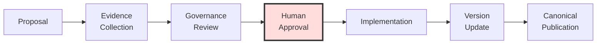
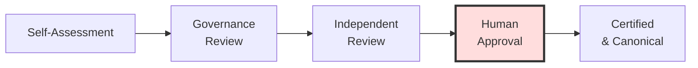
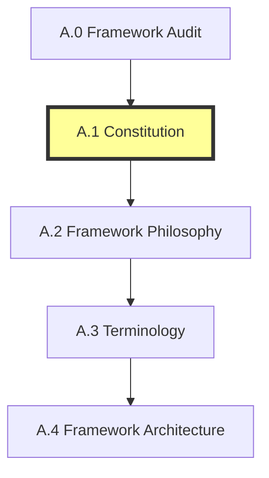

# A.1 — Constitution

> **AI-DOS v3 · Constitutional Architecture Specification**
> Phase A — Framework Core · Stage A.1

---

## Document Metadata

| Field | Value |
|:---|:---|
| Identifier | `AI-DOS-ARCH-A.1` |
| Title | A.1 — Constitution |
| Version | 3.0.0-beta |
| Status | Draft |
| Canonical Status | Non-canonical until reviewed, approved, and promoted through Framework Governance |
| Classification | Framework Core |
| Document Type | Constitutional Architecture Specification |
| Owner | Framework Governance |
| Maintainers | Framework Architecture Team |
| Review Authority | Enterprise Documentation Standards Board |
| Approval Authority | Human Governance / Framework Governance |
| Created | 2026-07-04 |
| Last Updated | 2026-07-07 |
| Lifecycle Phase | Draft |
| Traceability ID | AI-DOS-ARCH-A.1 |
| Scope | v3 constitutional architecture candidate |
| Out of Scope | Canonical promotion, implementation, and project state updates |
| Normative Authority | Human Governance; `AGENTS.md`; `docs/AI/FrameworkGovernance.md` |
| Normative References | `docs/AI/Architecture/Standards/STD-010-Document-Metadata-Standard.md`; `docs/AI/Architecture/A.1-Constitution.md`; `docs/AI/Meta/M.0-Framework-Meta-Model.md`; `docs/AI/Architecture/Standards/STD-000-Framework-Standards.md` |
| Dependencies | Governance authority, artifact identity, lifecycle governance, traceability model, and applicable upstream v3 architecture documents |
| Consumes | A.0 audit findings and governance principles |
| Produces | Constitutional architecture specification |
| Related Specifications | M.0; M.1; STD-000; runtime RFC family |
| Supersedes | None |
| Superseded By | None |
| Promotion Requirements | Framework Governance review, approval, traceability validation, metadata validation, and explicit promotion |
| Certification Status | Not certified |

---

## Revision History

| Version | Date | Author | Description |
|:---|:---|:---|:---|
| 3.0.0-beta | 2026-07-04 | Framework Architecture Team | Publication-quality release. |
| 3.0.0-alpha | 2026-07-04 | Framework Architecture Team | Alpha release for review. |
| 2.0.0 | 2026-07-04 | Framework Architecture Team | Structural refinement and expanded principles. |
| 1.0.0 | 2026-07-04 | Framework Architecture Team | Initial draft. |

---

## Table of Contents

1. [Status](#1-status)
2. [Preamble](#2-preamble)
3. [Purpose](#3-purpose)
4. [Constitutional Authority](#4-constitutional-authority)
5. [Constitutional Scope](#5-constitutional-scope)
6. [Fundamental Principles](#6-fundamental-principles)
7. [Human Authority](#7-human-authority)
8. [Framework Authority](#8-framework-authority)
9. [Source of Truth](#9-source-of-truth)
10. [Constitutional Invariants](#10-constitutional-invariants)
11. [Governance Principles](#11-governance-principles)
12. [Decision Principles](#12-decision-principles)
13. [Evidence Principles](#13-evidence-principles)
14. [Architectural Principles](#14-architectural-principles)
15. [Evolution Principles](#15-evolution-principles)
16. [Compliance](#16-compliance)
17. [Constitutional Violations](#17-constitutional-violations)
18. [Amendment Process](#18-amendment-process)
19. [Certification](#19-certification)
20. [Next Document](#20-next-document)
- [References](#references)
- [Appendices](#appendices)

---

## 1. Status

### Document Information

| Property | Value |
|:---|:---|
| **Document** | A.1 — Constitution |
| **Identifier** | `AI-DOS-ARCH-A.1` |
| **Version** | 3.0.0-beta |
| **Status** | Draft |
| **Type** | Constitutional Architecture Specification |
| **Classification** | Framework Core |
| **Authority** | [A.0 — Framework Audit](./A.0-Framework-Audit.md), Human Governance |
| **Owner** |AI-DOS Framework |
| **Maintainers** | Framework Architecture Team |
| **Phase** | Phase A — Framework Core |
| **Stage** | A.1 — Constitution |
| **Created** | 2026-07-04 |
| **Last Updated** | 2026-07-04 |

### Constitutional Position

The Constitution is the first authoritative Framework Core document produced after [A.0 — Framework Audit](./A.0-Framework-Audit.md).

It transforms the verified architectural baseline of A.0 into permanent constitutional principles, governance boundaries, authority rules, and non-negotiable invariants forAI-DOS v3.

The Constitution does not implement runtime behavior, define platform adapters, introduce commands, or replace future architecture documents. It establishes the constitutional foundation that all subsequentAI-DOS v3 Framework Core documents must consume.

### Framework Roadmap Position

*Figure 1: Framework Roadmap Position. The current document (A.1) is highlighted.*

### Document Classification

This document is classified as a **Constitutional Architecture Specification**.

Unlike an audit, roadmap, runtime specification, or implementation plan, the Constitution defines permanent rules and governing principles. It exists to protect:

- Architectural integrity
- Human authority
- Evidence-driven development
- Explicit ownership
- Platform independence

These protections apply across the fullAI-DOS lifecycle.

### Authority Relationship

*Figure 2: Authority Relationship. The Constitution consumes A.0 findings and becomes the governing constitutional authority for all subsequent Framework Core documents.*

### Status Rules

While this document is in Draft status:

- Constitutional rules may be refined.
- Terminology may be normalized.
- Authority boundaries may be clarified.
- Governance approval is still required before certification.

After approval, constitutional principles become stable Framework Core rules and may only change through the approved [Amendment Process](#18-amendment-process).

### Completion Statement

The Status section is complete when the document identity, architectural position, classification, authority relationship, and lifecycle status are explicitly defined. The Status section becomes the canonical identity record for A.1 — Constitution.

---

## 2. Preamble

### Purpose

The Constitution is the highest governing document of theAI-DOS Framework Core.

It establishes the permanent constitutional principles that define:

- How the Framework shall evolve.
- How architectural decisions shall be governed.
- How human authority, evidence, ownership, and architectural integrity shall be preserved.

Unlike implementation specifications, the Constitution does not define runtime behavior, commands, workflows, engines, or platform-specific details. Its role is to define the immutable constitutional foundation upon which every subsequent Framework Core document is built.

### Constitutional Intent

AI-DOS is an AI Development Operating System (AI-DOS).

Its mission is to enable trustworthy, evidence-driven, and human-governed AI-assisted software engineering through a coherent constitutional architecture.

The Constitution exists to ensure that this mission remains stable across future Framework versions.

### Constitutional Commitments

| Commitment | Description |
|:---|:---|
| **Human Authority** | Human authority over AI-generated decisions. |
| **Evidence-Driven Evolution** | Evidence-driven architectural evolution. |
| **Explicit Ownership** | Explicit ownership and accountability. |
| **Single Source of Truth** | One canonical source of truth for every architectural concept. |
| **Transparent Governance** | Transparent governance and traceable decision-making. |
| **Long-Term Maintainability** | Long-term maintainability over short-term convenience. |

### Scope

This Constitution governs every Framework Core document beginning with A.1 and extending to all Runtime, Engine, Governance, Planning, Validation, Agent, Swarm, and Platform specifications.

Project-specific implementations may extend the Framework but shall not contradict constitutional principles.

### Completion Statement

The Preamble is complete when the constitutional purpose, intent, commitments, and governing scope of theAI-DOS Framework have been explicitly established.

---

## 3. Purpose

### Overview

The Constitution defines the permanent constitutional foundation of theAI-DOS Framework.

Its purpose is to establish immutable principles, governance boundaries, and decision rules that remain stable regardless of future implementation, technology, runtime, or platform changes.

The Constitution is intentionally technology-neutral and implementation-independent.

### Primary Purpose

The Constitution shall:

- Define the constitutional identity of the Framework.
- Protect architectural integrity.
- Preserve human authority.
- Establish constitutional governance.
- Provide the highest non-human architectural authority.
- Define permanent Framework invariants.
- Govern the evolution of the Framework Core.

### Architectural Purpose

The Constitution provides the foundation for:

- [Framework Philosophy](#20-next-document) (A.2)
- [Terminology](#references) (A.3)
- [Framework Architecture](#references) (A.4)
- [Runtime](#references) (A.5)
- [Engine Model](#references) (A.6)
- [Authority Model](#references) (A.7)
- [Ownership Model](#references) (A.8)
- [Lifecycle Model](#references) (A.9)

No Framework Core document shall contradict constitutional principles.

### Governance Purpose

The Constitution ensures that:

- Governance remains consistent.
- Architectural decisions remain traceable.
- Human approval remains mandatory where required.
- Constitutional rules cannot be bypassed by implementation decisions.

### Long-Term Purpose

The Constitution is intended to remain stable across multiple major Framework versions.

While architecture, runtime models, engines, workflows, and platform integrations may evolve, constitutional principles should change only through the formal [Amendment Process](#18-amendment-process).

### Success Criteria

The Constitution fulfills its purpose when:

- Every Framework Core document derives its governing principles from this document.
- Constitutional authority is universally recognized.
- Architectural consistency is preserved over time.
- Framework evolution remains governed rather than ad hoc.

### Completion Statement

The Purpose section is complete when the constitutional mission, architectural role, governance role, long-term intent, and measurable success criteria have been explicitly defined.

---

## 4. Constitutional Authority

### Overview

Constitutional Authority defines the highest non-human authority within theAI-DOS Framework. It establishes the permanent decision hierarchy governing every Framework Core document, architectural model, runtime capability, and future evolution of the Framework.

No architectural authority may exist outside this hierarchy unless explicitly approved by Human Governance.

### Constitutional Principle

Human Governance is the ultimate authority. The Constitution is the highest governing document produced by the Framework.

All remaining architectural authorities derive their legitimacy from the Constitution.

### Authority Hierarchy

*Figure 3: Constitutional Authority Hierarchy. Authority flows downward; lower authorities shall never override higher authorities.*

### Constitutional Rules

The following rules are immutable unless amended through the [constitutional amendment process](#18-amendment-process):

| Rule | Description |
|:---|:---|
| **Human Governance** | Human Governance shall remain the final authority. |
| **Constitutional Role** | The Constitution shall define constitutional principles but not implementation. |
| **Governance Role** | Governance shall interpret and enforce constitutional rules. |
| **Architecture Role** | Architecture shall implement constitutional intent. |
| **Runtime Role** | Runtime shall execute architecture without redefining it. |
| **Authority Direction** | Lower authorities shall never override higher authorities. |
| **Boundary Discipline** | Every authority shall operate within explicitly documented boundaries. |

### Authority Boundaries

Constitutional Authority governs:

- Constitutional principles
- Governance boundaries
- Sources of authority
- Decision precedence
- Constitutional invariants
- Amendment eligibility

It does not govern implementation details, platform behavior, or project-specific decisions.

### Conflict Resolution

When two authorities appear to conflict:

1. Human Governance prevails.
2. The Constitution prevails over all Framework documents.
3. Governance resolves constitutional interpretation.
4. Lower-level documents shall be revised to restore constitutional compliance.

### Success Criteria

This section is complete when:

- The constitutional authority chain is unambiguous.
- Decision precedence is explicitly defined.
- Authority boundaries are documented.
- Conflict resolution rules are established.

### Completion Statement

The Constitutional Authority section establishes the permanent authority hierarchy of theAI-DOS Framework and becomes the governing reference for every subsequent Framework Core document.

---

## 5. Constitutional Scope

### Overview

The Constitutional Scope defines the boundaries of constitutional governance within theAI-DOS Framework. It specifies what the Constitution governs, what it influences, and what remains outside its authority. Clear constitutional boundaries prevent overlap between the Constitution and subsequent Framework Core documents.

### Scope Objectives

The Constitutional Scope shall:

- Define the constitutional domain.
- Prevent authority overlap.
- Establish document boundaries.
- Clarify constitutional applicability.
- Protect the separation between principles and implementation.

### In Scope

The Constitution governs:

- Fundamental Framework principles
- Human authority
- Constitutional authority
- Governance principles
- Source of Truth
- Constitutional invariants
- Decision principles
- Evidence principles
- Amendment rules
- Compliance expectations
- Constitutional violations

These subjects are normative and binding for every Framework Core document.

### Out of Scope

The Constitution does not define:

- Runtime implementation
- Engine implementation
- Command behavior
- Workflow execution
- Platform adapters
- Programming languages
- Project-specific architecture
- Product features
- Deployment strategies

These responsibilities belong to dedicated Framework Core specifications.

### Applicability

The Constitution applies to:

- Framework Core
- Official Framework documentation
- Governance processes
- Runtime architecture
- Planning and validation models
- Agent and Swarm architecture
- Official platform integrations

Projects built onAI-DOS inherit these principles unless explicitly exempted by Human Governance.

### Boundary Rules

| Rule | Description |
|:---|:---|
| **Principles vs. Implementation** | The Constitution defines principles, not implementation. |
| **Refinement** | Lower-level documents shall refine constitutional intent without contradicting it. |
| **Terminology** | No document may redefine constitutional terminology or authority. |
| **Amendment** | Constitutional scope may change only through the formal [Amendment Process](#18-amendment-process). |

### Success Criteria

This section is complete when constitutional responsibilities, exclusions, applicability, and boundary rules are explicitly defined.

### Completion Statement

The Constitutional Scope establishes the governing boundaries of the Constitution and defines where constitutional authority begins and ends within theAI-DOS Framework.

---

## 6. Fundamental Principles

### Overview

The Fundamental Principles define the immutable constitutional values of theAI-DOS Framework. They establish the philosophical and architectural foundation upon which every Framework Core document, runtime component, governance rule, and implementation decision shall be based.

Unless amended through the [constitutional amendment process](#18-amendment-process), these principles are permanent.

### Constitutional Principles

| Principle | Description |
|:---|:---|
| **Human Authority** | Human Governance is the final decision-making authority. Artificial intelligence assists decision-making but never replaces accountable human judgment. |
| **Evidence Before Assumption** | Architectural decisions shall be supported by verifiable evidence rather than intuition, preference, or undocumented assumptions. |
| **Single Source of Truth** | Every architectural concept shall have one canonical definition and one authoritative owner. |
| **Explicit Ownership** | Every constitutional rule, document, capability, engine, and subsystem shall have clearly defined ownership. |
| **Architectural Integrity** | The Framework shall preserve clear architectural boundaries, approved dependency direction, and separation of concerns. |
| **Governance Before Implementation** | Governance establishes the rules. Architecture interprets those rules. Runtime and implementations execute them. |
| **Traceability** | Every significant architectural decision shall remain traceable to constitutional principles, governance decisions, and supporting evidence. |
| **Evolution Without Drift** | The Framework shall evolve through controlled governance and constitutional amendments rather than ad hoc changes. |
| **Platform Independence** | Constitutional principles remain independent of programming languages, platforms, vendors, and implementation technologies. |
| **Long-Term Sustainability** | Long-term maintainability, clarity, and consistency take precedence over short-term convenience. |

### Constitutional Invariants

The following shall always remain true unless formally amended:

- Human Governance remains supreme.
- Constitutional principles cannot be bypassed.
- Every canonical concept has a single source of truth.
- Framework evolution remains governed.
- Architectural integrity shall be preserved.

### Success Criteria

This section is complete when the permanent constitutional principles and immutable Framework invariants have been explicitly defined.

### Completion Statement

The Fundamental Principles establish the permanent constitutional values of theAI-DOS Framework and provide the normative foundation for every subsequent Framework Core specification.

---

## 7. Human Authority

### Overview

Human Authority is the highest constitutional principle within theAI-DOS Framework.

Artificial intelligence exists to assist, accelerate, and improve engineering activities, but it shall never replace accountable human judgment. Every constitutional rule, governance process, and architectural decision derives its ultimate legitimacy from Human Governance.

### Constitutional Statement

Human Governance shall remain the supreme authority over every Framework activity.

No AI model, automation, runtime, engine, agent, swarm, workflow, or platform adapter may supersede or bypass accountable human decision-making.

### Responsibilities of Human Governance

Human Governance is responsible for:

- Constitutional approval
- Governance approval
- Architectural direction
- Final conflict resolution
- Constitutional amendments
- Acceptance of Framework Core changes
- Certification of constitutional compliance

### Delegation

Human Governance may delegate execution to:

- Governance processes
- Runtime systems
- AI agents
- Swarm coordination
- Automation

Delegation transfers execution only. It never transfers constitutional accountability.

### Prohibited Actions

No Framework component shall:

- Override a human decision.
- Approve constitutional amendments autonomously.
- Create constitutional authority.
- Circumvent governance approval.
- Redefine constitutional principles.

### Human Override

Every automated process shall support human review and, where applicable, human override.

Constitutional conflicts shall always be escalated to Human Governance.

### Success Criteria

This section is complete when the supremacy of Human Governance, delegation boundaries, prohibited actions, and override requirements have been explicitly defined.

### Completion Statement

The Human Authority section establishes the constitutional supremacy of accountable human governance and defines the permanent boundary between human authority and AI-assisted execution.

---

## 8. Framework Authority

### Overview

Framework Authority defines the constitutional authority exercised by theAI-DOS Framework after Human Governance. It establishes how constitutional authority flows through governance, architecture, planning, runtime, validation, and execution while preserving constitutional integrity.

### Constitutional Statement

Framework Authority derives exclusively from this Constitution.

No Framework document, subsystem, runtime component, agent, swarm, or implementation may create independent constitutional authority.

### Authority Chain

*Figure 4: Framework Authority Chain. Each level inherits authority from the level above and remains accountable to it.*

### Responsibilities

Framework Authority is responsible for:

- Interpreting constitutional principles.
- Maintaining architectural consistency.
- Governing Framework evolution.
- Protecting canonical documentation.
- Enforcing dependency direction.
- Ensuring compliance across Framework Core.

### Authority Constraints

Framework Authority shall not:

- Supersede Human Governance.
- Redefine constitutional principles.
- Bypass constitutional amendment procedures.
- Create undocumented authority chains.

### Constitutional Relationships

Framework Authority governs the Framework Core.

Project-specific authorities may extend the Framework but shall remain subordinate to constitutional authority unless an explicit governance exception exists.

### Success Criteria

This section is complete when the Framework authority chain, responsibilities, constraints, and constitutional relationships are explicitly defined.

### Completion Statement

The Framework Authority section establishes the constitutional authority exercised throughout theAI-DOS Framework and defines the lawful chain through which every Framework decision derives its legitimacy.

---

## 9. Source of Truth

### Overview

The Source of Truth defines how architectural truth is established, maintained, and consumed throughout theAI-DOS Framework. Every constitutional principle, architectural rule, governance policy, and runtime contract shall have exactly one canonical source of truth.

### Constitutional Statement

There shall be one — and only one — canonical source of truth for every constitutional concept.

Derived documents may interpret or refine constitutional intent, but they shall never replace or contradict the canonical source.

### Canonical Source Hierarchy

*Figure 5: Canonical Source Hierarchy. Higher levels take precedence over lower levels in the event of conflict.*

### Canonical Truth Rules

| Rule | Description |
|:---|:---|
| **Single Definition** | Every architectural concept shall have a single canonical definition. |
| **Single Owner** | Every canonical definition shall have one authoritative owner. |
| **Reference, Don't Duplicate** | Derived documents shall reference, not duplicate, constitutional truth. |
| **Preserve Canonical Truth** | Historical and reference documents shall never redefine canonical truth. |
| **Violation** | Conflicting definitions constitute constitutional violations. |

### Derived Knowledge

The following may derive from canonical truth:

- Planning documents
- Runtime specifications
- Engine models
- Workflow definitions
- Commands
- Templates
- Project documentation

Derived artifacts shall preserve traceability to their canonical source.

### Conflict Resolution

If multiple sources define the same concept:

1. Human Governance prevails.
2. The Constitution prevails over all Framework documents.
3. Canonical Framework Core documents prevail over derived documents.
4. Historical and reference materials are non-authoritative.

### Success Criteria

This section is complete when canonical truth, ownership, derivation rules, and conflict resolution have been explicitly defined.

### Completion Statement

The Source of Truth section establishes the constitutional model for defining, protecting, and consuming canonical architectural truth throughout theAI-DOS Framework.

---

## 10. Constitutional Invariants

### Overview

Constitutional Invariants are permanent rules that define the non-negotiable characteristics of theAI-DOS Framework. These invariants protect the identity, integrity, and continuity of the Framework. They may only be changed through the formal [Amendment Process](#18-amendment-process).

### Constitutional Statement

Every Framework Core document, governance decision, runtime capability, and implementation shall preserve the Constitutional Invariants defined in this Constitution.

Violation of an invariant constitutes a constitutional violation as defined in [Section 17 — Constitutional Violations](#17-constitutional-violations).

### Core Invariants

| Invariant | Description |
|:---|:---|
| **Human Supremacy** | Human Governance remains the ultimate authority. |
| **Constitutional Authority** | The Constitution is the highest non-human governing document. |
| **Single Source of Truth** | Every canonical concept has exactly one authoritative definition. |
| **Explicit Ownership** | Every constitutional responsibility has one accountable owner. |
| **Evidence-Based Decisions** | Architectural decisions shall be supported by verifiable evidence. |
| **Architectural Integrity** | Approved architectural boundaries and dependency direction shall be preserved. |
| **Governance Before Implementation** | Implementation shall never redefine constitutional or governance rules. |
| **Traceability** | Significant architectural decisions shall remain traceable. |
| **Controlled Evolution** | Framework evolution shall occur only through governed processes. |
| **Technology Neutrality** | Constitutional principles shall remain independent of implementation technology. |

### Enforcement

Constitutional Invariants shall be verified during:

- Architecture reviews
- Governance reviews
- Validation
- Certification
- Major Framework revisions

### Exceptions

No exception may invalidate a Constitutional Invariant.

Temporary operational exceptions may be granted only by Human Governance and shall never establish constitutional precedent.

### Success Criteria

This section is complete when every permanent constitutional invariant, enforcement mechanism, and exception rule has been explicitly documented.

### Completion Statement

The Constitutional Invariants section establishes the immutable constitutional rules that preserve the long-term identity and integrity of theAI-DOS Framework.

---

## 11. Governance Principles

### Overview

Governance Principles define how the constitutional values of theAI-DOS Framework are interpreted, applied, and enforced throughout the Framework lifecycle. They ensure that every architectural, operational, and strategic decision remains aligned with the Constitution.

### Constitutional Statement

Governance exists to preserve, interpret, and enforce the Constitution.

Governance shall never replace constitutional authority, but shall operate as its steward.

### Core Governance Principles

| Principle | Description |
|:---|:---|
| **Constitutional Compliance** | All Framework activities shall comply with the Constitution. |
| **Accountability** | Every governance decision shall have an accountable owner. |
| **Transparency** | Governance decisions shall be documented and traceable. |
| **Evidence-Based Governance** | Governance decisions shall rely on verifiable evidence. |
| **Consistency** | Governance shall apply constitutional principles consistently across all Framework domains. |
| **Proportionality** | Governance actions shall be appropriate to the architectural impact of the decision. |
| **Continuous Improvement** | Governance processes shall evolve through approved constitutional mechanisms. |

### Governance Responsibilities

Governance is responsible for:

- Interpreting constitutional principles.
- Approving architectural policy.
- Resolving constitutional conflicts.
- Ensuring Framework compliance.
- Overseeing controlled evolution.

### Governance Constraints

Governance shall not:

- Contradict the Constitution.
- Redefine constitutional authority.
- Bypass Human Governance where required.
- Establish undocumented governance processes.

### Success Criteria

This section is complete when governance principles, responsibilities, constraints, and constitutional relationships have been explicitly defined.

### Completion Statement

The Governance Principles section establishes the constitutional governance model that guides every Framework Core activity while preserving constitutional authority and architectural integrity.

---

## 12. Decision Principles

### Overview

Decision Principles define the constitutional rules governing how decisions are made throughout theAI-DOS Framework. These principles ensure that every strategic, architectural, governance, and operational decision is lawful, transparent, evidence-driven, and traceable.

### Constitutional Statement

Every Framework decision shall be consistent with the Constitution.

No decision may override, contradict, or weaken constitutional authority without following the formal [Amendment Process](#18-amendment-process).

### Core Decision Principles

| Principle | Description |
|:---|:---|
| **Constitution First** | All decisions shall conform to constitutional principles before considering architectural, operational, or implementation concerns. |
| **Evidence Before Decision** | Significant decisions shall be supported by verifiable evidence, documented analysis, and explicit rationale. |
| **Accountability** | Every decision shall have a clearly identified decision owner responsible for its outcome. |
| **Traceability** | Every significant decision shall be recorded and remain traceable to its constitutional basis, supporting evidence, and governance approval. |
| **Transparency** | Decision criteria, assumptions, risks, and consequences shall be documented whenever practical. |
| **Consistency** | Comparable situations shall be evaluated using consistent constitutional and governance principles. |
| **Reversibility** | Where feasible, decisions should support controlled rollback or revision through approved governance mechanisms. |

### Decision Hierarchy

*Figure 6: Decision Hierarchy. Lower-level decisions shall never invalidate higher-level decisions.*

### Decision Constraints

Framework decisions shall not:

- Contradict constitutional principles.
- Bypass Human Governance where required.
- Create undocumented authority.
- Establish multiple canonical truths.
- Violate approved governance policies.

### Success Criteria

This section is complete when decision principles, hierarchy, ownership expectations, constraints, and constitutional alignment have been explicitly defined.

### Completion Statement

The Decision Principles section establishes the constitutional framework through which all significant Framework decisions shall be evaluated, approved, documented, and governed.

---

## 13. Evidence Principles

### Overview

Evidence Principles establish the constitutional requirements for collecting, evaluating, preserving, and referencing evidence throughout theAI-DOS Framework. Evidence is the constitutional foundation for governance, architectural decisions, validation, certification, and continuous Framework evolution.

No significant Framework decision shall rely solely on opinion, preference, or undocumented assumptions.

### Constitutional Statement

Every significant architectural, governance, planning, runtime, validation, review, and certification decision shall be supported by sufficient, verifiable, and traceable evidence.

Evidence shall be treated as a first-class constitutional asset.

### Core Evidence Principles

| Principle | Description |
|:---|:---|
| **Verifiability** | Evidence shall be independently verifiable using documented sources or reproducible observations. |
| **Traceability** | Every evidence item shall reference the decision, artifact, requirement, or architectural concept it supports. |
| **Authenticity** | Evidence shall accurately represent the observed state without intentional alteration or misrepresentation. |
| **Completeness** | Evidence shall be sufficient to justify the associated architectural or governance decision. |
| **Reproducibility** | Where practical, independent reviewers shall be able to reproduce the supporting evidence. |
| **Preservation** | Evidence supporting constitutional and architectural decisions shall be retained according to Framework governance policies. |
| **Transparency** | Evidence sources, limitations, assumptions, and uncertainties shall be documented whenever materially relevant. |

### Evidence Categories

Evidence may include:

- Architectural analysis
- Audit findings
- Validation reports
- Test results
- Design reviews
- Architecture Decision Records (ADR)
- Governance approvals
- Certification reports
- Runtime observations
- Performance measurements

### Evidence Constraints

Evidence shall not:

- Be fabricated.
- Be selectively presented to mislead.
- Replace constitutional authority.
- Contradict verified canonical truth without governance review.

### Success Criteria

This section is complete when evidence principles, quality expectations, categories, constraints, and constitutional responsibilities have been explicitly defined.

### Completion Statement

The Evidence Principles section establishes the constitutional foundation for evidence-driven governance and ensures that Framework evolution remains transparent, accountable, and objectively justified.

---

## 14. Architectural Principles

### Overview

Architectural Principles establish the constitutional design rules that govern every architectural decision within theAI-DOS Framework. These principles ensure that the Framework remains modular, maintainable, scalable, technology-neutral, and constitutionally compliant throughout its evolution.

### Constitutional Statement

Every Framework Core specification, runtime component, engine, workflow, and implementation shall conform to these Architectural Principles.

No architectural design may intentionally violate these principles without an approved constitutional amendment or governance exception.

### Core Architectural Principles

| Principle | Description |
|:---|:---|
| **Separation of Concerns** | Every subsystem shall have a clearly defined responsibility and shall avoid overlapping concerns. |
| **Explicit Ownership** | Every architectural capability, component, document, and interface shall have one accountable owner. |
| **Directed Dependencies** | Dependencies shall flow only in approved architectural directions and shall avoid cyclic relationships. |
| **Modularity** | The Framework shall be composed of cohesive, loosely coupled modules with well-defined interfaces. |
| **Canonical Architecture** | Architectural truth shall originate from canonical Framework Core documents and shall never be duplicated. |
| **Technology Neutrality** | Architectural principles shall remain independent of programming language, platform, vendor, or implementation framework. |
| **Extensibility** | The Framework shall support controlled extension without compromising constitutional integrity. |
| **Traceability** | Architectural decisions shall remain traceable to constitutional principles, governance decisions, and supporting evidence. |
| **Consistency** | Comparable architectural problems shall be solved using consistent principles and patterns. |
| **Evolution Through Governance** | Architectural evolution shall occur through governed processes rather than uncontrolled implementation changes. |

### Architectural Constraints

Architectural designs shall not:

- Violate constitutional invariants.
- Redefine governance responsibilities.
- Introduce undocumented authority.
- Create conflicting canonical definitions.
- Bypass approved dependency rules.

### Success Criteria

This section is complete when architectural principles, constraints, and constitutional expectations have been explicitly defined and aligned with the Framework Constitution.

### Completion Statement

The Architectural Principles section establishes the constitutional design philosophy of theAI-DOS Framework and provides the normative foundation for all subsequent architecture specifications.

---

## 15. Evolution Principles

### Overview

Evolution Principles establish the constitutional rules governing how theAI-DOS Framework may evolve over time. These principles ensure that Framework evolution remains deliberate, evidence-driven, constitutionally compliant, and free from uncontrolled architectural drift.

Evolution is a governed process rather than an accumulation of implementation changes.

### Constitutional Statement

TheAI-DOS Framework shall evolve through constitutional governance, documented evidence, and controlled architectural progression.

No Framework evolution shall compromise constitutional principles, architectural integrity, or canonical truth.

### Core Evolution Principles

| Principle | Description |
|:---|:---|
| **Constitution Before Change** | Every significant change shall be evaluated against the Constitution before implementation begins. |
| **Evidence-Driven Evolution** | Framework evolution shall be supported by documented evidence, architectural analysis, and governance review. |
| **Controlled Change** | Changes shall follow approved governance workflows and shall not bypass constitutional processes. |
| **Backward Compatibility** | Where reasonably practical, Framework evolution should preserve compatibility with approved canonical artifacts or provide documented migration guidance. |
| **Incremental Progress** | The Framework should evolve through small, verifiable, and reviewable increments rather than uncontrolled redesign. |
| **Architectural Integrity** | Evolution shall strengthen, rather than weaken, modularity, ownership, dependency direction, and constitutional compliance. |
| **Continuous Improvement** | Framework evolution is continuous, but every improvement shall remain constitutionally governed. |

### Evolution Constraints

Framework evolution shall not:

- Violate [Constitutional Invariants](#10-constitutional-invariants).
- Introduce conflicting canonical definitions.
- Create undocumented authority.
- Bypass governance approval.
- Sacrifice long-term maintainability for short-term convenience.

### Success Criteria

This section is complete when constitutional evolution principles, governance expectations, architectural safeguards, and evolution constraints have been explicitly defined.

### Completion Statement

The Evolution Principles section establishes the constitutional framework for sustainable, governed, and evidence-driven evolution of theAI-DOS Framework while preserving its long-term architectural integrity.

---

## 16. Compliance

### Overview

Compliance defines the constitutional expectations that every Framework Core document, governance activity, runtime capability, engine, and implementation shall satisfy. Compliance ensures that theAI-DOS Framework remains aligned with constitutional principles throughout its lifecycle.

### Constitutional Statement

Every Framework artifact shall demonstrate constitutional compliance before it is accepted as canonical.

Compliance shall be evaluated objectively using documented criteria and supporting evidence.

### Compliance Principles

| Principle | Description |
|:---|:---|
| **Constitutional Alignment** | All Framework artifacts shall conform to the Constitution. |
| **Evidence-Based Verification** | Compliance shall be demonstrated through verifiable evidence. |
| **Continuous Compliance** | Compliance is maintained throughout the lifecycle, not verified only once. |
| **Traceability** | Compliance findings shall be traceable to constitutional principles and supporting evidence. |
| **Accountability** | Every compliance assessment shall have an accountable reviewer or governing authority. |

### Compliance Scope

Compliance applies to:

- Framework Core documents
- Governance policies
- Runtime specifications
- Engine models
- Validation and certification processes
- Agent and Swarm specifications
- Official platform integrations

### Non-Compliance

Non-compliance shall:

- Be documented.
- Include impact assessment.
- Identify corrective actions.
- Be resolved through approved governance processes.

No unresolved constitutional violation shall be promoted to canonical status.

### Success Criteria

This section is complete when compliance principles, scope, assessment expectations, and non-compliance handling have been explicitly defined.

### Completion Statement

The Compliance section establishes the constitutional requirements for demonstrating, maintaining, and governing compliance across theAI-DOS Framework.

---

## 17. Constitutional Violations

### Overview

Constitutional Violations define actions, decisions, artifacts, or behaviors that conflict with the constitutional principles of theAI-DOS Framework. Their purpose is to preserve constitutional integrity by ensuring that violations are identified, documented, governed, and resolved through approved processes.

### Constitutional Statement

Any activity that contradicts the Constitution shall be treated as a Constitutional Violation.

No constitutional violation may become part of the canonical Framework without formal resolution through Human Governance.

### Categories of Violations

#### Critical Violations

- Overriding Human Governance
- Contradicting the Constitution
- Creating multiple canonical sources of truth
- Bypassing constitutional amendment procedures

#### Major Violations

- Breaking approved dependency direction
- Violating explicit ownership
- Ignoring governance approval
- Introducing undocumented authority

#### Minor Violations

- Inconsistent terminology
- Incomplete traceability
- Missing supporting evidence
- Documentation inconsistencies

### Handling Principles

Every Constitutional Violation shall:

- Be identified.
- Be documented.
- Include an impact assessment.
- Define corrective actions.
- Be tracked until resolution.

### Resolution Authority

Resolution authority follows the constitutional hierarchy as defined in [Section 4 — Constitutional Authority](#4-constitutional-authority):

**Human Governance → Constitution → Governance → Architecture → Implementation**

Only Human Governance may authorize exceptions affecting constitutional principles.

### Success Criteria

This section is complete when violation categories, handling rules, escalation authority, and resolution expectations have been explicitly defined.

### Completion Statement

The Constitutional Violations section establishes the constitutional mechanism for identifying, governing, escalating, and resolving violations while preserving the long-term integrity of theAI-DOS Framework.

---

## 18. Amendment Process

### Overview

The Amendment Process defines the only lawful mechanism for modifying theAI-DOS Constitution. Its purpose is to preserve constitutional stability while allowing carefully governed evolution when justified by evidence and approved through Human Governance.

No constitutional provision may be changed outside this process.

### Constitutional Statement

Every constitutional amendment shall be deliberate, evidence-driven, transparent, traceable, and formally approved.

No amendment shall weaken Human Authority, Constitutional Authority, or the [Constitutional Invariants](#10-constitutional-invariants) unless explicitly authorized through the highest level of governance.

### Amendment Principles

| Principle | Description |
|:---|:---|
| **Constitution First** | Every proposed amendment shall be evaluated against the purpose and intent of the Constitution. |
| **Evidence Required** | Each amendment proposal shall include documented rationale, supporting evidence, impact analysis, and expected outcomes. |
| **Governance Review** | Every amendment shall undergo constitutional and governance review before approval. |
| **Human Approval** | Only Human Governance may approve constitutional amendments. |
| **Traceability** | Every amendment shall maintain a permanent historical record including version, rationale, approvals, and affected sections. |

### Amendment Lifecycle

*Figure 7: Amendment Lifecycle. Only Human Governance may approve the transition from Governance Review to Implementation.*

### Amendment Constraints

An amendment shall not:

- Bypass Human Governance.
- Remove constitutional traceability.
- Create conflicting constitutional authority.
- Invalidate canonical history.
- Contradict immutable Constitutional Invariants unless explicitly approved as a constitutional revision.

### Versioning

Approved amendments shall:

- Increment the constitutional version.
- Update revision history.
- Identify affected sections.
- Preserve previous constitutional versions for audit purposes.

### Success Criteria

This section is complete when amendment principles, lifecycle, approval authority, versioning rules, and constitutional safeguards have been explicitly defined.

### Completion Statement

The Amendment Process establishes the exclusive constitutional mechanism through which theAI-DOS Constitution may evolve while preserving governance, traceability, and long-term constitutional integrity.

---

## 19. Certification

### Overview

Certification defines the constitutional process through which theAI-DOS Constitution is formally recognized as an approved Framework Core document. Certification confirms that the Constitution satisfies its constitutional objectives, governance requirements, and quality expectations before it becomes authoritative.

### Constitutional Statement

No Constitution shall become an authoritative Framework Core document until it has successfully completed the constitutional certification process.

Certification validates constitutional readiness; it does not redefine constitutional content.

### Certification Principles

| Principle | Description |
|:---|:---|
| **Constitutional Compliance** | The Constitution shall demonstrate full compliance with its own constitutional principles. |
| **Evidence-Based Certification** | Certification decisions shall be supported by documented evidence, review findings, and governance records. |
| **Independent Review** | Certification shall include an independent architectural and governance review before approval. |
| **Human Approval** | Final certification authority belongs exclusively to Human Governance. |
| **Permanent Record** | Certification outcomes, approvals, evidence, and version information shall be permanently recorded. |

### Certification Lifecycle

*Figure 8: Certification Lifecycle. Final certification authority belongs exclusively to Human Governance.*

### Certification Criteria

The Constitution shall:

- Define constitutional authority.
- Establish immutable principles.
- Preserve canonical truth.
- Provide governance boundaries.
- Define amendment procedures.
- Demonstrate internal consistency.
- Include sufficient supporting evidence.

### Certification Constraints

Certification shall not:

- Waive constitutional requirements.
- Bypass governance review.
- Omit supporting evidence.
- Authorize unresolved constitutional violations.

### Success Criteria

This section is complete when certification principles, lifecycle, approval authority, evaluation criteria, and constitutional constraints have been explicitly defined.

### Completion Statement

The Certification section establishes the constitutional approval process through which theAI-DOS Constitution becomes an authoritative and officially governed Framework Core document.

---

## 20. Next Document

### Overview

This section formally concludes the Constitution and establishes the constitutional handoff to the next Framework Core document. Its purpose is to ensure that every subsequent specification inherits the constitutional authority, principles, and constraints established by this document.

The Constitution remains the governing authority after publication.

### Successor Document

| Property | Value |
|:---|:---|
| **Identifier** | A.2 |
| **Title** | Framework Philosophy |
| **Status** | Planned |
| **Role** | Defines the philosophical foundations, values, and design mindset that interpret and apply the constitutional principles established in A.1. |

### Mandatory Constitutional Inputs

A.2 shall consume, at minimum:

- [Constitutional Authority](#4-constitutional-authority)
- [Constitutional Scope](#5-constitutional-scope)
- [Fundamental Principles](#6-fundamental-principles)
- [Human Authority](#7-human-authority)
- [Framework Authority](#8-framework-authority)
- [Source of Truth](#9-source-of-truth)
- [Constitutional Invariants](#10-constitutional-invariants)
- [Governance Principles](#11-governance-principles)
- [Decision Principles](#12-decision-principles)
- [Evidence Principles](#13-evidence-principles)
- [Architectural Principles](#14-architectural-principles)
- [Evolution Principles](#15-evolution-principles)
- [Compliance](#16-compliance)
- [Constitutional Violations](#17-constitutional-violations)
- [Amendment Process](#18-amendment-process)
- [Certification](#19-certification)

No philosophical principle may contradict the Constitution.

### Handoff Rules

- The Constitution remains the highest non-human authority.
- A.2 interprets constitutional principles; it shall not redefine them.
- Every future Framework Core document shall reference the Constitution where constitutional authority is required.
- Constitutional conflicts shall be resolved before any successor document is approved.

### Transition Model

*Figure 9: Transition from Constitution to subsequent Framework Core documents.*

### Governance Requirements

Before A.2 begins:

- The Constitution shall complete certification.
- Constitutional authority shall be accepted through Human Governance.
- Revision history shall be established.
- The Constitution shall become the canonical governing document.

### Success Criteria

This section is complete when the successor document, constitutional handoff, mandatory inputs, transition model, and governance requirements have been explicitly defined.

### Completion Statement

The Next Document section formally closes the Constitution and authorizes the transition to A.2 — Framework Philosophy while preserving constitutional authority and continuity across theAI-DOS Framework Core.

---

## References

| Reference | Description |
|:---|:---|
| [A.0 — Framework Audit](./A.0-Framework-Audit.md) | The verified architectural baseline consumed by the Constitution. |
| A.2 — Framework Philosophy (Planned) | The successor document that interprets constitutional principles. |
| A.3 — Terminology (Planned) | The canonical definition of Framework terms. |
| A.4 — Framework Architecture (Planned) | The architectural model of theAI-DOS Framework. |
| A.5 — Runtime (Planned) | The runtime specification. |
| A.6 — Engine Model (Planned) | The engine model specification. |
| A.7 — Authority Model (Planned) | The authority model specification. |
| A.8 — Ownership Model (Planned) | The ownership model specification. |
| A.9 — Lifecycle Model (Planned) | The lifecycle model specification. |

---

## Appendices

### Appendix A: Constitutional Glossary

The full constitutional glossary is maintained as a standalone document: [Appendix A — Constitutional Glossary](./Appendix/A.1-Constitution-Appendix-A-Glossary.md).

It contains 48 constitutional terms across 10 categories, cross-referenced with the A.0 Terminology Glossary where applicable. Terms already canonicalized in A.0 are cross-referenced rather than redefined, preserving the single source of truth principle established in [Section 9 — Source of Truth](#9-source-of-truth).

### Appendix B: Constitutional Case Studies

The full constitutional case study collection is maintained as a standalone document: [Appendix B — Constitutional Case Studies](./Appendix/A.1-Constitution-Appendix-B-Constitutional-Case-Studies.md).

It contains 6 illustrative case studies derived from the Constitution's principles, violation categories, amendment procedures, and compliance expectations, demonstrating how constitutional governance applies in realistic architectural scenarios.

### Appendix C: Constitutional Decision Patterns

The full constitutional decision patterns is maintained as a standalone document: [Appendix C — Constitutional Decision Patterns](./Appendix/A.1-Constitution-Appendix-C-Constitutional-Decision-Patterns.md).

### Appendix D: Constitutional Compliance Matrix

The full constitutional compliance matrix is maintained as a standalone document: [Appendix D — Constitutional Compliance Matrix](./Appendix/A.1-Constitution-Appendix-D-Constitutional-Compliance-Matrix.md).

### Appendix E: Constitutional Anti-Patterns

The full constitutional anti-patterns is maintained as a standalone document: [Appendix E — Constitutional Anti-Patterns](./Appendix/A.1-Constitution-Appendix-E-Constitutional-Anti-Patterns.md).

### Appendix F: Amendment-Examples

The full amendment examples is maintained as a standalone document: [Appendix F — Amendment Examples](./Appendix/A.1-Constitution-Appendix-F-Amendment-Examples.md).

### Appendix G: Constitutional Compliance Checklist

The full constitutional Compliance checklist is maintained as a standalone document: [Appendix G — Constitutional Compliance Checklist](./Appendix/A.1-Constitution-Appendix-G-Constitutional-Compliance-Checklist.md).
