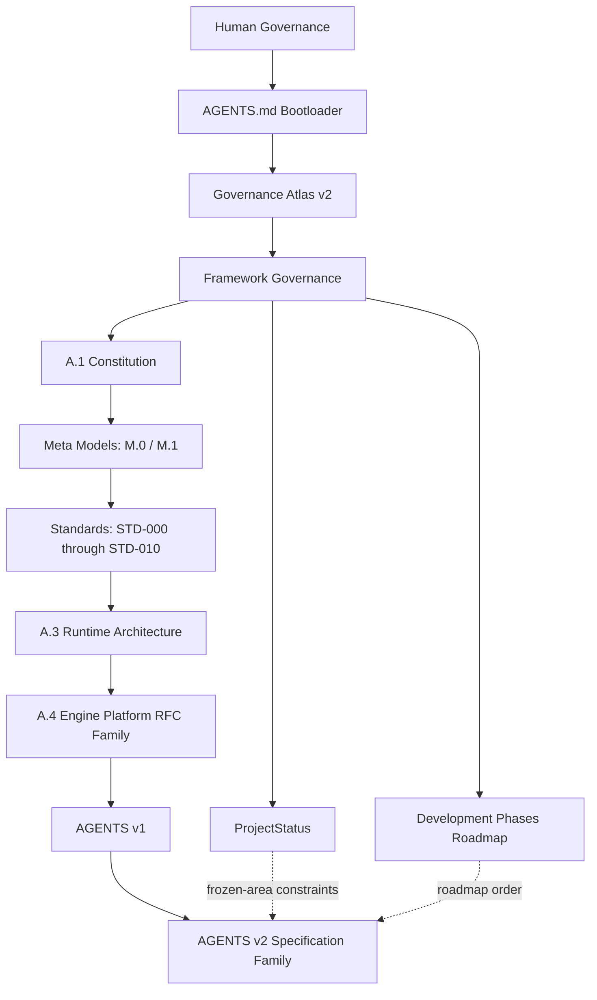
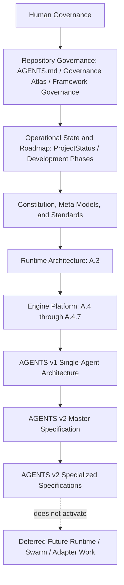
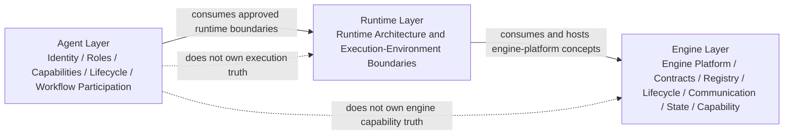
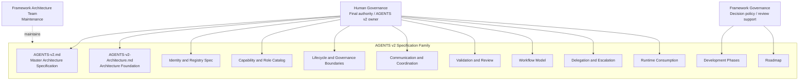

#AI-DOS — AGENTS v2 Master Architecture Specification

> AGENTS v2 Specification Family Entry Point · Draft / Non-canonical / Documentation-only

---

## Document Metadata

| Field | Value |
|:---|:---|
| Identifier | `AI-DOS.AGENTS.V2.MASTER-ARCHITECTURE` |
| Title |AI-DOS — AGENTS v2 Master Architecture Specification |
| Version | 0.1.0-draft |
| Status | Draft |
| Canonical Status | Non-canonical until reviewed, approved, and promoted through Human Governance / Framework Governance |
| Classification | Agent Architecture Master Specification |
| Document Type | Master Architecture Specification |
| Owner | Human Governance |
| Maintainers | Framework Architecture Team |
| Review Authority | Human Governance / Framework Governance |
| Approval Authority | Human Governance |
| Created | 2026-07-08 |
| Last Updated | 2026-07-08 |
| Lifecycle Phase | Draft |
| Traceability ID | `AI-DOS.ARCHITECTURE.AGENTS.V2.MASTER` |
| Scope | Documentation-only master entry point for the AGENTS v2 specification family, including architecture stack, authority consumption, specification ownership, agent/runtime/engine separation, roadmap summary, freeze readiness, forbidden content, deferred areas, and completion checklist. |
| Out of Scope | Implementation, runtime execution, APIs, storage, scheduling, queues, dispatch, routing, orchestration, CLI, UI, transport, messaging runtime, swarm runtime, platform adapters, Engine RFC continuation, Runtime redefinition, Engine Platform redefinition, Governance redefinition, Standards redefinition, M.0 redefinition, M.1 redefinition, STD-010 redefinition, ProjectStatus updates, certification, approval, or canonical promotion. |
| Normative Authority | Human Governance; `AGENTS.md`; `docs/AI/GOVERNANCE.md`; `docs/AI/FrameworkGovernance.md`; `docs/Projects/ForgeAI/Planning/ProjectStatus.md`; `docs/Projects/ForgeAI/Planning/DevelopmentPhases.md` |
| Normative References | `docs/AI/Architecture/A.1-Constitution.md`; `docs/AI/Meta/M.0-Framework-Meta-Model.md`; `docs/AI/Meta/M.1-Artifact-Meta-Model.md`; `docs/AI/Architecture/Standards/STD-000-Framework-Standards.md`; `docs/AI/Architecture/Standards/STD-001-Knowledge-Graph-Standard.md`; `docs/AI/Architecture/Standards/STD-002-Discovery-Standard.md`; `docs/AI/Architecture/Standards/STD-003-Terminology-Standard.md`; `docs/AI/Architecture/Standards/STD-010-Document-Metadata-Standard.md`; `docs/AI/Runtime/A.3-Runtime-Architecture-RFC.md`; Engine Platform RFC family; AGENTS v2 specification family |
| Dependencies | Repository bootloader; Governance Atlas v2; Framework Governance decision policy; ProjectStatus operational state and frozen-area constraints; Development Phases roadmap; A.1 Constitution; M.0; M.1; STD-000 through STD-010 where present; Runtime Architecture; Engine Platform RFC family; AGENTS v2 architecture, identity, capability, lifecycle, communication, validation, workflow, delegation, runtime-consumption, development-phase, and roadmap documents. |
| Consumes | Human task instruction; AGENTS v2 architecture foundation; AGENTS v2 identity and registry model; AGENTS v2 capability and role catalog; AGENTS v2 lifecycle and governance boundaries; AGENTS v2 communication and coordination model; AGENTS v2 validation and review model; AGENTS v2 workflow model; AGENTS v2 delegation and escalation model; AGENTS v2 runtime consumption model; AGENTS v2 development phases; AGENTS v2 roadmap; repository governance, constitutional, meta, standards, runtime, and engine-platform authorities. |
| Produces | AGENTS v2 master architecture entry point, specification-family coordination model, ownership map, authority hierarchy, architecture stack summary, agent/runtime/engine separation summary, roadmap summary, freeze-readiness criteria, forbidden-content guardrails, deferred-area list, and completion checklist. |
| Related Specifications | `docs/AI/Architecture/Agents/AGENTS-v1-draft.md`; `docs/AI/Architecture/Agents/AGENTS-v2-Architecture.md`; `docs/AI/Architecture/Agents/AGENTS-v2-Agent-Identity-and-Registry.md`; `docs/AI/Architecture/Agents/AGENTS-v2-Agent-Capability-and-Role-Catalog.md`; `docs/AI/Architecture/Agents/AGENTS-v2-Agent-Lifecycle-and-Governance-Boundaries.md`; `docs/AI/Architecture/Agents/AGENTS-v2-Agent-Communication-and-Coordination.md`; `docs/AI/Architecture/Agents/AGENTS-v2-Agent-Validation-and-Review-Model.md`; `docs/AI/Architecture/Agents/AGENTS-v2-Agent-Workflow-Model.md`; `docs/AI/Architecture/Agents/AGENTS-v2-Agent-Delegation-and-Escalation-Model.md`; `docs/AI/Architecture/Agents/AGENTS-v2-Agent-Runtime-Consumption-Model.md`; `docs/AI/Architecture/Agents/AGENTS-V2-DevelopmentPhases.md`; `docs/AI/Architecture/Agents/AGENTS-V2-Roadmap.md` |
| Supersedes | None |
| Superseded By | None |
| Promotion Requirements | Human Governance review; Framework Governance review; validation against AGENTS.md, Governance Atlas v2, Framework Governance policy, ProjectStatus frozen areas, Development Phases roadmap, A.1, M.0, M.1, STD-000 through STD-010 where present, Runtime Architecture, Engine Platform RFC family, all consumed AGENTS v2 specifications, and explicit approval before canonical use. |
| Certification Status | Not certified |

---

## 1. Executive Summary

This document is the master entry point for theAI-DOS AGENTS v2 specification family.

AGENTS v2 is a draft, documentation-only, non-canonical, and not-certified architecture track until Human Governance and Framework Governance complete the required review, approval, promotion, and certification steps. This document coordinates the AGENTS v2 family; it does not replace, redefine, or duplicate the specialized AGENTS v2 specifications.

AGENTS v2 defines future agent-layer architecture boundaries for identity, registry, roles, capabilities, lifecycle, governance, communication, coordination, validation, review, workflow participation, delegation, escalation, and runtime consumption. It consumes Runtime Architecture and Engine Platform authorities while preserving their ownership.

This document explicitly does not activate multi-agent runtime, swarm runtime, platform adapters, Engine RFC continuation, ProjectStatus updates, or implementation work.

## 2. Purpose

The purpose of this master specification is to:

1. provide a single entry point into the AGENTS v2 document family;
2. identify which specialized document owns each AGENTS v2 domain;
3. summarize architecture relationships without duplicating specialized specifications;
4. preserve authority boundaries across governance, meta, standards, runtime, engine, and agent layers;
5. clarify that AGENTS v2 remains documentation-only and draft until reviewed and approved;
6. define freeze-readiness criteria and forbidden-content guardrails for future review.

## 3. Scope

This document covers:

- AGENTS v2 authority and consumption model;
- architecture stack and hierarchy diagrams;
- specification-family ownership and dependencies;
- agent/runtime/engine separation;
- summaries of the specialized AGENTS v2 documents;
- governance and roadmap boundaries;
- freeze-readiness criteria;
- forbidden content and deferred areas;
- completion checklist and next step.

## 4. Non-goals

This document does not:

- implement anything;
- define runtime execution;
- define APIs, storage, scheduling, queues, dispatch, routing, orchestration, CLI, UI, transport, or messaging runtime;
- define swarm runtime;
- define platform adapters;
- continue Engine RFC work;
- update ProjectStatus;
- redefine Runtime, Engine Platform, Governance, Standards, M.0, M.1, or STD-010;
- certify, approve, promote, or canonicalize AGENTS v2.

## 5. Authority and Consumption Model

AGENTS v2 is a consuming architecture layer. It is subordinate to Human Governance, repository boot rules, governance navigation, Framework Governance policy, ProjectStatus frozen-area constraints, roadmap order, constitutional authority, meta models, standards, Runtime Architecture, and Engine Platform RFCs.

Consumption rules:

1. Human Governance remains final.
2. AGENTS v2 planning documents are inputs, not activation authority.
3. AGENTS v2 may coordinate agent-layer architecture only.
4. Runtime Architecture owns runtime concepts.
5. Engine Platform RFCs own engine platform concepts.
6. Standards and meta models retain their own authority.
7. ProjectStatus remains operational state and shall not be modified by this document.

## 6. AGENTS v2 Architecture Stack

The AGENTS v2 architecture stack is layered so lower layers consume higher authority without redefining it.

The stack is descriptive and governance-oriented. It is not an execution topology, deployment model, scheduler, runtime plan, messaging architecture, or adapter plan.

## 7. Specification Family Overview

The AGENTS v2 family is divided into a master entry point and specialized specifications.

| Domain | Detailed Owner | Master-Spec Role |
|:---|:---|:---|
| Architecture foundation | `AGENTS-v2-Architecture.md` | Summarizes foundation and consumes its boundaries. |
| Identity and registry | `AGENTS-v2-Agent-Identity-and-Registry.md` | Identifies owner for identity and registry detail. |
| Capability and role catalog | `AGENTS-v2-Agent-Capability-and-Role-Catalog.md` | Identifies owner for role and capability detail. |
| Lifecycle and governance boundaries | `AGENTS-v2-Agent-Lifecycle-and-Governance-Boundaries.md` | Identifies owner for lifecycle and governance-boundary detail. |
| Communication and coordination | `AGENTS-v2-Agent-Communication-and-Coordination.md` | Identifies owner for documentation-level communication and coordination detail. |
| Validation and review | `AGENTS-v2-Agent-Validation-and-Review-Model.md` | Identifies owner for validation and review detail. |
| Workflow | `AGENTS-v2-Agent-Workflow-Model.md` | Identifies owner for workflow participation detail. |
| Delegation and escalation | `AGENTS-v2-Agent-Delegation-and-Escalation-Model.md` | Identifies owner for delegation and escalation detail. |
| Runtime consumption | `AGENTS-v2-Agent-Runtime-Consumption-Model.md` | Identifies owner for runtime consumption and agent/runtime/engine boundary detail. |
| AGENTS v2 phases | `AGENTS-V2-DevelopmentPhases.md` | Summarizes phased planning only. |
| AGENTS v2 roadmap | `AGENTS-V2-Roadmap.md` | Summarizes strategic direction only. |

```mermaid
flowchart LR
    M[AGENTS-v2.md Master]
    F[AGENTS-v2-Architecture.md]
    I[Identity and Registry]
    C[Capability and Role]
    L[Lifecycle and Governance]
    CC[Communication and Coordination]
    VR[Validation and Review]
    W[Workflow]
    D[Delegation and Escalation]
    RC[Runtime Consumption]
    P[Development Phases]
    R[Roadmap]

    M --> F
    F --> I --> C --> L --> CC --> VR --> W --> D --> RC
    P --> M
    R --> M
    P --> R
```

## 8. Agent / Runtime / Engine Separation

AGENTS v2 preserves strict separation between agent, runtime, and engine domains.

| Layer | Owns | Does Not Own |
|:---|:---|:---|
| Agent | Agent identity, registry, roles, capability declarations, lifecycle expectations, validation/review evidence expectations, workflow participation, delegation/escalation records. | Runtime execution, scheduling, dispatch, routing, orchestration, storage, transport, APIs, engine capability truth, ProjectStatus truth. |
| Runtime | Runtime architecture and execution-environment boundaries. | Agent governance truth, engine-platform truth, ProjectStatus truth. |
| Engine | Engine platform contracts, kernel, registry, lifecycle, communication, state, and capability architecture. | Agent identity truth, agent workflow truth, Runtime replacement, ProjectStatus truth. |

## 9. Core Agent Concepts

Core AGENTS v2 concepts include:

- governed agent identity;
- explicit registry representation;
- declared role and capability boundaries;
- lifecycle state and governance constraints;
- documentation-level communication and coordination expectations;
- validation and review evidence expectations;
- workflow participation boundaries;
- delegation and escalation records;
- runtime consumption rules.

Detailed specification is owned by the specialized documents listed in Section 7.

## 10. Identity and Registry Overview

Identity and registry details are owned by `AGENTS-v2-Agent-Identity-and-Registry.md`.

At the master level, an AGENTS v2 identity is a governed record for a future execution participant. The registry is a documentation-level governance and traceability index for those identities. This document does not define registry storage, APIs, schemas, synchronization, runtime handles, or platform adapter identifiers.

## 11. Capability and Role Overview

Capability and role details are owned by `AGENTS-v2-Agent-Capability-and-Role-Catalog.md`.

At the master level, a role describes the governed function an agent may be associated with, and a capability describes declared agent capacity at the documentation level. Roles and capabilities do not grant authority, activate execution, or override Human Governance, ProjectStatus, roadmap order, standards, runtime, or engine-platform authority.

## 12. Lifecycle and Governance Overview

Lifecycle and governance details are owned by `AGENTS-v2-Agent-Lifecycle-and-Governance-Boundaries.md`.

At the master level, AGENTS v2 lifecycle states describe documentation and governance maturity only. Lifecycle language shall not be interpreted as runtime state-machine design, runtime activation, certification, promotion, or approval.

## 13. Communication and Coordination Overview

Communication and coordination details are owned by `AGENTS-v2-Agent-Communication-and-Coordination.md`.

At the master level, communication and coordination are documentation-level collaboration concepts. They do not define messaging runtime, transport, protocols, queues, dispatch, routing, orchestration, APIs, storage, CLI, UI, or implementation behavior.

## 14. Validation and Review Overview

Validation and review details are owned by `AGENTS-v2-Agent-Validation-and-Review-Model.md`.

At the master level, validation checks conformance evidence, while review evaluates suitability for a stated purpose. Neither validation nor review implies Human Governance approval, certification, promotion, ProjectStatus update, or runtime activation.

## 15. Workflow Overview

Workflow details are owned by `AGENTS-v2-Agent-Workflow-Model.md`.

At the master level, workflow describes documentation-level participation, evidence, sequencing expectations, and governance checkpoints. It does not define workflow runtime, scheduling, orchestration, task queues, dispatch, routing, APIs, CLI, UI, storage, or transport.

## 16. Delegation and Escalation Overview

Delegation and escalation details are owned by `AGENTS-v2-Agent-Delegation-and-Escalation-Model.md`.

At the master level, delegation is a governed documentation relationship for bounded work assignment in future AGENTS v2 architecture, and escalation is the required path for conflicts, ambiguity, frozen-area risk, or authority uncertainty. Delegation does not transfer Human Governance authority, approve work, certify output, update ProjectStatus, or activate runtime behavior.

## 17. Runtime Consumption Overview

Runtime consumption details are owned by `AGENTS-v2-Agent-Runtime-Consumption-Model.md`.

At the master level, AGENTS v2 consumes Runtime Architecture and Engine Platform outputs only as external authorities. Runtime consumption does not imply runtime implementation, runtime execution, multi-agent runtime activation, swarm behavior, platform adapters, Engine RFC continuation, scheduling, queues, dispatch, routing, orchestration, APIs, storage, CLI, UI, transport, or messaging runtime.

## 18. Governance Boundaries

AGENTS v2 shall preserve the following boundaries:

1. Human Governance is final.
2. Framework Governance policy controls review, approval, promotion, and conflict handling.
3. Governance Atlas v2 is navigation authority, not replacement authority.
4. ProjectStatus is operational state and frozen-area authority.
5. Development Phases define roadmap order.
6. A.1, M.0, M.1, and Standards retain their domains.
7. Runtime Architecture owns runtime concepts.
8. Engine Platform RFCs own engine platform concepts.
9. AGENTS v2 owns only agent-layer documentation architecture.
10. This document coordinates but does not redefine specialized specifications.

## 19. Development Roadmap Summary

AGENTS v2 planning inputs describe a phased path from foundation through collaboration, coordination, planning, execution, merge, swarm, and enterprise concepts.

Current repository ProjectStatus identifies Phase 2 — Engine Foundation and frozen areas including Multi-Agent Runtime, Swarm Runtime, Platform Adapters, AI Operational Layer alignment, Legacy Migration, and RC2 relocation. Therefore, this master specification is documentation-only and does not activate later roadmap phases.

Roadmap summary:

| AGENTS v2 Planning Area | Status in This Document |
|:---|:---|
| Foundation | Summarized from existing AGENTS v2 documents. |
| Collaboration | Summarized as documentation-level validation, review, workflow, and runtime consumption. |
| Coordination | Deferred; not activated. |
| Planning | Deferred; not activated. |
| Execution | Deferred; not activated. |
| Merge | Deferred; not activated. |
| Swarm | Frozen and deferred; not activated. |
| Enterprise | Deferred; not activated. |

## 20. Freeze Readiness Criteria

AGENTS v2 is not frozen, certified, approved, promoted, or canonical by this document. It may be considered ready for Human Governance / Framework Governance freeze review only when:

- all specialized AGENTS v2 documents are present and internally consistent;
- every domain has a clear owner;
- no specialized document redefines Runtime, Engine Platform, Governance, Standards, M.0, M.1, or STD-010;
- documentation-only boundaries are explicit;
- forbidden implementation and runtime content is absent;
- ProjectStatus remains unmodified unless separately authorized;
- frozen areas remain inactive;
- diagrams and metadata validate against STD-010 expectations;
- review evidence is prepared for Human Governance and Framework Governance.

## 21. Forbidden Content

This document and the AGENTS v2 family shall not include or imply:

- implementation;
- runtime execution;
- APIs;
- storage;
- scheduling;
- queues;
- dispatch;
- routing;
- orchestration;
- CLI;
- UI;
- transport;
- messaging runtime;
- swarm runtime;
- platform adapters;
- Engine RFC continuation;
- ProjectStatus updates;
- redefinition of Runtime, Engine Platform, Governance, Standards, M.0, M.1, or STD-010;
- certification, approval, promotion, or canonical status without Human Governance / Framework Governance action.

## 22. Deferred Areas

The following areas remain deferred unless Human Governance explicitly activates them and ProjectStatus / roadmap state permits them:

- multi-agent runtime;
- swarm runtime;
- platform adapters;
- AI Operational Layer alignment;
- AGENTS v2 coordinator implementation;
- planning/execution/merge implementation;
- enterprise agent platform work;
- storage, API, CLI, UI, transport, routing, scheduling, orchestration, and messaging runtime;
- any Engine RFC continuation;
- ProjectStatus updates.

## 23. Completion Checklist

| Check | Status |
|:---|:---|
| STD-010 metadata block included | Complete |
| Required sections included | Complete |
| Consumed AGENTS v2 documents summarized without duplication | Complete |
| Specialized ownership identified for each domain | Complete |
| Authority hierarchy diagram included | Complete |
| AGENTS v2 architecture stack diagram included | Complete |
| Agent-to-Runtime-to-Engine diagram included | Complete |
| Specification dependency graph included | Complete |
| Document ownership map included | Complete |
| Documentation-only / draft / non-canonical / not-certified status stated | Complete |
| Frozen-area and activation boundaries stated | Complete |
| ProjectStatus not modified by this document | Complete |

## 24. Next Step

Submit this master specification to Human Governance / Framework Governance for review against the consumed AGENTS v2 family, governance authorities, frozen-area constraints, roadmap boundaries, and STD-010 metadata requirements. If accepted, Human Governance may decide whether to request a dedicated ProjectStatus update; this document does not perform that update.

---

## Appendix A — Document Ownership Map

## Authority Inventory Alignment Note — 2026-07-13

The current AGENTS v2 family inventory is recorded in `docs/AI/Architecture/Agents/README.md`. `AGENTS-v2.md` is the family master; `AGENTS-v2-Architecture.md` is the architecture foundation; the domain documents own identity/registry, capability/role, lifecycle/governance boundaries, communication/coordination, workflow, delegation/escalation, runtime consumption, and validation/review domains. `AGENTS-v1-draft.md` is historical predecessor / superseded candidate and is not the sole current Agent Architecture authority. AGENTS v2 consumes Runtime Architecture A.3, Engine Platform A.4/A.4.1-A.4.7, and Engine Specialization RFCs A.5.0-A.5.12; it does not redefine them.
