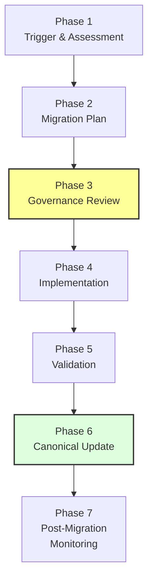
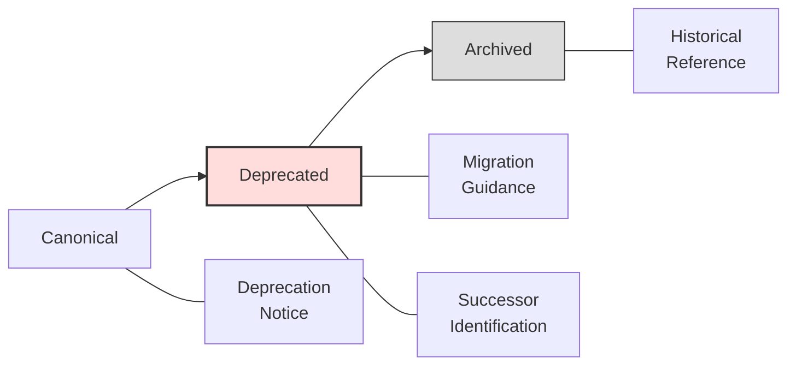
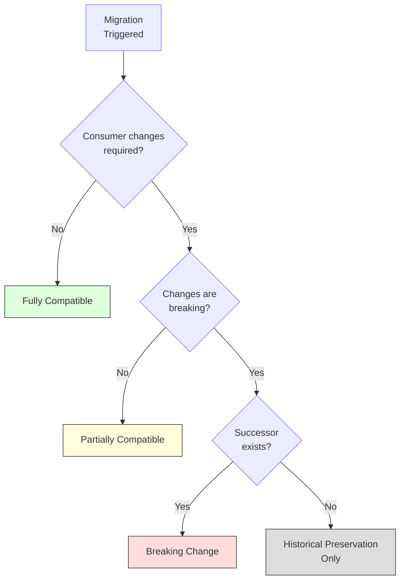

# Appendix C: Migration Playbook

> **Parent Document:** [STD-000 — Framework Standards](../Standards/STD-000-Framework-Standards.md) (`AI-DOS-STD-000`)
> **Version:** 3.0.0-beta
> **Status:** Draft

---

## C.1 Purpose

This appendix provides the canonical migration playbook for theAI-DOS Standards Library. It operationalizes the migration principles, triggers, workflow, planning requirements, compatibility strategies, and deprecation rules defined in [Section 17 — Migration](./STD-000-Framework-Standards.md#17-migration) of STD-000.

The playbook serves as a step-by-step reference for Standards Owners, Framework Governance, and consuming documents when a Framework Standard requires migration due to deprecation, breaking changes, Meta Model evolution, constitutional amendments, or structural reorganization.

---

## C.2 Playbook Conventions

| Convention | Description                                                                                                                    |
|:---|:-------------------------------------------------------------------------------------------------------------------------------|
| **Migration ID** | Unique identifier (format: `MIG-STD-___-<SEQ>`).                                                                               |
| **Phase** | The migration workflow phase as defined in [Section 17 — Migration Workflow](../Standards/STD-000-Framework-Standards.md#17-migration). |
| **RACI** | Responsible (R), Accountable (A), Consulted (C), Informed (I).                                                                 |

---

## C.3 Migration Trigger Assessment

Before initiating a migration, the trigger shall be assessed and classified.

### C.3.1 Trigger Classification

| Trigger | Description | Typical Impact | STD-000 Reference |
|:---|:---|:---|:---|
| **Standard Deprecation** | A standard is being superseded by a successor. | Varies (depends on consumer count). | §17 Migration Triggers |
| **Major Version Breaking Change** | A new major version introduces incompatible changes. | High — consumer updates required. | §17 Migration Triggers |
| **Meta Model Evolution** | M.0 introduces changes affecting standard concepts. | Varies (depends on derivation depth). | §17 Migration Triggers |
| **Constitutional Amendment** | A [constitutional amendment](../A.1-Constitution.md#18-amendment-process) affects standard governance or scope. | Varies (depends on amendment scope). | §17 Migration Triggers |
| **Standard Merge** | Two or more standards are consolidated into one. | High — identity and reference changes. | §17 Migration Triggers |
| **Standard Split** | One standard is divided into multiple standards. | High — identity and reference changes. | §17 Migration Triggers |
| **Standard Supersession** | A standard is replaced by a fundamentally different model. | High — full consumer migration. | §17 Migration Triggers |

### C.3.2 Trigger Assessment Template

| Field | Value |
|:---|:---|
| **Migration ID** | `MIG-STD-___-<SEQ>` |
| **Trigger Type** | |
| **Source Standard** | `AI-DOS-STD-___` |
| **Target Standard** | `AI-DOS-STD-___` (or "N/A" for deprecation without successor) |
| **Trigger Date** | |
| **Assessment Owner** | |
| **Preliminary Impact Assessment** | |
| **Affected Document Count** | |
| **Preliminary Compatibility Strategy** | ☐ Fully Compatible ☐ Partially Compatible ☐ Breaking Change ☐ Historical Preservation Only |

---

## C.4 Migration Workflow Phases

The migration workflow defined in [Section 17](./STD-000-Framework-Standards.md#17-migration) is expanded here into operational phases with specific activities, responsibilities, and exit criteria.

*Figure C.1: Migration Workflow Phases. Each phase has defined activities, responsibilities, and exit criteria.*

### C.4.1 Phase 1: Trigger and Assessment

**Objective:** Identify the migration need, classify the trigger, and produce a preliminary impact assessment.

| Activity | Description | Responsible |
|:---|:---|:---|
| Trigger identification | Document the event or decision that necessitates migration. | Standards Owner |
| Trigger classification | Classify the trigger using [Section C.3.1](#c31-trigger-classification). | Standards Owner |
| Consumer inventory | Identify all documents, standards, and systems that consume the source standard. | Standards Owner |
| Impact assessment | Assess the architectural, governance, and operational impact of the migration. | Standards Owner + Framework Governance |
| Preliminary compatibility classification | Determine the compatibility strategy (Fully Compatible / Partially Compatible / Breaking Change / Historical Preservation Only). | Standards Owner |

**Exit Criteria:**

- Trigger is classified.
- Consumer inventory is complete.
- Impact assessment is documented.
- Preliminary compatibility strategy is declared.

### C.4.2 Phase 2: Migration Plan

**Objective:** Produce a comprehensive migration plan as defined in [Section 17 — Migration Plan](./STD-000-Framework-Standards.md#17-migration).

| Activity | Description | Responsible |
|:---|:---|:---|
| Source standard documentation | Document the current state of the source standard. | Standards Owner |
| Target standard documentation | Document the target state (new version or successor). | Standards Owner |
| Migration rationale | Document the reasons for migration with supporting evidence. | Standards Owner |
| Compatibility expectations | Define the expected compatibility level for each consumer. | Standards Owner + Framework Governance |
| Affected document list | Enumerate every document that requires changes. | Standards Owner |
| Required actions per consumer | Define specific migration actions for each affected document. | Standards Owner |
| Validation strategy | Define how the migration will be validated. | Standards Owner + Reviewers |
| Rollback considerations | Define rollback strategy if migration fails. | Framework Governance |
| Timeline and milestones | Define the migration schedule with governance checkpoints. | Standards Owner + Framework Governance |

**Exit Criteria:**

- Migration plan is documented and complete per [Section 17 — Migration Plan](./STD-000-Framework-Standards.md#17-migration).
- All plan fields are populated.
- Timeline is agreed upon by Standards Owner and Framework Governance.

### C.4.3 Phase 3: Governance Review

**Objective:** Submit the migration plan to Framework Governance for review and approval.

| Activity | Description | Responsible |
|:---|:---|:---|
| Plan submission | Submit the migration plan to Framework Governance. | Standards Owner |
| Governance review | Evaluate the plan against STD-000 migration principles and constraints. | Framework Governance |
| Impact verification | Verify that the impact assessment is accurate and complete. | Framework Governance + Reviewers |
| Consumer consultation | Consult with affected document owners on feasibility and timeline. | Framework Governance |
| Decision | Approve, approve with modifications, or reject the migration plan. | Framework Governance |

**Exit Criteria:**

- Governance review is documented.
- Approval (or conditional approval) is granted.
- Any conditions or modifications are recorded.

### C.4.4 Phase 4: Implementation

**Objective:** Execute the migration plan across all affected documents and systems.

| Activity | Description | Responsible |
|:---|:---|:---|
| Source standard updates | Apply changes to the source standard (or create successor). | Standards Owner |
| Consumer document updates | Apply required changes to all consuming documents. | Respective Document Owners |
| Reference updates | Update all cross-references to reflect the migration. | Respective Document Owners |
| Metadata updates | Update identifiers, versions, and lifecycle states as required. | Standards Owner |
| Traceability preservation | Ensure all pre-migration references remain resolvable. | Standards Owner + Reviewers |

**Exit Criteria:**

- All required actions from the migration plan are completed.
- All cross-references are updated.
- Traceability to pre-migration state is preserved.

### C.4.5 Phase 5: Validation

**Objective:** Validate that the migration has been executed correctly and that no unintended consequences have been introduced.

| Activity | Description | Responsible |
|:---|:---|:---|
| Structural validation | Verify that migrated standards and consumers satisfy structural requirements. | Reviewers |
| Cross-reference validation | Verify that all references resolve correctly after migration. | Reviewers |
| Compatibility verification | Verify that the declared compatibility strategy is achieved. | Reviewers |
| Traceability verification | Verify that historical traceability is preserved. | Reviewers |
| Validation report | Produce a validation report per [Appendix A — Validation Checklist](./STD-000-Framework-Standards-Appendix-A-Validation-Checklist.md). | Reviewers |

**Exit Criteria:**

- Validation report is produced.
- All blocking validation checks pass.
- Any advisory findings are documented with resolution timelines.

### C.4.6 Phase 6: Canonical Update

**Objective:** Publish the migrated standard(s) and update all canonical references.

| Activity | Description | Responsible |
|:---|:---|:---|
| Version update | Increment versions of all affected standards and documents. | Standards Owner + Respective Owners |
| Lifecycle state update | Transition standards to appropriate lifecycle states. | Standards Owner |
| Canonical publication | Publish the updated canonical versions. | Framework Governance |
| Notification | Notify all affected document owners of the canonical update. | Framework Governance |
| Historical record | Archive the pre-migration versions for traceability. | Framework Governance |

**Exit Criteria:**

- All affected documents are published with updated versions.
- Pre-migration versions are archived and remain referenceable.
- All consumers are notified.

### C.4.7 Phase 7: Post-Migration Monitoring

**Objective:** Monitor the migrated standards for issues and ensure consumer adoption is complete.

| Activity | Description | Responsible |
|:---|:---|:---|
| Issue tracking | Monitor for issues arising from the migration. | Standards Owner + Framework Governance |
| Consumer adoption verification | Verify that all consumers have adopted the migrated standard. | Framework Governance |
| Condition resolution | Resolve any conditions attached to the migration approval. | Standards Owner |
| Migration closure | Close the migration record when all activities are complete. | Standards Owner |

**Exit Criteria:**

- No outstanding migration-related issues remain.
- All consumers have adopted the migrated standard or have documented exceptions.
- Migration record is closed.

---

## C.5 Migration Plan Template

This template implements the migration plan schema defined in [Section 17 — Migration Plan](./STD-000-Framework-Standards.md#17-migration).

### C.5.1 Plan Header

| Field | Value |
|:---|:---|
| **Migration ID** | `MIG-STD-___-<SEQ>` |
| **Migration Title** | |
| **Source Standard** | `AI-DOS-STD-___` (Version: ) |
| **Target Standard** | `AI-DOS-STD-___` (Version: ) |
| **Trigger Type** | |
| **Migration Rationale** | |
| **Compatibility Strategy** | ☐ Fully Compatible ☐ Partially Compatible ☐ Breaking Change ☐ Historical Preservation Only |
| **Migration Owner** | |
| **Governance Approver** | |
| **Plan Date** | |
| **Target Completion Date** | |

### C.5.2 Affected Documents

| Document | Identifier | Current Version | Required Action | Owner | Status |
|:---|:---|:---|:---|:---|:---|
| | | | | | Pending |
| | | | | | In Progress |
| | | | | | Complete |

### C.5.3 Migration Timeline

| Phase | Activity | Start Date | End Date | Owner | Status |
|:---|:---|:---|:---|:---|:---|
| Phase 1 | Trigger & Assessment | | | | |
| Phase 2 | Migration Plan | | | | |
| Phase 3 | Governance Review | | | | |
| Phase 4 | Implementation | | | | |
| Phase 5 | Validation | | | | |
| Phase 6 | Canonical Update | | | | |
| Phase 7 | Post-Migration Monitoring | | | | |

### C.5.4 Rollback Plan

| Field | Value |
|:---|:---|
| **Rollback Triggered When** | |
| **Rollback Procedure** | |
| **Rollback Authority** | |
| **Max Rollback Duration** | |
| **Data Preservation** | |

---

## C.6 Deprecation Procedures

This section operationalizes the deprecation rules defined in [Section 17 — Deprecation Rules](./STD-000-Framework-Standards.md#17-migration).

### C.6.1 Deprecation Lifecycle

*Figure C.2: Deprecation Lifecycle. Deprecated standards remain referenceable and include migration guidance until archived.*

### C.6.2 Deprecation Notice Template

| Field | Value |
|:---|:---|
| **Migration ID** | `MIG-STD-___-<SEQ>` |
| **Deprecated Standard** | `AI-DOS-STD-___` |
| **Deprecated Version** | |
| **Deprecation Date** | |
| **Successor Standard** | `AI-DOS-STD-___` (or "N/A") |
| **Successor Version** | |
| **Reason for Deprecation** | |
| **Migration Guidance Reference** | |
| **Planned Archive Date** | |
| **Deprecation Authority** | |

### C.6.3 Deprecation Requirements

A deprecated standard shall:

- **Remain referenceable** — Existing cross-references shall continue to resolve. No content shall be deleted or moved without redirect.
- **Identify its successor** — When a successor exists, the deprecated standard shall include a prominent notice identifying the successor and its canonical identifier.
- **Include migration guidance** — The deprecated standard shall reference the migration plan (Migration ID) and describe the actions consumers must take.
- **Remain historically accessible** — The full content, metadata, and revision history of the deprecated standard shall remain accessible for audit and traceability purposes.

### C.6.4 Archive Procedure

When a deprecated standard is ready for archival:

1. Verify all consumers have migrated or have documented exceptions.
2. Verify the migration record is closed.
3. Update the lifecycle state to Archived.
4. Preserve the full document content and revision history.
5. Update the Standards Library index.
6. Notify Framework Governance.

---

## C.7 Compatibility Strategy Guide

This section expands the compatibility strategies defined in [Section 17 — Compatibility Strategy](./STD-000-Framework-Standards.md#17-migration).

### C.7.1 Strategy Decision Matrix

| Factor | Fully Compatible | Partially Compatible | Breaking Change | Historical Preservation Only |
|:---|:---|:---|:---|:---|
| **Consumer changes required** | None | Some | Significant | N/A |
| **Migration plan required** | No | Yes (lightweight) | Yes (comprehensive) | No |
| **Migration guidance** | Optional | Required | Required | N/A |
| **Governance review** | Optional | Required | Required | Required |
| **Validation required** | Standard | Enhanced | Full | N/A |
| **Consumer notification** | Informational | Advisory | Mandatory | Informational |
| **Rollback plan** | Not required | Recommended | Required | Not required |

### C.7.2 Strategy Selection Flow

*Figure C.3: Compatibility Strategy Selection. The strategy is determined by the degree of consumer impact and the existence of a successor standard.*

---

## C.8 Migration Constraints Reference

This section consolidates all migration constraints from [Section 17 — Migration Constraints](./STD-000-Framework-Standards.md#17-migration) and extends them with operational guidance.

| Constraint | Operational Guidance |
|:---|:---|
| **Shall not destroy historical versions** | All pre-migration versions must be archived before canonical update. Archive must preserve full content, metadata, and revision history. |
| **Shall not reuse obsolete identifiers** | Once a standard identifier is deprecated or archived, it shall never be reassigned to a new standard. |
| **Shall not remove traceability** | Every migration must maintain a link between pre-migration and post-migration artifacts. The Migration ID serves as the traceability anchor. |
| **Shall not bypass governance approval** | Every migration must pass through Phase 3 (Governance Review). No migration may proceed directly from planning to implementation. |

---

## C.9 Migration Record Template

This template produces the permanent migration record.

| Field | Value |
|:---|:---|
| **Migration ID** | `MIG-STD-___-<SEQ>` |
| **Source Standard** | `AI-DOS-STD-___` |
| **Source Version** | |
| **Target Standard** | `AI-DOS-STD-___` |
| **Target Version** | |
| **Trigger Type** | |
| **Compatibility Strategy** | |
| **Migration Owner** | |
| **Governance Approver** | |
| **Migration Start Date** | |
| **Migration Completion Date** | |
| **Affected Document Count** | |
| **Validation Outcome** | |
| **Migration Status** | |
| **Post-Migration Issues** | |

---

## C.10 Relationship to Future Standards

When [STD-005 — Evidence Standard](./STD-000-Framework-Standards.md#18-references) is published, the evidence references in migration records should align with the canonical Evidence Artifact model. When [STD-006 — Identity Standard](./STD-000-Framework-Standards.md#18-references) is published, the migration identifiers defined here should be aligned with the canonical Identity model.

Until those standards are available, this playbook serves as the authoritative migration reference for the Standards Library.

---

## C.11 Revision History

| Version | Date | Author | Description |
|:---|:---|:---|:---|
| 3.0.0-beta | 2026-07-04 | Framework Architecture Team | Initial release with 7-phase workflow, deprecation procedures, compatibility guide, and templates. |
