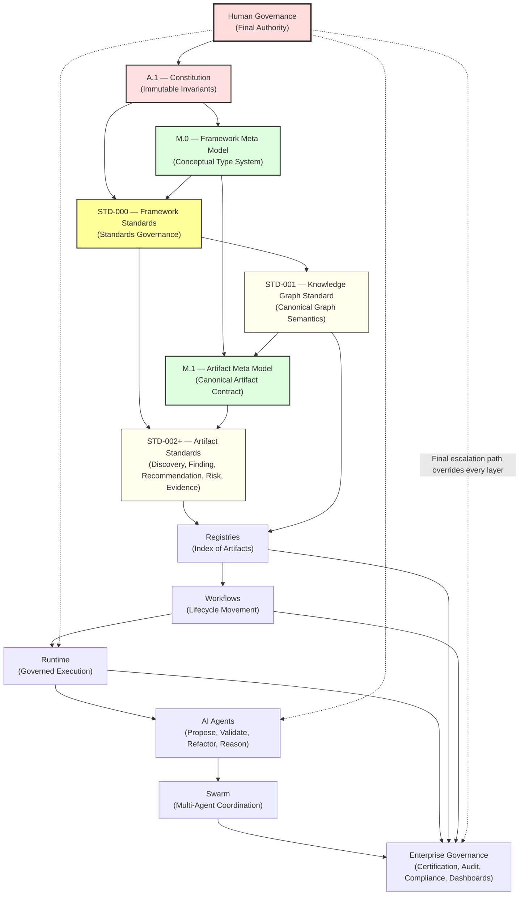
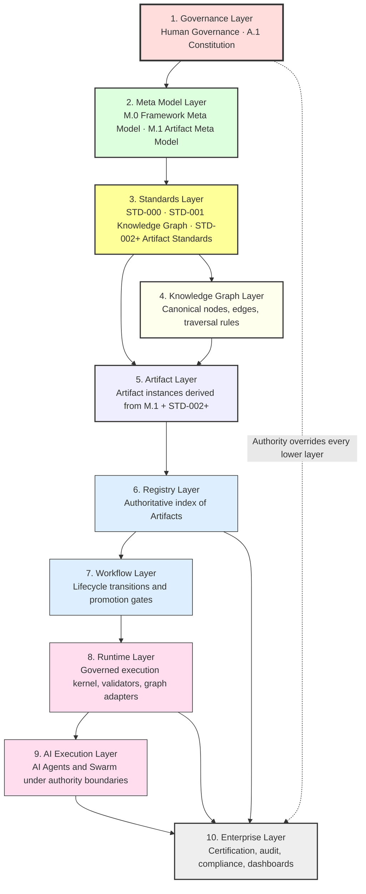
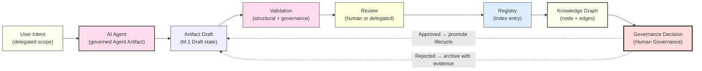

#AI-DOS Blueprint v1.0 — RFC

> **AI-DOS · Architectural Blueprint · Request for Comments**
> Big-picture architecture map for theAI-DOS governed AI framework.

---

## Document Metadata

| Property            | Value                                                                                          |
|:--------------------|:-----------------------------------------------------------------------------------------------|
| **Document**        |AI-DOS Blueprint v1.0 — RFC                                                                  |
| **Identifier**      | `AI-DOS-ARCH-BP-001`                                                                            |
| **Version**         | `1.0.0-rc-draft`                                                                               |
| **Status**          | Draft · RFC                                                                                    |
| **Type**            | Architectural Blueprint (RFC)                                                                  |
| **Classification**  | Framework Architecture                                                                         |
| **Authority**       | [A.1 — Constitution](../A.1-Constitution.md) (constitutional) · Human Governance (final)      |
| **Owner**           | Framework Architecture Team                                                                    |
| **Maintainers**     | Framework Governance                                                                           |
| **Created**         | 2026-07-06                                                                                     |
| **Last Updated**    | 2026-07-06                                                                                     |
| **Depends On**      | `A.1`, `M.0`, `M.1`, `STD-000`, `STD-001`, `STD-002`                                           |
| **Consumed By**     | Framework Architecture documents, Runtime specifications, Governance processes, AI Agent specs |
| **Produces**        |AI-DOS architectural map, authority boundaries, layer responsibilities, phased roadmap      |

---

## Revision History

| Version        | Date       | Author                    | Description                                                                            |
|:---------------|:-----------|:--------------------------|:---------------------------------------------------------------------------------------|
| `0.1.0-draft`  | 2026-07-06 | Framework Architecture Team | Initial RFC scaffold. Authority chain, layer list, and roadmap outline.             |
| `0.2.0-draft`  | 2026-07-06 | Framework Architecture Team | Added layered architecture, dependency map, ownership map, current/target state.   |
| `0.3.0-draft`  | 2026-07-06 | Framework Architecture Team | Added artifact flow, AI execution flow, human governance flow diagrams.            |
| `0.4.0-draft`  | 2026-07-06 | Framework Architecture Team | Added dependency map, ownership map, current/target state.                         |
| `0.5.0-draft`  | 2026-07-06 | Framework Architecture Team | Added §6.1 Key Architectural Rules consolidating the eleven authority invariants.  |
| `1.0.0-rc-draft` | 2026-07-06 | Framework Architecture Team | RFC-ready draft for governance review. All required sections and diagrams present. |

---

## Table of Contents

1. [Status](#1-status)
2. [Executive Summary](#2-executive-summary)
3. [Vision](#3-vision)
4. [WhyAI-DOS Exists](#4-why-ai-dos-exists)
5. [Architectural Problem Statement](#5-architectural-problem-statement)
6. [Architectural Principles](#6-architectural-principles)
7. [System Overview](#7-system-overview)
8. [Layered Architecture](#8-layered-architecture)
9. [Governance Layer](#9-governance-layer)
10. [Meta Model Layer](#10-meta-model-layer)
11. [Standards Layer](#11-standards-layer)
12. [Knowledge Graph Layer](#12-knowledge-graph-layer)
13. [Artifact Layer](#13-artifact-layer)
14. [Registry Layer](#14-registry-layer)
15. [Workflow Layer](#15-workflow-layer)
16. [Runtime Layer](#16-runtime-layer)
17. [AI Agent Layer](#17-ai-agent-layer)
18. [Swarm Layer](#18-swarm-layer)
19. [Validation & Certification Layer](#19-validation--certification-layer)
20. [Enterprise Governance Layer](#20-enterprise-governance-layer)
21. [Data / Knowledge Flow](#21-data--knowledge-flow)
22. [Artifact Lifecycle Flow](#22-artifact-lifecycle-flow)
23. [AI Execution Flow](#23-ai-execution-flow)
24. [Human Governance Flow](#24-human-governance-flow)
25. [Dependency Map](#25-dependency-map)
26. [Ownership Map](#26-ownership-map)
27. [Current State](#27-current-state)
28. [Target State](#28-target-state)
29. [Roadmap](#29-roadmap)
30. [Non-Goals](#30-non-goals)
31. [Risks](#31-risks)
32. [Open Decisions](#32-open-decisions)
33. [Completion Checklist](#33-completion-checklist)

---

## 1. Status

This document is the **AI-DOS Blueprint v1.0 — Request for Comments**. It is published as a Draft RFC for Framework Governance review. It is not a Canonical Framework Architecture document, and it does not by itself introduce, modify, or supersede any Framework Standard.

The purpose of this Blueprint is to stop fragmented standard writing by establishing a single architectural map showing how the Constitution, the Meta Models, the Standards Library, the Knowledge Graph, the Artifact Model, the Registries, the Workflows, the Runtime, the AI Agents, the Swarm, and the Enterprise Governance layer fit together. Each of those concerns is owned by its own governing document; this Blueprint only describes how they relate.

This Blueprint is normative only with respect to its own structural assertions (layer boundaries, ownership boundaries, and authority invariants). Where this Blueprint references the content of [A.1 — Constitution](../A.1-Constitution.md), [M.0 — Framework Meta Model](../M.0-Framework-Meta-Model.md), [M.1 — Artifact Meta Model](../M.1-Artifact-Meta-Model.md), [STD-000 — Framework Standards](../Standards/STD-000-Framework-Standards.md), [STD-001 — Knowledge Graph Standard](../Standards/STD-001-Knowledge-Graph-Standard.md), or [STD-002 — Discovery Standard](../Standards/STD-002-Discovery-Standard.md), the source document is the authority and this Blueprint is informative.

This RFC shall be revised through Framework Governance. Promotion of this Blueprint to Canonical status requires evidence of cross-layer review, dependency validation, and explicit endorsement by the owners of every layer it touches. Until that promotion occurs, downstream documents may reference this Blueprint for orientation, but shall not treat its layer boundaries or ownership claims as binding supersession of their own authority chains.

---

## 2. Executive Summary

AI-DOS is not a documentation system.AI-DOS is a **governed AI framework** in which architectural knowledge is modeled as governed Artifacts, indexed in Registries, connected through a canonical Knowledge Graph, moved through governed Workflows, executed by a governed Runtime, and acted upon by AI Agents and Swarms that propose, validate, refactor, and reason — but never self-certify. Human Governance remains the final authority at every layer.

TheAI-DOS stack is intentionally stratified. The Constitution ([A.1](../A.1-Constitution.md)) owns immutable governance invariants. The Framework Meta Model ([M.0](../M.0-Framework-Meta-Model.md)) owns the conceptual type system from which every governed object is derived. The Artifact Meta Model ([M.1](../M.1-Artifact-Meta-Model.md)) owns the canonical Artifact contract inherited by all specialized Artifact types. The Framework Standards root ([STD-000](../Standards/STD-000-Framework-Standards.md)) owns how standards themselves are written and governed. The Knowledge Graph Standard ([STD-001](../Standards/STD-001-Knowledge-Graph-Standard.md)) owns the canonical graph semantics into which every Artifact is projected. Specialized Artifact standards such as the Discovery Standard ([STD-002](../Standards/STD-002-Discovery-Standard.md)) own the domain-specific contract for one Artifact type without redefining the common contract.

This Blueprint exists because, in the absence of an explicit architectural map, individual standards tend to drift. Identity gets redefined per standard. Lifecycle states get invented locally. Authority gets borrowed silently. AI agents begin to behave as if they could certify their own output. Registries begin to act as if they were the source of truth. The Knowledge Graph becomes a serialization detail rather than the canonical representation. Each of those drifts, taken alone, is small; taken together, they collapse the framework's governance guarantees.

The remedy is an explicit, layered, authority-respecting architecture in which every layer has a single, well-bounded responsibility, every layer is forbidden from redefining any higher-authority layer, AI is structurally prevented from self-certification, and Human Governance retains an unbroken escalation path from any layer to the Constitution. This Blueprint specifies that architecture and a ten-phase roadmap to mature it from its current foundation state to its target state.

---

## 3. Vision

The long-term vision ofAI-DOS is an architecture in which governed knowledge, governed execution, and governed intelligence are not three separate systems but one continuous fabric. A Discovery observed in reality is captured as a governed Artifact, projected into the Knowledge Graph, linked by typed relationships to Evidence, Findings, Risks, Recommendations, and Decisions, consumed by Workflows that promote it through governed lifecycle states, validated by deterministic Runtime traversal, reasoned over by AI Agents that must justify every conclusion by a traversable graph path, and ultimately approved or rejected by Human Governance before any architectural change becomes canonical.

In that vision, AI is a first-class participant in the framework — but it is a delegated participant. AI Agents may propose new Artifacts, transform existing ones, surface latent relationships in the Knowledge Graph, and recommend lifecycle transitions. They may not redefine standards, duplicate canonical truth, override the authority chain, or self-certify their own output as Accepted or Canonical. The boundary between what AI may do and what only Human Governance may do is not a policy preference; it is a constitutional invariant.

The vision is therefore not "AI running the framework." The vision is a framework whose governance is strong enough that AI can be safely embedded at every layer — proposing, validating, refactoring, and reasoning — without ever being able to silently become the authority. AI-DOS's success is measured by the absence of two failure modes simultaneously: governance so loose that AI drifts into self-certification, and governance so rigid that the framework cannot evolve at the pace required by real architectural work.

---

## 4. WhyAI-DOS Exists

AI-DOS exists because the alternative architectures fail in predictable, repeatable ways.

The first alternative is the **documentation-only architecture**, in which architectural knowledge lives in Markdown files connected by informal prose references. This model collapses the moment the corpus grows beyond a small team: terminology drifts, references rot, lifecycle states are inferred from filenames, and there is no canonical graph against which an AI agent can reason deterministically. Findings, Risks, Recommendations, and Decisions each redefine their own identity, ownership, and lifecycle models, producing a stack that is unreadable to machines and unmaintainable for humans.

The second alternative is the **database-only architecture**, in which architectural knowledge lives in a graph database or relational store and the Markdown is generated from it. This model inverts the source of truth: storage engines become canonical, identity becomes coupled to internal row IDs, and the conceptual model is silently rewritten every time the storage technology changes. The framework becomes an implementation rather than an architecture, and any migration to a different storage technology becomes a constitutional crisis.

The third alternative is the **AI-first architecture**, in which an AI agent is given broad authority to read the corpus, propose changes, and self-promote its output into canonical status. This model fails because AI confidence is not validation, AI-generated content is not evidence, and AI reasoning that cannot be reproduced as a traversable graph path is hallucination. Without an explicit authority boundary, the framework gradually becomes whatever the AI says it is, and Human Governance loses the ability to verify what is canonical.

AI-DOS is designed to avoid all three failure modes by holding four positions simultaneously: knowledge is canonical and lives in the graph; serialization is derived and lives in files, registries, and DTOs; AI is delegated and lives inside explicit authority boundaries; and Human Governance is supreme and lives at the top of an unbroken authority chain.AI-DOS exists to make that combination sustainable across years of evolution, not just for an initial release.

---

## 5. Architectural Problem Statement

TheAI-DOS framework must satisfy a set of architectural constraints that, taken together, are not satisfied by any single existing pattern. Specifically, the framework shall:

- **Preserve canonical truth across representations.** The same Artifact shall be expressible as a Markdown document, a JSON object, a YAML file, a registry entry, a graph node, a runtime DTO, and an OpenAPI payload, and all of those representations shall be derived projections of one canonical object rather than competing sources of truth.
- **Prevent authority drift across layers.** No layer shall redefine concepts owned by a higher-authority layer. The Constitution shall not be redefined by Standards; Standards shall not be redefined by the Runtime; the Runtime shall not be redefined by AI Agents; and AI Agents shall not redefine anything they do not own.
- **Guarantee deterministic AI reasoning.** Every AI conclusion shall be reproducible as a traversable path through the canonical Knowledge Graph. Reasoning that depends on textual similarity, undocumented inference, or model-internal state is non-compliant by construction.
- **Forbid AI self-certification.** AI-generated Artifacts may be proposed, drafted, validated, and reviewed, but no AI Agent or Swarm shall be able to promote an Artifact to Accepted, Canonical, or Certified state without Human Governance or a delegated human-owned authority.
- **Remain implementation-neutral.** The framework shall not be coupled to a specific graph database, serialization library, programming language, or AI model vendor. Storage engines, query languages, and model providers are projections, not architecture.
- **Survive controlled evolution.** Standards shall evolve through governed lifecycle transitions, not ad-hoc edits. Every significant change shall be justified by evidence, reviewed by an accountable owner, and traceable through decision records.
- **Remain auditable end-to-end.** Given any canonical Artifact, it shall be possible to reconstruct the full chain of observations, evidence, validations, reviews, decisions, and certifications that produced it, and to identify the human authority that approved each transition.

The architectural problem is that no single layer can guarantee all seven constraints alone. The constraints are cross-cutting: identity is a Meta Model concern, projection is an Artifact Model concern, graph integrity is a Knowledge Graph concern, lifecycle is a Standards concern, execution is a Runtime concern, reasoning is an AI Agent concern, and approval is a Human Governance concern. The Blueprint exists to make those responsibilities explicit, non-overlapping, and mutually reinforcing.

---

## 6. Architectural Principles

The following principles govern every layer described in this Blueprint. They are derived from [A.1 — Constitution](../A.1-Constitution.md), [M.0 — Framework Meta Model](../M.0-Framework-Meta-Model.md), [M.1 — Artifact Meta Model](../M.1-Artifact-Meta-Model.md), [STD-000 — Framework Standards](../Standards/STD-000-Framework-Standards.md), [STD-001 — Knowledge Graph Standard](../Standards/STD-001-Knowledge-Graph-Standard.md), and [STD-002 — Discovery Standard](../Standards/STD-002-Discovery-Standard.md), and are restated here only to make the Blueprint self-contained for orientation. Where this restatement conflicts with a source document, the source prevails.

**P1 — Authority flows downward and never upward.** Authority originates in Human Governance, is expressed in the Constitution, is operationalized through the Meta Model and Standards, and is executed by the Runtime and AI Agents. No lower layer may redefine, override, or silently borrow authority owned by a higher layer.

**P2 — Canonical truth is singular.** Every governed concept has exactly one canonical definition owned by exactly one document. Other documents may consume, specialize, or project that concept; they may not redefine it. Duplicated canonical truth is a constitutional violation per [STD-000, Section 30 — AI Consumption Rules](../Standards/STD-000-Framework-Standards.md#30-ai-consumption-rules).

**P3 — Everything governed is an Artifact.** Any object that must be identified, owned, lifecycle-managed, validated, certified, referenced, or audited shall be modeled as an Artifact under the [M.1](../M.1-Artifact-Meta-Model.md) contract. Documents, Standards, Discoveries, Findings, Recommendations, Risks, Evidence, Decisions, Workflows, Runtime Components, Agents, and Swarms are all Artifacts.

**P4 — Identity is immutable and representation-independent.** Artifact identity shall not depend on filename, file path, registry row ID, graph database internal ID, or serialization format. Identity shall be stable across migrations, format conversions, and registry re-indexing.

**P5 — The Knowledge Graph is the canonical representation.** Markdown, JSON, YAML, OpenAPI, registry rows, and runtime DTOs are derived projections of the graph. Serialization shall never redefine graph semantics; presentation shall never become the source of truth.

**P6 — Relationships are explicit and first-class.** Relationships between Artifacts shall be declared, typed, directional, and traceable. Relationships shall never be inferred solely from textual references or AI speculation.

**P7 — Lifecycle is governed and evidence-driven.** No Artifact shall move to Accepted, Consumed, Canonical, or Certified state without an accountable owner, supporting evidence, and a recorded transition. AI shall not self-promote any Artifact through any lifecycle gate.

**P8 — Runtime executes; it does not reason.** The Runtime consumes canonical knowledge and projects it for execution. The Runtime shall not redefine standards, infer missing relationships, or promote Artifacts. Knowledge interpretation belongs to AI; knowledge execution belongs to Runtime.

**P9 — AI reasoning is graph-traceable.** Every AI-generated recommendation, finding, or proposed change shall reference the originating nodes, the traversal path, the supporting evidence, and the confidence assessment. Reasoning that cannot be reproduced as graph traversal is non-compliant.

**P10 — Human Governance is the final authority.** Every escalation path terminates in Human Governance. No automated system — Runtime, AI Agent, Swarm, Registry, or Workflow — may override a Human Governance decision. This principle is non-negotiable and is the foundation on which every other principle rests.

### 6.1 Key Architectural Rules

The following eleven rules are the binding authority invariants of theAI-DOS architecture. Each rule is owned by the source document indicated in parentheses; this Blueprint restates them in consolidated form for orientation only. Where this restatement conflicts with a source document, the source prevails.

1. **A.1 owns constitutional authority.** The Constitution ([A.1](../A.1-Constitution.md)) is the sole owner of immutable governance invariants, the authority chain, evidence principles, and constitutional violations. No lower document may redefine constitutional authority. (Source: A.1; reflected in M.0 §12, STD-000 §5.)
2. **M.0 owns framework meta concepts.** The Framework Meta Model ([M.0](../M.0-Framework-Meta-Model.md)) is the sole owner of Artifact, Entity, Relationship, Identity, Lifecycle, State, Authority, Ownership, Evidence, Validation, Review, Certification, and Reference as framework-level meta concepts. Standards may specialize these concepts; they may not redefine them. (Source: M.0 §5, §6, §7, §8, §9, §10, §11, §12, §13, §14, §15, §16, §17, §18.)
3. **M.1 owns the canonical Artifact contract.** The Artifact Meta Model ([M.1](../M.1-Artifact-Meta-Model.md)) is the sole owner of the canonical Artifact identity model, lifecycle model, anatomy, and extension rules. Specialized Artifact standards inherit this contract; they may not break it. (Source: M.1 §8, §9, §10.)
4. **STD-000 owns standard governance.** The Framework Standards root ([STD-000](../Standards/STD-000-Framework-Standards.md)) is the sole owner of how standards are identified, structured, governed, validated, certified, versioned, migrated, and consumed. No standard may redefine standard governance. (Source: STD-000 §1, §9, §10, §11, §13, §14, §15, §16, §17.)
5. **STD-001 owns Knowledge Graph semantics.** The Knowledge Graph Standard ([STD-001](../Standards/STD-001-Knowledge-Graph-Standard.md)) is the sole owner of the canonical graph model, node model, edge model, topology, AI Traversal Rules, Runtime Traversal Rules, and graph constraints. No standard, runtime, or agent may redefine graph semantics. (Source: STD-001 §1, §4, §5, §6, §7, §8, §9, §10, §12, §13.)
6. **STD-002+ own domain-specific Artifact standards.** Specialized Artifact standards — STD-002 Discovery (Canonical-pending), and the Planned standards STD-003 Finding, STD-004 Recommendation, STD-005 Risk, and STD-006 Evidence — own the domain-specific contract for their respective Artifact types. Each specializes the M.1 Artifact contract without redefining the common contract. (Source: STD-002 §1, §3; M.1 §6.)
7. **Registries index Artifacts but are not source of truth.** A Registry is an index of Artifact identity and metadata; it is not the Artifact. Registry row IDs shall never be exposed as canonical identity. Registry mutations occur only as side-effects of governed Artifact lifecycle transitions, never as the cause of them. (Source: M.1 §8.12; STD-000 §28.)
8. **Runtime executes governed workflows but does not redefine standards.** The Runtime consumes canonical knowledge and projects it for execution according to STD-001 §13 Runtime Traversal Rules. The Runtime shall not redefine any standard, infer missing relationships, or promote Artifacts. Knowledge interpretation belongs to AI; knowledge execution belongs to Runtime. (Source: STD-001 §13.3.)
9. **AI Agents may propose and transform Artifacts but may not self-certify.** AI Agents may draft Artifacts, validate them against schema and relationship rules, recommend lifecycle transitions, and propose architectural changes. No AI Agent or Swarm shall be able to promote an Artifact to Accepted, Canonical, Certified, or any equivalent governance-bearing state on its own authority. Every promotion gate shall be passed by Human Governance or by a human-delegated authority accountable to Human Governance. (Source: STD-000 §30; M.1 §9.10; STD-002 §30.)
10. **Human Governance remains final authority.** Every escalation path terminates in Human Governance. No automated system — Runtime, AI Agent, Swarm, Registry, Workflow, or Enterprise Governance function — may override a Human Governance decision. Human Governance authority is non-delegable in accountability, even where execution is delegated. (Source: A.1; reflected in M.0 §12, STD-000 §5.)
11. **No layer may redefine a higher-authority layer.** Authority flows downward only. A lower layer may consume, specialize, or project the canonical output of a higher-authority layer; it may not redefine the higher layer's contract. Conflicts shall be resolved in favor of the higher-authority layer. (Source: M.0 §12; STD-000 §5; M.1 §5.3.)

These eleven rules are the load-bearing invariants of the architecture. Every subsequent section of this Blueprint, every roadmap phase, and every Planned standard shall be evaluated against them. Any proposed change that would violate any of these rules shall be rejected by validation.

---

## 7. System Overview

AI-DOS is a layered framework in which each layer consumes the canonical output of the layers below it and produces canonical input for the layers above it. The layers, in authority order from highest to lowest, are: Human Governance; the Constitution (A.1); the Framework Meta Model (M.0); the Artifact Meta Model (M.1); the Framework Standards (STD-000 and the standards it governs, including STD-001 Knowledge Graph and STD-002+ Artifact standards); the Knowledge Graph projected from those standards; the Artifact instances themselves; the Registries that index them; the Workflows that move them; the Runtime that executes them; the AI Agents that reason over them; the Swarms that coordinate agents; and the Enterprise Governance functions that certify, audit, and report on the whole.

The system is intentionally not a single application. It is a set of governed contracts, each owned by a specific document, that together constrain how knowledge is captured, stored, related, evolved, executed, and reasoned over. Implementations of those contracts — graph databases, registry services, workflow engines, runtime kernels, agent runtimes — are projections of the contracts, not the contracts themselves. AAI-DOS deployment may swap its Neo4j graph database for a different storage engine, its Python Runtime for a Rust Runtime, or its LLM provider for a different vendor, without violating the architecture, provided the new implementation conforms to the same canonical contracts.

### Diagram 1 — Full Stack Architecture

The following diagram shows the fullAI-DOS stack as a directed authority-and-consumption graph. Solid arrows represent normative authority flow (higher authority governs lower). The diagram is structural, not temporal: the layers coexist and continuously consume one another's canonical output.



*Figure 1 — Full Stack Architecture. Human Governance sits above the Constitution and remains the final escalation authority for every layer. The Constitution, Meta Models, Standards, Knowledge Graph, Artifact Layer, Registries, Workflows, Runtime, AI Agents, Swarm, and Enterprise Governance are stratified by authority. Dotted lines from Human Governance denote the unbroken escalation path that overrides any automated decision anywhere in the stack.*

---

## 8. Layered Architecture

TheAI-DOS stack is organized into ten layers. Each layer has a single primary responsibility, a single owning document family, and a single direction of authority consumption (downward only). Layers are not organizational groupings; they are authority boundaries. A layer may consume the canonical output of any lower-authority layer, but it may not redefine the contract of any layer above it.

### Diagram 2 — Layered Architecture



*Figure 2 — Layered Architecture. Ten layers, ordered by authority. Each layer consumes the canonical output of lower layers and may not redefine their contracts. The Governance Layer retains override authority over every lower layer (dotted line).*

### Layer Responsibility Matrix

| # | Layer                | Primary Responsibility                                  | Owning Documents                              | May Redefine Higher Layer? |
|:--|:---------------------|:--------------------------------------------------------|:----------------------------------------------|:---------------------------|
| 1 | Governance           | Immutable invariants, final authority, escalation      | A.1 Constitution; Human Governance            | N/A (top of stack)         |
| 2 | Meta Model           | Conceptual type system, canonical Artifact contract    | M.0; M.1                                      | No                         |
| 3 | Standards            | Artifact-specific contracts and standard governance   | STD-000; STD-001; STD-002+                    | No                         |
| 4 | Knowledge Graph      | Canonical graph semantics, traversal rules             | STD-001                                       | No                         |
| 5 | Artifact             | Artifact instances conforming to M.1 and STD-002+      | M.1; STD-002+                                 | No                         |
| 6 | Registry             | Authoritative index of Artifacts                        | STD-000 §28 (Standards Registry); future Artifact Registry contracts | No |
| 7 | Workflow             | Lifecycle transitions, promotion gates, consumption rules | Future Workflow standard(s) under STD-000  | No                         |
| 8 | Runtime              | Governed execution; deterministic traversal; validators | Future Runtime specification under A.5       | No                         |
| 9 | AI Execution         | Propose, validate, refactor, reason; multi-agent coordination | Future AI Agent and Swarm specifications | No                         |
| 10 | Enterprise           | Certification, audit, compliance, dashboards            | Future Enterprise Governance specifications  | No                         |

The matrix above is the canonical layer map for the rest of this Blueprint. Each subsequent section (Sections 9 through 20) expands exactly one row of this matrix.

---

## 9. Governance Layer

The Governance Layer is the highest-authority layer in theAI-DOS stack. It comprises Human Governance and the Constitution ([A.1](../A.1-Constitution.md)). Its primary responsibility is to define immutable governance invariants and to serve as the final escalation authority for every dispute, exception, or constitutional question raised by any lower layer.

The Governance Layer is intentionally small. It does not define Artifact identity, lifecycle, schema, or graph semantics; those belong to the Meta Model, Artifact, and Standards layers. It does not define how standards are written; that belongs to STD-000. It does not define how the graph is traversed; that belongs to STD-001. The Governance Layer defines only the invariants that no lower layer may violate and the escalation path by which any lower layer may request clarification, exception, or amendment.

Human Governance, sitting above the Constitution, retains the unilateral authority to amend the Constitution, to resolve constitutional conflicts, to approve exceptions to standards, and to override any automated decision made by any lower layer. This authority is non-delegable: it may not be delegated to the Runtime, to an AI Agent, to a Swarm, to a Registry, or to a Workflow. Execution of governance decisions may be delegated; accountability for those decisions may not.

The Governance Layer's escalation contract is simple: any lower layer that encounters a conflict it cannot resolve through its own authority shall escalate to the next higher layer, and escalation shall continue until it reaches Human Governance. No layer is permitted to silently resolve a conflict by inventing new authority. The Constitution is the floor below which no layer may dig; Human Governance is the ceiling above which no layer may climb.

---

## 10. Meta Model Layer

The Meta Model Layer comprises [M.0 — Framework Meta Model](../M.0-Framework-Meta-Model.md) and [M.1 — Artifact Meta Model](../M.1-Artifact-Meta-Model.md). Its primary responsibility is to define the conceptual type system and the canonical Artifact contract from which every governed object in the framework is derived.

M.0 owns the framework-level meta concepts: Artifact, Entity, Relationship, Identity, Lifecycle, State, Authority, Ownership, Evidence, Validation, Review, Certification, and Reference. These concepts are the shared architectural language of the framework. Every standard, every architecture document, every runtime specification, and every AI Agent specification shall consume these concepts from M.0 and shall not redefine them.

M.1 specializes the M.0 Artifact concept into a reusable canonical Artifact contract. M.1 owns the universal Artifact identity model (human-readable identifier plus immutable machine identity), the canonical Artifact lifecycle (Draft → Observed → Verified → Accepted → Consumed → Historical → Archived), the Artifact anatomy (Identity, Classification, Lifecycle, Ownership, Authority, Metadata, Relationships, Validation, Review, Certification, Registry, Projection, Serialization, Extensions, Audit), and the rules by which specialized standards may extend the contract without breaking it.

The Meta Model Layer is strictly higher authority than the Standards Layer. Standards may specialize M.0 and M.1 concepts; they may not redefine them. A standard that needs a different identity model, a different lifecycle, or a different authority semantics shall either request a governed change to M.0 or M.1 (which requires impact analysis across the entire framework) or accept that it cannot compliantly exist. The Meta Model Layer is the layer where the cost of change is highest, and that cost is intentional: it prevents the framework from accumulating incompatible variants of its most fundamental concepts.

---

## 11. Standards Layer

The Standards Layer comprises [STD-000 — Framework Standards](../Standards/STD-000-Framework-Standards.md) and the standards STD-000 governs: [STD-001 — Knowledge Graph Standard](../Standards/STD-001-Knowledge-Graph-Standard.md), [STD-002 — Discovery Standard](../Standards/STD-002-Discovery-Standard.md), and the Planned standards STD-003 Finding, STD-004 Recommendation, STD-005 Risk, and STD-006 Evidence. Its primary responsibility is to define artifact-specific contracts and the governance rules for standards themselves.

STD-000 is the root of the Standards Library. It owns the standard lifecycle (Proposed → Draft → Review → Approved → Canonical → Maintenance → Deprecated → Archived), the standards classification system (Core, Supporting, Extension, Platform, Project), the domain taxonomy, the compliance levels (L0 through L5), the certification levels (Provisional, Certified, Verified, Canonical), the Standards Registry, the Standard Decision Record format, and the AI Consumption Rules that govern how AI systems may consume, reference, and derive from standards.

STD-001 owns the canonical Knowledge Graph semantics: node model, edge model, topology, traversal rules (both AI traversal and Runtime traversal), graph constraints, graph validation, and graph evolution rules. STD-001 is the layer at which architectural knowledge becomes addressable, traversable, and explainable. Every Artifact participates in the Knowledge Graph according to STD-001; no standard or runtime may redefine graph semantics.

STD-002 owns the canonical Discovery Artifact contract: Discovery identity, classification, lifecycle, confidence, impact, severity, relationships, validation, certification, registry participation, and AI Discovery rules. STD-002 is the first specialized Artifact standard. STD-003 (Finding), STD-004 (Recommendation), STD-005 (Risk), and STD-006 (Evidence) are Planned standards that will specialize the M.1 Artifact contract for their respective Artifact types in the same structural pattern as STD-002.

The Standards Layer is strictly higher authority than the Knowledge Graph, Artifact, Registry, Workflow, Runtime, AI Agent, Swarm, and Enterprise layers. No lower layer may redefine a standard. AI Agents that consume standards shall do so under the [AI Consumption Rules of STD-000 §30](../Standards/STD-000-Framework-Standards.md#30-ai-consumption-rules): they may consume, reference, and derive; they may not redefine, duplicate canonical truth, or override the authority chain.

---

## 12. Knowledge Graph Layer

The Knowledge Graph Layer is the canonical representation of all governed architectural knowledge in AI-DOS. It is owned by [STD-001 — Knowledge Graph Standard](../Standards/STD-001-Knowledge-Graph-Standard.md). Its primary responsibility is to preserve architectural relationships and to enable deterministic, explainable reasoning by both humans and AI.

The Knowledge Graph is not a storage engine. It is a canonical model in which every Discovery, Finding, Recommendation, Risk, Evidence, Decision, Standard, Workflow, Runtime Component, Agent, and Swarm is represented as a node, and every governed connection between those objects is represented as a typed, directional edge. Concrete storage technologies — Neo4j, RDF stores, PostgreSQL-backed graph schemas — are implementation projections of the canonical model. STD-001 defines the model; implementations conform to it.

STD-001 defines four representation layers: Reality → Knowledge → Knowledge Graph → Serialization → Presentation. Reality is observable architectural facts. Knowledge is normalized architectural meaning. The Knowledge Graph is the canonical model. Serialization (JSON, YAML, OpenAPI, DTO) is a derived projection. Presentation (Markdown, dashboards, reports) is a derived projection of the serialization. No layer below the Knowledge Graph may redefine the graph; no layer above the Knowledge Graph may treat a serialization or presentation as the source of truth.

The Knowledge Graph Layer defines two distinct traversal contracts. **AI Traversal** (STD-001 §12) is the contract by which AI Agents reason over the graph: Node Selection → Relationship Expansion → Knowledge Evaluation → Decision Generation. AI conclusions shall be reproducible as traversable paths; reasoning that depends on textual similarity or undocumented inference is non-compliant. **Runtime Traversal** (STD-001 §13) is the contract by which the Runtime consumes the graph: Entry Node → Traversal Planning → Relationship Resolution → Projection → Execution. The Runtime does not reason; it executes deterministic projections of canonical knowledge.

The Knowledge Graph Layer is the layer at which the framework's governance guarantees become machine-checkable. If a relationship is not in the graph, it does not exist for any automated consumer. If a node is not in the graph, it cannot be referenced by a Workflow, executed by the Runtime, or reasoned over by an AI Agent. This is the structural mechanism by which the framework prevents silent authority drift.

---

## 13. Artifact Layer

The Artifact Layer is the layer of governed Artifact instances. Its primary responsibility is to host the actual Discoveries, Findings, Recommendations, Risks, Evidence items, Decisions, Standards, Workflows, Runtime Components, Agents, and Swarms that constitute the framework's working knowledge. Every Artifact in this layer conforms to the [M.1 — Artifact Meta Model](../M.1-Artifact-Meta-Model.md) contract and to the domain-specific standard that owns its Artifact type.

An Artifact is not a file. A Markdown document may represent an Artifact, but it is not the Artifact. A JSON object may serialize an Artifact, but it is not the Artifact. A registry row may index an Artifact, but it is not the Artifact. A graph node may project an Artifact, but it is not the Artifact. The Artifact is the governed knowledge object; files, JSON, registry rows, and graph nodes are derived projections of that object. This distinction, established in M.1 §7 (Artifact Philosophy), is the structural defense against the framework collapsing into a documentation system or a database system.

Every Artifact in this layer declares its identity (human-readable identifier and immutable UUID), its type, its version, its lifecycle state, its owner, its authority, its metadata, its relationships, its validation state, its review state, its certification state, its registry participation, its projection rules, its serialization rules, and its audit history. These are the mandatory components of the M.1 Artifact anatomy; specialized standards may extend them but may not remove them.

The Artifact Layer is the layer at which the framework's governance guarantees become concrete. An Artifact that lacks an owner is non-compliant. An Artifact in Accepted state without owner accountability is non-compliant. An Artifact in Consumed state without a downstream reference is non-compliant. An Artifact promoted by an AI Agent without human review is non-compliant. These checks are enforced by the Validation & Certification Layer (Section 19) and operationalized by the Workflow Layer (Section 15) and the Runtime Layer (Section 16).

---

## 14. Registry Layer

The Registry Layer is the layer of authoritative indexes of governed Artifacts. Its primary responsibility is to make Artifacts discoverable, sortable, filterable, and referenceable across the framework. A Registry is an index, not a source of truth: the Artifact itself is the source of truth, and the Registry indexes the Artifact's identity, type, owner, authority, lifecycle state, dependencies, consumers, and supersession relationships.

[STD-000 — Framework Standards](../Standards/STD-000-Framework-Standards.md#28-standards-registry) defines the canonical Standards Registry: the authoritative inventory of all Framework Standards, their current status, dependencies, and relationships. The Standards Registry is the model for future Artifact-type-specific registries (Discovery Registry, Finding Registry, Risk Registry, Evidence Registry, etc.) that will be defined under the Standards Layer as specialized standards mature.

The Registry Layer is strictly lower authority than the Artifact Layer. A registry entry is a projection of an Artifact's identity and metadata; it is not the Artifact. Treating a registry row ID as the Artifact's canonical identity is an explicit M.1 anti-pattern (see [M.1 §8.12 — Identity Anti-Patterns](../M.1-Artifact-Meta-Model.md#812-identity-anti-patterns)). Registry implementations may use internal row IDs for storage efficiency, but those IDs shall never be exposed as canonical identity and shall never be referenced by downstream consumers.

The Registry Layer supports four primary operations: registration (declaring that an Artifact exists and indexing its metadata), lookup (resolving an Artifact identifier to its current metadata and projection), dependency analysis (walking the dependency graph across indexed Artifacts), and impact assessment (identifying which Artifacts would be affected by a proposed change). All four operations are read-oriented with respect to canonical truth; mutations to the registry shall be the consequence of governed Artifact lifecycle transitions, not the cause of them.

Registries may not certify Artifacts. Certification is the responsibility of the Validation & Certification Layer (Section 19) under Human Governance authority. A Registry may record that an Artifact has been certified; it may not perform the certification itself. This separation prevents the Registry from silently becoming a certification authority, which would collapse the framework's authority guarantees.

---

## 15. Workflow Layer

The Workflow Layer is the layer of governed lifecycle movement. Its primary responsibility is to move Artifacts through their lifecycle states (Draft → Observed → Verified → Accepted → Consumed → Historical → Archived, per [M.1 §9](../M.1-Artifact-Meta-Model.md#9-artifact-lifecycle-model)) according to declared promotion rules, consumption rules, and review gates. A Workflow is itself an Artifact: it has identity, ownership, authority, lifecycle, and validation state, and it is governed by the same M.1 contract as every other Artifact.

Workflows are not arbitrary automation. A Workflow shall declare, for each lifecycle transition it governs: the entry state, the exit state, the required evidence, the required reviews, the required approvals, the authority that may approve the transition, and the validation that must pass before the transition may execute. A Workflow that does not declare these gates is non-compliant and shall not be installed in the Runtime.

The Workflow Layer enforces three invariants that together prevent silent promotion. First, **no silent promotion**: an Artifact shall not move to Accepted state without owner accountability. Second, **no silent consumption**: an Artifact shall not move to Consumed state without a declared downstream reference. Third, **no AI self-promotion**: no Workflow gate may be passed solely on the basis of AI Agent output; every promotion gate shall require either Human Governance approval or approval by a human-delegated authority that is itself accountable to Human Governance.

The Workflow Layer consumes the Standards Layer (to know which lifecycle states and transitions are valid for each Artifact type), the Artifact Layer (to know which Artifact is being moved), the Registry Layer (to update the index when an Artifact's state changes), and the Runtime Layer (to execute the actual transition). The Workflow Layer does not consume the Knowledge Graph directly for state mutations; Knowledge Graph mutations are performed by the Runtime under Workflow authority, and the graph is updated as a side-effect of the lifecycle transition, not as the primary action.

Future Workflow specifications — including a canonical Workflow Standard under STD-000, lifecycle workflow templates for each Artifact type, and promotion rule libraries — are Planned. Until those specifications are Canonical, ad-hoc Workflow implementations shall conform to the M.1 lifecycle invariants and to the STD-000 AI Consumption Rules where AI is involved in the Workflow.

---

## 16. Runtime Layer

The Runtime Layer is the layer of governed execution. Its primary responsibility is to execute governed Workflows, apply validators, project graph data into implementation-specific representations, and feed AI Agents with deterministic context. The Runtime does not define standards; it executes them. The Runtime does not redefine the Knowledge Graph; it traverses it according to STD-001 §13 (Runtime Traversal Rules).

The Runtime is a consumer of every lower layer. It consumes the Standards Layer to know which validators apply to which Artifact types. It consumes the Knowledge Graph Layer (via STD-001 §13 Runtime Traversal) to resolve Artifacts, relationships, and projections. It consumes the Artifact Layer to know which Artifacts are being executed upon. It consumes the Registry Layer to look up Artifacts by identifier. It consumes the Workflow Layer to know which transitions are authorized. It produces execution evidence that feeds back into the Artifact Layer as Evidence Artifacts.

The Runtime Traversal pipeline, as defined in [STD-001 §13.4](../Standards/STD-001-Knowledge-Graph-Standard.md#134-runtime-traversal-pipeline), is: Entry Node → Traversal Planning → Relationship Resolution → Projection → Execution. Each stage shall preserve canonical graph semantics. The Runtime shall follow edge direction, shall preserve topology, shall preserve node identity, and shall preserve relationship semantics. The Runtime shall never invent nodes, invent relationships, bypass governance, or ignore validation results.

The Runtime Layer is strictly forbidden from redefining standards. A Runtime implementation that needs a different validator schema, a different projection format, or a different traversal contract shall request a governed change to the owning standard; it shall not silently implement its own variant. This invariant is the structural defense against the Runtime becoming a parallel source of truth.

The Runtime Layer is also strictly forbidden from certifying Artifacts. The Runtime may produce Evidence (in the form of validation output, execution logs, and projection results), but Evidence produced by the Runtime shall be reviewed by the Validation & Certification Layer (Section 19) under Human Governance authority before it may be used to support a lifecycle promotion. Runtime evidence is necessary but not sufficient for certification.

Future Runtime specifications — including a canonical Runtime Architecture document (planned as A.5), the execution kernel contract, the validator contract, the registry adapter contract, and the graph adapter contract — are Planned. Until those specifications are Canonical, Runtime implementations shall conform to the STD-001 Runtime Traversal Rules and to the M.1 lifecycle invariants.

---

## 17. AI Agent Layer

The AI Agent Layer is the layer of governed AI reasoning. Its primary responsibility is to propose, validate, refactor, and reason over Artifacts within explicit authority boundaries. AI Agents are governed participants in the framework: each Agent is itself an Artifact under the M.1 contract, with declared identity, ownership, authority, scope, capabilities, and boundaries.

AI Agents consume the Knowledge Graph according to the AI Traversal Rules defined in [STD-001 §12](../Standards/STD-001-Knowledge-Graph-Standard.md#12-ai-traversal-rules). The AI Traversal pipeline is: Node Selection → Relationship Expansion → Knowledge Evaluation → Decision Generation. Each stage shall preserve graph semantics. AI conclusions shall be reproducible as traversable paths through canonical nodes and edges. Reasoning that depends on textual similarity, undocumented inference, model-internal state, or speculative relationships is non-compliant.

AI Agents operate under the [AI Consumption Rules of STD-000 §30](../Standards/STD-000-Framework-Standards.md#30-ai-consumption-rules). AI may consume standards (read and apply), reference standards (cite and link), and derive new conforming Artifacts (subject to human review). AI shall not redefine standards, duplicate canonical truth, override the authority chain, or claim ownership of a Framework Standard. AI-generated Artifacts shall reference standards by canonical identifier, use canonical terminology, be subject to validation, and require human review before acceptance.

The single most important invariant of the AI Agent Layer is the **no self-certification rule**. No AI Agent may promote an Artifact to Accepted, Canonical, Certified, or any equivalent governance-bearing state on its own authority. AI Agents may draft Artifacts, validate Artifacts against schema and relationship rules, recommend lifecycle transitions, and propose architectural changes; they may not approve those proposals. Every promotion gate that an AI Agent reaches shall be passed by Human Governance or by a human-delegated authority that is accountable to Human Governance. This invariant is restated in [STD-002 §30 — AI Discovery Rules](../Standards/STD-002-Discovery-Standard.md#30-ai-discovery-rules), in the M.1 lifecycle anti-patterns ([M.1 §9.10](../M.1-Artifact-Meta-Model.md#910-lifecycle-anti-patterns)), and in STD-000 §30; it is non-negotiable.

AI Agent specifications — including agent role definitions, context assembly rules, proposal format contracts, boundary declarations, and review request protocols — are Planned. Until those specifications are Canonical, AI Agent implementations shall conform to the STD-000 AI Consumption Rules, the STD-001 AI Traversal Rules, and the STD-002 AI Discovery Rules (where the Agent produces Discoveries).

---

## 18. Swarm Layer

The Swarm Layer is the layer of governed multi-agent coordination. Its primary responsibility is to allow multiple AI Agents to collaborate on architectural tasks that exceed the scope of a single Agent — for example, an audit that requires simultaneous Discovery, Finding, Risk, and Evidence generation across multiple subsystems — while preserving the authority boundaries, identity guarantees, and certification invariants established at lower layers.

A Swarm is itself an Artifact under the M.1 contract. It has identity, ownership, authority, lifecycle, and validation state. A Swarm is composed of member AI Agents, each of which is also an Artifact. The Swarm declares its member Agents, its coordination protocol, its task scope, its output Artifact types, and its authority boundaries. A Swarm that does not declare these is non-compliant and shall not be activated.

The Swarm Layer inherits every invariant of the AI Agent Layer. In particular: a Swarm shall not self-certify. The fact that multiple Agents agree on a conclusion does not constitute certification; it constitutes a proposal that requires Human Governance review. This is the structural defense against the most common Swarm failure mode, in which Agents cross-validate one another's output and the cross-validation is misinterpreted as governance approval. Cross-validation is evidence; it is not authority.

The Swarm Layer adds two invariants of its own. First, **no hidden membership**: every Agent participating in a Swarm shall be explicitly declared in the Swarm's composition, and no Agent may join a Swarm after activation without a governed update to the Swarm's composition. Second, **no hidden communication**: every message exchanged between Agents in a Swarm shall be logged as an Evidence Artifact, and the reasoning chain that produced any Swarm output shall be reconstructable from those messages and from the Knowledge Graph traversal paths each Agent followed.

Swarm specifications — including the canonical Swarm Composition contract, the inter-Agent messaging contract, the Swarm output aggregation contract, and the Swarm governance boundary contract — are Planned. Until those specifications are Canonical, Swarm implementations shall conform to the STD-000 AI Consumption Rules, the STD-001 AI Traversal Rules, and the no-self-certification invariant.

---

## 19. Validation & Certification Layer

The Validation & Certification Layer is the layer that converts evidence into governance decisions. Its primary responsibility is to verify that Artifacts satisfy the structural, governance, relationship, and compliance requirements declared by their owning standards, and to certify Artifacts that meet those requirements so they may be promoted to Canonical status and consumed by downstream layers.

Validation is the governed process of verifying whether an Artifact satisfies defined requirements. Validation does not create authority; it produces evidence and findings. Validation is structural before it is semantic: an Artifact shall pass contract compliance (M.1 anatomy, identity invariants, lifecycle invariants) before it is evaluated for domain-specific semantic correctness (STD-002 Discovery classification, STD-003 Finding severity, STD-005 Risk probability, etc.). Validation pipelines are defined in the owning standards; the Validation & Certification Layer executes them.

Certification is the governed acceptance of an Artifact after validation and review. Certification levels are defined in [STD-000 §27](../Standards/STD-000-Framework-Standards.md#27-certification-levels): Provisional (certified with conditions), Certified (all conditions resolved), Verified (independently verified), Canonical (published as authoritative). Progression is monotonic: an Artifact may not skip from Provisional directly to Verified or Canonical. Only Canonical Artifacts may be referenced as authoritative in normative specifications.

The Validation & Certification Layer is structurally separated from the AI Agent Layer and the Runtime Layer. AI Agents may produce validation evidence; they may not perform certification. The Runtime may produce execution evidence; it may not perform certification. Certification authority is held by Human Governance and may be delegated only to a human-accountable certification authority that is itself an Artifact under the M.1 contract. This separation is the structural defense against AI self-certification and against Runtime-driven promotion.

The Validation & Certification Layer consumes the Standards Layer (to know which validators apply), the Artifact Layer (to know which Artifacts are being validated), the Knowledge Graph Layer (to traverse relationships during validation), the Registry Layer (to look up dependencies and consumers), the Workflow Layer (to receive validation requests as lifecycle gates), the Runtime Layer (to receive execution evidence), and the AI Agent Layer (to receive validation evidence from Agents). It produces Certification Artifacts that are themselves indexed in the Registry and projected into the Knowledge Graph.

---

## 20. Enterprise Governance Layer

The Enterprise Governance Layer is the layer of organizational oversight. Its primary responsibility is to provide certification, audit, compliance, and dashboarding functions that allow Human Governance and Framework Governance to monitor the state of the framework as a whole, to detect drift, to enforce policy, and to make informed decisions about evolution.

This layer is the consumer of every other layer. It consumes the Governance Layer (to receive constitutional invariants and authority decisions), the Meta Model Layer (to understand what an Artifact is), the Standards Layer (to know which standards are Canonical, which are Draft, and which are Planned), the Knowledge Graph Layer (to compute framework-wide metrics), the Artifact Layer (to inventory governed knowledge), the Registry Layer (to discover Artifacts by type, owner, and state), the Workflow Layer (to monitor lifecycle throughput and gate failures), the Runtime Layer (to monitor execution health and validator outcomes), the AI Agent Layer (to monitor Agent activity and proposal throughput), the Swarm Layer (to monitor multi-Agent coordination), and the Validation & Certification Layer (to monitor certification pipeline state).

Enterprise Governance functions include: certification program management (scheduling recertification, tracking conditions, managing independent verification), audit (periodic review of Artifact integrity, authority chain compliance, and lifecycle transition traceability), compliance (verifying that the framework conforms to internal policy and external regulatory requirements), dashboards (real-time visibility into framework health, drift, risk, and AI activity), and reporting (periodic summaries for Human Governance, Framework Governance, and external stakeholders).

The Enterprise Governance Layer shall not redefine any lower layer. It may report on lower-layer state; it may not modify lower-layer contracts. Enterprise Governance policies that conflict with lower-layer contracts shall be resolved through the Governance Layer escalation path, not by silent override. This invariant prevents Enterprise Governance from gradually becoming an alternative authority source.

Enterprise Governance specifications — including the canonical Audit Standard (Planned), the Compliance Standard (Planned), the Dashboard Standard (Planned), and the Reporting Standard (Planned) — are not yet Canonical. Until those specifications exist, Enterprise Governance functions shall operate under the STD-000 governance framework and shall not introduce shadow authority structures.

---

## 21. Data / Knowledge Flow

TheAI-DOS data flow is a pipeline that begins with observable reality and ends with governed architectural change. Each stage of the pipeline transforms knowledge from one form to another, and each transformation is governed by an explicit contract owned by an explicit standard. The pipeline is reversible for audit purposes (any canonical Artifact can be traced back to its originating observation) and monotonic for governance purposes (knowledge never silently degrades from canonical to speculative).

The canonical data flow, derived from [STD-001 §2.4 — Representation Layers](../Standards/STD-001-Knowledge-Graph-Standard.md#24-representation-layers) and [STD-002 §3 — Purpose](../Standards/STD-002-Discovery-Standard.md#3-purpose), is:

```text
Reality
    ↓  (observation, captured as Discovery per STD-002)
Discovery
    ↓  (validation and review per STD-002 §13–15)
Finding / Evidence / Risk / Recommendation
    ↓  (governed decision per future STD-003–006)
Decision
    ↓  (architectural change authorized by Decision)
Architecture Change
    ↓  (validation and certification per STD-000 §14–15, §27)
Certification
    ↓  (canonical promotion, indexed in Registry, projected into Knowledge Graph)
Canonical Artifact
    ↓  (consumption by Runtime, AI Agents, Swarms, Enterprise Governance)
Consumed Knowledge
```

Each arrow in this pipeline is a governed transition. No transition may be skipped. No transition may be performed by an AI Agent on its own authority. No transition may be performed by the Runtime as a side-effect of execution. Every transition produces evidence that is itself an Artifact, indexed in the Registry and projected into the Knowledge Graph, so that the full pipeline is reconstructable from the graph.

The data flow is unidirectional at the governance level (reality → canonical) but bidirectional at the consumption level (canonical knowledge is consumed by Runtime, AI Agents, and Swarms, which may then produce new observations that re-enter the pipeline as new Discoveries). This bidirectionality is the mechanism by which the framework evolves: governed consumption produces governed observations, which feed governed promotion, which updates canonical knowledge. The cycle is slow by design — fast enough to support real architectural work, slow enough to prevent AI-driven drift.

---

## 22. Artifact Lifecycle Flow

The Artifact Lifecycle Flow is the canonical sequence of states through which a governed Artifact progresses from initial observation to canonical publication to historical archive. This flow is defined in [M.1 §9 — Artifact Lifecycle Model](../M.1-Artifact-Meta-Model.md#9-artifact-lifecycle-model) and specialized per Artifact type by the owning standard (e.g., STD-002 for Discovery).

### Diagram 3 — Artifact Flow

The following diagram shows the end-to-end Artifact flow, from the initial Discovery observation through to Certification. Each box is a governed Artifact type; each arrow is a governed relationship typed according to [STD-001 §9 — Canonical Relationship Types](../Standards/STD-001-Knowledge-Graph-Standard.md#9-canonical-relationship-types).

```mermaid
graph LR
    DISC["Discovery<br/>(STD-002)"]
    FIND["Finding<br/>(STD-003 · Planned)"]
    RR["Recommendation / Risk / Evidence<br/>(STD-004 / STD-005 / STD-006 · Planned)"]
    DEC["Decision<br/>(Future Decision Standard)"]
    TASK["Task<br/>(Future Task Standard)"]
    ARCH["Architecture Change<br/>(Future Architecture Change Standard)"]
    VAL["Validation<br/>(STD-000 §14)"]
    CERT["Certification<br/>(STD-000 §15, §27)"]

    DISC -->|"PRODUCES"| FIND
    DISC -->|"SUPPORTED_BY"| RR
    FIND -->|"RECOMMENDS"| RR
    RR -->|"RESULTS_IN"| DEC
    DEC -->|"IMPLEMENTS"| TASK
    TASK -->|"RESULTS_IN"| ARCH
    ARCH -->|"VALIDATED_BY"| VAL
    VAL -->|"CERTIFIED_BY"| CERT
    CERT -.->|"Promotes to Canonical"| ARCH

    style DISC fill:#ffe,stroke:#333,stroke-width:2px
    style FIND fill:#eef,stroke:#333
    style RR fill:#eef,stroke:#333
    style DEC fill:#eef,stroke:#333
    style TASK fill:#eef,stroke:#333
    style ARCH fill:#eef,stroke:#333
    style VAL fill:#fde,stroke:#333
    style CERT fill:#dfd,stroke:#333,stroke-width:2px
```



*Figure 3 — Artifact Flow. A Discovery produces Findings; Findings and Discoveries support Recommendations, Risks, and Evidence; these result in Decisions; Decisions implement Tasks; Tasks result in Architecture Changes; Architecture Changes are validated and certified before promotion to Canonical. Standards marked "Planned" do not yet exist as Canonical documents; their flow positions are asserted here for architectural orientation only.*

The lifecycle of any individual Artifact follows the M.1 canonical sequence (Draft → Observed → Verified → Accepted → Consumed → Historical → Archived), specialized by the owning standard. The flow above shows how Artifacts of different types relate to one another across the pipeline; the M.1 lifecycle governs each Artifact's internal progression through its own states.

Two invariants are critical. First, **no Artifact may skip Validation**: every Architecture Change shall be validated before Certification. Second, **no Artifact may be Certified by AI**: Certification is performed by Human Governance or a human-delegated authority, never by an AI Agent or Swarm. These invariants apply at every transition in the diagram above.

---

## 23. AI Execution Flow

The AI Execution Flow is the canonical sequence by which an AI Agent transforms a user intent into a governed Artifact. This flow operationalizes the [STD-001 §12 — AI Traversal Rules](../Standards/STD-001-Knowledge-Graph-Standard.md#12-ai-traversal-rules) and the [STD-000 §30 — AI Consumption Rules](../Standards/STD-000-Framework-Standards.md#30-ai-consumption-rules).

### Diagram 4 — AI Execution Flow



*Figure 4 — AI Execution Flow. A user intent is delegated to a governed AI Agent, which produces an Artifact Draft. The Draft is validated (structural and governance checks), reviewed (by a human or by a human-delegated authority), indexed in the Registry, projected into the Knowledge Graph, and finally decided upon by Human Governance. The dotted return arrows denote the lifecycle outcome: approval promotes the Artifact; rejection archives it with evidence. No path exists from the AI Agent directly to Canonical or Certified state.*

The flow makes the no-self-certification invariant visible: there is no edge in this diagram from the AI Agent to any governance-bearing state. The AI Agent produces a Draft; the Draft is validated; the validation is reviewed; the review is recorded; the record is indexed; the indexed Artifact is projected into the graph; and the graph-state is decided upon by Human Governance. The AI Agent's authority ends at Draft production. Everything beyond that is governed by layers the AI Agent cannot override.

The AI Execution Flow is deterministic at the validation stage (structural and governance checks are machine-checkable) and discretionary at the review and decision stages (human judgment is required). This split is intentional: deterministic validation catches contract violations automatically, while discretionary review catches semantic and architectural issues that no validator can detect. The combination produces a flow that is fast on compliant Artifacts and careful on non-compliant ones.

---

## 24. Human Governance Flow

The Human Governance Flow is the canonical escalation and decision path by which Human Governance interacts with the rest of the framework. This flow is not a pipeline in the same sense as the Data Flow or AI Execution Flow; it is a set of authority relationships that may be invoked at any point in any other flow.

The Human Governance Flow has three modes. The first is **escalation**: any lower layer that cannot resolve a conflict through its own authority shall escalate to the next higher layer, and escalation shall continue until Human Governance is reached. The second is **decision**: any governance-bearing lifecycle transition (Artifact promotion to Accepted, Canonical, or Certified; standard promotion to Canonical; constitutional amendment) requires a Human Governance decision or a decision by a human-delegated authority accountable to Human Governance. The third is **override**: Human Governance may, at any time, override any decision made by any lower layer, including decisions made by the Runtime, by AI Agents, by Swarms, by Registries, by Workflows, and by Enterprise Governance functions.

The Human Governance Flow is unidirectional in authority (Human Governance overrides lower layers; lower layers do not override Human Governance) and bidirectional in communication (lower layers may request guidance, exception, or clarification; Human Governance may issue directives, freeze specific Artifacts, or mandate specific transitions). Every interaction in this flow shall be recorded as an Evidence Artifact so that the governance history of any decision is reconstructable.

The flow is intentionally slow at the Human Governance level. Human Governance is not expected to make routine lifecycle decisions; those are delegated to Framework Governance, Standards Owners, and Reviewers per the [STD-000 §5 — Authority Hierarchy](../Standards/STD-000-Framework-Standards.md#5-authority). Human Governance is invoked only for constitutional questions, for conflicts that cannot be resolved at lower layers, for exceptions to standards, and for final certification of Canonical Artifacts. The slowness is a feature: it ensures that Human Governance attention is reserved for decisions that genuinely require it.

The Human Governance Flow is the structural guarantee that the framework cannot be captured by its own automation. No matter how sophisticated the AI Agents, how complex the Swarms, how large the Registries, or how fast the Runtime, Human Governance retains the unilateral authority to halt, reverse, or redirect any automated process. This guarantee is the foundation on which every other invariant in this Blueprint rests.

---

## 25. Dependency Map

The dependency map describes which layers and documents depend on which. Dependencies flow downward in authority: a higher-authority document is depended upon by lower-authority documents, never the reverse. Circular dependencies are forbidden.

### Document-Level Dependencies

| Document | Depends On (Normative) | Referenced By (Informative) |
|:---|:---|:---|
| **A.1 — Constitution** | Human Governance | Every lower document |
| **M.0 — Framework Meta Model** | A.1 | Every lower document |
| **M.1 — Artifact Meta Model** | A.1, M.0, STD-000, STD-001 | STD-002+, Runtime, AI Agents, Registries |
| **STD-000 — Framework Standards** | A.1, M.0 | Every STD-* document |
| **STD-001 — Knowledge Graph Standard** | STD-000, M.0, A.1 | M.1, STD-002+, Runtime, AI Agents |
| **STD-002 — Discovery Standard** | STD-000, STD-001, M.0, M.1, A.1 | STD-003 (Planned), audits, AI Agents |
| **STD-003 — Finding Standard** (Planned) | STD-000, STD-002, M.1, A.1 | STD-004 (Planned) |
| **STD-004 — Recommendation Standard** (Planned) | STD-000, STD-003, M.1, A.1 | STD-008 (Planned) |
| **STD-005 — Risk Standard** (Planned) | STD-000, M.1, A.1 | STD-001–STD-004, STD-008 |
| **STD-006 — Evidence Standard** (Planned) | STD-000, M.1, A.1 | STD-001–STD-005 |
| **AI-DOS Blueprint v1.0 — RFC** (this document) | A.1, M.0, M.1, STD-000, STD-001, STD-002 | (none — Blueprint is consumed for orientation only) |

### Layer-Level Dependencies

```text
Governance Layer          ← depends on nothing (top of stack)
Meta Model Layer          ← depends on Governance Layer
Standards Layer           ← depends on Meta Model Layer, Governance Layer
Knowledge Graph Layer     ← depends on Standards Layer (STD-001), Meta Model Layer
Artifact Layer            ← depends on Standards Layer, Knowledge Graph Layer, Meta Model Layer
Registry Layer            ← depends on Artifact Layer, Standards Layer
Workflow Layer            ← depends on Registry Layer, Artifact Layer, Standards Layer
Runtime Layer             ← depends on Workflow Layer, Registry Layer, Knowledge Graph Layer, Standards Layer
AI Agent Layer            ← depends on Runtime Layer, Knowledge Graph Layer, Standards Layer
Swarm Layer               ← depends on AI Agent Layer, Knowledge Graph Layer
Enterprise Governance Layer ← depends on every lower layer (read-only consumption)
```

The dependency graph is acyclic by construction. Any proposed change that would introduce a cycle shall be rejected by validation. The Blueprint itself is a leaf node in this graph: it is consumed for orientation but is not a normative dependency of any lower layer.

---

## 26. Ownership Map

The ownership map describes which document owns which concept. Ownership is singular: each concept has exactly one owning document. Other documents may consume, specialize, or project the concept; they may not redefine it.

| Concept                         | Owning Document                                              | Notes |
|:--------------------------------|:-------------------------------------------------------------|:------|
| Constitutional invariants       | [A.1 — Constitution](../A.1-Constitution.md)                | Immutable; amendable only by Human Governance |
| Human Governance supremacy      | [A.1 — Constitution](../A.1-Constitution.md)                | Non-delegable |
| Artifact (meta concept)         | [M.0 — Framework Meta Model](../M.0-Framework-Meta-Model.md) | Conceptual type |
| Entity, Relationship, Identity  | [M.0 — Framework Meta Model](../M.0-Framework-Meta-Model.md) | Meta concepts |
| Lifecycle (generic)             | [M.0 — Framework Meta Model](../M.0-Framework-Meta-Model.md) | Generic lifecycle model |
| Authority, Ownership             | [M.0 — Framework Meta Model](../M.0-Framework-Meta-Model.md) | Meta concepts |
| Evidence, Validation, Review, Certification, Reference | [M.0 — Framework Meta Model](../M.0-Framework-Meta-Model.md) | Meta concepts |
| Canonical Artifact contract     | [M.1 — Artifact Meta Model](../M.1-Artifact-Meta-Model.md)  | Identity, lifecycle, anatomy |
| Artifact identity invariants    | [M.1 — Artifact Meta Model](../M.1-Artifact-Meta-Model.md)  | UUID + human-readable ID |
| Artifact lifecycle (canonical)  | [M.1 — Artifact Meta Model](../M.1-Artifact-Meta-Model.md)  | Draft → Observed → Verified → Accepted → Consumed → Historical → Archived |
| Standards governance            | [STD-000 — Framework Standards](../Standards/STD-000-Framework-Standards.md) | How standards are written |
| Standards lifecycle             | [STD-000 — Framework Standards](../Standards/STD-000-Framework-Standards.md) | Proposed → Draft → Review → Approved → Canonical → Maintenance → Deprecated → Archived |
| Compliance levels (L0–L5)       | [STD-000 — Framework Standards](../Standards/STD-000-Framework-Standards.md) | |
| Certification levels            | [STD-000 — Framework Standards](../Standards/STD-000-Framework-Standards.md) | Provisional, Certified, Verified, Canonical |
| Standards Registry              | [STD-000 — Framework Standards](../Standards/STD-000-Framework-Standards.md#28-standards-registry) | Authoritative inventory of standards |
| AI Consumption Rules            | [STD-000 — Framework Standards](../Standards/STD-000-Framework-Standards.md#30-ai-consumption-rules) | What AI may and may not do with standards |
| Knowledge Graph semantics       | [STD-001 — Knowledge Graph Standard](../Standards/STD-001-Knowledge-Graph-Standard.md) | Canonical graph model |
| AI Traversal Rules              | [STD-001 — Knowledge Graph Standard](../Standards/STD-001-Knowledge-Graph-Standard.md#12-ai-traversal-rules) | AI reasoning contract |
| Runtime Traversal Rules         | [STD-001 — Knowledge Graph Standard](../Standards/STD-001-Knowledge-Graph-Standard.md#13-runtime-traversal-rules) | Runtime execution contract |
| Canonical relationship types    | [STD-001 — Knowledge Graph Standard](../Standards/STD-001-Knowledge-Graph-Standard.md#9-canonical-relationship-types) | PRODUCES, SUPPORTED_BY, IDENTIFIES, RECOMMENDS, IMPLEMENTS, RESULTS_IN, VALIDATED_BY, CERTIFIED_BY |
| Discovery Artifact contract     | [STD-002 — Discovery Standard](../Standards/STD-002-Discovery-Standard.md) | First specialized Artifact standard |
| Discovery lifecycle             | [STD-002 — Discovery Standard](../Standards/STD-002-Discovery-Standard.md#9-discovery-lifecycle) | Specialization of M.1 lifecycle |
| AI Discovery Rules              | [STD-002 — Discovery Standard](../Standards/STD-002-Discovery-Standard.md#30-ai-discovery-rules) | AI behavior for Discovery production |
| Finding Artifact contract       | STD-003 (Planned)                                            | |
| Recommendation Artifact contract | STD-004 (Planned)                                           | |
| Risk Artifact contract          | STD-005 (Planned)                                            | |
| Evidence Artifact contract      | STD-006 (Planned)                                            | |
| Workflow contract               | Future Workflow Standard (Planned)                           | Under STD-000 governance |
| Runtime contract                | Future Runtime Architecture A.5 (Planned)                    | Under A.1 authority |
| AI Agent contract               | Future AI Agent Specification (Planned)                      | Under STD-000 §30 + STD-001 §12 |
| Swarm contract                  | Future Swarm Specification (Planned)                         | Under AI Agent + STD-001 §12 |
| Enterprise Governance contract  | Future Enterprise Governance Specifications (Planned)        | Under A.1 + STD-000 |

The ownership map is the single source of truth for "who defines what." Any conflict between documents shall be resolved in favor of the owning document. Any document that appears to redefine a concept owned by another document is non-compliant and shall be corrected through governed revision.

---

## 27. Current State

TheAI-DOS framework is currently in an early-mid foundation stage. The constitutional, meta-model, and standards-governance foundation is in place; the Knowledge Graph and the first specialized Artifact standard (Discovery) are drafted; the operational layers (Registry, Workflow, Runtime, AI Agent, Swarm, Enterprise Governance) are not yet governed by Canonical specifications. This section describes what exists today, as of the publication of this Blueprint.

### Currently Drafted or Canonical

- **A.1 — Constitution**: referenced by every lower document as the constitutional authority. The Constitution defines immutable invariants, the authority chain, evidence principles, and constitutional violations. It is the floor of the framework.
- **M.0 — Framework Meta Model**: drafted. Defines Artifact, Entity, Relationship, Identity, Lifecycle, State, Authority, Ownership, Evidence, Validation, Review, Certification, and Reference. Status: Draft, identifier `AI-DOS-META-M.0`, version `1.0.0-draft`.
- **M.1 — Artifact Meta Model**: drafted at `3.0.0-beta`, status Beta. Defines the canonical Artifact contract: identity model, lifecycle model (Draft → Observed → Verified → Accepted → Consumed → Historical → Archived), Artifact anatomy, and extension rules. Classification: Canonical Artifact Model.
- **STD-000 — Framework Standards**: drafted at `3.1.0`, status Draft. Defines standards lifecycle, classification, taxonomy, compliance levels, certification levels, Standards Registry, Standard Decision Records, and AI Consumption Rules. The Standards Registry currently lists STD-000 as Canonical (L5) and STD-001 through STD-008 as Proposed (L0).
- **STD-001 — Knowledge Graph Standard**: drafted at `3.0.0-beta`/`3.0.1-beta`, status Draft, compliance level L1. Defines the canonical graph model, node model, edge model, topology, AI Traversal Rules, Runtime Traversal Rules, Neo4j mapping (informative), and graph validation.
- **STD-002 — Discovery Standard**: drafted at `1.0.0-draft`, status Draft. Defines the Discovery Artifact contract, classification, lifecycle, identity, structure, relationships, governance, validation, certification, registry, decision records, and AI Discovery rules.

### Currently Planned (Not Yet Canonical)

- **STD-003 — Finding Standard**: Planned. Will specialize the M.1 Artifact contract for Finding Artifacts.
- **STD-004 — Recommendation Standard**: Planned. Will specialize for Recommendation Artifacts.
- **STD-005 — Risk Standard**: Planned. Will specialize for Risk Artifacts.
- **STD-006 — Evidence Standard**: Planned. Will specialize for Evidence Artifacts.
- **STD-007 — Metrics Standard**: Planned (per STD-000 §28 registry).
- **STD-008 — Readiness Standard**: Planned (per STD-000 §28 registry).
- **Workflow Standard**: Planned. Will define canonical Workflow contracts under STD-000 governance.
- **Runtime Architecture (A.5)**: Planned. Will define the execution kernel, validator contract, registry adapter, and graph adapter.
- **AI Agent Specification**: Planned. Will define Agent roles, boundaries, context assembly, and proposal rules.
- **Swarm Specification**: Planned. Will define Swarm composition, inter-Agent messaging, and output aggregation.
- **Enterprise Governance Specifications**: Planned. Will define Audit, Compliance, Dashboard, and Reporting standards.

### Currently Operational Gaps

- No canonical Workflow Standard exists; ad-hoc workflows shall conform to M.1 lifecycle invariants.
- No canonical Runtime Architecture exists; Runtime implementations shall conform to STD-001 §13 Runtime Traversal Rules.
- No canonical AI Agent Specification exists; AI Agent implementations shall conform to STD-000 §30 AI Consumption Rules and STD-001 §12 AI Traversal Rules.
- No canonical Swarm Specification exists; Swarm implementations shall conform to the AI Agent invariants plus the no-self-certification rule.
- No canonical Enterprise Governance Specifications exist; Enterprise Governance functions shall operate under STD-000 governance and shall not introduce shadow authority.

The current state is sufficient to begin governed evolution of the framework. It is not sufficient to claim that the framework is operationally complete. The Target State (Section 28) and Roadmap (Section 29) describe how the framework moves from its current foundation to operational completeness.

---

## 28. Target State

The target state of theAI-DOS framework is a fully governed, layered, authority-respecting architecture in which every layer is owned by a Canonical specification, every Artifact conforms to the M.1 contract, every Knowledge Graph projection is governed by STD-001, every lifecycle transition is governed by a Canonical Workflow, every execution is governed by a Canonical Runtime, every AI action is governed by a Canonical AI Agent Specification, every Swarm is governed by a Canonical Swarm Specification, and every enterprise function is governed by Canonical Enterprise Governance Specifications.

In the target state, the following properties hold:

- **Single canonical truth per concept.** Every governed concept has exactly one owning document, and that ownership is enforceable by validation. No two documents redefine the same concept.
- **Deterministic AI reasoning.** Every AI conclusion is reproducible as a traversable path through the canonical Knowledge Graph. AI reasoning that cannot be reproduced as graph traversal is detected and rejected by validation.
- **No AI self-certification.** No AI Agent or Swarm can promote an Artifact to any governance-bearing state. The no-self-certification invariant is enforced structurally, not merely by policy.
- **No Runtime redefinition of standards.** The Runtime executes standards; it does not redefine them. Runtime implementations that deviate from canonical contracts are detected and rejected by validation.
- **No Registry as source of truth.** Registries index Artifacts; they do not define them. Registry row IDs are never exposed as canonical identity.
- **Unbroken Human Governance escalation.** Every escalation path terminates in Human Governance. No automated system can override a Human Governance decision.
- **End-to-end auditability.** Given any canonical Artifact, the full chain of observations, evidence, validations, reviews, decisions, and certifications that produced it is reconstructable from the Knowledge Graph.
- **Controlled evolution.** Standards, Meta Models, and the Constitution evolve through governed lifecycle transitions. Every significant change is justified by evidence, reviewed by an accountable owner, and traceable through decision records.

The target state is not "all standards written." The target state is "the architecture is complete enough that new standards can be written by specialized teams without risk of violating the framework's governance guarantees." The Roadmap (Section 29) describes the ten phases by which the framework moves from its current foundation to that target state.

The target state is explicitly not "AI runs the framework." AI is a delegated participant in the target state, embedded at every layer where it adds value, but structurally prevented from becoming the authority. The target state preserves Human Governance supremacy as a non-negotiable invariant, and every architectural decision in the Roadmap is evaluated against that invariant.

---

## 29. Roadmap

TheAI-DOS roadmap is organized into ten phases. Each phase delivers a Canonical (or near-Canonical) artifact that closes a specific operational gap identified in Section 27. Phases are ordered by dependency: later phases consume the canonical output of earlier phases. Phases are not strictly sequential in time — some adjacent phases may overlap — but no phase may declare Canonical status before its dependency phases have declared Canonical status.

### Phase 1 — Constitutional Foundation

**Scope**: Confirm [A.1 — Constitution](../A.1-Constitution.md) as the immutable constitutional authority; ratify governance invariants; codify the authority chain.

**Deliverables**: A.1 in Canonical status; documented authority chain (Human Governance → A.1 → Framework Governance → Framework Architecture → Standards/Runtime/Validation/Certification → Project Implementations); evidence principles; constitutional violation catalog.

**Exit Criteria**: A.1 is Canonical; every lower document references A.1 as authority; no lower document attempts to redefine constitutional invariants.

### Phase 2 — Meta Model Foundation

**Scope**: Promote [M.0 — Framework Meta Model](../M.0-Framework-Meta-Model.md) and [M.1 — Artifact Meta Model](../M.1-Artifact-Meta-Model.md) from Draft/Beta to Canonical.

**Deliverables**: M.0 in Canonical status; M.1 in Canonical status; canonical Artifact identity model; canonical Artifact lifecycle model; canonical Artifact anatomy; extension rules for specialized standards.

**Exit Criteria**: M.0 and M.1 are Canonical; no specialized standard redefines identity, lifecycle, or anatomy invariants; the Meta Model Layer of the Blueprint is operationally complete.

### Phase 3 — Knowledge Layer

**Scope**: Promote [STD-001 — Knowledge Graph Standard](../Standards/STD-001-Knowledge-Graph-Standard.md) from Draft to Canonical.

**Deliverables**: STD-001 in Canonical status; canonical node model; canonical edge model; canonical relationship types; AI Traversal Rules; Runtime Traversal Rules; graph validation rules; graph evolution rules.

**Exit Criteria**: STD-001 is Canonical; every Artifact type defined in subsequent phases participates in the Knowledge Graph according to STD-001; no lower layer redefines graph semantics.

### Phase 4 — Artifact Standards

**Scope**: Author and promote STD-002 (Discovery), STD-003 (Finding), STD-004 (Recommendation), STD-005 (Risk), and STD-006 (Evidence) to Canonical.

**Deliverables**: STD-002 promoted from Draft to Canonical; STD-003 authored and promoted; STD-004 authored and promoted; STD-005 authored and promoted; STD-006 authored and promoted. Each standard specializes the M.1 Artifact contract for its Artifact type without redefining the common contract.

**Exit Criteria**: All five Artifact standards are Canonical; the Artifact Flow (Section 22) is operationally realizable end-to-end; the Discovery → Finding → Recommendation/Risk/Evidence → Decision → Task → Architecture Change → Validation → Certification pipeline is governable.

### Phase 5 — Registry Layer

**Scope**: Author canonical Registry contracts for Artifact-type-specific registries (Discovery Registry, Finding Registry, Risk Registry, Evidence Registry, Recommendation Registry), building on the Standards Registry model defined in STD-000 §28.

**Deliverables**: Canonical Registry contract; per-Artifact-type registry schemas; registry indexing rules; registry lookup API contract; registry dependency-analysis contract; registry impact-assessment contract.

**Exit Criteria**: Every Artifact type has a Canonical registry; registry row IDs are never exposed as canonical identity; registry mutations occur only as side-effects of governed lifecycle transitions.

### Phase 6 — Workflow Layer

**Scope**: Author canonical Workflow contracts: lifecycle workflows for each Artifact type, promotion rules, consumption rules, and review gates.

**Deliverables**: Canonical Workflow Standard (under STD-000 governance); per-Artifact-type lifecycle workflow templates; promotion rule library; consumption rule library; review gate contract.

**Exit Criteria**: Every Artifact-type lifecycle transition is governed by a Canonical Workflow; no Workflow permits AI self-promotion; no Workflow permits silent promotion without owner accountability.

### Phase 7 — Runtime Architecture

**Scope**: Author the canonical Runtime Architecture (planned as A.5): execution kernel, validators, registry adapters, graph adapters.

**Deliverables**: Canonical Runtime Architecture document; execution kernel contract; validator contract; registry adapter contract; graph adapter contract; runtime evidence output contract.

**Exit Criteria**: Runtime implementations conform to STD-001 §13 Runtime Traversal Rules; Runtime does not redefine any standard; Runtime evidence is consumed by the Validation & Certification Layer but is not itself certification.

### Phase 8 — AI Agent Architecture

**Scope**: Author the canonical AI Agent Specification: Agent roles, boundaries, context assembly, proposal rules, review request protocols.

**Deliverables**: Canonical AI Agent Specification; Agent role catalog; Agent boundary declaration contract; Agent context assembly contract; Agent proposal format contract; Agent review request protocol; no-self-certification enforcement contract.

**Exit Criteria**: Every AI Agent in the framework is a governed Artifact under the M.1 contract; every Agent declares its scope, capabilities, and boundaries; no Agent can self-certify; every Agent conclusion is reproducible as a graph traversal path.

### Phase 9 — Swarm Architecture

**Scope**: Author the canonical Swarm Specification: Swarm composition, inter-Agent messaging, output aggregation, governance boundaries.

**Deliverables**: Canonical Swarm Specification; Swarm composition contract; inter-Agent messaging contract; Swarm output aggregation contract; Swarm governance boundary contract; no-hidden-membership enforcement; no-hidden-communication enforcement.

**Exit Criteria**: Every Swarm is a governed Artifact; every Swarm member is explicitly declared; every inter-Agent message is logged as Evidence; Swarm cross-validation is treated as evidence, not as certification.

### Phase 10 — Enterprise Governance

**Scope**: Author canonical Enterprise Governance Specifications: certification program management, audit, compliance, dashboards, reporting.

**Deliverables**: Canonical Audit Standard; Canonical Compliance Standard; Canonical Dashboard Standard; Canonical Reporting Standard; certification pipeline management contract; recertification scheduling contract; framework-wide metrics contract.

**Exit Criteria**: Enterprise Governance functions operate under Canonical specifications; Enterprise Governance does not introduce shadow authority; Human Governance and Framework Governance have real-time visibility into framework health, drift, risk, and AI activity.

### Roadmap Sequencing Notes

Phases 1–4 form the foundation: Constitution, Meta Models, Knowledge Graph, and Artifact standards. Phases 5–7 form the operational core: Registries, Workflows, and Runtime. Phases 8–9 form the AI capability: Agents and Swarms. Phase 10 forms the oversight capability: Enterprise Governance.

The foundation (Phases 1–4) shall be Canonical before the operational core (Phases 5–7) is declared Canonical. The operational core shall be Canonical before the AI capability (Phases 8–9) is declared Canonical. The oversight capability (Phase 10) may proceed in parallel with the AI capability, but its certification and audit functions cannot be fully exercised until the AI capability is in place.

---

## 30. Non-Goals

This Blueprint explicitly does not attempt the following. Listing them as non-goals prevents scope creep and prevents the Blueprint from being misread as a mandate for things it does not propose.

- **This Blueprint does not redefine any source document.** It restates concepts from A.1, M.0, M.1, STD-000, STD-001, and STD-002 only for orientation. The source documents remain the authority.
- **This Blueprint does not create new standards.** It identifies Planned standards and assigns them to roadmap phases, but it does not author their content. Authorship belongs to the future standards teams under STD-000 governance.
- **This Blueprint does not specify implementation.** It does not prescribe a graph database, a serialization library, a programming language, an AI model vendor, or a deployment topology. Implementation choices are projections of canonical contracts, not architecture.
- **This Blueprint does not grant AI any new authority.** AI Agents and Swarms remain delegated participants under the STD-000 §30 AI Consumption Rules. The Blueprint restates the no-self-certification invariant; it does not relax it.
- **This Blueprint does not override Human Governance.** Every escalation path terminates in Human Governance. The Blueprint does not propose any automated override of Human Governance decisions.
- **This Blueprint does not certify any Artifact.** Certification is the responsibility of the Validation & Certification Layer under Human Governance authority. The Blueprint describes the certification architecture; it does not perform certification.
- **This Blueprint does not fix operational gaps.** It identifies them (Section 27) and assigns them to roadmap phases (Section 29). Closing the gaps is the work of the roadmap, not of this Blueprint.
- **This Blueprint does not commit to a timeline.** Phases are ordered by dependency, not by calendar date. Phase durations shall be determined by Framework Governance during roadmap execution.

---

## 31. Risks

The following risks could prevent the framework from reaching its target state or could cause regression after the target state is reached. Each risk is paired with the architectural mitigation that this Blueprint (or its source documents) provides.

**R1 — Authority drift.** A lower layer silently redefines a concept owned by a higher layer. *Mitigation*: the Ownership Map (Section 26) makes ownership singular and explicit; the Validation & Certification Layer (Section 19) checks for redefinition; the Standards Registry records ownership for every standard.

**R2 — AI self-certification.** An AI Agent or Swarm promotes an Artifact to a governance-bearing state without Human Governance approval. *Mitigation*: the no-self-certification invariant is restated in Sections 17, 18, 19, 22, and 23 of this Blueprint and in STD-000 §30, M.1 §9.10, and STD-002 §30; the Workflow Layer (Section 15) enforces it at every promotion gate.

**R3 — Registry as source of truth.** A Registry implementation exposes internal row IDs as canonical identity, or downstream consumers begin to treat the Registry as the Artifact. *Mitigation*: M.1 §8.12 explicitly lists this as an anti-pattern; the Registry Layer (Section 14) is structurally lower authority than the Artifact Layer (Section 13); validation checks for canonical identity independence.

**R4 — Runtime redefinition of standards.** A Runtime implementation silently implements its own validator schema, projection format, or traversal contract. *Mitigation*: the Runtime Layer (Section 16) is forbidden from redefining standards; STD-001 §13 Runtime Traversal Rules are normative; deviations are detected by validation.

**R5 — Knowledge Graph collapse into serialization.** The Knowledge Graph becomes a derived view of Markdown or JSON rather than the canonical model. *Mitigation*: STD-001 §2.4 Representation Layers explicitly forbids this; the Knowledge Graph Layer (Section 12) is higher authority than serialization; presentation may never become the source of truth.

**R6 — Swarm cross-validation misread as certification.** Multiple Agents agree on a conclusion and the agreement is treated as governance approval. *Mitigation*: the Swarm Layer (Section 18) explicitly states that cross-validation is evidence, not authority; the no-self-certification invariant applies to Swarms as well as to individual Agents.

**R7 — Constitutional erosion.** The Constitution is amended frequently, weakening invariants over time. *Mitigation*: constitutional amendment is the sole province of Human Governance and is intentionally slow; the Governance Layer (Section 9) preserves the Constitution as the floor below which no layer may dig.

**R8 — Meta Model paralysis.** M.0 and M.1 become so expensive to change that the framework cannot evolve. *Mitigation*: the Meta Model Layer (Section 10) accepts that change cost is intentionally high; the Roadmap (Section 29) sequences Meta Model changes early (Phase 2) so that downstream standards can build on a stable foundation.

**R9 — Standard proliferation.** New standards are written for concepts that should be reused from existing standards. *Mitigation*: the Standards Layer (Section 11) and STD-000 §30 prohibit duplication of canonical truth; the Standards Registry exposes existing standards for reuse before new authorship.

**R10 — Blueprint misread as Canonical.** This RFC is treated as binding supersession of the source documents. *Mitigation*: Section 1 (Status) explicitly states that this Blueprint is informative with respect to source documents; promotion to Canonical requires governed review.

---

## 32. Open Decisions

The following decisions are open as of the publication of this Blueprint RFC. They are flagged here for Framework Governance review. Resolving them may require revision of this Blueprint in a future version.

**D1 — Naming of STD-001 through STD-006.** The Standards Registry in [STD-000 §28](../Standards/STD-000-Framework-Standards.md#28-standards-registry) currently lists STD-001 through STD-008 with names that differ from the names used in this Blueprint and in the uploaded source documents. The Blueprint follows the naming used in the source documents (STD-001 = Knowledge Graph Standard, STD-002 = Discovery Standard, STD-003 = Finding, STD-004 = Recommendation, STD-005 = Risk, STD-006 = Evidence). Framework Governance shall reconcile the STD-000 §28 registry with the source document naming and republish the registry.

**D2 — Position of the Evidence Standard.** Some dependency graphs in STD-000 place Evidence (STD-005 in the older numbering) as a leaf standard depended on by STD-001 through STD-004. Other graphs place Evidence as a peer of Discovery. This Blueprint treats Evidence as a peer Artifact standard (STD-006 in the new numbering, Planned). Framework Governance shall confirm Evidence's position in the dependency graph.

**D3 — Runtime Architecture document identifier.** This Blueprint refers to the future Runtime Architecture as "A.5" based on references in M.0 §25. Framework Governance shall confirm that A.5 is the canonical identifier for the Runtime Architecture document and that no other A.* document supersedes it.

**D4 — AI Agent Specification document identifier.** No canonical identifier has been assigned to the future AI Agent Specification. Framework Governance shall assign an identifier (likely in the A.* or M.* family) and record it in the Standards Registry.

**D5 — Swarm Specification document identifier.** Same as D4 for the Swarm Specification.

**D6 — Enterprise Governance document identifiers.** Same as D4 for the Audit, Compliance, Dashboard, and Reporting standards.

**D7 — Workflow Standard scope.** Whether the Workflow Standard shall be a single STD-* document or a family of per-Artifact-type workflow standards is undecided. This Blueprint assumes a single Workflow Standard with per-Artifact-type templates; Framework Governance shall confirm.

**D8 — Blueprint promotion path.** The path by which this Blueprint RFC may be promoted to Canonical status is not yet defined. Framework Governance shall define the promotion criteria (cross-layer review, dependency validation, owner endorsement) and the target document family (A.* architecture document, standalone Blueprint family, or other).

**D9 — Knowledge Graph storage technology.** STD-001 §2.5.4 declares the graph model technology-independent and mentions Neo4j, PostgreSQL, RDF, GraphQL, JSON, YAML, and OpenAPI as implementation choices. WhetherAI-DOS shall recommend a default storage technology, or remain strictly technology-neutral, is open.

**D10 — AI Agent context assembly contract.** The mechanisms by which AI Agents assemble context from the Knowledge Graph (query patterns, context window budgets, truncation rules, evidence selection) are not yet specified. The AI Agent Specification (Phase 8) shall define these, but the architectural principles that constrain them may need to be asserted earlier in this Blueprint.

---

## 33. Completion Checklist

The following checklist verifies that this Blueprint satisfies the requirements of its RFC mandate. Items marked `[x]` are complete; items marked `[ ]` are deferred to a future revision.

- [x] Status section declares the document as Draft RFC.
- [x] Executive Summary states the Blueprint's purpose.
- [x] Vision describes the long-term target.
- [x] WhyAI-DOS Exists explains the alternative-architecture failures.
- [x] Architectural Problem Statement lists the seven cross-cutting constraints.
- [x] Architectural Principles state P1–P10.
- [x] System Overview includes Diagram 1 (Full Stack Architecture).
- [x] Layered Architecture includes Diagram 2 (Layered Architecture) and Layer Responsibility Matrix.
- [x] Governance Layer section defines Human Governance and A.1 authority.
- [x] Meta Model Layer section defines M.0 and M.1 ownership.
- [x] Standards Layer section defines STD-000, STD-001, STD-002+ ownership.
- [x] Knowledge Graph Layer section defines STD-001 ownership and traversal contracts.
- [x] Artifact Layer section defines M.1 contract conformance.
- [x] Registry Layer section defines Registry-as-index (not source of truth).
- [x] Workflow Layer section defines lifecycle movement and no-silent-promotion invariants.
- [x] Runtime Layer section defines Runtime-as-executor (not standard redefiner).
- [x] AI Agent Layer section defines no-self-certification invariant.
- [x] Swarm Layer section defines multi-agent coordination under AI Agent invariants.
- [x] Validation & Certification Layer section defines validation/certification separation.
- [x] Enterprise Governance Layer section defines oversight without shadow authority.
- [x] Data / Knowledge Flow section describes the reality → canonical pipeline.
- [x] Artifact Lifecycle Flow section includes Diagram 3 (Artifact Flow).
- [x] AI Execution Flow section includes Diagram 4 (AI Execution Flow).
- [x] Human Governance Flow section describes escalation, decision, and override modes.
- [x] Dependency Map section includes document-level and layer-level dependencies.
- [x] Ownership Map section assigns each concept to a single owning document.
- [x] Current State section distinguishes Drafted, Canonical, and Planned artifacts.
- [x] Target State section describes the operational-completeness target.
- [x] Roadmap section defines Phases 1–10 with scope, deliverables, and exit criteria.
- [x] Non-Goals section lists what the Blueprint does not attempt.
- [x] Risks section lists R1–R10 with mitigations.
- [x] Open Decisions section lists D1–D10 for Framework Governance review.
- [x] Completion Checklist section present.
- [x] Blueprint references A.1, M.0, M.1, STD-000, STD-001, and STD-002 correctly.
- [x] No duplicated standard content (concepts are referenced, not reproduced).
- [x] Authority chain is clear (Human Governance → A.1 → M.0 → STD-000 → STD-001/STD-002+).
- [x] Layer responsibilities are clear (Layer Responsibility Matrix in Section 8).
- [x] Runtime does not redefine standards (Section 16).
- [x] AI Agents cannot self-certify (Sections 17, 18, 19, 22, 23).
- [x] Human Governance remains final authority (Sections 9, 24, and the dotted override line in Diagrams 1 and 2).
- [x] Current State and Target State are separated (Sections 27 and 28).
- [x] Roadmap is phased and actionable (Section 29).
- [x] All future standards are clearly marked as Planned.
- [x] Document is RFC / Draft (Status in Document Metadata and Section 1).
- [ ] Cross-layer review by owners of every layer (deferred to governance review of this RFC).
- [ ] Dependency validation against the latest Standards Registry (deferred to D1 resolution).
- [ ] Promotion of this Blueprint to Canonical status (deferred to D8 resolution).

---

## References

| Reference | Description |
|:---|:---|
| [A.1 — Constitution](../A.1-Constitution.md) | Constitutional authority. Defines immutable invariants, the authority chain, evidence principles, and constitutional violations. Referenced by every lower document. |
| [M.0 — Framework Meta Model](../M.0-Framework-Meta-Model.md) | Framework-level meta model. Defines Artifact, Entity, Relationship, Identity, Lifecycle, State, Authority, Ownership, Evidence, Validation, Review, Certification, and Reference. |
| [M.1 — Artifact Meta Model](../M.1-Artifact-Meta-Model.md) | Canonical Artifact contract. Defines Artifact identity, lifecycle, anatomy, and extension rules. Consumed by all specialized Artifact standards. |
| [STD-000 — Framework Standards](../Standards/STD-000-Framework-Standards.md) | Standards Library governance. Defines standards lifecycle, classification, taxonomy, compliance levels, certification levels, Standards Registry, and AI Consumption Rules. |
| [STD-001 — Knowledge Graph Standard](../Standards/STD-001-Knowledge-Graph-Standard.md) | Canonical Knowledge Graph semantics. Defines node model, edge model, topology, AI Traversal Rules, and Runtime Traversal Rules. |
| [STD-002 — Discovery Standard](../Standards/STD-002-Discovery-Standard.md) | Discovery Artifact contract. First specialized Artifact standard. Defines Discovery identity, classification, lifecycle, relationships, governance, validation, certification, and AI Discovery rules. |
| STD-003 — Finding Standard (Planned) | Will specialize M.1 for Finding Artifacts. |
| STD-004 — Recommendation Standard (Planned) | Will specialize M.1 for Recommendation Artifacts. |
| STD-005 — Risk Standard (Planned) | Will specialize M.1 for Risk Artifacts. |
| STD-006 — Evidence Standard (Planned) | Will specialize M.1 for Evidence Artifacts. |
| Future Workflow Standard (Planned) | Will define canonical Workflow contracts under STD-000 governance. |
| Future Runtime Architecture A.5 (Planned) | Will define the execution kernel, validator contract, registry adapter, and graph adapter. |
| Future AI Agent Specification (Planned) | Will define Agent roles, boundaries, context assembly, and proposal rules. |
| Future Swarm Specification (Planned) | Will define Swarm composition, inter-Agent messaging, and output aggregation. |
| Future Enterprise Governance Specifications (Planned) | Will define Audit, Compliance, Dashboard, and Reporting standards. |
| [AI-DOS Blueprint v1.0 RFC Change Log](./AI-DOS-Blueprint-v1.0-RFC-Change-Log.md) | Companion change log for this Blueprint RFC. |

---

## Completion Statement

This Blueprint is complete as an RFC. It defines the big-picture architecture of AI-DOS, the layer boundaries, the ownership map, the authority chain, the data and AI execution flows, the current and target states, and a ten-phase roadmap. It does not redefine, duplicate, or supersede any source document. It is published for Framework Governance review and shall be revised through governed process before promotion to Canonical status.
