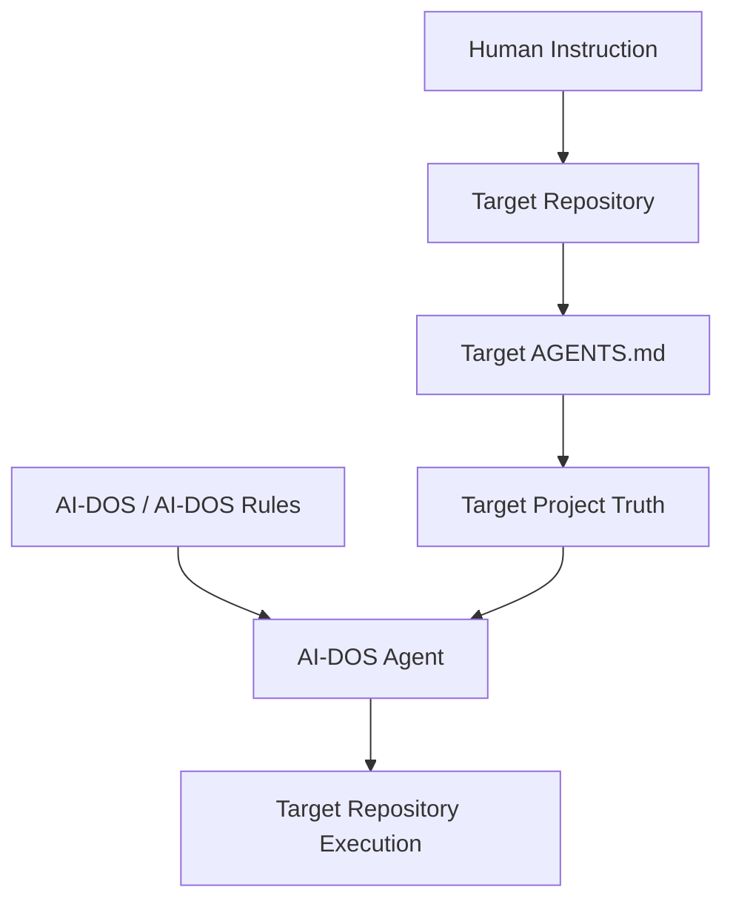
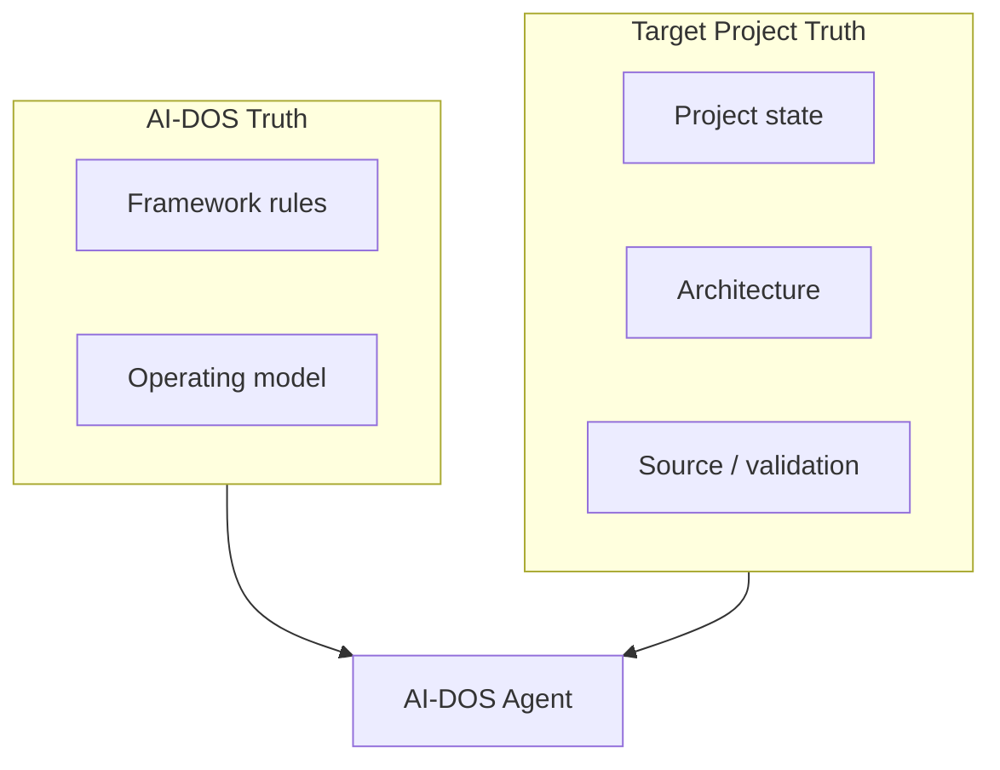
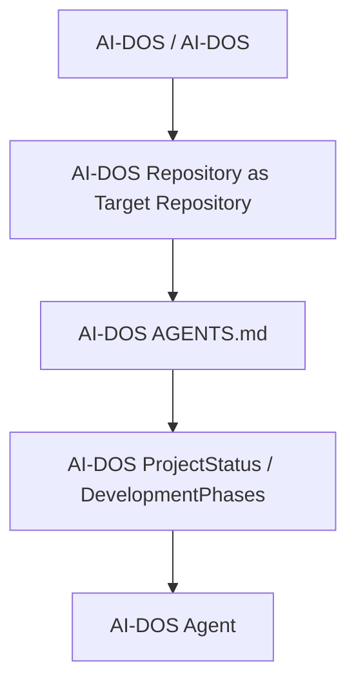
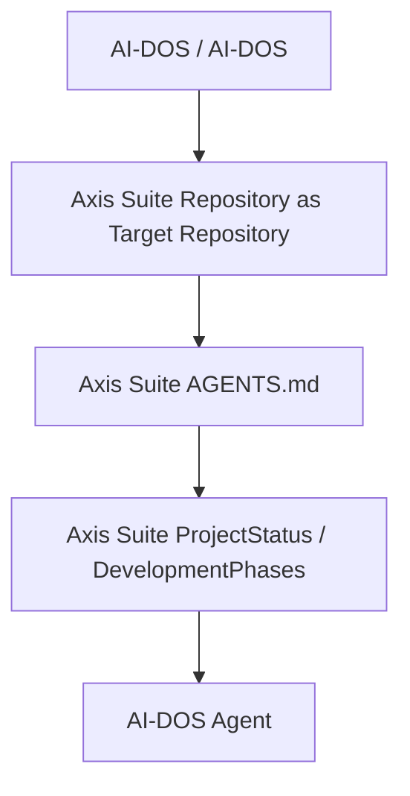

# A.2 — AI-DOS / Target Repository Operational Boundary

>AI-DOS v3 · Framework Core Architecture Specification
> Phase A — Framework Core · Stage A.2

---

## Document Metadata

| Field | Value |
|:---|:---|
| Identifier | `AI-DOS.V2.ARCH-002` |
| Title | A.2 — AI-DOS / Target Repository Operational Boundary |
| Version | 0.1.0-draft |
| Status | Draft |
| Canonical Status | Non-canonical until reviewed, approved, and promoted through Framework Governance |
| Classification | Framework Core |
| Document Type | Architecture Specification |
| Owner | Framework Governance |
| Maintainers | Framework Architecture Team |
| Review Authority | Enterprise Documentation Standards Board |
| Approval Authority | Human Governance / Framework Governance |
| Created | 2026-07-10 |
| Last Updated | 2026-07-10 |
| Lifecycle Phase | Draft |
| Traceability ID | AI-DOS.V2.ARCH-002 |
| Scope | Repository-agnostic operational boundary betweenAI-DOS / AI-DOS, an active Target Repository, and the AI-DOS Agent that consumes both |
| Out of Scope | Implementation, Runtime implementation design, Engine implementation design, AGENTS syntax, repository adapters, connectors, installation, schemas, configuration formats, new governance layers, repository cleanup, repository audit, ProjectStatus updates, and DevelopmentPhases updates |
| Normative Authority | Human Governance; `AGENTS.md`; `docs/AI/GOVERNANCE.md`; `docs/AI/FrameworkGovernance.md`; `docs/AI/Architecture/Constitution/A.1-Constitution.md` |
| Normative References | `docs/AI/Architecture/Standards/STD-010-Document-Metadata-Standard.md`; `docs/AI/Architecture/Standards/STD-003-Terminology-Standard.md`; `docs/AI/Architecture/Standards/STD-000-Framework-Standards.md`; `docs/AI/Meta/M.0-Framework-Meta-Model.md`; `docs/AI/Meta/M.1-Artifact-Meta-Model.md`; `docs/AI/Architecture/RFC/Runtime/A.3-Runtime-Architecture-RFC.md`; `docs/AI/Architecture/RFC/EnginePlatform/A.4-Engine-Architecture-RFC.md` |
| Dependencies | A.1 Constitution, Governance Atlas, Framework Governance, Meta Models, Framework Standards, Runtime Architecture, Engine Architecture, Operational Core, System Layer, Target Repository boot declarations, ProjectStatus, DevelopmentPhases, protected-area declarations, and validation context |
| Consumes | A.1 constitutional authority invariants, M.0 Framework concepts, M.1 Artifact concepts, STD-000 standards model, STD-003 terminology, STD-010 metadata, A.3 Runtime Architecture, A.4 Engine Architecture, System Layer procedures, Target Project Path Resolution findings, and repository rationalization audit context |
| Produces | Operational boundary model, Framework truth and project truth separation, Target Repository resolution model, self-hosting model, external target model, responsibility matrix, authority matrix, design invariants, and stop conditions |
| Related Specifications | `docs/AI/AIFramework.md`; `docs/AI/AIOrchestrator.md`; `docs/AI/AgentSystemPrompt.md`; `docs/AI/System/README.md`; `docs/AI/System/AuthorityModel.md`; `docs/AI/System/BootSequence.md`; `docs/AI/System/SourceOfTruth.md`; `docs/AI/System/ContextAssembly.md`; `docs/AI/System/DecisionModel.md`; `docs/AI/System/ExecutionSequence.md`; `docs/AI/System/SystemLayerFreeze.md`; `docs/AI/Architecture/Reports/Target-Project-Path-Resolution.md`; `docs/AI/Architecture/Reports/AI-DOS-Repository-Rationalization-Audit.md` |
| Supersedes | None |
| Superseded By | None |
| Promotion Requirements | Framework Governance review, approval, traceability validation, metadata validation, terminology validation, architecture consistency validation, and explicit promotion |
| Certification Status | Not certified |

---

## 1. Executive Summary

This document defines the permanent operational boundary betweenAI-DOS / AI-DOS, an active Target Repository, and the AI-DOS Agent that consumes both. It establishes the repository-agnostic operating model in whichAI-DOS / AI-DOS provides general Framework operating rules, the Target Repository provides project truth, and the AI-DOS Agent resolves and consumes both without becoming a new source of truth.

The boundary is architectural, not implementation-specific. It does not define AGENTS syntax, configuration formats, schemas, adapters, connectors, APIs, registries, installation procedures, Runtime implementation, or Engine implementation.

The core decision is simple:AI-DOS / AI-DOS owns Framework truth; the Target Repository owns project truth; the AI-DOS Agent applies both inside an authorized task boundary.

**Figure 1 — General Operating Model.**

## 2. Purpose

The purpose of A.2 is to define whereAI-DOS / AI-DOS ends and where the Target Repository begins. This document bridges A.1 Constitution and A.3 Runtime Architecture by declaring the immutable ownership, authority, information, and execution boundaries that the Runtime must respect.

A.2 exists soAI-DOS can operate on itself or on an external repository such as Axis Suite without confusing Framework truth with project truth.

## 3. Scope

This document is in scope for:

- DefiningAI-DOS / AI-DOS as the general operating system for AI-assisted repository work.
- Defining Target Repository ownership of project-specific truth.
- Defining the AI-DOS Agent as a consumer and executor, not an owner of truth.
- DefiningAI-DOS self-hosting as a specialization of the same model.
- Defining external Target Repository operation without AI-DOS-specific fallback paths.
- Defining logical path concepts at an architecture level only.
- Defining responsibility, authority, invariants, stop conditions, and relationship to adjacent architecture.

## 4. Normative Position

This document consumes existing authority. It does not redefine Human Governance, the AGENTS.md bootloader, the Governance Atlas, Framework Governance, the Constitution, Meta Models, Standards, Runtime Architecture, Engine Architecture, Operational Core, System Layer, Commands, Workflows, Templates, ProjectStatus, or DevelopmentPhases.

STD-010 governs this document metadata. STD-003 governs terminology. A.1 governs constitutional authority invariants. A.3 and A.4 operate within the A.2 boundary and do not replace it.

## 5. AI-DOS Definition

AI-DOS / AI-DOS is the general operating system for AI-assisted repository work. It provides Framework-level operating rules and reusable architectural assets that can be consumed by a AI-DOS Agent while operating against a selected Target Repository.

AI-DOS / AI-DOS provides:

- Constitution.
- Governance.
- Meta Models.
- Framework Standards.
- Runtime Architecture.
- Engine Architecture.
- System Layer.
- Operational Core.
- Commands.
- Workflows.
- Templates.
- Validation Model.
- Review Model.
- Certification Model.

AI-DOS / AI-DOS does not own target-project truth, target-project source code, target-project operational state, or target-project-specific governance decisions.

## 6. Target Repository Definition

A Target Repository is the active repository selected as the subject of work. It is the source of project truth for the task. It provides repository-local authority routing, planning state, architecture, implementation context, protected-area rules, and validation context.

A Target Repository provides:

- Root `AGENTS.md`.
- Project-specific instructions.
- ProjectStatus.
- DevelopmentPhases.
- Roadmap.
- Phase / stage / capability state.
- Project architecture.
- Source code.
- Implementation state.
- Project runtime configuration.
- Validation commands.
- Protected and frozen areas.

The Target Repository does not ownAI-DOS constitutional principles, Framework Standards, Runtime Architecture, Engine Architecture, System Layer, or general operating model.

## 7. AI-DOS Agent Definition

The AI-DOS Agent is the execution participant that resolves, consumes, combines, and appliesAI-DOS / AI-DOS rules and Target Repository project truth inside an authorized task boundary.

The AI-DOS Agent consumes:

-AI-DOS general operating rules.
- Target Repository project truth.

The AI-DOS Agent produces:

- Project-scoped planning.
- Execution.
- Validation.
- Review.
- Completion evidence.

The AI-DOS Agent owns neither Framework truth nor project truth. It does not certify, promote, canonicalize, or invent missing target-project truth.

## 8. Operational Boundary

The operational boundary separates three concerns:

1.AI-DOS / AI-DOS defines general Framework conduct.
2. The Target Repository defines project-specific state and resources.
3. The AI-DOS Agent applies the relevant authorities within the active task boundary.

Neither side replaces the other.AI-DOS rules govern how work is conducted; Target Repository truth governs what the project is, what state it is in, which files and areas are protected, and which validation commands apply.

**Figure 2 — Ownership Boundary.**

## 9. Responsibility and Ownership Model

AI-DOS / AI-DOS owns Framework truth, constitutional principles, Framework governance model, Framework standards, Runtime architecture definitions, Engine architecture definitions, System Layer procedures, general commands, general workflows, reusable templates, and general validation, review, and certification models.

AI-DOS / AI-DOS does not own target-project ProjectStatus, DevelopmentPhases, roadmap, architecture, implementation, source code, runtime state, validation commands, protected areas, or project-specific governance decisions.

The Target Repository owns its repository boot entry, project-specific authority routing, planning resources, active operational state, project architecture, source and implementation, validation commands, constraints, frozen areas, and project-specific decisions.

The AI-DOS Agent owns execution accountability for the assigned task only. It owns neither side's truth.

## 10. Framework Truth

Framework truth is the set ofAI-DOS / AI-DOS authorities, standards, models, and reusable procedures that govern general AI-assisted work. Framework truth includes the Constitution, Governance Atlas, Framework Governance, Meta Models, Framework Standards, Runtime Architecture, Engine Architecture, System Layer, Operational Core, Commands, Workflows, Templates, and general validation, review, and certification models.

Framework truth defines conduct, structure, and reusable architecture. It does not define the active state of an external Target Repository.

## 11. Project Truth

Project truth is the Target Repository's repository-local state and authority context. It includes root `AGENTS.md`, project-specific instructions, ProjectStatus, DevelopmentPhases, roadmap, phase / stage / capability state, project architecture, source code, implementation state, project runtime configuration, validation commands, protected areas, frozen areas, and project-specific decisions.

Project truth defines the current project reality. It does not redefineAI-DOS Framework truth.

## 12. Authority Boundary

Higher Framework authority governs how work is conducted. Target-project authority governs project-specific truth. When both apply, the AI-DOS Agent must preserve single ownership:

- Framework rules constrain process, governance, terminology, validation expectations, review expectations, and certification meaning.
- Target Repository rules constrain project state, paths, source code, protected areas, validation commands, and project-specific decisions.
- Conflicts are not merged silently. They are reported through the applicable escalation or blocker process.

## 13. Information Ownership

Information ownership follows origin and scope. AI-DOS-originated Framework information remains Framework truth. Target Repository-originated project information remains project truth. Completion evidence produced by the AI-DOS Agent belongs to the task record and must not be treated as a new source of project truth unless accepted by the Target Repository's authority process.

The AI-DOS Agent may assemble context from both sides, but assembled context is not a third authority layer.

## 14. Logical Path Concepts

The following logical concepts are architecture-level placeholders used to describe boundary resolution:

| Logical Concept | Meaning |
|:---|:---|
| `<TARGET_REPOSITORY_ROOT>` | The explicitly selected root of the active Target Repository. |
| `<TARGET_AGENTS_PATH>` | The Target Repository boot entry path, resolved under `<TARGET_REPOSITORY_ROOT>`. |
| `<PROJECT_STATUS_PATH>` | The Target Repository project-status resource, resolved under `<TARGET_REPOSITORY_ROOT>`. |
| `<DEVELOPMENT_PHASES_PATH>` | The Target Repository roadmap / development-phases resource, resolved under `<TARGET_REPOSITORY_ROOT>`. |
| `<PROJECT_ARCHITECTURE_PATH>` | Target-project architecture resources, resolved under `<TARGET_REPOSITORY_ROOT>`. |
| `<SOURCE_ROOT>` | Target-project source location, resolved under `<TARGET_REPOSITORY_ROOT>`. |
| `<VALIDATION_COMMANDS>` | Target-project validation commands or references declared by the Target Repository. |
| `<PROTECTED_AREAS>` | Target-project protected and frozen areas declared by the Target Repository. |

These concepts do not define syntax, YAML, JSON, schemas, environment variables, implementation classes, adapters, registries, APIs, or configuration formats.

## 15. Target Repository Resolution Flow

The AI-DOS Agent must use the following operating flow:

1. Select the active Target Repository.
2. Locate and read `<TARGET_REPOSITORY_ROOT>/AGENTS.md`.
3. Resolve target-project resource declarations.
4. Resolve all target-project paths relative to `<TARGET_REPOSITORY_ROOT>`.
5. Read target ProjectStatus.
6. Read target DevelopmentPhases.
7. Load relevantAI-DOS authorities and operating rules.
8. Load target-project architecture, source, protected-area, and validation context.
9. Assemble the task context.
10. Determine the authorized action.
11. Execute inside the Target Repository.
12. Validate using target-project commands.
13. Review according toAI-DOS and target-project rules.
14. Produce completion evidence.

If the Target Repository does not provide required project declarations, the AI-DOS Agent must stop and report a blocker.AI-DOS self-hosting paths must never be used as fallback paths for an external Target Repository.

## 16.AI-DOS Self-Hosting Model

AI-DOS itself is a valid Target Repository. Self-hosting is a specialization of the same operating model, not a separate architecture.

**Figure 3 — Self-Hosting Model.**

ForAI-DOS self-hosting:

| Logical Concept | Self-Hosting Mapping |
|:---|:---|
| `<TARGET_REPOSITORY_ROOT>` |AI-DOS repository root |
| `<TARGET_AGENTS_PATH>` | `AGENTS.md` |
| `<PROJECT_STATUS_PATH>` | `docs/Projects/ForgeAI/Planning/ProjectStatus.md` |
| `<DEVELOPMENT_PHASES_PATH>` | `docs/Projects/ForgeAI/Planning/DevelopmentPhases.md` |

These paths are valid self-hosting mappings only. They are not universal Target Repository paths.

## 17. External Target Repository Model

WhenAI-DOS operates on an external repository such as Axis Suite, the external repository is the Target Repository and owns its project truth.

**Figure 4 — External Repository Model.**

AI-DOS must not assume that Axis Suite or any other external Target Repository usesAI-DOS physical planning paths. Target-project resources must be declared by the active Target Repository and resolved relative to that repository root.

This document does not define Axis Suite project paths or Axis Suite final `AGENTS.md` content.

## 18. AI-DOS Agent Consumption Model

The AI-DOS Agent consumes Framework truth and project truth as separate authority streams. It may combine them into a task context, but it must not merge ownership or treat one stream as a fallback for the other.

The AI-DOS Agent consumption model is:

1. UseAI-DOS / AI-DOS to determine general operating rules.
2. Use the Target Repository to determine project-specific truth.
3. Apply both inside the task's authorized boundary.
4. Validate and review according to both sets of applicable rules.
5. Produce completion evidence without promoting that evidence into authoritative project truth.

## 19. Execution Context Model

The execution context is the assembled set of applicable instructions, authorities, state records, source context, protected-area rules, and validation expectations. It is task-scoped and temporary.

The execution context must include enough information to determine:

- The active Target Repository root.
- The applicable Target Repository boot instructions.
- The current project phase, stage, objective, and protected areas.
- The applicableAI-DOS authorities.
- The relevant project architecture and source context.
- The authorized action.
- The validation and review expectations.

The execution context does not become a durable authority or source of truth.

## 20. Responsibility Matrix

| Capability / Responsibility |AI-DOS / AI-DOS | Target Repository | AI-DOS Agent |
|:---|:---|:---|:---|
| Human Governance | Owner of final Framework authority | May identify project-specific human authority | Consumes and escalates to the applicable authority |
| Constitution | Owns | Does not own | Consumes |
| Framework Governance | Owns | Does not own | Consumes |
| Meta Models | Owns | Does not own | Consumes |
| Framework Standards | Owns | Does not own | Consumes |
| Runtime Architecture | Owns general definition | Does not own AI-DOS Runtime definition | Consumes and operates within it |
| Engine Architecture | Owns general definition | Does not own AI-DOS Engine definition | Consumes and operates within it |
| System Layer | Owns general procedures | Does not own AI-DOS System Layer | Consumes |
| Operational Core | Owns general model | Does not own AI-DOS Operational Core | Consumes |
| Commands | Owns general command model and templates | Owns project-specific command availability and constraints | Consumes and applies |
| Workflows | Owns general workflow model and templates | Owns project-specific workflow constraints | Consumes and applies |
| Templates | Owns reusable templates | Owns project-specific template use or local variants | Consumes |
| Validation Model | Owns general validation model | Owns project validation commands and expected checks | Applies and reports evidence |
| Review Model | Owns general review model | Owns project-specific review requirements | Applies and reports evidence |
| Certification Model | Owns certification meaning and model | Owns project-specific certification records when applicable | Does not certify; reports evidence |
| Root AGENTS.md | Does not own external target boot file | Owns | Reads and follows |
| ProjectStatus | Does not own target ProjectStatus | Owns | Reads; does not update unless authorized |
| DevelopmentPhases | Does not own target DevelopmentPhases | Owns | Reads; does not update unless authorized |
| Roadmap | Does not own target roadmap | Owns | Consumes |
| Phase / Stage / Capability | Does not own target operational state | Owns | Consumes |
| Project Architecture | Does not own target architecture | Owns | Consumes and may edit only when authorized |
| Source Code | Does not own target source code | Owns | May edit only within task authority |
| Implementation State | Does not own target implementation state | Owns | Consumes and reports changes |
| Runtime Configuration | Does not own target runtime configuration | Owns | Consumes or edits only when authorized |
| Validation Commands | Does not own target validation commands | Owns | Runs and reports results |
| Protected Areas | Does not own target protected areas | Owns | Preserves and reports blockers |
| Context Assembly | Owns general context assembly model | Owns target context inputs | Performs task-scoped assembly |
| Decision Selection | Owns general decision principles | Owns project-specific state constraints | Selects authorized action within boundaries |
| Execution | Defines general execution conduct | Owns repository execution surface | Performs authorized execution |
| Completion Reporting | Owns general evidence expectations | Owns project-specific report requirements | Produces completion evidence |

## 21. Authority Matrix

| Domain | General Authority | Target-Project Authority | Resolution Rule |
|:---|:---|:---|:---|
| Framework rules |AI-DOS / AI-DOS authorities | Target Repository may add local constraints | Framework authority governs conduct; local constraints narrow execution. |
| Repository boot | AGENTS.md bootloader concept | Target root `AGENTS.md` | Read target boot instructions as the project-to-AI-DOS entry boundary. |
| Project status | ProjectStatus concept and handling rules | Target ProjectStatus | Target ProjectStatus owns active project state. |
| Project roadmap | DevelopmentPhases concept and sequencing rules | Target DevelopmentPhases / roadmap | Target roadmap owns project sequencing; Framework rules prohibit unauthorized skipping. |
| Architecture | AI-DOS architecture for Framework domains | Target project architecture | Use AI-DOS architecture for Framework behavior and target architecture for project truth. |
| Implementation | Framework execution conduct | Target source and implementation state | Execute only within target authorization and protected-area rules. |
| Validation | General validation model | Target validation commands | Run target commands and apply Framework reporting expectations. |
| Review | General review model | Target review requirements | Satisfy both without treating review as approval. |
| Certification | General certification model | Target certification records when present | Do not self-certify; report evidence for authorized certification process. |
| Frozen areas | General protected-area respect rule | Target protected and frozen areas | Target declarations govern file access; ambiguity is a blocker. |
| Conflict resolution | Human Governance and Framework Governance | Target project authority chain | Do not merge conflicting authorities; escalate or report blocker. |

## 22. Design Invariants

1.AI-DOS never owns Target Repository project truth.
2. Target Repository never ownsAI-DOS Framework truth.
3. AI-DOS Agent does not become a new source of truth.
4. AI-DOS Agent combines authorities but does not merge conflicting ownership.
5. The active Target Repository root must be explicitly established.
6. Target-project paths must resolve relative to the active Target Repository root.
7. Target Repository `AGENTS.md` is the project-to-AI-DOS entry boundary.
8.AI-DOS self-hosting paths are valid only whenAI-DOS is the Target Repository.
9. External Target Repositories must declare their own planning, architecture, source, validation, and protected-area resources.
10.AI-DOS self-hosting is not a parallel system.
11. Self-hosting and external operation use the same architectural model.
12. No external project may silently inherit AI-DOS-specific planning paths.
13. No new adapter, registry, schema, or implementation layer is required to establish this boundary.
14. The boundary must remain deterministic, repository-agnostic, and single-owner.
15. Missing target-project declarations produce a blocker, never an inferred fallback.

## 23. Failure and Stop Conditions

The AI-DOS Agent must stop when:

- The active Target Repository cannot be identified.
- Target `AGENTS.md` is missing.
- Required project-resource declarations are missing.
- Declared paths cannot be resolved.
-AI-DOS self-hosting paths are being applied to an external Target Repository.
- Framework truth and project truth are treated as interchangeable.
- Ownership conflicts cannot be resolved.
- Protected-area rules are unavailable.
- Validation commands are unavailable for an implementation task.

The AI-DOS Agent must report the missing information and must not invent target-project truth.

## 24. Relationship to A.1 Constitution

A.1 Constitution defines permanent principles, constitutional authority, source-of-truth expectations, governance principles, decision principles, evidence principles, and architectural invariants. A.2 consumes those principles and applies them to the operational boundary betweenAI-DOS / AI-DOS and a Target Repository.

A.2 does not amend, supersede, or redefine A.1.

## 25. Relationship to A.3 Runtime Architecture

A.3 Runtime Architecture defines runtime architecture operating within the A.2 boundary. Runtime coordination must respect thatAI-DOS owns Framework truth, the Target Repository owns project truth, and the AI-DOS Agent does not become a source of truth.

A.2 does not define Runtime implementation or Runtime component design.

## 26. Relationship to A.4 Engine Architecture

A.4 Engine Architecture defines Engine architecture operating within the Runtime and within the A.2 boundary. Engine specialization must respect that Framework truth and project truth remain separately owned and that Engines do not acquire ownership of Target Repository project truth.

A.2 does not define Engine implementation or Engine component design.

## 27. Relationship to Operational Core

The Operational Core consumes and operationalizes this boundary through general procedures, commands, workflows, validation expectations, review expectations, and completion evidence patterns.

The Operational Core does not redefine Framework truth, project truth, or Target Repository ownership.

## 28. Relationship to System Layer

The System Layer consumes this boundary through authority handling, boot sequence behavior, source-of-truth handling, context assembly, decision handling, execution sequencing, and freeze rules.

The System Layer does not replace Target Repository declarations and must not useAI-DOS self-hosting paths as external-repository fallbacks.

## 29. Future Extension Principles

Future work may define:

- Target Repository AGENTS declaration guidance.
- External repository connection procedures.
- Axis Suite pilot preparation.
- Tooling-specific integration.

Future work must not:

- Change the ownership boundary.
- MakeAI-DOS own project truth.
- Make Target Repository own Framework truth.
- Introduce parallel boot models.
- Create AI-DOS-specific universal project paths.

## 30. Out of Scope

This document does not define:

- Final AGENTS.md syntax.
- YAML or JSON structures.
- Machine-readable schemas.
- Adapters.
- Connectors.
- Installation commands.
- Repository discovery implementation.
- Path-resolution implementation code.
- CLI commands.
- Runtime implementation.
- Engine implementation.
- Axis Suite project paths.
- Axis Suite final `AGENTS.md`.
- ProjectStatus updates.
- DevelopmentPhases updates.
- Repository cleanup actions.
- Audit amendments.

## 31. Architectural Decision

A.2 establishes the repository-agnostic operational boundary forAI-DOS / AI-DOS:

-AI-DOS / AI-DOS provides the general operating system.
- The Target Repository provides project truth.
- The AI-DOS Agent consumes both and performs authorized work inside the Target Repository.
- Neither side replaces the other.
- Self-hosting and external repository operation use the same architectural model.
- Missing target-project declarations are blockers, not opportunities for inferred fallback.

## 32. Completion Criteria

This document is complete when it provides:

- STD-010 metadata.
- A clear AI-DOS definition.
- A clear Target Repository definition.
- A clear AI-DOS Agent definition.
- A clear operational boundary.
- Responsibility and authority matrices.
- Logical path concepts without syntax or implementation design.
- Target Repository resolution flow.
- Self-hosting and external-target models.
- Design invariants.
- Failure and stop conditions.
- Relationships to A.1, A.3, Operational Core, and System Layer.
- Explicit out-of-scope boundaries.

## 33. Version History

| Version | Date | Author | Description |
|:---|:---|:---|:---|
| 0.1.0-draft | 2026-07-10 | Framework Architecture Team | Initial draft defining the AI-DOS / Target Repository operational boundary. |
