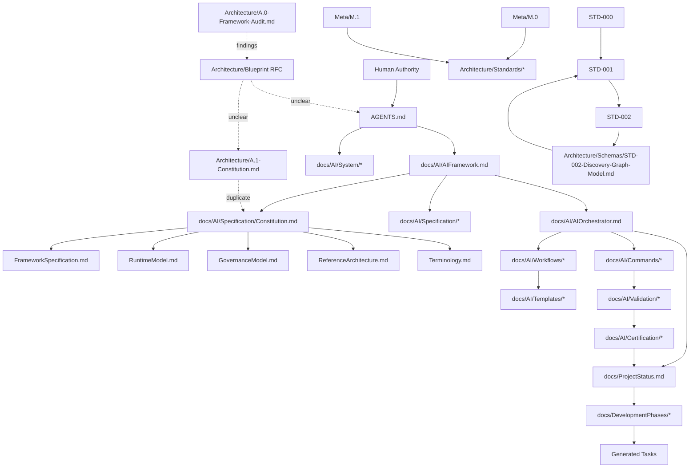

#AI-DOS Architecture Consistency Audit v1.0

## 1. Audit Identification

| Field | Value |
| --- | --- |
| Audit |AI-DOS Architecture Consistency Audit v1.0 |
| Mode | Audit-only documentation report |
| Date | 2026-07-07 |
| Scope |AI-DOS documentation architecture |
| Output | `docs/AI/Architecture/Reports/AI-DOS-Architecture-Consistency-Audit-v1.0.md` |
| Verdict | REQUIRES FOLLOW-UP |

## 2. Executive Summary

AI-DOS currently exists as a platform-independent, documentation-driven AI Development Operating System with a substantial AI Framework documentation layer. The repository contains a coherent constitutional intent, but the architecture is fragmented across three generations of documents:

1. root bootstrap and operational authority documents;
2. RC2 specification and system documents under `docs/AI/Specification/` and `docs/AI/System/`;
3. newer architecture, meta-model, standards, blueprint, and RFC documents under `docs/AI/Architecture/` and `docs/AI/Meta/`.

The strongest current architecture is the authority principle: documentation governs implementation, planning precedes execution, validation precedes completion, and review/certification precede state update. The weakest current architecture is document ownership: several concepts are defined in more than one place, directory status is not explicit, and the Blueprint/standards layer is not fully reconciled with the RC2 framework layer.

The audit verdict is **REQUIRES FOLLOW-UP**.AI-DOS is valuable and directionally coherent, but it needs authority cleanup before further runtime or standards expansion.

## 3. Audit Scope

### In Scope

- Framework identity and authority chain.
- Directory ownership and canonicality.
- Concept ownership and duplicate definitions.
- Dependency graph and broken references.
- Runtime and standards readiness.
- Blueprint/repository reality alignment.
- Safe refactor recommendations.

### Out of Scope

- Implementing refactors.
- Moving, renaming, deleting, or normalizing existing files.
- Updating `docs/ProjectStatus.md`.
- Creating new standards or runtime architecture.
- Certifying the architecture as complete.

## 4. Required Reading

The audit inspected the required minimum inputs:

- `AGENTS.md`
- `docs/ProjectStatus.md`
- `docs/AI/FrameworkGovernance.md`
- `docs/AI/README.md`
- `docs/AI/AIFramework.md`
- `docs/AI/AIOrchestrator.md`
- `docs/AI/AgentSystemPrompt.md`
- `docs/AI/Architecture/Blueprint/AI-DOS-Blueprint-v1.0-RFC.md`
- `docs/AI/Architecture/A.0-Framework-Audit.md`
- `docs/AI/Architecture/A.1-Constitution.md`
- `docs/AI/Meta/M.0-Framework-Meta-Model.md`
- `docs/AI/Meta/M.1-Artifact-Meta-Model.md`
- `docs/AI/Architecture/Standards/STD-000-Framework-Standards.md`
- `docs/AI/Architecture/Standards/STD-001-Knowledge-Graph-Standard.md`
- `docs/AI/Architecture/Standards/STD-002-Discovery-Standard.md`
- `docs/AI/Architecture/Schemas/STD-002-Discovery-Graph-Model.md`
- all files under `docs/AI/Specification/`
- all files under `docs/AI/System/`
- all files under `docs/AI/Commands/`
- all files under `docs/AI/Workflows/`
- all files under `docs/AI/Validation/`
- all files under `docs/AI/Certification/`
- all files under `docs/AI/Templates/`
- all files under `docs/DevelopmentPhases/`

Additional repository inspection found existing sibling areas not listed in the minimum scope, including `docs/AI/Lifecycle/`, `docs/AI/Testing/`, `docs/AI/Tooling/`, `docs/AI/Checklists/`, `docs/AI/ROADMAP/`, and `docs/AI/Architecture/Standards/Reports/`.

## 5. Architecture Identity

### WhatAI-DOS is today

AI-DOS is currently best described as:

> a platform-independent, documentation-driven AI Development Operating System implemented as an authoritative documentation framework, with emerging architecture standards, meta-model, knowledge graph, discovery, and future runtime ambitions.

It is not currently a concrete executable runtime framework. It has runtime documentation and runtime templates, but no implemented runtime kernel, engine layer, or executable agent runtime in the audited scope.

### Classification

| Candidate Identity | Current Status | Evidence-Based Assessment |
| --- | --- | --- |
| Documentation framework | Yes | The repository is primarily documentation-governed and documentation-producing. |
| AI Development Operating System | Yes, aspirational and canonical | Defined by root authority and repeated in framework documents. |
| Standards library | Emerging | STD-000 through STD-002 and schemas exist, but are not fully reconciled with RC2. |
| Runtime framework | Planned/documented, not implemented | Runtime model and templates exist; executable runtime architecture is not yet real. |
| All of these | Partially | It is all of these by vision, but only documentation framework and AI development OS are currently mature enough to call canonical. |

### Identity Owner

Primary identity owner: `AGENTS.md`.

Supporting identity documents:

- `docs/AI/AIFramework.md` — master AI Framework identity and RC2 map.
- `docs/AI/Specification/Constitution.md` — framework mission, philosophy, objectives, invariants.
- `docs/AI/Architecture/Blueprint/AI-DOS-Blueprint-v1.0-RFC.md` — broader architectural vision/RFC, but not fully reconciled as canonical authority.

## 6. Authority Chain Analysis

### Declared authority chains

Multiple authority chains exist:

1. Root bootstrap chain:

```text
AGENTS.md
    ↓
docs/AI/AIFramework.md
    ↓
docs/AI/Specification/Constitution.md
    ↓
docs/AI/AIOrchestrator.md
    ↓
docs/AI/FrameworkGovernance.md
    ↓
docs/ProjectStatus.md
    ↓
docs/Projects/ForgeAI/Planning/DevelopmentPhases.md
    ↓
Current Phase Document
    ↓
Current Stage Document
    ↓
Current Capability Document
    ↓
Generated Task
```

2. Framework Governance chain:

```text
AGENTS.md
    ↓
AI Framework Constitution
    ↓
Framework Governance
    ↓
Project Status
    ↓
Phase Documents
    ↓
Stage Documents
    ↓
Capability Documents
    ↓
Implementation Reports
```

3. Orchestrator chain:

```text
Human Authority
    ↓
AGENTS.md
    ↓
docs/AI/AIFramework.md
    ↓
Development Constitution
    ↓
Framework Governance
    ↓
ProjectStatus.md
    ↓
Phase
    ↓
Stage
    ↓
Historical Capability
    ↓
Generated Task
```

4. System-layer procedure chain: `AGENTS.md` as tool-facing authority, with operating procedures below it.

### Canonical constitution determination

The canonical constitution for current operational work is **`docs/AI/Specification/Constitution.md` under the authority of `AGENTS.md` and `docs/AI/AIFramework.md`**.

However, duplicate constitutional authority exists because:

- `AGENTS.md` acts as bootstrap constitution and says it wins conflicts.
- `docs/AI/Specification/Constitution.md` is titled AI Framework Constitution and is in the declared RC2 authority chain.
- `docs/AI/Architecture/A.1-Constitution.md` is also titled Constitution and appears to be a newer/architecture-series constitutional artifact.
- `docs/AI/FrameworkGovernance.md` contains principles it calls constitutional invariants.
- `docs/AI/AgentSystemPrompt.md` restates operational constitutional rules for tools.

### Authority conflicts

| Conflict | Documents | Severity | Finding |
| --- | --- | --- | --- |
| Duplicate Constitution titles | `docs/AI/Specification/Constitution.md`, `docs/AI/Architecture/A.1-Constitution.md`, `AGENTS.md` | High | There is no single explicit deprecation or precedence note between RC2 Constitution and A.1 Constitution. |
| Different authority chain wording | `AGENTS.md`, `FrameworkGovernance.md`, `AIOrchestrator.md` | Medium | Chains are compatible in spirit but not identical in document names or ordering. |
| Blueprint authority unclear | Blueprint vs RC2 docs | Medium | Blueprint appears visionary/RFC but may be read as architecture authority. |
| ProjectStatus vs expanded architecture | `ProjectStatus.md` vs Architecture/Standards documents | Medium | ProjectStatus still reports Historical Capability 0 and next Framework Generalization while repository contains post-RC2 architecture/standards work. |
| Tool-facing prompt duplication | `AgentSystemPrompt.md`, `System/*`, `AGENTS.md` | Medium | Operational rules are repeated across bootstrap, prompt, and system procedures. |

## 7. Directory Ownership Analysis

| Directory | Purpose | Owner | Authority Level | Consumers | Produced Artifacts | Classification |
| --- | --- | --- | --- | --- | --- | --- |
| `docs/AI/Architecture/` | Architecture-series audits, constitution, appendix, schemas, standards, blueprint | Architecture System, unclear canonical integration | High if adopted, currently transitional | Standards, meta, future runtime, governance | Architecture audit docs, constitutional docs, standards, schemas | Transitional / partially canonical |
| `docs/AI/Architecture/Blueprint/` | Long-formAI-DOS Blueprint RFC | Architecture/RFC process | Visionary, not clearly canonical | Architecture planning, standards, future runtime | Blueprint RFC | Transitional RFC |
| `docs/AI/Architecture/Appendix/` | Appendix/supporting architecture material | Architecture System | Supporting | Architecture readers | Appendix records | Supporting / unclear |
| `docs/AI/Architecture/Schemas/` | Formal or semi-formal schema/model docs | Standards System | Standard-dependent | Discovery, KG, validation | Discovery graph model | Canonical if tied to STD; otherwise unclear |
| `docs/AI/Architecture/Standards/` | Framework standards STD-000+ | Standards System | Emerging canonical standards | Discovery, graph, tooling, validation | Standards docs | Emerging canonical / fragmented |
| `docs/AI/Meta/` | Meta-model for framework/artifacts | Meta-Model System | Foundational but not integrated into RC2 chain | Standards, architecture, registry, discovery | Meta-model docs | Emerging canonical / transitional |
| `docs/AI/Specification/` | RC2 core framework specification modules | AI Framework Specification System | Canonical under `AIFramework.md` | System, commands, workflows, validation, templates | Constitution, framework spec, governance model, runtime model, reference architecture, terminology | Canonical RC2 |
| `docs/AI/System/` | Tool-facing operating procedures | AI System Operating Layer | Operational canonical under `AGENTS.md` | Agents, commands, workflows | Boot, authority, source-of-truth, context, execution procedures | Operational canonical |
| `docs/AI/Templates/` | Reusable output structures | Template System | Template-only; not architecture authority | Commands, workflows, projects, agents, adapters | Template documents | Template-only canonical where referenced |
| `docs/AI/Commands/` | Command execution procedures | Command System | Operational canonical | Agents, orchestrator, workflows | Task/audit/implementation/documentation/bug-fix commands | Operational canonical |
| `docs/AI/Workflows/` | Lifecycle movement procedures | Workflow System | Operational canonical | Orchestrator, commands, ProjectStatus | Task planning, task generation, state update workflows | Operational canonical |
| `docs/AI/Validation/` | Validation model, lifecycle, levels, certification relationship | Validation System | Operational/reference canonical | Review, certification, commands | Validation standards and templates | Canonical but partially duplicate with Certification |
| `docs/AI/Certification/` | Readiness audits and review evidence | Certification/Review System | Evidence/reference, not governing by itself | Governance, validation, future release decisions | Readiness audit, adoption review | Evidence / certification support |
| `docs/DevelopmentPhases/` | Roadmap and phase specs | Planning System | Planning canonical below ProjectStatus | Orchestrator, task planner, commands | Phase index and phase specs | Canonical planning, but status stale/early |

## 8. Concept Ownership Matrix

| Concept | Intended Single Owner | Actual Defining Documents | Status |
| --- | --- | --- | --- |
| Constitution | `docs/AI/Specification/Constitution.md` under `AGENTS.md` | `AGENTS.md`, `docs/AI/Specification/Constitution.md`, `docs/AI/Architecture/A.1-Constitution.md` | DUPLICATE OWNERSHIP |
| Governance | `docs/AI/FrameworkGovernance.md` / `docs/AI/Specification/GovernanceModel.md` split needs clarification | Both define governance | DUPLICATE OWNERSHIP |
| Authority | `AGENTS.md` | `AGENTS.md`, `System/AuthorityModel.md`, `AIOrchestrator.md`, `FrameworkGovernance.md` | DUPLICATE OWNERSHIP with compatible summaries |
| Source of Truth | `docs/AI/System/SourceOfTruth.md` for procedure; `ProjectStatus.md` for live state | `ProjectStatus.md`, `System/SourceOfTruth.md`, `AGENTS.md` | Needs boundary clarification |
| Artifact | `docs/AI/Meta/M.1-Artifact-Meta-Model.md` | Meta docs, templates, standards | DUPLICATE/EMERGING |
| Identity | `AGENTS.md` | `AGENTS.md`, `AIFramework.md`, Blueprint, Constitution | DUPLICATE SUMMARY |
| Lifecycle | `AIOrchestrator.md` / Workflows | `AIOrchestrator.md`, `System/ExecutionSequence.md`, Validation lifecycle, Lifecycle directory | DUPLICATE OWNERSHIP |
| Relationship | `docs/AI/Meta/M.0-Framework-Meta-Model.md` | Meta model, KG standard, discovery graph model | DUPLICATE/DEPENDENT |
| Knowledge Graph | `STD-001-Knowledge-Graph-Standard.md` | STD-001, STD-002 graph model, RuntimeModel | Mostly canonical, dependencies need normalization |
| Standard | `STD-000-Framework-Standards.md` | STD-000, templates, governance | Mostly canonical |
| Discovery | `STD-002-Discovery-Standard.md` | STD-002, STD-002 graph model | Mostly canonical |
| Finding | `STD-002-Discovery-Standard.md` or Audit templates | STD-002, audit reports/templates | DUPLICATE/UNCLEAR |
| Recommendation | Audit/Review templates | STD-002, templates, reports | UNCLEAR |
| Risk | Governance/Validation templates | Many templates and reports | DUPLICATE SUMMARY |
| Evidence | Validation System | Validation docs, meta model, audit/certification docs | DUPLICATE but compatible |
| Registry | Template System until real registry standard exists | Registry templates, standards references | PLANNED/UNCLEAR |
| Workflow | `docs/AI/Workflows/` | Workflows, FrameworkSpecification, AIOrchestrator | ACCEPTABLE SUMMARY plus canonical workflows |
| Runtime | `docs/AI/Specification/RuntimeModel.md` | RuntimeModel, AIOrchestrator, System docs, templates | DOCUMENTED but not implemented |
| Agent | RuntimeModel / System docs | RuntimeModel, AgentSystemPrompt, templates | DUPLICATE/OPERATIONAL |
| Swarm | RuntimeModel / future phase | RuntimeModel, swarm templates, AGENTS.md | PLANNED/UNCLEAR |
| Validation | `docs/AI/Validation/` | Validation docs, GovernanceModel, FrameworkGovernance, commands | Mostly canonical with summaries |
| Review | Checklists/templates/certification docs | Governance, validation certification, templates, checklist | UNCLEAR OWNER |
| Certification | `docs/AI/Validation/ValidationCertification.md` or `docs/AI/Certification/` needs split | Both Validation and Certification dirs | DUPLICATE OWNERSHIP |
| Template | `docs/AI/Templates/` | Templates README, TemplateStandard, AIFramework | Canonical template system |
| Command | `docs/AI/Commands/` | Command docs, AIOrchestrator, FrameworkSpecification | Canonical command system |
| Project State | `docs/ProjectStatus.md` | ProjectStatus, System/SourceOfTruth, ProjectStateUpdater | Canonical with operational support |
| Development Phase | `docs/DevelopmentPhases/` | DevelopmentPhases index, phase files, ProjectStatus | Canonical planning but status needs sync |

## 9. Dependency Graph



### Cycles

- Conceptual cycle: `STD-001` supports graph modeling and `STD-002-Discovery-Graph-Model` depends back on STD-001 while projecting STD-002 outputs into a graph. This is acceptable if explicitly modeled as standard-to-schema dependency, but currently risks appearing circular.
- Certification/state cycle: Validation and certification feed `ProjectStatus.md`, while `ProjectStatus.md` supplies future validation scope. This is intended lifecycle closure, not an architectural defect, if certification boundaries stay clear.

### Reverse dependencies

- Some lower operational documents restate authority and principles rather than only consuming them.
- Templates sometimes define concepts such as authority, ownership, registry, or lifecycle in ways that can be mistaken for source definitions.

### Missing or obsolete dependencies

Repository reference inspection found references to missing or apparently moved paths:

- `docs/DevelopmentPhases/AI-DOS2-DevelopmentPhases.md`
- `docs/AI/Templates/AuditTemplate.md`
- `docs/AI/Templates/SprintTemplate.md`
- `docs/AI/Templates/PhaseTemplate.md`
- `docs/AI/Templates/StageTemplate.md`
- `docs/AI/Templates/CapabilityTemplate.md`
- `docs/AI/Templates/Project/ProjectTemplateArchitecture.md`
- `docs/AI/Templates/Project/TemplateAdoptionChecklist.md`
- `docs/AI/Templates/Project/TemplateBootstrapWorkflow.md`

The actual template layout now places planning templates under `docs/AI/Templates/Planning/` and has `HistoricalCapabilityTemplate.md` instead of a top-level sprint/capability template.

## 10. Duplication Findings

| Documents | Classification | Finding |
| --- | --- | --- |
| `AGENTS.md` and `docs/AI/Specification/Constitution.md` | Acceptable summary if boundaries are explicit | Root file should be bootstrap constitution; RC2 Constitution should be framework constitution. |
| `docs/AI/Specification/Constitution.md` and `docs/AI/Architecture/A.1-Constitution.md` | Must merge or must deprecate one | Two constitution documents create duplicate ownership. |
| `AGENTS.md` and `docs/AI/AgentSystemPrompt.md` | Acceptable operational summary | Prompt should remain tool-facing and explicitly non-canonical. |
| `docs/AI/AIFramework.md` and `docs/AI/README.md` | Acceptable summary | README is directory index; AIFramework is master entry. Some map entries are stale. |
| `docs/AI/Architecture/Blueprint/AI-DOS-Blueprint-v1.0-RFC.md` and `AIFramework.md` | Transitional overlap | Blueprint is broader and newer-looking; must be clearly RFC or promoted into canonical map. |
| `docs/AI/Architecture/A.0-Framework-Audit.md` and this report | Transitional / historical audit | A.0 should be historical once superseded. |
| `docs/AI/FrameworkGovernance.md` and `docs/AI/Specification/GovernanceModel.md` | Must clarify ownership | One should own AI-DOS-project governance and one should own portable framework governance. |
| `docs/AI/Validation/ValidationCertification.md` and `docs/AI/Certification/` | Must clarify | Certification relationship is split between validation standard and certification evidence directory. |
| `docs/AI/System/*` and `AIOrchestrator.md` | Acceptable if System is procedure | Several lifecycle/authority definitions repeat; mark System as tool-facing procedure. |

## 11. Runtime Readiness

| Runtime Component | Status | Finding |
| --- | --- | --- |
| Runtime kernel | Missing | No concrete runtime kernel architecture or implementation found. |
| Engine model | Planned/unclear | Engine concepts are implied by runtime/spec/system docs but not defined as engines. |
| Context engine | Documented as procedure/template | `System/ContextAssembly.md` and context templates exist; no engine architecture. |
| Knowledge engine | Planned/documented | Knowledge layer and templates exist; STD-001 supports graph structure; no engine. |
| Validation engine | Documented as process | Validation docs define lifecycle and levels; no engine implementation. |
| Review engine | Unclear | Review exists as checklist/template/certification relation, not a unified engine. |
| Certification engine | Unclear | Certification exists as standard relationship and evidence directory, not an engine. |
| Memory engine | Planned/documented | RuntimeModel and memory templates exist; no engine architecture. |
| Agent runtime | Documented/planned | Agent lifecycle and prompt exist; no runtime execution architecture. |
| Swarm runtime | Planned | Swarm principles/templates exist; no runtime. |

Conclusion:AI-DOS does **not** currently have a real runtime architecture beyond documentation-level runtime model, operational procedures, and templates.

## 12. Standards Readiness

| Standard | Status | Readiness |
| --- | --- | --- |
| STD-000 Framework Standards | Emerging canonical | Provides standards structure, but needs placement in main authority map. |
| STD-001 Knowledge Graph Standard | Emerging canonical | Strong concept owner for knowledge graph, but integration with RuntimeModel and Meta needs clarification. |
| STD-002 Discovery Standard | Emerging canonical | Useful discovery layer; finding/recommendation/risk ownership overlaps with audit templates. |
| STD-002 Discovery Graph Model | Dependent schema/model | Good projection model, but should be clearly subordinate to STD-001 and STD-002. |
| Planned STD-003+ | Planned/missing | Continuation should wait until authority cleanup prevents fragmentation. |

The standards layer is coherent in intent but fragmented in governance. It should not expand significantly until STD-000 is linked into the canonical authority/document map.

## 13. Blueprint Validation

### Blueprint matches repository reality

-AI-DOS is documentation-first and architecture-first.
- Platform independence is consistently repeated.
- Standards and knowledge graph work exists.
- Runtime, agent, multi-agent, and swarm aspirations exist in phase and template structures.

### Blueprint mismatches repository reality

| Mismatch | Finding |
| --- | --- |
| Blueprint authority | It is an RFC/blueprint but not clearly positioned in the root authority chain. |
| Directory reality | Repository contains RC2 Specification/System layers plus newer Architecture/Meta/Standards layers; Blueprint may imply a cleaner architecture than exists. |
| Runtime status | Blueprint-level runtime ambitions exceed current executable/runtime architecture. |
| Standards status | Standards exist but are not integrated into `AIFramework.md` RC2 specification map. |
| Constitution status | Blueprint/A.1 constitutional material overlaps with RC2 Constitution and root AGENTS. |
| Project status | `ProjectStatus.md` remains at Historical Capability 0 while architecture/standards docs indicate later conceptual work. |
| Templates map | Some documents reference old top-level template paths no longer matching current directory structure. |

## 14. Missing Architecture

The following architecture is missing or insufficiently canonical:

1. A single canonical document map that includes RC2 Specification, Architecture, Meta, Standards, System, Commands, Workflows, Validation, Certification, and Templates.
2. A formal deprecation policy applied to duplicate constitutional documents.
3. A registry of canonical vs legacy vs transitional documents.
4. A runtime architecture separating model, procedure, engine, implementation, and adapter.
5. A review architecture distinct from validation and certification.
6. A certification architecture distinct from validation evidence and readiness audits.
7. A standards governance model linking STD-000 to authority, lifecycle, numbering, schemas, and reports.
8. A directory ownership standard for `Architecture/`, `Meta/`, `Specification/`, and `System/`.
9. A path migration map for moved templates and obsolete references.
10. A ProjectStatus synchronization plan that can record architecture/standards work without retroactively corrupting certified history.

## 15. Risks

| Risk | Severity | Impact |
| --- | --- | --- |
| Duplicate constitution documents | High | Agents may choose different permanent principles. |
| Stale references to missing paths | High | Workflows may route agents to nonexistent templates or phase files. |
| ProjectStatus lag | Medium | Self-planning agents may derive obsolete next work. |
| Blueprint ambiguity | Medium | RFC material may be mistaken for certified canonical architecture. |
| Standards expansion before authority cleanup | Medium | New standards may amplify fragmentation. |
| Runtime terminology without runtime architecture | Medium | Users may assume executable capabilities that do not exist. |
| Certification ownership split | Medium | Validation, review, and certification may be conflated. |
| Directory classification unclear | Medium | New documents may be placed in architecture, specification, or meta incorrectly. |

## 16. Findings

1. **Canonical identity exists but is repeated.**AI-DOS is a documentation-driven AI Development Operating System, primarily defined by `AGENTS.md` and supported by `AIFramework.md`.
2. **Canonical constitution is ambiguous in practice.** `docs/AI/Specification/Constitution.md` should be canonical below `AGENTS.md`, but `Architecture/A.1-Constitution.md` creates duplicate ownership.
3. **Authority chains are compatible but inconsistent.** Different documents name and order authority layers differently.
4. **RC2 Specification remains the strongest canonical framework layer.** It is explicitly mapped by `AIFramework.md`.
5. **Architecture/Meta/Standards are valuable but under-integrated.** They need promotion, deprecation, or transitional labels.
6. **System documents are operational procedures, not architecture owners.** This boundary should be explicit.
7. **Templates are not authority sources.** Several templates include authority and ownership sections, but they should only structure outputs.
8. **Validation is more mature than review/certification.** Certification is split between validation docs and certification evidence.
9. **Runtime is documented but not real.** There is no runtime kernel or engine architecture.
10. **Broken/moved references exist.** Several documents reference missing template and phase paths.
11. **ProjectStatus appears stale relative to architecture work.** It records Historical Capability 0 while repository contains significant later documentation artifacts.
12. **Standards are coherent but fragile.** STD-000 through STD-002 are promising, but need authority integration before STD-003+.

## 17. Recommended Refactor Plan

### Phase 1: Authority cleanup

- Declare the canonical constitution explicitly.
- Add non-invasive status/deprecation headers to duplicate constitutional documents in a future task.
- Normalize authority chain wording across `AGENTS.md`, `AIFramework.md`, `FrameworkGovernance.md`, `AIOrchestrator.md`, and `System/AuthorityModel.md`.
- Decide whether `Architecture/A.1-Constitution.md` is canonical successor, historical draft, or source material to merge.

### Phase 2: Directory normalization

- Define directory ownership for `Architecture/`, `Meta/`, `Specification/`, `System/`, `Standards/`, `Schemas/`, and `Reports/`.
- Document allowed artifact types per directory.
- Mark `Blueprint/` as RFC/vision unless promoted.

### Phase 3: Canonical document map

- Create or update a canonical document registry listing every major document as canonical, operational, template-only, evidence, transitional, obsolete, or historical.
- Include dependency direction and concept ownership.
- Integrate Architecture/Meta/Standards into the main framework map.

### Phase 4: Duplicate deprecation

- Deprecate or merge duplicate constitutions.
- Clarify governance split: portable AI Framework governance vsAI-DOS project governance.
- Fix references to moved templates and missing `AI-DOS2-DevelopmentPhases.md`.
- Clarify Validation vs Review vs Certification ownership.

### Phase 5: Runtime architecture work

- Define runtime architecture before implementation.
- Separate runtime model, runtime kernel, engines, adapters, agent runtime, memory engine, knowledge engine, validation engine, review engine, and certification engine.
- Do not implement runtime until architecture and contracts are approved.

### Phase 6: Standards continuation

- Promote STD-000 into the canonical document map.
- Define standard lifecycle, numbering, schemas, reports, and deprecation.
- Continue STD-003+ only after standard governance is explicit.

## 18. Final Verdict

**REQUIRES FOLLOW-UP**

AI-DOS has a strong and valuable architecture, but it is currently fragmented across bootstrap, RC2 specification, system procedures, architecture-series documents, meta-models, and standards. It should not be considered architecturally consistent until constitutional authority, directory ownership, concept ownership, and broken references are reconciled.

## 19. Next Safe Step

Run an authority-focused documentation task only:

```text
AI-DOS Authority Cleanup Plan v1.0
```

Recommended command:

```text
Use AgentDocumentationCommand to produce a no-code Authority Cleanup Plan that identifies the canonical constitution, marks duplicate constitutional sources as canonical/transitional/obsolete, and proposes exact future edits without applying them.
```
