# STD-000 — Framework Standards

> **Forge AI v3 · Standards Library Governance**
> Standards Library · Root Standard

---

| | |
|:---|:---|
| **Document** | STD-000 — Framework Standards |
| **Identifier** | `FORGE-STD-000` |
| **Version** | 3.0.0-beta |
| **Status** | Draft |
| **Type** | Framework Standard |
| **Classification** | Standards Library Governance |
| **Authority** | [A.1 — Constitution](../A.1-Constitution.md), [M.0 — Framework Meta Model](../M.0-Framework-Meta-Model.md) |
| **Owner** | Framework Governance |
| **Maintainers** | Framework Architecture Team |
| **Created** | 2026-07-04 |
| **Last Updated** | 2026-07-04 |

---

## Revision History

| Version | Date | Author | Description |
|:---|:---|:---|:---|
| 3.0.0-beta | 2026-07-04 | Framework Architecture Team | Publication-quality release. |
| 3.0.0-alpha | 2026-07-04 | Framework Architecture Team | Alpha release for review. |
| 2.0.0-draft | 2026-07-04 | Framework Architecture Team | Structural refinement. |
| 1.0.0-draft | 2026-07-04 | Framework Architecture Team | Initial draft. |

---

## Table of Contents

1. [Status](#1-status)
2. [Preamble](#2-preamble)
3. [Purpose](#3-purpose)
4. [Scope](#4-scope)
5. [Authority](#5-authority)
6. [Relationship to M.0 (Meta Model Integration)](#6-relationship-to-m0-meta-model-integration)
7. [Standards Philosophy](#7-standards-philosophy)
8. [Standards Classification](#8-standards-classification)
9. [Standards Lifecycle](#9-standards-lifecycle)
10. [Standards Identity](#10-standards-identity)
11. [Standards Structure](#11-standards-structure)
12. [Standards Relationships](#12-standards-relationships)
13. [Governance](#13-governance)
14. [Validation](#14-validation)
15. [Certification](#15-certification)
16. [Versioning](#16-versioning)
17. [Migration](#17-migration)
18. [References](#18-references)
19. [Glossary](#19-glossary)
20. [Next Standard](#20-next-standard)
- [Appendices](#appendices)

---

## 1. Status

### Document Identity

| Property | Value |
|:---|:---|
| **Document** | STD-000 — Framework Standards |
| **Identifier** | `FORGE-STD-000` |
| **Version** | 3.0.0-beta |
| **Status** | Draft |
| **Type** | Framework Standard |
| **Classification** | Standards Library Governance |
| **Authority** | [A.1 — Constitution](../A.1-Constitution.md), [M.0 — Framework Meta Model](../M.0-Framework-Meta-Model.md) |
| **Owner** | Framework Governance |
| **Maintainers** | Framework Architecture Team |
| **Created** | 2026-07-04 |
| **Last Updated** | 2026-07-04 |

### Standard Position

STD-000 is the root governance document for the Forge AI Standards Library.

It defines how Framework Standards are identified, structured, governed, validated, certified, versioned, migrated, and consumed.

Every future STD-\* document shall derive its standard structure and lifecycle expectations from STD-000.

### Framework Position

STD-000 does not replace the Constitution or the Meta Model.

It consumes both and translates them into a reusable standardization system for the Forge AI Framework.

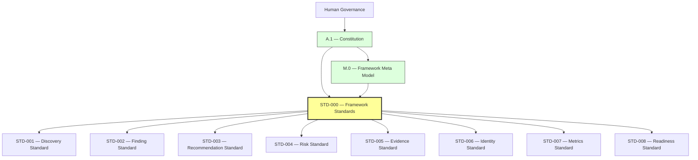

*Figure 1: Framework Position. STD-000 consumes constitutional authority and the Meta Model, then provides the governing foundation for all subsequent Framework Standards.*

### Standards Library Position

The Standards Library is organized as follows:

```
docs/
└── AI/
    └── Standards/
        ├── STD-000-Framework-Standards.md
        ├── STD-001-Discovery-Standard.md
        ├── STD-002-Finding-Standard.md
        ├── STD-003-Recommendation-Standard.md
        ├── STD-004-Risk-Standard.md
        ├── STD-005-Evidence-Standard.md
        ├── STD-006-Identity-Standard.md
        ├── STD-007-Metrics-Standard.md
        └── STD-008-Readiness-Standard.md
```

This structure is expected to evolve through governed additions.

No new standard shall be added without a stable identifier, owner, authority, scope, and lifecycle status.

### Document Classification

STD-000 is classified as a **Standards Library Governance Standard**.

It defines the rules for standards themselves.

It does not define architecture, runtime behavior, platform integration, project implementation, or product-specific policy.

### Authority Chain

- If STD-000 conflicts with the [Constitution](../A.1-Constitution.md), the Constitution prevails.
- If an individual Framework Standard conflicts with STD-000, STD-000 prevails unless a governance-approved exception exists.

### Consumers

STD-000 is consumed by:

- All STD-\* documents
- Framework Core architecture documents (A.\*)
- Meta specifications (M.\*)
- Audits and discovery documents
- Governance processes
- Validation and certification models
- Runtime and engine specifications
- Future platform adapter specifications

### Produced Assets

STD-000 produces:

- The canonical standard structure
- The standard lifecycle
- Standard identity rules
- Standard authority expectations
- Standard ownership expectations
- Standard validation rules
- Standard certification requirements
- Standard migration expectations

### Success Criteria

This document is successful when every Forge AI Framework Standard can be:

- Identified consistently
- Structured consistently
- Governed consistently
- Validated consistently
- Certified consistently
- Versioned consistently
- Migrated consistently
- Referenced consistently

### Completion Statement

The Status section is complete when the document identity, Framework position, Standards Library position, classification, authority chain, consumers, produced assets, and success criteria are explicitly defined.

The Status section becomes the canonical identity record for STD-000 — Framework Standards.

---

## 2. Preamble

### Purpose of This Preamble

This preamble establishes the intent, philosophy, and governing context of the Forge AI Standards Library.

Framework Standards exist to provide a common, reusable, and governed foundation for all recurring architectural models, schemas, processes, and practices used throughout the Forge AI Framework.

### Why Standards Exist

Without shared standards, similar concepts tend to evolve independently, resulting in inconsistent terminology, duplicated schemas, incompatible governance models, and architectural drift.

The Standards Library exists to prevent these problems by defining reusable canonical standards that may be consumed by Framework Core documents, runtime specifications, governance processes, validation systems, and project implementations.

### Constitutional Alignment

The Standards Library derives its authority from:

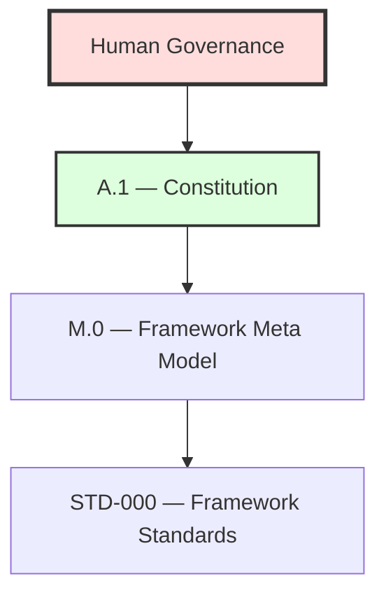

*Figure 2: Constitutional Alignment. Authority flows from Human Governance through the Constitution and Meta Model to STD-000.*

STD-000 shall never redefine constitutional authority. It operationalizes constitutional principles for reusable Framework Standards.

### Design Intent

The Standards Library is designed to be:

- **Canonical** — establishing authoritative definitions
- **Technology-neutral** — independent of implementation platforms
- **Evidence-driven** — changes justified by verifiable evidence
- **Governance-controlled** — all transitions require approval
- **Extensible** — supporting future standards without restructure
- **Traceable** — maintaining full lineage and decision history
- **Reusable** — defined once, consumed everywhere
- **Long-term maintainable** — prioritizing sustainability over convenience

Every Framework Standard should solve a reusable problem once so that architecture documents and implementations can reference it instead of redefining it.

### Audience

STD-000 is intended for:

- Framework architects
- Governance maintainers
- Standards authors
- Validation and certification designers
- Runtime and engine architects
- Platform integration authors

### Guiding Statement

Standards do not define what the Framework is.

Standards define how reusable Framework concepts are modeled, governed, validated, versioned, and certified.

### Completion Statement

The Preamble establishes the philosophical and governance foundation for the Forge AI Standards Library and prepares all subsequent sections of STD-000.

---

## 3. Purpose

### Overview

The purpose of the Framework Standards Library is to provide a canonical, reusable, and governed collection of standards that eliminate duplication across the Forge AI Framework.

Framework Standards capture recurring architectural patterns, governance models, schemas, lifecycle definitions, validation rules, and reference structures so they can be defined once and reused consistently.

### Objectives

The Standards Library shall:

- Define reusable canonical standards
- Promote consistency across Framework documents
- Reduce duplicated architectural definitions
- Improve interoperability between Framework components
- Provide stable foundations for governance, validation, and certification

### Strategic Goals

The Standards Library supports:

- Architectural consistency
- Governance maturity
- Traceability
- Long-term maintainability
- Technology neutrality
- Controlled evolution

### Expected Outcomes

Successful adoption of Framework Standards results in:

- Shared terminology
- Shared schemas
- Common lifecycle models
- Common validation rules
- Predictable document structures
- Reusable governance patterns

### Non-Goals

Framework Standards do not:

- Replace the [Constitution](../A.1-Constitution.md)
- Redefine the [Meta Model](../M.0-Framework-Meta-Model.md)
- Prescribe implementation details
- Mandate platform-specific technologies

### Relationship to Other Framework Layers

- [A.1 — Constitution](../A.1-Constitution.md) defines constitutional authority.
- [M.0 — Framework Meta Model](../M.0-Framework-Meta-Model.md) defines the conceptual language.
- STD-000 defines how reusable standards are created and governed.
- Individual STD documents define specific reusable models.

### Success Criteria

This section is complete when the purpose, objectives, goals, outcomes, non-goals, and architectural relationships of the Standards Library are explicitly defined.

### Completion Statement

The Purpose section establishes why the Forge AI Standards Library exists and how it contributes to consistency, governance, and long-term architectural sustainability across the Framework.

---

## 4. Scope

### Overview

This section defines the constitutional and operational boundaries of the Forge AI Standards Library.

The scope identifies what Framework Standards govern, what they intentionally exclude, and how they interact with other Framework layers.

### In Scope

Framework Standards govern reusable concepts including:

- Canonical schemas
- Artifact models
- Identity conventions
- Lifecycle models
- Relationship models
- Governance procedures
- Validation rules
- Certification requirements
- Metrics models
- Traceability models
- Reference structures
- Cross-document conventions

### Out of Scope

Framework Standards do not define:

- Product features
- Runtime implementations
- Programming language specifics
- UI/UX behavior
- Database schemas
- Platform-specific integrations
- Business logic
- Project management workflows

These concerns belong to other Framework Core documents or implementation projects.

### Framework Coverage

Framework Standards are intended to be consumed by:

- Architecture documents (A.\*)
- Meta specifications (M.\*)
- Standards (STD.\*)
- Runtime specifications
- Validation and Certification systems
- Governance processes
- Audit documents
- Platform adapters
- Project-level guidance where applicable

### Boundary Rules

Framework Standards shall:

- Define reusable models
- Avoid implementation details
- Remain technology-neutral
- Preserve constitutional alignment
- Avoid duplicating Architecture or Meta specifications

### Scope Constraints

A Framework Standard shall not:

- Redefine constitutional authority
- Replace the Framework Meta Model
- Introduce conflicting terminology
- Create alternative canonical models
- Mandate implementation technologies

### Dependency Model

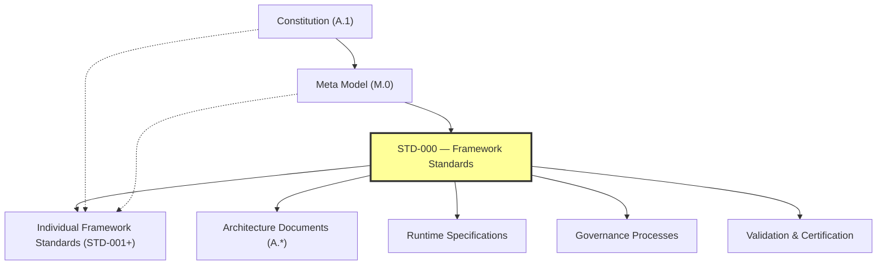

*Figure 3: Dependency Model. Framework Standards consume higher-level authority and provide reusable guidance to lower-level specifications.*

### Success Criteria

This section is complete when the boundaries, inclusions, exclusions, dependency model, and constraints of the Standards Library are explicitly defined.

### Completion Statement

The Scope section establishes the operational boundaries of the Forge AI Standards Library and ensures that Framework Standards remain focused on reusable, governed, and technology-neutral architectural models.

---

## 5. Authority

### Overview

This section defines the authority model governing the Forge AI Standards Library.

Authority determines who may create, approve, interpret, modify, certify, deprecate, and archive Framework Standards.

### Authority Principles

- Authority shall be explicit.
- Authority shall be traceable.
- Higher authority overrides lower authority.
- Authority shall never be implied.
- Constitutional authority cannot be delegated without governance.

### Authority Hierarchy

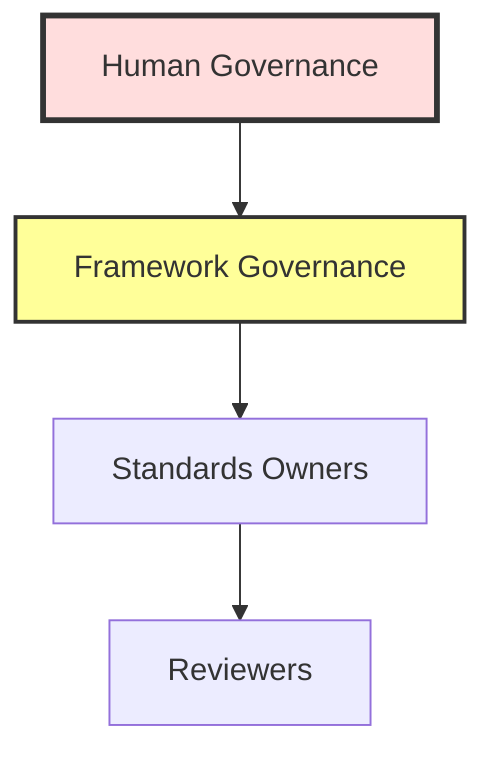

*Figure 4: Authority Hierarchy. Authority flows downward; lower authorities shall never override higher authorities.*

### Authority Responsibilities

| Authority | Responsibilities |
|:---|:---|
| **Human Governance** | Final constitutional authority; constitutional amendments; resolution of constitutional conflicts |
| **Framework Governance** | Approves Framework Standards; maintains Standards Library; resolves standard conflicts; oversees certification |
| **Standards Owners** | Maintain assigned standards; propose revisions; preserve consistency; coordinate reviews |
| **Reviewers** | Verify technical correctness; assess architectural alignment; produce review findings |

### Authority Constraints

A Framework Standard shall not:

- Redefine constitutional authority
- Override the Meta Model
- Conflict with STD-000
- Create parallel governance structures

### Delegation Rules

Authority may delegate execution but not accountability.

Every delegated action shall identify:

- Delegating authority
- Delegated responsibility
- Accountable owner

### Conflict Resolution

Authority conflicts shall be resolved in this order:

1. Constitution
2. Human Governance
3. Framework Governance
4. M.0 Meta Model
5. STD-000
6. Individual Standards

### Success Criteria

This section is complete when authority hierarchy, responsibilities, delegation rules, constraints, and conflict resolution have been explicitly defined.

### Completion Statement

The Authority section establishes the governing authority chain for the Forge AI Standards Library and ensures that every Framework Standard derives its legitimacy from constitutional governance.

---

## 6. Relationship to M.0 (Meta Model Integration)

### Overview

This section defines how the Framework Standards Library depends upon and specializes the Forge AI Framework Meta Model (M.0).

M.0 defines the common conceptual language of the Framework. STD-000 defines how that language is transformed into reusable Framework Standards.

### Separation of Responsibilities

| Concern | M.0 — Framework Meta Model | STD-000 — Framework Standards |
|:---|:---|:---|
| **Defines** | Artifact, Entity, Identity, Relationship, Lifecycle, Authority, Ownership, Evidence, Validation, Review, Certification, Reference | How standards are structured; how standards consume the Meta Model; how standards are governed, validated, certified, and evolved |

### Dependency Rule

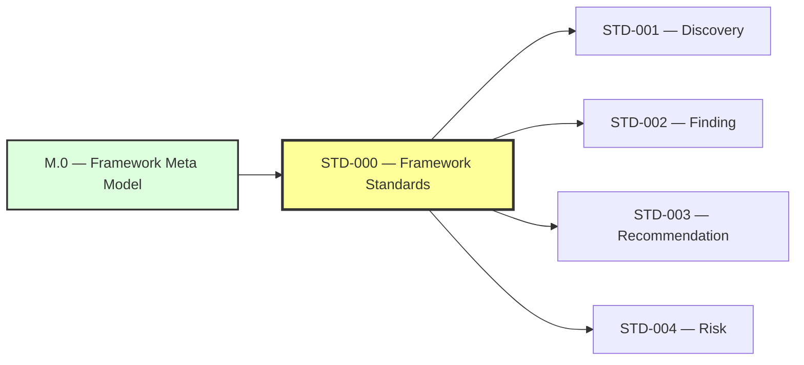

*Figure 5: Meta Model Dependency. Framework Standards shall consume Meta Model concepts rather than redefining them.*

### Derivation Rules

Every Framework Standard shall derive reusable concepts from M.0.

Examples:

- Discovery derives from Artifact
- Finding derives from Artifact
- Recommendation derives from Artifact
- Risk derives from Artifact

Standards may specialize meta concepts but shall not redefine them.

### Reuse Rules

Standards shall reuse M.0 definitions for:

- Identity
- Ownership
- Authority
- Lifecycle
- State
- Relationships
- References
- Evidence

Duplicate definitions are prohibited unless approved through governance.

### Constraints

A Framework Standard shall not:

- Replace M.0
- Redefine Meta Types
- Introduce conflicting identity models
- Create incompatible lifecycle definitions

### Success Criteria

This section is complete when the dependency model, derivation rules, reuse rules, and constraints between M.0 and the Standards Library are explicitly defined.

### Completion Statement

The Relationship to M.0 section establishes the Meta Model as the shared conceptual foundation for every Framework Standard and ensures long-term consistency across the Standards Library.

---

## 7. Standards Philosophy

### Overview

The Standards Philosophy defines the foundational beliefs that guide the creation, evolution, and governance of every Framework Standard.

Framework Standards exist to maximize consistency, reuse, traceability, and long-term maintainability across the Forge AI Framework.

### Philosophy Statement

A Framework Standard shall define a reusable concept once and enable every Framework document and implementation to consume that concept without redefining it.

### Core Philosophical Principles

| Principle | Description |
|:---|:---|
| **Canonical by Design** | A standard shall establish one authoritative definition for the concept it governs. |
| **Reuse Before Reinvention** | Reusable concepts shall become Framework Standards instead of being duplicated across architecture documents. |
| **Technology Neutrality** | Standards define concepts, not implementations. |
| **Governance Before Promotion** | A standard becomes canonical only through governance, validation, and certification. |
| **Evidence-Driven Evolution** | Every significant change shall be justified by documented evidence and architectural rationale. |
| **Explicit Ownership** | Every standard shall have one accountable owner. |
| **Traceability** | Standards shall maintain traceable relationships to constitutional authority, the Meta Model, and consuming documents. |
| **Stability with Evolution** | Standards should remain stable while supporting controlled, governed evolution. |

### Design Values

Framework Standards should be:

- Simple
- Consistent
- Predictable
- Extensible
- Reviewable
- Auditable
- Long-lived

### Philosophical Constraints

Framework Standards shall not:

- Redefine constitutional principles
- Replace the Meta Model
- Prescribe implementation technology
- Duplicate reusable concepts
- Create conflicting canonical definitions

### Success Criteria

This section is complete when the guiding philosophy, principles, values, and constraints of the Standards Library are explicitly defined.

### Completion Statement

The Standards Philosophy provides the long-term design mindset that guides every Framework Standard and ensures the Standards Library evolves as a coherent, reusable, and governed system.

---

## 8. Standards Classification

### Overview

This section defines the official classification system for all Framework Standards.

A classification identifies the intended scope, authority, consumers, and lifecycle expectations of a standard.

### Classification Principles

Every Framework Standard shall belong to exactly one primary classification.

Additional tags may be used for indexing, but they shall not replace the primary classification.

### Core Standard

Defines foundational concepts required by the entire Framework.

**Characteristics:**

- Highest reuse
- Long lifecycle
- Consumed by multiple Framework layers
- Rarely changed

**Examples:**

- STD-000 — Framework Standards
- STD-001 — Discovery Standard

### Supporting Standard

Defines reusable supporting models that complement Core Standards.

**Examples:**

- Evidence Standard
- Metrics Standard
- Identity Standard

### Extension Standard

Introduces governed extensions to existing standards without redefining the parent model.

**Requirements:**

- Reference parent standard
- Preserve compatibility
- Declare extension scope

### Platform Standard

Defines reusable platform-specific conventions while remaining aligned with Framework Core.

**Examples:**

- WordPress Adapter Standard
- CLI Integration Standard
- REST Integration Standard

### Project Standard

Defines reusable practices within a specific project while remaining compatible with Framework Standards.

> **Note:** Project Standards shall never override Core Standards.

### Classification Matrix

| Classification | Scope | Authority | Consumers |
|:---|:---|:---|:---|
| **Core** | Framework-wide | Framework Governance | All layers |
| **Supporting** | Shared capability | Framework Governance | Multiple standards |
| **Extension** | Existing standard | Parent + Governance | Parent consumers |
| **Platform** | Platform-specific | Framework Governance | Platform adapters |
| **Project** | Project-specific | Project Governance | Individual projects |

### Classification Constraints

A standard shall not:

- Belong to multiple primary classifications
- Redefine another classification
- Weaken authority inherited from higher-level standards

### Success Criteria

This section is complete when every Framework Standard can be assigned a single, well-defined classification with explicit scope and governance expectations.

### Completion Statement

The Standards Classification section establishes the official taxonomy of the Standards Library, enabling consistent governance, navigation, lifecycle management, and future expansion.

---

## 9. Standards Lifecycle

### Overview

This section defines the official lifecycle through which every Framework Standard progresses from initial proposal to historical archive.

The lifecycle ensures that standards evolve in a controlled, transparent, and governed manner.

### Lifecycle Principles

- Every standard shall have one explicit lifecycle state.
- State transitions shall be governed.
- Promotion requires evidence and review.
- Historical versions shall remain traceable.

### Lifecycle Model

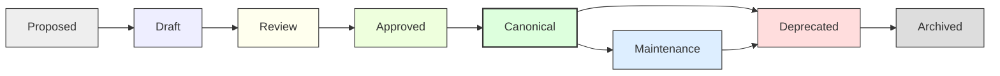

*Figure 6: Standards Lifecycle Model. Each transition requires governed approval and supporting evidence.*

### State Definitions

| State | Description |
|:---|:---|
| **Proposed** | Identifier reserved and concept accepted for exploration. |
| **Draft** | Active authoring. Breaking changes are permitted. |
| **Review** | Ready for architectural and governance review. |
| **Approved** | Review complete and accepted pending publication. |
| **Canonical** | Official Framework Standard. |
| **Maintenance** | Canonical standard receiving compatible improvements. |
| **Deprecated** | Superseded but retained for compatibility and history. |
| **Archived** | Historical reference only. No further evolution. |

### Transition Rules

| Transition | Requirement |
|:---|:---|
| Proposed → Draft | Requires an owner. |
| Draft → Review | Requires structural completeness. |
| Review → Approved | Requires governance review. |
| Approved → Canonical | Requires certification. |
| Canonical → Maintenance | Requires governance approval. |
| Canonical or Maintenance → Deprecated | Requires migration guidance. |
| Deprecated → Archived | Requires governance authorization. |

### Exit Criteria

A state transition shall record:

- Responsible authority
- Supporting evidence
- Approval date
- Resulting version
- Affected references

### Lifecycle Constraints

A standard shall not:

- Skip required lifecycle states
- Become Canonical without certification
- Return from Archived to Canonical
- Lose historical traceability

### Success Criteria

This section is complete when lifecycle states, transitions, criteria, constraints, and governance expectations are explicitly defined.

### Completion Statement

The Standards Lifecycle establishes the governed evolution model for every Framework Standard, ensuring stability, traceability, and controlled change throughout the Standards Library.

---

## 10. Standards Identity

### Overview

This section defines the canonical identity model for every Framework Standard.

Identity ensures that standards remain uniquely identifiable, traceable, versioned, and referenceable throughout their lifecycle.

### Identity Principles

- Every standard shall have one immutable identifier.
- Identity shall remain stable after publication.
- Identity shall be globally referenceable.
- Identity shall be independent of file location.

### Identity Components

Every Framework Standard shall define:

- Identifier
- Canonical Title
- Version
- Status
- Classification
- Authority
- Owner

### Identifier Format

Canonical format:

```
FORGE-STD-000
FORGE-STD-001
FORGE-STD-002
```

**Rules:**

- Prefix: `FORGE`
- Type: `STD`
- Numeric identifier: three digits
- Immutable after publication

### File Naming Convention

```
STD-000-Framework-Standards.md
STD-001-Discovery-Standard.md
STD-002-Finding-Standard.md
```

File names should remain human-readable while identifiers remain machine-stable.

### Version Identity

Standards use semantic versioning as defined in [Section 16 — Versioning](#16-versioning):

```
MAJOR.MINOR.PATCH[-status]
```

**Examples:**

- `1.0.0-draft`
- `1.0.0`
- `1.1.0`
- `2.0.0`

### Identity Constraints

A standard shall not:

- Reuse an identifier
- Change its identifier after publication
- Share an identifier with another standard
- Omit version or lifecycle status

### Identity Relationships

The identity of a standard shall be referenced by:

- Architecture documents
- Meta specifications
- Other Framework Standards
- Validation reports
- Certification records
- Governance decisions

### Success Criteria

This section is complete when identifier rules, naming conventions, version identity, constraints, and referencing expectations are explicitly defined.

### Completion Statement

The Standards Identity section establishes the permanent identity model for every Framework Standard, ensuring stable references, governance continuity, and long-term traceability across the Forge AI Standards Library.

---

## 11. Standards Structure

### Overview

This section defines the mandatory document structure for every Framework Standard.

A common structure improves consistency, discoverability, governance, review, certification, and long-term maintainability.

### Structure Principles

- Every Framework Standard shall follow one canonical structure.
- Sections shall appear in a consistent order.
- Optional sections shall be explicitly identified.
- Cross-references shall use canonical identifiers.

### Mandatory Structure

Every STD-\* document shall contain the following sections:

1. Status
2. Preamble
3. Purpose
4. Scope
5. Authority
6. Relationship to M.0
7. Standards Philosophy / Domain Principles
8. Classification (where applicable)
9. Lifecycle
10. Identity
11. Structure
12. Relationships
13. Governance
14. Validation
15. Certification
16. Versioning
17. Migration
18. References
19. Glossary (optional if inherited)
20. Next Standard

### Section Rules

- Headings shall use consistent numbering.
- Each section shall define its own success criteria when appropriate.
- Completion statements shall conclude major sections.
- Normative requirements should use consistent wording (e.g., "shall", "shall not", "may", "should").

### Document Metadata

Every Framework Standard shall declare:

- Identifier
- Canonical Title
- Version
- Status
- Classification
- Authority
- Owner
- Maintainers
- Creation Date
- Last Updated

### Extension Rules

Standards may add domain-specific sections after the mandatory structure, provided they:

- Preserve section order
- Do not remove mandatory sections
- Remain backward compatible unless a major version is published

### Structure Constraints

A standard shall not:

- Omit mandatory metadata
- Reorder mandatory sections without governance approval
- Redefine inherited concepts from M.0 or STD-000

### Success Criteria

This section is complete when every Framework Standard can be authored, reviewed, and certified using a single canonical structure.

### Completion Statement

The Standards Structure section establishes the official template for all Framework Standards, ensuring consistent authoring, governance, and lifecycle management across the Standards Library.

---

## 12. Standards Relationships

### Overview

This section defines how Framework Standards relate to one another and to other document families within the Forge AI Framework.

The relationship model ensures consistency, traceability, dependency control, and clear architectural boundaries.

### Relationship Principles

- Relationships shall be explicit.
- Relationships shall be directional.
- Relationships shall be traceable.
- Relationships shall preserve authority.
- Circular normative dependencies shall be avoided.

### Relationship Types

| Type | Description |
|:---|:---|
| **Derives From** | Inherits concepts from a higher-level authority. |
| **Consumes** | Uses concepts without redefining them. |
| **References** | Points to another document for context. |
| **Extends** | Adds capabilities while preserving compatibility. |
| **Constrains** | Limits or governs another document. |
| **Produces** | Creates artifacts consumed elsewhere. |

### Relationship Hierarchy

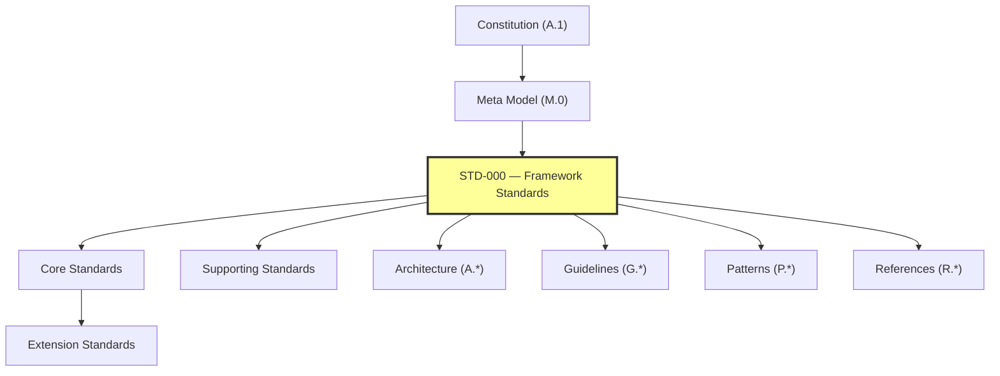

*Figure 7: Relationship Hierarchy. Standards relate to all Framework document families while maintaining authority direction.*

### Cross-Family Relationships

Framework Standards may interact with:

- A.\* — Architecture
- M.\* — Meta
- STD.\* — Standards
- G.\* — Guidelines
- P.\* — Patterns
- R.\* — References
- Runtime specifications
- Platform adapters

Standards shall not replace these document families; they provide reusable models for them.

### Dependency Rules

A Framework Standard **may**:

- Derive from higher authority
- Consume multiple standards
- Reference multiple documents

A Framework Standard **shall not**:

- Introduce dependency cycles
- Redefine higher-level authority
- Create conflicting canonical models

### Traceability Rules

Every normative relationship should identify:

- Source document
- Target document
- Relationship type
- Rationale
- Authority basis

### Success Criteria

This section is complete when relationship types, dependency rules, cross-family interactions, and traceability expectations are explicitly defined.

### Completion Statement

The Standards Relationships section establishes the canonical relationship model for the Standards Library, ensuring coherent integration with the Meta Model, Architecture, Governance, Runtime, and future Framework document families.

---

## 13. Governance

### Overview

This section defines the governance model for the Forge AI Standards Library.

Governance ensures that Framework Standards are created, reviewed, approved, maintained, and retired through controlled and transparent processes.

### Governance Principles

- Governance shall be explicit.
- Governance shall be evidence-driven.
- Governance shall preserve constitutional alignment.
- Governance shall ensure traceability.
- Governance shall maintain one accountable owner for every standard.

### Governance Roles

| Role | Responsibilities |
|:---|:---|
| **Human Governance** | Final constitutional authority; resolves constitutional conflicts; approves exceptional governance actions. |
| **Framework Governance** | Maintains the Standards Library; reviews and approves standards; oversees lifecycle transitions; coordinates certification. |
| **Standards Owner** | Authors and maintains the assigned standard; coordinates reviews; proposes revisions; preserves consistency. |
| **Reviewers** | Verify technical correctness; assess architectural alignment; produce review findings. |

### Governance Workflow

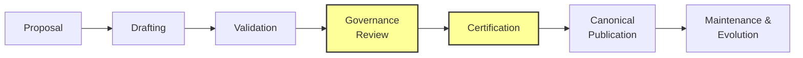

*Figure 8: Governance Workflow. Standards progress through governed stages from Proposal to Canonical Publication and beyond.*

### Change Management

Every significant change shall include:

- Rationale
- Supporting evidence
- Impact assessment
- Affected standards
- Version update
- Review record

### Governance Constraints

Framework Governance shall not:

- Override the [Constitution](../A.1-Constitution.md)
- Redefine the [Meta Model](../M.0-Framework-Meta-Model.md)
- Bypass validation or certification
- Promote unresolved conflicts to canonical status

### Decision Records

Governance decisions should be recorded with:

- Decision identifier
- Owner
- Authority
- Evidence references
- Outcome
- Affected documents

### Success Criteria

This section is complete when governance roles, workflow, responsibilities, constraints, and decision expectations have been explicitly defined.

### Completion Statement

The Governance section establishes the operating model for managing the Forge AI Standards Library throughout its lifecycle while preserving constitutional authority, consistency, and long-term maintainability.

---

## 14. Validation

### Overview

Validation establishes the quality assurance model for every Framework Standard before it may progress through its lifecycle.

Validation confirms that a standard is structurally complete, constitutionally aligned, internally consistent, and suitable for governance review.

### Validation Principles

- Validation shall be objective.
- Validation shall be repeatable.
- Validation shall be evidence-based.
- Validation shall preserve traceability.
- Validation shall occur before certification.

### Validation Scope

Every Framework Standard shall be validated for:

- Structural compliance
- Metadata completeness
- Constitutional alignment
- Meta Model alignment
- Terminology consistency
- Relationship integrity
- Cross-reference accuracy
- Governance completeness
- Version consistency

### Validation Workflow

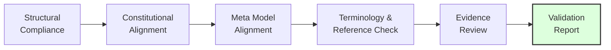

*Figure 9: Validation Workflow. Each validation stage produces findings that must be resolved before certification.*

### Validation Gates

A standard shall satisfy the following quality gates before governance approval:

- Required sections present
- Required metadata complete
- Authority chain valid
- References resolved
- No conflicting canonical definitions
- Terminology consistent
- Traceability preserved

### Validation Evidence

Validation shall produce:

- Validation identifier
- Validation date
- Validator
- Findings
- Evidence references
- Pass/fail result
- Corrective actions (if applicable)

### Validation Constraints

Validation shall not:

- Approve constitutional conflicts
- Replace governance approval
- Omit evidence for failed checks
- Certify a document directly

### Success Criteria

This section is complete when validation principles, workflow, quality gates, evidence requirements, and constraints have been explicitly defined.

### Completion Statement

The Validation section establishes the canonical quality assurance model for the Forge AI Standards Library, ensuring every Framework Standard is verified before governance approval and certification.

---

## 15. Certification

### Overview

Certification is the formal governance process through which a Framework Standard is recognized as a Canonical Standard.

Certification confirms that [validation](#14-validation) has been completed, governance approval has been granted, and the standard satisfies all constitutional, meta-model, and standards framework requirements.

### Certification Principles

- Certification shall follow validation.
- Certification shall be evidence-based.
- Certification shall be governed.
- Certification shall be traceable.
- Certification shall be repeatable.

### Certification Prerequisites

Before certification, a Framework Standard shall have:

- Completed validation
- Resolved blocking findings
- Documented governance review
- Identified owner and authority
- Complete metadata
- Consistent references

### Certification Workflow

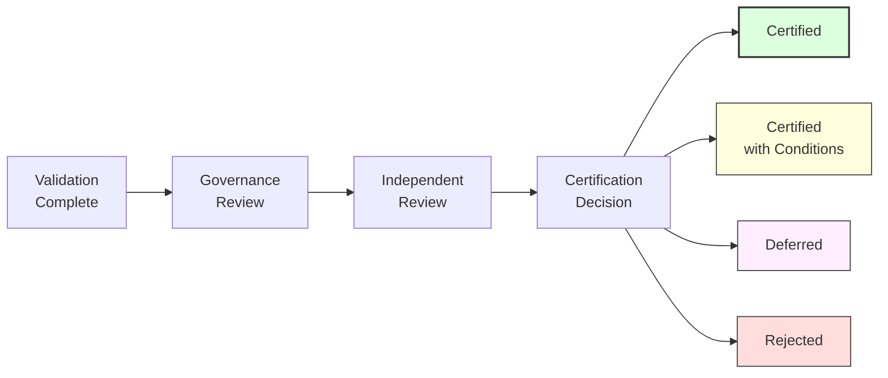

*Figure 10: Certification Workflow. Only validated and reviewed standards may proceed to certification, with four possible outcomes.*

### Certification Decision

Possible outcomes:

- **Certified** — Standard meets all requirements.
- **Certified with Conditions** — Standard meets requirements subject to documented conditions.
- **Deferred** — Standard requires additional work before re-evaluation.
- **Rejected** — Standard does not meet certification requirements.

Each decision shall include documented rationale and supporting evidence.

### Certification Record

Every certification shall record:

- Certification ID
- Standard Identifier
- Version
- Certification Date
- Certifying Authority
- Decision
- Supporting Evidence
- Review References
- Conditions (if any)

### Certification Constraints

Certification shall not:

- Bypass [validation](#14-validation)
- Override the [Constitution](../A.1-Constitution.md)
- Ignore unresolved critical findings
- Publish conflicting canonical standards

### Success Criteria

This section is complete when certification principles, prerequisites, workflow, records, decisions, and constraints have been explicitly defined.

### Completion Statement

The Certification section establishes the canonical acceptance process for Framework Standards and ensures that only governed, validated, and evidence-backed standards become part of the Forge AI Standards Library.

---

## 16. Versioning

### Overview

This section defines the canonical versioning strategy for every Framework Standard.

Versioning communicates compatibility expectations, maturity, and the impact of changes while preserving long-term traceability.

### Versioning Principles

- Every standard shall have one explicit version.
- Versions shall be immutable once published.
- Version history shall remain traceable.
- Breaking changes shall require a major version.

### Version Format

Framework Standards use Semantic Versioning:

```
MAJOR.MINOR.PATCH[-STATUS]
```

**Examples:**

- `1.0.0-draft`
- `1.0.0-review`
- `1.0.0`
- `1.1.0`
- `1.1.2`
- `2.0.0`

### Version Semantics

| Component | Usage |
|:---|:---|
| **Major** | Used for incompatible structural or governance changes. |
| **Minor** | Used for backward-compatible additions and enhancements. |
| **Patch** | Used for editorial corrections, clarifications, reference updates, and non-breaking improvements. |
| **Status Suffix** | Optional lifecycle qualifier (e.g., `draft`, `review`); canonical releases normally omit a suffix. |

### Compatibility Rules

- Major releases may introduce breaking changes.
- Minor releases shall remain backward compatible.
- Patch releases shall not alter normative behavior.

### Change Classification

Every version update shall classify the change as one or more of:

- Editorial
- Clarification
- Structural
- Governance
- Meta Model Alignment
- Breaking Change
- Compatibility Improvement

### Version History

Every Framework Standard should maintain a version history including:

- Version
- Date
- Summary
- Author or Owner
- Approval Status

### Constraints

A Framework Standard shall not:

- Reuse version identifiers
- Downgrade a published version
- Modify historical release records
- Publish breaking changes as a patch release

### Success Criteria

This section is complete when version format, semantics, compatibility rules, change classification, and history requirements are explicitly defined.

### Completion Statement

The Versioning section establishes a predictable evolution model for Framework Standards, enabling safe maintenance, compatibility management, and long-term governance.

---

## 17. Migration

### Overview

This section defines the canonical migration model for Framework Standards.

Migration ensures that the Standards Library can evolve without losing traceability, governance history, or compatibility guidance.

### Migration Principles

- Migration shall preserve history.
- Migration shall be governed.
- Migration shall be documented.
- Migration shall be traceable.
- Migration shall minimize disruption.

### Migration Triggers

Migration may be initiated when:

- A standard becomes deprecated
- A major version introduces breaking changes
- The [Meta Model](../M.0-Framework-Meta-Model.md) evolves
- Constitutional amendments affect standards
- Standards are merged, split, or superseded

### Migration Workflow

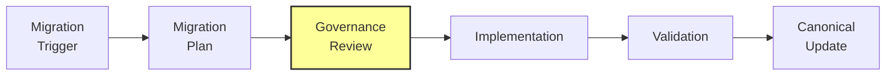

*Figure 11: Migration Workflow. All migrations require a governed plan, review, implementation, validation, and canonical update.*

### Migration Plan

Every migration plan shall define:

- Source standard
- Target standard
- Migration rationale
- Compatibility expectations
- Affected documents
- Required actions
- Validation strategy
- Rollback considerations (if applicable)

### Compatibility Strategy

Migration should identify one of the following:

- **Fully Compatible** — No consumer changes required.
- **Partially Compatible** — Some consumer updates needed; migration guidance provided.
- **Breaking Change** — Significant consumer changes required; full migration plan mandated.
- **Historical Preservation Only** — Standard is being archived; no active migration path.

### Deprecation Rules

Deprecated standards shall:

- Remain referenceable
- Identify their successor when available
- Include migration guidance
- Remain historically accessible

### Migration Constraints

Migration shall not:

- Destroy historical versions
- Reuse obsolete identifiers
- Remove traceability
- Bypass governance approval

### Success Criteria

This section is complete when migration principles, workflow, planning, compatibility strategy, and deprecation rules are explicitly defined.

### Completion Statement

The Migration section establishes the governed evolution process for Framework Standards, ensuring orderly transitions while preserving historical integrity and architectural continuity.

---

## 18. References

### Overview

This section defines how Framework Standards reference authoritative sources and related Framework documents.

References preserve traceability, reduce duplication, and establish a consistent navigation model across the Framework.

### Reference Principles

- References shall be explicit.
- References shall identify authority.
- References shall remain stable.
- Normative references shall take precedence over informative references.

### Reference Categories

#### Normative References

Documents that define mandatory requirements.

| Reference | Description |
|:---|:---|
| [A.1 — Constitution](../A.1-Constitution.md) | The constitutional authority governing all Framework Standards. |
| [M.0 — Framework Meta Model](../M.0-Framework-Meta-Model.md) | The conceptual type system consumed by all Framework Standards. |

#### Informative References

Documents that provide supporting context, examples, rationale, or background.

| Reference | Description |
|:---|:---|
| [A.0 — Framework Audit](../A.0-Framework-Audit.md) | The verified architectural baseline that informed Standards Library design. |
| STD-001 — Discovery Standard (Planned) | The first specialized Framework Standard. |
| STD-002 — Finding Standard (Planned) | The second specialized Framework Standard. |
| STD-003 — Recommendation Standard (Planned) | The third specialized Framework Standard. |
| STD-004 — Risk Standard (Planned) | The fourth specialized Framework Standard. |
| STD-005 — Evidence Standard (Planned) | The fifth specialized Framework Standard. |
| STD-006 — Identity Standard (Planned) | The sixth specialized Framework Standard. |
| STD-007 — Metrics Standard (Planned) | The seventh specialized Framework Standard. |
| STD-008 — Readiness Standard (Planned) | The eighth specialized Framework Standard. |

### Cross-Reference Rules

Framework Standards should reference other documents using their canonical identifiers.

```
A.0
A.1
M.0
STD-001
STD-002
```

References should avoid ambiguous titles when a canonical identifier exists.

### External References

External publications may be referenced for context.

External references shall not override constitutional or canonical Framework authority.

### Reference Integrity

Every reference should remain:

- Identifiable
- Resolvable
- Relevant
- Version-aware where applicable

Broken or obsolete references should be corrected through normal governance processes.

### Reference Constraints

Framework Standards shall not:

- Cite conflicting documents as normative authority
- Rely on unpublished canonical sources
- Create circular normative references

### Success Criteria

This section is complete when reference categories, integrity rules, constraints, and cross-reference conventions are explicitly defined.

### Completion Statement

The References section establishes a consistent and traceable reference model for the Forge AI Standards Library, ensuring every Framework Standard can identify and consume authoritative sources in a predictable manner.

---

## 19. Glossary

### Overview

This glossary defines the canonical terminology used throughout the Forge AI Standards Library.

Unless explicitly overridden by a higher-authority document, these definitions shall be used consistently across all Framework Standards.

### Core Terms

| Term | Definition |
|:---|:---|
| **Artifact** | A governed object with identity, ownership, lifecycle, and traceability. |
| **Authority** | The source of legitimate decision-making and governance. |
| **Canonical** | The officially approved and authoritative version of a concept or document. |
| **Certification** | The governed process that promotes a validated standard to Canonical status. |
| **Discovery** | A governed architectural observation captured before becoming a Finding. |
| **Evidence** | Verifiable information supporting a claim, finding, recommendation, review, or certification. |
| **Finding** | A governed conclusion derived from one or more Discoveries and supported by Evidence. |
| **Framework Standard** | A reusable, governed specification defining a common model, rule, schema, or process. |
| **Governance** | The controlled process for managing standards, reviews, approvals, and lifecycle transitions. |
| **Identity** | The permanent identifier assigned to an Artifact. |
| **Lifecycle** | The ordered sequence of states through which an Artifact progresses. |
| **Meta Model** | The conceptual type system defined by M.0. |
| **Owner** | The accountable party responsible for an Artifact. |
| **Recommendation** | A governed proposal for addressing one or more Findings. |
| **Reference** | A traceable link to another authoritative source or Artifact. |
| **Relationship** | An explicit, governed connection between Artifacts. |
| **Review** | An independent assessment of quality, readiness, or alignment. |
| **Standard** | A reusable specification governed by STD-000. |
| **Traceability** | The ability to follow relationships, authority, evidence, and lifecycle across Artifacts. |
| **Validation** | The process of verifying that an Artifact satisfies defined requirements. |
| **Version** | A managed release identifier communicating maturity and compatibility. |

### Terminology Rules

- Terms shall be used consistently.
- Higher-authority definitions take precedence.
- New terms should be added through governance.
- Synonyms should be avoided where canonical terms exist.

### Success Criteria

This glossary is complete when core terminology is consistently defined and reusable across the Standards Library.

### Completion Statement

The Glossary establishes the shared vocabulary for Framework Standards and promotes consistent communication throughout the Forge AI Framework.

---

## 20. Next Standard

### Overview

This section defines the continuation of the Standards Library roadmap following completion of STD-000.

STD-000 establishes the governance, structure, lifecycle, and operating rules for Framework Standards.

Subsequent standards shall specialize reusable Framework concepts without redefining the common rules established by STD-000.

### Immediate Successor

The next Framework Standard is:

| Property | Value |
|:---|:---|
| **Identifier** | STD-001 |
| **Title** | Discovery Standard |
| **Status** | Planned |
| **Role** | Defines the canonical Discovery Artifact derived from M.0 and governed by STD-000. |

### Standards Roadmap

The initial Standards Library roadmap is:

| Standard | Title | Status |
|:---|:---|:---|
| STD-001 | Discovery Standard | Planned |
| STD-002 | Finding Standard | Planned |
| STD-003 | Recommendation Standard | Planned |
| STD-004 | Risk Standard | Planned |
| STD-005 | Evidence Standard | Planned |
| STD-006 | Identity Standard | Planned |
| STD-007 | Metrics Standard | Planned |
| STD-008 | Readiness Standard | Planned |

Additional standards may be introduced through Framework Governance as the Framework evolves.

### Dependency Rules

Every new Framework Standard shall:

- Derive from M.0 where applicable
- Comply with STD-000
- Declare its authority
- Define its scope
- Avoid redefining inherited concepts
- Reference higher-level standards when consuming shared models

### Authoring Expectations

Authors of future standards should:

- Reuse canonical terminology
- Preserve architectural consistency
- Extend rather than duplicate existing standards
- Maintain backward compatibility where possible
- Document rationale for significant deviations

### Success Criteria

This section is complete when the next standard, roadmap, dependency expectations, and authoring guidance are explicitly defined.

### Completion Statement

STD-000 is complete. It establishes the governing framework for the Forge AI Standards Library and provides the canonical foundation upon which all future Framework Standards shall be authored, governed, validated, certified, versioned, and maintained.

---

## References

| Reference | Description |
|:---|:---|
| [A.0 — Framework Audit](../A.0-Framework-Audit.md) | The verified architectural baseline that informed Standards Library design. |
| [A.1 — Constitution](../A.1-Constitution.md) | The constitutional authority governing all Framework Standards. |
| [M.0 — Framework Meta Model](../M.0-Framework-Meta-Model.md) | The conceptual type system consumed by all Framework Standards. |
| STD-001 — Discovery Standard (Planned) | The first specialized Framework Standard. |
| STD-002 — Finding Standard (Planned) | The second specialized Framework Standard. |
| STD-003 — Recommendation Standard (Planned) | The third specialized Framework Standard. |
| STD-004 — Risk Standard (Planned) | The fourth specialized Framework Standard. |
| STD-005 — Evidence Standard (Planned) | The fifth specialized Framework Standard. |
| STD-006 — Identity Standard (Planned) | The sixth specialized Framework Standard. |
| STD-007 — Metrics Standard (Planned) | The seventh specialized Framework Standard. |
| STD-008 — Readiness Standard (Planned) | The eighth specialized Framework Standard. |

---

## Appendices

Appendices are reserved for future supporting materials, including expanded governance templates, validation checklists, and certification workflows.

### Appendix A: Validation Checklist (Placeholder)

*Reserved for future content.*

### Appendix B: Certification Templates (Placeholder)

*Reserved for future content.*

### Appendix C: Migration Playbook (Placeholder)

*Reserved for future content.*