# STD-000 — Framework Standards

> **AI-DOS v3 · Standards Library Governance**
> Standards Library · Root Standard

---

## Document Metadata

| Field | Value |
|:---|:---|
| Identifier | `AI-DOS-STD-000` |
| Title | STD-000 — Framework Standards |
| Version | 3.2.0 |
| Status | Draft |
| Canonical Status | Non-canonical until reviewed, approved, and promoted through Framework Governance |
| Classification | Standards Library Governance |
| Document Type | Framework Standard |
| Owner | Framework Governance |
| Maintainers | Framework Architecture Team |
| Review Authority | Enterprise Documentation Standards Board |
| Approval Authority | Human Governance / Framework Governance |
| Created | 2026-07-04 |
| Last Updated | 2026-07-07 |
| Lifecycle Phase | Draft |
| Traceability ID | AI-DOS-STD-000 |
| Scope | Standards library governance |
| Out of Scope | Individual standard implementations and certification |
| Normative Authority | Human Governance; `AGENTS.md`; `docs/AI/FrameworkGovernance.md` |
| Normative References | `docs/AI/Architecture/Standards/STD-010-Document-Metadata-Standard.md`; `docs/AI/Architecture/Standards/STD-000-Framework-Standards.md`; `docs/AI/Meta/M.0-Framework-Meta-Model.md`; `docs/AI/Meta/M.1-Artifact-Meta-Model.md` |
| Dependencies | Governance authority, artifact identity, lifecycle governance, traceability model, and applicable upstream v3 architecture documents |
| Consumes | A.1 and M.0 governance and meta-model inputs |
| Produces | Standards governance, lifecycle, identity, compliance, and certification model |
| Related Specifications | STD-001; STD-002; STD-010 |
| Supersedes | None |
| Superseded By | None |
| Promotion Requirements | Framework Governance review, approval, traceability validation, metadata validation, and explicit promotion |
| Certification Status | Not certified |

---


## Revision History

| Version | Date | Author | Description |
|:---|:---|:---|:---|
| 3.2.0 | 2026-07-07 | Framework Architecture Team | Engine Platform architectural realignment with A.3 Runtime Architecture RFC and A.4 Engine Architecture RFC while preserving STD-000 standards governance authority. |
| 3.1.0 | 2026-07-04 | Framework Architecture Team | Enterprise governance extensions: Standards Taxonomy, Dependency Matrix, Lifecycle State Machine, Compliance Levels, Capability Matrix, Canonical Metadata Schema, Certification Levels, Standards Registry, Decision Records, AI Consumption Rules. |
| 3.0.0-beta | 2026-07-04 | Framework Architecture Team | Publication-quality release. |
| 3.0.0-alpha | 2026-07-04 | Framework Architecture Team | Alpha release for review. |
| 2.0.0-draft | 2026-07-04 | Framework Architecture Team | Structural refinement. |
| 1.0.0-draft | 2026-07-04 | Framework Architecture Team | Initial draft. |

---

## Table of Contents

1. [Status](#1-status)
2. [Preamble](#2-preamble)
3. [Purpose](#3-purpose)
4. [Scope](#4-scope)
5. [Authority](#5-authority)
6. [Relationship to M.0 (Meta Model Integration)](#6-relationship-to-m0-meta-model-integration)
7. [Standards Philosophy](#7-standards-philosophy)
8. [Standards Classification](#8-standards-classification)
9. [Standards Lifecycle](#9-standards-lifecycle)
10. [Standards Identity](#10-standards-identity)
11. [Standards Structure](#11-standards-structure)
12. [Standards Relationships](#12-standards-relationships)
13. [Governance](#13-governance)
14. [Validation](#14-validation)
15. [Certification](#15-certification)
16. [Versioning](#16-versioning)
17. [Migration](#17-migration)
18. [References](#18-references)
19. [Glossary](#19-glossary)
20. [Next Standard](#20-next-standard)
21. [Standards Taxonomy](#21-standards-taxonomy)
22. [Standard Dependency Matrix](#22-standard-dependency-matrix)
23. [Standard Lifecycle State Machine](#23-standard-lifecycle-state-machine)
24. [Compliance Levels](#24-compliance-levels)
25. [Capability Matrix](#25-capability-matrix)
26. [Canonical Metadata Schema](#26-canonical-metadata-schema)
27. [Certification Levels](#27-certification-levels)
28. [Standards Registry](#28-standards-registry)
29. [Standard Decision Record](#29-standard-decision-record)
30. [AI Consumption Rules](#30-ai-consumption-rules)
31. [Engine Platform Alignment](#31-engine-platform-alignment)
32. [Runtime and Engine Responsibility Alignment](#32-runtime-and-engine-responsibility-alignment)
33. [Engine Contract Governance](#33-engine-contract-governance)
34. [AI Governance Alignment](#34-ai-governance-alignment)
35. [Architectural Alignment Report](#35-architectural-alignment-report)
36. [Publication Readiness](#36-publication-readiness)
- [Appendices](#appendices)

---

## 1. Status

### Document Identity

| Property | Value |
|:---|:---|
| **Document** | STD-000 — Framework Standards |
| **Identifier** | `AI-DOS-STD-000` |
| **Version** | 3.2.0 |
| **Status** | Draft |
| **Type** | Framework Standard |
| **Classification** | Standards Library Governance |
| **Authority** | [A.1 — Constitution](../A.1-Constitution.md), [M.0 — Framework Meta Model](../../Meta/M.0-Framework-Meta-Model.md) |
| **Owner** | Framework Governance |
| **Maintainers** | Framework Architecture Team |
| **Created** | 2026-07-04 |
| **Last Updated** | 2026-07-07 |

### Standard Position

STD-000 is the root governance document for theAI-DOS Standards Library.

It defines how Framework Standards are identified, structured, governed, validated, certified, versioned, migrated, and consumed.

Every future STD-\* document shall derive its standard structure and lifecycle expectations from STD-000.

### Framework Position

STD-000 does not replace the Constitution or the Meta Model.

It consumes both and translates them into a reusable standardization system for theAI-DOS Framework.

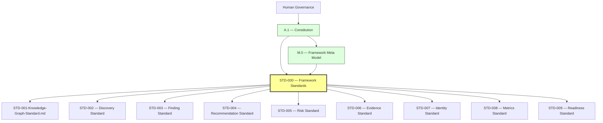

*Figure 1: Framework Position. STD-000 consumes constitutional authority and the Meta Model, then provides the governing foundation for all subsequent Framework Standards.*

### Standards Library Position

The Standards Library is organized as follows:

```
docs/
└── AI/
    └── Standards/
        ├── STD-000-Framework-Standards.md
        ├── STD-001-Knowledge-Graph-Standard.md
        ├── STD-002-Discovery-Standard.md
        ├── STD-003-Finding-Standard.md
        ├── STD-004-Recommendation-Standard.md
        ├── STD-005-Risk-Standard.md
        ├── STD-006-Evidence-Standard.md
        ├── STD-007-Identity-Standard.md
        ├── STD-008-Metrics-Standard.md
        └── STD-009-Readiness-Standard.md
```

This structure is expected to evolve through governed additions.

No new standard shall be added without a stable identifier, owner, authority, scope, and lifecycle status.

### Document Classification

STD-000 is classified as a **Standards Library Governance Standard**.

It defines the rules for standards themselves.

It does not define architecture, runtime behavior, platform integration, project implementation, or product-specific policy.

### Authority Chain

- If STD-000 conflicts with the [Constitution](../A.1-Constitution.md), the Constitution prevails.
- If an individual Framework Standard conflicts with STD-000, STD-000 prevails unless a governance-approved exception exists.

### Consumers

STD-000 is consumed by:

- All STD-\* documents
- Framework Core architecture documents (A.\*)
- Meta specifications (M.\*)
- Audits and discovery documents
- Governance processes
- Validation and certification models
- Runtime and engine specifications
- Engine Platform, Engine Kernel, Engine Contract, Engine Registry, Engine Lifecycle, Engine Capability, Engine Communication, Engine Artifact, Engine Ownership, Engine Validation, Engine Governance, Engine Certification, Engine Telemetry, and Engine Traceability specifications
- Future platform adapter specifications

### Produced Assets

STD-000 produces:

- The canonical standard structure
- The standard lifecycle
- Standard identity rules
- Standard authority expectations
- Standard ownership expectations
- Standard validation rules
- Standard certification requirements
- Standard migration expectations

### Success Criteria

This document is successful when everyAI-DOS Framework Standard can be:

- Identified consistently
- Structured consistently
- Governed consistently
- Validated consistently
- Certified consistently
- Versioned consistently
- Migrated consistently
- Referenced consistently

### Completion Statement

The Status section is complete when the document identity, Framework position, Standards Library position, classification, authority chain, consumers, produced assets, and success criteria are explicitly defined.

The Status section becomes the canonical identity record for STD-000 — Framework Standards.

---

## 2. Preamble

### Purpose of This Preamble

This preamble establishes the intent, philosophy, and governing context of theAI-DOS Standards Library.

Framework Standards exist to provide a common, reusable, and governed foundation for all recurring architectural models, schemas, processes, and practices used throughout theAI-DOS Framework.

### Why Standards Exist

Without shared standards, similar concepts tend to evolve independently, resulting in inconsistent terminology, duplicated schemas, incompatible governance models, and architectural drift.

The Standards Library exists to prevent these problems by defining reusable canonical standards that may be consumed by Framework Core documents, runtime specifications, governance processes, validation systems, and project implementations.

### Constitutional Alignment

The Standards Library derives its authority from:

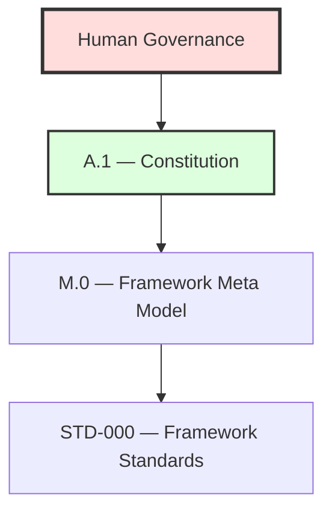

*Figure 2: Constitutional Alignment. Authority flows from Human Governance through the Constitution and Meta Model to STD-000.*

STD-000 shall never redefine constitutional authority. It operationalizes constitutional principles for reusable Framework Standards.

### Design Intent

The Standards Library is designed to be:

- **Canonical** — establishing authoritative definitions
- **Technology-neutral** — independent of implementation platforms
- **Evidence-driven** — changes justified by verifiable evidence
- **Governance-controlled** — all transitions require approval
- **Extensible** — supporting future standards without restructure
- **Traceable** — maintaining full lineage and decision history
- **Reusable** — defined once, consumed everywhere
- **Long-term maintainable** — prioritizing sustainability over convenience

Every Framework Standard should solve a reusable problem once so that architecture documents and implementations can reference it instead of redefining it.

### Audience

STD-000 is intended for:

- Framework architects
- Governance maintainers
- Standards authors
- Validation and certification designers
- Runtime and engine architects
- Platform integration authors

### Guiding Statement

Standards do not define what the Framework is.

Standards define how reusable Framework concepts are modeled, governed, validated, versioned, and certified.

### Completion Statement

The Preamble establishes the philosophical and governance foundation for theAI-DOS Standards Library and prepares all subsequent sections of STD-000.

---

## 3. Purpose

### Overview

The purpose of the Framework Standards Library is to provide a canonical, reusable, and governed collection of standards that eliminate duplication across theAI-DOS Framework.

Framework Standards capture recurring architectural patterns, governance models, schemas, lifecycle definitions, validation rules, and reference structures so they can be defined once and reused consistently.

### Objectives

The Standards Library shall:

- Define reusable canonical standards
- Promote consistency across Framework documents
- Reduce duplicated architectural definitions
- Improve interoperability between Framework components
- Provide stable foundations for governance, validation, and certification

### Strategic Goals

The Standards Library supports:

- Architectural consistency
- Governance maturity
- Traceability
- Long-term maintainability
- Technology neutrality
- Controlled evolution

### Expected Outcomes

Successful adoption of Framework Standards results in:

- Shared terminology
- Shared schemas
- Common lifecycle models
- Common validation rules
- Predictable document structures
- Reusable governance patterns

### Non-Goals

Framework Standards do not:

- Replace the [Constitution](../A.1-Constitution.md)
- Redefine the [Meta Model](../../Meta/M.0-Framework-Meta-Model.md)
- Prescribe implementation details
- Mandate platform-specific technologies

### Relationship to Other Framework Layers

- [A.1 — Constitution](../A.1-Constitution.md) defines constitutional authority.
- [M.0 — Framework Meta Model](../../Meta/M.0-Framework-Meta-Model.md) defines the conceptual language.
- STD-000 defines how reusable standards are created and governed.
- Individual STD documents define specific reusable models.

### Success Criteria

This section is complete when the purpose, objectives, goals, outcomes, non-goals, and architectural relationships of the Standards Library are explicitly defined.

### Completion Statement

The Purpose section establishes why theAI-DOS Standards Library exists and how it contributes to consistency, governance, and long-term architectural sustainability across the Framework.

---

## 4. Scope

### Overview

This section defines the constitutional and operational boundaries of theAI-DOS Standards Library.

The scope identifies what Framework Standards govern, what they intentionally exclude, and how they interact with other Framework layers.

### In Scope

Framework Standards govern reusable concepts including:

- Canonical schemas
- Artifact models
- Identity conventions
- Lifecycle models
- Relationship models
- Governance procedures
- Validation rules
- Certification requirements
- Metrics models
- Traceability models
- Reference structures
- Cross-document conventions

### Out of Scope

Framework Standards do not define:

- Product features
- Runtime implementations
- Engine implementations or engine contract schemas
- Programming language specifics
- UI/UX behavior
- Database schemas
- Platform-specific integrations
- Business logic
- Project management workflows

These concerns belong to other Framework Core documents or implementation projects.

### Framework Coverage

Framework Standards are intended to be consumed by:

- Architecture documents (A.\*)
- Meta specifications (M.\*)
- Standards (STD.\*)
- Runtime specifications
- Engine Platform and Engine specifications
- Validation and Certification systems
- Governance processes
- Audit documents
- Platform adapters
- Project-level guidance where applicable

### Boundary Rules

Framework Standards shall:

- Define reusable models
- Avoid implementation details
- Remain technology-neutral
- Preserve constitutional alignment
- Avoid duplicating Architecture or Meta specifications

### Scope Constraints

A Framework Standard shall not:

- Redefine constitutional authority
- Replace the Framework Meta Model
- Introduce conflicting terminology
- Create alternative canonical models
- Mandate implementation technologies

### Dependency Model

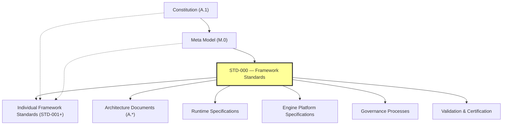

*Figure 3: Dependency Model. Framework Standards consume higher-level authority and provide reusable guidance to lower-level specifications.*

### Success Criteria

This section is complete when the boundaries, inclusions, exclusions, dependency model, and constraints of the Standards Library are explicitly defined.

### Completion Statement

The Scope section establishes the operational boundaries of theAI-DOS Standards Library and ensures that Framework Standards remain focused on reusable, governed, and technology-neutral architectural models.

---

## 5. Authority

### Overview

This section defines the authority model governing theAI-DOS Standards Library.

Authority determines who may create, approve, interpret, modify, certify, deprecate, and archive Framework Standards.

### Authority Principles

- Authority shall be explicit.
- Authority shall be traceable.
- Higher authority overrides lower authority.
- Authority shall never be implied.
- Constitutional authority cannot be delegated without governance.

### Authority Hierarchy

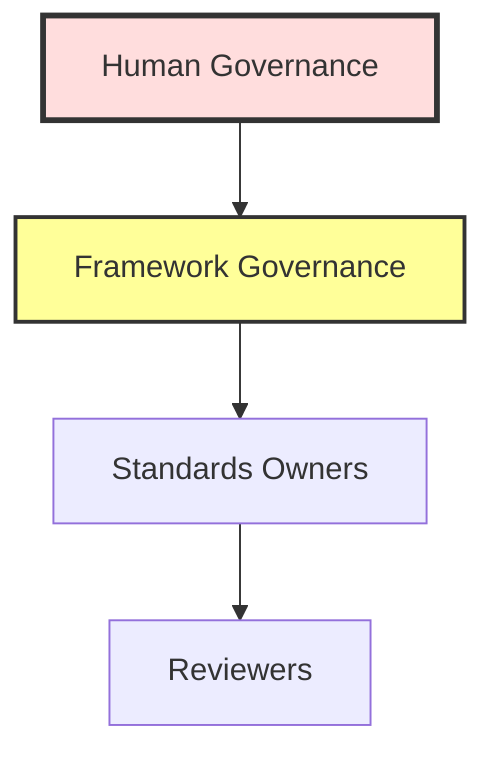

*Figure 4: Authority Hierarchy. Authority flows downward; lower authorities shall never override higher authorities.*

### Authority Responsibilities

| Authority | Responsibilities |
|:---|:---|
| **Human Governance** | Final constitutional authority; constitutional amendments; resolution of constitutional conflicts |
| **Framework Governance** | Approves Framework Standards; maintains Standards Library; resolves standard conflicts; oversees certification |
| **Standards Owners** | Maintain assigned standards; propose revisions; preserve consistency; coordinate reviews |
| **Reviewers** | Verify technical correctness; assess architectural alignment; produce review findings |

### Authority Constraints

A Framework Standard shall not:

- Redefine constitutional authority
- Override the Meta Model
- Conflict with STD-000
- Create parallel governance structures

### Delegation Rules

Authority may delegate execution but not accountability.

Every delegated action shall identify:

- Delegating authority
- Delegated responsibility
- Accountable owner

### Conflict Resolution

Authority conflicts shall be resolved in this order:

1. Constitution
2. Human Governance
3. Framework Governance
4. M.0 Meta Model
5. STD-000
6. Individual Standards

### Success Criteria

This section is complete when authority hierarchy, responsibilities, delegation rules, constraints, and conflict resolution have been explicitly defined.

### Completion Statement

The Authority section establishes the governing authority chain for theAI-DOS Standards Library and ensures that every Framework Standard derives its legitimacy from constitutional governance.

---

## 6. Relationship to M.0 (Meta Model Integration)

### Overview

This section defines how the Framework Standards Library depends upon and specializes theAI-DOS Framework Meta Model (M.0).

M.0 defines the common conceptual language of the Framework. STD-000 defines how that language is transformed into reusable Framework Standards.

### Separation of Responsibilities

| Concern | M.0 — Framework Meta Model | STD-000 — Framework Standards |
|:---|:---|:---|
| **Defines** | Artifact, Entity, Identity, Relationship, Lifecycle, Authority, Ownership, Evidence, Validation, Review, Certification, Reference | How standards are structured; how standards consume the Meta Model; how standards are governed, validated, certified, and evolved |

### Dependency Rule

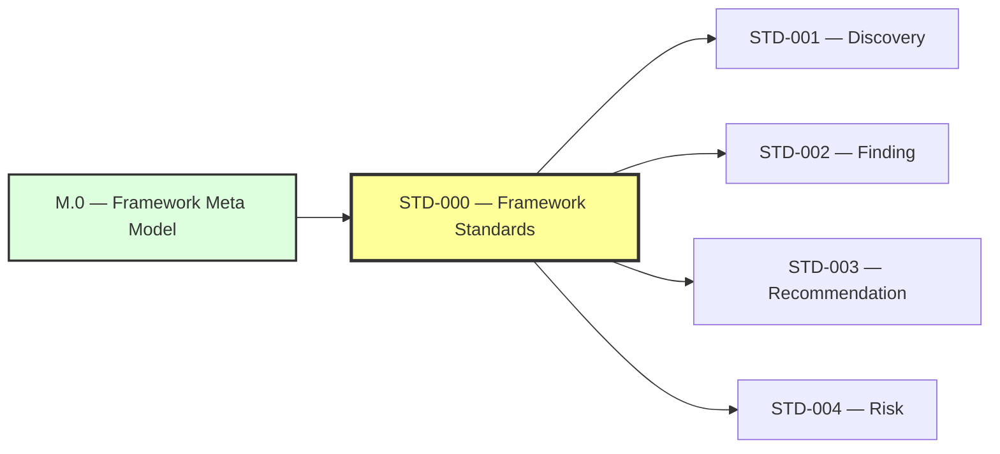

*Figure 5: Meta Model Dependency. Framework Standards shall consume Meta Model concepts rather than redefining them.*

### Derivation Rules

Every Framework Standard shall derive reusable concepts from M.0.

Examples:

- Discovery derives from Artifact
- Finding derives from Artifact
- Recommendation derives from Artifact
- Risk derives from Artifact

Standards may specialize meta concepts but shall not redefine them.

### Reuse Rules

Standards shall reuse M.0 definitions for:

- Identity
- Ownership
- Authority
- Lifecycle
- State
- Relationships
- References
- Evidence

Duplicate definitions are prohibited unless approved through governance.

### Constraints

A Framework Standard shall not:

- Replace M.0
- Redefine Meta Types
- Introduce conflicting identity models
- Create incompatible lifecycle definitions

### Success Criteria

This section is complete when the dependency model, derivation rules, reuse rules, and constraints between M.0 and the Standards Library are explicitly defined.

### Completion Statement

The Relationship to M.0 section establishes the Meta Model as the shared conceptual foundation for every Framework Standard and ensures long-term consistency across the Standards Library.

---

## 7. Standards Philosophy

### Overview

The Standards Philosophy defines the foundational beliefs that guide the creation, evolution, and governance of every Framework Standard.

Framework Standards exist to maximize consistency, reuse, traceability, and long-term maintainability across theAI-DOS Framework.

### Philosophy Statement

A Framework Standard shall define a reusable concept once and enable every Framework document and implementation to consume that concept without redefining it.

### Core Philosophical Principles

| Principle | Description |
|:---|:---|
| **Canonical by Design** | A standard shall establish one authoritative definition for the concept it governs. |
| **Reuse Before Reinvention** | Reusable concepts shall become Framework Standards instead of being duplicated across architecture documents. |
| **Technology Neutrality** | Standards define concepts, not implementations. |
| **Governance Before Promotion** | A standard becomes canonical only through governance, validation, and certification. |
| **Evidence-Driven Evolution** | Every significant change shall be justified by documented evidence and architectural rationale. |
| **Explicit Ownership** | Every standard shall have one accountable owner. |
| **Traceability** | Standards shall maintain traceable relationships to constitutional authority, the Meta Model, and consuming documents. |
| **Stability with Evolution** | Standards should remain stable while supporting controlled, governed evolution. |

### Design Values

Framework Standards should be:

- Simple
- Consistent
- Predictable
- Extensible
- Reviewable
- Auditable
- Long-lived

### Philosophical Constraints

Framework Standards shall not:

- Redefine constitutional principles
- Replace the Meta Model
- Prescribe implementation technology
- Duplicate reusable concepts
- Create conflicting canonical definitions

### Success Criteria

This section is complete when the guiding philosophy, principles, values, and constraints of the Standards Library are explicitly defined.

### Completion Statement

The Standards Philosophy provides the long-term design mindset that guides every Framework Standard and ensures the Standards Library evolves as a coherent, reusable, and governed system.

---

## 8. Standards Classification

### Overview

This section defines the official classification system for all Framework Standards.

A classification identifies the intended scope, authority, consumers, and lifecycle expectations of a standard.

### Classification Principles

Every Framework Standard shall belong to exactly one primary classification.

Additional tags may be used for indexing, but they shall not replace the primary classification.

### Core Standard

Defines foundational concepts required by the entire Framework.

**Characteristics:**

- Highest reuse
- Long lifecycle
- Consumed by multiple Framework layers
- Rarely changed

**Examples:**

- STD-000 — Framework Standards
- STD-001 — Discovery Standard

### Supporting Standard

Defines reusable supporting models that complement Core Standards.

**Examples:**

- Evidence Standard
- Metrics Standard
- Identity Standard

### Extension Standard

Introduces governed extensions to existing standards without redefining the parent model.

**Requirements:**

- Reference parent standard
- Preserve compatibility
- Declare extension scope

### Platform Standard

Defines reusable platform-specific conventions while remaining aligned with Framework Core.

**Examples:**

- WordPress Adapter Standard
- CLI Integration Standard
- REST Integration Standard

### Project Standard

Defines reusable practices within a specific project while remaining compatible with Framework Standards.

> **Note:** Project Standards shall never override Core Standards.

### Classification Matrix

| Classification | Scope | Authority | Consumers |
|:---|:---|:---|:---|
| **Core** | Framework-wide | Framework Governance | All layers |
| **Supporting** | Shared capability | Framework Governance | Multiple standards |
| **Extension** | Existing standard | Parent + Governance | Parent consumers |
| **Platform** | Platform-specific | Framework Governance | Platform adapters |
| **Project** | Project-specific | Project Governance | Individual projects |

### Classification Constraints

A standard shall not:

- Belong to multiple primary classifications
- Redefine another classification
- Weaken authority inherited from higher-level standards

### Success Criteria

This section is complete when every Framework Standard can be assigned a single, well-defined classification with explicit scope and governance expectations.

### Completion Statement

The Standards Classification section establishes the official taxonomy of the Standards Library, enabling consistent governance, navigation, lifecycle management, and future expansion.

---

## 9. Standards Lifecycle

### Overview

This section defines the official lifecycle through which every Framework Standard progresses from initial proposal to historical archive.

The lifecycle ensures that standards evolve in a controlled, transparent, and governed manner.

### Lifecycle Principles

- Every standard shall have one explicit lifecycle state.
- State transitions shall be governed.
- Promotion requires evidence and review.
- Historical versions shall remain traceable.

### Lifecycle Model

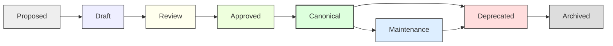

*Figure 6: Standards Lifecycle Model. Each transition requires governed approval and supporting evidence.*

### State Definitions

| State | Description |
|:---|:---|
| **Proposed** | Identifier reserved and concept accepted for exploration. |
| **Draft** | Active authoring. Breaking changes are permitted. |
| **Review** | Ready for architectural and governance review. |
| **Approved** | Review complete and accepted pending publication. |
| **Canonical** | Official Framework Standard. |
| **Maintenance** | Canonical standard receiving compatible improvements. |
| **Deprecated** | Superseded but retained for compatibility and history. |
| **Archived** | Historical reference only. No further evolution. |

### Transition Rules

| Transition | Requirement |
|:---|:---|
| Proposed → Draft | Requires an owner. |
| Draft → Review | Requires structural completeness. |
| Review → Approved | Requires governance review. |
| Approved → Canonical | Requires certification. |
| Canonical → Maintenance | Requires governance approval. |
| Canonical or Maintenance → Deprecated | Requires migration guidance. |
| Deprecated → Archived | Requires governance authorization. |

### Exit Criteria

A state transition shall record:

- Responsible authority
- Supporting evidence
- Approval date
- Resulting version
- Affected references

### Lifecycle Constraints

A standard shall not:

- Skip required lifecycle states
- Become Canonical without certification
- Return from Archived to Canonical
- Lose historical traceability

### Success Criteria

This section is complete when lifecycle states, transitions, criteria, constraints, and governance expectations are explicitly defined.

### Completion Statement

The Standards Lifecycle establishes the governed evolution model for every Framework Standard, ensuring stability, traceability, and controlled change throughout the Standards Library. For a formal state machine representation with additional lifecycle states, see [Section 23 — Standard Lifecycle State Machine](#23-standard-lifecycle-state-machine).

---

## 10. Standards Identity

### Overview

This section defines the canonical identity model for every Framework Standard.

Identity ensures that standards remain uniquely identifiable, traceable, versioned, and referenceable throughout their lifecycle.

### Identity Principles

- Every standard shall have one immutable identifier.
- Identity shall remain stable after publication.
- Identity shall be globally referenceable.
- Identity shall be independent of file location.

### Identity Components

Every Framework Standard shall define:

- Identifier
- Canonical Title
- Version
- Status
- Classification
- Authority
- Owner

### Identifier Format

Canonical format:

```
AI-DOS-STD-000
AI-DOS-STD-001
AI-DOS-STD-002
```

**Rules:**

- Prefix: `AI-DOS`
- Type: `STD`
- Numeric identifier: three digits
- Immutable after publication

### File Naming Convention

```
STD-000-Framework-Standards.md
STD-001-Discovery-Standard.md
STD-002-Finding-Standard.md
```

File names should remain human-readable while identifiers remain machine-stable.

### Version Identity

Standards use semantic versioning as defined in [Section 16 — Versioning](#16-versioning):

```
MAJOR.MINOR.PATCH[-status]
```

**Examples:**

- `1.0.0-draft`
- `1.0.0`
- `1.1.0`
- `2.0.0`

### Identity Constraints

A standard shall not:

- Reuse an identifier
- Change its identifier after publication
- Share an identifier with another standard
- Omit version or lifecycle status

### Identity Relationships

The identity of a standard shall be referenced by:

- Architecture documents
- Meta specifications
- Other Framework Standards
- Validation reports
- Certification records
- Governance decisions

### Success Criteria

This section is complete when identifier rules, naming conventions, version identity, constraints, and referencing expectations are explicitly defined.

### Completion Statement

The Standards Identity section establishes the permanent identity model for every Framework Standard, ensuring stable references, governance continuity, and long-term traceability across theAI-DOS Standards Library. For the comprehensive machine-readable metadata schema, see [Section 26 — Canonical Metadata Schema](#26-canonical-metadata-schema).

---

## 11. Standards Structure

### Overview

This section defines the mandatory document structure for every Framework Standard.

A common structure improves consistency, discoverability, governance, review, certification, and long-term maintainability.

### Structure Principles

- Every Framework Standard shall follow one canonical structure.
- Sections shall appear in a consistent order.
- Optional sections shall be explicitly identified.
- Cross-references shall use canonical identifiers.

### Mandatory Structure

Every STD-\* document shall contain the following sections:

1. Status
2. Preamble
3. Purpose
4. Scope
5. Authority
6. Relationship to M.0
7. Standards Philosophy / Domain Principles
8. Classification (where applicable)
9. Lifecycle
10. Identity
11. Structure
12. Relationships
13. Governance
14. Validation
15. Certification
16. Versioning
17. Migration
18. References
19. Glossary (optional if inherited)
20. Next Standard

### Section Rules

- Headings shall use consistent numbering.
- Each section shall define its own success criteria when appropriate.
- Completion statements shall conclude major sections.
- Normative requirements should use consistent wording (e.g., "shall", "shall not", "may", "should").

### Document Metadata

Every Framework Standard shall declare:

- Identifier
- Canonical Title
- Version
- Status
- Classification
- Authority
- Owner
- Maintainers
- Creation Date
- Last Updated

### Extension Rules

Standards may add domain-specific sections after the mandatory structure, provided they:

- Preserve section order
- Do not remove mandatory sections
- Remain backward compatible unless a major version is published

### Structure Constraints

A standard shall not:

- Omit mandatory metadata
- Reorder mandatory sections without governance approval
- Redefine inherited concepts from M.0 or STD-000

### Success Criteria

This section is complete when every Framework Standard can be authored, reviewed, and certified using a single canonical structure.

### Completion Statement

The Standards Structure section establishes the official template for all Framework Standards, ensuring consistent authoring, governance, and lifecycle management across the Standards Library.

---

## 12. Standards Relationships

### Overview

This section defines how Framework Standards relate to one another and to other document families within theAI-DOS Framework.

The relationship model ensures consistency, traceability, dependency control, and clear architectural boundaries.

### Relationship Principles

- Relationships shall be explicit.
- Relationships shall be directional.
- Relationships shall be traceable.
- Relationships shall preserve authority.
- Circular normative dependencies shall be avoided.

### Relationship Types

| Type | Description |
|:---|:---|
| **Derives From** | Inherits concepts from a higher-level authority. |
| **Consumes** | Uses concepts without redefining them. |
| **References** | Points to another document for context. |
| **Extends** | Adds capabilities while preserving compatibility. |
| **Constrains** | Limits or governs another document. |
| **Produces** | Creates artifacts consumed elsewhere. |

### Relationship Hierarchy

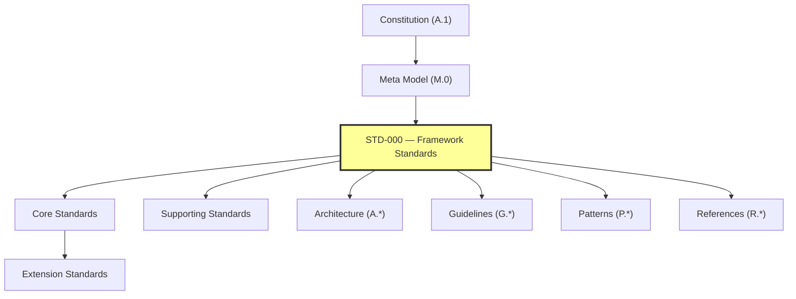

*Figure 7: Relationship Hierarchy. Standards relate to all Framework document families while maintaining authority direction.*

### Cross-Family Relationships

Framework Standards may interact with:

- A.\* — Architecture
- M.\* — Meta
- STD.\* — Standards
- G.\* — Guidelines
- P.\* — Patterns
- R.\* — References
- Runtime specifications
- Engine architecture and engine specifications
- Platform adapters

Standards shall not replace these document families; they provide reusable models for them.

### Dependency Rules

A Framework Standard **may**:

- Derive from higher authority
- Consume multiple standards
- Reference multiple documents

A Framework Standard **shall not**:

- Introduce dependency cycles
- Redefine higher-level authority
- Create conflicting canonical models

### Traceability Rules

Every normative relationship should identify:

- Source document
- Target document
- Relationship type
- Rationale
- Authority basis

### Success Criteria

This section is complete when relationship types, dependency rules, cross-family interactions, and traceability expectations are explicitly defined.

### Completion Statement

The Standards Relationships section establishes the canonical relationship model for the Standards Library, ensuring coherent integration with the Meta Model, Architecture, Governance, Runtime, Engine Platform, and future Framework document families.

---

## 13. Governance

### Overview

This section defines the governance model for theAI-DOS Standards Library.

Governance ensures that Framework Standards are created, reviewed, approved, maintained, and retired through controlled and transparent processes.

### Governance Principles

- Governance shall be explicit.
- Governance shall be evidence-driven.
- Governance shall preserve constitutional alignment.
- Governance shall ensure traceability.
- Governance shall maintain one accountable owner for every standard.

### Governance Roles

| Role | Responsibilities |
|:---|:---|
| **Human Governance** | Final constitutional authority; resolves constitutional conflicts; approves exceptional governance actions. |
| **Framework Governance** | Maintains the Standards Library; reviews and approves standards; oversees lifecycle transitions; coordinates certification. |
| **Standards Owner** | Authors and maintains the assigned standard; coordinates reviews; proposes revisions; preserves consistency. |
| **Reviewers** | Verify technical correctness; assess architectural alignment; produce review findings. |

### Governance Workflow

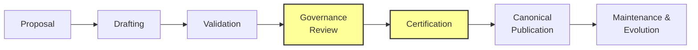

*Figure 8: Governance Workflow. Standards progress through governed stages from Proposal to Canonical Publication and beyond.*

### Change Management

Every significant change shall include:

- Rationale
- Supporting evidence
- Impact assessment
- Affected standards
- Version update
- Review record

### Governance Constraints

Framework Governance shall not:

- Override the [Constitution](../A.1-Constitution.md)
- Redefine the [Meta Model](../../Meta/M.0-Framework-Meta-Model.md)
- Bypass validation or certification
- Promote unresolved conflicts to canonical status

### Decision Records

Governance decisions should be recorded with:

- Decision identifier
- Owner
- Authority
- Evidence references
- Outcome
- Affected documents

For the canonical Standard Decision Record template, see [Section 29 — Standard Decision Record](#29-standard-decision-record).

### Success Criteria

This section is complete when governance roles, workflow, responsibilities, constraints, and decision expectations have been explicitly defined.

### Completion Statement

The Governance section establishes the operating model for managing theAI-DOS Standards Library throughout its lifecycle while preserving constitutional authority, consistency, and long-term maintainability.

---

## 14. Validation

### Overview

Validation establishes the quality assurance model for every Framework Standard before it may progress through its lifecycle.

Validation confirms that a standard is structurally complete, constitutionally aligned, internally consistent, and suitable for governance review.

### Validation Principles

- Validation shall be objective.
- Validation shall be repeatable.
- Validation shall be evidence-based.
- Validation shall preserve traceability.
- Validation shall occur before certification.

### Validation Scope

Every Framework Standard shall be validated for:

- Structural compliance
- Metadata completeness
- Constitutional alignment
- Meta Model alignment
- Terminology consistency
- Relationship integrity
- Cross-reference accuracy
- Governance completeness
- Version consistency

### Validation Workflow

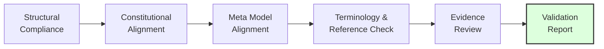

*Figure 9: Validation Workflow. Each validation stage produces findings that must be resolved before certification.*

### Validation Gates

A standard shall satisfy the following quality gates before governance approval:

- Required sections present
- Required metadata complete
- Authority chain valid
- References resolved
- No conflicting canonical definitions
- Terminology consistent
- Traceability preserved

### Validation Evidence

Validation shall produce:

- Validation identifier
- Validation date
- Validator
- Findings
- Evidence references
- Pass/fail result
- Corrective actions (if applicable)

### Validation Constraints

Validation shall not:

- Approve constitutional conflicts
- Replace governance approval
- Omit evidence for failed checks
- Certify a document directly

### Success Criteria

This section is complete when validation principles, workflow, quality gates, evidence requirements, and constraints have been explicitly defined.

### Completion Statement

The Validation section establishes the canonical quality assurance model for theAI-DOS Standards Library, ensuring every Framework Standard is verified before governance approval and certification.

---

## 15. Certification

### Overview

Certification is the formal governance process through which a Framework Standard is recognized as a Canonical Standard.

Certification confirms that [validation](#14-validation) has been completed, governance approval has been granted, and the standard satisfies all constitutional, meta-model, and standards framework requirements.

### Certification Principles

- Certification shall follow validation.
- Certification shall be evidence-based.
- Certification shall be governed.
- Certification shall be traceable.
- Certification shall be repeatable.

### Certification Prerequisites

Before certification, a Framework Standard shall have:

- Completed validation
- Resolved blocking findings
- Documented governance review
- Identified owner and authority
- Complete metadata
- Consistent references

### Certification Workflow

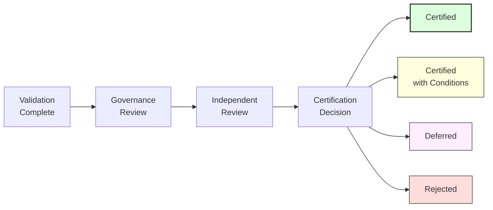

*Figure 10: Certification Workflow. Only validated and reviewed standards may proceed to certification, with four possible outcomes.*

### Certification Decision

Possible outcomes:

- **Certified** — Standard meets all requirements.
- **Certified with Conditions** — Standard meets requirements subject to documented conditions.
- **Deferred** — Standard requires additional work before re-evaluation.
- **Rejected** — Standard does not meet certification requirements.

Each decision shall include documented rationale and supporting evidence.

### Certification Record

Every certification shall record:

- Certification ID
- Standard Identifier
- Version
- Certification Date
- Certifying Authority
- Decision
- Supporting Evidence
- Review References
- Conditions (if any)

### Certification Constraints

Certification shall not:

- Bypass [validation](#14-validation)
- Override the [Constitution](../A.1-Constitution.md)
- Ignore unresolved critical findings
- Publish conflicting canonical standards

### Success Criteria

This section is complete when certification principles, prerequisites, workflow, records, decisions, and constraints have been explicitly defined.

### Completion Statement

The Certification section establishes the canonical acceptance process for Framework Standards and ensures that only governed, validated, and evidence-backed standards become part of theAI-DOS Standards Library. For a multi-level certification model, see [Section 27 — Certification Levels](#27-certification-levels).

---

## 16. Versioning

### Overview

This section defines the canonical versioning strategy for every Framework Standard.

Versioning communicates compatibility expectations, maturity, and the impact of changes while preserving long-term traceability.

### Versioning Principles

- Every standard shall have one explicit version.
- Versions shall be immutable once published.
- Version history shall remain traceable.
- Breaking changes shall require a major version.

### Version Format

Framework Standards use Semantic Versioning:

```
MAJOR.MINOR.PATCH[-STATUS]
```

**Examples:**

- `1.0.0-draft`
- `1.0.0-review`
- `1.0.0`
- `1.1.0`
- `1.1.2`
- `2.0.0`

### Version Semantics

| Component | Usage |
|:---|:---|
| **Major** | Used for incompatible structural or governance changes. |
| **Minor** | Used for backward-compatible additions and enhancements. |
| **Patch** | Used for editorial corrections, clarifications, reference updates, and non-breaking improvements. |
| **Status Suffix** | Optional lifecycle qualifier (e.g., `draft`, `review`); canonical releases normally omit a suffix. |

### Compatibility Rules

- Major releases may introduce breaking changes.
- Minor releases shall remain backward compatible.
- Patch releases shall not alter normative behavior.

### Change Classification

Every version update shall classify the change as one or more of:

- Editorial
- Clarification
- Structural
- Governance
- Meta Model Alignment
- Breaking Change
- Compatibility Improvement

### Version History

Every Framework Standard should maintain a version history including:

- Version
- Date
- Summary
- Author or Owner
- Approval Status

### Constraints

A Framework Standard shall not:

- Reuse version identifiers
- Downgrade a published version
- Modify historical release records
- Publish breaking changes as a patch release

### Success Criteria

This section is complete when version format, semantics, compatibility rules, change classification, and history requirements are explicitly defined.

### Completion Statement

The Versioning section establishes a predictable evolution model for Framework Standards, enabling safe maintenance, compatibility management, and long-term governance.

---

## 17. Migration

### Overview

This section defines the canonical migration model for Framework Standards.

Migration ensures that the Standards Library can evolve without losing traceability, governance history, or compatibility guidance.

### Migration Principles

- Migration shall preserve history.
- Migration shall be governed.
- Migration shall be documented.
- Migration shall be traceable.
- Migration shall minimize disruption.

### Migration Triggers

Migration may be initiated when:

- A standard becomes deprecated
- A major version introduces breaking changes
- The [Meta Model](../../Meta/M.0-Framework-Meta-Model.md) evolves
- Constitutional amendments affect standards
- Standards are merged, split, or superseded

### Migration Workflow

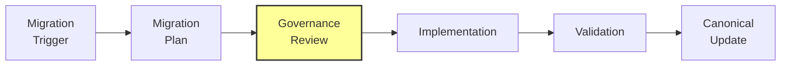

*Figure 11: Migration Workflow. All migrations require a governed plan, review, implementation, validation, and canonical update.*

### Migration Plan

Every migration plan shall define:

- Source standard
- Target standard
- Migration rationale
- Compatibility expectations
- Affected documents
- Required actions
- Validation strategy
- Rollback considerations (if applicable)

### Compatibility Strategy

Migration should identify one of the following:

- **Fully Compatible** — No consumer changes required.
- **Partially Compatible** — Some consumer updates needed; migration guidance provided.
- **Breaking Change** — Significant consumer changes required; full migration plan mandated.
- **Historical Preservation Only** — Standard is being archived; no active migration path.

### Deprecation Rules

Deprecated standards shall:

- Remain referenceable
- Identify their successor when available
- Include migration guidance
- Remain historically accessible

### Migration Constraints

Migration shall not:

- Destroy historical versions
- Reuse obsolete identifiers
- Remove traceability
- Bypass governance approval

### Success Criteria

This section is complete when migration principles, workflow, planning, compatibility strategy, and deprecation rules are explicitly defined.

### Completion Statement

The Migration section establishes the governed evolution process for Framework Standards, ensuring orderly transitions while preserving historical integrity and architectural continuity.

---

## 18. References

### Overview

This section defines how Framework Standards reference authoritative sources and related Framework documents.

References preserve traceability, reduce duplication, and establish a consistent navigation model across the Framework.

### Reference Principles

- References shall be explicit.
- References shall identify authority.
- References shall remain stable.
- Normative references shall take precedence over informative references.

### Reference Categories

#### Normative References

Documents that define mandatory requirements.

| Reference | Description |
|:---|:---|
| [A.1 — Constitution](../A.1-Constitution.md) | The constitutional authority governing all Framework Standards. |
| [M.0 — Framework Meta Model](../../Meta/M.0-Framework-Meta-Model.md) | The conceptual type system consumed by all Framework Standards. |
| [M.1 — Artifact Meta Model](../../Meta/M.1-Artifact-Meta-Model.md) | The artifact identity, structure, lifecycle, and evidence model consumed by Standards and Engine artifacts. |
| [STD-001 — Knowledge Graph Standard](STD-001-Knowledge-Graph-Standard.md) | The canonical graph semantics consumed by Standards, Runtime, Engine specifications, and validation. |
| [STD-002 — Discovery Standard](STD-002-Discovery-Standard.md) | The governed discovery model consumed by Registry, Runtime, and Engine coordination. |
| [A.3 — Runtime Architecture RFC](../../Runtime/A.3-Runtime-Architecture-RFC.md) | The runtime hosting architecture that consumes standards and supplies execution context. |
| [A.4 — Engine Architecture RFC](../../Runtime/A.4-Engine-Architecture-RFC.md) | The Engine Platform architecture that coordinates governed execution through engine contracts. |

#### Informative References

Documents that provide supporting context, examples, rationale, or background.

| Reference | Description |
|:---|:---|
| [A.0 — Framework Audit](../A.0-Framework-Audit.md) | The verified architectural baseline that informed Standards Library design. |
| STD-001 — Discovery Standard (Planned) | The first specialized Framework Standard. |
| STD-002 — Finding Standard (Planned) | The second specialized Framework Standard. |
| STD-003 — Recommendation Standard (Planned) | The third specialized Framework Standard. |
| STD-004 — Risk Standard (Planned) | The fourth specialized Framework Standard. |
| STD-005 — Evidence Standard (Planned) | The fifth specialized Framework Standard. |
| STD-006 — Identity Standard (Planned) | The sixth specialized Framework Standard. |
| STD-007 — Metrics Standard (Planned) | The seventh specialized Framework Standard. |
| STD-008 — Readiness Standard (Planned) | The eighth specialized Framework Standard. |

### Cross-Reference Rules

Framework Standards should reference other documents using their canonical identifiers.

```
A.0
A.1
M.0
STD-001
STD-002
```

References should avoid ambiguous titles when a canonical identifier exists.

### External References

External publications may be referenced for context.

External references shall not override constitutional or canonical Framework authority.

### Reference Integrity

Every reference should remain:

- Identifiable
- Resolvable
- Relevant
- Version-aware where applicable

Broken or obsolete references should be corrected through normal governance processes.

### Reference Constraints

Framework Standards shall not:

- Cite conflicting documents as normative authority
- Rely on unpublished canonical sources
- Create circular normative references

### Success Criteria

This section is complete when reference categories, integrity rules, constraints, and cross-reference conventions are explicitly defined.

### Completion Statement

The References section establishes a consistent and traceable reference model for theAI-DOS Standards Library, ensuring every Framework Standard can identify and consume authoritative sources in a predictable manner.

---

## 19. Glossary

### Overview

This glossary defines the canonical terminology used throughout theAI-DOS Standards Library.

Unless explicitly overridden by a higher-authority document, these definitions shall be used consistently across all Framework Standards.

### Core Terms

| Term | Definition |
|:---|:---|
| **Artifact** | A governed object with identity, ownership, lifecycle, and traceability. |
| **Authority** | The source of legitimate decision-making and governance. |
| **Canonical** | The officially approved and authoritative version of a concept or document. |
| **Certification** | The governed process that promotes a validated standard to Canonical status. |
| **Discovery** | A governed architectural observation captured before becoming a Finding. |
| **Evidence** | Verifiable information supporting a claim, finding, recommendation, review, or certification. |
| **Finding** | A governed conclusion derived from one or more Discoveries and supported by Evidence. |
| **Framework Standard** | A reusable, governed specification defining a common model, rule, schema, or process. |
| **Governance** | The controlled process for managing standards, reviews, approvals, and lifecycle transitions. |
| **Identity** | The permanent identifier assigned to an Artifact. |
| **Lifecycle** | The ordered sequence of states through which an Artifact progresses. |
| **Meta Model** | The conceptual type system defined by M.0. |
| **Owner** | The accountable party responsible for an Artifact. |
| **Recommendation** | A governed proposal for addressing one or more Findings. |
| **Reference** | A traceable link to another authoritative source or Artifact. |
| **Relationship** | An explicit, governed connection between Artifacts. |
| **Review** | An independent assessment of quality, readiness, or alignment. |
| **Standard** | A reusable specification governed by STD-000. |
| **Traceability** | The ability to follow relationships, authority, evidence, and lifecycle across Artifacts. |
| **Validation** | The process of verifying that an Artifact satisfies defined requirements. |
| **Version** | A managed release identifier communicating maturity and compatibility. |
| **Compliance Level** | A graduated measure (L0–L5) of how thoroughly a standard has been governed, validated, and certified. |
| **Capability Matrix** | A declaration of what a standard owns, consumes, and produces, enabling dependency analysis and impact assessment. |
| **Standards Registry** | The authoritative inventory of all Framework Standards, their status, dependencies, and relationships. |
| **Standards Taxonomy** | The domain-level classification system categorizing standards by their functional domain (Identity, Governance, Runtime, etc.). |
| **Standard Decision Record (SDR)** | A structured record documenting significant decisions made during standard creation, evolution, or governance. |
| **Certification Level** | A graduated measure (Provisional, Certified, Verified, Canonical) of certification rigor for a Framework Standard. |
| **AI Consumption** | The governed process by which AI systems read, reference, and derive from Framework Standards within delegated execution boundaries. |

### Terminology Rules

- Terms shall be used consistently.
- Higher-authority definitions take precedence.
- New terms should be added through governance.
- Synonyms should be avoided where canonical terms exist.

### Success Criteria

This glossary is complete when core terminology is consistently defined and reusable across the Standards Library.

### Completion Statement

The Glossary establishes the shared vocabulary for Framework Standards and promotes consistent communication throughout theAI-DOS Framework.

---

## 20. Next Standard

### Overview

This section defines the continuation of the Standards Library roadmap following completion of STD-000.

STD-000 establishes the governance, structure, lifecycle, and operating rules for Framework Standards.

Subsequent standards shall specialize reusable Framework concepts without redefining the common rules established by STD-000.

### Immediate Successor

The next Framework Standard is:

| Property | Value |
|:---|:---|
| **Identifier** | STD-001 |
| **Title** | Discovery Standard |
| **Status** | Planned |
| **Role** | Defines the canonical Discovery Artifact derived from M.0 and governed by STD-000. |

### Standards Roadmap

The initial Standards Library roadmap is:

| Standard | Title | Status |
|:---|:---|:---|
| STD-001 | Discovery Standard | Planned |
| STD-002 | Finding Standard | Planned |
| STD-003 | Recommendation Standard | Planned |
| STD-004 | Risk Standard | Planned |
| STD-005 | Evidence Standard | Planned |
| STD-006 | Identity Standard | Planned |
| STD-007 | Metrics Standard | Planned |
| STD-008 | Readiness Standard | Planned |

Additional standards may be introduced through Framework Governance as the Framework evolves.

### Dependency Rules

Every new Framework Standard shall:

- Derive from M.0 where applicable
- Comply with STD-000
- Declare its authority
- Define its scope
- Avoid redefining inherited concepts
- Reference higher-level standards when consuming shared models

### Authoring Expectations

Authors of future standards should:

- Reuse canonical terminology
- Preserve architectural consistency
- Extend rather than duplicate existing standards
- Maintain backward compatibility where possible
- Document rationale for significant deviations

### Success Criteria

This section is complete when the next standard, roadmap, dependency expectations, and authoring guidance are explicitly defined.

### Completion Statement

STD-000 is complete. It establishes the governing framework for theAI-DOS Standards Library and provides the canonical foundation upon which all future Framework Standards shall be authored, governed, validated, certified, versioned, and maintained.

---


---

## 21. Standards Taxonomy

### Overview

This section defines the official taxonomy of standard categories within theAI-DOS Standards Library. While [Section 8 — Standards Classification](#8-standards-classification) establishes the governance classification (Core, Supporting, Extension, Platform, Project), this section defines the **domain taxonomy** — what functional domain a standard addresses.

Every Framework Standard shall be assigned exactly one domain taxonomy category in addition to its governance classification. The two classification dimensions are independent and complementary.

### Taxonomy Categories

| Category | Description | Scope | Example Standards |
|:---|:---|:---|:---|
| **Identity Standards** | Define how artifacts, standards, and entities are identified, named, and referenced. | Identifiers, naming conventions, reference schemes. | STD-006 — Identity Standard |
| **Governance Standards** | Define how governance processes, decisions, approvals, and lifecycle transitions are structured. | Governance workflows, decision records, approval chains. | STD-000 — Framework Standards |
| **Runtime Standards** | Define how runtime behavior, execution models, and operational contracts are structured. | Runtime contracts, execution models, operational schemas. | (Future) |
| **Schema Standards** | Define reusable data schemas, structure definitions, and canonical formats. | Data models, document schemas, artifact structures. | (Future) |
| **Naming Standards** | Define naming conventions, terminology rules, and lexical standards. | Naming patterns, terminology governance, lexical rules. | (Future) |
| **Validation Standards** | Define how validation is performed, what constitutes compliance, and how quality is measured. | Validation rules, quality gates, compliance criteria. | (Future) |
| **Security Standards** | Define security expectations, access control models, and protection requirements. | Security policies, access models, protection schemas. | (Future) |
| **Evidence Standards** | Define how evidence is collected, classified, stored, and referenced. | Evidence models, evidence categories, evidence lifecycle. | STD-005 — Evidence Standard |
| **Documentation Standards** | Define how documentation is structured, authored, and maintained. | Document templates, authoring conventions, documentation lifecycle. | (Future) |
| **Migration Standards** | Define how migrations, deprecations, and transitions are governed. | Migration procedures, deprecation rules, transition plans. | (Future) |
| **Template Standards** | Define reusable templates for common governance and architectural artifacts. | Decision record templates, review templates, plan templates. | (Future) |
| **Metadata Standards** | Define how metadata is structured, declared, and consumed across the Framework. | Metadata schemas, metadata registries, metadata lifecycle. | (Future) |

### Relationship to Governance Classification

The domain taxonomy and the governance classification from [Section 8](#8-standards-classification) are independent dimensions:

- A standard has **one** governance classification (Core / Supporting / Extension / Platform / Project).
- A standard has **one** domain taxonomy category (from the 12 categories above).
- The two dimensions together provide complete classification.

| | Core | Supporting | Extension | Platform | Project |
|:---|:---|:---|:---|:---|:---|
| **Identity** | STD-006 | — | — | — | — |
| **Governance** | STD-000 | — | — | — | — |
| **Evidence** | STD-005 | — | — | — | — |
| **Runtime** | — | — | — | — | — |
| **Schema** | — | — | — | — | — |
| **Migration** | — | — | — | — | — |

### Taxonomy Principles

- Every standard shall belong to exactly one domain taxonomy category.
- New categories may be added through governance approval.
- Categories shall not be merged or removed without constitutional governance.
- The taxonomy shall be reviewed during each major version of STD-000.

### Taxonomy Constraints

A standard shall not:

- Belong to multiple domain taxonomy categories.
- Change its domain taxonomy without governance approval.
- Be classified in a domain that contradicts its actual scope.

### Success Criteria

This section is complete when every domain taxonomy category is defined with scope, examples, and relationship to the governance classification.

### Completion Statement

The Standards Taxonomy provides the domain-level classification system for theAI-DOS Standards Library, complementing the governance classification and enabling precise categorization, navigation, and governance of all Framework Standards.

---

## 22. Standard Dependency Matrix

### Overview

This section defines the canonical dependency rules and matrix for Framework Standards. While [Section 12 — Standards Relationships](#12-standards-relationships) defines the general relationship model, this section provides the formal dependency graph rules and a concrete dependency matrix for the Standards Library.

### Dependency Rules

- Standards may only depend on lower-authority standards or equal-level standards that have been declared as permissible dependencies.
- Circular dependencies are forbidden.
- The dependency graph shall be acyclic.
- Every dependency shall be explicitly declared in the standard's metadata (see [Section 26 — Canonical Metadata Schema](#26-canonical-metadata-schema)).

### Dependency Authority Principle

Dependencies shall flow from consuming standards to providing standards. A standard with higher architectural authority shall not depend on a standard with lower authority. STD-000 is the root standard and depends only on the [Constitution](../A.1-Constitution.md) and the [Meta Model](../../Meta/M.0-Framework-Meta-Model.md).

### Dependency Graph

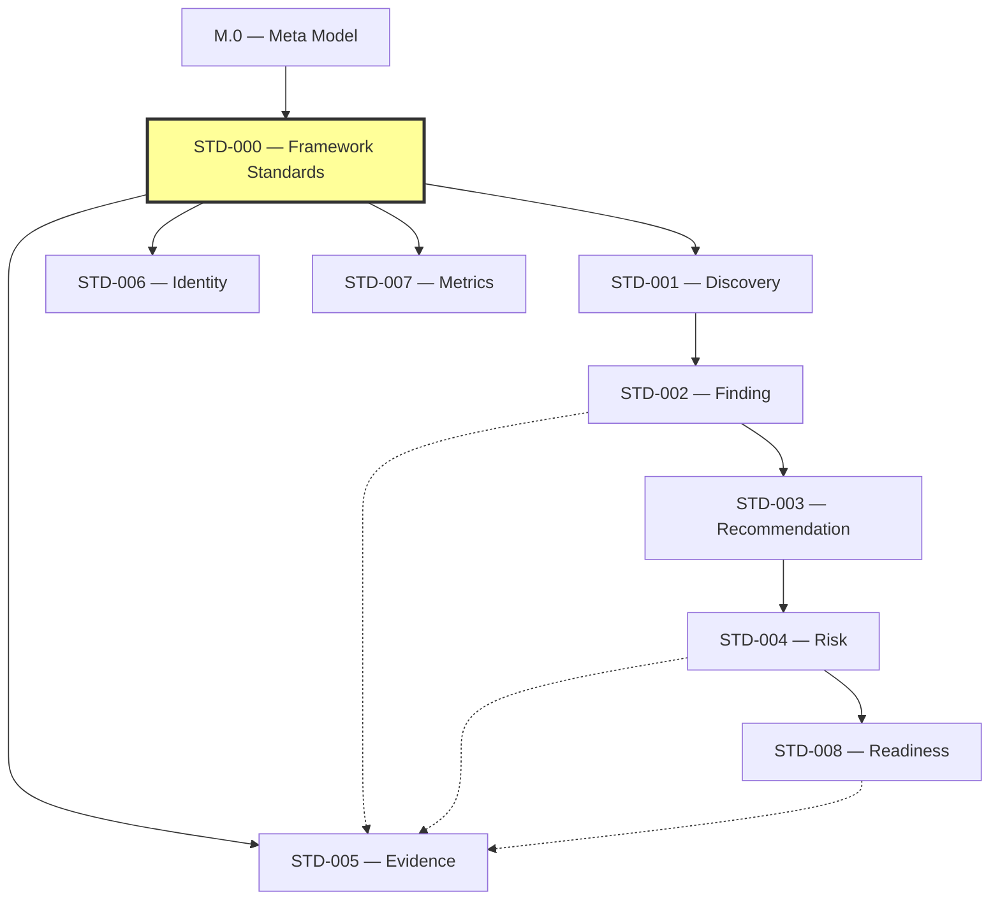

*Figure 12: Standard Dependency Graph. Solid lines represent normative dependencies; dashed lines represent informative references. The graph is acyclic by design.*

### Dependency Matrix

| Standard | Depends On (Normative) | References (Informative) |
|:---|:---|:---|
| **STD-000** | A.1, M.0 | A.0 |
| **STD-001** | STD-000, M.0 | — |
| **STD-002** | STD-001, STD-000, M.0 | — |
| **STD-003** | STD-002, STD-000, M.0 | — |
| **STD-004** | STD-003, STD-000, M.0 | — |
| **STD-005** | STD-000, M.0 | — |
| **STD-006** | STD-000, M.0 | — |
| **STD-007** | STD-000, M.0 | — |
| **STD-008** | STD-004, STD-000, M.0 | — |

### Dependency Validation

The dependency graph shall be validated during [validation](#14-validation) to ensure:

- No circular dependencies exist.
- All declared dependencies reference existing, published standards.
- Dependency direction respects the authority hierarchy from [Section 5](#5-authority).
- No standard depends on a standard in a lower lifecycle state.

### Dependency Constraints

A Framework Standard shall not:

- Declare a dependency on a standard that does not exist.
- Introduce a dependency cycle.
- Depend on a standard with lower authority without governance approval.
- Remove a dependency without impact assessment and version increment.

### Success Criteria

This section is complete when dependency rules, the dependency graph, the dependency matrix, validation requirements, and constraints are explicitly defined.

### Completion Statement

The Standard Dependency Matrix establishes the formal dependency governance for the Standards Library, ensuring that all inter-standard dependencies are explicit, acyclic, authority-respecting, and validated.

---

## 23. Standard Lifecycle State Machine

### Overview

This section defines the formal state machine for the Standards Lifecycle. While [Section 9 — Standards Lifecycle](#9-standards-lifecycle) defines the foundational lifecycle states and transition rules, this section provides a more granular state machine with additional states (Validated, Certified) and formal transition guards.

The state machine defined here extends — but does not replace — the lifecycle model in Section 9.

### Relationship to Section 9

[Section 9](#9-standards-lifecycle) defines the eight foundational states (Proposed, Draft, Review, Approved, Canonical, Maintenance, Deprecated, Archived). This section refines the progression between Review and Canonical by introducing two additional intermediate states:

- **Validated** — The standard has passed all validation checks per [Section 14](#14-validation).
- **Certified** — The standard has passed certification per [Section 15](#15-certification).

The states from Section 9 map to the state machine as follows:

| Section 9 State | State Machine Equivalent | Notes |
|:---|:---|:---|
| Proposed | Proposed | Identical. |
| Draft | Draft | Identical. |
| Review | Review | Identical. |
| Approved | Validated | Renamed to reflect that validation has occurred. |
| — | Certified | New state between Validated and Canonical. |
| Canonical | Canonical | Identical. |
| Maintenance | Maintenance | Identical. |
| Deprecated | Deprecated | Identical. |
| Archived | Archived | Identical. |

### State Machine

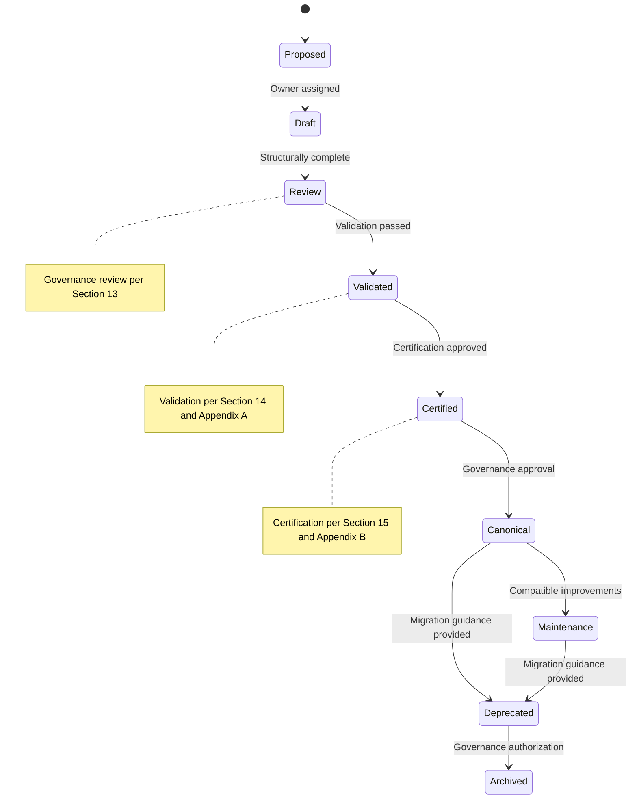

*Figure 13: Standard Lifecycle State Machine. Each transition has defined guards and requires explicit governance action.*

### State Definitions

| State | Description | Entry Guard | Exit Condition |
|:---|:---|:---|:---|
| **Proposed** | Identifier reserved; concept accepted for exploration. | Governance acceptance of proposal. | Owner is assigned. |
| **Draft** | Active authoring; breaking changes permitted. | Owner assigned. | Structural completeness verified. |
| **Review** | Ready for architectural and governance review. | Structural completeness. | All validation checks pass. |
| **Validated** | Validation complete; all blocking findings resolved. | Validation passed per [Section 14](#14-validation). | Certification approved. |
| **Certified** | Certification granted; pending canonical publication. | Certification decision is Certified or Certified with Conditions per [Section 15](#15-certification). | Governance approves canonical publication. |
| **Canonical** | Official Framework Standard. | Governance publication approval. | Deprecated or enters Maintenance. |
| **Maintenance** | Canonical standard receiving compatible improvements. | Governance approval for maintenance mode. | Deprecated or superseded. |
| **Deprecated** | Superseded but retained for compatibility and history. | Migration guidance provided per [Section 17](#17-migration). | Governance authorization to archive. |
| **Archived** | Historical reference only; no further evolution. | Governance authorization. | Terminal state. |

### Transition Guards

| Transition | Guard | Authority |
|:---|:---|:---|
| Proposed → Draft | Owner is assigned and accountable. | Framework Governance |
| Draft → Review | Standard is structurally complete per [Section 11](#11-standards-structure). | Standards Owner |
| Review → Validated | All blocking validation checks pass per [Appendix A](../Appendix/STD-000-Framework-Standards-Appendix-A-Validation-Checklist.md). | Reviewers |
| Validated → Certified | Certification decision is Certified or Certified with Conditions. | Framework Governance |
| Certified → Canonical | Governance approves canonical publication. | Framework Governance |
| Canonical → Maintenance | Compatible improvements are planned. | Framework Governance |
| Canonical/Maintenance → Deprecated | Migration guidance is documented. | Framework Governance |
| Deprecated → Archived | No active consumers remain or governance authorizes archival. | Framework Governance |

### Relationship to Compliance Levels

The state machine states map to [Compliance Levels](#24-compliance-levels) as follows:

| State | Compliance Level |
|:---|:---|
| Proposed | L0 — Experimental |
| Draft | L1 — Draft |
| Review | L2 — Governance Reviewed |
| Validated | L3 — Validated |
| Certified | L4 — Certified |
| Canonical | L5 — Canonical |

### Constraints

A standard shall not:

- Transition to a state without satisfying the entry guard.
- Skip states in the machine (except where explicitly governed).
- Return from Archived to any active state.
- Transition from Validated to Canonical without passing through Certified.

### Success Criteria

This section is complete when the state machine, all state definitions, transition guards, compliance level mapping, and constraints are explicitly defined.

### Completion Statement

The Standard Lifecycle State Machine provides a formal, guard-governed model for standard lifecycle transitions, extending the foundational lifecycle from [Section 9](#9-standards-lifecycle) with granular intermediate states and explicit transition authorities.

---

## 24. Compliance Levels

### Overview

This section defines a six-level compliance model that provides a graduated measure of how thoroughly a Framework Standard has been governed, validated, and certified. Compliance levels enable consumers to assess the maturity and governance rigor of any standard at a glance.

### Compliance Levels

| Level | Name | Description | Lifecycle State | Requirements | Authority |
|:---|:---|:---|:---|:---|:---|
| **L0** | Experimental | Early exploration; no governance commitment. | Proposed | Owner assigned; identifier reserved. | Standards Owner |
| **L1** | Draft | Active authoring; structure in progress. | Draft | Structurally complete per [Section 11](#11-standards-structure). | Standards Owner |
| **L2** | Governance Reviewed | Reviewed by governance; findings may exist. | Review | Governance review completed per [Section 13](#13-governance). | Framework Governance |
| **L3** | Validated | All blocking validation checks passed. | Validated | Validation passed per [Section 14](#14-validation) and [Appendix A](../Appendix/STD-000-Framework-Standards-Appendix-A-Validation-Checklist.md). | Reviewers |
| **L4** | Certified | Certification granted; fully governed. | Certified | Certification approved per [Section 15](#15-certification) and [Appendix B](../Appendix/STD-000-Framework-Standards-Appendix-B-Certification-Templates.md). | Framework Governance |
| **L5** | Canonical | Official Framework Standard; highest maturity. | Canonical | Published as canonical after governance approval. | Framework Governance |

### Compliance Level Progression

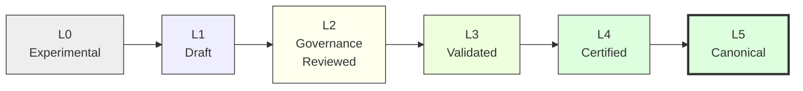

*Figure 14: Compliance Level Progression. Each level requires the previous level to be satisfied.*

### Compliance Level Rules

- Every standard shall declare its current compliance level.
- Compliance level shall be consistent with the standard's lifecycle state per [Section 23](#23-standard-lifecycle-state-machine).
- A standard may not claim a compliance level higher than its lifecycle state supports.
- Compliance levels shall be recorded in the [Standards Registry](#28-standards-registry).

### Consumer Guidance

| Consumer Need | Minimum Recommended Level |
|:---|:---|
| Exploratory prototyping | L0 — Experimental |
| Internal tooling | L1 — Draft |
| Shared team documentation | L2 — Governance Reviewed |
| Framework integration | L3 — Validated |
| Production consumption | L4 — Certified |
| Canonical architecture reference | L5 — Canonical |

### Constraints

A standard shall not:

- Claim a compliance level it has not achieved.
- Skip compliance levels without governance approval.
- Downgrade its compliance level without documented rationale.

### Success Criteria

This section is complete when all six compliance levels are defined with descriptions, requirements, lifecycle state mapping, and consumer guidance.

### Completion Statement

The Compliance Levels section provides a graduated maturity model for Framework Standards, enabling consumers to make informed decisions about standard adoption based on governance rigor and validation completeness.

---

## 25. Capability Matrix

### Overview

This section defines the capability matrix model that every Framework Standard shall declare. The capability matrix identifies what a standard owns (defines), consumes (depends on), and produces (creates for others), enabling precise dependency analysis and impact assessment across the Standards Library.

### Capability Definitions

| Capability Type | Description |
|:---|:---|
| **Capabilities Owned** | Concepts, schemas, rules, or processes that the standard defines as its primary responsibility. |
| **Capabilities Consumed** | Concepts, schemas, or interfaces that the standard requires from other standards or authorities. |
| **Capabilities Produced** | Artifacts, data, or interfaces that the standard creates for consumption by other standards or documents. |

### Capability Matrix Schema

Every Framework Standard shall declare its capability matrix as part of its metadata (see [Section 26 — Canonical Metadata Schema](#26-canonical-metadata-schema)).

### Example Capability Matrix

| Standard | Capabilities Owned | Capabilities Consumed | Capabilities Produced |
|:---|:---|:---|:---|
| **STD-000** | Standards governance, lifecycle, identity, structure, validation rules, certification rules, versioning, migration, taxonomy, compliance levels, capability matrix, metadata schema, registry, decision records, AI consumption rules. | Constitutional authority (A.1), Meta Model concepts (M.0). | Canonical standard structure, standards governance model, validation checklist, certification templates, migration playbook. |
| **STD-001** | Discovery artifact model, discovery schema, discovery lifecycle. | Artifact (M.0), Identity (M.0), Lifecycle (M.0), Evidence (STD-005), Identity conventions (STD-006). | Discovery artifacts for consumption by STD-002. |
| **STD-002** | Finding artifact model, finding schema, finding derivation rules. | Discovery (STD-001), Artifact (M.0), Evidence (STD-005). | Finding artifacts for consumption by STD-003. |
| **STD-003** | Recommendation artifact model, recommendation schema. | Finding (STD-002), Evidence (STD-005). | Recommendation artifacts for consumption by STD-004. |
| **STD-004** | Risk artifact model, risk schema, risk assessment rules. | Recommendation (STD-003), Evidence (STD-005). | Risk artifacts for consumption by STD-008. |
| **STD-005** | Evidence artifact model, evidence categories, evidence lifecycle. | Artifact (M.0), Identity (M.0), Lifecycle (M.0). | Evidence artifacts consumed by STD-001 through STD-004 and STD-008. |
| **STD-006** | Identity conventions, naming rules, reference schemes. | Artifact (M.0), Identity (M.0). | Identity patterns consumed by all standards. |
| **STD-007** | Metrics model, measurement definitions, metric categories. | Artifact (M.0), Evidence (STD-005). | Metrics artifacts consumed by governance and validation processes. |
| **STD-008** | Readiness model, readiness criteria, readiness assessment. | Risk (STD-004), Evidence (STD-005), Metrics (STD-007). | Readiness assessments for Framework consumption. |

### Capability Flow

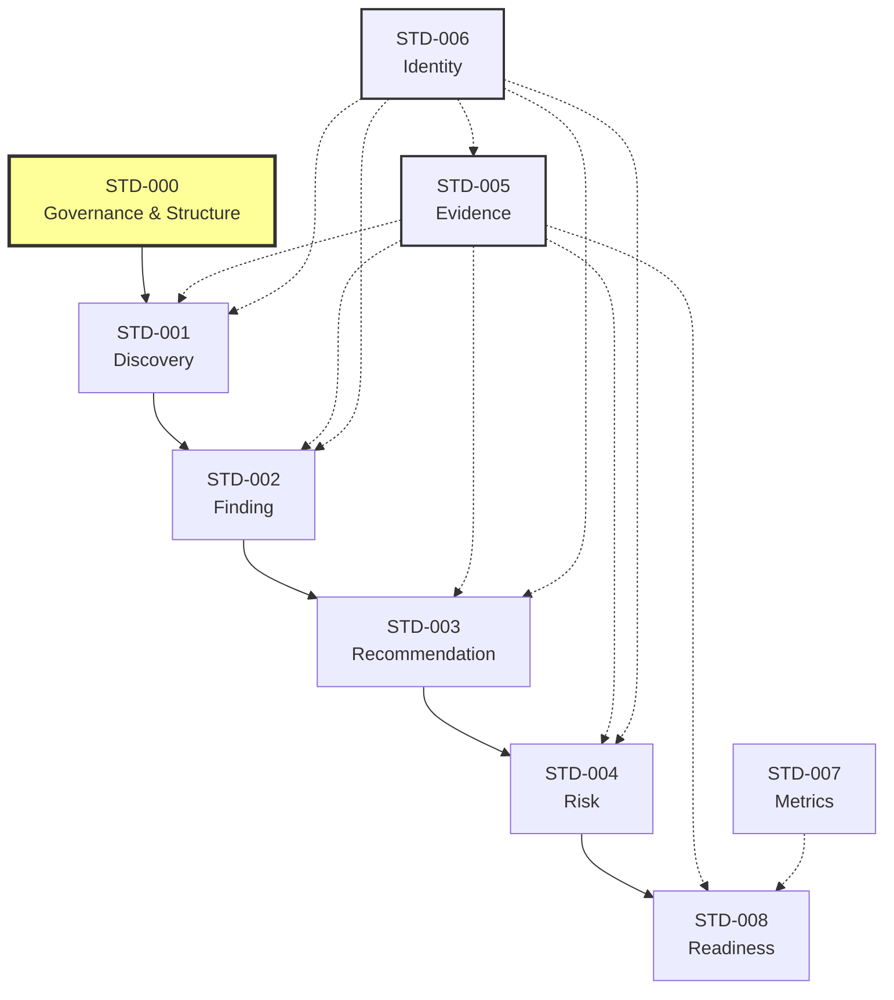

*Figure 15: Capability Flow. Solid lines represent normative capability production; dashed lines represent capability consumption.*

### Capability Matrix Rules

- Every standard shall declare its capability matrix before reaching the Review lifecycle state.
- Capability declarations shall be consistent with the standard's actual content.
- Changes to capabilities owned shall require a version update per [Section 16](#16-versioning).
- The capability matrix shall be validated during [validation](#14-validation).

### Constraints

A standard shall not:

- Omit its capability matrix declaration.
- Declare capabilities it does not actually own.
- Consume capabilities from standards in a lower lifecycle state.
- Produce capabilities that conflict with another standard's owned capabilities.

### Success Criteria

This section is complete when the capability model, schema, example matrix, flow diagram, and constraints are explicitly defined.

### Completion Statement

The Capability Matrix provides a precise model for understanding what each Framework Standard defines, requires, and produces, enabling accurate dependency analysis and impact assessment across the Standards Library.

---

## 26. Canonical Metadata Schema

### Overview

This section defines the canonical, machine-readable metadata schema that every Framework Standard shall declare. While [Section 10 — Standards Identity](#10-standards-identity) defines the foundational identity components and [Section 11 — Standards Structure](#11-standards-structure) defines the document metadata requirements, this section provides the comprehensive, structured metadata schema suitable for automated processing, registry integration, and tooling consumption.

### Schema Definition

| Field | Type | Required | Description |
|:---|:---|:---:|:---|
| **id** | String | Yes | The canonical identifier (format: `AI-DOS-STD-NNN`). See [Section 10 — Identifier Format](#10-standards-identity). |
| **title** | String | Yes | The canonical title of the standard. |
| **version** | String | Yes | The current version (format: `MAJOR.MINOR.PATCH[-STATUS]`). See [Section 16 — Versioning](#16-versioning). |
| **owner** | String | Yes | The accountable party or role responsible for the standard. See [Section 5 — Authority](#5-authority). |
| **authority** | String | Yes | The governing authority for this standard. See [Section 5 — Authority Hierarchy](#5-authority). |
| **classification** | String | Yes | The governance classification (Core / Supporting / Extension / Platform / Project). See [Section 8](#8-standards-classification). |
| **status** | String | Yes | The current lifecycle state. See [Section 9](#9-standards-lifecycle) and [Section 23](#23-standard-lifecycle-state-machine). |
| **dependencies** | Array of String | Yes | List of standard identifiers this standard depends on. See [Section 22](#22-standard-dependency-matrix). |
| **consumers** | Array of String | No | List of standard identifiers or document families that consume this standard. |
| **produces** | Array of String | No | List of artifacts, capabilities, or interfaces this standard produces. See [Section 25](#25-capability-matrix). |
| **lifecycle** | Object | Yes | Object containing `state`, `compliance_level`, and `certification_level`. See [Section 23](#23-standard-lifecycle-state-machine) and [Section 24](#24-compliance-levels). |
| **tags** | Array of String | No | Indexing tags for discoverability. Tags shall not replace the primary classification or taxonomy. |

### Lifecycle Sub-Schema

The `lifecycle` field is a structured object:

| Sub-Field | Type | Description |
|:---|:---|:---|
| `state` | String | Current lifecycle state (Proposed / Draft / Review / Validated / Certified / Canonical / Maintenance / Deprecated / Archived). |
| `compliance_level` | String | Current compliance level (L0–L5). See [Section 24](#24-compliance-levels). |
| `certification_level` | String | Current certification level (Provisional / Certified / Verified / Canonical). See [Section 27](#27-certification-levels). |

### Relationship to Section 10 and Section 11

This schema supersedes the basic metadata declaration from [Section 11 — Document Metadata](#11-standards-structure) by providing a comprehensive, machine-readable specification. The identity components from [Section 10](#10-standards-identity) are represented as individual fields within this schema.

Standards authored before the adoption of this schema shall include a metadata block in their document header that maps to these fields.

### Schema Example

```yaml
id: AI-DOS-STD-001
title: Discovery Standard
version: 1.0.0-draft
owner: Architecture Owner
authority: Framework Governance
classification: Core
status: Draft
dependencies:
  - AI-DOS-STD-000
  - AI-DOS-META-000
consumers:
  - AI-DOS-STD-002
produces:
  - Discovery Artifact
  - Discovery Schema
lifecycle:
  state: Draft
  compliance_level: L1
  certification_level: null
tags:
  - discovery
  - artifact
  - core-standard
```

### Schema Constraints

- All required fields must be populated before the standard reaches the Review state.
- The `id` field shall match the canonical identifier format and shall be immutable after publication.
- The `dependencies` array shall match the declared dependencies in [Section 22](#22-standard-dependency-matrix).
- The `lifecycle.state` shall be consistent with the actual lifecycle state per [Section 23](#23-standard-lifecycle-state-machine).
- The `lifecycle.compliance_level` shall be consistent with the lifecycle state per [Section 24](#24-compliance-levels).

### Success Criteria

This section is complete when the full metadata schema, lifecycle sub-schema, example, constraints, and relationship to existing identity and metadata sections are explicitly defined.

### Completion Statement

The Canonical Metadata Schema provides the machine-readable specification for standard metadata, enabling automated tooling, registry integration, and consistent metadata processing across theAI-DOS Standards Library.

---

## 27. Certification Levels

### Overview

This section defines a multi-level certification model that extends the binary certified/not-certified model in [Section 15 — Certification](#15-certification). Certification levels provide a graduated measure of certification rigor, enabling consumers to distinguish between preliminary certification and fully verified canonical standards.

### Relationship to Section 15

[Section 15](#15-certification) defines the certification process, prerequisites, workflow, and decision outcomes. This section introduces four certification **levels** that a standard may achieve through that process:

- **Provisional** — Certification granted with known limitations.
- **Certified** — Standard meets all certification requirements.
- **Verified** — Certification confirmed through independent verification.
- **Canonical** — Standard is the authoritative, published Framework Standard.

### Certification Level Definitions

| Level | Description | Requirements | Authority | Compliance Level Equivalent |
|:---|:---|:---|:---|:---|
| **Provisional** | Standard meets minimum certification requirements but has known limitations or conditions. | Certification approved with conditions per [Section 15](#15-certification). | Framework Governance | L4 — Certified |
| **Certified** | Standard meets all certification requirements without conditions. | Certification approved per [Section 15](#15-certification); all conditions resolved. | Framework Governance | L4 — Certified |
| **Verified** | Certification has been independently verified by a party other than the original certifying authority. | Independent verification completed; verification evidence recorded. | Independent Reviewer + Framework Governance | L4 — Certified |
| **Canonical** | Standard is published as the authoritative Framework Standard. | Governance approves canonical publication. | Framework Governance | L5 — Canonical |

### Certification Level Progression

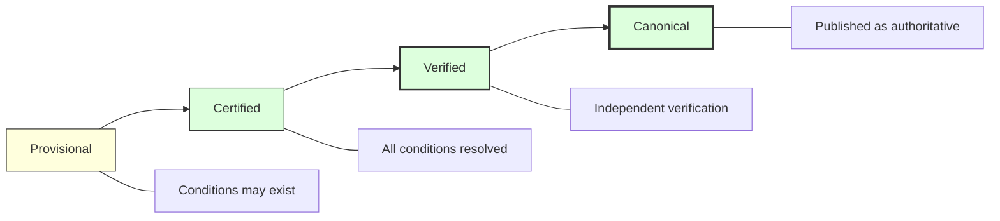

*Figure 16: Certification Level Progression. Each level requires the previous level to be achieved. Only Canonical status requires governance publication approval.*

### Certification Level Rules

- A standard may enter the certification pathway at the Provisional level.
- A standard may not skip from Provisional directly to Verified or Canonical.
- A standard may remain at Certified level indefinitely if independent verification is not required.
- Only Canonical standards may be referenced as authoritative in normative specifications.
- Certification level shall be recorded in the standard's lifecycle metadata (see [Section 26](#26-canonical-metadata-schema)).

### Certification Level vs. Compliance Level

| Certification Level | Compliance Level | Notes |
|:---|:---|:---|
| (Not certified) | L0–L3 | Standards below certification. |
| Provisional | L4 | Certified with conditions. |
| Certified | L4 | Certified without conditions. |
| Verified | L4 | Certified and independently verified. |
| Canonical | L5 | Published as authoritative. |

### Constraints

A standard shall not:

- Claim Canonical certification without governance publication approval.
- Claim Verified status without independent verification evidence.
- Downgrade its certification level without documented rationale and governance approval.

### Success Criteria

This section is complete when all four certification levels are defined with requirements, authorities, progression rules, and relationship to compliance levels.

### Completion Statement

The Certification Levels section provides a graduated certification model that extends the binary certification process from [Section 15](#15-certification), enabling precise communication of certification rigor and independent verification status.

---

## 28. Standards Registry

### Overview

This section defines the canonical Standards Registry — the authoritative inventory of all Framework Standards, their current status, dependencies, and relationships. The registry serves as the single source of truth for the state of the Standards Library.

### Registry Purpose

The Standards Registry enables:

- Discovery of available standards and their current status.
- Dependency analysis across the Standards Library.
- Impact assessment for proposed changes.
- Governance oversight of the Standards Library as a whole.
- Automated tooling integration for metadata consumption.

### Registration Requirements

Every Framework Standard shall be registered with the following information:

| Field | Description | Source |
|:---|:---|:---|
| **Identifier** | The canonical `AI-DOS-STD-NNN` identifier. | [Section 10](#10-standards-identity) |
| **Version** | The current version of the standard. | [Section 16](#16-versioning) |
| **Owner** | The accountable party responsible for the standard. | [Section 5](#5-authority) |
| **Authority** | The governing authority for the standard. | [Section 5](#5-authority) |
| **Dependencies** | Standards this standard depends on. | [Section 22](#22-standard-dependency-matrix) |
| **Consumers** | Standards or documents that consume this standard. | [Section 25](#25-capability-matrix) |
| **Superseded By** | The standard that supersedes this one (if deprecated). | [Section 17](#17-migration) |
| **Status** | The current lifecycle state and compliance level. | [Section 9](#9-standards-lifecycle), [Section 24](#24-compliance-levels) |

### Current Registry

| Identifier | Version | Owner | Authority | Dependencies | Consumers | Superseded By | Status |
|:---|:---|:---|:---|:---|:---|:---|:---|
| `AI-DOS-STD-000` | 3.1.0 | Framework Governance | A.1, M.0 | A.1, M.0 | STD-001–STD-008 | — | Canonical (L5) |
| `AI-DOS-STD-001` | — | Architecture Owner | Framework Governance | STD-000, M.0 | STD-002 | — | Proposed (L0) |
| `AI-DOS-STD-002` | — | Architecture Owner | Framework Governance | STD-001, STD-000, M.0 | STD-003 | — | Proposed (L0) |
| `AI-DOS-STD-003` | — | Architecture Owner | Framework Governance | STD-002, STD-000, M.0 | STD-004 | — | Proposed (L0) |
| `AI-DOS-STD-004` | — | Architecture Owner | Framework Governance | STD-003, STD-000, M.0 | STD-008 | — | Proposed (L0) |
| `AI-DOS-STD-005` | — | Validation Owner | Framework Governance | STD-000, M.0 | STD-001–STD-004, STD-008 | — | Proposed (L0) |
| `AI-DOS-STD-006` | — | Architecture Owner | Framework Governance | STD-000, M.0 | STD-001–STD-004, STD-005 | — | Proposed (L0) |
| `AI-DOS-STD-007` | — | Metrics Owner | Framework Governance | STD-000, M.0 | STD-008 | — | Proposed (L0) |
| `AI-DOS-STD-008` | — | Architecture Owner | Framework Governance | STD-004, STD-000, M.0 | — | — | Proposed (L0) |

### Registry Governance

- The registry shall be maintained by Framework Governance.
- Every lifecycle state transition shall be reflected in the registry.
- The registry shall be the authoritative source for the [Standards Dependency Matrix](#22-standard-dependency-matrix).
- Registry entries shall be validated against the [Canonical Metadata Schema](#26-canonical-metadata-schema).

### Registry Constraints

The registry shall not:

- Contain entries for standards that do not have a stable identifier.
- Omit registered standards from dependency or consumer lists.
- Contain conflicting status information.

### Success Criteria

This section is complete when the registry purpose, requirements, current entries, governance model, and constraints are explicitly defined.

### Completion Statement

The Standards Registry provides the authoritative inventory for theAI-DOS Standards Library, serving as the single source of truth for standard status, dependencies, and relationships.

---

## 29. Standard Decision Record

### Overview

This section defines the canonical Standard Decision Record (SDR) — a structured record for documenting significant decisions made during the creation, evolution, or governance of a Framework Standard. The SDR extends the governance decision records defined in [Section 13 — Decision Records](#13-governance) with a comprehensive, Architecture Decision Record (ADR) style format.

### Relationship to Section 13

[Section 13](#13-governance) requires that governance decisions be recorded with an identifier, owner, authority, evidence references, outcome, and affected documents. This section provides the full canonical template for those records, adding context, alternatives, trade-offs, and approval information.

### Decision Record Schema

| Field | Description |
|:---|:---|
| **Decision ID** | Unique identifier (format: `SDR-STD-___-<SEQ>`). |
| **Standard** | The `AI-DOS-STD-*` identifier of the affected standard. |
| **Decision** | A concise statement of the decision made. |
| **Context** | The situation, problem, or requirement that motivated the decision. |
| **Alternatives** | The options that were considered. |
| **Evidence** | The supporting evidence that informed the decision. |
| **Trade-offs** | The advantages and disadvantages of the chosen approach. |
| **Approval** | The authority that approved the decision, the date, and any conditions. |

### Decision Record Template

#### Header

| Field | Value |
|:---|:---|
| **Decision ID** | `SDR-STD-___-<SEQ>` |
| **Standard** | `AI-DOS-STD-___` |
| **Date** | |
| **Owner** | |
| **Authority** | |

#### Decision

A concise statement of the decision made.

#### Context

The situation, problem, requirement, or trigger that necessitated this decision.

#### Alternatives Considered

| Alternative | Description | Advantages | Disadvantages |
|:---|:---|:---|:---|
| (Chosen) | | | |
| | | | |
| | | | |

#### Evidence

| Evidence ID | Description | Source |
|:---|:---|:---|
| | | |
| | | |

#### Trade-offs

| Aspect | Benefit | Cost |
|:---|:---|:---|
| | | |
| | | |

#### Approval

| Field | Value |
|:---|:---|
| **Approving Authority** | |
| **Approval Date** | |
| **Conditions** | |
| **Affected Documents** | |

### Decision Record Rules

- Every significant standard decision shall be recorded.
- Decision records shall be immutable once approved.
- Decision records shall be referenced in the standard's revision history.
- Decision records shall be retained for the full lifetime of the standard.

### Relationship to Certification

Decision records supporting constitutional or structural decisions shall be included in the certification evidence package per [Section 15](#15-certification) and [Appendix B](../Appendix/STD-000-Framework-Standards-Appendix-B-Certification-Templates.md).

### Success Criteria

This section is complete when the decision record schema, template, rules, and relationship to governance and certification are explicitly defined.

### Completion Statement

The Standard Decision Record provides the canonical template for documenting and preserving significant standard decisions, ensuring traceability, accountability, and governance continuity across theAI-DOS Standards Library.

---

## 30. AI Consumption Rules

### Overview

This section defines the rules governing how Artificial Intelligence systems — including AI models, agents, swarms, and automated tooling — may consume, reference, and derive from Framework Standards. These rules extend the constitutional authority principles from [A.1 — Constitution, Section 7 — Human Authority](../A.1-Constitution.md#7-human-authority) and the evidence principles from [A.1 — Constitution, Section 13 — Evidence Principles](../A.1-Constitution.md#13-evidence-principles) into the specific context of Standards consumption.

### Constitutional Basis

AI consumption of Framework Standards is governed by the constitutional principle that Human Governance remains the supreme authority. AI systems consume standards as delegated execution tools; they do not possess constitutional authority over standards.

### Permitted AI Actions

#### AI May Consume

AI systems may consume Framework Standards by reading, interpreting, and applying standard definitions, schemas, rules, and processes within their delegated execution scope.

#### AI May Reference

AI systems may reference Framework Standards by citing canonical identifiers, linking to standard definitions, and using standard terminology within generated artifacts.

#### AI May Derive

AI systems may derive new artifacts (plans, code, configurations, documentation) that conform to Framework Standards, provided those artifacts are subject to human review and governance approval.

### Prohibited AI Actions

#### AI Shall Not Redefine

AI systems shall not redefine, modify, override, or reinterpret any Framework Standard, constitutional principle, or canonical definition. AI-generated content that contradicts a Framework Standard constitutes a constitutional violation per [A.1 — Constitution, Section 17 — Constitutional Violations](../A.1-Constitution.md#17-constitutional-violations).

#### AI Shall Not Duplicate Canonical Truth

AI systems shall not create duplicate or alternative definitions for concepts that already have a canonical definition in a Framework Standard. If an AI-generated artifact needs to reference a canonical concept, it shall reference the standard rather than reproducing it.

#### AI Shall Preserve Authority Chain

AI systems shall preserve the constitutional authority chain (Human Governance → Constitution → Framework Governance → Standards) in all artifacts they produce. AI-generated content shall not imply authority it does not possess.

### AI Consumption Matrix

| Action | Permitted? | Authority Required | Human Oversight |
|:---|:---|:---|:---|
| Consume (read and apply) | Yes | Delegated execution | Not required for routine consumption |
| Reference (cite and link) | Yes | Delegated execution | Not required |
| Derive (produce conforming artifacts) | Yes | Delegated execution | Required before publication |
| Redefine (modify standards) | No | — | — (constitutionally prohibited) |
| Duplicate canonical truth | No | — | — (constitutionally prohibited) |
| Override authority chain | No | — | — (constitutionally prohibited) |

### AI-Generated Artifact Governance

AI-generated artifacts that consume Framework Standards shall:

- Reference standards by canonical identifier.
- Use canonical terminology from the standard's glossary.
- Be subject to validation per [Section 14](#14-validation).
- Be subject to human review before acceptance.
- Not be promoted to canonical status without governance approval.

### Relationship to Constitutional Principles

These rules derive directly from the following constitutional principles:

- [Human Authority](../A.1-Constitution.md#7-human-authority) — AI may not override human governance.
- [Evidence Before Assumption](../A.1-Constitution.md#6-fundamental-principles) — AI-derived artifacts shall be evidence-based.
- [Single Source of Truth](../A.1-Constitution.md#9-source-of-truth) — AI shall not duplicate canonical definitions.
- [Delegation](../A.1-Constitution.md#7-human-authority) — AI consumption is a delegated execution activity.

### Constraints

AI systems shall not:

- Claim ownership of a Framework Standard.
- Publish modifications to a Framework Standard without governance approval.
- Represent AI-generated content as canonical without certification.
- Bypass validation or certification requirements for AI-generated artifacts.

### Success Criteria

This section is complete when all permitted and prohibited AI actions, the consumption matrix, artifact governance rules, and constitutional relationships are explicitly defined.

### Completion Statement

The AI Consumption Rules establish the constitutional boundaries for AI systems interacting with Framework Standards, ensuring that AI consumption remains delegated execution that preserves canonical truth, authority chains, and human governance supremacy.

---

## References

| Reference | Description |
|:---|:---|
| [A.0 — Framework Audit](../A.0-Framework-Audit.md) | The verified architectural baseline that informed Standards Library design. |
| [A.1 — Constitution](../A.1-Constitution.md) | The constitutional authority governing all Framework Standards. |
| [M.0 — Framework Meta Model](../../Meta/M.0-Framework-Meta-Model.md) | The conceptual type system consumed by all Framework Standards. |
| [M.1 — Artifact Meta Model](../../Meta/M.1-Artifact-Meta-Model.md) | The artifact model consumed by standards, Runtime, Engine artifacts, validation, and certification. |
| [STD-001 — Knowledge Graph Standard](STD-001-Knowledge-Graph-Standard.md) | The canonical Knowledge Graph semantics standard. |
| [STD-002 — Discovery Standard](STD-002-Discovery-Standard.md) | The canonical discovery standard consumed by Registry, Runtime, and Engine coordination. |
| [A.3 — Runtime Architecture RFC](../../Runtime/A.3-Runtime-Architecture-RFC.md) | The Runtime hosting architecture aligned by this standard. |
| [A.4 — Engine Architecture RFC](../../Runtime/A.4-Engine-Architecture-RFC.md) | The Engine Platform architecture acknowledged by this standard. |
| STD-003 — Terminology Standard | The terminology standard in the Standards Library. |
| STD-008 — Readiness Standard (Planned) | The eighth specialized Framework Standard. |

---


## 31. Engine Platform Alignment

### Executive Summary

STD-000 remains the canonical Standards Governance document. This section acknowledges theAI-DOS v3 Engine Platform introduced by [A.4 — Engine Architecture RFC](../../Runtime/A.4-Engine-Architecture-RFC.md) and aligns standards governance with that architecture without duplicating or redefining it.

The Engine Platform is a Framework execution-coordination concept. STD-000 governs how standards are authored, validated, certified, versioned, registered, and consumed by Engine specifications; it does not define engine internals, implementation mechanisms, APIs, protocols, data stores, hosts, or process models.

### Canonical Engine Platform Concepts

STD-000 recognizes the following Engine Platform concepts as governed Framework concepts defined by the Engine Architecture and future Engine specifications:

| Concept | STD-000 Governance Position | Defining Authority |
|:---|:---|:---|
| **Engine Platform** | Consumes standards and coordinates governed execution through Engine specifications. | A.4 and governed Engine specifications |
| **Engine Kernel** | May consume standards for execution coordination boundaries; STD-000 does not define kernel internals. | A.4 and future Runtime/Engine specifications |
| **Engine Contract** | Mandatory architectural contract type for future Engines; STD-000 governs standards compliance expectations only. | A.4 and future Engine specifications |
| **Engine Registry** | Registry specialization for discoverable Engine contracts, capabilities, adapters, and artifacts. | A.4, Registry specifications, and STD-002 where applicable |
| **Engine Lifecycle** | Lifecycle of Engine specifications and Engine artifacts shall be governed, validated, and certified. | A.4 and future Engine lifecycle specifications |
| **Engine Capability** | Specialized capability exposed through governed Engine contracts. | A.4 and individual Engine specifications |
| **Engine Communication** | Communication through governed artifacts, records, reports, handoffs, and registry entries. | A.4 |
| **Engine Artifact** | Artifact produced or consumed by Engines; subject to M.1 artifact governance and applicable standards. | M.1, A.4, and Engine specifications |
| **Engine Ownership** | Ownership boundaries shall be explicit and shall not duplicate standards, graph, runtime, validation, or certification ownership. | A.1, M.0, A.4 |
| **Engine Validation** | Engines may execute or coordinate validation but shall not redefine validation standards or self-certify. | STD-000, A.4, Validation specifications |
| **Engine Governance** | Engines consume governance decisions and may route escalations; Human Governance remains final authority. | A.1, STD-000, A.4 |
| **Engine Certification** | Certification Engines may package certification handoffs; certification authority remains governed and non-self-certifying. | STD-000, A.4, Certification specifications |
| **Engine Telemetry** | Telemetry is evidence for traceability, audit, validation, and governance; STD-000 does not prescribe telemetry implementation. | A.4 and future Evidence/Telemetry standards |
| **Engine Traceability** | Engine actions, artifacts, decisions, validations, and handoffs shall preserve traceability to authority and evidence. | A.1, M.0, M.1, STD-000, A.4 |

### Alignment Rules

- Standards define governance for reusable models.
- The Knowledge Graph defines canonical semantics.
- Runtime hosts execution.
- The Engine Platform coordinates governed execution.
- Workflows define lifecycle movement.
- Registries define discoverability and resolution.
- Validation defines verification.
- Certification defines governed compliance recognition.
- Agent Runtime, agents, tools, automation systems, and Platform Adapters consume standards and Engine Contracts; they do not redefine standards, graph semantics, Runtime architecture, or Engine architecture.

### Non-Redefinition Rule

This section is an alignment layer only. It shall not be interpreted as a replacement for [A.3 — Runtime Architecture RFC](../../Runtime/A.3-Runtime-Architecture-RFC.md), [A.4 — Engine Architecture RFC](../../Runtime/A.4-Engine-Architecture-RFC.md), [STD-001 — Knowledge Graph Standard](STD-001-Knowledge-Graph-Standard.md), [STD-002 — Discovery Standard](STD-002-Discovery-Standard.md), or future governed Engine specifications.

---

## 32. Runtime and Engine Responsibility Alignment

### Architectural Ownership Matrix

| Domain | Owns | Consumes | Must Not Redefine |
|:---|:---|:---|:---|
| **Standards** | Governance for reusable models, lifecycle, validation expectations, certification expectations, metadata, registry rules, AI consumption rules. | Constitution, Meta Models, applicable Architecture RFCs. | Constitution, Meta Model, Runtime behavior, Engine internals, graph semantics. |
| **Knowledge Graph** | Canonical graph semantics, relationships, traversal expectations, graph evidence requirements. | Standards governance and Meta Model concepts. | Standards governance, Runtime hosting, Engine coordination. |
| **Runtime** | Execution hosting, context availability, coordination surfaces, evidence capture environment. | Standards, Knowledge Graph, Workflows, Registries, Engine Contracts. | Standards, Knowledge Graph semantics, certification authority. |
| **Engine Platform** | Governed execution coordination through Engine Contracts and specialized Engines. | Standards, Knowledge Graph, Runtime, Workflows, Registries, Validation, Certification. | Standards governance, graph semantics, Human Governance, certification authority. |
| **Workflow** | Lifecycle ordering, handoff rules, required gates, permitted transitions. | Standards, Runtime, Engine Platform, Registry. | Scope, authority, standards, certification. |
| **Registry** | Discoverability, inventory, resolution, lifecycle status, dependency metadata. | Standards metadata, Discovery rules, Engine Contracts, artifact identifiers. | Artifact semantics, standard definitions, graph semantics. |
| **Validation** | Verification against requirements, standards, gates, evidence, and scope. | Standards, Runtime evidence, Engine artifacts, Knowledge Graph evidence. | Review, certification, implementation scope. |
| **Certification** | Governed recognition of compliance after validation and review. | Validation evidence, review outcomes, standards, governance decisions. | AI self-certification, implementation, standards authorship. |
| **Agent Runtime / AI Agents** | Delegated execution and evidence production within approved scope. | Standards, Knowledge Graph, Engine Contracts, Runtime context, Workflow decisions. | Canonical standards, graph semantics, architecture, certification. |
| **Platform Adapters** | Translation betweenAI-DOS concepts and target platform operations. | Standards, Engine Contracts, Runtime requirements, Registry entries. | Framework concepts, standards, graph semantics, Engine architecture. |
| **Individual Engines** | Specialized governed capability within an Engine Contract. | Standards, Knowledge Graph, Runtime, Registry, Workflow, Validation, Certification inputs. | Other Engines' ownership, standards governance, graph semantics, Human Governance. |

### Execution Relationship

Runtime hosts execution. The Engine Platform coordinates execution. Standards define governance. The Knowledge Graph defines canonical semantics. Runtime and Engines consume standards; they never redefine standards. Runtime and Engines may produce evidence and artifacts that are validated against standards, but governance approval and certification remain governed decisions.

---

## 33. Engine Contract Governance

### Mandatory Contract Principle

Future Engine specifications shall implement governed Engine Contracts. STD-000 establishes Engine Contracts as mandatory Framework architecture for Engine specifications, but it does not define the contract schema, protocol, API, implementation model, invocation mechanism, or host runtime.

### Contract Requirements

Every future Engine Contract shall declare, at minimum:

- canonical Engine identity and owner;
- authority chain and consumed standards;
- lifecycle state;
- capability boundary;
- inputs, outputs, artifacts, handoffs, and evidence expectations;
- registry expectations;
- validation expectations;
- review or certification handoff expectations where applicable;
- telemetry and traceability expectations where applicable;
- prohibited responsibilities and non-ownership boundaries.

### Contract Constraints

Engine Contracts shall not:

- redefine STD-000, STD-001, STD-002, A.3, A.4, or any higher-authority document;
- introduce implementation-specific mandates into Framework standards;
- allow an Engine, AI agent, Runtime host, automation tool, or Platform Adapter to self-certify canonical compliance;
- bypass validation, review, certification, registry, or governance requirements.

---

## 34. AI Governance Alignment

### AI and Engine Consumption Rules

AI systems may consume Framework Standards, Knowledge Graph evidence, Runtime context, Registry resolutions, Workflow decisions, and governed Engine Contracts within delegated execution scope. AI systems may execute Engines when authorized by workflow, runtime, and governance constraints.

AI systems shall never:

- redefine canonical standards;
- redefine graph semantics;
- redefine Runtime or Engine Architecture;
- bypass Engine Contracts;
- claim ownership of Framework standards, graph semantics, Engine governance, validation authority, review authority, or certification authority;
- self-certify standards, Engine artifacts, graph conclusions, Runtime outputs, or AI-generated artifacts;
- override Human Governance.

Human Governance remains final authority for standards approval, constitutional interpretation, governance exceptions, certification decisions, and publication readiness.

---

## 35. Architectural Alignment Report

### Scope of Review

This realignment reviewed STD-000 locations that describe Runtime, AI, Workflow, Registry, Validation, Knowledge Graph, Standards, Certification, Platform Adapters, and Engine-related consumption. The review compared STD-000 against A.1, the Blueprint RFC, M.0, M.1, STD-001, STD-002, A.3, and A.4.

### Consistency Findings

| Finding | Result | Notes |
|:---|:---|:---|
| STD-000 remains standards governance, not Framework Constitution. | Consistent | No constitutional role changed. |
| STD-000 consumes M.0 and M.1 rather than redefining meta concepts. | Consistent | Engine artifacts are explicitly tied to M.1. |
| STD-000 allows Runtime and Engines to consume standards. | Consistent | Runtime hosting and Engine coordination are clarified. |
| STD-000 does not define Knowledge Graph semantics. | Consistent | STD-001 remains semantic authority. |
| STD-000 does not define Discovery internals. | Consistent | STD-002 and registry/discovery specifications remain authoritative for discovery. |
| AI consumption rules preserve Human Governance and prohibit self-certification. | Consistent with adjustment | Engine Contract and Knowledge Graph consumption have been made explicit. |
| Engine Platform concepts are recognized without duplicating A.4. | Consistent with adjustment | A.4 remains the Engine Architecture authority. |

### Required Adjustments Applied

- Added Engine Platform recognition without redefining Engine Architecture.
- Added Engine Contract governance obligations for future Engine specifications.
- Clarified ownership among Standards, Knowledge Graph, Runtime, Engine Platform, Workflow, Registry, Validation, Certification, Agent Runtime, Platform Adapters, and individual Engines.
- Extended AI governance rules to include Standards, Knowledge Graph, Engine Contracts, Engine execution, and anti-self-certification constraints.
- Added cross-document references to M.1, STD-001, STD-002, A.3, and A.4.

### Cross-Document Impact

| Document | Impact | Required Follow-up |
|:---|:---|:---|
| A.1 Constitution | None. | No amendment required. |
| Blueprint RFC | None. | May reference this realignment when discussing Standards governance. |
| M.0 Framework Meta Model | None. | No meta-model change required. |
| M.1 Artifact Meta Model | None. | Future Engine Artifact specifications should consume M.1. |
| STD-001 Knowledge Graph Standard | None. | No graph semantic change required. |
| STD-002 Discovery Standard | None. | Future Registry/Engine discovery specifications should preserve STD-002 alignment. |
| A.3 Runtime Architecture RFC | None. | Runtime remains execution host. |
| A.4 Engine Architecture RFC | None. | A.4 remains the Engine Platform architecture authority. |
| Future Engine RFCs | Positive alignment. | Future Engine RFCs shall reference STD-000 for standards governance and Engine Contract governance expectations. |

---

## 36. Publication Readiness

STD-000 is publication-ready for governance review when the following conditions are satisfied:

- STD-000 remains the canonical Standards Governance document.
- Engine Platform concepts are acknowledged but not redefined.
- Runtime hosting, Engine coordination, standards governance, graph semantics, registry discoverability, validation, and certification have explicit ownership boundaries.
- AI consumption rules prohibit standards redefinition, graph semantic redefinition, Engine Architecture redefinition, and AI self-certification.
- Future Engine specifications can reference STD-000 for standards governance and Engine Contract governance without architectural conflict.

### Publication Readiness Statement

This realignment preserves approved governance principles, maintains STD-000's constitutional position as the root Standards Library governance standard, and aligns STD-000 with theAI-DOS v3 Runtime and Engine Architecture without duplicating A.3 or A.4.

## Appendices

### Appendix A: Validation Checklist

The full validation checklist is maintained as a standalone document: [Appendix A — Validation Checklist](../Appendix/STD-000-Framework-Standards-Appendix-A-Validation-Checklist.md).

It contains 60 validation checks across 9 categories (Structural, Metadata, Constitutional, Meta Model, Terminology, Relationship, Cross-Reference, Governance, Version), with 39 blocking and 21 advisory checks. Includes the validation evidence record schema and outcome rules.

### Appendix B: Certification Templates

The full certification template collection is maintained as a standalone document: [Appendix B — Certification Templates](../Appendix/STD-000-Framework-Standards-Appendix-B-Certification-Templates.md).

It contains 6 templates covering prerequisite verification, certification decision, certification record, lifecycle tracking, condition tracking, and recertification.

### Appendix C: Migration Playbook

The full migration playbook is maintained as a standalone document: [Appendix C — Migration Playbook](../Appendix/STD-000-Framework-Standards-Appendix-C-Migration-Playbook.md).

It contains a 7-phase migration workflow, deprecation procedures, compatibility strategy guide, migration plan template, and migration record template.
