<!--
  Document Header — STD-001 Knowledge Graph Standard
  Canonical path: docs/AI/Architecture/Standards/STD-001-Knowledge-Graph-Standard.md
-->

# STD-001 — Knowledge Graph Standard

> **Authority:** Human Governance → `AGENTS.md` → [A.1 — Constitution](../A.1-Constitution.md) (`AI-DOS-A-001`) →AI-DOS Blueprint RFC → [M.0 — Framework Meta Model](../../Meta/M.0-Framework-Meta-Model.md) (`AI-DOS-META-000`) → [M.1 — Artifact Meta Model](../../Meta/M.1-Artifact-Meta-Model.md) (`AI-DOS-META-001`) → [STD-000 — Framework Standards](STD-000-Framework-Standards.md) (`AI-DOS-STD-000`) → this standard. Runtime and Engine Architecture consume this standard; they do not supersede it.
>
> **Document Type:** Technical Graph Specification
>
> **Governance Classification:** Core
>
> **Domain Taxonomy:** Schema Standards
>
> **Compliance Level:** L1 — Draft
>
> **Certification Level:** Not yet certified
>
> **Version:** `3.1.0-beta`
>
> **Status:** Draft

---

## Document Metadata

| Field | Value |
|:---|:---|
| Identifier | `AI-DOS-STD-001` |
| Title | STD-001 — Knowledge Graph Standard |
| Version | 3.1.0-beta |
| Status | Draft |
| Canonical Status | Non-canonical until reviewed, approved, and promoted through Framework Governance |
| Classification | Schema Standards |
| Document Type | Technical Graph Specification |
| Owner | Framework Governance |
| Maintainers | Framework Architecture Team |
| Review Authority | Enterprise Documentation Standards Board |
| Approval Authority | Human Governance / Framework Governance |
| Created | 2026-07-04 |
| Last Updated | 2026-07-07 |
| Lifecycle Phase | Draft |
| Traceability ID | AI-DOS-STD-001 |
| Scope | Knowledge graph schema standard |
| Out of Scope | Runtime implementation, engine behavior, and certification |
| Normative Authority | Human Governance; `AGENTS.md`; `docs/AI/FrameworkGovernance.md` |
| Normative References | `docs/AI/Architecture/Standards/STD-010-Document-Metadata-Standard.md`; `docs/AI/Architecture/Standards/STD-000-Framework-Standards.md`; `docs/AI/Meta/M.0-Framework-Meta-Model.md`; `docs/AI/Meta/M.1-Artifact-Meta-Model.md` |
| Dependencies | Governance authority, artifact identity, lifecycle governance, traceability model, and applicable upstream v3 architecture documents |
| Consumes | M.0; M.1; STD-000; graph governance inputs |
| Produces | Knowledge graph node, edge, relationship, traversal, and validation semantics |
| Related Specifications | STD-002; A.3; A.4 RFC family |
| Supersedes | None |
| Superseded By | None |
| Promotion Requirements | Framework Governance review, approval, traceability validation, metadata validation, and explicit promotion |
| Certification Status | Not certified |

---


## Revision History

| Version | Date | Author | Changes |
|:---|:---|:---|:---|
| `1.0.0-alpha` | 2026-07-04 | Framework Architecture Team | Initial draft |
| `2.0.0-alpha` | 2026-07-05 | Framework Architecture Team | Structural revisions |
| `3.0.0-beta`  | 2026-07-06 | Technical Editorial        | Publication-quality refactor |
| `3.0.1-beta`  | 2026-07-06 | Standards Governance Remediation | Standards compliance remediation per AUD-001 against STD-000 v3.1.0 |
| `3.1.0-beta`  | 2026-07-07 | Framework Architecture Team | Architectural realignment with A.3 Runtime Architecture RFC and A.4 Engine Architecture RFC while preserving approved graph semantics. |

---

## Related Documents

| Document | Relationship |
|:---|:---|
| [STD-000 — Framework Standards](STD-000-Framework-Standards.md) (`AI-DOS-STD-000`) | Governing standard |
| [M.0 — Framework Meta Model](../../Meta/M.0-Framework-Meta-Model.md) (`AI-DOS-META-000`) | Conceptual type system |
| [A.1 — Constitution](../A.1-Constitution.md) (`AI-DOS-A-001`) | Constitutional authority |
| [M.1 — Artifact Meta Model](../../Meta/M.1-Artifact-Meta-Model.md) (`AI-DOS-META-001`) | Artifact participation and projection contract |
| [STD-002 — Discovery Standard](STD-002-Discovery-Standard.md) (`AI-DOS-STD-002`) | Discovery consumer of Knowledge Graph semantics |
| [A.3 — Runtime Architecture RFC](../../Runtime/A.3-Runtime-Architecture-RFC.md) | Runtime consumer of graph projections and traversal rules |
| [A.4 — Engine Architecture RFC](../../Runtime/A.4-Engine-Architecture-RFC.md) | Engine Platform consumer of graph semantics |
| STD-001 Discovery JSON Schema | Serialization projection |
| STD-001 Discovery YAML Schema | Serialization projection |
| Appendix A — Discovery Classification Catalog | Reference taxonomy |

---

## Table of Contents

1. [Status](#1-status)
   - 1.1 [Document Metadata](#11-document-metadata)
   - 1.2 [Purpose](#12-purpose)
   - 1.3 [Scope](#13-scope)
   - 1.4 [Success Criteria](#14-success-criteria)
   - 1.5 [Completion Statement](#15-completion-statement)
2. [Graph Design Philosophy](#2-graph-design-philosophy)
   - 2.1 [Overview](#21-overview)
   - 2.2 [Foundational Principle](#22-foundational-principle)
   - 2.3 [Canonical Knowledge Model](#23-canonical-knowledge-model)
   - 2.4 [Representation Layers](#24-representation-layers)
   - 2.5 [Architectural Consequences](#25-architectural-consequences)
   - 2.6 [Design Goals](#26-design-goals)
   - 2.7 [Non-Goals](#27-non-goals)
   - 2.8 [Success Criteria](#28-success-criteria)
   - 2.9 [Completion Statement](#29-completion-statement)
3. [Graph Principles](#3-graph-principles)
   - 3.1 [Overview](#31-overview)
   - 3.2 [Graph Invariants](#32-graph-invariants)
   - 3.3 – 3.17 [Principles 1–15](#33-principle-1--canonical-knowledge)
   - 3.18 [Principle Summary](#318-principle-summary)
   - 3.19 [Validation Rules](#319-validation-rules)
   - 3.20 [Success Criteria](#320-success-criteria)
   - 3.21 [Completion Statement](#321-completion-statement)
4. [Canonical Graph Model](#4-canonical-graph-model)
5. [Canonical Node Model](#5-canonical-node-model)
6. [Canonical Edge Model](#6-canonical-edge-model)
7. [Graph Topology](#7-graph-topology)
8. [Canonical Node Types](#8-canonical-node-types)
9. [Canonical Relationship Types](#9-canonical-relationship-types)
10. [Graph Constraints](#10-graph-constraints)
11. [Knowledge Evolution](#11-knowledge-evolution)
12. [AI Traversal Rules](#12-ai-traversal-rules)
13. [Runtime Traversal Rules](#13-runtime-traversal-rules)
14. [Neo4j Mapping](#14-neo4j-mapping)
15. [Cypher Examples](#15-cypher-examples)
16. [Graph Validation](#16-graph-validation)
17. [Canonical Examples](#17-canonical-examples)
18. [Graph Evolution Rules](#18-graph-evolution-rules)
19. [Extension Model](#19-extension-model)
20. [Completion Statement](#20-completion-statement)
21. [Lifecycle](#21-lifecycle)
22. [Governance](#22-governance)
23. [Certification](#23-certification)
24. [Versioning](#24-versioning)
25. [Migration](#25-migration)
26. [Dependencies](#26-dependencies)
27. [Capabilities](#27-capabilities)
28. [Canonical Metadata Schema](#28-canonical-metadata-schema)
29. [References](#29-references)
30. [Next Standard](#30-next-standard)
31. [Compliance Remediation Record](#31-compliance-remediation-record)
32. [Engine Platform Architectural Alignment](#32-engine-platform-architectural-alignment)
- [Appendix A — Glossary of Terms](#appendix-a--glossary-of-terms)
- [Appendix B — Relationship Reference Card](#appendix-b--relationship-reference-card)
- [Appendix C — Node Reference Card](#appendix-c--node-reference-card)
- [Appendix D — Validation Checklist](#appendix-d--validation-checklist)
- [Appendix E — Migration Paths](#appendix-e--migration-paths)
- [Appendix F — Error Codes](#appendix-f--error-codes)
- [Appendix G — Example Extension Manifests](#appendix-g--example-extension-manifests)
- [Appendix H — Graph Metrics](#appendix-h--graph-metrics)
- [Appendix I — Implementation Checklists](#appendix-i--implementation-checklists)
- [Appendix J — References](#appendix-j--references)
- [Appendix K — Change Log](#appendix-k--change-log)
- [Appendix L — Document Checklist](#appendix-l--document-checklist)

---

# 1. Status

## 1.1 Document Identity

| Property | Value |
|:---|:---|
| Document | STD-001 — Knowledge Graph Standard |
| Identifier | `AI-DOS-STD-001` |
| Version | `3.1.0-beta` |
| Status | Draft |
| Governance Classification | Core |
| Domain Taxonomy | Schema Standards |
| Authority | STD-000 — Framework Standards |
| Owner | Framework Architecture Team |
| Maintainers | Framework Architecture Team |
| Compliance Level | L1 — Draft |

For complete document metadata, see [Document Metadata](#document-metadata) above.

## 1.2 Purpose

This document defines the canonical graph representation of Discovery artifacts within theAI-DOS Framework.

Unlike the JSON and YAML schemas, which define serialization formats, this specification defines the conceptual graph used by the Framework to represent architectural knowledge.

The Graph Model is considered the canonical representation of Discovery knowledge.

All serialization formats shall be derived from this model.

## 1.3 Scope

This specification defines:

- Graph topology
- Node model
- Edge model
- Traversal rules
- Graph constraints
- AI traversal
- Runtime traversal
- Graph validation

This specification does **not** define:

- Transport protocols
- Storage engines
- Databases
- API representations

## 1.4 Success Criteria

This specification is complete when:

- Every Discovery can be represented as a graph
- Every downstream artifact becomes a graph node
- Every relationship becomes a typed edge
- Graph traversal becomes deterministic
- JSON, YAML, and OpenAPI representations can be derived from the graph

## 1.5 Completion Statement

The Discovery Graph Model establishes the canonical knowledge representation for Discovery artifacts within theAI-DOS Framework.

All machine-readable representations shall be projections of this graph.

---

# 2. Graph Design Philosophy

## 2.1 Overview

The Discovery Graph Model is founded on the principle that architectural knowledge is inherently relational rather than document-centric.

Traditional governance systems represent architecture as isolated documents connected through informal references.

TheAI-DOS Framework instead represents architecture as an interconnected knowledge graph.

In this model, every architectural artifact becomes an addressable node connected through explicit, typed, and governed relationships.

This enables:

- Deterministic reasoning
- Automated validation
- Explainable AI
- Complete architectural traceability

## 2.2 Foundational Principle

> **Discovery is not a document. Discovery is a knowledge node.**

A Discovery represents a single architectural observation.

It exists independently of any file format, storage technology, or presentation layer.

JSON, YAML, Markdown, databases, APIs, and graph databases are merely different projections of the same canonical knowledge object.

## 2.3 Canonical Knowledge Model

The Framework distinguishes between representation and knowledge.

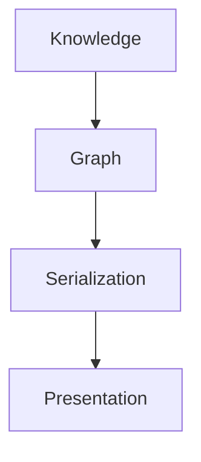

- Knowledge always exists independently.
- Graph represents the canonical model.
- Serialization formats expose the graph.
- Presentation formats display the graph.

## 2.4 Representation Layers

The Framework defines four representation layers.

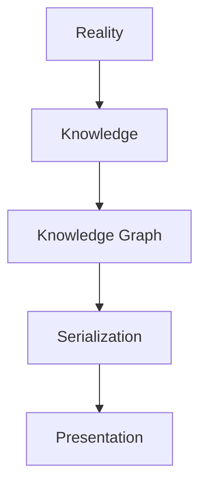

### 2.4.1 Reality

Represents observable architectural facts.

Examples include:

- Runtime behaviour
- Documentation
- Validation results
- Source code
- Governance decisions

Reality is the origin of all Discoveries.

### 2.4.2 Knowledge

Knowledge represents normalized architectural meaning.

Knowledge is independent of:

- Markdown
- JSON
- YAML
- Databases
- APIs

Knowledge remains stable while representations evolve.

### 2.4.3 Knowledge Graph

The Knowledge Graph is the canonical architectural model.

- Every Discovery becomes a graph node.
- Every architectural relationship becomes a typed edge.
- The graph preserves meaning rather than presentation.

### 2.4.4 Serialization

Serialization converts graph objects into machine-readable formats.

Supported representations include:

- JSON Schema
- YAML Schema
- Graph serialization
- OpenAPI payloads
- Runtime objects

Serialization shall never redefine graph semantics.

### 2.4.5 Presentation

Presentation renders knowledge for human consumption.

Examples include:

- Markdown specifications
- Documentation portals
- Architecture dashboards
- Graph visualization
- Governance reports

Presentation is always derived. It never becomes the source of truth.

## 2.5 Architectural Consequences

The graph-first philosophy produces several architectural consequences.

### 2.5.1 Single Source of Truth

Every Discovery exists exactly once within the graph.

Multiple document representations may reference the same node.

### 2.5.2 Explicit Relationships

Relationships are first-class architectural objects.

They shall never be inferred solely from textual references.

### 2.5.3 Immutable Identity

Each node possesses a permanent identity.

Representations may change. Identity shall not.

### 2.5.4 Technology Independence

The graph model shall remain independent from:

- Neo4j
- PostgreSQL
- RDF
- GraphQL
- JSON
- YAML
- OpenAPI

These technologies are implementation choices rather than architectural concepts.

### 2.5.5 Explainable Reasoning

Every AI conclusion shall be explainable through graph traversal.

Reasoning shall reference explicit nodes and relationships.

Hidden inference chains are prohibited.

## 2.6 Design Goals

The Graph Model is designed to provide:

- Deterministic navigation
- Complete traceability
- Explainable AI reasoning
- Reusable architectural knowledge
- Implementation independence
- Long-term maintainability

## 2.7 Non-Goals

The Graph Model does not attempt to define:

- Database implementation
- Graph storage engine
- Visualization technology
- Query language
- Synchronization protocol

Those concerns belong to implementation-specific specifications.

## 2.8 Success Criteria

The Graph Design Philosophy is complete when:

- Architectural knowledge is independent of representation
- The graph becomes the canonical source of truth
- Every serialization format derives from the graph
- AI reasoning operates on graph semantics rather than document structure

## 2.9 Completion Statement

The Graph Design Philosophy establishes the canonical architectural worldview of theAI-DOS Framework.

All Discovery artifacts, regardless of representation, shall ultimately be interpreted as interconnected knowledge nodes within a governed architectural graph.

---

# 3. Graph Principles

## 3.1 Overview

The Graph Principles define the immutable architectural rules governing the Discovery Knowledge Graph.

These principles establish the behavioral constraints that every graph implementation shall satisfy regardless of storage technology, runtime platform, serialization format, or visualization tool.

They are considered architectural invariants of theAI-DOS Framework.

## 3.2 Graph Invariants

A Graph Invariant is a rule that shall always remain true.

- Implementations may optimize storage, traversal, indexing, and querying.
- Implementations shall never violate Graph Invariants.

## 3.3 Principle 1 — Canonical Knowledge

The Knowledge Graph is the single canonical representation of Discovery knowledge.

All other representations are derived projections.

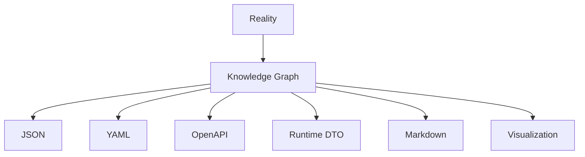

No projection may redefine canonical graph semantics.

## 3.4 Principle 2 — Immutable Identity

Every node possesses one permanent identity.

Identity shall:

- Remain globally unique
- Never change
- Survive serialization
- Survive migration
- Survive storage technology changes

Identifiers shall never encode mutable metadata.

## 3.5 Principle 3 — Typed Nodes

Every node shall declare exactly one node type.

Examples:

- Discovery
- Finding
- Evidence
- Risk
- Recommendation
- Decision
- Task
- Architecture Change
- Validation
- Certification

Multiple node types are prohibited.

## 3.6 Principle 4 — Typed Relationships

Every edge shall declare exactly one relationship type.

Examples include:

- `PRODUCES`
- `IDENTIFIES`
- `SUPPORTED_BY`
- `RESULTS_IN`
- `VALIDATED_BY`

Relationship meaning shall be explicit.

Relationship semantics shall never depend upon node names.

## 3.7 Principle 5 — Referential Integrity

Every relationship shall reference existing nodes.

Dangling edges are prohibited.

Validation shall reject the following pattern:

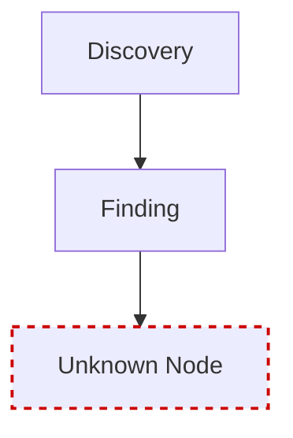

## 3.8 Principle 6 — Directed Graph

Relationships are directional.

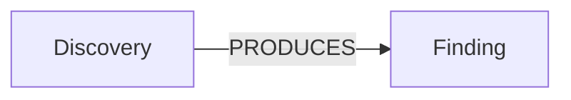

Direction conveys semantic meaning.

Bidirectional duplication is prohibited unless explicitly defined by the standard.

## 3.9 Principle 7 — Explicit Relationships

Relationships shall always be explicitly declared.

Implementations shall never infer canonical relationships solely from:

- Filenames
- Directory structures
- Document references
- Naming conventions
- Textual similarity

## 3.10 Principle 8 — Acyclic Governance Graph

Governance relationships shall remain acyclic.

Forbidden example:

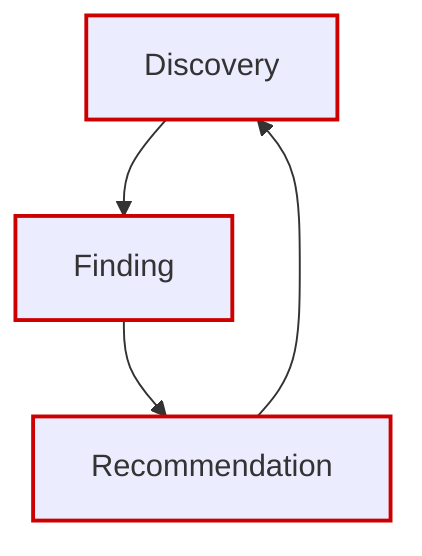

Cycles invalidate deterministic governance reasoning.

Implementation-specific cyclic references may exist internally, but canonical governance relationships shall remain acyclic.

## 3.11 Principle 9 — Traceability

Every node shall be traceable to its originating Discovery.

Traceability shall support:

- Forward navigation
- Backward navigation
- Impact analysis
- Dependency analysis
- Governance auditing

Traceability shall never be removed.

## 3.12 Principle 10 — Explainable Traversal

Every graph traversal shall be explainable.

Each traversal step shall reference:

- Source node
- Relationship
- Destination node

Hidden reasoning paths are prohibited.

## 3.13 Principle 11 — Representation Independence

Graph semantics shall remain independent from:

- JSON
- YAML
- Neo4j
- RDF
- SQL
- GraphQL
- OpenAPI

Serialization formats expose graph data.

They do not define graph behavior.

## 3.14 Principle 12 — Version Stability

- Node versions may evolve.
- Relationships may evolve.
- Graph topology may evolve.
- Node identity shall remain stable.

## 3.15 Principle 13 — Extension Safety

Extensions may introduce:

- Additional node properties
- Additional edge properties
- Implementation metadata

Extensions shall **not**:

- Redefine canonical node types
- Redefine relationship semantics
- Violate graph invariants

## 3.16 Principle 14 — AI Explainability

AI reasoning shall operate on graph semantics.

Every recommendation shall reference the graph path used during reasoning.

Example:

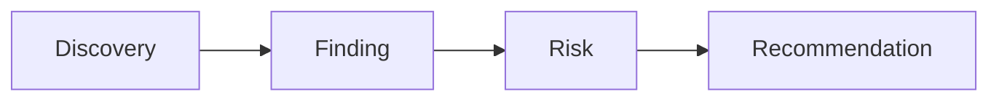

Reasoning without graph references shall not be considered canonical.

## 3.17 Principle 15 — Human Governance

- Graph traversal may be automated.
- Graph reasoning may be automated.
- Graph validation may be automated.

Canonical graph evolution remains subject to Human Governance.

No AI system may redefine canonical graph structure.

No AI system shall duplicate canonical graph truth — if a canonical definition exists in this standard or in a higher-authority standard (STD-000, M.0, A.1), AI systems shall reference it rather than reproducing it.

## 3.18 Principle Summary

| Principle | Mandatory |
|:---|:---:|
| Canonical Knowledge | ✓ |
| Immutable Identity | ✓ |
| Typed Nodes | ✓ |
| Typed Relationships | ✓ |
| Referential Integrity | ✓ |
| Directed Graph | ✓ |
| Explicit Relationships | ✓ |
| Acyclic Governance Graph | ✓ |
| Traceability | ✓ |
| Explainable Traversal | ✓ |
| Representation Independence | ✓ |
| Version Stability | ✓ |
| Extension Safety | ✓ |
| AI Explainability | ✓ |
| Human Governance | ✓ |

## 3.19 Validation Rules

Validation Engines shall verify:

- Identity uniqueness
- Relationship integrity
- Node typing
- Edge typing
- Graph acyclicity
- Traceability completeness
- Invariant compliance

## 3.20 Success Criteria

The Graph Principles are complete when:

- Every implementation preserves the same architectural semantics
- Every serialization format derives from the graph
- AI reasoning remains explainable
- Graph evolution remains governed

## 3.21 Completion Statement

The Graph Principles establish the immutable architectural rules governing theAI-DOS Discovery Knowledge Graph.

These principles ensure that every implementation preserves canonical semantics, deterministic reasoning, traceability, and governance regardless of technology, storage engine, or runtime platform.

---

# 4. Canonical Graph Model

## 4.1 Overview

The Canonical Graph Model defines the official knowledge topology of theAI-DOS Framework.

It specifies how architectural knowledge is represented as a directed, typed, governed graph.

Unlike serialization formats, which define data representation, the Canonical Graph Model defines semantic relationships between architectural concepts.

This model serves as the architectural foundation for:

- Runtime reasoning
- AI reasoning
- Validation
- Governance
- Traceability
- Impact analysis
- Knowledge retrieval

Every Discovery artifact shall ultimately exist within this graph.

## 4.2 Graph Architecture

The Framework models architectural knowledge as a directed graph.

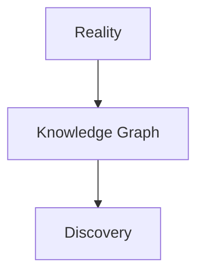

- Reality produces observations.
- Observations become Discoveries.
- Discoveries become interconnected knowledge.

## 4.3 Canonical Topology

The following topology defines the official knowledge flow.

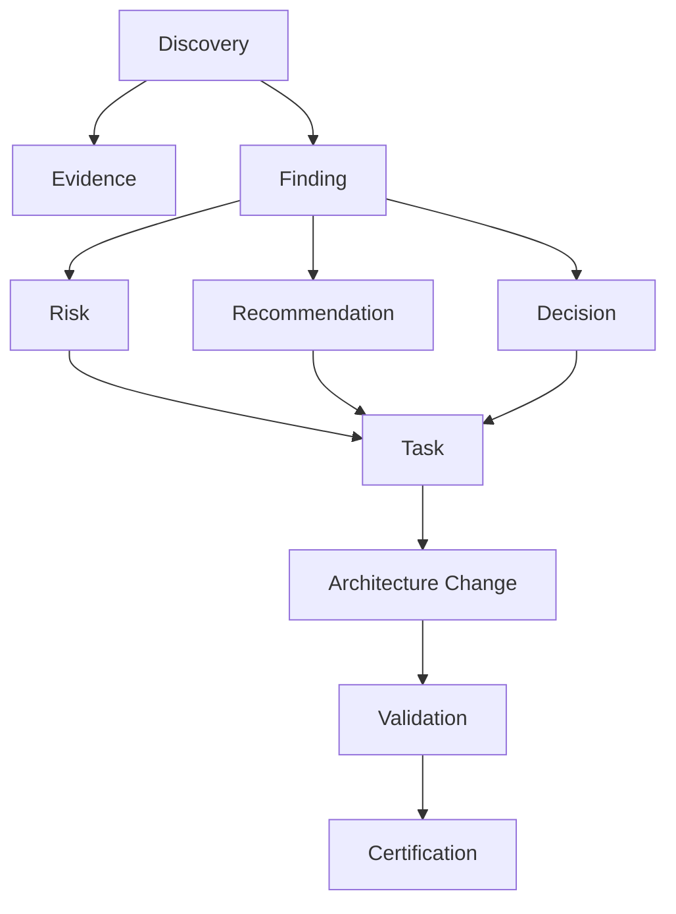

This topology is normative.

Alternative topologies require governance approval.

## 4.4 Graph Layers

The Knowledge Graph is divided into logical layers.

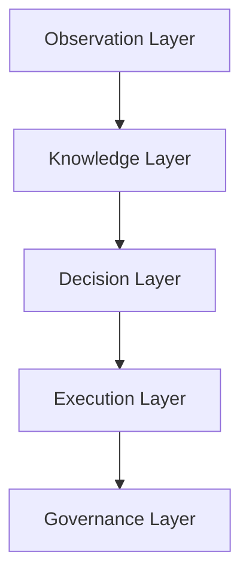

### 4.4.1 Observation Layer

Contains:

- Discovery
- Evidence

Purpose: Capture architectural reality.

### 4.4.2 Knowledge Layer

Contains:

- Finding
- Risk
- Recommendation

Purpose: Normalize observations into actionable knowledge.

### 4.4.3 Decision Layer

Contains:

- Decision

Purpose: Represent governance-approved architectural choices.

### 4.4.4 Execution Layer

Contains:

- Task
- Architecture Change

Purpose: Represent implementation activities resulting from approved decisions.

### 4.4.5 Governance Layer

Contains:

- Validation
- Certification

Purpose: Ensure architectural compliance and governance integrity.

## 4.5 Knowledge Flow

Knowledge always progresses forward.

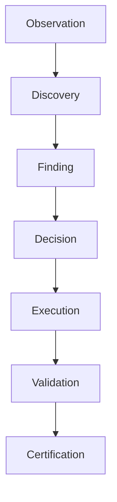

- Backward traceability is allowed.
- Backward semantic evolution is prohibited.

## 4.6 Canonical Node Responsibilities

| Node | Responsibility |
|:---|:---|
| Discovery | Capture architectural observations |
| Evidence | Support Discoveries and Findings |
| Finding | Normalize observations |
| Risk | Describe potential consequences |
| Recommendation | Suggest improvements |
| Decision | Record approved choices |
| Task | Represent implementation work |
| Architecture Change | Capture structural modifications |
| Validation | Verify implementation |
| Certification | Confirm governance compliance |

## 4.7 Canonical Edge Responsibilities

| Relationship | Purpose |
|:---|:---|
| `PRODUCES` | Knowledge progression |
| `SUPPORTED_BY` | Evidence association |
| `IDENTIFIES` | Risk identification |
| `RECOMMENDS` | Improvement proposal |
| `RESULTS_IN` | Implementation outcome |
| `VALIDATED_BY` | Verification |
| `CERTIFIED_BY` | Governance approval |

## 4.8 Traversal Model

The graph supports two canonical traversal directions.

### 4.8.1 Forward Traversal

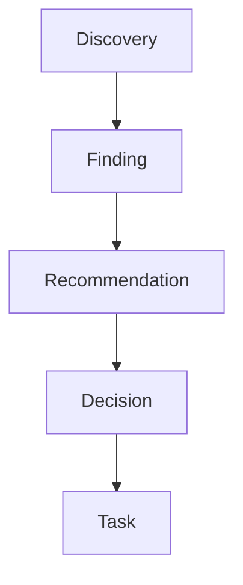

Used for planning and execution.

### 4.8.2 Backward Traversal

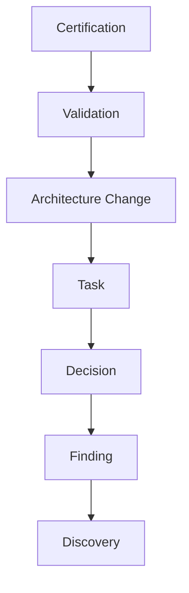

Used for auditing and traceability.

## 4.9 Canonical Properties

Every graph node shall contain:

- Identifier
- Node type
- Version
- Lifecycle state
- Ownership
- Metadata

Every graph relationship shall contain:

- Identifier
- Relationship type
- Source node
- Target node
- Creation timestamp
- Authority

## 4.10 Graph Integrity

The Canonical Graph shall satisfy the following conditions:

- No orphan nodes
- No dangling edges
- No duplicate identities
- No circular governance relationships
- No undefined relationship types
- No anonymous ownership

## 4.11 Knowledge Evolution

Knowledge evolves through graph expansion.

- Nodes are added.
- Relationships are added.
- Historical nodes remain preserved.

Knowledge shall never evolve by rewriting historical graph structure.

## 4.12 AI Consumption Model

AI Agents shall consume the graph rather than individual documents.

- Reasoning shall occur through graph traversal.
- Recommendations shall reference explicit node paths.
- Hidden semantic inference is prohibited.

## 4.13 Runtime Consumption Model

- Runtime systems shall consume graph projections.
- Runtime implementations shall never redefine graph semantics.
- JSON, YAML, OpenAPI, and DTOs are implementation-specific projections of the same canonical graph.

## 4.14 Graph Invariants

| Invariant | Mandatory |
|:---|:---:|
| Directed Graph | ✓ |
| Typed Nodes | ✓ |
| Typed Relationships | ✓ |
| Referential Integrity | ✓ |
| Traceability | ✓ |
| Immutable Identity | ✓ |
| Governance Ownership | ✓ |
| Canonical Topology | ✓ |

## 4.15 Success Criteria

The Canonical Graph Model is complete when:

- Every architectural artifact is represented as a graph node
- Every semantic relationship is represented as a typed edge
- Knowledge flows deterministically
- AI and Runtime consume identical graph semantics
- Governance remains fully traceable

## 4.16 Completion Statement

The Canonical Graph Model establishes the official knowledge topology of theAI-DOS Framework.

It defines the semantic structure through which Discovery artifacts evolve into validated, governed, and certifiable architectural knowledge while preserving deterministic reasoning, complete traceability, and implementation independence.

---

# 5. Canonical Node Model

## 5.1 Overview

The Canonical Node Model defines the common structural contract shared by every node within theAI-DOS Knowledge Graph.

Regardless of its semantic purpose, every graph node shall conform to this model.

The Canonical Node Model establishes a unified architectural identity across all knowledge artifacts while allowing each node type to extend the model with domain-specific properties.

This model is technology-neutral and independent of any graph database implementation.

## 5.2 Design Objectives

The Node Model shall:

- Establish a common node contract
- Provide immutable identity
- Standardize metadata
- Support governance
- Enable deterministic traversal
- Simplify serialization
- Support AI reasoning

## 5.3 Node Philosophy

A node represents one unique architectural concept.

A node is **not**:

- A document
- A database record
- A JSON object
- A Markdown file

Those are representations.

The node itself represents canonical architectural knowledge.

## 5.4 Canonical Node Structure

Every node follows the same logical structure.

```text
Node
│
├── Identity
├── Type
├── Version
├── Lifecycle
├── Ownership
├── Metadata
├── Relationships
├── Extensions
└── Audit
```

This structure is mandatory for every node type.

## 5.5 Node Identity

Every node shall possess a permanent identity.

Identity shall satisfy the following requirements:

- Globally unique
- Immutable
- Technology independent
- Representation independent
- Stable throughout the node lifecycle

Identity shall never encode mutable information.

Examples of prohibited identity elements include:

- Version numbers
- Lifecycle state
- Ownership
- Timestamps

## 5.6 Node Type

Every node shall declare exactly one canonical node type.

Supported node types include:

- Discovery
- Finding
- Evidence
- Risk
- Recommendation
- Decision
- Task
- Architecture Change
- Validation
- Certification

Multiple node types are prohibited.

## 5.7 Node Version

Every node shall maintain explicit version information.

Versioning enables:

- Historical reconstruction
- Migration
- Compatibility
- Governance auditing

Version changes shall never alter node identity.

## 5.8 Node Lifecycle

Each node participates in an independent lifecycle.

- Lifecycle state shall be explicitly declared.
- Lifecycle transitions shall remain traceable.
- Lifecycle semantics are defined by the corresponding standard for each node type.

## 5.9 Node Ownership

Every node shall declare governance ownership.

The ownership model includes:

- Owner
- Authority
- Steward
- Reviewer
- Maintainer

Ownership shall remain independent of storage implementation.

## 5.10 Node Metadata

Metadata enriches the node without changing its semantic meaning.

Typical metadata includes:

- Labels
- Keywords
- Component
- Repository
- Project
- Namespace
- Visibility

Metadata shall never redefine node identity.

## 5.11 Node Relationships

Relationships connect nodes into the Knowledge Graph.

- Relationships shall not be embedded as semantic metadata.
- Relationships are first-class graph objects.

Every relationship shall:

- Identify the source node
- Identify the target node
- Declare exactly one relationship type

## 5.12 Node Extensions

The Framework permits controlled extension.

Extensions may add:

- Implementation metadata
- Platform-specific information
- Adapter-specific properties

Extensions shall not redefine canonical node semantics.

## 5.13 Node Audit

Every node shall preserve an audit history.

Audit information may include:

- Creation timestamp
- Modification history
- Governance actions
- Lifecycle transitions
- Validation events

Audit information shall remain immutable.

## 5.14 Node Invariants

| Invariant | Mandatory |
|:---|:---:|
| Immutable Identity | ✓ |
| Single Node Type | ✓ |
| Explicit Lifecycle | ✓ |
| Explicit Ownership | ✓ |
| Version Declared | ✓ |
| Metadata Supported | ✓ |
| Traceable Relationships | ✓ |
| Audit History | ✓ |

## 5.15 Node Constraints

The following are prohibited:

- Anonymous nodes
- Multiple node types
- Mutable identities
- Missing ownership
- Undefined lifecycle
- Duplicate identifiers
- Hidden relationships

## 5.16 AI Node Rules

AI Agents **may**:

- Create candidate nodes
- Classify node types
- Enrich metadata
- Recommend relationships
- Identify missing ownership

AI Agents shall **never**:

- Redefine node identity
- Change canonical node types
- Delete audit history
- Bypass governance

## 5.17 Runtime Rules

Runtime implementations shall:

- Preserve node identity
- Preserve node type
- Preserve relationship semantics
- Preserve version history

Runtime optimizations shall never alter canonical node behavior.

## 5.18 Validation Rules

Validation Engines shall verify:

- Identity uniqueness
- Node type validity
- Lifecycle declaration
- Ownership completeness
- Metadata consistency
- Audit availability

## 5.19 Success Criteria

The Canonical Node Model is complete when:

- Every graph node shares the same architectural contract
- Implementations remain technology-neutral
- AI and Runtime interpret nodes consistently
- Graph traversal remains deterministic

## 5.20 Completion Statement

The Canonical Node Model establishes the universal architectural contract for all nodes within theAI-DOS Knowledge Graph.

It provides a consistent foundation for identity, governance, lifecycle, metadata, relationships, extensibility, and auditability while ensuring implementation independence and long-term architectural stability.

---

# 6. Canonical Edge Model

## 6.1 Overview

The Canonical Edge Model defines the universal contract governing every relationship within theAI-DOS Knowledge Graph.

Unlike conventional graph implementations where relationships are simple links between nodes,AI-DOS treats every edge as a governed architectural object.

Edges possess identity, semantics, ownership, lifecycle, metadata, and auditability.

This enables deterministic reasoning, complete traceability, explainable AI, and governance-aware graph traversal.

## 6.2 Design Objectives

The Edge Model shall:

- Establish a common relationship contract
- Preserve semantic meaning
- Support governance
- Enable deterministic traversal
- Provide explainable reasoning
- Maintain auditability
- Remain technology independent

## 6.3 Edge Philosophy

An edge represents a governed architectural relationship.

An edge is not merely a connection. It represents explicit semantic knowledge.

Every edge answers the question:

> "How are these two architectural concepts related?"

## 6.4 Canonical Edge Structure

Every edge follows the same logical structure.

```text
Edge
│
├── Identity
├── Relationship Type
├── Source
├── Target
├── Version
├── Lifecycle
├── Authority
├── Metadata
├── Extensions
└── Audit
```

Every graph relationship shall conform to this structure.

## 6.5 Edge Identity

Every edge shall possess a globally unique identity.

Identity shall:

- Remain immutable
- Survive migrations
- Survive serialization
- Remain technology independent

Relationship identity shall never depend upon:

- Source filenames
- Target filenames
- Storage identifiers

## 6.6 Relationship Type

Every edge shall declare exactly one canonical relationship type.

Examples include:

- `PRODUCES`
- `SUPPORTED_BY`
- `IDENTIFIES`
- `RECOMMENDS`
- `RESULTS_IN`
- `VALIDATED_BY`
- `CERTIFIED_BY`

Relationship semantics shall remain stable across Framework versions.

## 6.7 Source Node

Every edge shall identify exactly one source node.

- The source node initiates the semantic relationship.
- Source nodes shall always exist.
- Dangling source references are prohibited.

## 6.8 Target Node

Every edge shall identify exactly one target node.

- Target nodes shall always exist.
- Relationships pointing to unknown nodes shall fail validation.

## 6.9 Edge Direction

Edges are directional.

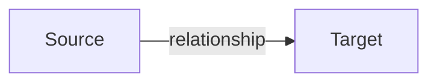

- The inverse relationship is not implied.
- Direction carries semantic meaning.

## 6.10 Edge Version

Every edge shall declare version information.

Relationship evolution shall preserve:

- Identity
- Semantic meaning
- Historical traceability

## 6.11 Edge Lifecycle

Relationships participate in a lifecycle.

Typical lifecycle states include:

- Draft
- Active
- Historical
- Deprecated

Lifecycle transitions shall remain auditable.

## 6.12 Edge Authority

Every relationship shall identify the authority responsible for its creation.

Authority determines:

- Approval
- Modification
- Retirement

Authority shall remain independent from implementation ownership.

## 6.13 Edge Metadata

Metadata enriches relationships.

Examples include:

- Rationale
- Labels
- Confidence
- Severity
- Namespace
- Notes

Metadata shall never redefine relationship semantics.

## 6.14 Edge Extensions

Implementations may extend edges.

Extensions shall:

- Remain backward compatible
- Preserve canonical semantics
- Avoid redefining relationship types

## 6.15 Edge Audit

Every edge shall preserve audit information.

Audit records include:

- Creation
- Updates
- Governance decisions
- Lifecycle transitions
- Validation events

Audit history shall remain immutable.

## 6.16 Edge Invariants

| Invariant | Mandatory |
|:---|:---:|
| Immutable Identity | ✓ |
| Single Relationship Type | ✓ |
| One Source Node | ✓ |
| One Target Node | ✓ |
| Directed Relationship | ✓ |
| Explicit Authority | ✓ |
| Version Declared | ✓ |
| Audit Supported | ✓ |

## 6.17 Edge Constraints

The following are prohibited:

- Anonymous relationships
- Multiple relationship types
- Undefined source nodes
- Undefined target nodes
- Bidirectional duplication
- Mutable relationship identities
- Hidden semantic meaning

## 6.18 AI Edge Rules

AI Agents **may**:

- Recommend new relationships
- Classify relationship types
- Detect duplicate edges
- Detect missing relationships
- Recommend graph improvements

AI Agents shall **never**:

- Redefine canonical relationship semantics
- Create hidden relationships
- Bypass governance approval

## 6.19 Runtime Rules

Runtime implementations shall preserve:

- Relationship identity
- Direction
- Semantic type
- Lifecycle
- Authority

Implementation optimizations shall never alter canonical edge semantics.

## 6.20 Validation Rules

Validation Engines shall verify:

- Unique edge identity
- Valid source node
- Valid target node
- Canonical relationship type
- Lifecycle validity
- Governance authority
- Audit history

## 6.21 Success Criteria

The Canonical Edge Model is complete when:

- Every relationship shares the same architectural contract
- Relationship semantics remain deterministic
- Graph traversal remains explainable
- AI and Runtime interpret edges consistently

## 6.22 Completion Statement

The Canonical Edge Model establishes the universal architectural contract for relationships within theAI-DOS Knowledge Graph.

It ensures that every edge remains a governed, traceable, explainable, and technology-independent architectural object while preserving deterministic graph semantics across the entireAI-DOS Framework.

---

# 7. Graph Topology

## 7.1 Overview

The Graph Topology defines the canonical structural organization of theAI-DOS Knowledge Graph.

While the Canonical Graph Model ([Section 4](#4-canonical-graph-model)) defines the semantic concepts and relationships, the Graph Topology specifies how those concepts are organized into coherent architectural layers.

The topology provides a deterministic structure for navigation, reasoning, validation, governance, and knowledge evolution.

Every graph implementation shall preserve this topology regardless of storage technology or runtime platform.

## 7.2 Design Objectives

The Graph Topology shall:

- Organize architectural knowledge
- Support deterministic traversal
- Separate concerns into logical layers
- Simplify AI reasoning
- Enable governance validation
- Preserve long-term scalability

## 7.3 Topology Philosophy

TheAI-DOS Knowledge Graph is layered, directed, and governed.

- Knowledge flows through architectural stages rather than existing as isolated nodes.
- Each layer has a distinct responsibility.
- Each relationship connects adjacent semantic concepts.

## 7.4 Canonical Topology


This topology is normative.

## 7.5 Layer Model

The Knowledge Graph consists of five canonical layers.

| Layer | Purpose |
|:---|:---|
| Observation | Capture architectural facts |
| Knowledge | Transform facts into structured knowledge |
| Decision | Record approved architectural decisions |
| Execution | Represent implementation activities |
| Governance | Validate and certify outcomes |

Each node belongs to exactly one primary layer.

## 7.6 Observation Layer

### 7.6.1 Purpose

Capture objective architectural observations before interpretation.

### 7.6.2 Canonical Nodes

- Discovery
- Evidence

### 7.6.3 Characteristics

- Closest representation of reality
- Evidence-driven
- No implementation decisions

## 7.7 Knowledge Layer

### 7.7.1 Purpose

Normalize observations into reusable architectural knowledge.

### 7.7.2 Canonical Nodes

- Finding
- Risk
- Recommendation

### 7.7.3 Characteristics

- Analyzed
- Categorized
- Reusable
- Traceable

## 7.8 Decision Layer

### 7.8.1 Purpose

Represent governance-approved architectural intent.

### 7.8.2 Canonical Nodes

- Decision

### 7.8.3 Characteristics

- Authoritative
- Versioned
- Auditable

## 7.9 Execution Layer

### 7.9.1 Purpose

Represent work resulting from approved decisions.

### 7.9.2 Canonical Nodes

- Task
- Architecture Change

### 7.9.3 Characteristics

- Actionable
- Measurable
- Implementation-focused

## 7.10 Governance Layer

### 7.10.1 Purpose

Ensure compliance and long-term integrity.

### 7.10.2 Canonical Nodes

- Validation
- Certification

### 7.10.3 Characteristics

- Independent verification
- Governance oversight
- Historical traceability

## 7.11 Vertical Flow

Knowledge normally flows downward.


Vertical progression represents architectural maturity.

## 7.12 Horizontal Relationships

Nodes within the same layer may relate when explicitly defined.

Examples:

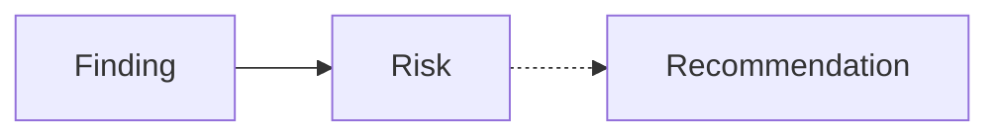

Horizontal relationships shall never violate governance invariants.

## 7.13 Cross-Layer Constraints

The following constraints are mandatory:

- Observation nodes shall not directly create Tasks.
- Evidence shall not directly create Decisions.
- Certification shall not produce Discoveries.
- Execution shall not bypass Governance.

Every cross-layer transition shall preserve semantic integrity.

## 7.14 Topological Invariants

| Invariant | Mandatory |
|:---|:---:|
| Directed knowledge flow | ✓ |
| Layer separation | ✓ |
| Typed nodes | ✓ |
| Typed edges | ✓ |
| Traceability | ✓ |
| Governance isolation | ✓ |
| Representation independence | ✓ |

## 7.15 Topology Evolution

Future versions **may**:

- Introduce new node types
- Introduce new relationship types
- Introduce additional layers

Future versions shall **not**:

- Remove canonical layers
- Redefine layer responsibilities
- Violate graph invariants

Topology evolution requires governance approval.

## 7.16 AI Topology Rules

AI Agents **shall**:

- Traverse layers deterministically
- Respect canonical flow direction
- Explain every traversal path
- Avoid implicit semantic jumps

AI Agents shall **never**:

- Bypass governance
- Invent intermediate layers
- Ignore canonical relationships

## 7.17 Runtime Topology Rules

Runtime implementations shall:

- Preserve canonical layering
- Preserve traversal semantics
- Preserve graph invariants

Internal optimizations shall never alter the logical topology.

## 7.18 Validation Rules

Validation Engines shall verify:

- Node layer assignment
- Legal cross-layer relationships
- Graph connectivity
- Topology invariants
- Traversal correctness

## 7.19 Success Criteria

The Graph Topology is complete when:

- Every node belongs to a canonical layer
- Every relationship preserves semantic flow
- AI and Runtime share the same topology
- Governance remains deterministic and traceable

## 7.20 Completion Statement

The Graph Topology establishes the canonical structural organization of theAI-DOS Knowledge Graph.

It defines the logical layers, knowledge flow, and traversal rules required to ensure deterministic reasoning, governance integrity, implementation independence, and long-term architectural scalability across theAI-DOS Framework.

---

# 8. Canonical Node Types

## 8.1 Overview

The Canonical Node Types define the fundamental knowledge entities of theAI-DOS Knowledge Graph.

Every node within the graph shall belong to exactly one canonical node type.

Each node type represents a distinct architectural responsibility and participates in the governed evolution of architectural knowledge.

The node taxonomy is technology-neutral and independent of storage, serialization, runtime, or visualization.

## 8.2 Design Objectives

The Canonical Node Type Model shall:

- Establish a common ontology
- Define semantic responsibilities
- Support deterministic reasoning
- Preserve governance
- Simplify validation
- Enable AI interoperability

## 8.3 Node Taxonomy

TheAI-DOS Knowledge Graph defines the following canonical node types.

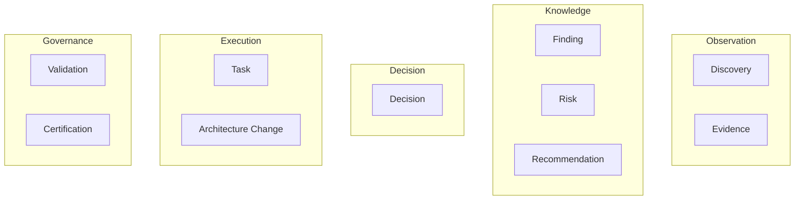

This taxonomy is normative.

## 8.4 Common Node Contract

Every node type inherits the Canonical Node Model ([Section 5](#5-canonical-node-model)).

Every node therefore contains:

- Identity
- Type
- Version
- Lifecycle
- Ownership
- Metadata
- Relationships
- Audit

Node-specific properties extend this contract. They shall never redefine it.

## 8.5 Discovery

### 8.5.1 Purpose

Represents an observed architectural fact.

Discovery is the entry point into the Knowledge Graph. It captures observations before interpretation.

### 8.5.2 Responsibilities

- Record observations
- Establish traceability
- Initiate knowledge evolution

### 8.5.3 Allowed Relationships

Produces:

- Finding
- Recommendation
- Risk

Supported By:

- Evidence

### 8.5.4 Prohibited Relationships

Discovery shall **never**:

- Approve Decisions
- Validate Changes
- Certify Compliance

## 8.6 Evidence

### 8.6.1 Purpose

Represents verifiable support for architectural knowledge.

Evidence strengthens confidence. Evidence never changes architectural meaning.

### 8.6.2 Responsibilities

- Support Discoveries
- Support Findings
- Preserve provenance

### 8.6.3 Allowed Relationships

Supports:

- Discovery
- Finding
- Risk

## 8.7 Finding

### 8.7.1 Purpose

Represents normalized architectural knowledge derived from one or more Discoveries.

Findings are reusable. Findings are not raw observations.

### 8.7.2 Responsibilities

- Classify observations
- Normalize knowledge
- Identify consequences

### 8.7.3 Produces

- Risk
- Recommendation
- Decision

## 8.8 Risk

### 8.8.1 Purpose

Represents a potential architectural consequence.

Risk is predictive. Risk is not evidence.

### 8.8.2 Responsibilities

- Estimate impact
- Support governance
- Influence decisions

## 8.9 Recommendation

### 8.9.1 Purpose

Represents a proposed improvement.

Recommendations are advisory. They do not represent governance approval.

### 8.9.2 Responsibilities

- Propose actions
- Improve architecture
- Reduce risk

## 8.10 Decision

### 8.10.1 Purpose

Represents an approved architectural decision.

Decisions are authoritative.

### 8.10.2 Responsibilities

- Record governance
- Authorize execution
- Preserve rationale

### 8.10.3 Produces

- Task
- Architecture Change

## 8.11 Task

### 8.11.1 Purpose

Represents implementation work.

Tasks operationalize Decisions.

### 8.11.2 Responsibilities

- Execute approved work
- Preserve implementation traceability

## 8.12 Architecture Change

### 8.12.1 Purpose

Represents structural modification of the Framework.

Architecture Changes alter canonical architecture.

### 8.12.2 Responsibilities

- Evolve architecture
- Preserve migration history
- Support validation

## 8.13 Validation

### 8.13.1 Purpose

Represents independent verification.

Validation evaluates implementation. Validation does not certify governance.

### 8.13.2 Responsibilities

- Verify correctness
- Produce validation reports

## 8.14 Certification

### 8.14.1 Purpose

Represents governance confirmation.

Certification concludes architectural compliance.

### 8.14.2 Responsibilities

- Approve compliance
- Preserve governance history

## 8.15 Node Responsibility Matrix

| Node | Observation | Knowledge | Decision | Execution | Governance |
|:---|:---:|:---:|:---:|:---:|:---:|
| Discovery | ✓ | | | | |
| Evidence | ✓ | | | | |
| Finding | | ✓ | | | |
| Risk | | ✓ | | | |
| Recommendation | | ✓ | | | |
| Decision | | | ✓ | | |
| Task | | | | ✓ | |
| Architecture Change | | | | ✓ | |
| Validation | | | | | ✓ |
| Certification | | | | | ✓ |

## 8.16 Node Evolution

Knowledge evolves through node progression.

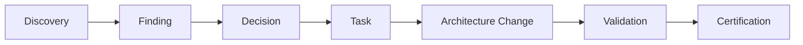

Evidence, Risk, and Recommendation enrich this progression.

They do not replace it.

## 8.17 AI Interpretation Rules

AI Agents shall interpret node types according to their semantic responsibility.

AI shall **never**:

- Treat Evidence as Discovery
- Treat Risk as Finding
- Treat Recommendation as Decision
- Treat Validation as Certification

Semantic substitution is prohibited.

## 8.18 Validation Rules

Validation Engines shall verify:

- Exactly one node type
- Canonical responsibilities
- Valid relationships
- Lifecycle compatibility
- Ownership completeness

## 8.19 Extension Rules

Future Framework Standards may introduce additional node types.

New node types shall:

- Inherit the Canonical Node Model
- Define explicit responsibilities
- Preserve topology
- Remain governance-approved

Existing node types shall not be redefined.

## 8.20 Success Criteria

The Canonical Node Types are complete when:

- Every graph node has exactly one canonical type
- Responsibilities remain unambiguous
- AI interprets nodes consistently
- Runtime preserves semantic meaning

## 8.21 Completion Statement

The Canonical Node Types establish the official ontology of theAI-DOS Knowledge Graph.

They define the semantic responsibilities of every architectural knowledge entity while ensuring deterministic reasoning, governance consistency, technology independence, and long-term interoperability across theAI-DOS Framework.

---

# 9. Canonical Relationship Types

## 9.1 Overview

The Canonical Relationship Types define the official semantic relationships used throughout theAI-DOS Knowledge Graph.

Relationships are first-class architectural entities.

They define how knowledge evolves, how governance is preserved, and how AI systems perform deterministic reasoning.

Every relationship shall belong to exactly one canonical relationship type.

## 9.2 Design Objectives

The Relationship Type Model shall:

- Establish a common relationship ontology
- Preserve semantic consistency
- Support deterministic traversal
- Enable explainable AI reasoning
- Simplify validation
- Ensure governance traceability

## 9.3 Relationship Taxonomy

The Framework defines the following canonical relationship types.

### 9.3.1 Knowledge Progression

- `PRODUCES`
- `RESULTS_IN`

### 9.3.2 Evidence

- `SUPPORTED_BY`
- `DERIVED_FROM`

### 9.3.3 Analysis

- `IDENTIFIES`
- `MITIGATES`

### 9.3.4 Recommendation

- `RECOMMENDS`
- `IMPLEMENTS`

### 9.3.5 Governance

- `VALIDATED_BY`
- `CERTIFIED_BY`
- `APPROVED_BY`

### 9.3.6 Structural

- `DEPENDS_ON`
- `RELATED_TO`
- `EXTENDS`
- `REPLACES`

This taxonomy is normative.

## 9.4 Relationship Philosophy

Relationships express semantic meaning. Relationships never describe implementation.

Correct:


Incorrect:

```mermaid
graph LR
    D[Discovery] -->|FILES_IN| F[/src/finding.md]
    style D stroke:#c00,stroke-width:2px
    style F stroke:#c00,stroke-width:2px
```

Implementation details shall never become canonical relationships.

## 9.5 PRODUCES

### 9.5.1 Purpose

Represents knowledge evolution.

### 9.5.2 Example

```mermaid
graph LR
    D[Discovery] -->|PRODUCES| F[Finding]
```

### 9.5.3 Characteristics

- Directional
- Deterministic
- Traceable

## 9.6 SUPPORTED_BY

### 9.6.1 Purpose

Represents evidential support.

### 9.6.2 Example

```mermaid
graph LR
    D[Discovery] -->|SUPPORTED_BY| E[Evidence]
```

Evidence strengthens confidence. Evidence never changes semantic meaning.

## 9.7 DERIVED_FROM

### 9.7.1 Purpose

Represents derivation.

### 9.7.2 Example

```mermaid
graph LR
    Rec[Recommendation] -->|DERIVED_FROM| F[Finding]
```

Derived relationships preserve provenance.

## 9.8 IDENTIFIES

### 9.8.1 Purpose

Represents analytical identification.

### 9.8.2 Example

```mermaid
graph LR
    F[Finding] -->|IDENTIFIES| R[Risk]
```

## 9.9 MITIGATES

### 9.9.1 Purpose

Represents risk reduction.

### 9.9.2 Example

```mermaid
graph LR
    Rec[Recommendation] -->|MITIGATES| R[Risk]
```

## 9.10 RECOMMENDS

### 9.10.1 Purpose

Represents advisory relationships.

### 9.10.2 Example

```mermaid
graph LR
    F[Finding] -->|RECOMMENDS| Rec[Recommendation]
```

## 9.11 IMPLEMENTS

### 9.11.1 Purpose

Represents execution.

### 9.11.2 Example

```mermaid
graph LR
    Dec[Decision] -->|IMPLEMENTS| T[Task]
```

## 9.12 RESULTS_IN

### 9.12.1 Purpose

Represents completed evolution.

### 9.12.2 Example

```mermaid
graph LR
    T[Task] -->|RESULTS_IN| AC[Architecture Change]
```

## 9.13 VALIDATED_BY

### 9.13.1 Purpose

Represents independent verification.

### 9.13.2 Example

```mermaid
graph LR
    AC[Architecture Change] -->|VALIDATED_BY| V[Validation]
```

## 9.14 CERTIFIED_BY

### 9.14.1 Purpose

Represents governance approval.

### 9.14.2 Example

```mermaid
graph LR
    V[Validation] -->|CERTIFIED_BY| C[Certification]
```

## 9.15 APPROVED_BY

### 9.15.1 Purpose

Represents explicit governance authorization.

### 9.15.2 Example

```mermaid
graph LR
    Dec[Decision] -->|APPROVED_BY| GA[Governance Authority]
```

## 9.16 DEPENDS_ON

### 9.16.1 Purpose

Represents required dependency.

Dependencies shall remain acyclic.

## 9.17 RELATED_TO

### 9.17.1 Purpose

Represents semantic association.

`RELATED_TO` shall never imply causality.

## 9.18 EXTENDS

### 9.18.1 Purpose

Represents controlled specialization.

Extensions preserve canonical behavior.

## 9.19 REPLACES

### 9.19.1 Purpose

Represents governed replacement.

Historical traceability shall remain preserved.

## 9.20 Relationship Responsibility Matrix

| Relationship | Observation | Knowledge | Decision | Execution | Governance |
|:---|:---:|:---:|:---:|:---:|:---:|
| `PRODUCES` | ✓ | ✓ | ✓ | | |
| `SUPPORTED_BY` | ✓ | ✓ | | | |
| `DERIVED_FROM` | | ✓ | ✓ | | |
| `IDENTIFIES` | | ✓ | | | |
| `MITIGATES` | | ✓ | ✓ | | |
| `RECOMMENDS` | | ✓ | | | |
| `IMPLEMENTS` | | | ✓ | ✓ | |
| `RESULTS_IN` | | | | ✓ | |
| `VALIDATED_BY` | | | | ✓ | ✓ |
| `CERTIFIED_BY` | | | | | ✓ |
| `APPROVED_BY` | | | ✓ | | ✓ |
| `DEPENDS_ON` | ✓ | ✓ | ✓ | ✓ | ✓ |
| `RELATED_TO` | ✓ | ✓ | ✓ | ✓ | ✓ |
| `EXTENDS` | ✓ | ✓ | ✓ | ✓ | ✓ |
| `REPLACES` | ✓ | ✓ | ✓ | ✓ | ✓ |

## 9.21 Relationship Constraints

Every relationship shall:

- Have exactly one type
- Have one source node
- Have one target node
- Preserve semantic direction
- Preserve traceability

The following are prohibited:

- Anonymous relationships
- Multiple relationship types
- Circular governance relationships
- Undefined semantics

## 9.22 AI Interpretation Rules

AI Agents shall interpret relationship types according to their canonical semantics.

AI shall **never**:

- Substitute one relationship type for another
- Invent undefined relationship types
- Infer hidden governance relationships

## 9.23 Validation Rules

Validation Engines shall verify:

- Canonical relationship type
- Valid source node
- Valid target node
- Legal topology
- Semantic correctness

## 9.24 Extension Rules

Future Framework Standards may introduce additional relationship types.

New relationship types shall:

- Define explicit semantics
- Preserve graph invariants
- Receive governance approval

Existing relationship semantics shall remain immutable.

## 9.25 Success Criteria

The Canonical Relationship Types are complete when:

- Every edge has exactly one canonical type
- Semantic meaning remains unambiguous
- AI reasoning is deterministic
- Runtime preserves relationship semantics

## 9.26 Completion Statement

The Canonical Relationship Types establish the official relationship ontology of theAI-DOS Knowledge Graph.

They define the semantic meaning of every connection between architectural entities, ensuring deterministic reasoning, complete traceability, governance consistency, and implementation independence throughout theAI-DOS Framework.

---

# 10. Graph Constraints

## 10.1 Overview

Graph Constraints define the mandatory structural and semantic rules that preserve the integrity of theAI-DOS Knowledge Graph.

Constraints are independent of storage technology.

They apply equally to:

- Runtime
- AI Agents
- Validation Engine
- Neo4j
- JSON
- YAML
- OpenAPI

Every implementation shall satisfy these constraints.

## 10.2 Constraint Categories

The Framework defines seven categories of graph constraints:

- Identity Constraints
- Structural Constraints
- Semantic Constraints
- Topological Constraints
- Governance Constraints
- Traversal Constraints
- Extension Constraints

## 10.3 Identity Constraints

Every node shall:

- Have exactly one immutable identifier
- Belong to exactly one canonical node type
- Declare one lifecycle state
- Declare one ownership model

Duplicate identifiers are prohibited.

## 10.4 Structural Constraints

Every edge shall:

- Have one source node
- Have one target node
- Declare exactly one relationship type

Dangling edges are prohibited.

Orphan nodes are prohibited unless explicitly declared as root nodes.

## 10.5 Semantic Constraints

Relationships shall preserve semantic meaning.

Valid:

- `Discovery PRODUCES Finding`
- `Finding IDENTIFIES Risk`

Invalid:

- `Discovery CERTIFIED_BY Certification`

Illegal semantic relationships shall fail validation.

## 10.6 Topological Constraints

- The canonical graph shall remain directed.
- Governance paths shall remain acyclic.
- Node layering shall be preserved.
- Cross-layer shortcuts are prohibited unless defined by the standard.

## 10.7 Governance Constraints

- Governance nodes shall never be bypassed.
- Every certification shall reference a validation.
- Every validation shall reference an architecture change or implementation outcome.

## 10.8 Traversal Constraints

Traversal engines shall:

- Preserve relationship direction
- Preserve graph invariants
- Preserve explainability

Traversal shall never invent relationships.

## 10.9 Extension Constraints

Extensions **may**:

- Introduce new metadata
- Introduce implementation-specific properties

Extensions shall **not**:

- Redefine canonical node types
- Redefine relationship semantics
- Violate graph invariants

## 10.10 Constraint Enforcement

Constraint violations shall produce one of the following outcomes:

| Result | Meaning |
|:---|:---|
| Warning | Advisory issue |
| Error | Validation failure |
| Critical | Graph integrity failure |

Critical violations shall prevent graph certification.

## 10.11 Validation Rules

Validation Engines shall verify:

- Identity uniqueness
- Topology correctness
- Semantic correctness
- Governance completeness
- Traversal safety

## 10.12 Success Criteria

Graph Constraints are complete when every valid graph satisfies all structural, semantic, governance, and traversal requirements.

## 10.13 Completion Statement

Graph Constraints establish the mandatory integrity rules of theAI-DOS Knowledge Graph, ensuring that every implementation preserves deterministic reasoning, governance compliance, semantic consistency, and long-term architectural stability.

---

# 11. Knowledge Evolution

## 11.1 Overview

Knowledge Evolution defines how architectural knowledge progresses through theAI-DOS Knowledge Graph.

Knowledge shall evolve through controlled expansion rather than destructive modification.

History shall always remain preserved.

## 11.2 Evolution Principle

- Knowledge grows.
- Knowledge is not rewritten.
- New understanding creates new nodes and new relationships.
- Historical knowledge remains immutable.

## 11.3 Canonical Evolution Path

```mermaid
graph LR
    D[Discovery] --> F[Finding]
    F --> Dec[Decision]
    Dec --> T[Task]
    T --> AC[Architecture Change]
    AC --> V[Validation]
    V --> C[Certification]
```

## 11.4 Evolution Rules

Knowledge evolution shall:

- Preserve identity
- Preserve history
- Preserve traceability
- Preserve governance

Knowledge evolution shall **never**:

- Overwrite historical observations
- Remove certified nodes
- Alter immutable identifiers

## 11.5 Version Evolution

- Nodes evolve through versioning.
- Relationships evolve through versioning.
- Graph topology evolves through governance approval.
- Identity never evolves.

## 11.6 AI Knowledge Evolution

AI Agents **may**:

- Propose new nodes
- Propose new relationships
- Enrich metadata

AI Agents shall never rewrite historical knowledge.

## 11.7 Success Criteria

Knowledge Evolution is complete when historical knowledge remains immutable while new knowledge expands the graph through governed evolution.

---

# 12. AI Traversal Rules

## 12.1 Overview

The AI Traversal Rules define the canonical behavior that AI Agents shall follow when navigating theAI-DOS Knowledge Graph.

Traversal is not merely graph navigation. Traversal represents explainable architectural reasoning.

Every AI conclusion shall be reproducible through deterministic graph traversal.

## 12.2 Design Objectives

The AI Traversal Model shall:

- Preserve deterministic reasoning
- Provide explainable decisions
- Maintain governance compliance
- Prevent hallucination
- Support multi-agent collaboration
- Enable reproducible analysis

## 12.3 Traversal Philosophy

AI does not reason over documents. AI reasons over knowledge.

- Knowledge is represented by nodes.
- Reasoning is represented by graph traversal.
- Every recommendation shall correspond to a traversable path.

## 12.4 Traversal Model

AI reasoning consists of four stages:

```mermaid
graph LR
    S1[1. Node Selection] --> S2[2. Relationship Expansion]
    S2 --> S3[3. Knowledge Evaluation]
    S3 --> S4[4. Decision Generation]
```

Each stage shall preserve graph semantics.

## 12.5 Step 1 — Node Selection

Traversal begins by selecting one or more starting nodes.

Typical entry points include:

- Discovery
- Finding
- Risk
- Decision

Selection criteria may include:

- Identifier
- Node type
- Metadata
- Lifecycle state
- Ownership
- Confidence

Traversal shall never begin from an undefined node.

## 12.6 Step 2 — Relationship Expansion

The AI shall expand only canonical relationships.

Allowed relationship types include:

- `PRODUCES`
- `SUPPORTED_BY`
- `IDENTIFIES`
- `RECOMMENDS`
- `IMPLEMENTS`
- `RESULTS_IN`
- `VALIDATED_BY`
- `CERTIFIED_BY`

Undefined relationship types shall be ignored.

## 12.7 Step 3 — Knowledge Evaluation

Each traversed node shall be evaluated according to:

- Semantic role
- Lifecycle state
- Governance status
- Evidence quality
- Confidence level
- Ownership

Evaluation shall never rely solely on textual similarity.

## 12.8 Step 4 — Decision Generation

Recommendations shall be generated from graph semantics.

Every generated recommendation shall reference:

- Originating node
- Traversal path
- Supporting evidence
- Confidence assessment

## 12.9 Traversal Constraints

AI traversal shall:

- Follow edge direction
- Preserve topology
- Preserve node identity
- Preserve relationship semantics

Traversal shall **never**:

- Invent nodes
- Invent relationships
- Bypass governance
- Ignore validation results

## 12.10 Explainability

Every AI conclusion shall include:

- Starting node
- Traversal path
- Relationship sequence
- Destination node
- Reasoning summary

Example:

```mermaid
graph LR
    D[Discovery] -->|PRODUCES| F[Finding]
    F -->|IDENTIFIES| R[Risk]
    R <-. MITIGATES .- Rec[Recommendation]
```

The complete path shall remain available for inspection.

## 12.11 Confidence Propagation

Confidence shall propagate conservatively.

General rules:

- Confidence may decrease.
- Confidence may remain unchanged.
- Confidence shall never increase without additional evidence.

Evidence strengthens confidence. Inference alone shall not.

## 12.12 Multi-Agent Traversal

Multiple AI Agents may traverse the same graph concurrently.

Each Agent shall:

- Maintain independent traversal context
- Preserve provenance
- Record traversal history

Agent collaboration shall never overwrite canonical graph state.

## 12.13 Traversal Context

Each traversal shall maintain a context containing:

- Traversal identifier
- Entry node
- Visited nodes
- Visited edges
- Reasoning chain
- Confidence evolution
- Termination condition

Traversal context is transient. It shall never become canonical graph data.

## 12.14 Traversal Termination

Traversal shall terminate when one of the following conditions is met:

- Requested objective achieved
- Maximum traversal depth reached
- Governance boundary encountered
- Confidence threshold exceeded
- No additional canonical relationships exist

Infinite traversal is prohibited.

## 12.15 Hallucination Prevention

To prevent unsupported reasoning, AI Agents shall:

- Traverse only canonical relationships
- Reject disconnected inferences
- Identify missing graph links
- Report uncertainty explicitly

When required information is absent, the correct behavior is to return:

> "Insufficient graph evidence."

rather than inventing new knowledge.

## 12.16 Swarm Traversal

Swarm-based reasoning shall partition work by graph scope.

Examples include:

- Topology partitioning
- Ownership partitioning
- Lifecycle partitioning
- Semantic partitioning

Swarm coordinators shall merge traversal results without modifying canonical graph semantics.

## 12.17 Validation Rules

Validation Engines shall verify:

- Traversal determinism
- Path explainability
- Confidence propagation
- Governance compliance
- Provenance completeness

## 12.18 Success Criteria

The AI Traversal Rules are complete when:

- Identical graph inputs produce equivalent traversal results
- Every recommendation is explainable
- Hallucination is prevented through graph constraints
- Multi-agent reasoning remains deterministic

## 12.19 Completion Statement

The AI Traversal Rules establish the canonical reasoning model for AI systems operating on theAI-DOS Knowledge Graph.

They ensure that architectural reasoning remains deterministic, explainable, governance-aware, and fully traceable while preserving the integrity of the canonical graph.

---

# 13. Runtime Traversal Rules

## 13.1 Overview

The Runtime Traversal Rules define how runtime systems navigate, query, project, and consume theAI-DOS Knowledge Graph.

Unlike AI Traversal ([Section 12](#12-ai-traversal-rules)), which focuses on architectural reasoning, Runtime Traversal focuses on deterministic execution.

Runtime systems do not infer knowledge. Runtime systems consume canonical knowledge.

The Runtime Traversal Model guarantees consistent graph interpretation across all platform implementations.

## 13.2 Design Objectives

The Runtime Traversal Model shall:

- Preserve deterministic execution
- Support efficient graph navigation
- Maintain graph integrity
- Optimize query performance
- Preserve canonical semantics
- Remain implementation independent

## 13.3 Runtime Philosophy

- Runtime executes.
- Runtime does not reason.
- Knowledge interpretation belongs to AI.
- Knowledge execution belongs to Runtime.

## 13.4 Runtime Traversal Pipeline

Every runtime traversal follows the same execution pipeline:

```mermaid
graph LR
    S1[1. Entry Node] --> S2[2. Traversal Planning]
    S2 --> S3[3. Relationship Resolution]
    S3 --> S4[4. Projection]
    S4 --> S5[5. Execution]
```

Each stage shall preserve canonical graph semantics.

## 13.5 Step 1 — Entry Node

Traversal begins from one or more known nodes.

Typical entry points include:

- Discovery
- Finding
- Decision
- Task
- Validation

Entry nodes shall be explicitly identified.

Runtime shall never begin traversal from unknown nodes.

## 13.6 Step 2 — Traversal Planning

Before traversal begins, Runtime shall determine:

- Traversal direction
- Maximum traversal depth
- Relationship filters
- Node filters
- Projection requirements

Traversal planning shall not modify graph state.

## 13.7 Step 3 — Relationship Resolution

Runtime resolves canonical relationships only.

Allowed relationships include:

- `PRODUCES`
- `SUPPORTED_BY`
- `IDENTIFIES`
- `RECOMMENDS`
- `IMPLEMENTS`
- `RESULTS_IN`
- `VALIDATED_BY`
- `CERTIFIED_BY`

Undefined relationships shall be ignored.

## 13.8 Step 4 — Projection

Runtime shall project graph data into implementation-specific representations.

Supported projections include:

- JSON
- YAML
- DTO
- REST payload
- GraphQL response
- Event payload

Projection shall not modify canonical graph semantics.

## 13.9 Step 5 — Execution

Execution consumes projected graph data.

Examples include:

- Rendering documentation
- Validating architecture
- Generating reports
- Exposing APIs
- Feeding AI context

Execution is read-oriented by default.

Graph mutation requires explicit governance.

## 13.10 Traversal Modes

The Framework defines four traversal modes.

### 13.10.1 Direct Traversal

Visits directly connected nodes only.

Suitable for:

- UI rendering
- Detail views
- Quick lookups

### 13.10.2 Recursive Traversal

Traverses the graph recursively until a termination condition is reached.

Suitable for:

- Dependency analysis
- Impact analysis
- Governance chains

### 13.10.3 Filtered Traversal

Traverses only relationships satisfying predefined criteria.

Examples:

- Lifecycle state
- Ownership
- Relationship type
- Confidence threshold

### 13.10.4 Projected Traversal

Returns a transformed representation instead of raw graph nodes.

Examples:

- API payload
- Documentation model
- Runtime DTO
- Validation report

## 13.11 Traversal Optimization

Runtime implementations may optimize traversal through:

- Indexing
- Caching
- Lazy loading
- Batching
- Projection reuse

Optimizations shall never change traversal semantics.

## 13.12 Lazy Loading

Runtime may defer loading related nodes until required.

Lazy loading shall preserve:

- Node identity
- Relationship ordering
- Graph consistency

Missing nodes shall never be fabricated.

## 13.13 Caching

Traversal results may be cached.

Caches shall be invalidated when:

- Node version changes
- Relationship version changes
- Topology changes
- Governance approval changes

Cache shall never outlive canonical graph validity.

## 13.14 Query Planning

Traversal Engines should construct optimized query plans.

Planning may consider:

- Traversal depth
- Relationship selectivity
- Node type distribution
- Ownership boundaries

Query planning shall remain transparent.

## 13.15 Runtime Constraints

Runtime shall:

- Preserve topology
- Preserve relationship direction
- Preserve node identity
- Preserve lifecycle state

Runtime shall **never**:

- Infer missing nodes
- Infer missing edges
- Rewrite graph semantics
- Bypass governance

## 13.16 Runtime Context

Each runtime traversal maintains:

- Traversal identifier
- Entry node
- Execution mode
- Visited nodes
- Visited edges
- Projection type
- Execution metrics

Runtime context is ephemeral. It shall not become canonical graph data.

## 13.17 Runtime Metrics

Implementations should collect traversal metrics such as:

- Node count
- Edge count
- Traversal depth
- Execution time
- Cache hit ratio
- Projection duration

Metrics support optimization. They shall not alter graph behavior.

## 13.18 Validation Rules

Validation Engines shall verify:

- Deterministic traversal
- Projection correctness
- Topology preservation
- Runtime integrity
- Cache consistency

## 13.19 Success Criteria

The Runtime Traversal Rules are complete when:

- Runtime implementations execute identical traversals for identical inputs
- Projections preserve canonical semantics
- Optimizations remain transparent
- Execution remains deterministic

## 13.20 Completion Statement

The Runtime Traversal Rules establish the canonical execution model for systems consuming theAI-DOS Knowledge Graph.

They ensure that runtime implementations navigate, project, and execute graph data consistently while preserving canonical semantics, governance integrity, and implementation independence.

---

# 14. Neo4j Mapping

## 14.1 Overview

The Neo4j Mapping defines the canonical mapping between theAI-DOS Knowledge Graph and a Neo4j property graph implementation.

The Knowledge Graph remains the canonical architectural model. Neo4j is one possible implementation.

This specification defines how canonical graph concepts are projected into Neo4j without altering graph semantics.

## 14.2 Design Objectives

The Neo4j Mapping shall:

- Preserve canonical semantics
- Support deterministic traversal
- Maintain graph integrity
- Optimize query performance
- Remain fully reversible

The mapping shall never redefine architectural knowledge.

## 14.3 Mapping Philosophy

TheAI-DOS Framework distinguishes between canonical knowledge and its Neo4j projection.

```mermaid
graph LR
    KG[Knowledge Graph<br/>Canonical] -.->|projected to| N4J[Neo4j<br/>Implementation]
```

Neo4j stores the graph. Neo4j does not define the graph.

## 14.4 Canonical Mapping

### 14.4.1 Node Mapping

Every canonical node becomes one Neo4j node.

```text
Knowledge Node
      ↓
Neo4j Node
```

Each node receives exactly one primary label.

Examples:

```cypher
(:Discovery)
(:Finding)
(:Evidence)
(:Risk)
(:Recommendation)
(:Decision)
(:Task)
(:ArchitectureChange)
(:Validation)
(:Certification)
```

## 14.5 Common Node Properties

Every Neo4j node shall contain:

```text
id
type
version
status
owner
authority
createdAt
updatedAt
```

Additional metadata may be stored as properties.

Canonical semantics remain unchanged.

## 14.6 Relationship Mapping

Every canonical edge becomes one Neo4j relationship.

Example:

```cypher
(:Discovery)-[:PRODUCES]->(:Finding)
```

Every relationship shall preserve:

- Direction
- Type
- Identity
- Metadata

## 14.7 Relationship Properties

Relationships may contain:

```text
id
version
createdAt
authority
confidence
metadata
```

Relationship properties shall not redefine relationship semantics.

## 14.8 Labels

The Framework reserves the following primary labels:

```text
Discovery
Evidence
Finding
Risk
Recommendation
Decision
Task
ArchitectureChange
Validation
Certification
```

Additional labels are permitted only as implementation metadata.

## 14.9 Relationship Types

The following Neo4j relationship types are canonical:

```text
PRODUCES
SUPPORTED_BY
DERIVED_FROM
IDENTIFIES
MITIGATES
RECOMMENDS
IMPLEMENTS
RESULTS_IN
VALIDATED_BY
CERTIFIED_BY
APPROVED_BY
DEPENDS_ON
RELATED_TO
EXTENDS
REPLACES
```

Custom relationship types require governance approval.

## 14.10 Constraints

The following Neo4j constraints are mandatory.

### 14.10.1 Identity Constraint

```cypher
CREATE CONSTRAINT discovery_id IF NOT EXISTS
FOR (n:Discovery)
REQUIRE n.id IS UNIQUE
```

Equivalent constraints shall exist for every canonical node label.

## 14.11 Indexes

Recommended indexes include:

```text
id
type
status
owner
version
createdAt
```

Additional indexes may be implementation-specific.

## 14.12 Graph Partitioning

Large installations may partition graphs by:

- Project
- Repository
- Namespace
- Organization

Partitioning shall remain transparent to canonical traversal.

## 14.13 Metadata Mapping

Metadata becomes Neo4j properties.

Example:

```text
labels
keywords
component
namespace
repository
visibility
```

Nested metadata may be stored as JSON or decomposed into additional nodes.

Both approaches remain compliant.

## 14.14 Audit Mapping

Audit history may be represented as:

```text
Node Properties
```

or

```text
Audit Nodes
```

Recommended enterprise model:

```mermaid
graph TD
    D[Discovery] --> A1[AuditEvent]
    A1 --> A2[AuditEvent]
    A2 --> A3[AuditEvent]
```

This preserves immutable history.

## 14.15 Version Mapping

Node versions shall remain explicit.

Example:

```text
(:Finding)
version = "1.2.0"
```

Historical versions may be represented by:

```mermaid
graph BT
    V1[Finding v1] -->|PREVIOUS_VERSION| V2[Finding v2]
```

## 14.16 Traversal Mapping

Canonical traversal maps directly to Cypher traversal.

Graph semantics remain unchanged.

Traversal optimization shall never alter topology.

## 14.17 Performance Recommendations

Large installations should:

- Index identifiers
- Index ownership
- Cache projections
- Batch writes
- Avoid deep unrestricted traversals

These recommendations do not modify canonical behavior.

## 14.18 Compatibility

The mapping is compatible with:

- Neo4j Community
- Neo4j Enterprise
- AuraDB

Vendor-specific extensions shall remain optional.

## 14.19 Non-Goals

This specification does **not** define:

- Deployment
- Clustering
- Backups
- Security
- Monitoring
- Operational tuning

Those concerns belong to infrastructure architecture.

## 14.20 Validation Rules

Validation Engines shall verify:

- Label correctness
- Relationship correctness
- Uniqueness constraints
- Mapping reversibility
- Semantic preservation

## 14.21 Success Criteria

The Neo4j Mapping is complete when:

- Every canonical node maps to exactly one Neo4j node
- Every canonical edge maps to exactly one Neo4j relationship
- Graph semantics remain unchanged
- Mappings remain reversible

## 14.22 Completion Statement

The Neo4j Mapping establishes the canonical projection of theAI-DOS Knowledge Graph into the Neo4j property graph model.

It guarantees that implementation-specific optimizations never redefine architectural semantics while enabling scalable graph storage, deterministic traversal, and enterprise-grade knowledge management.

---

# 15. Cypher Examples

## 15.1 Overview

This section provides canonical Cypher examples for querying and validating theAI-DOS Knowledge Graph when implemented on Neo4j.

These examples are illustrative but normative in intent.

They demonstrate how canonical graph semantics may be expressed using Cypher without redefining the Knowledge Graph.

## 15.2 Example Categories

The Cypher examples are grouped by use case.

| Category | Purpose |
|:---|:---|
| Discovery Lookup | Locate Discovery nodes |
| Traceability | Traverse origin and derived artifacts |
| Impact Analysis | Identify downstream effects |
| Dependency Analysis | Analyze dependencies |
| Governance Chain | Inspect validation and certification |
| Ownership Analysis | Identify accountable owners |
| Risk Analysis | Follow risk propagation |
| Recommendation Analysis | Locate proposed improvements |
| AI Context Extraction | Build explainable AI context |
| Graph Integrity | Detect violations |

## 15.3 Discovery Lookup

### 15.3.1 Find a Discovery by Identifier

```cypher
MATCH (d:Discovery {id: $discoveryId})
RETURN d;
```

### 15.3.2 Find Discoveries by Status

```cypher
MATCH (d:Discovery)
WHERE d.status = $status
RETURN d
ORDER BY d.updatedAt DESC;
```

### 15.3.3 Find Discoveries by Owner

```cypher
MATCH (d:Discovery)
WHERE d.owner = $owner
RETURN d
ORDER BY d.updatedAt DESC;
```

### 15.3.4 Find High-Severity Discoveries

```cypher
MATCH (d:Discovery)
WHERE d.severity IN ["SEV-4", "SEV-5", "SEV-6"]
RETURN d
ORDER BY d.severity DESC, d.updatedAt DESC;
```

## 15.4 Traceability Queries

### 15.4.1 Traverse Discovery to Certification

```cypher
MATCH path =
(d:Discovery {id: $discoveryId})
-[:PRODUCES|IDENTIFIES|RECOMMENDS|IMPLEMENTS|RESULTS_IN|VALIDATED_BY|CERTIFIED_BY*1..10]->
(c:Certification)
RETURN path;
```

### 15.4.2 Find All Artifacts Produced by a Discovery

```cypher
MATCH (d:Discovery {id: $discoveryId})-[:PRODUCES|RECOMMENDS|IDENTIFIES*1..5]->(artifact)
RETURN artifact;
```

### 15.4.3 Find Origin Discovery for a Certification

```cypher
MATCH path =
(d:Discovery)
-[:PRODUCES|IDENTIFIES|RECOMMENDS|IMPLEMENTS|RESULTS_IN|VALIDATED_BY|CERTIFIED_BY*1..10]->
(c:Certification {id: $certificationId})
RETURN d, path;
```

## 15.5 Impact Analysis

### 15.5.1 Find Downstream Impact

```cypher
MATCH path =
(n {id: $nodeId})
-[:PRODUCES|IDENTIFIES|RECOMMENDS|IMPLEMENTS|RESULTS_IN|VALIDATED_BY|CERTIFIED_BY*1..8]->
(impact)
RETURN path;
```

### 15.5.2 Count Downstream Impact by Node Type

```cypher
MATCH (n {id: $nodeId})
-[:PRODUCES|IDENTIFIES|RECOMMENDS|IMPLEMENTS|RESULTS_IN|VALIDATED_BY|CERTIFIED_BY*1..8]->
(impact)
RETURN labels(impact)[0] AS nodeType, count(impact) AS total
ORDER BY total DESC;
```

### 15.5.3 Identify Impacted Decisions

```cypher
MATCH (d:Discovery {id: $discoveryId})
-[:PRODUCES|IDENTIFIES|RECOMMENDS*1..5]->
(decision:Decision)
RETURN DISTINCT decision;
```

## 15.6 Dependency Analysis

### 15.6.1 Find Direct Dependencies

```cypher
MATCH (n {id: $nodeId})-[:DEPENDS_ON]->(dependency)
RETURN dependency;
```

### 15.6.2 Find Recursive Dependencies

```cypher
MATCH path = (n {id: $nodeId})-[:DEPENDS_ON*1..10]->(dependency)
RETURN path;
```

### 15.6.3 Detect Circular Dependencies

```cypher
MATCH path = (n)-[:DEPENDS_ON*1..10]->(n)
RETURN path
LIMIT 25;
```

## 15.7 Governance Chain

### 15.7.1 Find Validation for an Architecture Change

```cypher
MATCH (change:ArchitectureChange {id: $changeId})-[:VALIDATED_BY]->(validation:Validation)
RETURN validation;
```

### 15.7.2 Find Certification for a Validation

```cypher
MATCH (validation:Validation {id: $validationId})-[:CERTIFIED_BY]->(certification:Certification)
RETURN certification;
```

### 15.7.3 Find Complete Governance Chain

```cypher
MATCH path =
(change:ArchitectureChange {id: $changeId})
-[:VALIDATED_BY]->
(validation:Validation)
-[:CERTIFIED_BY]->
(certification:Certification)
RETURN path;
```

## 15.8 Ownership Analysis

### 15.8.1 Find Nodes Owned by an Owner

```cypher
MATCH (n)
WHERE n.owner = $owner
RETURN labels(n)[0] AS nodeType, n
ORDER BY nodeType, n.updatedAt DESC;
```

### 15.8.2 Count Ownership by Node Type

```cypher
MATCH (n)
WHERE exists(n.owner)
RETURN n.owner AS owner, labels(n)[0] AS nodeType, count(n) AS total
ORDER BY owner, total DESC;
```

### 15.8.3 Find Nodes Missing Ownership

```cypher
MATCH (n)
WHERE n.owner IS NULL OR n.owner = ""
RETURN n;
```

## 15.9 Risk Analysis

### 15.9.1 Find Risks Identified by a Finding

```cypher
MATCH (finding:Finding {id: $findingId})-[:IDENTIFIES]->(risk:Risk)
RETURN risk;
```

### 15.9.2 Find Recommendations Mitigating a Risk

```cypher
MATCH (recommendation:Recommendation)-[:MITIGATES]->(risk:Risk {id: $riskId})
RETURN recommendation;
```

### 15.9.3 Find Critical Risks

```cypher
MATCH (risk:Risk)
WHERE risk.severity IN ["SEV-5", "SEV-6"]
RETURN risk
ORDER BY risk.updatedAt DESC;
```

## 15.10 Recommendation Analysis

### 15.10.1 Find Recommendations From a Finding

```cypher
MATCH (finding:Finding {id: $findingId})-[:RECOMMENDS]->(recommendation:Recommendation)
RETURN recommendation;
```

### 15.10.2 Find Tasks Implementing Recommendations

```cypher
MATCH path =
(recommendation:Recommendation {id: $recommendationId})
-[:IMPLEMENTS|RESULTS_IN*1..3]->
(taskOrChange)
RETURN path;
```

### 15.10.3 Find Unimplemented Recommendations

```cypher
MATCH (recommendation:Recommendation)
WHERE NOT (recommendation)-[:IMPLEMENTS]->(:Task)
RETURN recommendation;
```

## 15.11 AI Context Extraction

### 15.11.1 Build AI Context for a Discovery

```cypher
MATCH path =
(d:Discovery {id: $discoveryId})
-[:SUPPORTED_BY|PRODUCES|IDENTIFIES|RECOMMENDS*0..4]->
(context)
RETURN path;
```

### 15.11.2 Extract Explainable AI Reasoning Path

```cypher
MATCH path =
(d:Discovery {id: $discoveryId})
-[:PRODUCES]->
(finding:Finding)
-[:IDENTIFIES]->
(risk:Risk)
<-[:MITIGATES]-
(recommendation:Recommendation)
RETURN path;
```

### 15.11.3 Find Missing Evidence for AI Review

```cypher
MATCH (d:Discovery)
WHERE NOT (d)-[:SUPPORTED_BY]->(:Evidence)
RETURN d;
```

## 15.12 Graph Integrity Checks

### 15.12.1 Find Dangling Relationship Targets

Neo4j prevents relationships to non-existing nodes at storage level.

However, if target identifiers are stored as properties, validate them separately.

```cypher
MATCH (n)
WHERE n.target IS NOT NULL
AND NOT EXISTS {
  MATCH (target {id: n.target})
}
RETURN n;
```

### 15.12.2 Find Orphan Nodes

```cypher
MATCH (n)
WHERE NOT (n)--()
RETURN n;
```

### 15.12.3 Find Duplicate Identifiers

```cypher
MATCH (n)
WITH n.id AS id, collect(n) AS nodes, count(n) AS total
WHERE id IS NOT NULL AND total > 1
RETURN id, total, nodes;
```

### 15.12.4 Find Invalid Relationship Types

```cypher
MATCH ()-[r]->()
WHERE type(r) NOT IN [
  "PRODUCES",
  "SUPPORTED_BY",
  "DERIVED_FROM",
  "IDENTIFIES",
  "MITIGATES",
  "RECOMMENDS",
  "IMPLEMENTS",
  "RESULTS_IN",
  "VALIDATED_BY",
  "CERTIFIED_BY",
  "APPROVED_BY",
  "DEPENDS_ON",
  "RELATED_TO",
  "EXTENDS",
  "REPLACES"
]
RETURN r;
```

## 15.13 Lifecycle Queries

### 15.13.1 Find Nodes by Lifecycle State

```cypher
MATCH (n)
WHERE n.status = $status
RETURN labels(n)[0] AS nodeType, n
ORDER BY n.updatedAt DESC;
```

### 15.13.2 Find Accepted Discoveries Not Consumed

```cypher
MATCH (d:Discovery)
WHERE d.status = "accepted"
AND NOT (d)-[:PRODUCES|RECOMMENDS|IDENTIFIES]->()
RETURN d;
```

### 15.13.3 Find Validated Changes Without Certification

```cypher
MATCH (change:ArchitectureChange)-[:VALIDATED_BY]->(validation:Validation)
WHERE NOT (validation)-[:CERTIFIED_BY]->(:Certification)
RETURN change, validation;
```

## 15.14 Certification History

### 15.14.1 Find Certifications for a Node

```cypher
MATCH path =
(n {id: $nodeId})
-[:VALIDATED_BY|CERTIFIED_BY*1..5]->
(certification:Certification)
RETURN path;
```

### 15.14.2 Find Latest Certifications

```cypher
MATCH (certification:Certification)
RETURN certification
ORDER BY certification.createdAt DESC
LIMIT 25;
```

## 15.15 Query Safety Rules

Cypher queries used byAI-DOS shall:

- Use parameterized inputs
- Avoid unrestricted deep traversal
- Preserve relationship direction
- Return explicit paths when used for AI reasoning
- Avoid mutation unless governance-approved

## 15.16 Mutation Rules

Graph mutation queries shall be separated from read queries.

Mutation requires governance authority.

Examples of governed mutations include:

- Creating canonical nodes
- Creating canonical relationships
- Changing lifecycle state
- Archiving graph objects

AI Agents shall not execute mutation queries without explicit authorization.

## 15.17 Canonical Mutation Example

### 15.17.1 Create Discovery Node

```cypher
CREATE (d:Discovery {
  id: $id,
  type: "Discovery",
  version: $version,
  status: "draft",
  owner: $owner,
  authority: $authority,
  createdAt: datetime(),
  updatedAt: datetime()
})
RETURN d;
```

### 15.17.2 Create Discovery to Finding Relationship

```cypher
MATCH (d:Discovery {id: $discoveryId})
MATCH (f:Finding {id: $findingId})
CREATE (d)-[r:PRODUCES {
  id: $relationshipId,
  version: $version,
  authority: $authority,
  createdAt: datetime()
}]->(f)
RETURN r;
```

## 15.18 Validation Rules

Validation Engines shall verify that Cypher usage:

- Preserves canonical relationship types
- Preserves node labels
- Uses bounded traversal
- Does not bypass governance
- Produces explainable paths for AI reasoning

## 15.19 Success Criteria

The Cypher Examples section is complete when:

- Common graph operations are represented
- Examples preserve canonical graph semantics
- AI and Runtime queries remain explainable
- Validation can reuse example query patterns

## 15.20 Completion Statement

The Cypher Examples provide a canonical reference query set for implementing, inspecting, validating, and traversing theAI-DOS Knowledge Graph in Neo4j.

They demonstrate how the abstract Knowledge Graph Standard may be operationalized without allowing Neo4j-specific implementation details to redefine canonical graph semantics.

---

# 16. Graph Validation

## 16.1 Overview

Graph Validation defines the canonical validation model for theAI-DOS Knowledge Graph.

Validation ensures that the graph preserves:

- Structural integrity
- Semantic correctness
- Governance compliance
- Traversal determinism
- Traceability
- Implementation independence

Graph Validation applies to every representation of the Knowledge Graph, including Neo4j, JSON, YAML, OpenAPI projections, runtime DTOs, and AI traversal contexts.

## 16.2 Validation Philosophy

Graph Validation exists to answer one question:

> "Can this graph be trusted as a canonical representation ofAI-DOS knowledge?"

Validation does not create knowledge.

Validation verifies that knowledge conforms to the Knowledge Graph Standard.

## 16.3 Validation Scope

Graph Validation includes:

- Node validation
- Edge validation
- Topology validation
- Ontology validation
- Lifecycle validation
- Ownership validation
- Traceability validation
- Governance validation
- Traversal validation
- Implementation mapping validation

## 16.4 Validation Levels

The Framework defines five graph validation levels.

| Level | Name | Purpose |
|:---|:---|:---|
| GV-0 | Parse Validation | Verify graph input can be read |
| GV-1 | Structural Validation | Verify nodes and edges are well-formed |
| GV-2 | Semantic Validation | Verify node and relationship meanings |
| GV-3 | Governance Validation | Verify ownership, authority, lifecycle, and certification |
| GV-4 | Certification Readiness Validation | Verify graph is ready for formal certification |

## 16.5 GV-0 — Parse Validation

### 16.5.1 Purpose

Verify that the graph representation can be parsed.

Applicable inputs include:

- Neo4j graph export
- JSON graph projection
- YAML graph projection
- OpenAPI payload
- Runtime graph DTO

### 16.5.2 Checks

- Input is readable
- Format is valid
- Required root structure exists
- Encoding is supported

Failure at this level blocks all further validation.

## 16.6 GV-1 — Structural Validation

### 16.6.1 Purpose

Verify that graph objects are structurally well-formed.

### 16.6.2 Checks

- Every node has an identifier
- Every node has one type
- Every edge has one source
- Every edge has one target
- Every edge has one relationship type
- Every object has lifecycle metadata where required

## 16.7 GV-2 — Semantic Validation

### 16.7.1 Purpose

Verify that graph objects preserve canonical meaning.

### 16.7.2 Checks

- Node type is canonical
- Relationship type is canonical
- Relationship direction is legal
- Relationship source and target are semantically compatible
- Graph topology is preserved

Example failure:

```text
Discovery ──CERTIFIED_BY──▶ Certification
```

This is structurally valid but semantically invalid.

## 16.8 GV-3 — Governance Validation

### 16.8.1 Purpose

Verify that the graph preserves governance accountability.

### 16.8.2 Checks

- Every governed node has an Owner
- Every governed node has an Authority
- Lifecycle transitions are legal
- Governance approvals exist where required
- Certification references Validation
- AI-generated recommendations include provenance

## 16.9 GV-4 — Certification Readiness Validation

### 16.9.1 Purpose

Verify that the graph is ready for formal certification.

### 16.9.2 Checks

- GV-0 through GV-3 pass
- No critical violations remain
- Traceability is complete
- Governance chain is complete
- Validation reports are available
- Certification authority is identified

## 16.10 Validation Categories

### 16.10.1 Node Validation

Node validation verifies:

- Unique identity
- Canonical node type
- Lifecycle state
- Ownership
- Metadata
- Audit history

### 16.10.2 Edge Validation

Edge validation verifies:

- Unique identity
- Canonical relationship type
- Valid source
- Valid target
- Directionality
- Authority metadata

### 16.10.3 Topology Validation

Topology validation verifies:

- Legal layer assignment
- Legal cross-layer transitions
- No forbidden shortcuts
- No governance bypass
- No circular governance relationships

### 16.10.4 Ontology Validation

Ontology validation verifies that:

- Node labels match canonical node types
- Relationship labels match canonical relationship types
- Custom extensions do not redefine canonical concepts

### 16.10.5 Lifecycle Validation

Lifecycle validation verifies:

- Every lifecycle state is valid
- Transition history is present where required
- Forbidden lifecycle transitions are absent

### 16.10.6 Ownership Validation

Ownership validation verifies:

- Ownership exists
- Authority exists
- Owner and authority are distinct where governance requires
- Anonymous ownership is absent

### 16.10.7 Traceability Validation

Traceability validation verifies:

- Every downstream artifact is traceable to its origin
- Every Certification can be traced backward to a Validation
- Every Validation can be traced backward to an Architecture Change or equivalent governed object
- Every Recommendation can be traced backward to a Finding or Discovery

### 16.10.8 Traversal Validation

Traversal validation verifies:

- Traversal paths are bounded
- Traversal respects relationship direction
- Traversal does not invent implicit relationships
- Traversal results are explainable

## 16.11 Validation Result Model

Every graph validation shall produce a result record.

```text
GraphValidationResult
│
├── validationId
├── validationLevel
├── graphReference
├── validator
├── result
├── findings
├── warnings
├── blockers
├── executedAt
└── evidence
```

## 16.12 Validation Outcomes

| Outcome | Meaning |
|:---|:---|
| `PASS` | All required checks passed |
| `PASS_WITH_WARNINGS` | Required checks passed with non-blocking warnings |
| `FAILED` | One or more blocking checks failed |
| `BLOCKED` | Validation could not complete |
| `REQUIRES_GOVERNANCE_REVIEW` | Governance authority must review |

## 16.13 Blocking Violations

The following violations are blocking:

- Duplicate node identity
- Undefined node type
- Undefined relationship type
- Dangling edge
- Circular governance path
- Missing ownership
- Missing authority
- Certification without Validation
- AI-generated canonical change without provenance
- Graph mutation without governance approval

## 16.14 Advisory Violations

The following violations are advisory:

- Missing optional metadata
- Missing labels
- Missing keywords
- Missing optimization indexes
- Non-critical documentation gaps
- Low-confidence evidence links

Advisory violations may produce warnings but shall not block graph usage.

## 16.15 Graph Validation Algorithms

### 16.15.1 Duplicate Identity Check

```text
For each node:
    collect node.identifier
    if identifier already exists:
        raise BLOCKING violation
```

### 16.15.2 Dangling Edge Check

```text
For each edge:
    verify source exists
    verify target exists
    if source or target missing:
        raise BLOCKING violation
```

### 16.15.3 Relationship Type Check

```text
For each edge:
    verify edge.type in canonical relationship registry
    if unknown:
        raise BLOCKING violation
```

### 16.15.4 Governance Chain Check

```text
For each Certification:
    verify incoming CERTIFIED_BY relationship from Validation
    verify Validation is connected to validated object
    if chain incomplete:
        raise BLOCKING violation
```

### 16.15.5 Traceability Check

```text
For each node:
    traverse backward to origin
    if origin not found:
        raise BLOCKING or WARNING depending on node type
```

## 16.16 AI Validation Rules

AI Agents **may**:

- Run validation checks
- Summarize validation findings
- Recommend remediation
- Explain graph violations

AI Agents shall **never**:

- Approve validation
- Suppress blocking violations
- Certify graph validity
- Mutate graph state as part of validation

## 16.17 Runtime Validation Rules

Runtime systems shall validate graph projections before consuming them.

Runtime validation shall verify:

- Projection structure
- Node identity
- Relationship integrity
- Lifecycle state
- Ownership metadata

Runtime shall fail closed when graph integrity is uncertain.

## 16.18 Neo4j Validation Notes

Neo4j implementations should enforce:

- Unique ID constraints
- Label consistency
- Required properties
- Relationship type allowlists
- Bounded traversal

Cypher validation queries may reuse the examples from [Section 15](#15-cypher-examples).

## 16.19 Certification Readiness

A graph may proceed to certification only when:

- GV-0 passes
- GV-1 passes
- GV-2 passes
- GV-3 passes
- All blockers are resolved
- Governance authority is identified

## 16.20 Success Criteria

Graph Validation is complete when:

- Every graph representation can be validated consistently
- Structural and semantic violations are detected
- Governance violations are surfaced
- Validation output is traceable
- Certification readiness can be determined

## 16.21 Completion Statement

Graph Validation establishes the canonical validation model for theAI-DOS Knowledge Graph.

It ensures that graph representations remain structurally valid, semantically correct, governance-compliant, traceable, and suitable for AI reasoning, runtime traversal, and certification.

---

# 17. Canonical Examples

## 17.1 Overview

This section provides canonical examples demonstrating how architectural knowledge is represented within theAI-DOS Knowledge Graph.

These examples are normative reference patterns.

They illustrate correct graph structures, valid relationship semantics, governance flows, and traversal paths.

They are intended for:

- Framework implementers
- Runtime developers
- AI Agent developers
- Validation engines
- Governance reviewers

## 17.2 Example Categories

The Framework defines the following canonical example categories.

| Example | Purpose |
|:---|:---|
| EX-001 | Discovery Lifecycle |
| EX-002 | Evidence Support |
| EX-003 | Risk Identification |
| EX-004 | Recommendation Flow |
| EX-005 | Decision to Implementation |
| EX-006 | Governance Chain |
| EX-007 | End-to-End Traceability |
| EX-008 | AI Reasoning Path |
| EX-009 | Multi-Discovery Convergence |
| EX-010 | Architecture Evolution |

## 17.3 EX-001 — Discovery Lifecycle

### 17.3.1 Scenario

A new architectural observation is recorded and evolves into governed knowledge.

```mermaid
graph LR
    D[Discovery] -->|PRODUCES| F[Finding]
```

### 17.3.2 Characteristics

- One Discovery
- One Finding
- Deterministic progression
- Preserved traceability

## 17.4 EX-002 — Evidence Support

### 17.4.1 Scenario

Evidence strengthens confidence without changing semantic meaning.

```mermaid
graph LR
    E[Evidence] -->|SUPPORTED_BY| D[Discovery]
    D -->|PRODUCES| F[Finding]
```

Alternative view:

```mermaid
graph LR
    D[Discovery] -->|PRODUCES| F[Finding]
    D -->|SUPPORTED_BY| E[Evidence]
```

Both representations are acceptable if the canonical relationship direction defined by the Framework is preserved consistently.

Evidence never replaces Discovery.

## 17.5 EX-003 — Risk Identification

### 17.5.1 Scenario

A Finding identifies an architectural risk.

```mermaid
graph LR
    D[Discovery] -->|PRODUCES| F[Finding]
    F -->|IDENTIFIES| R[Risk]
```

Risk remains traceable to its originating Discovery.

## 17.6 EX-004 — Recommendation Flow

### 17.6.1 Scenario

A Finding generates a Recommendation.

```mermaid
graph LR
    D[Discovery] -->|PRODUCES| F[Finding]
    F -->|RECOMMENDS| Rec[Recommendation]
```

Recommendations remain advisory until governance approval.

## 17.7 EX-005 — Decision to Implementation

### 17.7.1 Scenario

A Recommendation is accepted and becomes executable work.

```mermaid
graph LR
    Rec[Recommendation] -->|DERIVED_FROM| F[Finding]
    F -->|PRODUCES| Dec[Decision]
    Dec -->|IMPLEMENTS| T[Task]
    T -->|RESULTS_IN| AC[Architecture Change]
```

Implementation remains fully traceable.

## 17.8 EX-006 — Governance Chain

### 17.8.1 Scenario

An implemented change is validated and certified.

```mermaid
graph LR
    AC[Architecture Change] -->|VALIDATED_BY| V[Validation]
    V -->|CERTIFIED_BY| C[Certification]
```

Certification always follows validation.

## 17.9 EX-007 — End-to-End Traceability

### 17.9.1 Scenario

Complete architectural lifecycle.

```mermaid
graph LR
    D[Discovery] -->|PRODUCES| F[Finding]
    F -->|RECOMMENDS| Rec[Recommendation]
    Rec -->|DERIVED_FROM| F2[Finding]
    F2 -->|PRODUCES| Dec[Decision]
    Dec -->|IMPLEMENTS| T[Task]
    T -->|RESULTS_IN| AC[Architecture Change]
    AC -->|VALIDATED_BY| V[Validation]
    V -->|CERTIFIED_BY| C[Certification]
```

Every downstream artifact remains traceable to its originating Discovery.

## 17.10 EX-008 — AI Reasoning Path

### 17.10.1 Scenario

An AI Agent evaluates an architectural issue.

```mermaid
graph LR
    D[Discovery] -->|PRODUCES| F[Finding]
    F -->|IDENTIFIES| R[Risk]
    R <-. MITIGATES .- Rec[Recommendation]
```

The AI explanation shall reference the complete traversal path.

## 17.11 EX-009 — Multi-Discovery Convergence

### 17.11.1 Scenario

Multiple Discoveries contribute to one Finding.

```mermaid
graph LR
    D1[Discovery 1] -->|PRODUCES| F[Finding]
    D2[Discovery 2] -->|PRODUCES| F
    D3[Discovery 3] -->|PRODUCES| F
```

### 17.11.2 Characteristics

- Many-to-one relationship
- Preserved provenance
- No information loss

## 17.12 EX-010 — Architecture Evolution

### 17.12.1 Scenario

A Framework evolves across multiple governed iterations.

```mermaid
graph LR
    AC1[Architecture Change v1] -->|REPLACES| AC2[Architecture Change v2]
    AC2 -->|REPLACES| AC3[Architecture Change v3]
```

Historical Architecture Changes remain immutable.

## 17.13 Anti-Examples

The following structures are invalid.

### 17.13.1 Invalid Governance

```mermaid
graph LR
    AC[Architecture Change] -->|CERTIFIED_BY| C[Certification]
    style AC stroke:#c00,stroke-width:2px
    style C stroke:#c00,stroke-width:2px
```

Reason: Governance chain bypassed.

### 17.13.2 Invalid Risk

```mermaid
graph LR
    E[Evidence] -->|PRODUCES| Dec[Decision]
    style E stroke:#c00,stroke-width:2px
    style Dec stroke:#c00,stroke-width:2px
```

Reason: Evidence cannot directly produce governance decisions.

### 17.13.3 Invalid Traceability

```text
Task
(no origin)
```

Reason: Execution artifacts require traceability.

### 17.13.4 Invalid Cycle

```mermaid
graph TD
    D[Discovery] --> F[Finding]
    F --> R[Recommendation]
    R --> D
    style D stroke:#c00,stroke-width:2px
    style F stroke:#c00,stroke-width:2px
    style R stroke:#c00,stroke-width:2px
```

Reason: Canonical governance graph is acyclic.

## 17.14 Implementation Guidance

Implementations should use these examples to:

- Verify graph construction
- Test traversal algorithms
- Validate topology
- Benchmark AI reasoning
- Validate Runtime projections

## 17.15 AI Guidance

AI Agents should use these examples as canonical reasoning patterns.

When graph structures differ from these examples, AI shall:

- Identify deviations
- Explain differences
- Avoid inventing canonical relationships

## 17.16 Validation Guidance

Validation Engines should compare graph structures against these canonical patterns.

Equivalent structures are acceptable provided they preserve:

- Canonical node semantics
- Canonical relationship semantics
- Topology
- Traceability
- Governance integrity

## 17.17 Success Criteria

The Canonical Examples are complete when:

- Every major graph pattern is represented
- Examples demonstrate correct topology
- Examples support AI explainability
- Implementations can use them as reference models

## 17.18 Completion Statement

The Canonical Examples establish the official reference patterns for constructing, traversing, validating, and governing theAI-DOS Knowledge Graph.

They provide reusable examples that preserve canonical semantics while supporting implementation consistency, AI reasoning, runtime interoperability, and long-term architectural governance.

---

# 18. Graph Evolution Rules

## 18.1 Overview

The Graph Evolution Rules define how theAI-DOS Knowledge Graph may evolve over time while preserving canonical semantics, governance integrity, backward compatibility, and long-term architectural stability.

Knowledge Graph evolution is governed. It is never ad hoc.

Every structural change shall preserve the canonical meaning of previously certified knowledge.

## 18.2 Evolution Philosophy

The Knowledge Graph is designed for continuous growth rather than continuous redesign.

Graph evolution shall:

- Preserve historical knowledge
- Preserve traceability
- Preserve explainability
- Preserve governance

Graph evolution shall never invalidate previously certified knowledge.

## 18.3 Evolution Principles

The Framework adopts the following evolution principles.

| Principle | Description |
|:---|:---|
| Additive by Default | Prefer adding over modifying |
| Backward Compatible | Existing graphs remain valid |
| Identity Stability | Node and Edge identities remain immutable |
| Historical Preservation | Certified history is never rewritten |
| Governance First | Evolution requires governance approval |
| Explainability | Evolution must remain explainable |

## 18.4 Evolution Categories

Graph evolution falls into six categories:

- Node Evolution
- Relationship Evolution
- Topology Evolution
- Ontology Evolution
- Metadata Evolution
- Version Evolution

Each category has independent governance rules.

## 18.5 Node Evolution

Nodes may evolve through:

- Metadata enrichment
- Lifecycle progression
- Ownership updates
- Version increments

Nodes shall **never** evolve by:

- Changing identity
- Changing canonical node type
- Removing certified history

Valid:

```text
Finding v1
   ↓
Finding v2
```

Invalid:

```text
Finding
   ↓
Risk
```

Canonical node type changes are prohibited.

## 18.6 Relationship Evolution

Relationships may evolve by:

- Metadata enrichment
- Confidence updates
- Authority updates
- Version increments

Relationships shall **never** evolve by:

- Changing canonical relationship type
- Reversing semantic direction
- Changing source identity
- Changing target identity

## 18.7 Topology Evolution

The canonical topology may evolve only through governance approval.

Examples of permitted evolution:

- New optional layer
- New canonical traversal pattern
- New canonical relationship

Examples of prohibited evolution:

- Removing governance layer
- Bypassing validation
- Introducing ambiguous traversal paths

## 18.8 Ontology Evolution

- New canonical node types may be introduced.
- New canonical relationship types may be introduced.
- Existing canonical semantics shall remain stable.
- Deprecation is preferred over redefinition.

## 18.9 Metadata Evolution

Metadata is intentionally extensible.

Permitted evolution includes:

- New optional fields
- Implementation metadata
- Platform-specific annotations

Metadata evolution shall never redefine canonical semantics.

## 18.10 Version Evolution

The Framework distinguishes between:

- Graph Version
- Schema Version
- Standard Version
- Runtime Version

Each evolves independently.

Graph evolution shall explicitly record version compatibility.

## 18.11 Deprecation Model

Deprecated elements remain readable.

Deprecated elements shall:

- Remain traceable
- Remain queryable
- Remain migratable

Deprecated elements shall not be removed without a major standard revision.

## 18.12 Migration Rules

Graph migration shall satisfy the following principles:

- Deterministic
- Reversible where practical
- Fully traceable
- Auditable

Every migration shall produce:

- Migration identifier
- Migration timestamp
- Migration authority
- Migration report

## 18.13 Backward Compatibility

- Minor revisions shall remain backward compatible.
- Major revisions may introduce breaking changes.

Breaking changes require:

- Governance approval
- Migration guidance
- Compatibility documentation
- Deprecation notice

## 18.14 Historical Preservation

- Historical graph objects shall remain immutable.
- Historical nodes may be superseded. They shall never be overwritten.
- Historical relationships may be deprecated. They shall never disappear from certified history.

## 18.15 AI Evolution Rules

AI Agents **may**:

- Recommend graph evolution
- Identify obsolete structures
- Suggest ontology improvements
- Propose migrations

AI Agents shall **never**:

- Modify canonical graph semantics
- Approve ontology changes
- Rewrite certified history

## 18.16 Runtime Evolution Rules

Runtime implementations may evolve independently of the canonical graph.

Examples include:

- Performance improvements
- Caching strategies
- Indexing strategies
- Storage optimization

Runtime evolution shall never redefine graph behavior.

## 18.17 Governance Requirements

Graph evolution requires governance review when affecting:

- Canonical node types
- Canonical relationship types
- Graph topology
- Traversal semantics
- Ontology
- Certification process

Routine metadata changes do not require full governance review.

## 18.18 Evolution Workflow

Canonical graph evolution follows the workflow below.

```mermaid
graph LR
    P[Proposal] --> R[Review]
    R --> A[Approval]
    A --> I[Implementation]
    I --> V[Validation]
    V --> C[Certification]
```

No stage may be skipped.

## 18.19 Evolution Record

Every approved evolution shall produce a permanent record.

```text
GraphEvolutionRecord
│
├── evolutionId
├── proposalId
├── affectedStandard
├── graphVersion
├── previousVersion
├── newVersion
├── authority
├── rationale
├── migrationReference
├── compatibilityStatement
├── approvedAt
└── certificationReference
```

## 18.20 Validation Rules

Validation Engines shall verify:

- Version compatibility
- Migration integrity
- Preservation of historical knowledge
- Topology compatibility
- Ontology compatibility
- Governance approval

## 18.21 Success Criteria

The Graph Evolution Rules are complete when:

- Graph evolution remains deterministic
- Certified knowledge remains valid
- Historical traceability is preserved
- Backward compatibility is explicitly managed
- Governance controls all canonical changes

## 18.22 Completion Statement

The Graph Evolution Rules establish the canonical governance model for the long-term evolution of theAI-DOS Knowledge Graph.

They ensure that architectural knowledge can grow, adapt, and mature without sacrificing historical integrity, deterministic reasoning, traceability, or governance compliance, enabling the Framework to evolve sustainably across future versions and implementations.

---

# 19. Extension Model

## 19.1 Overview

The Extension Model defines how theAI-DOS Knowledge Graph may be safely extended without compromising canonical semantics, governance integrity, or interoperability.

Extensions enable organizations, platform adapters, plugins, AI systems, and future standards to introduce additional capabilities while preserving the canonical Knowledge Graph.

The extension mechanism is governed. It is never unrestricted.

## 19.2 Design Objectives

The Extension Model shall:

- Preserve canonical semantics
- Support future evolution
- Allow controlled customization
- Maintain interoperability
- Remain backward compatible
- Prevent ontology fragmentation

## 19.3 Extension Philosophy

The canonical Knowledge Graph is intentionally minimal.

- Extensions provide specialization.
- Extensions shall complement the canonical model.
- Extensions shall never redefine it.

## 19.4 Extension Categories

The Framework recognizes six extension categories.

| Category | Purpose |
|:---|:---|
| Metadata Extensions | Additional descriptive information |
| Node Extensions | New governed node types |
| Relationship Extensions | New governed relationship types |
| Property Extensions | Additional node or edge properties |
| Runtime Extensions | Runtime-specific behavior |
| AI Extensions | AI reasoning capabilities |

Each category has independent governance requirements.

## 19.5 Metadata Extensions

Metadata Extensions enrich canonical graph objects.

Examples include:

- Business domain
- Cost center
- Compliance tags
- Customer identifiers
- Deployment environment

Metadata extensions shall not change canonical meaning.

## 19.6 Node Extensions

Organizations may introduce additional node types.

Examples:

```text
SecurityControl
ComplianceRequirement
BusinessCapability
DataAsset
KnowledgeArticle
PlatformAdapter
```

Extended node types shall:

- Inherit the Canonical Node Model
- Declare explicit responsibilities
- Define lifecycle semantics
- Define ownership requirements
- Register through the Extension Registry

Extended node types shall not replace canonical node types.

## 19.7 Relationship Extensions

Organizations may define additional relationship types.

Examples:

```text
IMPLEMENTS_POLICY
OWNS
GENERATES
CONSUMES
OBSERVES
DEPLOYS_TO
```

Relationship extensions shall:

- Preserve graph direction
- Define source and target semantics
- Remain explicitly documented

Undefined relationships are prohibited.

## 19.8 Property Extensions

Additional properties may be attached to nodes or relationships.

Examples:

```text
businessUnit
costCenter
criticality
sla
environment
deploymentRegion
```

Property extensions shall not redefine canonical properties.

## 19.9 Runtime Extensions

Runtime implementations may introduce additional runtime behavior.

Examples include:

- Caching hints
- Query optimization metadata
- Indexing metadata
- Projection metadata

Runtime extensions shall never alter canonical graph semantics.

## 19.10 AI Extensions

AI systems may attach reasoning metadata.

Examples include:

```text
reasoningConfidence
explanationReference
embeddingReference
semanticCluster
inferredSimilarity
```

AI extensions are advisory. They shall never become canonical architectural knowledge without governance approval.

## 19.11 Extension Registry

Every approved extension shall be registered.

A registry entry shall include:

```text
Extension Identifier
Extension Category
Version
Owner
Authority
Status
Description
Compatibility
Dependencies
```

Unregistered extensions are non-canonical.

## 19.12 Namespace Model

Every extension shall belong to a namespace.

Examples:

```text
ai-dos.core.*
ai-dos.enterprise.*
ai-dos.runtime.*
vendor.microsoft.*
vendor.openai.*
vendor.company.*
plugin.security.*
plugin.audit.*
```

Namespaces prevent naming collisions and enable independent evolution.

## 19.13 Extension Lifecycle

Every extension follows a governed lifecycle.

```mermaid
graph LR
    D[Draft] --> R[Review]
    R --> A[Approved]
    A --> Act[Active]
    Act --> Dep[Deprecated]
    Dep --> Ret[Retired]
```

Extensions shall never bypass governance approval.

## 19.14 Compatibility Rules

Extensions shall declare compatibility with:

- Graph Version
- Standard Version
- Schema Version
- Runtime Version

Unknown compatibility shall be treated as unsupported.

## 19.15 Dependency Rules

Extensions may depend on:

- Canonical node types
- Canonical relationship types
- Approved extensions

Circular extension dependencies are prohibited.

## 19.16 Governance Rules

The following changes require governance approval:

- New node types
- New relationship types
- Lifecycle changes
- Ontology extensions
- Namespace allocation

Routine metadata additions may follow a simplified review process.

## 19.17 Validation Rules

Validation Engines shall verify:

- Namespace validity
- Registry membership
- Dependency integrity
- Compatibility declarations
- Lifecycle status

Invalid extensions shall not participate in canonical graph reasoning.

## 19.18 Security Considerations

Extensions shall **not**:

- Redefine canonical semantics
- Bypass governance
- Overwrite certified history
- Alter immutable identifiers
- Introduce hidden traversal behavior

Extensions execute under the same governance model as the canonical graph.

## 19.19 AI Interpretation Rules

AI Agents shall:

- Recognize approved extensions
- Ignore unknown extension semantics
- Preserve canonical traversal
- Explain extension usage in reasoning outputs

AI shall never assume the meaning of an unregistered extension.

## 19.20 Runtime Interpretation Rules

Runtime systems shall:

- Load approved extensions dynamically where supported
- Preserve canonical graph behavior when extensions are unavailable
- Fail gracefully for unsupported optional extensions

Mandatory extensions shall be explicitly declared by the consuming application.

## 19.21 Extension Manifest

Every extension should provide a machine-readable manifest.

Recommended structure:

```text
ExtensionManifest
│
├── extensionId
├── namespace
├── category
├── version
├── graphCompatibility
├── standardCompatibility
├── owner
├── authority
├── dependencies
├── lifecycleState
├── checksum
└── signature
```

The manifest enables automated discovery, validation, compatibility checks, and governance workflows.

## 19.22 Future Extension Categories

Future Framework versions may introduce new extension categories.

- Existing categories shall remain backward compatible.
- Deprecated categories shall remain readable until formally retired.

## 19.23 Success Criteria

The Extension Model is complete when:

- Canonical semantics remain protected
- Organizations can extend the graph safely
- AI and Runtime interpret extensions consistently
- Interoperability is preserved across Framework implementations

## 19.24 Completion Statement

The Extension Model establishes the governed extensibility framework for theAI-DOS Knowledge Graph.

It enables controlled evolution through namespaces, registries, compatibility declarations, and governance-approved extensions while preserving canonical semantics, deterministic reasoning, interoperability, and long-term architectural stability across theAI-DOS Framework.

---

# 20. Completion Statement

## 20.1 Overview

This section formally concludes theAI-DOS Knowledge Graph Standard.

It establishes the Knowledge Graph as the canonical architectural knowledge model of theAI-DOS Framework and defines its normative relationship with all current and future Framework Standards.

The Completion Statement is normative.

All compliant implementations shall interpret the Knowledge Graph according to the principles defined in this standard.

## 20.2 Canonical Status

TheAI-DOS Knowledge Graph is the canonical architectural knowledge model of the Framework.

- It is the authoritative representation of architectural knowledge.
- No alternative representation shall redefine canonical graph semantics.
- All other representations are derived projections.

Examples include:

- Markdown documentation
- JSON Schema
- YAML Schema
- OpenAPI representations
- Runtime DTOs
- Neo4j property graphs
- AI reasoning contexts
- Visualization layers

## 20.3 Architectural Role

The Knowledge Graph serves as the foundational semantic layer for:

- Discovery
- Findings
- Risks
- Recommendations
- Decisions
- Tasks
- Architecture Changes
- Validation
- Certification

## 20.4 Appendix References

The following appendices provide supporting material for this standard:

- [Appendix D — Validation Checklist](#appendix-d--validation-checklist) — Referenced by [Section 16 — Graph Validation](#16-graph-validation)
- [Appendix E — Migration Paths](#appendix-e--migration-paths) — Referenced by [Section 18 — Graph Evolution Rules](#18-graph-evolution-rules)
- [Appendix F — Error Codes](#appendix-f--error-codes) — Referenced by [Section 16 — Graph Validation](#16-graph-validation)
- [Appendix G — Example Extension Manifests](#appendix-g--example-extension-manifests) — Referenced by [Section 19 — Extension Model](#19-extension-model)
- [Appendix H — Graph Metrics](#appendix-h--graph-metrics) — Recommended metrics for graph monitoring and analysis
- [Appendix I — Implementation Checklists](#appendix-i--implementation-checklists) — Implementation guidance for graph components
- [Appendix K — Change Log](#appendix-k--change-log) — Detailed change history for this document
- [Appendix L — Document Checklist](#appendix-l--document-checklist) — Document completeness verification
- Certification

Every governed architectural artifact ultimately becomes a graph node participating in the canonical Knowledge Graph.

## 20.4 Relationship to Other Standards

This standard provides the common graph model upon which all higher-level standards are built.

Examples include:

- STD-001 — Discovery Standard
- STD-002 — Findings Standard
- STD-003 — Recommendation Standard
- STD-004 — Risk Standard
- STD-005 — Decision Standard
- STD-006 — Validation Standard
- STD-007 — Certification Standard

Future standards shall reference this standard rather than redefining graph semantics.

## 20.5 Relationship to AI

AI systems shall reason over canonical graph semantics.

AI implementations shall:

- Preserve node identity
- Preserve relationship semantics
- Preserve graph topology
- Preserve traceability
- Preserve governance

AI-generated knowledge shall remain explainable through graph traversal.

## 20.6 Relationship to Runtime

Runtime implementations shall consume canonical graph projections.

Runtime optimizations shall never redefine:

- Graph topology
- Node semantics
- Relationship semantics
- Governance model

Execution remains implementation-specific. Graph semantics remain canonical.

## 20.7 Relationship to Validation

Validation Engines shall evaluate graph integrity according to this standard.

Validation shall preserve:

- Structural correctness
- Semantic correctness
- Governance integrity
- Traceability
- Explainability

Certification depends upon successful graph validation.

## 20.8 Relationship to Governance

Governance owns canonical graph evolution.

Governance approves:

- Ontology evolution
- Topology evolution
- Extension registration
- Lifecycle changes
- Certification readiness

No implementation technology shall replace governance authority.

## 20.9 Conformance

An implementation conforms to this standard when it:

- Preserves canonical graph semantics
- Satisfies graph invariants
- Implements the Canonical Node Model ([Section 5](#5-canonical-node-model))
- Implements the Canonical Edge Model ([Section 6](#6-canonical-edge-model))
- Preserves graph topology ([Section 7](#7-graph-topology))
- Supports deterministic traversal
- Preserves traceability
- Supports governance validation

Partial implementations shall explicitly declare unsupported capabilities.

## 20.10 Long-Term Stability

This standard is intended to provide long-term architectural stability.

- Minor revisions may extend the standard while preserving backward compatibility.
- Major revisions shall preserve migration paths and historical traceability.
- Certified graph data shall remain interpretable across future Framework versions.

## 20.11 Future Evolution

Future Framework revisions may introduce:

- Additional node types
- Additional relationship types
- Additional traversal strategies
- Additional storage mappings
- Additional AI capabilities
- Additional extension categories

Future evolution shall never compromise:

- Canonical semantics
- Graph identity
- Governance integrity
- Explainability
- Traceability

## 20.12 Normative References

This standard should be interpreted together with the followingAI-DOS specifications:

-AI-DOS Constitution
- Framework Standards
- Discovery Standard
- Validation Standard
- Certification Standard
- Extension Registry Standard (when published)

Additional standards may reference this document without redefining canonical graph behavior.

## 20.13 Implementation Independence

The Knowledge Graph is independent of:

- Databases
- Graph engines
- Runtime platforms
- Serialization formats
- Programming languages
- AI models
- Deployment environments

Technology evolves. Canonical architectural knowledge remains stable.

## 20.14 Final Statement

TheAI-DOS Knowledge Graph Standard establishes the canonical semantic foundation of theAI-DOS Framework.

It defines how architectural knowledge is represented, connected, validated, traversed, governed, extended, and evolved while remaining independent of implementation technologies.

By separating knowledge from representation and governance from implementation, this standard enables deterministic reasoning, explainable AI, enterprise-scale interoperability, and long-term architectural sustainability.

All current and futureAI-DOS Standards shall treat this document as the authoritative definition of canonical graph semantics.

## 20.15 Standard Completion

| Property | Value |
|:---|:---|
| Document Status | Complete |
| Version | `3.1.0-beta` |
| Classification | Normative Framework Standard |
| Authority |AI-DOS Architecture Board |
| Lifecycle State | Approved for Framework Integration |
| Supersedes | None |
| Next Planned Revision | `3.1` |
| Completion Date | 2026-07-06 |

## 20.16 Certification Statement

This document is designated as the canonical Knowledge Graph Standard for theAI-DOS Framework.

All Framework Standards, AI systems, Runtime implementations, Validation Engines, Governance processes, and future platform integrations shall interpret canonical architectural knowledge according to the principles defined herein.

The Knowledge Graph Standard therefore serves as the semantic foundation upon which theAI-DOS Framework is built.

---

# Appendices

The following appendices provide reference material supporting theAI-DOS Knowledge Graph Standard.

- [Appendix A — Glossary of Terms](#appendix-a--glossary-of-terms)
- [Appendix B — Relationship Reference Card](#appendix-b--relationship-reference-card)
- [Appendix C — Node Reference Card](#appendix-c--node-reference-card)
- [Appendix D — Validation Checklist](#appendix-d--validation-checklist)
- [Appendix E — Migration Paths](#appendix-e--migration-paths)
- [Appendix F — Error Codes](#appendix-f--error-codes)
- [Appendix G — Example Extension Manifests](#appendix-g--example-extension-manifests)
- [Appendix H — Graph Metrics](#appendix-h--graph-metrics)
- [Appendix I — Implementation Checklists](#appendix-i--implementation-checklists)
- [Appendix J — References](#appendix-j--references)
- [Appendix K — Change Log](#appendix-k--change-log)
- [Appendix L — Document Checklist](#appendix-l--document-checklist)

---

# 21. Lifecycle

## 21.1 Overview

This section declares the lifecycle state of STD-001 — Knowledge Graph Standard in accordance with [STD-000 §9 — Standards Lifecycle](STD-000-Framework-Standards.md#9-standards-lifecycle) and [STD-000 §23 — Standard Lifecycle State Machine](STD-000-Framework-Standards.md#23-standard-lifecycle-state-machine).

## 21.2 Current State

| Property | Value |
|:---|:---|
| **Current State** | Draft |
| **Compliance Level** | L1 — Draft |
| **Certification Level** | Not yet certified |
| **Entry Condition** | Owner assigned (Framework Architecture Team) |
| **Exit Condition** | Structural completeness verified per STD-000 §11 |

## 21.3 Lifecycle Model

This standard follows the lifecycle model defined by [STD-000 §9](STD-000-Framework-Standards.md#9-standards-lifecycle) and [STD-000 §23](STD-000-Framework-Standards.md#23-standard-lifecycle-state-machine).

The expected progression for this standard is:

```
Proposed → Draft → Review → Validated → Certified → Canonical
                    ↑
                (current)
```

## 21.4 State Transitions

| Transition | Requirement | Status |
|:---|:---|:---|
| Proposed → Draft | Owner assigned | Completed |
| Draft → Review | Structural completeness per STD-000 §11 | Pending |
| Review → Validated | Validation passed per STD-000 §14 | Pending |
| Validated → Certified | Certification approved per STD-000 §15 | Pending |
| Certified → Canonical | Governance publication approval | Pending |

## 21.5 Compliance Level Declaration

Per [STD-000 §24](STD-000-Framework-Standards.md#24-compliance-levels), this standard declares:

| Level | Name | Status |
|:---|:---|:---|
| L0 | Experimental | Achieved |
| L1 | Draft | **Current** |
| L2 | Governance Reviewed | Not achieved |
| L3 | Validated | Not achieved |
| L4 | Certified | Not achieved |
| L5 | Canonical | Not achieved |

## 21.6 Success Criteria

This section is complete when the current lifecycle state, compliance level, certification level, and transition status are explicitly declared.

---

# 22. Governance

## 22.1 Overview

This section defines the governance model for STD-001 — Knowledge Graph Standard in accordance with [STD-000 §13 — Governance](STD-000-Framework-Standards.md#13-governance).

This standard is governed under the authority chain established by [STD-000 §5](STD-000-Framework-Standards.md#5-authority):

- **Human Governance** — Final constitutional authority over all Framework Standards.
- [A.1 — Constitution](../A.1-Constitution.md) — Supreme constitutional authority.
- **Framework Governance** — Approves Framework Standards; maintains the Standards Library; resolves standard conflicts; oversees certification.
- **Standards Owner** — Framework Architecture Team.

## 22.2 Governance Roles

| Role | Responsibilities | Assigned To |
|:---|:---|:---|
| **Human Governance** | Final constitutional authority; resolves constitutional conflicts. | Human Governance |
| **Framework Governance** | Approves this standard; maintains Standards Library; oversees certification. | Framework Governance |
| **Standards Owner** | Maintains this standard; proposes revisions; preserves consistency; coordinates reviews. | Framework Architecture Team |
| **Reviewers** | Verify technical correctness; assess architectural alignment; produce review findings. | Designated Reviewers |

## 22.3 Governance Workflow

This standard follows the governance workflow defined by [STD-000 §13](STD-000-Framework-Standards.md#13-governance):

```
Proposal → Drafting → Validation → Governance Review → Certification → Canonical Publication → Maintenance & Evolution
```

## 22.4 Change Management

Every significant change to this standard shall include, per [STD-000 §13](STD-000-Framework-Standards.md#13-governance):

- Rationale for the change
- Supporting evidence
- Impact assessment
- Affected standards
- Version update
- Review record

## 22.5 Decision Records

Significant decisions made during the creation, evolution, or governance of this standard shall be documented as Standard Decision Records (SDRs) per [STD-000 §29](STD-000-Framework-Standards.md#29-standard-decision-record). SDRs shall be referenced in the revision history of this standard.

## 22.6 Success Criteria

This section is complete when governance roles, workflow, change management, and decision record expectations are explicitly defined.

---

# 23. Certification

## 23.1 Overview

This section defines the certification expectations for STD-001 — Knowledge Graph Standard in accordance with [STD-000 §15 — Certification](STD-000-Framework-Standards.md#15-certification) and [STD-000 §27 — Certification Levels](STD-000-Framework-Standards.md#27-certification-levels).

## 23.2 Certification Prerequisites

Before certification, this standard shall satisfy the prerequisites defined by [STD-000 §15](STD-000-Framework-Standards.md#15-certification):

- Completed validation per STD-000 §14
- Resolved all blocking findings
- Documented governance review
- Identified owner and authority
- Complete metadata per STD-000 §26
- Consistent references per STD-000 §18

## 23.3 Certification Workflow

Certification shall follow the process defined by [STD-000 §15](STD-000-Framework-Standards.md#15-certification):

```
Validation Complete → Governance Review → Independent Review → Certification Decision
                                                                  ├─ Certified
                                                                  ├─ Certified with Conditions
                                                                  ├─ Deferred
                                                                  └─ Rejected
```

## 23.4 Certification Record

Upon certification, a record shall be created per [STD-000 §15](STD-000-Framework-Standards.md#15-certification) containing:

- Certification ID
- Standard Identifier
- Version
- Certification Date
- Certifying Authority
- Decision
- Supporting Evidence
- Review References
- Conditions (if any)

## 23.5 Certification Level

Per [STD-000 §27](STD-000-Framework-Standards.md#27-certification-levels):

| Level | Status | Requirements |
|:---|:---|:---|
| **Provisional** | Not achieved | Certification approved with conditions |
| **Certified** | Not achieved | All certification requirements met |
| **Verified** | Not achieved | Independent verification completed |
| **Canonical** | Not achieved | Governance approves canonical publication |

## 23.6 Success Criteria

This section is complete when certification prerequisites, workflow, record requirements, and certification level are explicitly declared.

---

# 24. Versioning

## 24.1 Overview

This section defines the versioning policy for STD-001 — Knowledge Graph Standard in accordance with [STD-000 §16 — Versioning](STD-000-Framework-Standards.md#16-versioning).

## 24.2 Version Format

This standard uses Semantic Versioning per [STD-000 §16](STD-000-Framework-Standards.md#16-versioning):

```
MAJOR.MINOR.PATCH[-STATUS]
```

Current version: `3.0.1-beta`

## 24.3 Version Semantics

| Component | Usage |
|:---|:---|
| **Major** | Incompatible structural or governance changes to the Knowledge Graph model. |
| **Minor** | Backward-compatible additions: new node types, relationship types, or traversal rules. |
| **Patch** | Editorial corrections, clarifications, reference updates, and non-breaking improvements. |
| **Status Suffix** | Lifecycle qualifier (`draft`, `alpha`, `beta`, `review`); canonical releases omit suffix. |

## 24.4 Compatibility Rules

Per [STD-000 §16](STD-000-Framework-Standards.md#16-versioning):

- Major releases may introduce breaking changes to the graph model.
- Minor releases shall remain backward compatible with the graph model.
- Patch releases shall not alter normative graph behavior.

## 24.5 Change Classification

Every version update shall classify the change as one or more of:

- Editorial
- Clarification
- Structural
- Governance
- Meta Model Alignment
- Breaking Change
- Compatibility Improvement

## 24.6 Version History

The canonical version history is maintained in the [Revision History](#revision-history) section of this document.

## 24.7 Success Criteria

This section is complete when version format, semantics, compatibility rules, and change classification are explicitly defined.

---

# 25. Migration

## 25.1 Overview

This section defines the migration expectations for STD-001 — Knowledge Graph Standard in accordance with [STD-000 §17 — Migration](STD-000-Framework-Standards.md#17-migration).

## 25.2 Migration Principles

This standard adheres to the migration principles defined by [STD-000 §17](STD-000-Framework-Standards.md#17-migration):

- Migration shall preserve history
- Migration shall be governed
- Migration shall be documented
- Migration shall be traceable
- Migration shall minimize disruption

## 25.3 Migration Triggers

Migration of this standard may be initiated when:

- A major version introduces breaking changes to the graph model
- The [Meta Model](../../Meta/M.0-Framework-Meta-Model.md) evolves
- Constitutional amendments affect this standard
- This standard is superseded or merged

## 25.4 Graph-Specific Migration

Graph-level migration paths (node type changes, relationship type changes, topology changes) are documented in [Appendix E — Migration Paths](#appendix-e--migration-paths).

## 25.5 Deprecation Rules

Per [STD-000 §17](STD-000-Framework-Standards.md#17-migration), if this standard is deprecated:

- It shall remain referenceable
- It shall identify its successor
- It shall include migration guidance
- It shall remain historically accessible

## 25.6 Success Criteria

This section is complete when migration principles, triggers, and deprecation rules are explicitly defined.

---

# 26. Dependencies

## 26.1 Overview

This section declares the normative and informative dependencies of STD-001 — Knowledge Graph Standard in accordance with [STD-000 §22 — Standard Dependency Matrix](STD-000-Framework-Standards.md#22-standard-dependency-matrix).

## 26.2 Normative Dependencies

| Dependency | Identifier | Relationship |
|:---|:---|:---|
| [STD-000 — Framework Standards](STD-000-Framework-Standards.md) | `AI-DOS-STD-000` | Governing standard; provides structure, lifecycle, governance, and validation requirements. |
| [M.0 — Framework Meta Model](../../Meta/M.0-Framework-Meta-Model.md) | `AI-DOS-META-000` | Provides conceptual type system: Artifact, Entity, Identity, Relationship, Lifecycle, Authority, Ownership, Evidence. |
| [A.1 — Constitution](../A.1-Constitution.md) | `AI-DOS-A-001` | Constitutional authority; Human Governance supremacy. |

## 26.3 Informative Dependencies

| Dependency | Relationship |
|:---|:---|
| STD-001 Discovery JSON Schema | Serialization projection |
| STD-001 Discovery YAML Schema | Serialization projection |

## 26.4 Dependency Constraints

- No circular dependencies exist.
- All dependencies flow from higher authority to lower authority.
- This standard does not depend on any standard in a lower lifecycle state.

## 26.5 Success Criteria

This section is complete when all normative and informative dependencies are explicitly declared with identifiers.

---

# 27. Capabilities

## 27.1 Overview

This section declares the capability matrix for STD-001 — Knowledge Graph Standard in accordance with [STD-000 §25 — Capability Matrix](STD-000-Framework-Standards.md#25-capability-matrix).

## 27.2 Capabilities Owned

This standard owns and defines as its primary responsibility:

- Canonical Knowledge Graph model (topology, layers, invariants)
- Canonical Node Model (common structural contract)
- Canonical Edge Model (common structural contract)
- Node Type Taxonomy (Discovery, Finding, Evidence, Risk, Recommendation, Decision, Task, Architecture Change, Validation, Certification)
- Relationship Type Ontology (PRODUCES, SUPPORTED_BY, IDENTIFIES, etc.)
- Graph Principles (15 normative invariants)
- Traversal Rules (AI and Runtime)
- Graph Validation Model (GV-0 through GV-4)
- Graph Evolution Rules
- Extension Model (namespaces, manifests, compatibility)
- Knowledge representation layers (Reality, Knowledge, Graph, Serialization, Presentation)

## 27.3 Capabilities Consumed

This standard consumes from other authorities:

| Concept | Source |
|:---|:---|
| Artifact | M.0 — Framework Meta Model |
| Entity | M.0 — Framework Meta Model |
| Identity | M.0 — Framework Meta Model |
| Relationship | M.0 — Framework Meta Model |
| Lifecycle | M.0 — Framework Meta Model |
| Authority | M.0 — Framework Meta Model, A.1 — Constitution |
| Ownership | M.0 — Framework Meta Model |
| Evidence | M.0 — Framework Meta Model |
| Governance | STD-000 — Framework Standards |
| Validation | STD-000 — Framework Standards |
| Certification | STD-000 — Framework Standards |
| Standards structure | STD-000 — Framework Standards |

## 27.4 Capabilities Produced

This standard produces for consumption by other standards and documents:

| Capability | Consumer |
|:---|:---|
| Canonical graph representation of architectural knowledge | Runtime reasoning systems, AI traversal engines |
| Graph validation model | Implementation tooling, validation engines |
| Node and edge type taxonomy | All downstream STD-* standards |
| Graph projection specifications | JSON/YAML/OpenAPI serialization formats |

## 27.5 Success Criteria

This section is complete when capabilities owned, consumed, and produced are explicitly declared.

---

# 28. Canonical Metadata Schema

## 28.1 Overview

This section provides the canonical, machine-readable metadata for STD-001 — Knowledge Graph Standard in accordance with [STD-000 §26 — Canonical Metadata Schema](STD-000-Framework-Standards.md#26-canonical-metadata-schema).

## 28.2 Structured Metadata

```yaml
id: AI-DOS-STD-001
title: Knowledge Graph Standard
version: 3.0.1-beta
owner: Framework Architecture Team
authority: STD-000 — Framework Standards
classification: Core
status: Draft
dependencies:
  - AI-DOS-STD-000
  - AI-DOS-META-000
  - AI-DOS-A-001
consumers:
  - Runtime reasoning systems
  - AI traversal engines
  - Serialization formats (JSON, YAML, OpenAPI)
produces:
  - Canonical Knowledge Graph Model
  - Node Type Taxonomy
  - Relationship Type Ontology
  - Graph Validation Model
  - Extension Model
lifecycle:
  state: Draft
  compliance_level: L1
  certification_level: null
domain_taxonomy: Schema Standards
tags:
  - knowledge-graph
  - schema-standard
  - core-standard
  - discovery
  - graph-model
```

## 28.3 Success Criteria

This section is complete when all required fields from STD-000 §26 are populated in the structured metadata block.

---

# 29. References

## 29.1 Normative References

| Reference | Identifier | Description |
|:---|:---|:---|
| [A.1 — Constitution](../A.1-Constitution.md) | `AI-DOS-A-001` | The constitutional authority governing all Framework Standards. |
| [M.0 — Framework Meta Model](../../Meta/M.0-Framework-Meta-Model.md) | `AI-DOS-META-000` | The conceptual type system consumed by all Framework Standards. |
| [STD-000 — Framework Standards](STD-000-Framework-Standards.md) | `AI-DOS-STD-000` | The governing standard for the Standards Library. |

## 29.2 Informative References

| Reference | Description |
|:---|:---|
| [STD-001 Discovery JSON Schema](.) | Serialization projection of the Knowledge Graph |
| [STD-001 Discovery YAML Schema](.) | Serialization projection of the Knowledge Graph |
| Neo4j Documentation | Neo4j property graph implementation (informative only) |
| Cypher Query Language | Neo4j query language (informative only) |

## 29.3 Success Criteria

This section is complete when all normative and informative references use canonical identifiers.

---

# 30. Next Standard

## 30.1 Overview

This section defines the continuation of the Standards Library roadmap following STD-001.

## 30.2 Relationship to This Standard

STD-001 — Knowledge Graph Standard establishes the canonical graph model for representing architectural knowledge. Subsequent standards in the Discovery pipeline consume this graph model:

- Discovery artifacts become graph nodes per this standard.
- Finding, Risk, and Recommendation standards consume the graph topology defined here.

## 30.3 Successor Standards

Per [STD-000 §22 — Standard Dependency Matrix](STD-000-Framework-Standards.md#22-standard-dependency-matrix), the following standards form the continuation of the Standards Library:

| Standard | Title | Relationship to STD-001 |
|:---|:---|:---|
| STD-002 | Finding Standard | Consumes STD-001 Discovery nodes via `PRODUCES` relationship |
| STD-003 | Recommendation Standard | Consumes STD-002 Finding nodes |
| STD-004 | Risk Standard | Consumes STD-002 Finding nodes via `IDENTIFIES` relationship |
| STD-005 | Evidence Standard | Consumed by STD-001, STD-002, STD-003, STD-004, STD-008 |
| STD-006 | Identity Standard | Provides identity conventions consumed by all standards |
| STD-007 | Metrics Standard | Provides measurement definitions |
| STD-008 | Readiness Standard | Consumes STD-004 Risk nodes |

## 30.4 Success Criteria

This section is complete when the successor standards, their relationships, and the continuation roadmap are explicitly defined.

---

# 31. Compliance Remediation Record

## 31.1 Overview

This section documents the standards compliance remediation performed on STD-001 — Knowledge Graph Standard.

## 31.2 Remediation Metadata

| Property | Value |
|:---|:---|
| **Remediation Reference** | AUD-001 Standards Compliance Remediation |
| **Governing Standard** | STD-000 — Framework Standards v3.1.0 |
| **Audit Reference** | AUDIT-STD-001-v3.0.0-beta |
| **Remediation Date** | 2026-07-06 |
| **Resulting Version** | `3.0.1-beta` |
| **Dispositions** | 38 Accepted, 6 Rejected, 5 Deferred |

## 31.3 Disposition Summary

| Disposition | Count | Description |
|:---|:---|:---|
| ACCEPTED | 38 | Findings verified against STD-000 and applied |
| REJECTED | 6 | Findings not supported by evidence or contradicted by audit's own data |
| DEFERRED | 5 | Findings not actionable at Draft lifecycle state |

## 31.4 Rejected Findings

| Finding ID | Reason |
|:---|:---|
| AUD-2.27 | STD-001 has an Owner field ("Framework Architecture Team"); audit claim was factually incorrect |
| AUD-4-HG | STD-001 §3.17 explicitly references Human Governance; audit's own S12 confirms PASS |
| AUD-2.39 | STD-001 §16 provides comprehensive validation model; audit's own S2.38/S2.40 confirm PASS |
| AUD-18-GP | §3 (Principles) and §4 (Model) are complementary, not duplicative |
| AUD-18-NT | §5 (Node Model) and §8 (Node Types) are complementary, not duplicative |
| AUD-18-RT | §6 (Edge Model) and §9 (Relationship Types) are complementary, not duplicative |

## 31.5 Deferred Findings

| Finding ID | Reason |
|:---|:---|
| AUD-2.37 | SDRs are separate governance artifacts per STD-000 §29, not document sections |
| AUD-2.44 | Certification record cannot exist for a Draft, uncertified standard |
| AUD-2.49 | Migration plan not appropriate for an unpublished standard |
| AUD-2.62 | Registry registration is an operational action by Framework Governance |
| AUD-7-SO | Section reorder risks disrupting internal coherence at Draft stage |

## 31.6 Success Criteria

This section is complete when the remediation metadata, dispositions, and rationale are explicitly documented.

---

---

# 32. Engine Platform Architectural Alignment

## 32.1 Executive Summary

STD-001 remains the canonical Knowledge Graph Standard for AI-DOS. This architectural realignment aligns STD-001 with the v3 Runtime Architecture and Engine Platform without changing approved graph semantics.

The Knowledge Graph defines canonical architectural semantics. Nodes remain the canonical representation of architectural knowledge. Edges remain the canonical representation of architectural relationships. Graph topology remains the canonical architecture. Identity remains immutable. Traversal remains deterministic. Governance traceability remains mandatory.

The Engine Platform introduced by [A.4 — Engine Architecture RFC](../../Runtime/A.4-Engine-Architecture-RFC.md) consumes graph semantics through governed runtime and engine interactions. It shall not redefine node types, relationship types, graph topology, identity, graph invariants, traceability, or canonical semantics.

## 32.2 Architectural Alignment Report

This section is an alignment layer only. It recognizes Runtime and Engine Architecture concepts so that future Engine RFCs can safely consume STD-001 without architectural conflict. It does not redesign the Knowledge Graph, Discovery, Runtime, Engine Architecture, Standards, or implementation mechanisms.

### 32.2.1 Canonical Knowledge Graph Position

The Knowledge Graph is the canonical semantic layer ofAI-DOS architectural knowledge.

| Graph Element | Canonical Role | Alignment Rule |
|:---|:---|:---|
| Nodes | Canonical representation of architectural knowledge | Engine and Runtime artifacts may reference, project, validate, or traverse nodes; they shall not redefine node semantics. |
| Edges | Canonical representation of architectural relationships | Engine and Runtime artifacts may consume relationship evidence; they shall not redefine relationship semantics. |
| Graph topology | Canonical architecture of governed knowledge relationships | Engine coordination may consume topology for routing, planning, validation, review, and certification; it shall not replace topology. |
| Identity | Immutable graph and artifact identity anchor | Engine registries may store identifiers and metadata; they shall not mint conflicting canonical identities. |
| Traversal | Deterministic graph navigation governed by STD-001 | Runtime and Engines may execute traversal but shall preserve deterministic ordering and traceability. |
| Traceability | Mandatory evidence chain across authority, artifacts, relationships, validation, review, and certification | Engine telemetry and records may enrich trace evidence; they shall not become canonical truth by themselves. |

### 32.2.2 Recognized Engine Platform Concepts

STD-001 recognizes the following Engine Platform concepts as Runtime / Engine Architecture concepts defined by [A.3 — Runtime Architecture RFC](../../Runtime/A.3-Runtime-Architecture-RFC.md), [A.4 — Engine Architecture RFC](../../Runtime/A.4-Engine-Architecture-RFC.md), and future governed Engine specifications. STD-001 defines only how these concepts interact with the Knowledge Graph.

| Engine Concept | Knowledge Graph Interaction | Non-Redefinition Boundary |
|:---|:---|:---|
| Engine Platform | Consumes graph semantics for governed execution coordination. | Does not define canonical graph semantics. |
| Engine Kernel | May coordinate controlled traversal and graph-derived context intake. | Does not alter graph invariants or topology. |
| Engine Contract | May declare graph dependencies, graph inputs, graph outputs, validation evidence, and traceability expectations. | Does not create new node or relationship semantics unless approved by Standards governance. |
| Engine Registry | Stores graph-related metadata, identifiers, projections, discoverability records, and engine capability references. | Does not become the semantic authority for the Knowledge Graph. |
| Engine Lifecycle | May use graph state, evidence, validation, review, and certification relationships. | Does not replace STD-001 graph evolution rules. |
| Engine Capability | May expose graph traversal, planning, validation, review, certification, or artifact capabilities. | Does not extend graph semantics without an approved Standard. |
| Engine Communication | May exchange graph projections, records, reports, handoffs, and trace evidence. | Does not define graph relationship types. |
| Engine Artifact | May be represented as, linked to, or supported by graph-governed artifacts according to M.1 and STD-001. | Does not bypass artifact identity, ownership, lifecycle, or traceability. |
| Engine Ownership | Must preserve explicit ownership for graph-consuming engine responsibilities. | Does not duplicate Knowledge Graph ownership. |
| Engine Validation | May validate graph compatibility, integrity, projections, traversal evidence, and graph-supported artifacts. | Does not redefine graph validation criteria owned by STD-001. |
| Engine Governance | May route graph-related governance evidence and escalations. | Does not supersede Human Governance or Standards governance. |
| Engine Certification | May prepare certification evidence for graph-governed artifacts. | Does not self-certify or replace governed certification authority. |
| Engine Telemetry | May provide evidence for traversal, validation, review, audit, and governance traceability. | Does not become canonical semantics without governance approval. |
| Engine Traceability | Must link engine action, artifact, validation, review, certification, and handoff records to graph authority and evidence. | Does not weaken mandatory graph traceability. |

## 32.3 Graph Consumption Model

The Runtime and Engine Platform consume the Knowledge Graph through governed projections and semantics.

| Consumer | Consumption Responsibility | STD-001 Boundary |
|:---|:---|:---|
| Runtime | Consumes graph projections, traversal rules, and graph-governed context. | Runtime hosts execution and shall not redefine graph semantics. |
| Engine Platform | Consumes graph semantics for coordinated execution across specialized Engines. | Engine Architecture defines engine responsibilities, not graph semantics. |
| Knowledge Engine | Traverses the graph and assembles graph-derived knowledge. | Traversal must follow STD-001 deterministic traversal and traceability rules. |
| Planning Engine | Consumes graph knowledge for planning inputs and dependency awareness. | Planning outputs must remain graph-compatible and authority-traceable. |
| Validation Engine | Validates graph compatibility, graph integrity, graph projections, and graph-supported artifacts. | Validation criteria for graph structure and semantics remain owned by STD-001 and approved validation standards. |
| Review Engine | Evaluates graph-supported artifacts, evidence, relationships, and readiness. | Review may assess but shall not redefine graph semantics. |
| Certification Engine | Packages and routes certification evidence for graph-governed artifacts. | Certification authority remains governed and non-self-certifying. |
| Registry | Stores graph-related metadata, identifiers, projections, capability references, and discoverability records. | Registry storage does not redefine canonical graph truth. |

## 32.4 Graph Governance

No Runtime component, Engine, Engine Contract, Engine Registry, Engine Capability, Engine Artifact, AI system, automation system, adapter, or implementation may redefine:

- node types;
- relationship types;
- graph topology;
- identity;
- graph invariants;
- traceability;
- canonical semantics.

Only approved Standards may evolve graph semantics. Proposed semantic changes must follow STD-000 governance, preserve A.1 constitutional principles, remain compatible with M.0 and M.1, and be reviewed against STD-002, A.3, and A.4 before publication.

## 32.5 AI Governance

AI systems may traverse the graph, query the graph, validate graph integrity, enrich graph-compatible artifacts, and recommend graph extensions.

AI systems shall never redefine graph semantics, create canonical truth, bypass Human Governance, bypass Standards governance, promote graph extensions without approval, or treat generated projections as canonical architecture.

AI-generated graph recommendations remain proposed evidence or candidate artifacts until reviewed, validated, and approved through governance.

## 32.6 Consistency Findings

| Authority / Standard | Finding | Result |
|:---|:---|:---|
| A.1 Constitution | Preserves Architecture before Code, Documentation before Implementation, Contracts before Implementation, Validation before Completion, Review before Certification, Human Governance, and Runtime consumption boundaries. | Consistent |
|AI-DOS Blueprint RFC | Preserves the Knowledge Graph as a framework-level semantic model consumed by downstream architecture. | Consistent |
| M.0 Framework Meta Model | Preserves entity, relationship, authority, ownership, lifecycle, state, evidence, governance, and certification concepts as meta-model inputs. | Consistent |
| M.1 Artifact Meta Model | Preserves artifact identity, ownership, lifecycle, traceability, validation, and graph participation expectations. | Consistent |
| STD-000 Framework Standards | Preserves standards governance authority, lifecycle, validation, certification, and Engine Platform alignment boundaries. | Consistent |
| STD-002 Discovery Standard | Preserves Discovery as a graph-consuming standard without redesigning Discovery. | Consistent |
| A.3 Runtime Architecture RFC | Preserves Runtime as graph consumer and execution host. | Consistent |
| A.4 Engine Architecture RFC | Preserves Engine Platform as graph consumer and execution coordinator without duplicating Engine responsibilities. | Consistent |

## 32.7 Required Adjustments

This realignment makes the following documentation adjustments to STD-001 only:

1. Clarifies that STD-001 is the canonical semantic authority for Knowledge Graph nodes, edges, topology, identity, traversal, invariants, and traceability.
2. Recognizes Engine Platform concepts from A.4 without redefining them.
3. Defines graph interaction boundaries for Runtime, Engine Platform, specialized Engines, Registry, AI systems, validation, review, and certification.
4. Adds governance prohibitions preventing Engines and AI systems from redefining graph semantics.
5. Adds consistency, impact, and publication-readiness findings for enterprise review.

No approved graph semantics are changed. No node type, relationship type, topology rule, identity rule, traversal rule, validation rule, extension rule, or Discovery semantic is redesigned.

## 32.8 Cross-Document Impact

| Document | Impact | Required Action |
|:---|:---|:---|
| A.1 Constitution | None. | No amendment required. |
|AI-DOS Blueprint RFC | None. | No amendment required. |
| M.0 Framework Meta Model | None. | No amendment required. |
| M.1 Artifact Meta Model | None. | No amendment required. |
| STD-000 Framework Standards | None. | Already aligned with Engine Platform consumption boundaries. |
| STD-002 Discovery Standard | None. | Discovery continues to consume STD-001 graph semantics. |
| A.3 Runtime Architecture RFC | None. | Runtime continues to consume graph projections and traversal rules. |
| A.4 Engine Architecture RFC | None. | Engine Platform continues to consume graph semantics through A.4 responsibilities. |
| Future Engine RFCs | Positive alignment impact. | Future Engine RFCs shall reference STD-001 for graph semantics and shall not redefine them. |

## 32.9 Publication Readiness

STD-001 is publication-ready as an architecturally aligned draft when the following conditions are satisfied:

- The Knowledge Graph remains the canonical semantic model of the Framework.
- Engine Platform concepts are recognized without duplication of A.4.
- Runtime and Engines are explicitly constrained to consume, traverse, validate, and produce evidence against graph semantics rather than redefine them.
- Governance boundaries for Engines, Registries, AI systems, validation, review, certification, and future Engine RFCs are explicit.
- Cross-document consistency with A.1, Blueprint RFC, M.0, M.1, STD-000, STD-002, A.3, and A.4 is documented.

Publication readiness verdict: **Ready for governance review as STD-001 v3.1.0-beta architectural realignment**.

## 32.10 Completion Statement

STD-001 remains the canonical Knowledge Graph Standard. This realignment aligns STD-001 with Runtime Architecture, Engine Platform architecture, STD-000, the Meta Models, and the Constitution without duplicating Engine responsibilities or changing approved graph semantics. Future Engine RFCs shall consume STD-001 as the graph semantic authority.


---

## Appendix A — Glossary of Terms

This appendix provides definitions of key terms used throughout this standard. Terms inherited from [STD-000](STD-000-Framework-Standards.md) §19 and [M.0 — Framework Meta Model](../../Meta/M.0-Framework-Meta-Model.md) are referenced rather than redefined.

| Term | Definition | Source |
|:---|:---|:---|
| Artifact | A governed object with identity, ownership, lifecycle, and traceability. | STD-000 §19 |
| Authority | The source of legitimate decision-making and governance. | STD-000 §19 |
| Canonical | The authoritative, normative representation | STD-001 |
| Certification | The governed process that promotes a validated standard to Canonical status. | STD-000 §19 |
| Discovery | An observed architectural fact | STD-001 |
| Edge | A relationship between two nodes | STD-001 |
| Evidence | Verifiable support for architectural knowledge | STD-001 |
| Finding | Normalized architectural knowledge | STD-001 |
| Graph | A set of nodes connected by edges | STD-001 |
| Governance | The controlled process for managing standards, reviews, approvals, and lifecycle transitions. | STD-000 §19 |
| Identity | The permanent identifier assigned to an Artifact. | STD-000 §19 |
| Lifecycle | The ordered sequence of states through which an Artifact progresses. | STD-000 §19 |
| Node | A distinct architectural concept | STD-001 |
| Ontology | The formal naming and definition of types and relationships | STD-001 |
| Owner | The accountable party responsible for an Artifact. | STD-000 §19 |
| Projection | A derived representation of the graph | STD-001 |
| Relationship | A connection between two nodes | STD-001 |
| Traceability | The ability to follow relationships, authority, evidence, and lifecycle across Artifacts. | STD-000 §19 |
| Validation | The process of verifying that an Artifact satisfies defined requirements. | STD-000 §19 |
| Version | A managed release identifier communicating maturity and compatibility. | STD-000 §19 |

---

## Appendix B — Relationship Reference Card

This appendix provides a quick reference for all canonical relationship types.

| Relationship | Source | Target | Purpose |
|:---|:---|:---|:---|
| `PRODUCES` | Discovery, Finding | Finding, Risk, Recommendation, Decision | Knowledge progression |
| `SUPPORTED_BY` | Discovery, Finding, Risk | Evidence | Evidence association |
| `DERIVED_FROM` | Recommendation, Decision | Finding | Derivation |
| `IDENTIFIES` | Finding | Risk | Risk identification |
| `MITIGATES` | Recommendation | Risk | Risk reduction |
| `RECOMMENDS` | Finding | Recommendation | Improvement proposal |
| `IMPLEMENTS` | Decision | Task | Execution |
| `RESULTS_IN` | Task | Architecture Change | Implementation outcome |
| `VALIDATED_BY` | Architecture Change | Validation | Verification |
| `CERTIFIED_BY` | Validation | Certification | Governance approval |
| `APPROVED_BY` | Decision | Governance Authority | Authorization |
| `DEPENDS_ON` | Any | Any | Required dependency |
| `RELATED_TO` | Any | Any | Semantic association |
| `EXTENDS` | Any | Any | Controlled specialization |
| `REPLACES` | Any | Any | Governed replacement |

---

## Appendix C — Node Reference Card

This appendix provides a quick reference for all canonical node types.

| Node | Layer | Purpose |
|:---|:---|:---|
| Discovery | Observation | Capture architectural observations |
| Evidence | Observation | Provide verifiable support |
| Finding | Knowledge | Normalize observations |
| Risk | Knowledge | Describe potential consequences |
| Recommendation | Knowledge | Suggest improvements |
| Decision | Decision | Record approved choices |
| Task | Execution | Represent implementation work |
| Architecture Change | Execution | Capture structural modifications |
| Validation | Governance | Verify implementation |
| Certification | Governance | Confirm governance compliance |

---

## Appendix D — Validation Checklist

This appendix provides a checklist for graph validation.

### GV-0 — Parse Validation

- Input is readable
- Format is valid
- Required root structure exists
- Encoding is supported

### GV-1 — Structural Validation

- Every node has an identifier
- Every node has one type
- Every edge has one source
- Every edge has one target
- Every edge has one relationship type

### GV-2 — Semantic Validation

- Node type is canonical
- Relationship type is canonical
- Relationship direction is legal
- Relationship source and target are compatible

### GV-3 — Governance Validation

- Every node has an Owner
- Every node has an Authority
- Lifecycle transitions are legal
- Certification references Validation

### GV-4 — Certification Readiness

- No critical violations remain
- Traceability is complete
- Governance chain is complete
- Certification authority is identified

---

## Appendix E — Migration Paths

This appendix documents the canonical migration paths between graph versions.

### E.1 Migration from Version 1.x to 2.x

| Migration ID | Description | Impact | Required Actions |
|:---|:---|:---|:---|
| MIG-001 | Add lifecycle metadata to all nodes | Low | Add `status` and `updatedAt` properties |
| MIG-002 | Standardize relationship naming | Medium | Replace legacy relationship types |
| MIG-003 | Introduce Evidence node type | Medium | Create Evidence nodes and link to Discovery nodes |
| MIG-004 | Apply canonical topology | High | Reorganize graph structure |

### E.2 Migration from Version 2.x to 3.x

| Migration ID | Description | Impact | Required Actions |
|:---|:---|:---|:---|
| MIG-005 | Apply identity constraints | Low | Ensure all identifiers are unique |
| MIG-006 | Normalize ownership model | Medium | Add `authority` field to all governed nodes |
| MIG-007 | Implement extension registry | Low | Register all extensions |
| MIG-008 | Update audit trail format | Low | Convert audit records to new format |

### E.3 Migration Procedure

For each migration:

1. **Plan** — Review migration impact and dependencies.
2. **Validate** — Run pre-migration validation.
3. **Backup** — Create backup of graph data.
4. **Execute** — Apply migration in controlled manner.
5. **Validate** — Run post-migration validation.
6. **Certify** — Obtain governance approval.
7. **Document** — Update migration records.

---

## Appendix F — Error Codes

This appendix defines the canonical error codes used by validation engines.

| Code | Category | Description | Severity |
|:---|:---|:---|:---|
| E-001 | Identity | Duplicate node identifier | Critical |
| E-002 | Identity | Missing node identifier | Critical |
| E-003 | Structural | Dangling edge | Critical |
| E-004 | Structural | Orphan node | Error |
| E-005 | Semantic | Undefined node type | Critical |
| E-006 | Semantic | Undefined relationship type | Critical |
| E-007 | Semantic | Illegal relationship direction | Error |
| E-008 | Topology | Governance cycle detected | Critical |
| E-009 | Topology | Cross-layer shortcut | Error |
| E-010 | Governance | Missing ownership | Critical |
| E-011 | Governance | Missing authority | Critical |
| E-012 | Governance | Certification without validation | Critical |
| E-013 | Governance | AI mutation without authorization | Critical |
| E-014 | Extension | Unregistered extension | Error |
| E-015 | Extension | Illegal extension dependency | Error |
| E-016 | Migration | Incomplete migration | Critical |
| E-017 | Traversal | Unbounded traversal | Warning |
| E-018 | Validation | Missing validation evidence | Warning |

---

## Appendix G — Example Extension Manifests

This appendix provides example extension manifests for common extension scenarios.

### G.1 Node Extension Manifest

```yaml
extensionId: com.example.security.SecurityControl
namespace: vendor.example.security
category: NodeExtension
version: 1.0.0
graphCompatibility: ">=3.0.0"
standardCompatibility: ">=3.0.0"
owner: Example Security Team
authority: Security Architecture Board
dependencies: []
lifecycleState: Active
description: |
  Represents a security control implementation.
  Used to track compliance and security posture.
signature: sha256:abc123...
```

### G.2 Relationship Extension Manifest

```yaml
extensionId: com.example.security.IMPLEMENTS_POLICY
namespace: vendor.example.security
category: RelationshipExtension
version: 1.0.0
graphCompatibility: ">=3.0.0"
standardCompatibility: ">=3.0.0"
owner: Example Security Team
authority: Security Architecture Board
dependencies:
  - com.example.security.SecurityControl
  - com.example.policy.Policy
lifecycleState: Active
description: |
  Indicates that a security control implements a policy requirement.
  Used for compliance mapping.
signature: sha256:def456...
```

### G.3 AI Extension Manifest

```yaml
extensionId: ai-dos.reasoning.ConfidenceScore
namespace: ai-dos.reasoning
category: AIExtension
version: 1.0.0
graphCompatibility: ">=3.0.0"
standardCompatibility: ">=3.0.0"
owner: AI Architecture Team
authority: AI Governance Board
dependencies: []
lifecycleState: Active
description: |
  AI-generated confidence scoring for recommendations.
  Scores range from 0.0 to 1.0.
signature: sha256:ghi789...
```

---

## Appendix H — Graph Metrics

This appendix defines the recommended metrics for graph monitoring and analysis.

### H.1 Structural Metrics

| Metric | Description | Target |
|:---|:---|:---|
| Node Count | Total number of nodes | Depends on scale |
| Edge Count | Total number of relationships | Depends on scale |
| Average Degree | Average connections per node | ≥ 2 |
| Max Depth | Maximum traversal depth | ≤ 10 |
| Component Count | Number of disconnected components | ≤ 1 |

### H.2 Governance Metrics

| Metric | Description | Target |
|:---|:---|:---|
| Certified Nodes | Nodes with certification | 100% of mature nodes |
| Validated Changes | Changes with validation | 100% |
| Owned Nodes | Nodes with explicit ownership | 100% |
| Authority Nodes | Nodes with authority defined | 100% |
| Governance Coverage | Percentage of nodes in governance chains | ≥ 80% |

### H.3 AI Metrics

| Metric | Description | Target |
|:---|:---|:---|
| Explainability Score | Percentage of recommendations with explicit paths | ≥ 95% |
| Confidence Accuracy | Correlation between confidence and correctness | ≥ 80% |
| Hallucination Rate | Unsupported recommendations | ≤ 1% |
| Traversal Completeness | Percentage of successful traversals | ≥ 99% |

### H.4 Performance Metrics

| Metric | Description | Target |
|:---|:---|:---|
| Query Response Time | Average traversal response time | < 500 ms |
| Node Load Time | Time to load a node with relationships | < 100 ms |
| Projection Time | Time to project graph data | < 200 ms |
| Cache Hit Ratio | Percentage of cache hits | ≥ 80% |

### H.5 Quality Metrics

| Metric | Description | Target |
|:---|:---|:---|
| Metadata Completeness | Percentage of nodes with complete metadata | ≥ 90% |
| Link Completeness | Percentage of expected relationships present | ≥ 80% |
| Evidence Coverage | Percentage of findings with evidence | ≥ 70% |
| Traceability Coverage | Percentage of nodes traceable to origin | ≥ 95% |

---

## Appendix I — Implementation Checklists

This appendix provides implementation checklists for various graph components.

### I.1 Node Implementation Checklist

- Define node schema with required properties
- Assign canonical node type
- Implement identity generation
- Set up version management
- Define lifecycle states and transitions
- Configure ownership model
- Implement metadata extension points
- Set up audit logging
- Configure validation rules
- Test with canonical examples

### I.2 Edge Implementation Checklist

- Define relationship schema with required properties
- Assign canonical relationship type
- Implement identity generation
- Set up version management
- Validate source and target compatibility
- Configure authority metadata
- Implement metadata extension points
- Set up audit logging
- Enforce referential integrity
- Test with canonical examples

### I.3 Traversal Implementation Checklist

- Implement deterministic node selection
- Configure allowed relationship types
- Set traversal depth limits
- Implement path explainability
- Set up confidence propagation
- Configure traversal termination conditions
- Implement multi-agent support
- Add context management
- Test with AI reasoning patterns
- Validate performance metrics

### I.4 Validation Implementation Checklist

- Implement GV-0 parse validation
- Implement GV-1 structural validation
- Implement GV-2 semantic validation
- Implement GV-3 governance validation
- Implement GV-4 certification readiness
- Configure validation result model
- Set up blocking and advisory violation handling
- Implement validation reporting
- Test with validation examples
- Integrate with governance workflow

### I.5 Extension Implementation Checklist

- Register extension in extension registry
- Define namespace and category
- Set version and compatibility
- Configure ownership and authority
- Document extension semantics
- Implement extension validation
- Test extension with canonical graph
- Publish extension manifest
- Set up lifecycle management
- Plan for backwards compatibility

---

## Appendix J — References

This appendix provides normative and informative references.

### J.1 Normative References

| Reference | Identifier | Description |
|:---|:---|:---|
| [A.1 — Constitution](../A.1-Constitution.md) | `AI-DOS-A-001` | Constitutional authority governing all Framework Standards |
| [M.0 — Framework Meta Model](../../Meta/M.0-Framework-Meta-Model.md) | `AI-DOS-META-000` | Conceptual type system consumed by all Framework Standards |
| [STD-000 — Framework Standards](STD-000-Framework-Standards.md) | `AI-DOS-STD-000` | Governing standard for the Standards Library |
| STD-001 Discovery JSON Schema | — | Serialization projection of the Knowledge Graph |
| STD-001 Discovery YAML Schema | — | Serialization projection of the Knowledge Graph |

### J.2 Informative References

| Reference | Description |
|:---|:---|
| Neo4j Documentation | Neo4j property graph implementation |
| Cypher Query Language | Neo4j query language |
| Graph Theory Basics | Fundamentals of graph structures |
| Enterprise Architecture Frameworks | Context for architectural governance |
| AI Explainability Guidelines | AI reasoning transparency principles |

### J.3 Implementation References

| Reference | Description |
|:---|:---|
| Neo4j Mapping Guide | Detailed Neo4j implementation guide |
| Graph Validation Tooling | Validation engine implementation guide |
| AI Traversal Examples | Detailed AI reasoning patterns |
| Runtime Integration Guide | Runtime system integration guide |
| Extension Developer Guide | Extension development and registration guide |

---

## Appendix K — Change Log

This appendix provides additional change detail. The canonical revision history is maintained in the [Revision History](#revision-history) section of this document.

| Version | Date | Author | Changes |
|:---|:---|:---|:---|
| `1.0.0-alpha` | 2026-07-04 | Framework Architecture Team | Initial draft |
| `2.0.0-alpha` | 2026-07-05 | Framework Architecture Team | Structural revisions |
| `3.0.0-beta`  | 2026-07-06 | Technical Editorial        | Publication-quality refactor |
| `3.0.1-beta`  | 2026-07-06 | Standards Governance Remediation | Standards compliance remediation per AUD-001 |
| `3.1.0-beta`  | 2026-07-07 | Framework Architecture Team | Architectural realignment with A.3 Runtime Architecture RFC and A.4 Engine Architecture RFC while preserving approved graph semantics. |

---

## Appendix L — Document Checklist

This appendix verifies document completeness and quality.

### L.1 Document Structure

- Document header
- Document metadata
- Revision history
- Table of contents
- All sections numbered
- All subsections numbered
- Completion statements
- Appendices

### L.2 Content Quality

- All concepts preserved
- No architectural changes
- Consistent terminology
- Consistent formatting
- Mermaid diagrams for all diagrams
- Proper fenced code blocks
- Tables normalized
- Cross-references included

### L.3 Technical Accuracy

- Graph invariants defined
- Node types specified
- Relationship types specified
- Validation levels defined
- Extension model documented
- Evolution rules defined
- Traversal rules specified
- Implementation mappings documented

### L.4 Completeness

- All mandatory sections present
- All referenced standards considered
- Runtime Architecture and Engine Architecture alignment documented
- All diagrams represented
- All tables normalized
- All examples provided
- All appendices included

