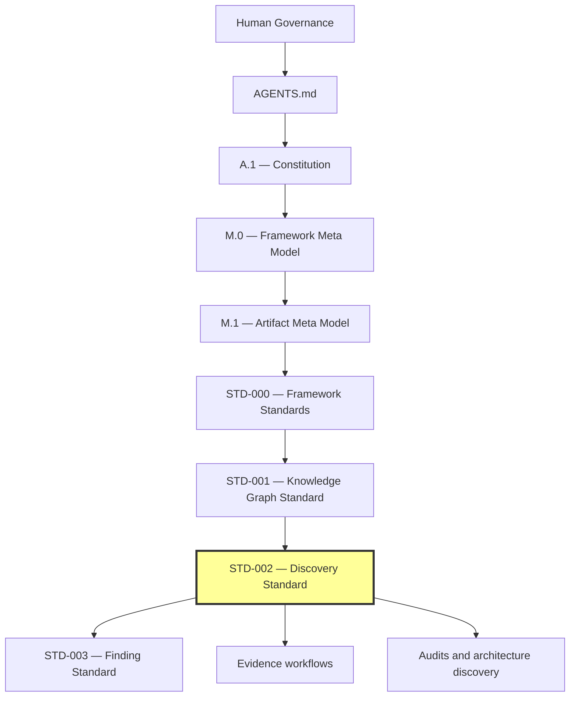
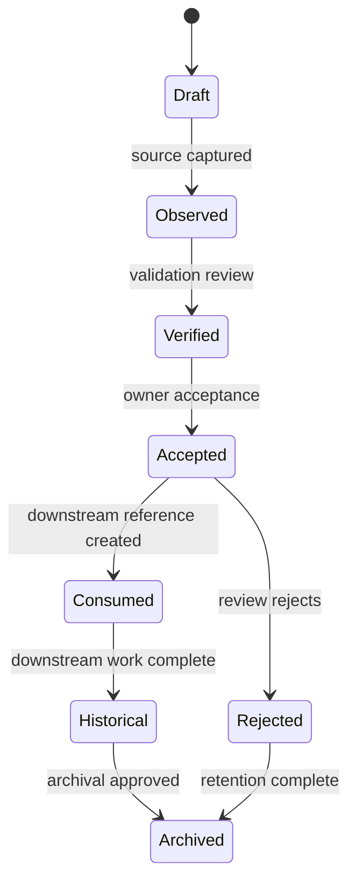

# STD-002 — Discovery Standard

> **Forge AI v3 · Standards Library**  
> Standards Library · Core Standard · Discovery Domain

---

## Document Metadata

| Field | Value |
|:---|:---|
| Identifier | `FORGE-STD-002` |
| Title | STD-002 — Discovery Standard |
| Version | 1.0.0-draft |
| Status | Draft; publication-ready pending governance approval |
| Canonical Status | Non-canonical until reviewed, approved, and promoted through Framework Governance |
| Classification | Core Standard / Discovery |
| Document Type | Framework Standard |
| Owner | Framework Governance |
| Maintainers | Framework Architecture Team |
| Review Authority | Enterprise Documentation Standards Board |
| Approval Authority | Human Governance / Framework Governance |
| Created | 2026-07-04 |
| Last Updated | 2026-07-07 |
| Lifecycle Phase | Draft |
| Traceability ID | FORGE-STD-002 |
| Scope | Discovery artifact and discovery process standard |
| Out of Scope | Implementation tooling and project state updates |
| Normative Authority | Human Governance; `AGENTS.md`; `docs/FrameworkGovernance.md` |
| Normative References | `docs/AI/Architecture/Standards/STD-010-Document-Metadata-Standard.md`; `docs/AI/Architecture/Standards/STD-000-Framework-Standards.md`; `docs/AI/Meta/M.0-Framework-Meta-Model.md`; `docs/AI/Meta/M.1-Artifact-Meta-Model.md` |
| Dependencies | Governance authority, artifact identity, lifecycle governance, traceability model, and applicable upstream v3 architecture documents |
| Consumes | M.0; M.1; STD-000; STD-001 discovery and graph contracts |
| Produces | Discovery artifacts, records, registry entries, lifecycle, metadata schema, graph projection, and AI discovery rules |
| Related Specifications | Findings, Evidence, Recommendations, Risks, Decisions, audits, runtime analysis |
| Supersedes | None |
| Superseded By | None |
| Promotion Requirements | Framework Governance review, approval, traceability validation, metadata validation, and explicit promotion |
| Certification Status | Not certified |

---


## Revision History

| Version | Date | Author | Description |
|:---|:---|:---|:---|
| 1.0.0-draft | 2026-07-04 | Framework Architecture Team | Initial draft of the canonical Discovery Standard. |
| 1.0.0-draft | 2026-07-07 | Framework Architecture Team | Final enterprise consistency and publication pass; normalized authority, metadata, graph alignment, cross-references, appendix inventory, AI rules, and editorial structure without changing approved Discovery architecture. |

---

## Table of Contents

1. [Status](#1-status)
2. [Preamble](#2-preamble)
3. [Purpose](#3-purpose)
4. [Scope](#4-scope)
5. [Authority](#5-authority)
6. [Relationship to M.0 and M.1](#6-relationship-to-m0-and-m1)
7. [Discovery Philosophy](#7-discovery-philosophy)
8. [Discovery Classification](#8-discovery-classification)
9. [Discovery Lifecycle](#9-discovery-lifecycle)
10. [Discovery Identity](#10-discovery-identity)
11. [Discovery Structure](#11-discovery-structure)
12. [Discovery Relationships](#12-discovery-relationships)
13. [Governance](#13-governance)
14. [Validation](#14-validation)
15. [Certification](#15-certification)
16. [Versioning](#16-versioning)
17. [Migration](#17-migration)
18. [References](#18-references)
19. [Glossary](#19-glossary)
20. [Next Standard](#20-next-standard)
21. [Discovery Taxonomy](#21-discovery-taxonomy)
22. [Discovery Metadata Schema](#22-discovery-metadata-schema)
23. [Discovery Dependency Matrix](#23-discovery-dependency-matrix)
24. [Discovery Lifecycle State Machine](#24-discovery-lifecycle-state-machine)
25. [Discovery Severity Model](#25-discovery-severity-model)
26. [Discovery Confidence Model](#26-discovery-confidence-model)
27. [Discovery Impact Matrix](#27-discovery-impact-matrix)
28. [Discovery Registry](#28-discovery-registry)
29. [Discovery Decision Record](#29-discovery-decision-record)
30. [AI Discovery Rules](#30-ai-discovery-rules)
31. [Appendices and Companion Schemas](#31-appendices-and-companion-schemas)
32. [Publication Review Record](#32-publication-review-record)
33. [Document Completion Checklist](#33-document-completion-checklist)

---

## 1. Status

### 1.1 Document Identity

STD-002 is the canonical Forge AI v3 Framework Standard for Discovery. A Discovery is a governed architectural observation captured before it becomes a Finding, Evidence item, Risk, Recommendation, Decision, implementation task, or architecture change.

STD-002 specializes higher-authority artifact, standard, and graph contracts for Discovery. It does not redefine those contracts.

### 1.2 Standard Position

STD-002 is the Discovery Standard in the Forge AI Standards Library. It depends on STD-000 for standards governance and STD-001 for knowledge graph semantics.



### 1.3 Classification

STD-002 is a Core Standard because Discovery is a foundational intake point for audits, findings, recommendations, risks, evidence, decisions, validation, migration, and governance review.

### 1.4 Success Criteria

STD-002 is successful when every Discovery can be captured, identified, classified, governed, validated, traced, represented in the knowledge graph, and consumed without becoming premature canonical truth.

### 1.5 Completion Statement

The Status section is complete when STD-002 has stable identity, position, classification, authority, compliance level, certification level, lifecycle state, consumers, produced assets, and success criteria.

---

## 2. Preamble

Discovery exists because Framework evolution begins with observation, not decision.

An observation may be valuable, but it is not automatically a Finding, Risk, Recommendation, Evidence item, Decision, or architecture change. Without a governed Discovery model, observations can become undocumented assumptions, duplicated claims, hidden risks, or premature architectural truth.

STD-002 establishes Discovery as the first governed intake point for architectural knowledge. Discovery is intentionally lightweight at intake and strict at promotion.

### 2.1 Guiding Statement

A Discovery records what has been observed. It does not decide what the observation means.

### 2.2 Completion Statement

The Preamble is complete when the reason for Discovery, its protective role, and its distinction from downstream artifacts are established.

---

## 3. Purpose

### 3.1 Overview

STD-002 defines the canonical model for capturing, managing, validating, graphing, and consuming Discoveries across Forge AI.

### 3.2 Objectives

STD-002 shall:

- define Discovery as a governed Artifact;
- define Discovery identity, lifecycle, metadata, classification, severity, confidence, impact, and disposition;
- prevent observations from becoming architectural truth prematurely;
- establish traceability from observation to Finding, Evidence, Recommendation, Risk, Decision, audit, or governance action;
- align Discovery graph projection with STD-001 node, edge, relationship, topology, traversal, ownership, and validation rules;
- support human, AI-agent, runtime, audit, review, governance, multi-agent, and swarm-generated observations;
- remain technology-neutral, platform-independent, and framework-governed.

### 3.3 Strategic Role

Discovery is the intake stage of the evidence-driven knowledge pipeline:

```text
Reality
    ↓
Discovery
    ↓
Finding
    ↓
Evidence
    ↓
Recommendation / Risk / Decision
    ↓
Implementation / Governance Action
    ↓
Validation
    ↓
Certification
```

### 3.4 Non-Goals

STD-002 does not:

- define the canonical Finding, Evidence, Recommendation, Risk, Decision, Task, Validation, or Certification artifact models;
- certify architecture;
- approve implementation;
- update Project Status;
- replace audits, review, certification, or human governance;
- define platform-specific runtime behavior;
- introduce implementation details or storage technology.

### 3.5 Completion Statement

The Purpose section is complete when Discovery's objective, strategic role, and non-goals are explicitly defined.

---

## 4. Scope

### 4.1 In Scope

STD-002 governs:

- Discovery Artifacts and Discovery Records;
- Discovery metadata, identity, lifecycle, state, ownership, authority, and disposition;
- Discovery classification, taxonomy, severity, confidence, impact, and urgency;
- Discovery source references, evidence references, and evidence gaps;
- Discovery relationships and graph projection rules;
- Discovery validation, review, certification readiness, registry entries, and migration;
- AI-generated Discovery constraints and output minimums.

### 4.2 Out of Scope

STD-002 does not govern:

- final downstream artifact structures owned by other standards;
- source-code implementation;
- data-store implementation;
- platform-specific workflows;
- business-domain discovery practices outside the Framework unless adopted by an adapter.

### 4.3 Boundary Rules

A Discovery shall not:

- claim canonical truth;
- prescribe implementation;
- update architecture by itself;
- override higher authority;
- bypass validation, review, certification, or governance;
- duplicate or redefine Findings, Evidence, Recommendations, Risks, Decisions, Tasks, Validations, or Certifications.

### 4.4 Completion Statement

The Scope section is complete when Discovery inclusions, exclusions, and boundary rules are defined.

---

## 5. Authority

### 5.1 Authority Chain

STD-002 operates under this authority chain:

```text
Human Governance
    ↓
AGENTS.md
    ↓
A.1 — Constitution
    ↓
M.0 — Framework Meta Model
    ↓
M.1 — Artifact Meta Model
    ↓
STD-000 — Framework Standards
    ↓
STD-001 — Knowledge Graph Standard
    ↓
STD-002 — Discovery Standard
```

If STD-002 conflicts with any higher authority, the higher authority prevails.

### 5.2 Authority Principles

Discovery authority is delegated, not supreme. Authorized humans, AI agents, reviewers, auditors, runtime processes, governance actors, multi-agent systems, and swarm systems may create Discoveries within active workflow scope. Creation authority is not acceptance authority.

### 5.3 Authority Responsibilities

| Role | Responsibility |
|:---|:---|
| Human Governance | Final escalation authority for disputed, critical, or framework-critical Discoveries. |
| Framework Governance | Approves Discovery governance rules and resolves classification, lifecycle, and disposition disputes. |
| Standards Owner | Maintains STD-002 and its companion artifacts. |
| Discovery Owner | Owns a specific Discovery from creation through closure or archival. |
| Reviewer | Validates Discovery completeness, traceability, confidence, classification, graph safety, and consumption readiness. |
| AI Agent | May propose Discovery Records within assigned scope and must declare sources, confidence, inference, and evidence gaps. |

### 5.4 Authority Constraints

A Discovery actor shall not:

- promote a Discovery to a Finding without the required workflow;
- self-certify a Discovery as canonical Evidence;
- modify constitutional authority;
- override STD-000 lifecycle, governance, certification, or migration rules;
- override STD-001 graph semantics;
- treat AI confidence as human approval.

### 5.5 Completion Statement

The Authority section is complete when Discovery creation, ownership, review, escalation, and conflict-resolution authority are defined.

---

## 6. Relationship to M.0 and M.1

### 6.1 Overview

STD-002 derives Discovery from M.0 core meta types and M.1 artifact contracts. Discovery is a specialized Artifact with identity, owner, authority, lifecycle, state, relationships, references, evidence links, validation status, review status, certification readiness, projection rules, serialization expectations, registry participation, and compliance obligations.

### 6.2 Derivation Model

| Higher-Authority Concept | STD-002 Specialization |
|:---|:---|
| M.0 Artifact | Discovery Artifact |
| M.0 / M.1 Identity | Discovery Identifier |
| M.0 / M.1 Lifecycle | Discovery Lifecycle |
| M.0 State | Discovery State |
| M.0 / M.1 Ownership | Discovery Owner |
| M.0 Authority | Discovery Authority |
| M.0 / M.1 Relationship | Discovery Relationship |
| M.0 Reference | Discovery Source Reference |
| M.0 Evidence | Supporting Evidence Reference and Evidence Gap |
| M.0 Validation | Discovery Validation |
| M.0 Review | Discovery Review |
| M.0 Certification | Discovery Certification Readiness |
| M.1 Metadata | Discovery Metadata Schema |
| M.1 Registry | Discovery Registry Entry |
| M.1 Projection | Discovery Graph Projection |
| M.1 Serialization | Discovery JSON and YAML Schema Profiles |

### 6.3 Reuse Rules

STD-002 shall reuse higher-authority definitions for identity, lifecycle, state, ownership, authority, relationships, references, evidence, validation, review, certification, registry, projection, serialization, extension, and compliance.

STD-002 may specialize these concepts for Discovery but shall not redefine their core meaning.

### 6.4 Completion Statement

The Relationship to M.0 and M.1 section is complete when Discovery is derived from canonical meta-model and artifact-model concepts without replacing them.

---

## 7. Discovery Philosophy

### 7.1 Core Principles

| Principle | Description |
|:---|:---|
| Observation Before Decision | A Discovery captures what was observed before deciding what it means. |
| Evidence Before Assumption | A Discovery shall identify sources and evidence gaps. |
| Confidence Is Explicit | Confidence shall be declared and justified. |
| Severity Is Distinct | Severity describes the seriousness of the observed condition if confirmed. |
| Impact Is Separate From Confidence | A low-confidence Discovery may have high potential impact. |
| Traceability Is Mandatory | Every Discovery shall trace to source, owner, lifecycle state, and downstream consumption. |
| No Premature Truth | Discovery shall not become architecture until validated and consumed through proper standards. |
| Human Review Remains Available | High-impact, critical, disputed, or framework-critical Discoveries shall be reviewable by Human Governance. |

### 7.2 Design Values

Discoveries should be:

- small enough to validate;
- specific enough to trace;
- neutral enough to avoid premature conclusions;
- structured enough for human and AI review;
- reusable by downstream standards;
- graph-safe and relationship-explicit.

### 7.3 Completion Statement

The Discovery Philosophy section is complete when the principles and design values governing Discovery are defined.

---

## 8. Discovery Classification

### 8.1 Overview

Discovery classification describes the domain in which an observation was made. Each Discovery shall have exactly one primary classification. Secondary tags may support indexing but shall not replace the primary classification.

### 8.2 Primary Classifications

| Classification | Description |
|:---|:---|
| Architecture Discovery | Observation about structure, boundaries, ownership, dependency, authority, or architectural integrity. |
| Runtime Discovery | Observation about execution behavior, lifecycle, orchestration, context, memory, or runtime state. |
| Governance Discovery | Observation about approval, compliance, authority, lifecycle, policy, or decision flow. |
| Planning Discovery | Observation about phases, stages, capabilities, tasks, roadmap structure, or planning hierarchy. |
| Validation Discovery | Observation about quality gates, test evidence, checks, validation gaps, or validation outcomes. |
| Documentation Discovery | Observation about documentation completeness, consistency, duplication, drift, or publication quality. |
| Dependency Discovery | Observation about dependency direction, hidden coupling, circularity, or layer leakage. |
| Ownership Discovery | Observation about accountability, duplicate ownership, missing ownership, or ownership drift. |
| Risk Discovery | Observation that may become a formal Risk. |
| Migration Discovery | Observation about compatibility, transition, deprecation, remediation, or migration impact. |
| Agent Discovery | Observation produced by or about AI agents. |
| Swarm Discovery | Observation produced by or about multi-agent or swarm behavior. |
| Knowledge Discovery | Observation about reusable knowledge, knowledge graph integrity, or knowledge relationships. |
| Memory Discovery | Observation about retained context, memory update, or future context. |
| Platform Discovery | Observation about platform adapters or host-specific behavior. |
| Security Discovery | Observation about security posture, exposure, access, trust boundary, or safety boundary. |
| Performance Discovery | Observation about performance, scalability, latency, throughput, or resource usage. |
| Compliance Discovery | Observation about regulatory, policy, standard, or internal compliance alignment. |

### 8.3 Classification Constraints

A Discovery shall not be classified by convenience. Classification shall describe the observed domain, not the desired next action.

### 8.4 Completion Statement

The Discovery Classification section is complete when the primary classification set and classification constraints are defined.

---

## 9. Discovery Lifecycle

### 9.1 Lifecycle States

```text
Draft
    ↓
Observed
    ↓
Verified
    ↓
Accepted
    ↓
Consumed
    ↓
Historical
    ↓
Archived
```

A Discovery may also enter `Rejected` after review when it is invalid, duplicate, outside scope, or unsupported.

### 9.2 State Definitions

| State | Meaning |
|:---|:---|
| Draft | The Discovery Record is being prepared and may be incomplete. |
| Observed | The observation has been captured with source information. |
| Verified | The observation has been checked for source validity and internal consistency. |
| Accepted | The Discovery is accepted as a valid governed observation. |
| Consumed | The Discovery has been consumed by a downstream artifact, audit, governance action, or architecture update workflow. |
| Historical | The Discovery remains available for traceability but is no longer active. |
| Archived | The Discovery is retained for historical record and no longer participates in active workflows. |
| Rejected | The Discovery was reviewed and rejected with rationale. |

### 9.3 Transition Rules

| Transition | Requirement |
|:---|:---|
| Draft → Observed | Minimum metadata and source reference exist. |
| Observed → Verified | Source, scope, classification, severity, confidence, and impact have been reviewed. |
| Verified → Accepted | Owner accepts the Discovery as valid within scope. |
| Accepted → Consumed | Downstream artifact or action references the Discovery. |
| Accepted → Rejected | Review rejects the Discovery with rationale. |
| Consumed → Historical | Downstream action is complete or Discovery is superseded. |
| Historical → Archived | Governance or owner authorizes archival. |
| Rejected → Archived | Retention and traceability requirements are satisfied. |

### 9.4 Lifecycle Constraints

A Discovery shall not:

- skip from Draft to Accepted;
- become Consumed without a downstream reference;
- become Historical without a disposition;
- lose its original source reference;
- be deleted after acceptance unless governance explicitly authorizes removal.

### 9.5 Completion Statement

The Discovery Lifecycle section is complete when states, transition rules, and lifecycle constraints are defined.

---

## 10. Discovery Identity

### 10.1 Identifier Format

Canonical Discovery identifiers use this format:

```text
DISC-<DOMAIN>-<YYYYMMDD>-<SEQ>
```

Examples:

```text
DISC-ARCH-20260704-001
DISC-RUNTIME-20260704-002
DISC-GOV-20260704-003
```

### 10.2 Identity Components

Every Discovery shall declare:

- Discovery Identifier;
- Title;
- Classification;
- Version;
- Lifecycle State;
- Owner;
- Authority;
- Source Reference;
- Created Date;
- Last Updated Date;
- Severity;
- Confidence Level;
- Impact Level;
- Disposition;
- Relationships.

### 10.3 Identity Constraints

A Discovery shall not:

- reuse an identifier for a different observation;
- change its identifier after acceptance;
- use an identifier that implies approval, evidence status, risk status, decision status, or implementation status;
- omit owner, authority, lifecycle state, or source reference.

### 10.4 Completion Statement

The Discovery Identity section is complete when identifier format, components, examples, and constraints are defined.

---

## 11. Discovery Structure

### 11.1 Canonical Structure

A Discovery Record shall contain:

1. Metadata header;
2. Observation statement;
3. Scope statement;
4. Source references;
5. Evidence references or evidence gaps;
6. Classification;
7. Severity;
8. Confidence;
9. Impact;
10. Ownership and authority;
11. Lifecycle state and version;
12. Relationships;
13. Validation status;
14. Review status;
15. Disposition;
16. AI provenance, when AI contributed;
17. Change history.

### 11.2 Observation Statement

The observation statement shall be neutral, bounded, and source-linked. It shall describe what was observed and shall avoid premature conclusions, recommendations, decisions, or implementation instructions.

### 11.3 Evidence and Evidence Gaps

A Discovery may reference Evidence when Evidence exists. If Evidence does not yet exist, the Discovery shall record the evidence gap and shall not present the observation as certified evidence.

### 11.4 Completion Statement

The Discovery Structure section is complete when canonical record components and statement rules are defined.

---

## 12. Discovery Relationships

### 12.1 Relationship Model

Discovery relationships shall be explicit, typed, directed, traceable, and compatible with STD-001. Relationships may connect Discoveries to sources, evidence, findings, recommendations, risks, decisions, tasks, validations, certifications, audits, standards, or governance actions.

### 12.2 Canonical Relationship Types

| Relationship | Direction | Meaning |
|:---|:---|:---|
| `SUPPORTED_BY` | Discovery → Evidence or Source | The Discovery is supported by source material or Evidence. |
| `DERIVED_FROM` | Downstream Artifact → Discovery | A downstream artifact was derived from the Discovery. |
| `IDENTIFIES` | Discovery → Finding/Risk candidate | The Discovery identifies a candidate downstream concern. |
| `RECOMMENDS` | Recommendation → Discovery | A Recommendation responds to the Discovery. |
| `RESULTS_IN` | Discovery → Decision/Task/Action | The Discovery resulted in a governed downstream action. |
| `VALIDATED_BY` | Discovery → Validation | The Discovery was validated by a validation result. |
| `CERTIFIED_BY` | Discovery → Certification | The Discovery was certified for consumption by a certification result. |
| `SUPERSEDES` | Discovery → Discovery | A newer Discovery supersedes an earlier Discovery. |
| `RELATED_TO` | Discovery → Artifact | A non-authoritative contextual relationship exists. |

### 12.3 Relationship Constraints

A Discovery relationship shall not:

- imply canonical truth without validation and review;
- reverse ownership between Discovery and downstream artifacts;
- redefine STD-001 relationship semantics;
- create hidden dependencies;
- bypass required downstream standards.

### 12.4 Completion Statement

The Discovery Relationships section is complete when relationship types, direction, semantics, and constraints are defined.

---

## 13. Governance

### 13.1 Governance Requirements

Discoveries shall be governed through documented ownership, lifecycle state, validation, review, and disposition. Governance determines whether a Discovery is accepted, consumed, rejected, monitored, escalated, or archived.

### 13.2 Review Requirements

Review is required when a Discovery is:

- high, critical, or framework-critical impact;
- disputed;
- AI-generated and material to governance, architecture, validation, or certification;
- intended to support a Finding, Risk, Recommendation, Decision, or architecture change;
- marked for Consumption Certification.

### 13.3 Disposition Options

| Disposition | Meaning |
|:---|:---|
| Promote to Finding | The Discovery should become or support a Finding. |
| Link to Evidence | The Discovery should be connected to Evidence. |
| Open Risk | The Discovery should become or support a Risk. |
| Recommend Action | The Discovery should support a Recommendation. |
| Decide | The Discovery requires a governance Decision. |
| Monitor | The Discovery remains active without immediate downstream action. |
| Close | The Discovery is resolved without further action. |
| Reject | The Discovery is invalid, duplicate, unsupported, or outside scope. |

### 13.4 Decision Records

Material Discovery dispositions shall reference a Discovery Decision Record or equivalent governance decision trail. Decision records document how a Discovery was handled; they do not redefine the Discovery model.

### 13.5 Completion Statement

The Governance section is complete when ownership, review requirements, dispositions, and decision-record expectations are defined.

---

## 14. Validation

### 14.1 Validation Purpose

Discovery validation verifies that the Discovery is complete, traceable, correctly classified, graph-safe, and safe to consume. Validation does not prove that the Discovery is architecturally true. It verifies that the Discovery is a valid governed observation.

### 14.2 Validation Checks

| Check | Requirement |
|:---|:---|
| Identity | Identifier, title, owner, authority, state, version, and dates exist. |
| Classification | Primary classification is valid and justified. |
| Source | At least one source reference exists. |
| Scope | Observation scope is clear and bounded. |
| Severity | Severity is declared and justified. |
| Confidence | Confidence level is declared and justified. |
| Impact | Impact level is declared and justified. |
| Relationships | Related artifacts are listed where known and use allowed relationship types. |
| Graph Compliance | Discovery node and edge projections comply with STD-001 and the Discovery Graph Model. |
| Non-Premature Truth | Discovery does not claim to be a Finding, Evidence item, Risk, Recommendation, Decision, Task, Validation, or Certification. |
| AI Safety | AI-generated Discoveries declare model/user/source boundaries, inference, confidence, and evidence gaps. |

### 14.3 Validation Outcomes

| Outcome | Meaning |
|:---|:---|
| Valid | Discovery is structurally valid. |
| Valid with Observations | Discovery is usable but has advisory issues. |
| Requires Follow-Up | Discovery lacks required information or review. |
| Invalid | Discovery cannot be accepted. |

### 14.4 Completion Statement

The Validation section is complete when Discovery validation purpose, checks, and outcomes are defined.

---

## 15. Certification

### 15.1 Certification Meaning

Discovery certification does not mean the Discovery is canonical architecture. For Discovery, certification means the Discovery Record is complete, governed, reviewed as required, and safe for downstream consumption.

### 15.2 Certification Levels

| Level | Meaning |
|:---|:---|
| Uncertified | Discovery has not passed validation. |
| Intake Certified | Discovery is structurally complete and source-linked. |
| Review Certified | Discovery has passed required review. |
| Consumption Certified | Discovery may be consumed by Finding, Evidence, Recommendation, Risk, Decision, audit, or governance workflows. |

### 15.3 Certification Prerequisites

A Discovery may be Consumption Certified only when:

- required metadata is complete;
- validation has passed;
- source references are resolvable;
- severity, confidence, and impact are declared;
- graph relationships are valid;
- owner accepts accountability;
- review is complete when required;
- downstream usage is identified.

### 15.4 Certification Constraints

Discovery certification shall not certify downstream truth, approve implementation, or update architecture. Downstream artifacts retain their own validation, review, and certification obligations.

### 15.5 Completion Statement

The Certification section is complete when certification meaning, levels, prerequisites, and constraints are defined.

---

## 16. Versioning

### 16.1 Versioning Rules

Discovery Records use local revision versioning:

```text
0.1-draft
0.2-observed
0.3-verified
1.0-accepted
1.1-consumed
```

### 16.2 Version Increment Rules

| Change | Version Impact |
|:---|:---|
| Metadata correction | Patch revision. |
| Source added | Minor revision. |
| Severity changed | Minor revision and review when material. |
| Confidence changed | Minor revision. |
| Impact changed | Minor revision and review when material. |
| Classification changed | Minor revision and review. |
| Observation statement changed after Accepted | Major revision or supersession. |
| Discovery superseded | New Discovery identifier or explicit `SUPERSEDES` relationship. |

### 16.3 Versioning Constraints

Accepted Discoveries shall preserve historical revisions. A Discovery shall not erase earlier source, severity, confidence, impact, disposition, validation, review, or relationship history.

### 16.4 Completion Statement

The Versioning section is complete when Discovery version states, increment rules, and constraints are defined.

---

## 17. Migration

### 17.1 Migration Purpose

Discovery migration ensures that Discovery Records remain usable when standards, meta models, graph semantics, classifications, lifecycle states, registry formats, or schemas evolve.

### 17.2 Migration Triggers

A Discovery migration may be required when:

- STD-002 changes classification taxonomy, lifecycle, schema, or registry requirements;
- M.0 changes Artifact, Identity, Lifecycle, Relationship, Reference, Evidence, Validation, Review, or Certification concepts;
- M.1 changes artifact metadata, projection, serialization, registry, extension, or compliance contracts;
- STD-000 changes standards lifecycle, governance, compliance, certification, migration, decision-record, or AI-consumption rules;
- STD-001 changes graph node, edge, relationship, topology, traversal, ownership, validation, or AI rules;
- downstream standards change relationship expectations;
- a constitutional amendment changes evidence, authority, or human-governance requirements.

### 17.3 Migration Requirements

Migration shall preserve:

- original identifier;
- original observation statement;
- source references;
- evidence references and evidence gaps;
- lifecycle history;
- graph relationships;
- downstream relationships;
- validation and review history;
- disposition history.

### 17.4 Migration Constraints

Migration shall not silently promote a Discovery, alter its original observation meaning, erase evidence gaps, or convert it into downstream canonical truth.

### 17.5 Completion Statement

The Migration section is complete when Discovery migration triggers, preservation requirements, and constraints are defined.

---

## 18. References

### 18.1 Normative References

| Reference | Description |
|:---|:---|
| [AGENTS.md](../../../../AGENTS.md) | Bootstrap authority and project constitution. |
| [A.1 — Constitution](../A.1-Constitution.md) | Constitutional authority, human governance, source-of-truth, evidence, compliance, and certification principles. |
| [M.0 — Framework Meta Model](../../Meta/M.0-Framework-Meta-Model.md) | Conceptual type system consumed by Discovery. |
| [M.1 — Artifact Meta Model](../../Meta/M.1-Artifact-Meta-Model.md) | Canonical artifact identity, lifecycle, metadata, relationship, validation, projection, serialization, registry, extension, and compliance model. |
| [STD-000 — Framework Standards](./STD-000-Framework-Standards.md) | Standards governance, structure, lifecycle, validation, certification, versioning, migration, metadata, decision records, and AI consumption rules. |
| [STD-001 — Knowledge Graph Standard](./STD-001-Knowledge-Graph-Standard.md) | Canonical knowledge graph model, node and edge semantics, topology, traversal, graph ownership, relationship semantics, validation, and AI graph rules. |
| [STD-002 Discovery JSON Schema](../Schemas/STD-002-Discovery-JSON-Schema.md) | Human-readable JSON schema profile for Discovery serialization. |
| [STD-002 Discovery YAML Schema](../Schemas/STD-002-Discovery-YAML-Schema.md) | Human-readable YAML schema profile for Discovery serialization. |
| [STD-002 Discovery Graph Model](../Schemas/STD-002-Discovery-Graph-Model.md) | Discovery projection into STD-001 graph semantics. |

### 18.2 Companion Machine Schemas

| Reference | Description |
|:---|:---|
| [STD-002 Discovery JSON Schema File](../Schemas/STD-002-Discovery.schema.json) | Machine-readable JSON Schema for Discovery Records. |
| [STD-002 Discovery YAML Schema File](../Schemas/STD-002-Discovery.schema.yaml) | Machine-readable YAML schema profile for Discovery Records. |

### 18.3 Informative References

| Reference | Description |
|:---|:---|
| [A.0 — Framework Audit](../A.0-Framework-Audit.md) | Audit baseline where Discovery-style observations, evidence, gaps, risks, and recommendations are used. |
| [STD-003 — Terminology Standard](./STD-003-Terminology-Standard.md) | Published successor in the current repository; governs terminology rather than Finding. |
| STD-004 — Finding Standard | Planned downstream consumer of Discovery when introduced by governance. |
| STD-005 — Recommendation Standard | Planned downstream consumer of Discovery and Finding when introduced by governance. |
| STD-006 — Risk Standard | Planned downstream consumer of Discovery when introduced by governance. |
| STD-007 — Evidence Standard | Planned evidence model related to Discovery when introduced by governance. |

### 18.4 Reference Constraints

References to planned standards are informative until those standards exist and are approved through governance. Planned standards shall not be treated as current normative authority.

### 18.5 Completion Statement

The References section is complete when normative, companion, informative, and planned references are listed with their relationship to STD-002.

---

## 19. Glossary

| Term | Definition |
|:---|:---|
| Discovery | A governed observation captured before it becomes a Finding, Evidence item, Risk, Recommendation, Decision, implementation task, or architecture change. |
| Discovery Artifact | The standardized artifact type governed by STD-002. |
| Discovery Record | A concrete instance of a Discovery Artifact. |
| Discovery Owner | The accountable owner responsible for lifecycle, validation, review, and disposition of a Discovery. |
| Discovery Classification | The primary observed domain of a Discovery. |
| Discovery Severity | The seriousness of the observed condition if confirmed. |
| Discovery Confidence | The declared reliability level of a Discovery based on source quality and verification status. |
| Discovery Impact | The potential architectural, governance, operational, validation, migration, or implementation effect if the Discovery is confirmed. |
| Discovery Disposition | The governed outcome assigned to a Discovery after review or assessment. |
| Consumed Discovery | A Discovery that has been used by a downstream artifact, audit, governance action, or architecture update workflow. |
| Observation Statement | The neutral statement describing what was observed. |
| Evidence Gap | A declared absence, weakness, or incompleteness of evidence needed to support a Discovery. |
| Premature Truth | Treating an unvalidated Discovery as canonical architecture, certified evidence, approved decision, or implementation authority. |

### 19.1 Terminology Rules

STD-002 terms shall be interpreted through A.1, M.0, M.1, STD-000, STD-001, and approved terminology standards. STD-002 shall not duplicate canonical definitions where a higher-authority document owns the term.

### 19.2 Completion Statement

The Glossary section is complete when STD-002 terms are defined consistently with higher-authority terminology.

---

## 20. Next Standard

### 20.1 Current Repository Successor

The next published Framework Standard in the current repository is:

| Property | Value |
|:---|:---|
| **Identifier** | `FORGE-STD-003` |
| **Title** | STD-003 — Terminology Standard |
| **Status** | Draft |
| **Role** | Defines canonical terminology governance for the Standards Library. |

### 20.2 Downstream Discovery Consumers

Finding, Evidence, Recommendation, Risk, and Decision standards remain downstream Discovery consumers when introduced and approved by governance. Those standards shall consume STD-002 and identify their Discovery dependencies without redefining Discovery.

### 20.3 Completion Statement

The Next Standard section is complete when the current repository successor and planned downstream consumers are identified without creating false normative dependencies.

---

## 21. Discovery Taxonomy

### 21.1 Overview

Discovery Taxonomy provides a structured model for organizing Discoveries across the Framework.

### 21.2 Taxonomy Dimensions

| Dimension | Values |
|:---|:---|
| Domain | Architecture, Runtime, Governance, Planning, Validation, Documentation, Dependency, Ownership, Risk, Migration, Agent, Swarm, Knowledge, Memory, Platform, Security, Performance, Compliance |
| Source Type | Human, AI Agent, Runtime, Audit, Test, Review, Governance, External Reference, Multi-Agent, Swarm |
| Severity | Info, Low, Medium, High, Critical |
| Confidence | Observed, Likely, Verified, Confirmed, Canonical Evidence |
| Impact | Low, Medium, High, Critical, Framework-Critical |
| Urgency | Passive, Monitor, Review Required, Immediate Review, Blocker |
| Disposition | Promote to Finding, Link to Evidence, Open Risk, Recommend Action, Decide, Monitor, Close, Reject |

### 21.3 Taxonomy Rule

Taxonomy values support classification and review. They shall not replace owner judgment, governance review, validation, certification, evidence evaluation, or graph validation.

### 21.4 Completion Statement

The Discovery Taxonomy section is complete when taxonomy dimensions and taxonomy rules are defined.

---

## 22. Discovery Metadata Schema

### 22.1 Canonical Metadata Schema

```yaml
id: DISC-ARCH-20260704-001
title: Governance definition overlap discovered
standard: FORGE-STD-002
version: 0.3-verified
state: Verified
classification: Architecture Discovery
source_type: Audit
owner: Framework Architecture Team
authority: Framework Governance
created: 2026-07-04
updated: 2026-07-04
severity: High
confidence: Verified
impact: High
urgency: Review Required
source_references:
  - docs/AI/Architecture/A.0-Framework-Audit.md#12-terminology-audit
evidence_references: []
evidence_gaps:
  - Downstream Finding has not yet been created.
related_artifacts:
  - FORGE-STD-003
disposition: Promote to Finding
validation_status: Valid
review_status: Pending
certification_level: Intake Certified
ai_provenance:
  generated_by_ai: false
  inference_used: false
```

### 22.2 Required Fields

| Field | Required | Description |
|:---|:---:|:---|
| id | Yes | Discovery identifier. |
| title | Yes | Human-readable title. |
| standard | Yes | Governing standard. |
| version | Yes | Discovery record version. |
| state | Yes | Discovery lifecycle state. |
| classification | Yes | Primary classification. |
| source_type | Yes | Origin type. |
| owner | Yes | Accountable owner. |
| authority | Yes | Governing authority. |
| created | Yes | Creation date. |
| updated | Yes | Last updated date. |
| severity | Yes | Severity level. |
| confidence | Yes | Confidence level. |
| impact | Yes | Impact level. |
| source_references | Yes | Source references. |
| evidence_gaps | Yes | Evidence gaps when Evidence is incomplete or absent. |
| disposition | Yes | Current disposition. |
| validation_status | Yes | Validation outcome. |
| review_status | Yes | Review status. |

### 22.3 Schema Alignment

The metadata schema in this section is the conceptual canonical metadata contract. The JSON Schema, YAML Schema, and Discovery Graph Model provide companion serialization and projection profiles and shall not introduce conflicting semantics.

### 22.4 Completion Statement

The Discovery Metadata Schema section is complete when a canonical metadata contract, required fields, and schema alignment rule are defined.

---

## 23. Discovery Dependency Matrix

| Discovery Concern | Depends On | Produces | Consumed By |
|:---|:---|:---|:---|
| Identity | M.0 Identity, M.1 Identity, STD-000 Identity | Discovery Identifier | Registry, validation, review, graph projection |
| Lifecycle | M.0 Lifecycle, M.1 Lifecycle, STD-000 Lifecycle | Discovery State | Governance, registry, validation, migration |
| Classification | STD-002 Classification | Classification record | Review, registry, metrics, discovery catalog |
| Source Reference | M.0 Reference, M.1 Metadata | Source trace | Evidence, Finding, audit, governance review |
| Evidence Gap | M.0 Evidence | Evidence-gap declaration | Evidence workflow, Finding workflow, governance review |
| Relationship | M.0 Relationship, M.1 Relationship, STD-001 Edge | Typed relationship | Graph projection, traversal, downstream artifacts |
| Severity | STD-002 Severity Model | Severity assessment | Review, governance, urgency handling |
| Confidence | STD-002 Confidence Model | Confidence assessment | Review, risk, decision, certification readiness |
| Impact | STD-002 Impact Matrix | Impact assessment | Governance, risk, decision, escalation |
| Disposition | Governance | Next action | Finding, Evidence, Risk, Recommendation, Decision, closure |
| Serialization | M.1 Serialization, Discovery JSON/YAML Schemas | JSON/YAML record | Runtime, AI agents, validators, registries |
| Graph Projection | M.1 Projection, STD-001, Discovery Graph Model | Discovery node and edges | Traversal, graph validation, explainability |

### 23.1 Dependency Constraints

Discovery dependencies shall flow from higher authority to specialized Discovery behavior. Downstream artifacts may consume Discovery but shall not redefine Discovery.

### 23.2 Completion Statement

The Discovery Dependency Matrix section is complete when Discovery dependencies, outputs, consumers, and constraints are defined.

---

## 24. Discovery Lifecycle State Machine



### 24.1 State Machine Rules

- Draft records may be edited freely.
- Observed records require source preservation.
- Verified records require validation history.
- Accepted records require owner accountability.
- Consumed records require downstream references.
- Historical records remain traceable.
- Rejected records require rationale.
- Archived records remain referenceable when feasible.

### 24.2 Completion Statement

The Discovery Lifecycle State Machine section is complete when lifecycle transitions are formally represented and constrained.

---

## 25. Discovery Severity Model

### 25.1 Severity Definition

Severity describes the seriousness of the observed condition if the Discovery is confirmed.

| Severity | Meaning | Example |
|:---|:---|:---|
| Info | Useful observation with no immediate concern. | A document uses an older label but remains clear. |
| Low | Minor issue with limited effect. | A non-normative cross-reference is missing. |
| Medium | Material issue requiring follow-up. | A required metadata field is incomplete. |
| High | Significant architectural, governance, graph, or validation concern. | Ownership is ambiguous across two documents. |
| Critical | Potential constitutional, authority, dependency, graph-integrity, or safety breach. | A lower authority overrides the Constitution. |

### 25.2 Severity Constraint

Severity shall not be inflated to force action. Severity shall be justified by observed condition, source quality, impact, and evidence.

### 25.3 Completion Statement

The Discovery Severity Model section is complete when severity levels and usage constraints are defined.

---

## 26. Discovery Confidence Model

### 26.1 Confidence Levels

```text
Observed
    ↓
Likely
    ↓
Verified
    ↓
Confirmed
    ↓
Canonical Evidence
```

| Confidence | Meaning |
|:---|:---|
| Observed | The observation has been captured but not verified. |
| Likely | Initial review suggests the observation is probably valid. |
| Verified | Source and context have been checked. |
| Confirmed | Independent review confirms the observation. |
| Canonical Evidence | The observation is backed by canonical Evidence and can support certification or formal decisions. |

### 26.2 Confidence Rules

- Confidence shall be explicit.
- Confidence shall not be inferred from AI certainty language.
- Confidence shall be supported by source quality.
- High impact plus low confidence requires review, not automatic rejection.
- Canonical Evidence requires alignment with the approved Evidence standard when it exists.

### 26.3 Completion Statement

The Discovery Confidence Model section is complete when confidence levels, meanings, and rules are defined.

---

## 27. Discovery Impact Matrix

| Impact | Description | Required Response |
|:---|:---|:---|
| Low | Limited local effect. | Record and monitor. |
| Medium | May affect one document, artifact, workflow, registry, or relationship. | Review and classify. |
| High | May affect architecture, ownership, dependency, validation, graph integrity, migration, or governance. | Required review. |
| Critical | May violate constitutional authority, source-of-truth rules, graph integrity, or safety boundaries. | Immediate escalation. |
| Framework-Critical | May affect the integrity of the Framework Core or Standards Library. | Human Governance review. |

### 27.1 Impact and Confidence Handling

| Confidence | Low Impact | Medium Impact | High Impact | Critical Impact | Framework-Critical Impact |
|:---|:---|:---|:---|:---|:---|
| Observed | Monitor | Review | Required Review | Escalate | Human Governance |
| Likely | Monitor | Review | Required Review | Escalate | Human Governance |
| Verified | Accept / Monitor | Accept / Promote | Promote | Escalate | Human Governance |
| Confirmed | Accept | Promote | Promote / Decide | Escalate | Human Governance |
| Canonical Evidence | Consume | Consume | Consume / Decide | Human Governance | Human Governance |

### 27.2 Completion Statement

The Discovery Impact Matrix section is complete when impact levels and confidence-impact handling are defined.

---

## 28. Discovery Registry

### 28.1 Registry Purpose

The Discovery Registry tracks active and historical Discovery Records and preserves traceability from observation through downstream consumption or closure.

### 28.2 Registry Entry Schema

| Field | Description |
|:---|:---|
| Discovery ID | Stable Discovery identifier. |
| Title | Human-readable title. |
| Classification | Primary classification. |
| State | Lifecycle state. |
| Owner | Accountable owner. |
| Severity | Current severity. |
| Confidence | Current confidence. |
| Impact | Current impact. |
| Disposition | Current disposition. |
| Related Artifacts | Linked Findings, Evidence, Risks, Recommendations, Decisions, Validations, Certifications, audits, or governance actions. |
| Graph Node ID | Knowledge graph node identity when projected. |
| Last Updated | Last modification date. |

### 28.3 Registry Rules

- Accepted Discoveries shall be listed in a registry or equivalent traceability record.
- Consumed Discoveries shall identify downstream artifacts.
- Rejected Discoveries may be retained for duplicate prevention and audit traceability.
- Archived Discoveries shall remain referenceable when feasible.
- Registry entries shall not redefine the Discovery Record.

### 28.4 Completion Statement

The Discovery Registry section is complete when registry purpose, schema, and rules are defined.

---

## 29. Discovery Decision Record

### 29.1 Purpose

A Discovery Decision Record documents a governance decision made because of one or more Discoveries.

### 29.2 Decision Record Schema

| Field | Description |
|:---|:---|
| Decision ID | Stable identifier for the decision. |
| Related Discovery IDs | Discoveries that triggered the decision. |
| Decision Date | Date of decision. |
| Decision Authority | Authority that made the decision. |
| Decision | Approved action, rejection, deferral, escalation, or closure. |
| Rationale | Reasoning and evidence basis. |
| Impact | Expected effect of the decision. |
| Follow-Up | Required downstream action. |
| Traceability | Links to source references, graph nodes, validation records, or downstream artifacts. |

### 29.3 Decision Constraints

A Discovery Decision Record may decide how to handle a Discovery. It shall not redefine Discovery, bypass downstream standards, or convert a Discovery into canonical truth without the applicable validation, review, certification, and governance process.

### 29.4 Completion Statement

The Discovery Decision Record section is complete when decision record purpose, schema, and constraints are defined.

---

## 30. AI Discovery Rules

### 30.1 AI Agent Rules

AI agents may create Discoveries only within assigned scope.

AI-generated Discoveries shall:

- declare source material;
- distinguish observation from inference;
- declare severity, confidence, impact, and evidence gaps;
- avoid presenting assumptions as facts;
- avoid converting Discoveries into implementation tasks without workflow authorization;
- request review for high, critical, framework-critical, disputed, or governance-sensitive Discoveries;
- preserve higher-authority rules;
- preserve graph semantics and relationship direction;
- provide traceable output that humans and validators can inspect.

### 30.2 Forbidden AI Behaviors

AI agents shall not:

- invent sources;
- fabricate evidence;
- self-certify Discovery as canonical Evidence;
- override Human Governance;
- update Project Status solely because a Discovery exists;
- treat model confidence as validation;
- silently merge multiple Discoveries into one conclusion;
- classify downstream action before recording the observation;
- create canonical truth, graph semantics, standards definitions, or architecture authority from Discovery alone.

### 30.3 AI Discovery Output Minimum

An AI-generated Discovery shall include:

```text
Observation
Source
Scope
Classification
Severity
Confidence
Impact
Evidence Gap
Relationship Candidates
Recommended Disposition
AI Provenance
```

### 30.4 Explainability and Traceability

AI-generated Discovery output shall be explainable enough for independent review. Each material claim shall be traceable to a source, explicit inference, or evidence gap.

### 30.5 Completion Statement

The AI Discovery Rules section is complete when agent permissions, required behavior, forbidden behavior, minimum output, explainability, and traceability requirements are defined.

---

## 31. Appendices and Companion Schemas

### 31.1 Appendix Inventory

The following appendix exists for STD-002:

| Appendix | Path | Status | Owner |
|:---|:---|:---|:---|
| Appendix A — Discovery Classification Catalog | [`../Appendix/STD-002-Discovery-Standard-Appendix-A-Discovery-Classification-Catalog.md`](../Appendix/STD-002-Discovery-Standard-Appendix-A-Discovery-Classification-Catalog.md) | Draft | Framework Architecture Team |

### 31.2 Companion Schema Inventory

The following companion schemas and graph profiles exist for STD-002:

| Artifact | Path | Status | Owner |
|:---|:---|:---|:---|
| Discovery JSON Schema | [`../Schemas/STD-002-Discovery-JSON-Schema.md`](../Schemas/STD-002-Discovery-JSON-Schema.md) | Draft | Framework Architecture Team |
| Discovery YAML Schema | [`../Schemas/STD-002-Discovery-YAML-Schema.md`](../Schemas/STD-002-Discovery-YAML-Schema.md) | Draft | Framework Architecture Team |
| Discovery Graph Model | [`../Schemas/STD-002-Discovery-Graph-Model.md`](../Schemas/STD-002-Discovery-Graph-Model.md) | Draft | Framework Architecture Team |
| Discovery JSON Schema File | [`../Schemas/STD-002-Discovery.schema.json`](../Schemas/STD-002-Discovery.schema.json) | Draft | Framework Architecture Team |
| Discovery YAML Schema File | [`../Schemas/STD-002-Discovery.schema.yaml`](../Schemas/STD-002-Discovery.schema.yaml) | Draft | Framework Architecture Team |

### 31.3 Appendix Rules

- Appendices and companion schemas are subordinate to STD-002.
- Appendices shall not redefine Discovery authority, lifecycle, taxonomy, metadata, relationships, graph topology, or AI rules.
- Companion schemas shall serialize or project STD-002 semantics without introducing conflicting semantics.
- Planned appendices shall not be listed as existing until files exist in the repository.

### 31.4 Completion Statement

The Appendices and Companion Schemas section is complete when existing appendices and schema artifacts are inventoried and constrained.

---

## 32. Publication Review Record

### 32.1 Executive Summary

STD-002 has been normalized for publication readiness while preserving the approved Discovery architecture. The pass corrected authority order, eliminated duplicate metadata and duplicate schema keys, aligned Discovery with M.1 and STD-001, clarified planned versus existing standards, replaced orphan appendix references with the actual repository inventory, normalized terminology, strengthened AI-runtime constraints, and added a publication review record.

### 32.2 Architecture Consistency Verdict

**PASS WITH OBSERVATIONS**

STD-002 is internally consistent, externally aligned, graph-compliant, standards-compliant, and AI-runtime ready at draft level. Remaining observations require governance approval and downstream standard publication, not redesign of Discovery.

### 32.3 Complete Finding Matrix

| Severity | Finding | Disposition |
|:---|:---|:---|
| Critical | No architecture-changing conflict remains after the publication pass. | Closed. |
| High | Previous authority chain omitted M.1 and STD-001 in several places. | Fixed by canonical authority chain and dependency matrix. |
| High | Previous references treated planned downstream standards as if all were current normative standards. | Fixed by separating current repository successor and planned informative consumers. |
| Medium | Previous appendix inventory listed non-existent Appendices B-H. | Fixed by listing only the existing Appendix A and companion schemas. |
| Medium | Previous metadata example duplicated `confidence`. | Fixed by single `confidence` field and added `severity`, `evidence_gaps`, and `ai_provenance`. |
| Medium | Previous graph compliance was referenced but not carried through validation, registry, and dependency sections. | Fixed by explicit STD-001 alignment across relationships, validation, registry, migration, and AI rules. |
| Low | Previous identifier examples duplicated one Discovery ID. | Fixed by unique examples. |
| Low | Previous strategic pipeline had duplicated `Implementation / Governance Action`. | Fixed by normalized pipeline. |
| Editorial | Section labels and terminology varied between Discovery, discovery, evidence, canonical evidence, acceptance, and certification wording. | Normalized with glossary and terminology rules. |

### 32.4 Recommended Fixes

All publication-scope fixes have been applied in this document. Recommended follow-up items are:

1. Governance should approve or reject publication of STD-002 as the canonical Discovery Standard.
2. Companion schemas should be validated against the normalized metadata contract.
3. Appendix A should be reviewed for taxonomy alignment with Section 8 and Section 21.
4. Planned downstream standards should adopt STD-002 dependencies without redefining Discovery.

### 32.5 Dependency Impact

STD-002 continues to depend on A.1, M.0, M.1, STD-000, and STD-001. The publication pass strengthens dependency clarity but does not change approved architecture, graph topology, or downstream artifact responsibilities.

### 32.6 Cross-Document Impact

| Document | Impact |
|:---|:---|
| A.1 — Constitution | No change required; STD-002 now references Human Governance, source-of-truth, evidence, compliance, and certification principles more explicitly. |
| M.0 — Framework Meta Model | No change required; Discovery remains a specialized Artifact. |
| M.1 — Artifact Meta Model | No change required; STD-002 now explicitly consumes M.1 artifact contracts. |
| STD-000 — Framework Standards | No change required; STD-002 now aligns metadata, lifecycle, governance, certification, migration, decision records, and AI consumption rules. |
| STD-001 — Knowledge Graph Standard | No change required; STD-002 now explicitly aligns relationship, node, edge, topology, traversal, ownership, and graph validation language. |
| STD-002 JSON/YAML Schemas | Follow-up validation recommended to ensure field naming and required fields match the normalized standard. |
| STD-002 Graph Model | Follow-up validation recommended to ensure projection examples match the normalized relationship list. |
| Appendix A | Follow-up review recommended for taxonomy consistency. |

### 32.7 Publication Readiness Score

**94%**

The standard is publication-ready at draft level. The remaining 6% reflects governance approval and companion artifact validation rather than unresolved architecture defects.

### 32.8 Remaining Blockers

No Discovery architecture blockers remain. Publication blockers are governance and validation tasks:

- Governance approval is required before canonical promotion.
- Companion JSON/YAML schemas require validation against the normalized metadata contract.
- Appendix A requires taxonomy consistency review.

### 32.9 Publication Recommendation

Publish STD-002 as the Forge AI v3 Discovery Standard after governance approval and companion artifact validation. Do not redesign Discovery, Knowledge Graph, authority, lifecycle, or graph topology as part of publication.

### 32.10 Completion Statement

The Publication Review Record is complete when audit findings, applied fixes, impacts, readiness score, blockers, and recommendation are documented.

---

## 33. Document Completion Checklist

- [x] Document identity normalized.
- [x] Authority chain normalized.
- [x] Owner and maintainer declared.
- [x] Version, status, classification, taxonomy, compliance level, certification level, and lifecycle declared.
- [x] Duplicate metadata removed.
- [x] Section ordering and numbering normalized.
- [x] TOC updated.
- [x] STD-000 compliance reviewed.
- [x] STD-001 graph compliance reviewed.
- [x] M.0 and M.1 compliance reviewed.
- [x] Terminology normalized.
- [x] AI consumption rules normalized.
- [x] Governance, review, certification, lifecycle, migration, dependencies, capabilities, metadata, decision records, and validation included.
- [x] References audited and corrected.
- [x] Appendix inventory corrected.
- [x] Repository paths verified.
- [x] Publication review record included.
- [x] Approved architectural intent preserved.
