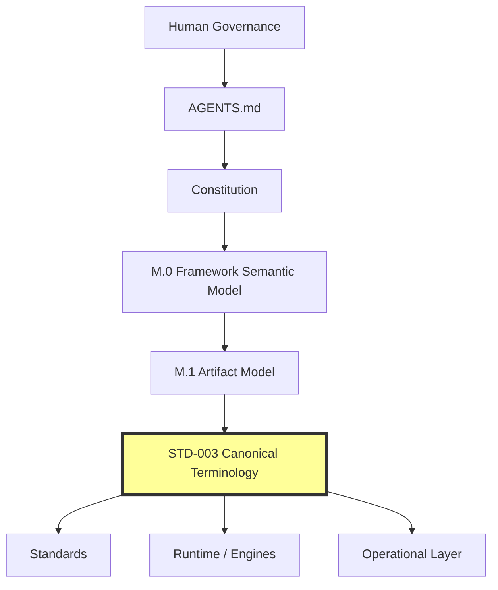
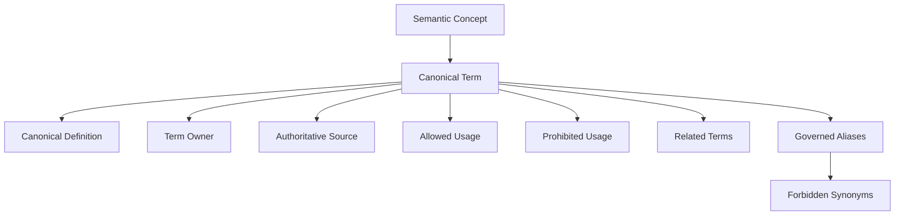
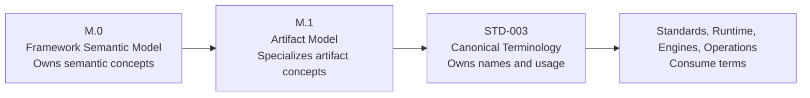
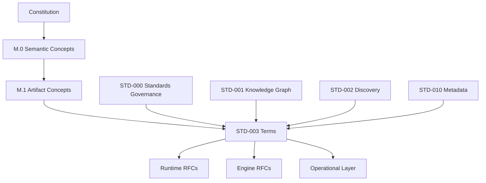
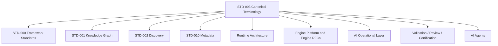
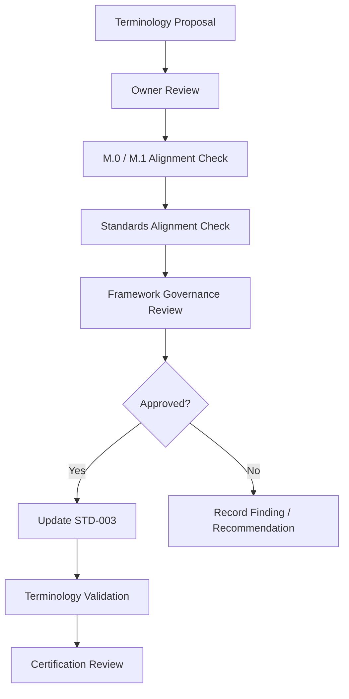
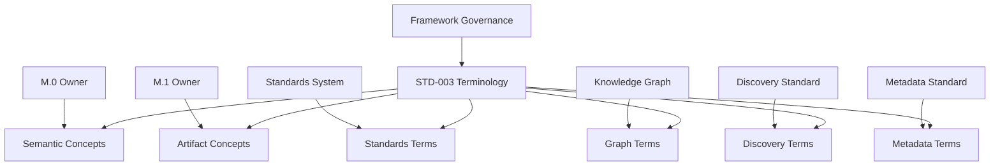

# STD-003 — Canonical Terminology Standard

## Document Metadata

| Field | Value |
|:---|:---|
| Identifier | `AI-DOS-STD-003` |
| Title | STD-003 — Canonical Terminology Standard |
| Version | 4.0.0-draft |
| Status | Draft |
| Canonical Status | Canonical terminology candidate for Phase 1 Meta Foundation; requires Meta Layer Consistency Review before promotion |
| Classification | Framework Standard |
| Document Type | Canonical Terminology Standard |
| Owner | Framework Governance |
| Maintainers | Framework Architecture Team |
| Review Authority | Enterprise Documentation Standards Board |
| Approval Authority | Human Governance / Framework Governance |
| Created | 2026-07-07 |
| Last Updated | 2026-07-08 |
| Lifecycle Phase | Draft |
| Traceability ID | AI-DOS.V4.PHASE-1.STD-003 |
| Scope | Canonical Framework terminology, naming, synonyms, and terminology consumption rules |
| Out of Scope | Runtime implementation, engine implementation, tooling, schemas, APIs, registries, project code, roadmap changes, and canonical promotion |
| Normative Authority | Human Governance; `AGENTS.md`; `docs/AI/Architecture/A.1-Constitution.md`; `docs/AI/Architecture/A.0-Framework-Audit.md`; `docs/Projects/ForgeAI/Planning/DevelopmentPhases.md`; `docs/Projects/ForgeAI/Planning/ProjectStatus.md` |
| Normative References | `docs/AI/Meta/M.0-Framework-Meta-Model.md`; `docs/AI/Meta/M.1-Artifact-Meta-Model.md`; `docs/AI/Architecture/Standards/STD-000-Framework-Standards.md`; `docs/AI/Architecture/Standards/STD-001-Knowledge-Graph-Standard.md`; `docs/AI/Architecture/Standards/STD-002-Discovery-Standard.md`; `docs/AI/Architecture/Standards/STD-010-Document-Metadata-Standard.md` |
| Dependencies | Constitutional authority, Framework semantic model, Artifact model, Standards governance, Knowledge Graph vocabulary, Discovery vocabulary, Document Metadata vocabulary |
| Consumes | A.0 audit findings; A.1 constitutional principles; M.0 semantic concepts; M.1 artifact concepts; STD-000, STD-001, STD-002, and STD-010 standards vocabulary |
| Produces | Canonical vocabulary, canonical naming rules, forbidden synonyms, terminology dependency matrix, AI consumption rules, and migration guidance |
| Related Specifications | A.3 Runtime Architecture RFC; A.4 Engine Architecture RFC; Engine Kernel, Contract, Registry, Lifecycle, Communication, State, and Capability RFCs |
| Supersedes | Draft glossary usage in this file only |
| Superseded By | None |
| Promotion Requirements | Meta Layer Consistency Review, terminology validation, standards alignment review, governance approval, and explicit promotion |
| Certification Status | Certification Pending |

---

## Revision History

| Version | Date | Author | Description |
|:---|:---|:---|:---|
| 4.0.0-draft | 2026-07-08 | Framework Architecture Team | Refactored into canonical terminology authority forAI-DOS Phase 1 Meta Foundation. |
| 3.x-draft | 2026-07-07 | Framework Architecture Team | Earlier terminology candidate and glossary-oriented vocabulary. |

---

## Table of Contents

1. [Status](#1-status)
2. [Purpose](#2-purpose)
3. [Terminology Philosophy](#3-terminology-philosophy)
4. [Relationship to M.0](#4-relationship-to-m0)
5. [Relationship to M.1](#5-relationship-to-m1)
6. [Canonical Vocabulary](#6-canonical-vocabulary)
7. [Canonical Definitions](#7-canonical-definitions)
8. [Canonical Naming Rules](#8-canonical-naming-rules)
9. [Reserved Terms](#9-reserved-terms)
10. [Forbidden Synonyms](#10-forbidden-synonyms)
11. [Relationship Vocabulary](#11-relationship-vocabulary)
12. [Authority Vocabulary](#12-authority-vocabulary)
13. [Lifecycle Vocabulary](#13-lifecycle-vocabulary)
14. [Runtime Vocabulary](#14-runtime-vocabulary)
15. [Engine Vocabulary](#15-engine-vocabulary)
16. [Knowledge Vocabulary](#16-knowledge-vocabulary)
17. [Artifact Vocabulary](#17-artifact-vocabulary)
18. [Validation Vocabulary](#18-validation-vocabulary)
19. [Review Vocabulary](#19-review-vocabulary)
20. [Certification Vocabulary](#20-certification-vocabulary)
21. [Registry Vocabulary](#21-registry-vocabulary)
22. [Planning Vocabulary](#22-planning-vocabulary)
23. [Operational Vocabulary](#23-operational-vocabulary)
24. [Legacy Vocabulary](#24-legacy-vocabulary)
25. [AI Consumption Rules](#25-ai-consumption-rules)
26. [Dependency Matrix](#26-dependency-matrix)
27. [Migration Notes](#27-migration-notes)
28. [Quality Gates](#28-quality-gates)
29. [Success Criteria](#29-success-criteria)
30. [Completion Checklist](#30-completion-checklist)

---

## 1. Status

STD-003 is theAI-DOS **Canonical Terminology Standard** for the active roadmap stage: Phase 1 — Meta Foundation, Stage STD-003 Terminology Standard. It establishes the single authoritative vocabulary layer that standards, runtime specifications, engine specifications, the operational layer, registries, knowledge graph projections, validation reports, review records, and future RFCs must consume.

STD-003 is architecture-only. It does not implement runtime behavior, engines, tooling, schemas, APIs, registries, migrations, or project code. It does not modify roadmap state and does not certify itself.

### 1.1 Canonical Position

```text
Human Governance
        │
        ▼
Constitution
        │
        ▼
M.0 Framework Semantic Model
        │
        ▼
M.1 Artifact Model
        │
        ▼
STD-003 Canonical Terminology
        │
 ┌──────┼────────────────────────────┐
 │      │                            │
 ▼      ▼                            ▼
Standards   Runtime / Engines   Operational Layer
```

### 1.2 Required Position Diagram



*Figure 1: STD-003 canonical position. Terminology consumes higher authority and is consumed by standards, runtime, engines, and operations.*

### 1.3 Status Rules

- Higher-authority documents may define constitutional or semantic concepts; STD-003 names them for consistent use.
- M.0 owns Framework semantic concepts.
- M.1 owns Artifact specialization concepts.
- STD-003 owns terminology, naming, aliases, and prohibited substitutions.
- Lower-authority documents shall not redefine canonical terminology.
- Conflicts discovered during downstream alignment shall be reported as findings, not silently resolved by local redefinition.

---

## 2. Purpose

The purpose of STD-003 is to makeAI-DOS terminology stable, governed, traceable, and reusable across every Framework layer.

STD-003 shall:

- provide one canonical name for each Framework term;
- provide one governed definition for each Framework term;
- identify each term owner and source;
- define allowed and prohibited usage;
- govern synonyms, aliases, deprecated terms, and ambiguous expressions;
- align standards, runtime, engine, knowledge, artifact, planning, operational, validation, review, certification, and registry vocabulary;
- prevent terminology drift during Phase 1 completion and future Engine RFC work.

STD-003 shall not define implementations, storage models, APIs, tools, runtime behavior, engine internals, or schemas. Implementation documents may consume terms from STD-003 but shall not redefine them.

---

## 3. Terminology Philosophy

AI-DOS uses terminology as architecture. A term is not merely prose; it is a governed label attached to one concept, one owner, one definition, and one allowed usage scope.

### 3.1 Principles

1. **One concept, one canonical term.** A Framework concept shall have exactly one canonical label.
2. **One canonical definition.** A term shall not carry competing definitions across documents.
3. **Definition before consumption.** Documents shall consume canonical terms after definition or reference.
4. **Source ownership is explicit.** Each term identifies the authority that owns the underlying concept.
5. **Terminology follows authority.** Lower layers may refine usage but shall not redefine meaning.
6. **Synonyms are controlled.** Synonyms support migration, search, and readability only.
7. **Platform independence is mandatory.** Core terms shall not depend on a language, product, database, editor, host, or implementation technology.
8. **AI consumption is bounded.** AI may classify and validate terminology but shall not invent canonical terms.

### 3.2 Terminology Hierarchy Diagram



*Figure 2: Terminology hierarchy. A canonical term packages definition, ownership, source, usage, and relationship controls.*

---

## 4. Relationship to M.0

M.0 is the canonical Framework Semantic Model. M.0 owns the conceptual meaning of Framework-level entities, identity, relationships, lifecycle, authority, ownership, state, evidence, validation, review, certification, and other semantic primitives.

STD-003 does not redefine M.0. STD-003 provides the canonical vocabulary used to refer to M.0 concepts consistently across the Framework.

### 4.1 M.0 Consumption Rules

- If M.0 defines a semantic concept, STD-003 shall preserve that concept's meaning.
- If STD-003 names an M.0 concept, the name shall remain stable unless governance approves a terminology change.
- Standards and RFCs shall cite or consume STD-003 terminology while preserving M.0 semantics.
- Terminology conflict with M.0 is a blocker requiring Meta Layer Consistency Review.

---

## 5. Relationship to M.1

M.1 is the canonical Artifact Meta Model. M.1 owns Artifact specialization concepts including Artifact, Artifact Family, Artifact Type, Artifact Instance, artifact identity, artifact lifecycle, artifact metadata, artifact relationships, and artifact governance.

STD-003 does not redefine M.1. STD-003 governs the canonical names and allowed usage for artifact-related terms so every standards, runtime, engine, and operational document uses artifact vocabulary consistently.

### 5.1 M.0 → M.1 → STD-003 Relationship Diagram



*Figure 3: M.0, M.1, and STD-003 relationship. Semantics and artifact modeling precede terminology consumption.*

---

## 6. Canonical Vocabulary

The following table is the canonical vocabulary registry for STD-003. Each row is the single canonical definition for the term in this standard.

| Term | Canonical Definition | Owner | Source | Allowed Usage | Prohibited Usage | Related Terms |
|:---|:---|:---|:---|:---|:---|:---|
| Artifact | A governed, addressable Framework object with identity, ownership, lifecycle, state, relationships, metadata, and evidence expectations. | Artifact Model | M.1 | Use for governed Framework objects and artifact-specialized records. | Do not use as a synonym for any file, blob, page, or ungoverned asset. | Artifact Family; Artifact Type; Artifact Instance; Document; Metadata |
| Artifact Family | A governed grouping of related Artifact Types that share purpose, authority, lifecycle expectations, or modeling rules. | Artifact Model | M.1 | Use to classify related artifact categories. | Do not use as an informal folder, package, or storage grouping. | Artifact; Artifact Type; Namespace |
| Artifact Type | A governed category within an Artifact Family that defines the expected structure, purpose, relationships, and lifecycle rules for Artifact Instances. | Artifact Model | M.1 | Use to name the class of artifact being produced or governed. | Do not use interchangeably with Artifact Instance or document title. | Artifact Family; Artifact Instance; Schema |
| Artifact Instance | A specific occurrence of an Artifact Type with concrete identity, metadata, lifecycle state, relationships, and evidence. | Artifact Model | M.1 | Use for one actual artifact record or document instance. | Do not use for an abstract artifact category. | Artifact Type; Identity; Metadata |
| Authority | The documented source or body permitted to govern, constrain, approve, override, or invalidate decisions within a defined scope. | Governance | A.1; STD-000; STD-010 | Use for real governance power. | Do not use for references, preferences, conventions, or background documents. | Governance; Ownership; Approval; Decision |
| Approval | A governed authorization by the responsible authority that permits promotion, adoption, continuation, or state transition. | Governance | A.1; STD-000 | Use for explicit governance authorization. | Do not use as a synonym for Review or Certification. | Authority; Review; Certification; Decision |
| Architecture | The documented structure, principles, authority boundaries, relationships, and constraints that govern Framework design before implementation. | Framework Governance | AGENTS.md; A.1 | Use for design authority and structural governance. | Do not use to describe implementation convenience or code behavior as source truth. | Framework; Standard; Governance |
| Capability | A governed unit of Framework or Engine ability with defined scope, authority, contract expectations, validation, and lifecycle implications. | Planning / Engine Platform | ProjectStatus; Engine Capability RFC | Use for approved ability increments or engine capabilities. | Do not use as a synonym for feature, wish, or ad hoc task. | Stage; Task; Engine Capability |
| Certification | Confirmation that required planning, execution, documentation, validation, review, and governance gates are satisfied for a lifecycle or state transition. | Certification System | A.1; STD-000 | Use for readiness to certify or actual governed completion. | Do not use as a synonym for approval, review, done, merge, or test pass. | Validation; Review; Approval; State |
| Command | A governed operational procedure that defines how approved work is executed. | Command System | AIOrchestrator; RC2 operational layer | Use for procedure-level execution instructions. | Do not use as a synonym for Workflow, prompt, script, or engine. | Workflow; Task; Execution |
| Context | The temporary working set assembled from authoritative sources for one bounded execution cycle. | Runtime | Runtime Architecture RFC | Use for scoped execution inputs. | Do not use as memory, knowledge, authority, or unbounded prompt content. | Runtime Context; Knowledge; Memory; State |
| Decision | A traceable governance or architecture determination made by an authorized source. | Governance | A.1; STD-000 | Use for approved determinations and decision records. | Do not use for recommendations, findings, preferences, or observations. | Authority; Approval; Finding; Recommendation |
| Dependency | A required upstream concept, artifact, standard, authority, or relationship that a downstream artifact must consume or satisfy. | Framework Standards | STD-000; STD-010 | Use for mandatory reliance. | Do not use for general references or related material. | Relationship; Traceability; Authority |
| Discovery | A governed architectural observation captured before becoming a finding, recommendation, evidence item, decision, or task. | Discovery Standard | STD-002 | Use for structured intake of observations. | Do not use as a synonym for Finding, Decision, Knowledge, or fact after validation. | Finding; Evidence; Recommendation |
| Document | An authored artifact or carrier that records Framework information in human-readable form and may contain one or more governed artifacts. | Documentation System | M.1; STD-010 | Use for authored documentation artifacts and carriers. | Do not use as a synonym for Artifact when artifact governance is the point. | Artifact; Metadata; Standard |
| Engine | A governed Framework subsystem that provides a bounded specialized capability through contracts while consuming runtime, standards, and authority. | Engine Platform | Engine Platform RFC | Use for engine architecture and capability providers. | Do not use as a synonym for Runtime, Workflow, Command, or tool implementation. | Runtime; Engine Contract; Engine Capability |
| Evidence | Verifiable support for validation, review, certification, findings, recommendations, decisions, or traceability claims. | Evidence / Validation System | M.0; STD-000 | Use for traceable support. | Do not use for unsupported assertions, opinions, or assumptions. | Validation; Review; Certification; Finding |
| Execution | The act of carrying out approved work through commands, workflows, runtime coordination, or assigned tasks. | Runtime / Operational Layer | AIOrchestrator | Use for task performance under governance. | Do not use as authority creation or certification. | Command; Workflow; Task; Runtime |
| Finding | A validated or reviewable conclusion derived from discoveries and evidence. | Discovery / Review System | STD-002 | Use for assessed conclusions. | Do not use for raw discovery, opinion, recommendation, or decision. | Discovery; Evidence; Recommendation |
| Framework | The platform-independentAI-DOS system of constitutional principles, governance, standards, meta models, runtime architecture, engines, operations, validation, and certification. | Framework Governance | AGENTS.md; A.1 | Use for the complete AI Development Operating System. | Do not use for a product-specific stack, adapter, or implementation framework. | Architecture; Governance; Platform |
| Governance | The authority, decision, ownership, approval, validation, review, certification, and change-control system that preserves Framework integrity. | Framework Governance | A.1; STD-000 | Use for rules controlling Framework evolution and compliance. | Do not use as a synonym for management preference or local process. | Authority; Approval; Decision |
| Identity | The stable identifier and naming contract that makes an entity, artifact, term, standard, or registry entry addressable and traceable. | Framework Meta Model | M.0; M.1 | Use for persistent addressability. | Do not reduce to filename, title, URL, or storage key alone. | Namespace; Registry; Traceability |
| Knowledge | Persistent documented information approved or available for Framework use and reusable across execution cycles. | Knowledge System | M.0; STD-001 | Use for durable Framework information. | Do not use as a synonym for Discovery, Memory, Context, or database content. | Knowledge Graph; Discovery; Memory |
| Legacy | Historical or superseded material preserved for traceability, migration, compatibility, or audit but not current authority unless explicitly promoted. | Governance / Migration | AGENTS.md; ProjectStatus | Use for non-current preserved materials. | Do not use to erase historical records or to imply obsolete content has no traceability value. | Migration; RC2; Archive |
| Lifecycle | The governed sequence of states and transitions through which an artifact, task, standard, decision, or process moves. | Governance / Artifact Model | M.0; M.1; STD-000 | Use for controlled state progression. | Do not use as an unordered status list. | State; Validation; Certification |
| Memory | Derived reusable learning from approved work that may inform future context but never overrides authoritative documentation. | Memory System | AIFramework; Runtime Architecture RFC | Use for reusable learning after governance boundaries are respected. | Do not use as authority, knowledge source, or source of truth. | Knowledge; Context; State |
| Metadata | Structured descriptive information about an artifact, document, standard, term, registry entry, or lifecycle object. | Document Metadata Standard | STD-010 | Use for fields that describe identity, ownership, status, authority, relationships, and lifecycle. | Do not use for arbitrary body content or hidden implementation state. | Identity; Document; Artifact |
| Namespace | A governed naming scope that prevents identity collision and clarifies ownership or classification. | Framework Meta Model / Registry | M.0; STD-010 | Use for scoped identity and naming domains. | Do not use as an implementation package or filesystem folder by default. | Identity; Registry; Artifact Family |
| Node | The graph representation of an entity, artifact, term, concept, decision, or other governed object. | Knowledge Graph | STD-001 | Use for graph objects. | Do not use as a synonym for document, database row, box, or generic record. | Relationship; Knowledge Graph; Registry |
| Ownership | The explicit accountable owner for a concept, artifact, subsystem, decision, standard, or term. | Governance | A.1; STD-000 | Use for accountability and responsibility boundaries. | Do not use for informal participation or ambiguous shared control where singular ownership is required. | Authority; Governance; Registry |
| Platform | A target environment, host, product, framework, language, or runtime ecosystem that can be adapted toAI-DOS without redefining the Framework. | Platform Adapter System | AGENTS.md; A.1 | Use for external implementation environments. | Do not make a platform the source of Framework truth. | Adapter; Framework; Runtime |
| Project | A governed application ofAI-DOS with its own status, planning state, artifacts, validation evidence, and implementation scope. | Project Governance | ProjectStatus | Use for concrete governed workspaces or implementations. | Do not use as a synonym for Framework. | State; Task; Capability |
| Recommendation | A proposed action or direction derived from findings, risks, evidence, or governance needs. | Discovery / Governance | STD-002 | Use for proposed next action before decision. | Do not use as a decision, approval, or requirement unless accepted by authority. | Finding; Decision; Approval |
| Registry | A governed index of identities, artifacts, terms, standards, engine capabilities, or graph objects that supports lookup and uniqueness without becoming authority by itself. | Registry System | Engine Registry RFC; STD-000 | Use for indexes and catalogs. | Do not use as database, source of truth, or governing authority. | Identity; Namespace; Node |
| Relationship | A governed connection between two entities, artifacts, terms, documents, standards, or graph nodes with explicit type and meaning. | Framework Meta Model / Knowledge Graph | M.0; STD-001; STD-010 | Use for typed and traceable connections. | Do not use for loose mention, untyped reference, or diagram arrow without semantics. | Dependency; Traceability; Node |
| Review | Independent readiness assessment of completed work, documents, evidence, or outputs before certification or state transition. | Review System | A.1; STD-000 | Use for assessment separate from execution. | Do not use as approval, certification, implementation, or self-attestation. | Validation; Certification; Evidence |
| Runtime | The operational layer that coordinates agents, workflows, commands, context intake, execution, and rule enforcement while consuming Framework authority. | Runtime Architecture | Runtime Architecture RFC | Use for execution coordination. | Do not use as a synonym for Engine, implementation, platform, or architecture authority. | Engine; Workflow; Command |
| Schema | A structured model defining fields, relationships, constraints, or projections for artifacts, documents, metadata, graph objects, or contracts. | Schema / Standards System | M.1; STD-010 | Use for structural definition and validation models. | Do not use only as database schema or implementation storage. | Metadata; Artifact Type; Validation |
| Stage | A roadmap subdivision within a Phase that groups approved architectural or delivery work before capabilities or tasks. | Planning System | DevelopmentPhases; ProjectStatus | Use for roadmap stage position. | Do not use as lifecycle state, task, or status. | Phase; Capability; Task |
| Standard | A governed normative document that defines rules, terminology, contracts, validation expectations, and certification criteria for a Framework concern. | Standards System | STD-000 | Use for normative Framework rules. | Do not use as informal guide, recommendation, or implementation note. | Governance; Validation; Certification |
| State | The current authoritative condition of a framework object, project, lifecycle, context, memory unit, or artifact at a point in time. | State Management | M.0; AIFramework | Use for recorded current condition. | Do not use as source of architecture or substitute for authority. | Lifecycle; Project; Context |
| Task | A bounded execution unit derived from approved planning and current project state. | Planning / Operational Layer | AIOrchestrator; ProjectStatus | Use for one scoped work item. | Do not use for arbitrary ideas, requests, features, or roadmap phases. | Capability; Command; Execution |
| Traceability | The ability to follow identities, relationships, evidence, decisions, dependencies, and lifecycle transitions across artifacts and Framework layers. | Governance / Knowledge Graph | M.0; STD-001; STD-010 | Use for auditable linkage. | Do not use for unverified links or informal references. | Evidence; Relationship; Dependency |
| Validation | Evidence-based verification that work, artifacts, standards, terminology, or outputs conform to approved expectations. | Validation System | A.1; STD-000 | Use for conformance checks before review. | Do not use as testing only, approval, review, or certification. | Evidence; Review; Certification |
| Workflow | A governed process category that routes work through planning, command selection, execution, validation, review, and certification. | Workflow System | AIOrchestrator; RC2 operational layer | Use for lifecycle movement and process routing. | Do not use as a synonym for Command, Engine, prompt, or ad hoc procedure. | Command; Task; Lifecycle |

---

## 7. Canonical Definitions

The vocabulary table in Section 6 is normative. A canonical definition is valid only when it includes term, definition, owner, source, allowed usage, prohibited usage, and related terms.

### 7.1 Definition Rules

- A canonical definition shall be concise enough for repeated consumption but complete enough to prevent redefinition.
- A canonical definition shall not encode implementation details.
- A canonical definition shall not introduce platform-specific assumptions.
- A canonical definition shall identify the owner of the underlying concept.
- A canonical definition shall align with M.0 for semantic concepts and M.1 for artifact concepts.
- A downstream document may add examples but shall not replace the definition.

### 7.2 Single Definition Rule

Each canonical term in Section 6 has exactly one definition. If a future document needs a different meaning, it shall either propose a new governed term through Framework Governance or revise the existing term through an approved terminology change.

---

## 8. Canonical Naming Rules

### 8.1 General Naming Rules

- Use the canonical term from Section 6 in headings, metadata, standards, schemas, registries, validation rules, review records, and certification records.
- Use Title Case for canonical term labels.
- Use lowercase prose form for generic references after the term has been introduced.
- Use singular noun forms unless a concept is inherently plural or collective.
- Do not create local aliases in downstream documents.
- Do not encode implementation technology in Framework terminology.
- Do not use a platform name as part of a core Framework term.

### 8.2 Required Naming Forms

| Canonical Form | Required Meaning | Prohibited Substitution |
|:---|:---|:---|
| Artifact Family | Governed group of Artifact Types. | File family; folder family; doc group |
| Artifact Type | Governed artifact category. | Template kind; doc type when artifact rules apply |
| Artifact Instance | Concrete occurrence of an Artifact Type. | File; page; record without artifact governance |
| Engine Contract | Governed interface expectations for an Engine. | API only; implementation contract only |
| Engine Capability | Bounded ability exposed or governed by an Engine. | Feature; module; plugin |
| Runtime Context | Context assembled for runtime execution. | Prompt; cache; scratchpad |
| Validation Result | Evidence-backed output of validation. | Test output only; approval |
| Review Record | Evidence-backed review assessment. | Approval note; status comment |
| Certification Record | Governed proof of certification decision. | Done marker; merge note |

---

## 9. Reserved Terms

Reserved terms are protected terms that shall not be repurposed in downstream documents.

| Reserved Term | Reserved For | Rule |
|:---|:---|:---|
| Framework |AI-DOS Framework as a platform-independent AI Development Operating System. | Shall not mean application framework or product stack. |
| Constitution | Highest Framework architectural principles below Human Governance and AGENTS.md. | Shall not mean local policy. |
| Meta Model | M.0 and M.1 conceptual modeling authority. | Shall not mean implementation model. |
| Artifact | Governed Framework object under M.1. | Shall not mean arbitrary file. |
| Runtime | Operational execution coordination layer. | Shall not mean Engine or platform runtime host. |
| Engine | Specialized governed capability subsystem. | Shall not mean workflow, command, plugin, or script. |
| Registry | Governed index. | Shall not mean source of truth or database authority. |
| Certification | Governed lifecycle/state readiness confirmation. | Shall not mean approval, done, or review. |
| Knowledge | Persistent documented Framework information. | Shall not mean memory, discovery, or context. |
| State | Current authoritative condition. | Shall not mean architecture authority. |

---

## 10. Forbidden Synonyms

Forbidden synonyms are prohibited where they obscure ownership, authority, lifecycle, or semantic meaning.

| Forbidden Expression | Canonical Term | Reason |
|:---|:---|:---|
| Runtime = Engine | Runtime; Engine | Runtime coordinates execution; Engine provides specialized governed capability. |
| Engine = Workflow | Engine; Workflow | Engines expose bounded capabilities; workflows route process movement. |
| Workflow = Command | Workflow; Command | Workflow selects process path; Command defines execution procedure. |
| Artifact = Document | Artifact; Document | Artifact is a governed object; document is an authored carrier or artifact class. |
| Knowledge = Discovery | Knowledge; Discovery | Knowledge is persistent information; discovery is governed observation intake. |
| Capability = Feature | Capability | Capability is governed scope; feature is product-language and ambiguous. |
| Registry = Database | Registry | Registry is a governed index; database is an implementation/storage mechanism. |
| Validation = Certification | Validation; Certification | Validation verifies conformance; certification confirms gates and transition readiness. |
| Review = Approval | Review; Approval | Review assesses readiness; approval authorizes. |
| Evidence = Assertion | Evidence | Evidence must be verifiable; assertion may be unsupported. |
| State = Authority | State; Authority | State records condition; authority governs meaning and decisions. |
| Memory = Knowledge | Memory; Knowledge | Memory is derived learning; knowledge is documented persistent information. |
| Context = Memory | Context; Memory | Context is temporary execution input; memory is reusable learning. |
| Document = Source of Truth | Document; Authority | A document may carry authority only when governance grants it. |
| Node = Record | Node | Node is graph representation; record is storage-neutral and ambiguous. |
| Relationship = Mention | Relationship | Relationship must be typed and meaningful; mention is ungoverned reference. |
| Recommendation = Decision | Recommendation; Decision | Recommendation proposes; decision determines. |
| Finding = Discovery | Finding; Discovery | Finding is assessed; discovery is observed. |
| Approval = Certification | Approval; Certification | Approval authorizes; certification confirms completion gates. |
| Platform = Framework | Platform; Framework | Platforms are adapters/targets; Framework remains independent. |

---

## 11. Relationship Vocabulary

Relationship vocabulary names how Framework objects connect.

| Relationship Term | Meaning | May Connect |
|:---|:---|:---|
| Defines | Source establishes canonical meaning or rules. | Standard to term; M.0 to concept; M.1 to artifact concept |
| Consumes | Downstream artifact uses upstream authority or input. | Standard to M.0; runtime to terminology |
| Depends On | Downstream artifact requires upstream artifact to be valid. | Engine RFC to Engine Platform RFC |
| Produces | Artifact creates an output for downstream consumption. | Standard to validation criteria |
| Refines | Artifact narrows a higher-level concept without redefining it. | M.1 to M.0; Engine RFC to Engine Platform |
| References | Artifact cites source for context without authority transfer. | Standard to RFC |
| Supersedes | Artifact replaces prior artifact through governance. | New standard to old standard |
| Related To | Non-authoritative association. | Supporting documents |
| Validated By | Object is checked by validation evidence. | Artifact to validation result |
| Certified By | Object is certified by authorized certification process. | Standard to certification record |

### 11.1 Terminology Dependency Graph



*Figure 4: Terminology dependency graph. STD-003 aligns input standards and provides vocabulary to downstream consumers.*

---

## 12. Authority Vocabulary

Authority vocabulary shall use the following terms precisely:

- **Human Governance**: the highest decision authority over AI-DOS.
- **Constitution**: the permanent Framework principles and invariants.
- **Normative Authority**: sources that govern, override, approve, constrain, or invalidate an artifact.
- **Approval Authority**: role or body authorized to approve or promote an artifact.
- **Review Authority**: role or body authorized to perform or accept review.
- **Owner**: accountable owner for a concept or artifact.
- **Maintainer**: party responsible for upkeep under the owner.
- **Decision**: traceable determination by an authorized source.

Authority shall not be inferred from authorship, proximity, recency, implementation, runtime behavior, registry presence, or AI output.

---

## 13. Lifecycle Vocabulary

Lifecycle vocabulary shall distinguish state from transition and evidence.

| Term | Meaning |
|:---|:---|
| Lifecycle | Governed sequence of states and transitions. |
| Lifecycle Phase | Current position within a defined lifecycle. |
| State | Current authoritative condition. |
| Transition | Governed movement from one state to another. |
| Draft | In-progress and not yet approved. |
| Review | Assessment stage before certification or approval. |
| Approved | Authorized for specified use by approval authority. |
| Certified | Confirmed as satisfying certification gates. |
| Deprecated | Still traceable but no longer preferred for new use. |
| Superseded | Replaced by another governed artifact. |
| Archived | Preserved for history and traceability. |

---

## 14. Runtime Vocabulary

Runtime vocabulary describes execution coordination only.

- **Runtime** coordinates execution while consuming Framework authority.
- **Runtime Kernel** is the minimal coordinating core responsible for controlled execution, context intake, workflow dispatch, and rule enforcement.
- **Runtime Context** is context assembled for one runtime execution cycle.
- **Context Package** is a bounded package of context inputs supplied to runtime or agents.
- **Agent** is a human-governed AI execution participant that consumes authority and performs scoped work.
- **Execution** is carrying out approved work.

Runtime shall not define Framework authority, certify itself, redefine terminology, or replace Engine responsibilities.

---

## 15. Engine Vocabulary

Engine vocabulary describes specialized governed capability subsystems.

- **Engine** is a governed subsystem with bounded capability and contracts.
- **Engine Kernel** is the internal coordination center defined by Engine Platform architecture.
- **Engine Contract** is the governed expectation boundary for interaction with an Engine.
- **Engine Capability** is a bounded ability governed or exposed by an Engine.
- **Engine Registry** is an index of engine identities, capabilities, contracts, or lifecycle records.
- **Engine Lifecycle** is the governed state model for engine specification and use.
- **Engine State** is the current condition of an Engine or engine artifact.

Engine documents consume STD-003. They shall not redefine Runtime, Workflow, Command, Registry, Lifecycle, or Capability.

---

## 16. Knowledge Vocabulary

Knowledge vocabulary governs durable information and graph representation.

- **Knowledge** is persistent documented information approved or available for Framework use.
- **Knowledge Graph** is the governed graph representation of Framework knowledge as nodes and typed relationships.
- **Node** is the graph representation of an entity, artifact, term, concept, decision, or governed object.
- **Relationship** is a typed connection with explicit meaning.
- **Discovery** is governed observation intake.
- **Finding** is an assessed conclusion derived from discovery and evidence.
- **Recommendation** is a proposed action derived from findings, risk, evidence, or governance needs.

Knowledge shall not be used as a synonym for memory, context, discovery, registry, database, or storage.

---

## 17. Artifact Vocabulary

Artifact vocabulary follows M.1.

- **Artifact** is the governed Framework object.
- **Artifact Family** groups related Artifact Types.
- **Artifact Type** defines the category and rules for Artifact Instances.
- **Artifact Instance** is a concrete occurrence of an Artifact Type.
- **Document** is an authored carrier or artifact that records information.
- **Metadata** is structured descriptive information about artifacts and documents.
- **Schema** defines fields, constraints, relationships, or projections.

Artifact vocabulary shall preserve artifact identity, ownership, lifecycle, metadata, relationship, evidence, validation, review, and certification expectations.

---

## 18. Validation Vocabulary

Validation vocabulary is evidence-based.

| Term | Meaning |
|:---|:---|
| Validation | Evidence-based verification against approved expectations. |
| Validation Rule | Defined conformance requirement. |
| Validation Procedure | Steps used to perform validation. |
| Validation Result | Evidence-backed outcome of validation. |
| Evidence | Verifiable support for a validation claim. |
| Nonconformance | Validated failure to satisfy a rule. |
| Blocker | A condition preventing safe completion or transition. |

Validation shall not mean testing only, approval, review, certification, or implementation.

---

## 19. Review Vocabulary

Review vocabulary separates independent assessment from execution.

- **Review** is independent readiness assessment.
- **Review Record** documents reviewer, scope, evidence considered, findings, recommendations, and outcome.
- **Reviewer** is the authorized person, role, group, or governance mechanism performing review.
- **Review Finding** is a conclusion made during review.
- **Review Recommendation** is proposed action from review findings.

Review shall not implement new functionality, self-certify work, or authorize state transition unless the reviewer also holds separate approval authority.

---

## 20. Certification Vocabulary

Certification vocabulary governs completion readiness.

- **Certification** confirms that planning, execution, documentation, validation, review, and governance gates are satisfied.
- **Certification Criteria** are required conditions for certification.
- **Certification Record** is the traceable artifact documenting certification outcome.
- **Certification Status** states certification posture such as Not Certified, Pending, Certified, Failed, or Deferred.
- **Certified Artifact** is an artifact that has passed required certification gates.

Certification shall not be replaced by approval, review, validation, done, merge, or test pass.

---

## 21. Registry Vocabulary

Registry vocabulary shall preserve authority boundaries.

- **Registry** is a governed index.
- **Registry Entry** is one indexed identity record.
- **Registry Identifier** is the stable identity key used in the registry.
- **Registry Projection** is a derived representation of registry information for another consumer.
- **Registry Authority** is the authority governing registry rules, not the registry data store.

A registry may help locate authority but does not become authority unless a higher-authority document explicitly grants that role.

---

## 22. Planning Vocabulary

Planning vocabulary follows theAI-DOS planning hierarchy.

```text
Framework
    ↓
Phase
    ↓
Stage
    ↓
Capability
    ↓
Task
```

| Term | Meaning |
|:---|:---|
| Phase | Major roadmap segment. |
| Stage | Roadmap subdivision within a Phase. |
| Capability | Governed ability or approved delivery increment. |
| Task | Bounded execution unit derived from planning and state. |
| Current Task | Active task recorded by project status or assigned by governance. |
| Next Queue | Ordered future work list that shall not be skipped. |
| Frozen Area | Work intentionally unavailable until activated by roadmap governance. |

Planning terminology shall not be used to advance roadmap state without explicit governance.

---

## 23. Operational Vocabulary

Operational vocabulary governs execution procedures and reporting.

- **Command** defines how approved work is executed.
- **Workflow** routes work through lifecycle movement.
- **Execution** performs approved work.
- **Completion Report** reports what changed, evidence, validation, risks, and next steps.
- **Quality Gate** is a required validation or check.
- **Output** is a produced artifact, report, change, or evidence item.
- **Blocker** is a condition that prevents safe continuation.

Operational terminology shall consume architecture and shall not create architecture.

---

## 24. Legacy Vocabulary

Legacy vocabulary preserves history without granting current authority.

| Term | Meaning | Rule |
|:---|:---|:---|
| Legacy | Historical or superseded material retained for traceability. | Do not delete or relocate unless roadmap activates migration. |
| RC2 | Prior operational compatibility layer. | Remains valid until approved v3 replacements exist. |
| Migration | Governed movement from legacy to current architecture. | Shall preserve traceability and certified records. |
| Deprecated Term | Term no longer preferred for new use. | Must map to canonical term where possible. |
| Alias | Controlled alternate label. | Must point to exactly one canonical term. |

Legacy terms may be quoted or mapped, but shall not become new canonical terminology without governance approval.

---

## 25. AI Consumption Rules

AI systems may:

- interpret terminology using STD-003;
- classify terms and term usage;
- recommend canonical term usage;
- validate terminology usage against this standard;
- identify inconsistent terminology;
- report conflicts as findings;
- propose new terms through governance channels.

AI systems shall never:

- redefine canonical terms;
- invent competing terminology;
- override Constitution terminology;
- override M.0 semantic definitions;
- override M.1 artifact definitions;
- create unofficial aliases;
- treat registries, implementation, runtime behavior, or memory as terminology authority;
- use terminology to bypass validation, review, certification, or project state rules.

### 25.1 Terminology Consumers Diagram



*Figure 5: Terminology consumers. Downstream layers consume STD-003 vocabulary and do not redefine terms.*

### 25.2 Terminology Governance Diagram



*Figure 6: Terminology governance. Canonical terminology changes flow through owner review, alignment, governance, validation, and certification.*

### 25.3 Terminology Ownership Diagram



*Figure 7: Terminology ownership. Domain owners own concepts; STD-003 owns canonical naming and usage governance.*

---

## 26. Dependency Matrix

| Consumer / Source | Consumes STD-003? | Defines Terms? | Redefinition Allowed? | Notes |
|:---|:---:|:---:|:---:|:---|
| Human Governance | No | May govern | Yes, by direct authority | Highest authority. |
| AGENTS.md | No | May govern bootstrap terminology | Yes, by direct amendment | Bootstrap authority. |
| Constitution | Supplies principles | May define constitutional concepts | Yes, through amendment | STD-003 preserves constitutional meaning. |
| A.0 Framework Audit | Supplies findings | No new canonical terms | No | Audit evidence informs terminology. |
| M.0 Framework Meta Model | Supplies semantic concepts | Yes, semantic concepts | Yes, as M.0 authority | STD-003 names M.0 concepts. |
| M.1 Artifact Meta Model | Supplies artifact concepts | Yes, artifact concepts | Yes, as M.1 authority | STD-003 names M.1 concepts. |
| STD-000 Framework Standards | Consumes and contributes standards terms | Standards domain only | No conflicting redefinition | Standards governance alignment required. |
| STD-001 Knowledge Graph | Consumes and contributes graph terms | Graph domain only | No conflicting redefinition | Node and relationship usage must align. |
| STD-002 Discovery | Consumes and contributes discovery terms | Discovery domain only | No conflicting redefinition | Discovery, finding, recommendation align here. |
| STD-010 Metadata | Consumes and contributes metadata terms | Metadata domain only | No conflicting redefinition | Metadata and relationship taxonomy align here. |
| Runtime RFCs | Yes | Runtime-specific refinements | No | Runtime consumes terminology. |
| Engine RFCs | Yes | Engine-specific refinements | No | Engine documents consume terminology. |
| Operational Layer | Yes | Procedure names only | No | Commands and workflows consume terms. |
| AI Agents | Yes | Proposals only | No | AI may recommend but not canonize. |

---

## 27. Migration Notes

- Existing documents are not automatically rewritten by STD-003.
- Future alignment shall update terminology in dependency order: authority, meta models, standards, runtime, engines, operational layer, validation, review, certification, registries, adapters, and legacy migration.
- RC2 terminology remains readable during transition and shall be mapped, not erased.
- Deprecated terms shall point to canonical terms.
- Historical capability identifiers shall not be renamed.
- Legacy and RC2 materials shall not be moved before the roadmap activates Phase 12.
- Context Engine and Knowledge Engine RFC work shall not begin until Phase 1 exit criteria and Meta Layer Consistency Review are complete.

---

## 28. Quality Gates

STD-003 quality gates are documentation and architecture validation gates:

1. `git diff --check` passes.
2. Only `docs/AI/Architecture/Standards/STD-003-Terminology-Standard.md` changes.
3. `docs/Projects/ForgeAI/Planning/ProjectStatus.md` remains unchanged.
4. `docs/Projects/ForgeAI/Planning/DevelopmentPhases.md` remains unchanged.
5. No Runtime, Engine, Meta, Legacy, or project code documents are modified.
6. Required chapters exist.
7. Required Mermaid diagrams exist.
8. Every required canonical term has exactly one definition row in Section 6.
9. Terminology aligns with M.0 and M.1.
10. Forbidden synonyms are explicit.
11. AI consumption rules are explicit.
12. The document remains architecture-only.

---

## 29. Success Criteria

STD-003 succeeds when:

- it is the single canonical terminology authority forAI-DOS vocabulary;
- every required Framework term has one governed definition;
- definitions identify owner, source, allowed usage, prohibited usage, and related terms;
- synonyms and ambiguous terms are governed;
- M.0 semantics, M.1 artifacts, and STD-003 terminology form a coherent Meta Foundation;
- standards, runtime, engines, operational layer, validation, review, certification, registries, and AI agents have clear consumption rules;
- the standard is ready for Meta Layer Consistency Review.

---

## 30. Completion Checklist

| Requirement | Status |
|:---|:---|
| Status chapter present | Complete |
| Purpose chapter present | Complete |
| Terminology Philosophy present | Complete |
| Relationship to M.0 present | Complete |
| Relationship to M.1 present | Complete |
| Canonical Vocabulary present | Complete |
| Canonical Definitions present | Complete |
| Canonical Naming Rules present | Complete |
| Reserved Terms present | Complete |
| Forbidden Synonyms present | Complete |
| Relationship Vocabulary present | Complete |
| Authority Vocabulary present | Complete |
| Lifecycle Vocabulary present | Complete |
| Runtime Vocabulary present | Complete |
| Engine Vocabulary present | Complete |
| Knowledge Vocabulary present | Complete |
| Artifact Vocabulary present | Complete |
| Validation Vocabulary present | Complete |
| Review Vocabulary present | Complete |
| Certification Vocabulary present | Complete |
| Registry Vocabulary present | Complete |
| Planning Vocabulary present | Complete |
| Operational Vocabulary present | Complete |
| Legacy Vocabulary present | Complete |
| AI Consumption Rules present | Complete |
| Dependency Matrix present | Complete |
| Migration Notes present | Complete |
| Quality Gates present | Complete |
| Success Criteria present | Complete |
| Completion Checklist present | Complete |
| Terminology hierarchy diagram present | Complete |
| Terminology dependency graph present | Complete |
| M.0 → M.1 → STD-003 diagram present | Complete |
| Terminology ownership diagram present | Complete |
| Terminology consumers diagram present | Complete |
| Terminology governance diagram present | Complete |
| Runtime, engine, tooling, schema, API, registry, or project code implementation introduced | Not Applicable |
