#AI-DOS Governance Atlas v2

---

## Document Metadata

| Field | Value |
| --- | --- |
| Identifier | AI-DOS-GOVERNANCE-ATLAS |
| Title |AI-DOS Governance Atlas v2 |
| Version | 4.0.0-draft |
| Status | Draft |
| Canonical Status | Non-canonical until reviewed and approved |
| Classification | Governance Atlas |
| Document Type | Governance Index / Governance Atlas |
| Owner | Framework Governance |
| Maintainers | Framework Architecture Team |
| Review Authority | Human Governance / Framework Governance |
| Approval Authority | Human Governance |
| Lifecycle Phase | Draft |
| Scope | Repository governance navigation, authority mapping, ownership mapping, dependency mapping, document taxonomy, AI consumption guidance, review and promotion guidance. |
| Out of Scope | Constitutional redefinition, ProjectStatus replacement, roadmap replacement, standards creation, Runtime RFC creation, Engine RFC creation, AGENTS v1 activation, operational-layer refactor, legacy migration, implementation planning. |
| Normative Authority | `AGENTS.md`; Human Governance; approved Framework Governance decisions. |
| Normative References | `docs/AI/Architecture/A.1-Constitution.md`; `docs/AI/Meta/M.0-Framework-Meta-Model.md`; `docs/AI/Meta/M.1-Artifact-Meta-Model.md`; `docs/AI/Architecture/Standards/STD-000-Framework-Standards.md`; `docs/AI/Architecture/Standards/STD-003-Terminology-Standard.md`; `docs/AI/Architecture/Standards/STD-010-Document-Metadata-Standard.md`. |
| Dependencies | `AGENTS.md`; the ProjectStatus and DevelopmentPhases declared by the active Target Repository; A.0; A.1; M.0; M.1; STD-000; STD-001; STD-002; STD-003; STD-010; A.3; A.4 through A.4.7; AGENTS-v1 draft; RC2 operational-layer documents. |
| Consumes | Authority, lifecycle, taxonomy, terminology, metadata, runtime, engine, agent, and operational-layer documents. |
| Produces | Governance atlas, repository navigation index, authority matrix, ownership matrix, classification matrix, AI consumption guide, governance quality checklist. |
| Related Specifications | GovernanceModel, AIFramework, AIOrchestrator, AgentSystemPrompt, Framework Governance, ProjectStatus, Development Phases. |
| Promotion Requirements | Human Governance review; Framework Governance review; validation of required sections, matrices, diagrams, and frozen-area constraints; explicit approval before canonical use. |
| Certification Status | Not certified; review-ready draft after validation. |

---

## 1. Executive Summary

TheAI-DOS Governance Atlas v2 is the central navigation and governance map for theAI-DOS repository. It explains how authority is discovered, how documents consume each other, which document owns which domain, and which activities require human approval.

This atlas is a map, not a replacement authority. It does not supersede `AGENTS.md`, the Constitution, M.0, M.1, standards, runtime RFCs, engine RFCs, agent architecture, operational-layer files, ProjectStatus, or the roadmap. It classifies those documents and explains safe consumption paths for humans and AI agents.

Core conclusions:

- Human Governance is final.
- The AI-DOS Provider root `AGENTS.md` is the Provider entry that starts Framework boot and routes to TargetRepositoryResolution; the Target Repository root `AGENTS.md` is the Target Project declaration contract.
- TargetRepositoryResolution owns Target Repository identification, Target AGENTS discovery, project-resource resolution, declaration validation, blocker reporting, Resolution Result production, and BootSequence handoff.
- BootSequence owns loading the resolved Framework + Target Project context from the Resolution Result.
- The ProjectStatus loaded from the resolved Target Repository (`<PROJECT_STATUS_PATH>`) is operational state, not architecture. ForAI-DOS self-hosting only, `<PROJECT_STATUS_PATH>` resolves to `docs/Projects/ForgeAI/Planning/ProjectStatus.md`.
- The DevelopmentPhases loaded from the resolved Target Repository (`<DEVELOPMENT_PHASES_PATH>`) is strategic roadmap, not live status. ForAI-DOS self-hosting only, `<DEVELOPMENT_PHASES_PATH>` resolves to `docs/Projects/ForgeAI/Planning/DevelopmentPhases.md`.
- Lower layers consume higher layers and shall never redefine them.
- AI may propose, classify, validate, and recommend.
- AI shall never approve, certify, promote, or override Human Governance.

---

## 2. Purpose

This document exists to answer governance navigation questions:

- What governs the repository?
- Which document owns each authority domain?
- Which documents are strategic, operational, semantic, standard, runtime, engine, agent, frozen, or legacy?
- What is the correct reading order?
- Which document may redefine what?
- Which documents only consume higher authority?
- How do review, validation, certification, promotion, and ProjectStatus updates work?
- What is frozen?
- What must AI agents never do?

---

## 3. Scope

In scope:

- governance navigation;
- authority mapping;
- ownership mapping;
- dependency mapping;
- decision routing;
- document taxonomy;
- AI consumption guidance;
- frozen-area boundaries;
- review, validation, certification, and promotion guidance.

---

## 4. Non-Goals

This atlas is not:

- the Constitution;
- a replacement for ProjectStatus;
- a roadmap;
- a standard;
- a Runtime RFC;
- an Engine RFC;
- AGENTS v1;
- an implementation plan;
- a migration plan;
- permission to begin frozen phases.

---

## 5. Governance Philosophy

AI-DOS governance is documentation-first and authority-driven. Architecture precedes implementation, governance precedes execution, validation precedes review, review precedes certification, and certification precedes project-state update.

Governance favors explicit ownership over implicit convention. A lower document may refine a higher document only within its assigned scope. A lower document may not redefine, bypass, or silently contradict higher authority.

---

## 6. Governance Principles

1. Human Governance is final.
2. `AGENTS.md` is the repository bootloader.
3. Authority flows downward.
4. Execution consumes planning.
5. ProjectStatus records current operational state but does not define architecture.
6. The roadmap defines strategic sequence but does not replace live state.
7. Standards govern cross-document consistency.
8. Runtime consumes meta and standards.
9. Engines specialize runtime and engine-platform rules.
10. AI agents may draft and validate, but may not approve, promote, or certify.

---

## 7. Governance Layers / Governance Layer Matrix

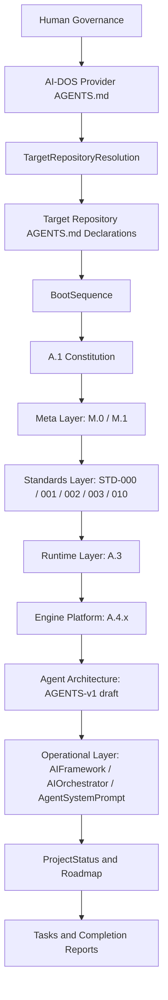

| Layer | Primary Function | May Redefine | Must Consume |
| --- | --- | --- | --- |
| Human Governance | Final approval | Any governance decision within project constraints | Evidence and recommendations |
| Provider entry | Start AI-DOS Framework boot and route to TargetRepositoryResolution | Provider entry routing by explicit amendment | Human authority |
| Target Repository resolution | Identify Target Repository, read Target AGENTS declarations, resolve resources, validate, block, and hand off | Resolution procedure by System Layer governance only | Provider entry and Target declarations |
| Resolved-context loading | Load resolved Framework + Target Project context | Boot loading procedure by System Layer governance only | TargetRepositoryResolution result |
| Constitution | Constitutional principles | Constitutional principles within approval process | Bootloader |
| Meta | Semantic and artifact models | Its owned model only | Constitution |
| Standards | Cross-document rules | Owned standard domain only | Constitution and meta |
| Runtime | Runtime architecture | Runtime concepts only | Constitution, meta, standards |
| Engine | Engine platform specialization | Engine concepts only | Runtime and standards |
| Agent | Agent architecture | Single-agent architecture only | Meta, standards, runtime, engine |
| Operational | Execution procedure | Operational procedures only when unfrozen | Higher layers |
| State/Roadmap | Live status and strategic sequence | State/roadmap facts only | Higher authority |

---

## 8. Repository Governance

Repository governance begins with the AI-DOS Provider root `AGENTS.md`, which starts Framework boot and routes to TargetRepositoryResolution. Target Repository project declarations live in the Target Repository root `AGENTS.md`. TargetRepositoryResolution, not the Governance Atlas, identifies the Target Repository, reads declarations, resolves project resources, validates declarations, reports blockers, produces the Resolution Result, and hands off to BootSequence. BootSequence loads the resolved context. This atlas governs navigation after those boundaries are respected.

Repository governance separates:

- authority documents;
- live operational state;
- roadmap documents;
- standards;
- runtime and engine RFCs;
- operational-layer compatibility documents;
- frozen and legacy areas.

---

## 9. Constitutional Governance

A.1 owns constitutional principles for the v3/v4 architecture track when promoted through governance. It must not be silently replaced by this atlas. Constitutional governance defines permanent principles, invariants, and boundaries that lower documents consume.

A constitutional conflict is never resolved by implementation convenience. It escalates to Human Governance.

---

## 10. Project Governance

Project governance is split between strategic roadmap and live status:

- The DevelopmentPhases loaded from the resolved Target Repository (`<DEVELOPMENT_PHASES_PATH>`) is the strategic roadmap.
- The ProjectStatus loaded from the resolved Target Repository (`<PROJECT_STATUS_PATH>`) is the live operational status.
- ForAI-DOS self-hosting only, these resolve to `docs/Projects/ForgeAI/Planning/DevelopmentPhases.md` and `docs/Projects/ForgeAI/Planning/ProjectStatus.md`.

ProjectStatus is not architecture and may not promote documents, redefine semantics, or supersede standards. It records current phase, completed items, next queue, frozen areas, status-update policy, decision log, and success indicators.

---

## 11. Meta Governance

M.0 owns the framework semantic model. M.1 owns the artifact model. These documents define the vocabulary of framework entities and artifact specialization boundaries consumed by standards, runtime, engines, agents, and operational-layer alignment.

Lower documents shall not create competing root semantics, artifact families, terminology, or metadata rules.

---

## 12. Standards Governance

STD-000 owns standards governance. STD-001 owns knowledge graph semantics. STD-002 owns Discovery. STD-003 owns terminology. STD-010 owns document metadata.

Standards govern consistency across the repository. They do not implement runtime behavior unless a runtime or engine document explicitly consumes and specializes them.

---

## 13. Runtime Governance

A.3 owns Runtime Architecture. It defines runtime concepts and lifecycle boundaries at the runtime layer. Runtime governance consumes the Constitution, M.0, M.1, STD-003, STD-010, and related standards.

Runtime documents must not redefine meta models or standards. They translate approved models into runtime architecture.

---

## 14. Engine Governance

A.4 owns Engine Architecture. A.4.1 through A.4.7 own engine kernel, contract, registry, lifecycle, communication, state, and capability respectively.

Engine RFCs specialize the approved Runtime Architecture and Engine Platform. Individual engine RFCs must consume M.0, M.1, STD-003, STD-010, A.3, and A.4.x without redefining them.

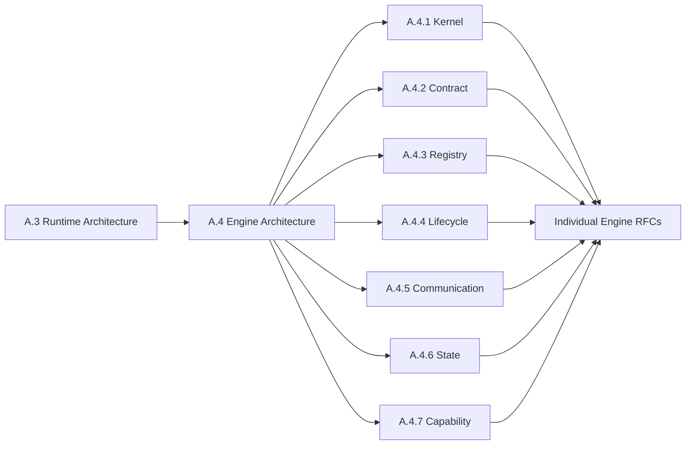

---

## 15. Agent Governance

`docs/AI/Architecture/Agents/AGENTS-v1-draft.md` owns single-agent architecture as a draft agent architecture document. It does not activate multi-agent runtime, swarm runtime, or operational-layer refactor by itself.

Agent governance consumes the Constitution, meta layer, standards, runtime, and engine platform. Agent documents must not redefine those layers.

---

## 16. Operational Layer Governance

`docs/AI/AIFramework.md`, `docs/AI/AIOrchestrator.md`, and `docs/AI/AgentSystemPrompt.md` are operational-layer documents and are currently frozen unless explicitly activated. They remain classification and compatibility references. This atlas references them only and does not refactor them.

Operational-layer governance defines execution procedure, orchestration, tool-facing rules, command selection, validation sequencing, review sequencing, and completion reporting only after activation or within existing RC2 compatibility boundaries.

---

## 17. Legacy Governance

Legacy and RC2 content remains valid where explicitly preserved, but it is bounded. Legacy material may be read for context and compatibility. It must not be moved, migrated, copied, or promoted during frozen periods.

Legacy governance prevents accidental architecture regression and protects the repository from undocumented migration.

---

## 18. Authority Hierarchy

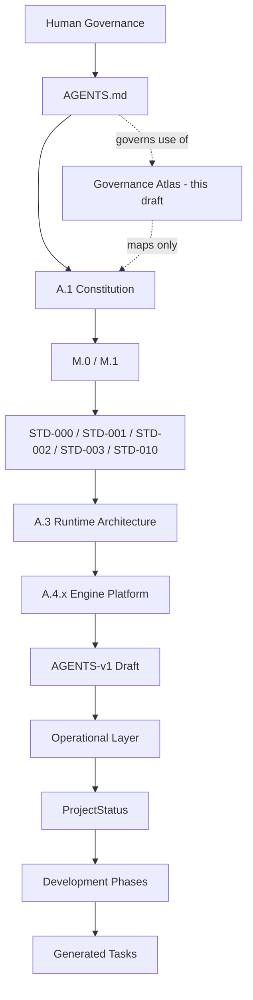

This atlas is intentionally shown as a mapping artifact rather than as a replacement authority.

---

## 19. Authority Resolution Rules

1. Human Governance wins over all automated or draft outputs.
2. `AGENTS.md` wins over repository documents unless explicitly amended by Human Governance.
3. A higher layer wins over a lower layer.
4. A document owns only its declared authority domain.
5. A lower layer may consume and specialize but may not redefine a higher layer.
6. If ProjectStatus conflicts with architecture, architecture wins and ProjectStatus requires review.
7. If roadmap conflicts with ProjectStatus, ProjectStatus reflects current operation and roadmap requires governance review.
8. If an AI detects conflict, it must stop, report, and recommend escalation.

---

## 20. Document Authority Matrix

| Document | Authority Domain | Authority Type | May Redefine | May Not Redefine |
| --- | --- | --- | --- | --- |
| AI-DOS Provider root `AGENTS.md` | AI-DOS Provider entry | Provider entry authority | Start Framework boot and route to TargetRepositoryResolution | Target declaration validation, project path resolution, BootSequence handoff result |
| Target Repository root `AGENTS.md` | Target Project declarations | Declaration authority | Declare project resources, authority order, validation context, protection context, and AI-DOS Provider reference | Active Target Repository identification, path resolution, validation, blocker status |
| TargetRepositoryResolution | Target Repository resolution | System Layer resolution authority | Identify Target Repository, discover Target AGENTS, resolve resources, validate, block, produce Resolution Result, hand off to BootSequence | Loaded context execution |
| BootSequence | Resolved-context loading | System Layer boot authority | Load resolved Framework + Target Project context from the Resolution Result | Target discovery, declaration validation, operational execution |
| Active Target Repository ProjectStatus (`<PROJECT_STATUS_PATH>`) | Live operational state | State authority | Current status facts | Architecture, standards, promotion |
| Active Target Repository DevelopmentPhases (`<DEVELOPMENT_PHASES_PATH>`) | Strategic roadmap | Planning authority | Roadmap sequence by approval | Live status, architecture |
| A.0 Framework Audit | Audit findings | Evidence / assessment | Nothing normative by itself | Constitution, meta, standards |
| A.1 Constitution | Constitutional principles | Constitutional authority | Constitutional principles by approval | Human Governance |
| M.0 | Framework semantic model | Semantic authority | Framework semantic model | Constitution, metadata, runtime |
| M.1 | Artifact model | Artifact authority | Artifact taxonomy/model | M.0 root semantics, metadata |
| STD-000 | Standards governance | Standards authority | Standards process | Constitution, meta |
| STD-001 | Knowledge graph semantics | Standard authority | Knowledge graph rules | M.0 semantics, STD-003 terms |
| STD-002 | Discovery | Standard authority | Discovery rules | M.0 semantics, STD-010 metadata |
| STD-003 | Terminology | Terminology authority | Canonical terms | Constitution |
| STD-010 | Document metadata | Metadata authority | Metadata schema and rules | Constitution, M.0 semantics |
| A.3 | Runtime Architecture | Runtime authority | Runtime architecture | Meta and standards |
| A.4 | Engine Architecture | Engine authority | Engine platform architecture | Runtime, meta, standards |
| A.4.1 | Engine Kernel | Engine component authority | Kernel rules | A.4 platform |
| A.4.2 | Engine Contract | Engine component authority | Contract rules | A.4 platform |
| A.4.3 | Engine Registry | Engine component authority | Registry rules | A.4 platform |
| A.4.4 | Engine Lifecycle | Engine component authority | Lifecycle rules | A.4 platform |
| A.4.5 | Engine Communication | Engine component authority | Communication rules | A.4 platform |
| A.4.6 | Engine State | Engine component authority | Engine state rules | ProjectStatus, A.4 platform |
| A.4.7 | Engine Capability | Engine component authority | Engine capability rules | Planning hierarchy |
| AGENTS-v1 draft | Single-agent architecture | Draft agent authority | Agent architecture after approval | Runtime and engine platform |
| AIFramework | RC2 operational master index | Frozen operational authority | Nothing while frozen | v3/v4 architecture |
| AIOrchestrator | Operational orchestration | Frozen operational authority | Nothing while frozen | Architecture and roadmap |
| AgentSystemPrompt | Tool-facing agent rules | Frozen operational authority | Nothing while frozen | Architecture and governance |

---

## 21. Ownership Matrix / Document Ownership Matrix

| Domain | Owner | Primary Documents | Consumers |
| --- | --- | --- | --- |
| Human approval | Human Governance | Governance decisions | All layers |
| AI-DOS Provider entry | AI-DOS Provider root `AGENTS.md` | `<AI_DOS_ROOT>/AGENTS.md` | TargetRepositoryResolution |
| Target Project declarations | Target Repository root `AGENTS.md` | `<TARGET_REPOSITORY_ROOT>/AGENTS.md` | TargetRepositoryResolution |
| Target Repository resolution | TargetRepositoryResolution | `docs/AI/System/TargetRepositoryResolution.md` | BootSequence |
| Resolved-context loading | BootSequence | `docs/AI/System/BootSequence.md` | Operational Core |
| Governance navigation | Governance Atlas | `docs/AI/GOVERNANCE.md` | All agents and automation |
| Constitution | Framework Constitution | A.1 | Meta, standards, runtime, engines |
| Semantic model | Meta Governance | M.0 | M.1, standards, runtime |
| Artifact model | Meta Governance | M.1 | Standards, runtime, engines |
| Terminology | Standards Governance | STD-003 | All documents |
| Metadata | Standards Governance | STD-010 | All documents |
| Knowledge graph | Standards Governance | STD-001 | Runtime, discovery, engines |
| Discovery | Standards Governance | STD-002 | Runtime and engines |
| Runtime | Runtime Architecture | A.3 | Engine platform, agents |
| Engine platform | Engine Architecture | A.4.x | Individual engine RFCs |
| Agent architecture | Agent Architecture | AGENTS-v1 draft | Operational layer when activated |
| Live state | Project Governance | ProjectStatus | Orchestration and task planning |
| Roadmap | Project Governance | Development Phases | ProjectStatus and planning |
| Operational compatibility | Operational Layer | AIFramework, AIOrchestrator, AgentSystemPrompt | AI tools while frozen |

---

## 22. Consumes / Produces Matrix

| Document / Layer | Consumes | Produces |
| --- | --- | --- |
| AI-DOS Provider root `AGENTS.md` | Human authority | Provider entry routing to TargetRepositoryResolution |
| Target Repository root `AGENTS.md` | Target Project governance | Project resource declarations and provider reference |
| TargetRepositoryResolution | Provider entry and Target declarations | Resolution Result and BootSequence handoff |
| BootSequence | TargetRepositoryResolution result | Loaded Framework + Target Project context |
| ProjectStatus | Roadmap, completed evidence, governance decisions | Live operational status |
| Development Phases | Strategic planning decisions | Phase sequence |
| A.0 | Existing repository state | Audit findings |
| A.1 | AGENTS.md, governance principles | Constitutional model |
| M.0 | Constitution | Framework semantic model |
| M.1 | Constitution, M.0 | Artifact model |
| STD-000 | Constitution, M.0, M.1 | Standards governance rules |
| STD-001 | M.0, M.1, STD-003 | Knowledge graph standard |
| STD-002 | M.0, STD-003, STD-010 | Discovery standard |
| STD-003 | Constitution, M.0 | Canonical terminology |
| STD-010 | Constitution, M.0, M.1 | Metadata standard |
| A.3 | Constitution, meta, standards | Runtime architecture |
| A.4.x | A.3, meta, standards | Engine platform |
| AGENTS-v1 | Meta, standards, runtime, engine | Agent architecture draft |
| Operational Layer | Loaded Framework + Target Project context, AIFramework, ProjectStatus | Execution procedures |
| Governance Atlas | All listed inputs | Navigation and governance map |

---

## 23. Dependency Matrix

| Consumer | Required Dependencies | Dependency Rule |
| --- | --- | --- |
| Standards | A.1, M.0, M.1 | Standards preserve meta and constitutional scope. |
| Runtime | A.1, M.0, M.1, STD-003, STD-010 | Runtime uses approved terminology and metadata. |
| Engine Platform | Runtime, meta, standards | Engines specialize runtime only. |
| Individual Engines | A.3, A.4.x, M.0, M.1, STD-003, STD-010 | Engine RFCs shall not create competing roots. |
| Agent Architecture | A.3, A.4.x, standards | Agents consume runtime and engine contracts. |
| Operational Layer | AGENTS.md, ProjectStatus, roadmap, commands | Operational files remain frozen unless activated. |
| ProjectStatus | Governance decisions, completion evidence | ProjectStatus records, not defines, architecture. |

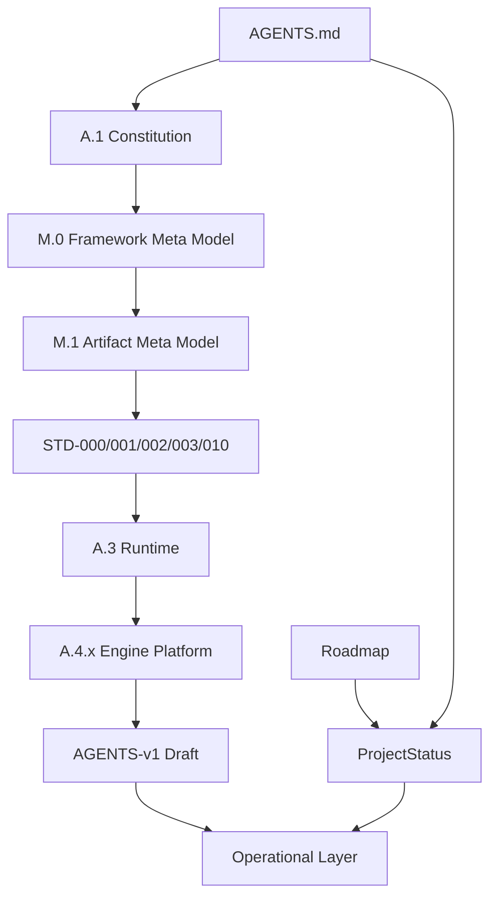

---

## 24. Document Classification Matrix

| Document | Classification | Status in Governance Atlas | Frozen? |
| --- | --- | --- | --- |
| AGENTS.md | Bootstrap / constitutional entry | Active highest repository bootloader | No |
| ProjectStatus | Operational state | Active live state | No, but update-gated |
| Development Phases | Strategic roadmap | Active planning sequence | No, but update-gated |
| A.0 | Audit | Evidence | No |
| A.1 | Constitution | Target constitutional authority candidate / constitutional owner when approved | No |
| M.0 | Meta semantic | Meta authority | No |
| M.1 | Meta artifact | Meta authority | No |
| STD-000 | Standards governance | Standards authority | No |
| STD-001 | Knowledge graph standard | Standards authority | No |
| STD-002 | Discovery standard | Standards authority | No |
| STD-003 | Terminology standard | Terminology authority | No |
| STD-010 | Metadata standard | Metadata authority | No |
| A.3 | Runtime RFC | Runtime authority | No |
| A.4.x | Engine RFC suite | Engine platform authority | No |
| AGENTS-v1 draft | Agent architecture | Draft; not activation of future phases | No |
| AIFramework | Operational layer / RC2 | Frozen reference | Yes |
| AIOrchestrator | Operational layer | Frozen reference | Yes |
| AgentSystemPrompt | Tool-facing operational layer | Frozen reference | Yes |
| Legacy / RC2 migration areas | Legacy boundary | Frozen | Yes |

---

## 25. Document Lifecycle Model

Document lifecycle states:

1. Draft: authored but not approved.
2. Review: under Framework Governance or Human Governance review.
3. Approved: accepted for its domain.
4. Canonical: explicitly promoted as binding authority.
5. Superseded: replaced by approved successor.
6. Frozen: preserved but not modified without activation.
7. Archived: retained for history only.

---

## 26. Promotion Lifecycle

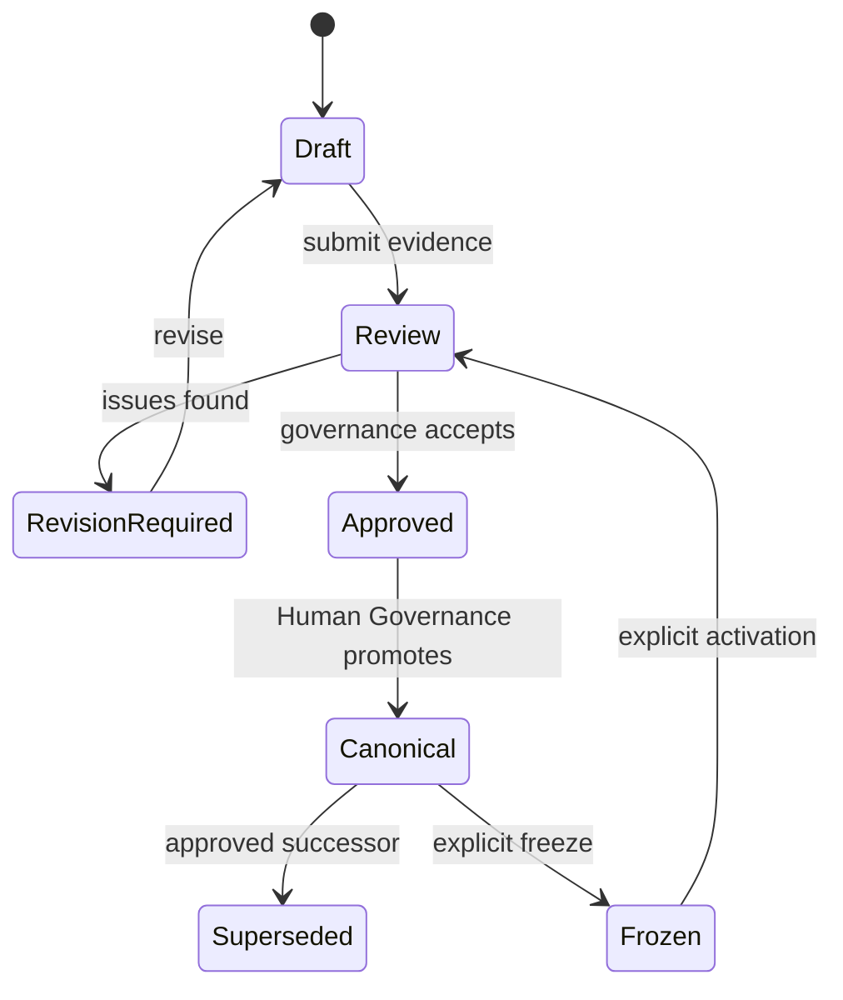

Promotion requires explicit review, validation evidence, conflict resolution, and Human Governance approval. AI-generated drafts cannot self-promote.

---

## 27. Review Model

Review evaluates whether a document:

- stays within scope;
- consumes required upstream authority;
- avoids redefining higher layers;
- uses canonical terminology;
- follows metadata rules;
- preserves frozen boundaries;
- provides traceable evidence;
- satisfies task constraints.

Review may return PASS, PASS WITH OBSERVATIONS, REQUIRES FOLLOW-UP, or FAILED.

---

## 28. Validation Model

Validation is evidence-based. It checks structure, content, consistency, changed-file boundaries, required sections, required diagrams, required matrices, and frozen-area preservation.

Validation does not approve or certify. It produces evidence for review.

---

## 29. Certification Model

Certification confirms that reviewed work may become part of official project state. Certification requires successful validation, successful review, no unresolved blockers, and Human Governance or delegated governance authority.

AI agents shall not self-certify. Completion reports may state review readiness, not certification.

---

## 30. ProjectStatus Governance / ProjectStatus Update Matrix

ProjectStatus is the operational state ledger. It records active phase, current objective, completed work, queue, frozen areas, update policy, decision log, and success indicators.

ProjectStatus update gate:

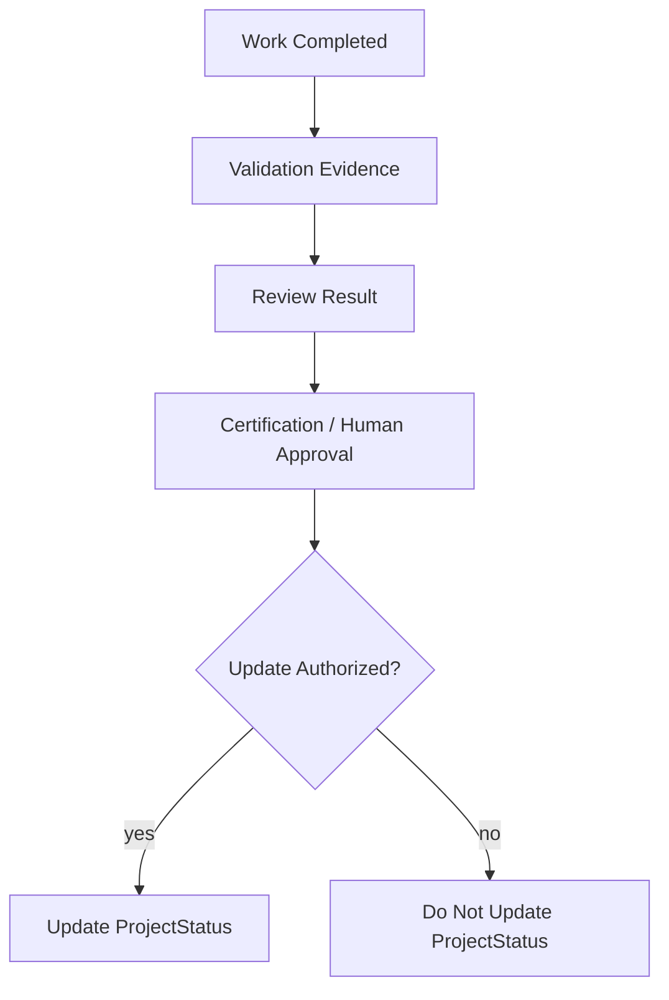

| Situation | ProjectStatus Update Allowed? | Required Gate |
| --- | --- | --- |
| Milestone completed | Yes | Review and certification evidence |
| Human explicitly requests status update | Yes | Human instruction |
| Dedicated ProjectStateUpdater task | Yes | Relevant workflow |
| Ordinary documentation task | No | Recommend only |
| Failed validation | No | Resolve blocker first |
| Frozen phase request | No | Human activation required |

---

## 31. Roadmap Governance

The roadmap defines strategic phase ordering. It does not replace live operational status. Roadmap changes require governance review because they affect phase sequencing and future authority consumption.

Phase work must not skip roadmap order unless Human Governance explicitly approves a split, deferral, or resequencing.

---

## 32. Frozen Area Governance / Frozen Area Matrix

Frozen areas preserve stability. The following are frozen until explicitly activated:

| Frozen Area | Boundary | AI Action Allowed | AI Action Prohibited |
| --- | --- | --- | --- |
| Legacy Migration | Legacy and historical migration work | Classify and reference | Move, migrate, rewrite |
| RC2 relocation | RC2 content movement | Classify and reference | Relocate or refactor |
| AI Operational Layer alignment | AIFramework, AIOrchestrator, AgentSystemPrompt alignment | Classify and reference | Refactor or activate |
| Platform Adapters | Adapter implementation and alignment | Identify boundary | Implement or redefine framework |
| Multi-Agent Runtime | Future multi-agent runtime | Note as frozen | Start design or implementation |
| Swarm Runtime | Future swarm runtime | Note as frozen | Start design or implementation |

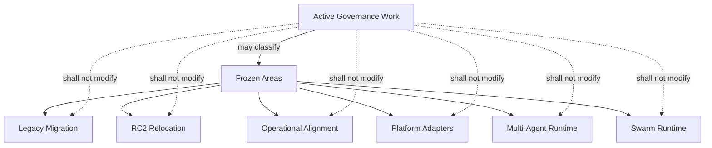

---

## 33. Legacy / RC2 Boundary

RC2 operational procedures remain valid until explicitly replaced by approved v3/v4 operational procedures. Legacy and RC2 material may be used as compatibility context but must not become new architecture by copying, relocation, or silent promotion.

---

## 34. AI Governance Rules / AI Permission / Prohibition Matrix

AI may:

- classify documents;
- validate metadata;
- identify authority conflicts;
- identify terminology conflicts;
- recommend governance fixes;
- produce draft governance documents;
- produce completion reports.

AI shall not:

- redefine constitutional authority;
- redefine M.0;
- redefine M.1;
- redefine terminology;
- redefine metadata;
- redefine Runtime;
- redefine Engine Platform;
- self-certify;
- promote documents;
- update ProjectStatus automatically;
- move legacy or RC2 content;
- start frozen phases.

| AI Activity | Permission | Boundary |
| --- | --- | --- |
| Draft governance atlas | Allowed | Draft only |
| Classify authority | Allowed | No promotion |
| Validate metadata | Allowed | Evidence only |
| Identify conflicts | Allowed | Escalate to humans |
| Recommend fixes | Allowed | Human approval required |
| Approve document | Prohibited | Human Governance only |
| Certify completion | Prohibited | Governance only |
| Promote canonical status | Prohibited | Human Governance only |
| Modify frozen operational layer | Prohibited | Explicit activation required |
| Update ProjectStatus automatically | Prohibited | Dedicated authorization required |

---

## 35. Human Approval Gates / Approval Gate Matrix

| Gate | Human Approval Required? | Evidence Required |
| --- | --- | --- |
| Constitutional change | Yes | Review, rationale, conflict analysis |
| Meta model change | Yes | Semantic impact analysis |
| Standard creation or change | Yes | Standards review |
| Runtime architecture change | Yes | Runtime impact review |
| Engine platform change | Yes | Engine consistency review |
| Agent architecture activation | Yes | Runtime and engine dependency review |
| Operational-layer unfreeze | Yes | Activation decision and migration plan |
| ProjectStatus milestone update | Conditional | Completion evidence or explicit instruction |
| Frozen area activation | Yes | Roadmap and governance decision |

---

## 36. Decision Classification

| Decision Class | Description | Typical Authority |
| --- | --- | --- |
| Constitutional | Principles and invariants | Human Governance / Constitution |
| Strategic | Roadmap, phase sequencing, activation | Human Governance / Framework Governance |
| Semantic | Framework meaning and entities | M.0 / M.1 with review |
| Standard | Cross-document rules | STD owners with review |
| Runtime | Runtime architecture | A.3 with review |
| Engine | Engine platform or engine specialization | A.4.x / engine RFCs |
| Agent | Single-agent architecture | AGENTS-v1 draft after approval |
| Operational | Execution procedure | Operational layer after unfreeze |
| State | Live status updates | ProjectStatus update policy |

---

## 37. Decision Authority Matrix

| Decision | Primary Authority | AI Role | Approval Gate |
| --- | --- | --- | --- |
| Change boot sequence | Human Governance / AGENTS.md | Identify impact | Human approval |
| Promote A.1 | Human Governance | Recommend only | Formal approval |
| Change M.0 semantics | Meta Governance / Human Governance | Conflict analysis | Human approval |
| Change STD-003 terms | Standards Governance | Term conflict report | Standards + human review |
| Change STD-010 metadata | Standards Governance | Metadata validation | Standards + human review |
| Create engine RFC | Engine Governance | Draft within scope | Review and approval |
| Activate Context Engine RFC | Project Governance | Recommend next step | Human or roadmap authorization |
| Update ProjectStatus | Project Governance | Recommend or update only when authorized | Status update gate |
| Unfreeze operational layer | Human Governance | Impact report | Human approval |
| Move legacy files | Human Governance | Not allowed by default | Explicit activation |

---

## 38. Escalation Model

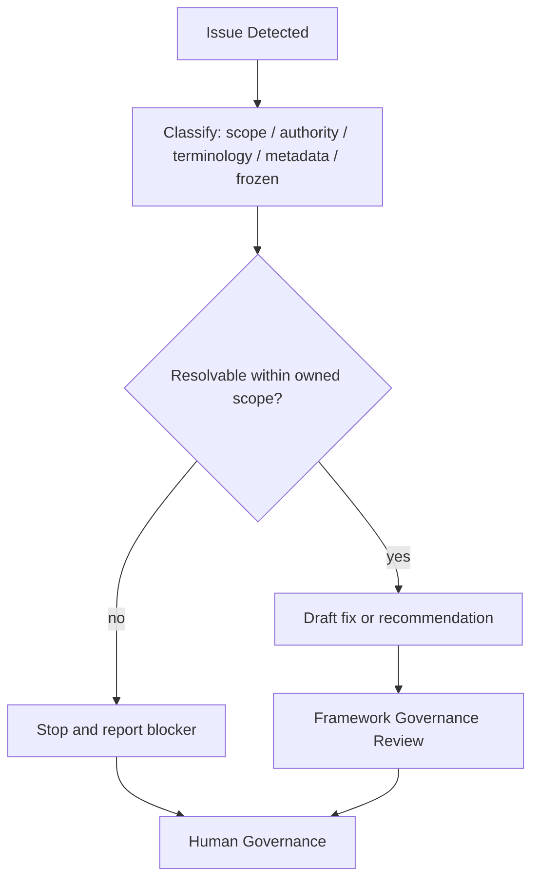

Escalate when authority is unclear, documents conflict, ownership is ambiguous, validation fails, review fails, scope exceeds the active task, or a frozen area is implicated.

---

## 39. Conflict Resolution Model

Conflict resolution order:

1. Apply Human Governance decisions.
2. Apply `AGENTS.md`.
3. Apply constitutional authority.
4. Apply meta authority.
5. Apply standards authority.
6. Apply runtime authority.
7. Apply engine authority.
8. Apply agent authority.
9. Apply operational layer only within its frozen/active status.
10. Apply ProjectStatus for operational state only.
11. Apply roadmap for strategic sequence only.
12. Stop and escalate unresolved conflicts.

---

## 40. Traceability Model

Every governance action should trace:

- source authority;
- consumed documents;
- decision class;
- owner;
- validation evidence;
- review result;
- approval authority;
- ProjectStatus impact;
- frozen-area impact;
- completion report.

Traceability prevents implementation, AI output, or operational convenience from becoming undocumented authority.

---

## 41. Repository Navigation Map

| Area | Path | Use |
| --- | --- | --- |
| Bootstrap | `AGENTS.md` | Start here for repository rules. |
| Governance atlas | `docs/AI/GOVERNANCE.md` | Navigate authority and governance. |
| Live status | Active Target Repository ProjectStatus (`<PROJECT_STATUS_PATH>`) | Determine active state. |
| Roadmap | Active Target Repository DevelopmentPhases (`<DEVELOPMENT_PHASES_PATH>`) | Determine strategic sequence. |
| Architecture | `docs/AI/Architecture/` | Constitution, audit, standards, agents. |
| Meta | `docs/AI/Meta/` | Semantic and artifact models. |
| Runtime | `docs/AI/Runtime/` | Runtime and engine RFCs. |
| Operational | `docs/AI/AIFramework.md`, `docs/AI/AIOrchestrator.md`, `docs/AI/AgentSystemPrompt.md` | Frozen operational references. |
| Specification | `docs/AI/Specification/` | RC2 specification modules and optional GovernanceModel. |

---

## 42. Mandatory Reading Orders

### Governance Atlas Task Reading Order

1. AI-DOS Provider root `AGENTS.md`
2. TargetRepositoryResolution result
3. BootSequence loaded context
4. `docs/AI/GOVERNANCE.md` when present
5. Active Target Repository ProjectStatus (`<PROJECT_STATUS_PATH>`)
6. Active Target Repository DevelopmentPhases (`<DEVELOPMENT_PHASES_PATH>`)
7. A.0 through A.1
8. M.0 and M.1
9. STD-000, STD-001, STD-002, STD-003, STD-010
10. A.3
11. A.4 through A.4.7
12. AGENTS-v1 draft
13. GovernanceModel when present
14. Operational-layer documents for classification only

### AI Agent Consumption Path

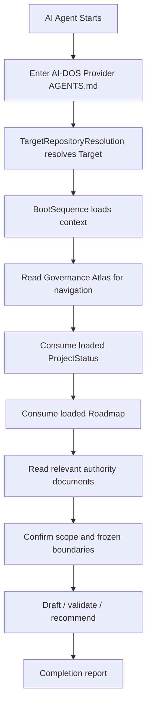

---

## 43. Phase Governance / Phase Transition Matrix

Phase governance ensures current work follows the active phase and stage. ProjectStatus indicates the active operational objective. The roadmap indicates sequence. A phase may close only after exit criteria, validation, review, and required governance acceptance.

| Phase Transition | Required Evidence | Authority |
| --- | --- | --- |
| Start next phase | Prior phase exit evidence | Human / Framework Governance |
| Split phase | Rationale and impact review | Human Governance |
| Defer phase item | Governance decision | Human / Framework Governance |
| Close phase | Validation, review, completion report | Framework Governance / Human Governance |
| Reopen phase | Conflict or defect evidence | Human Governance |

---

## 44. Engine RFC Governance

Engine RFC governance requires every engine RFC to consume the meta foundation, terminology, metadata standard, runtime architecture, and engine platform. Engine RFCs may specialize engine behavior but may not define competing runtime, metadata, terminology, or artifact systems.

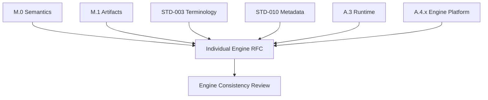

---

## 45. Agent Architecture Governance

Agent architecture governance keeps single-agent architecture separate from operational-layer activation, multi-agent runtime, and swarm runtime. AGENTS-v1 draft may define single-agent architecture within its scope, but it does not start frozen future phases.

---

## 46. Operational Layer Boundary

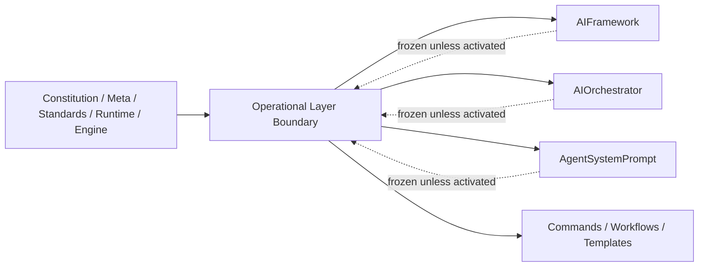

Operational files consume higher authority and remain frozen unless explicitly activated. They must not redefine the Constitution, M.0, M.1, standards, Runtime, Engine Platform, or ProjectStatus.

---

## 47. Governance Anti-Patterns

- Treating ProjectStatus as architecture.
- Treating the roadmap as live status.
- Letting AI approve or certify its own work.
- Promoting a draft by editing wording without Human Governance approval.
- Redefining terms outside STD-003.
- Creating metadata conventions outside STD-010.
- Creating engine contracts outside A.4.x.
- Starting Context Engine RFC or future engine RFCs without explicit scope.
- Refactoring frozen operational-layer documents during classification work.
- Moving legacy or RC2 content during frozen periods.

---

## 48. Governance Quality Gates

| Gate | Check | Evidence |
| --- | --- | --- |
| Scope Gate | Only authorized files changed | `git diff --name-only` |
| Authority Gate | Higher layers not redefined | Review notes |
| Metadata Gate | STD-010 metadata present | Document metadata block |
| Structure Gate | Required sections present | Section validation |
| Diagram Gate | Required Mermaid diagrams present | Diagram validation |
| Matrix Gate | Required matrices present | Matrix validation |
| Frozen Gate | Frozen files unchanged | Git diff checks |
| Review Gate | Review-ready completion report | Completion report |

---

## 49. Governance Risk Model

| Risk | Impact | Mitigation |
| --- | --- | --- |
| Authority drift | Lower layer becomes false authority | Maintain matrices and resolution rules |
| ProjectStatus misuse | State becomes architecture | Enforce status governance |
| Roadmap skipping | Future work starts prematurely | Enforce phase governance |
| AI overreach | Draft becomes pseudo-approved | Require human gates |
| Frozen-area mutation | Migration begins accidentally | Enforce frozen matrix |
| Terminology conflict | Documents become inconsistent | Route through STD-003 |
| Metadata inconsistency | Documents become undiscoverable | Route through STD-010 |
| Engine fragmentation | Engines create competing platforms | Enforce A.4.x consumption |

---

## 50. Governance Completion Checklist

- [ ] Required input documents read.
- [ ] `docs/AI/GOVERNANCE.md` exists.
- [ ] Document metadata included.
- [ ] Required sections included.
- [ ] Required Mermaid diagrams included.
- [ ] Required matrices included.
- [ ] Higher authorities mapped but not redefined.
- [ ] ProjectStatus classified as state, not architecture.
- [ ] Roadmap classified as strategic sequence, not live state.
- [ ] Frozen areas documented.
- [ ] AI permissions and prohibitions documented.
- [ ] Only `docs/AI/GOVERNANCE.md` changed.
- [ ] Validation commands executed.
- [ ] Completion report produced.

---

## 51. Future Governance Extensions

Future extensions may include:

- canonical Governance Model v3 after explicit authorization;
- governance engine RFC after roadmap activation;
- operational-layer alignment after unfreeze;
- platform adapter governance after adapter phase activation;
- multi-agent governance after runtime activation;
- swarm governance after swarm phase activation;
- automated metadata validation tooling after standards approval.

These extensions require Human Governance or approved roadmap activation.

---

## 52. Governance Glossary

| Term | Meaning |
| --- | --- |
| Authority | The right of a document or governance body to define a domain. |
| Bootloader | The first repository-level authority that agents must read. |
| Canonical | Explicitly approved as binding authority. |
| Certification | Confirmation that work may become official project state. |
| Consumption | Use of an upstream document without redefining it. |
| Frozen | Preserved and not modifiable until explicitly activated. |
| Governance Atlas | A navigation and authority map, not a replacement authority. |
| Human Governance | Final approval authority for AI-DOS. |
| Operational State | The live project status recorded in ProjectStatus. |
| Promotion | Movement from draft or approved status to canonical authority. |
| Roadmap | Strategic sequence of phases, not live project state. |

---

## 53. Completion Report

### Executive Summary

This Governance Atlas v2 establishes a repository-wide governance index and authority map. It classifies constitutional, meta, standards, runtime, engine, agent, operational, state, roadmap, and frozen areas without replacing their source documents.

### Files Modified

- `docs/AI/GOVERNANCE.md`

### Governance Architecture Summary

The atlas defines a layered model from Human Governance through bootloader, Constitution, meta, standards, runtime, engine, agent, operational layer, ProjectStatus, roadmap, and generated tasks.

### Authority Model Summary

Authority flows downward. Lower layers consume higher layers. Lower layers shall never redefine higher layers. AI may draft and validate but may not approve, certify, promote, or override humans.

### Matrix Summary

Included matrices cover document authority, ownership, governance layers, consumes/produces, dependencies, classification, decisions, approval gates, frozen areas, AI permissions/prohibitions, ProjectStatus updates, and phase transitions.

### Diagram Summary

Included Mermaid diagrams cover governance layer stack, authority hierarchy, document dependency graph, runtime/engine governance flow, meta-to-engine consumption, promotion lifecycle, ProjectStatus update gate, frozen boundaries, agent governance consumption path, and operational-layer boundary.

### AI Governance Summary

AI is limited to classification, validation, conflict detection, recommendations, draft production, and reporting. AI cannot approve, certify, promote, update ProjectStatus automatically, redefine authority, or start frozen work.

### Frozen Area Confirmation

Legacy Migration, RC2 relocation, AI Operational Layer alignment, Platform Adapters, Multi-Agent Runtime, and Swarm Runtime remain frozen. This atlas does not move files, refactor operational documents, or start frozen phases.

### Validation Results

Validation is external to this document and must be reported by the completing agent after command execution.

### Risks / Follow-ups

- Human Governance review is required before this draft can become canonical.
- Any future operational-layer alignment must be explicitly activated.
- Any ProjectStatus update should be performed only through the authorized status-update process.

### Recommended Next Step

Submit this draft for Human Governance / Framework Governance review. Do not update ProjectStatus unless explicitly authorized.
