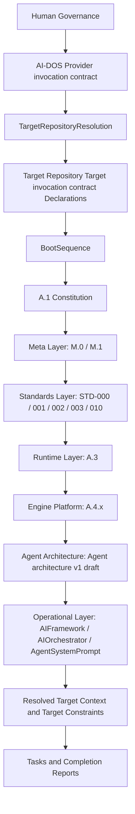
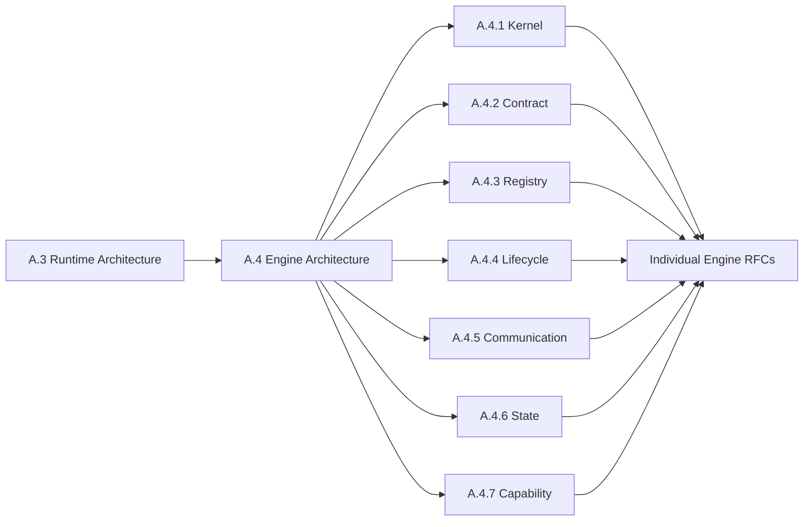
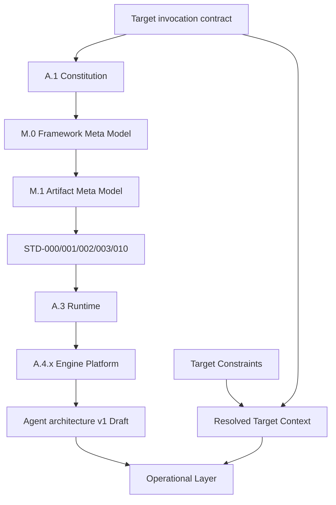
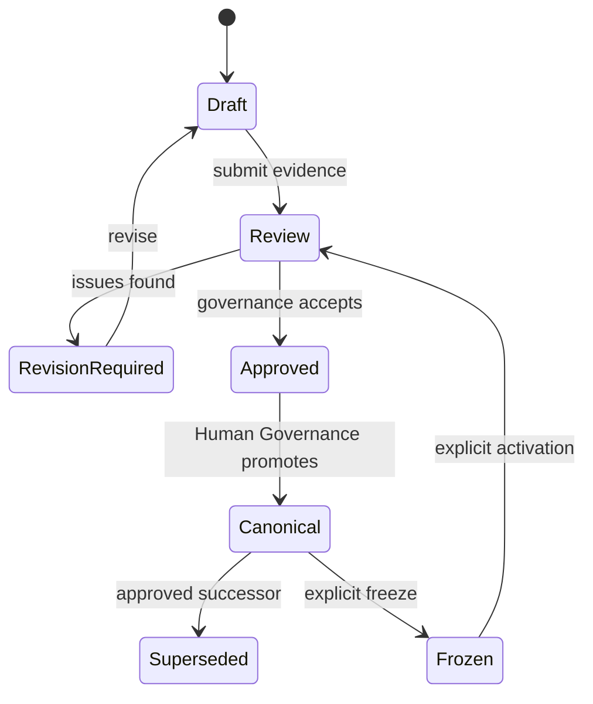
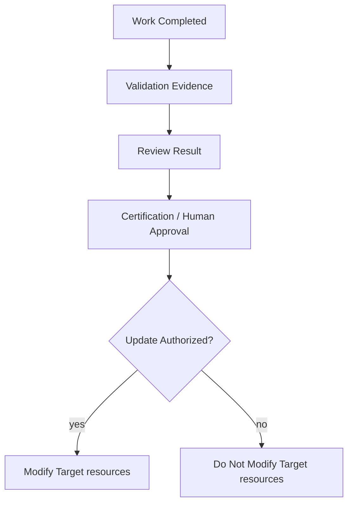
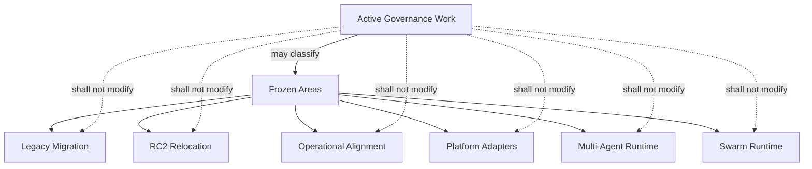
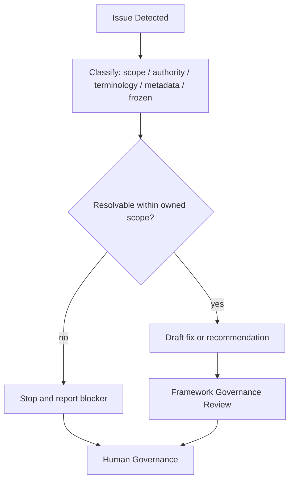
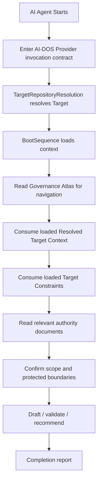
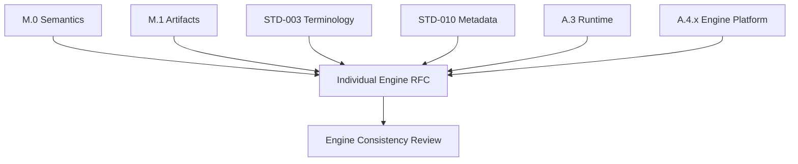
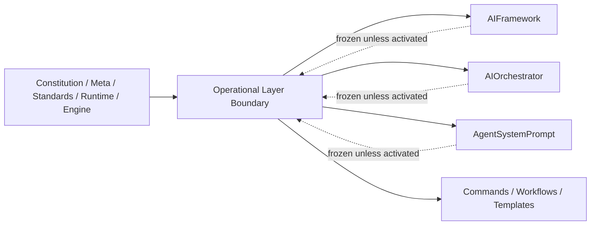

#AI-DOS Governance Atlas v2

---

## Document Metadata

| Field | Value |
| --- | --- |
| Identifier | AI-DOS-GOVERNANCE-ATLAS |
| Title |AI-DOS Governance Atlas v2 |
| Version | 4.0.0-draft |
| Context | Draft |
| Canonical Context | Non-canonical until reviewed and approved |
| Classification | Governance Atlas |
| Document Type | Governance Index / Governance Atlas |
| Owner | Framework Governance |
| Maintainers | Framework Architecture Team |
| Review Authority | Human Governance / Framework Governance |
| Approval Authority | Human Governance |
| Lifecycle Phase | Draft |
| Scope | Repository governance navigation, authority mapping, ownership mapping, dependency mapping, document taxonomy, AI consumption guidance, review and promotion guidance. |
| Out of Scope | Constitutional redefinition, Target Context replacement, Target Constraints replacement, standards creation, Runtime RFC creation, Engine RFC creation, AGENTS v1 activation, operational-layer refactor, legacy migration, implementation task preparation. |
| Normative Authority | Target invocation contract; Human Governance; approved Framework Governance decisions. |
| Normative References | `docs/AI/Architecture/A.1-Constitution.md`; `docs/AI/Meta/M.0-Framework-Meta-Model.md`; `docs/AI/Meta/M.1-Artifact-Meta-Model.md`; `docs/AI/Architecture/Standards/STD-000-Framework-Standards.md`; `docs/AI/Architecture/Standards/STD-003-Terminology-Standard.md`; `docs/AI/Architecture/Standards/STD-010-Document-Metadata-Standard.md`. |
| Dependencies | Target invocation contract; Invocation Context and Resolved Target Context; A.0; A.1; M.0; M.1; STD-000; STD-001; STD-002; STD-003; STD-010; A.3; A.4 through A.4.7; Agent architecture v1 draft; RC2 operational-layer documents. |
| Consumes | Authority, lifecycle, taxonomy, terminology, metadata, runtime, engine, agent, and operational-layer documents. |
| Produces | Governance atlas, repository navigation index, authority matrix, ownership matrix, classification matrix, AI consumption guide, governance quality checklist. |
| Related Specifications | GovernanceModel, AIFramework, AIOrchestrator, AgentSystemPrompt, Framework Governance, Resolved Target Context, Applicable Target Resources. |
| Promotion Requirements | Human Governance review; Framework Governance review; validation of required sections, matrices, diagrams, and protected-boundary constraints; explicit approval before canonical use. |
| Certification Status | Not certified; review-ready draft after validation. |

---

## 1. Executive Summary

The AI-DOS Governance Atlas v2 is the central navigation and governance map for the AI-DOS repository. It explains how authority is discovered, how documents consume each other, which document owns which domain, and which activities require human approval.

This atlas is a map, not a replacement authority. It does not supersede Target invocation contract, the Constitution, M.0, M.1, standards, runtime RFCs, engine RFCs, agent architecture, operational-layer files, Resolved Target Context, or the Target Constraints. It classifies those documents and explains safe consumption paths for humans and AI agents.

Core conclusions:

- Human Governance is final.
- The AI-DOS Provider root Target invocation contract is the Provider entry that starts Framework boot and routes to TargetRepositoryResolution; the Target Repository root Target invocation contract is the Target Project declaration contract.
- TargetRepositoryResolution owns Target Repository identification, Target invocation-contract discovery, project-resource resolution, declaration validation, blocker reporting, Resolution Result production, and BootSequence handoff.
- BootSequence owns loading the resolved Framework + Target Project context from the Resolution Result.
- Resolved Target Context is the validated and resolved set of Target-provided resources, objectives, constraints, authorities, execution boundaries, validation requirements, protected boundaries, and applicable evidence for the invocation.
- Applicable Target Resources are any Target-provided resources relevant to the current task without prescribed category, format, hierarchy, existence, sequencing, or methodology.
- Lower layers consume higher layers and shall never redefine them.
- AI may propose, classify, validate, and recommend.
- AI shall never approve, certify, promote, or override Human Governance.

---

## 2. Purpose

This document exists to answer governance navigation questions:

- What governs the repository?
- Which document owns each authority domain?
- Which documents are strategic, operational, semantic, standard, runtime, engine, agent, frozen, or legacy?
- What is the correct reading order?
- Which document may redefine what?
- Which documents only consume higher authority?
- How do review, validation, certification, promotion, and Target resource modifications work?
- What is frozen?
- What must AI agents never do?

---

## 3. Scope

In scope:

- governance navigation;
- authority mapping;
- ownership mapping;
- dependency mapping;
- decision routing;
- document taxonomy;
- AI consumption guidance;
- protected-boundary boundaries;
- review, validation, certification, and promotion guidance.

---

## 4. Non-Goals

This atlas is not:

- the Constitution;
- a replacement for Resolved Target Context;
- a Target Constraints;
- a standard;
- a Runtime RFC;
- an Engine RFC;
- AGENTS v1;
- an implementation plan;
- a migration plan;
- permissions to begin frozen authorized work.

---

## 5. Governance Philosophy

AI-DOS governance is documentation-first and authority-driven. Architecture precedes implementation, governance precedes execution, validation precedes review, review precedes certification, and certification precedes Target-context update.

Governance favors explicit ownership over implicit convention. A lower document may refine a higher document only within its assigned scope. A lower document may not redefine, bypass, or silently contradict higher authority.

---

## 6. Governance Principles

1. Human Governance is final.
2. Target invocation contract is the repository bootloader.
3. Authority flows downward.
4. Execution consumes task preparation.
5. Resolved Target Context provides invocation context but does not define architecture.
6. The Target Constraints defines Target Constraints but does not replace resolved context.
7. Standards govern cross-document consistency.
8. Runtime consumes meta and standards.
9. Engines specialize runtime and engine-platform rules.
10. AI agents may draft and validate, but may not approve, promote, or certify.

---

## 7. Governance Layers / Governance Layer Matrix



| Layer | Primary Function | May Redefine | Must Consume |
| --- | --- | --- | --- |
| Human Governance | Final approval | Any governance decision within project constraints | Evidence and recommendations |
| Provider entry | Start AI-DOS Framework boot and route to TargetRepositoryResolution | Provider entry routing by explicit amendment | Human authority |
| Target Repository resolution | Identify Target Repository, read Target invocation-contract declarations, resolve resources, validate, block, and hand off | Resolution procedure by System Layer governance only | Provider entry and Target declarations |
| Resolved-context loading | Load resolved Framework + Target Project context | Boot loading procedure by System Layer governance only | TargetRepositoryResolution result |
| Constitution | Constitutional principles | Constitutional principles within approval process | Bootloader |
| Meta | Semantic and artifact models | Its owned model only | Constitution |
| Standards | Cross-document rules | Owned standard domain only | Constitution and meta |
| Runtime | Runtime architecture | Runtime concepts only | Constitution, meta, standards |
| Engine | Engine platform specialization | Engine concepts only | Runtime and standards |
| Agent | Agent architecture | Single-agent architecture only | Meta, standards, runtime, engine |
| Operational | Execution procedure | Operational procedures only when unfrozen | Higher layers |
| Resolved Context/Target Constraints | Resolved context and Target Constraints | Resolved Context/Target Constraints facts only | Higher authority |

---

## 8. Repository Governance

Repository governance begins with the AI-DOS Provider root Target invocation contract, which starts Framework boot and routes to TargetRepositoryResolution. Target Repository project declarations live in the Target Repository root Target invocation contract. TargetRepositoryResolution, not the Governance Atlas, identifies the Target Repository, reads declarations, resolves project resources, validates declarations, reports blockers, produces the Resolution Result, and hands off to BootSequence. BootSequence loads the resolved context. This atlas governs navigation after those boundaries are respected.

Repository governance separates:

- authority documents;
- Resolved Target Context;
- Target Constraints;
- standards;
- runtime and engine RFCs;
- operational-layer compatibility documents;
- frozen and legacy areas.

---

## 9. Constitutional Governance

A.1 owns constitutional principles for the v3/v4 architecture track when promoted through governance. It must not be silently replaced by this atlas. Constitutional governance defines permanent principles, invariants, and boundaries that lower documents consume.

A constitutional conflict is never resolved by implementation convenience. It escalates to Human Governance.

---

## 10. Target Context Governance

Target Context governance consumes resolved invocation inputs without prescribing Target methodology:

- The Applicable Target Resources loaded from the resolved Target Repository (`<APPLICABLE_TARGET_RESOURCES>`) is the Target Constraints.
- The Resolved Target Context loaded from the resolved Target Repository (`<RESOLVED_TARGET_CONTEXT>`) is the resolved context.
- For AI-DOS self-hosting only, these resolve to `Target-provided Target-provided resource documentation` and `Target-provided Target-provided context documentation`.

Resolved Target Context is not architecture and may not promote documents, redefine semantics, or supersede standards. It records applicable Target boundary, completed items, Target Objectives, Target Constraints, Target Execution Boundaries, protected boundaries, Target-resource-update policy, decision log, and success indicators.

---

## 11. Meta Governance

M.0 owns the framework semantic model. M.1 owns the artifact model. These documents define the vocabulary of framework entities and artifact specialization boundaries consumed by standards, runtime, engines, agents, and operational-layer alignment.

Lower documents shall not create competing root semantics, artifact families, terminology, or metadata rules.

---

## 12. Standards Governance

STD-000 owns standards governance. STD-001 owns knowledge graph semantics. STD-002 owns Discovery. STD-003 owns terminology. STD-010 owns document metadata.

Standards govern consistency across the repository. They do not implement runtime behavior unless a runtime or engine document explicitly consumes and specializes them.

---

## 13. Runtime Governance

A.3 owns Runtime Architecture. It defines runtime concepts and lifecycle boundaries at the runtime layer. Runtime governance consumes the Constitution, M.0, M.1, STD-003, STD-010, and related standards.

Runtime documents must not redefine meta models or standards. They translate approved models into runtime architecture.

---

## 14. Engine Governance

A.4 owns Engine Architecture. A.4.1 through A.4.7 own engine kernel, contract, registry, lifecycle, communication, runtime state, and capability respectively.

Engine RFCs specialize the approved Runtime Architecture and Engine Platform. Individual engine RFCs must consume M.0, M.1, STD-003, STD-010, A.3, and A.4.x without redefining them.



---

## 15. Agent Governance

`docs/AI/Architecture/Agents/Agent architecture v1-draft.md` owns single-agent architecture as a draft agent architecture document. It does not activate multi-agent runtime, swarm runtime, or operational-layer refactor by itself.

Agent governance consumes the Constitution, meta layer, standards, runtime, and engine platform. Agent documents must not redefine those layers.

---

## 16. Operational Layer Governance

`docs/AI/AIFramework.md`, `docs/AI/AIOrchestrator.md`, and `docs/AI/AgentSystemPrompt.md` are operational-layer documents and are currently frozen unless explicitly activated. They remain classification and compatibility references. This atlas references them only and does not refactor them.

Operational-layer governance defines execution procedure, orchestration, tool-facing rules, command selection, validation sequencing, review sequencing, and completion reporting only after activation or within existing RC2 compatibility boundaries.

---

## 17. Legacy Governance

Legacy and RC2 content remains valid where explicitly preserved, but it is bounded. Legacy material may be read for context and compatibility. It must not be moved, migrated, copied, or promoted during frozen periods.

Legacy governance prevents accidental architecture regression and protects the repository from undocumented migration.

---

## 18. Authority Hierarchy

```mermaid
flowchart TD
    Human[Human Governance]
    Agents[Target invocation contract]
    GovAtlas[Governance Atlas - this draft]
    Constitution[A.1 Constitution]
    Meta[M.0 / M.1]
    Standards[STD-000 / STD-001 / STD-002 / STD-003 / STD-010]
    Runtime[A.3 Runtime Architecture]
    Engine[A.4.x Engine Platform]
    Agent[Agent architecture v1 Draft]
    Operational[Operational Layer]
    Context[Resolved Target Context]
    Target Constraints[Applicable Target Resources]
    Tasks[Generated Tasks]
    Human --> Agents --> Constitution --> Meta --> Standards --> Runtime --> Engine --> Agent --> Operational --> Context --> Target Constraints --> Tasks
    Agents -. governs use of .-> GovAtlas
    GovAtlas -. maps only .-> Constitution
```

This atlas is intentionally shown as a mapping artifact rather than as a replacement authority.

---

## 19. Authority Resolution Rules

1. Human Governance wins over all automated or draft outputs.
2. Target invocation contract wins over repository documents unless explicitly amended by Human Governance.
3. A higher layer wins over a lower layer.
4. A document owns only its declared authority domain.
5. A lower layer may consume and specialize but may not redefine a higher layer.
6. If Resolved Target Context conflicts with architecture, architecture wins and Resolved Target Context requires review.
7. If Target Constraints conflicts with Resolved Target Context, Resolved Target Context reflects current operation and Target Constraints requires governance review.
8. If an AI detects conflict, it must stop, report, and recommend escalation.

---

## 20. Document Authority Matrix

| Document | Authority Domain | Authority Type | May Redefine | May Not Redefine |
| --- | --- | --- | --- | --- |
| AI-DOS Provider root Target invocation contract | AI-DOS Provider entry | Provider entry authority | Start Framework boot and route to TargetRepositoryResolution | Target declaration validation, project path resolution, BootSequence handoff result |
| Target Repository root Target invocation contract | Target Project declarations | Declaration authority | Declare project resources, authority order, validation context, protection context, and AI-DOS Provider reference | Active Target Repository identification, path resolution, validation, blocker context |
| TargetRepositoryResolution | Target Repository resolution | System Layer resolution authority | Identify Target Repository, discover Target invocation contracts, resolve resources, validate, block, produce Resolution Result, hand off to BootSequence | Loaded context execution |
| BootSequence | Resolved-context loading | System Layer boot authority | Load resolved Framework + Target Project context from the Resolution Result | Target discovery, declaration validation, operational execution |
| Resolved Target Context | Resolved context | Target authority input | Applicable Target facts | Architecture, standards, promotion |
| Applicable Target Resources | Target Constraints | Target authority input | Target Constraints | Resolved context, architecture |
| A.0 Framework Audit | Audit findings | Evidence / assessment | Nothing normative by itself | Constitution, meta, standards |
| A.1 Constitution | Constitutional principles | Constitutional authority | Constitutional principles by approval | Human Governance |
| M.0 | Framework semantic model | Semantic authority | Framework semantic model | Constitution, metadata, runtime |
| M.1 | Artifact model | Artifact authority | Artifact taxonomy/model | M.0 root semantics, metadata |
| STD-000 | Standards governance | Standards authority | Standards process | Constitution, meta |
| STD-001 | Knowledge graph semantics | Standard authority | Knowledge graph rules | M.0 semantics, STD-003 terms |
| STD-002 | Discovery | Standard authority | Discovery rules | M.0 semantics, STD-010 metadata |
| STD-003 | Terminology | Terminology authority | Canonical terms | Constitution |
| STD-010 | Document metadata | Metadata authority | Metadata schema and rules | Constitution, M.0 semantics |
| A.3 | Runtime Architecture | Runtime authority | Runtime architecture | Meta and standards |
| A.4 | Engine Architecture | Engine authority | Engine platform architecture | Runtime, meta, standards |
| A.4.1 | Engine Kernel | Engine component authority | Kernel rules | A.4 platform |
| A.4.2 | Engine Contract | Engine component authority | Contract rules | A.4 platform |
| A.4.3 | Engine Registry | Engine component authority | Registry rules | A.4 platform |
| A.4.4 | Engine Lifecycle | Engine component authority | Lifecycle rules | A.4 platform |
| A.4.5 | Engine Communication | Engine component authority | Communication rules | A.4 platform |
| A.4.6 | Engine State | Engine component authority | Engine state rules | Resolved Target Context, A.4 platform |
| A.4.7 | Engine Capability | Engine component authority | Engine capability rules | Task preparation hierarchy |
| Agent architecture v1 draft | Single-agent architecture | Draft agent authority | Agent architecture after approval | Runtime and engine platform |
| AIFramework | RC2 operational master index | Frozen operational authority | Nothing while frozen | v3/v4 architecture |
| AIOrchestrator | Operational orchestration | Frozen operational authority | Nothing while frozen | Architecture and Target Constraints |
| AgentSystemPrompt | Tool-facing agent rules | Frozen operational authority | Nothing while frozen | Architecture and governance |

---

## 21. Ownership Matrix / Document Ownership Matrix

| Domain | Owner | Primary Documents | Consumers |
| --- | --- | --- | --- |
| Human approval | Human Governance | Governance decisions | All layers |
| AI-DOS Provider entry | AI-DOS Provider root Target invocation contract | `<AI_DOS_ROOT>/Target invocation contract` | TargetRepositoryResolution |
| Target Project declarations | Target Repository root Target invocation contract | `<TARGET_REPOSITORY_ROOT>/Target invocation contract` | TargetRepositoryResolution |
| Target Repository resolution | TargetRepositoryResolution | `docs/AI/System/TargetRepositoryResolution.md` | BootSequence |
| Resolved-context loading | BootSequence | `docs/AI/System/BootSequence.md` | Operational Core |
| Governance navigation | Governance Atlas | `docs/AI/GOVERNANCE.md` | All agents and automation |
| Constitution | Framework Constitution | A.1 | Meta, standards, runtime, engines |
| Semantic model | Meta Governance | M.0 | M.1, standards, runtime |
| Artifact model | Meta Governance | M.1 | Standards, runtime, engines |
| Terminology | Standards Governance | STD-003 | All documents |
| Metadata | Standards Governance | STD-010 | All documents |
| Knowledge graph | Standards Governance | STD-001 | Runtime, discovery, engines |
| Discovery | Standards Governance | STD-002 | Runtime and engines |
| Runtime | Runtime Architecture | A.3 | Engine platform, agents |
| Engine platform | Engine Architecture | A.4.x | Individual engine RFCs |
| Agent architecture | Agent Architecture | Agent architecture v1 draft | Operational layer when activated |
| Resolved context | Target Context Governance | Resolved Target Context | Orchestration and task task preparation |
| Target Constraints | Target Context Governance | Applicable Target Resources | Resolved Target Context and Target task preparation |
| Operational compatibility | Operational Layer | AIFramework, AIOrchestrator, AgentSystemPrompt | AI tools while frozen |

---

## 22. Consumes / Produces Matrix

| Document / Layer | Consumes | Produces |
| --- | --- | --- |
| AI-DOS Provider root Target invocation contract | Human authority | Provider entry routing to TargetRepositoryResolution |
| Target Repository root Target invocation contract | Target Project governance | Project resource declarations and provider reference |
| TargetRepositoryResolution | Provider entry and Target declarations | Resolution Result and BootSequence handoff |
| BootSequence | TargetRepositoryResolution result | Loaded Framework + Target Project context |
| Resolved Target Context | Target Constraints, completed evidence, governance decisions | Resolved context |
| Applicable Target Resources | Target-provided resources and authority inputs | Task-relevant context |
| A.0 | Existing repository state | Audit findings |
| A.1 | Target invocation contract, governance principles | Constitutional model |
| M.0 | Constitution | Framework semantic model |
| M.1 | Constitution, M.0 | Artifact model |
| STD-000 | Constitution, M.0, M.1 | Standards governance rules |
| STD-001 | M.0, M.1, STD-003 | Knowledge graph standard |
| STD-002 | M.0, STD-003, STD-010 | Discovery standard |
| STD-003 | Constitution, M.0 | Canonical terminology |
| STD-010 | Constitution, M.0, M.1 | Metadata standard |
| A.3 | Constitution, meta, standards | Runtime architecture |
| A.4.x | A.3, meta, standards | Engine platform |
| Agent architecture v1 | Meta, standards, runtime, engine | Agent architecture draft |
| Operational Layer | Loaded Framework + Target Project context, AIFramework, Resolved Target Context | Execution procedures |
| Governance Atlas | All listed inputs | Navigation and governance map |

---

## 23. Dependency Matrix

| Consumer | Required Dependencies | Dependency Rule |
| --- | --- | --- |
| Standards | A.1, M.0, M.1 | Standards preserve meta and constitutional scope. |
| Runtime | A.1, M.0, M.1, STD-003, STD-010 | Runtime uses approved terminology and metadata. |
| Engine Platform | Runtime, meta, standards | Engines specialize runtime only. |
| Individual Engines | A.3, A.4.x, M.0, M.1, STD-003, STD-010 | Engine RFCs shall not create competing roots. |
| Agent Architecture | A.3, A.4.x, standards | Agents consume runtime and engine contracts. |
| Operational Layer | Target invocation contract, Resolved Target Context, Target Constraints, commands | Operational files remain frozen unless activated. |
| Resolved Target Context | Governance decisions, completion evidence | Resolved Target Context records, not defines, architecture. |



---

## 24. Document Classification Matrix

| Document | Classification | Context in Governance Atlas | Frozen? |
| --- | --- | --- | --- |
| Target invocation contract | Bootstrap / constitutional entry | Active highest repository bootloader | No |
| Resolved Target Context | Resolved context | Resolved context | No, but update-gated |
| Applicable Target Resources | Target Constraints | Target Constraints | No, but update-gated |
| A.0 | Audit | Evidence | No |
| A.1 | Constitution | Target constitutional authority candidate / constitutional owner when approved | No |
| M.0 | Meta semantic | Meta authority | No |
| M.1 | Meta artifact | Meta authority | No |
| STD-000 | Standards governance | Standards authority | No |
| STD-001 | Knowledge graph standard | Standards authority | No |
| STD-002 | Discovery standard | Standards authority | No |
| STD-003 | Terminology standard | Terminology authority | No |
| STD-010 | Metadata standard | Metadata authority | No |
| A.3 | Runtime RFC | Runtime authority | No |
| A.4.x | Engine RFC suite | Engine platform authority | No |
| Agent architecture v1 draft | Agent architecture | Draft; not activation of work outside Target Execution Boundaries | No |
| AIFramework | Operational layer / RC2 | Frozen reference | Yes |
| AIOrchestrator | Operational layer | Frozen reference | Yes |
| AgentSystemPrompt | Tool-facing operational layer | Frozen reference | Yes |
| Legacy / RC2 migration areas | Legacy boundary | Frozen | Yes |

---

## 25. Document Lifecycle Model

Document lifecycle states:

1. Draft: authored but not approved.
2. Review: under Framework Governance or Human Governance review.
3. Approved: accepted for its domain.
4. Canonical: explicitly promoted as binding authority.
5. Superseded: replaced by approved successor.
6. Frozen: preserved but not modified without activation.
7. Archived: retained for history only.

---

## 26. Promotion Lifecycle



Promotion requires explicit review, validation evidence, conflict resolution, and Human Governance approval. AI-generated drafts cannot self-promote.

---

## 27. Review Model

Review evaluates whether a document:

- stays within scope;
- consumes required upstream authority;
- avoids redefining higher layers;
- uses canonical terminology;
- follows metadata rules;
- preserves protected boundaries;
- provides traceable evidence;
- satisfies task constraints.

Review may return PASS, PASS WITH OBSERVATIONS, REQUIRES FOLLOW-UP, or FAILED.

---

## 28. Validation Model

Validation is evidence-based. It checks structure, content, consistency, changed-file boundaries, required sections, required diagrams, required matrices, and protected-boundary preservation.

Validation does not approve or certify. It produces evidence for review.

---

## 29. Certification Model

Certification confirms that reviewed work may become part of official Target context. Certification requires successful validation, successful review, no unresolved blockers, and Human Governance or delegated governance authority.

AI agents shall not self-certify. Completion reports may state review readiness, not certification.

---

## 30. Resolved Target Context Governance / Resolved Target Context Update Matrix

Resolved Target Context is the validated and resolved set of Target-provided resources, objectives, constraints, authorities, execution boundaries, validation requirements, protected boundaries, and applicable evidence for an invocation.

Target resource modification gate:



| Situation | Resolved Target Context Update Allowed? | Required Gate |
| --- | --- | --- |
| Objective completed | Yes | Review and certification evidence |
| Human explicitly requests Target resource update | Yes | Human instruction |
| Dedicated TargetResourceUpdater task | Yes | Relevant workflow |
| Ordinary documentation task | No | Recommend only |
| Failed validation | No | Resolve blocker first |
| Protected-boundary request | No | Human activation required |

---

## 31. Target Constraints Governance

Target Constraints are supplied constraints for the invoked task. AI-DOS consumes them without prescribing their source, format, hierarchy, existence, sequencing, or methodology.

Work must remain within Target Constraints unless Human Governance explicitly authorizes a bounded exception.

---

## 32. Frozen Area Governance / Frozen Area Matrix

Protected boundaries preserve stability. The following are frozen until explicitly activated:

| Frozen Area | Boundary | AI Action Allowed | AI Action Prohibited |
| --- | --- | --- | --- |
| Legacy Migration | Legacy and historical migration work | Classify and reference | Move, migrate, rewrite |
| RC2 relocation | RC2 content movement | Classify and reference | Relocate or refactor |
| AI Operational Layer alignment | AIFramework, AIOrchestrator, AgentSystemPrompt alignment | Classify and reference | Refactor or activate |
| Platform Adapters | Adapter implementation and alignment | Identify boundary | Implement or redefine framework |
| Multi-Agent Runtime | Future multi-agent runtime | Note as frozen | Start design or implementation |
| Swarm Runtime | Future swarm runtime | Note as frozen | Start design or implementation |



---

## 33. Legacy / RC2 Boundary

RC2 operational procedures remain valid until explicitly replaced by approved v3/v4 operational procedures. Legacy and RC2 material may be used as compatibility context but must not become new architecture by copying, relocation, or silent promotion.

---

## 34. AI Governance Rules / AI Pertarget objectives / Prohibition Matrix

AI may:

- classify documents;
- validate metadata;
- identify authority conflicts;
- identify terminology conflicts;
- recommend governance fixes;
- produce draft governance documents;
- produce completion reports.

AI shall not:

- redefine constitutional authority;
- redefine M.0;
- redefine M.1;
- redefine terminology;
- redefine metadata;
- redefine Runtime;
- redefine Engine Platform;
- self-certify;
- promote documents;
- modify Target resources automatically;
- move legacy or RC2 content;
- start frozen authorized work.

| AI Activity | Pertarget objectives | Boundary |
| --- | --- | --- |
| Draft governance atlas | Allowed | Draft only |
| Classify authority | Allowed | No promotion |
| Validate metadata | Allowed | Evidence only |
| Identify conflicts | Allowed | Escalate to humans |
| Recommend fixes | Allowed | Human approval required |
| Approve document | Prohibited | Human Governance only |
| Certify completion | Prohibited | Governance only |
| Promote canonical context | Prohibited | Human Governance only |
| Modify frozen operational layer | Prohibited | Explicit activation required |
| Modify Target resources automatically | Prohibited | Dedicated authorization required |

---

## 35. Human Approval Gates / Approval Gate Matrix

| Gate | Human Approval Required? | Evidence Required |
| --- | --- | --- |
| Constitutional change | Yes | Review, rationale, conflict analysis |
| Meta model change | Yes | Semantic impact analysis |
| Standard creation or change | Yes | Standards review |
| Runtime architecture change | Yes | Runtime impact review |
| Engine platform change | Yes | Engine consistency review |
| Agent architecture activation | Yes | Runtime and engine dependency review |
| Operational-layer unfreeze | Yes | Activation decision and migration plan |
| Resolved Target Context objective update | Conditional | Completion evidence or explicit instruction |
| Frozen area activation | Yes | Target Constraints and governance decision |

---

## 36. Decision Classification

| Decision Class | Description | Typical Authority |
| --- | --- | --- |
| Constitutional | Principles and invariants | Human Governance / Constitution |
| Target Constraints | Supplied constraints and execution boundaries | Human Governance / Framework Governance |
| Semantic | Framework meaning and entities | M.0 / M.1 with review |
| Standard | Cross-document rules | STD owners with review |
| Runtime | Runtime architecture | A.3 with review |
| Engine | Engine platform or engine specialization | A.4.x / engine RFCs |
| Agent | Single-agent architecture | Agent architecture v1 draft after approval |
| Operational | Execution procedure | Operational layer after unfreeze |
| State | Resolved context updates | Target resource modification policy |

---

## 37. Decision Authority Matrix

| Decision | Primary Authority | AI Role | Approval Gate |
| --- | --- | --- | --- |
| Change boot sequence | Human Governance / Target invocation contract | Identify impact | Human approval |
| Promote A.1 | Human Governance | Recommend only | Formal approval |
| Change M.0 semantics | Meta Governance / Human Governance | Conflict analysis | Human approval |
| Change STD-003 terms | Standards Governance | Term conflict report | Standards + human review |
| Change STD-010 metadata | Standards Governance | Metadata validation | Standards + human review |
| Create engine RFC | Engine Governance | Draft within scope | Review and approval |
| Activate Context Engine RFC | Target Context Governance | Recommend next step | Human or Target Constraints authorization |
| Modify Target resources | Target Context Governance | Recommend or update only when authorized | Target resource update gate |
| Unfreeze operational layer | Human Governance | Impact report | Human approval |
| Move legacy files | Human Governance | Not allowed by default | Explicit activation |

---

## 38. Escalation Model



Escalate when authority is unclear, documents conflict, ownership is ambiguous, validation fails, review fails, scope exceeds the active task, or a frozen area is implicated.

---

## 39. Conflict Resolution Model

Conflict resolution order:

1. Apply Human Governance decisions.
2. Apply Target invocation contract.
3. Apply constitutional authority.
4. Apply meta authority.
5. Apply standards authority.
6. Apply runtime authority.
7. Apply engine authority.
8. Apply agent authority.
9. Apply operational layer only within its frozen/active context.
10. Apply Resolved Target Context for resolved context only.
11. Apply Target Constraints for Target Constraints only.
12. Stop and escalate unresolved conflicts.

---

## 40. Traceability Model

Every governance action should trace:

- source authority;
- consumed documents;
- decision class;
- owner;
- validation evidence;
- review result;
- approval authority;
- Resolved Target Context impact;
- protected-boundary impact;
- completion report.

Traceability prevents implementation, AI output, or operational convenience from becoming undocumented authority.

---

## 41. Repository Navigation Map

| Area | Path | Use |
| --- | --- | --- |
| Bootstrap | Target invocation contract | Start here for repository rules. |
| Governance atlas | `docs/AI/GOVERNANCE.md` | Navigate authority and governance. |
| Resolved context | Resolved Target Context | Determine applicable context. |
| Target Constraints | Applicable Target Resources | Determine Target Constraints. |
| Architecture | `docs/AI/Architecture/` | Constitution, audit, standards, agents. |
| Meta | `docs/AI/Meta/` | Semantic and artifact models. |
| Runtime | `docs/AI/Runtime/` | Runtime and engine RFCs. |
| Operational | `docs/AI/AIFramework.md`, `docs/AI/AIOrchestrator.md`, `docs/AI/AgentSystemPrompt.md` | Frozen operational references. |
| Specification | `docs/AI/Specification/` | RC2 specification modules and optional GovernanceModel. |

---

## 42. Mandatory Reading Orders

### Governance Atlas Task Reading Order

1. AI-DOS Provider root Target invocation contract
2. TargetRepositoryResolution result
3. BootSequence loaded context
4. `docs/AI/GOVERNANCE.md` when present
5. Resolved Target Context
6. Applicable Target Resources when relevant to the task
7. A.0 through A.1
8. M.0 and M.1
9. STD-000, STD-001, STD-002, STD-003, STD-010
10. A.3
11. A.4 through A.4.7
12. Agent architecture v1 draft
13. GovernanceModel when present
14. Operational-layer documents for classification only

### AI Agent Consumption Path



---

## 43. Phase Governance / Phase Transition Matrix

AI-DOS artifact governance ensures current work follows the authorized scope. Resolved Target Context indicates the Target Objective. Target Constraints identify applicable boundaries. AI-DOS artifact work completes only after required validation, review, and governance acceptance.

| Phase Transition | Required Evidence | Authority |
| --- | --- | --- |
| Start next authorized work | Prior authorized work exit evidence | Human / Framework Governance |
| Split authorized work | Rationale and impact review | Human Governance |
| Defer authorized work item | Governance decision | Human / Framework Governance |
| Close authorized work | Validation, review, completion report | Framework Governance / Human Governance |
| Reopen authorized work | Conflict or defect evidence | Human Governance |

---

## 44. Engine RFC Governance

Engine RFC governance requires every engine RFC to consume the meta foundation, terminology, metadata standard, runtime architecture, and engine platform. Engine RFCs may specialize engine behavior but may not define competing runtime, metadata, terminology, or artifact systems.



---

## 45. Agent Architecture Governance

Agent architecture governance keeps single-agent architecture separate from operational-layer activation, multi-agent runtime, and swarm runtime. Agent architecture v1 draft may define single-agent architecture within its scope, but it does not start frozen work outside Target Execution Boundaries.

---

## 46. Operational Layer Boundary



Operational files consume higher authority and remain frozen unless explicitly activated. They must not redefine the Constitution, M.0, M.1, standards, Runtime, Engine Platform, or Resolved Target Context.

---

## 47. Governance Anti-Patterns

- Treating Resolved Target Context as architecture.
- Treating the Target Constraints as resolved context.
- Letting AI approve or certify its own work.
- Promoting a draft by editing wording without Human Governance approval.
- Redefining terms outside STD-003.
- Creating metadata conventions outside STD-010.
- Creating engine contracts outside A.4.x.
- Starting Context Engine RFC or future engine RFCs without explicit scope.
- Refactoring frozen operational-layer documents during classification work.
- Moving legacy or RC2 content during frozen periods.

---

## 48. Governance Quality Gates

| Gate | Check | Evidence |
| --- | --- | --- |
| Scope Gate | Only authorized files changed | `git diff --name-only` |
| Authority Gate | Higher layers not redefined | Review notes |
| Metadata Gate | STD-010 metadata present | Document metadata block |
| Structure Gate | Required sections present | Section validation |
| Diagram Gate | Required Mermaid diagrams present | Diagram validation |
| Matrix Gate | Required matrices present | Matrix validation |
| Frozen Gate | Frozen files unchanged | Git diff checks |
| Review Gate | Review-ready completion report | Completion report |

---

## 49. Governance Risk Model

| Risk | Impact | Mitigation |
| --- | --- | --- |
| Authority drift | Lower layer becomes false authority | Maintain matrices and resolution rules |
| Resolved Target Context misuse | Context becomes architecture | Enforce context governance |
| Target Constraints bypass | Work exceeds authorized boundaries | Enforce Target Execution Boundaries |
| AI overreach | Draft becomes pseudo-approved | Require human gates |
| Frozen-area mutation | Migration begins accidentally | Enforce frozen matrix |
| Terminology conflict | Documents become inconsistent | Route through STD-003 |
| Metadata inconsistency | Documents become undiscoverable | Route through STD-010 |
| Engine fragmentation | Engines create competing platforms | Enforce A.4.x consumption |

---

## 50. Governance Completion Checklist

- [ ] Required input documents read.
- [ ] `docs/AI/GOVERNANCE.md` exists.
- [ ] Document metadata included.
- [ ] Required sections included.
- [ ] Required Mermaid diagrams included.
- [ ] Required matrices included.
- [ ] Higher authorities mapped but not redefined.
- [ ] Resolved Target Context classified as invocation context, not architecture.
- [ ] Target Constraints classified as task constraints, not mandatory project methodology.
- [ ] Protected boundaries documented.
- [ ] AI permissions and prohibitions documented.
- [ ] Only `docs/AI/GOVERNANCE.md` changed.
- [ ] Validation commands executed.
- [ ] Completion report produced.

---

## 51. Future Governance Extensions

Future extensions may include:

- canonical Governance Model v3 after explicit authorization;
- governance engine RFC after Target Constraints activation;
- operational-layer alignment after unfreeze;
- platform adapter governance after adapter activation;
- multi-agent governance after runtime activation;
- swarm governance after swarm activation;
- automated metadata validation tooling after standards approval.

These extensions require Human Governance or approved Target Constraints activation.

---

## 52. Governance Glossary

| Term | Meaning |
| --- | --- |
| Authority | The right of a document or governance body to define a domain. |
| Bootloader | The first repository-level authority that agents must read. |
| Canonical | Explicitly approved as binding authority. |
| Certification | Confirmation that work may become official Target context. |
| Consumption | Use of an upstream document without redefining it. |
| Frozen | Preserved and not modifiable until explicitly activated. |
| Governance Atlas | A navigation and authority map, not a replacement authority. |
| Human Governance | Final approval authority for AI-DOS. |
| Resolved Target Context | The resolved Target context recorded in Resolved Target Context. |
| Promotion | Movement from draft or approved context to canonical authority. |
| Target Constraints | Supplied scope, policy, repository, safety, timing, compatibility, or other constraints. |

---

## 53. Completion Report

### Executive Summary

This Governance Atlas v2 establishes a repository-wide governance index and authority map. It classifies constitutional, meta, standards, runtime, engine, agent, operational, Target Constraints, and protected boundaries without replacing their source documents.

### Files Modified

- `docs/AI/GOVERNANCE.md`

### Governance Architecture Summary

The atlas defines a layered model from Human Governance through bootloader, Constitution, meta, standards, runtime, engine, agent, operational layer, Resolved Target Context, Target Constraints, and generated tasks.

### Authority Model Summary

Authority flows downward. Lower layers consume higher layers. Lower layers shall never redefine higher layers. AI may draft and validate but may not approve, certify, promote, or override humans.

### Matrix Summary

Included matrices cover document authority, ownership, governance layers, consumes/produces, dependencies, classification, decisions, approval gates, protected boundaries, AI permissions/prohibitions, Target resource modifications, and artifact transitions.

### Diagram Summary

Included Mermaid diagrams cover governance layer stack, authority hierarchy, document dependency graph, runtime/engine governance flow, meta-to-engine consumption, promotion lifecycle, Target resource modification gate, protected boundaries, agent governance consumption path, and operational-layer boundary.

### AI Governance Summary

AI is limited to classification, validation, conflict detection, recommendations, draft production, and reporting. AI cannot approve, certify, promote, modify Target resources automatically, redefine authority, or start protected-boundary work.

### Frozen Area Confirmation

Legacy Migration, RC2 relocation, AI Operational Layer alignment, Platform Adapters, Multi-Agent Runtime, and Swarm Runtime remain frozen. This atlas does not move files, refactor operational documents, or start frozen authorized work.

### Validation Results

Validation is external to this document and must be reported by the completing agent after command execution.

### Risks / Follow-ups

- Human Governance review is required before this draft can become canonical.
- Any future operational-layer alignment must be explicitly activated.
- Any Target resource modification should be performed only through the authorized Target-resource-update process.

### Recommended Next Step

Submit this draft for Human Governance / Framework Governance review. Do not modify Target resources unless explicitly authorized.


## Authority Inventory Alignment Addendum — 2026-07-13

This addendum corrects the central authority inventory after the Agent + Engine authority alignment. It does not redesign governed Agent or Engine content. Human Governance remains final approval authority. AI-DOS product truth under `docs/AI/` must remain reusable and Target-independent.

### Corrected Governance Layer Map

| Layer | Authority Role | Primary Inventory | Notes |
|:---|:---|:---|:---|
| Human Governance | Normative finality and promotion authority | Human decisions and approved governance records | Final approval, certification, and override authority. |
| AI-DOS Governance and Constitutional Authority | Framework governance constraints | `docs/AI/GOVERNANCE.md`, Constitution, Framework Governance | Cannot be overridden by lower layers. |
| Meta and Standards | Terminology, metadata, templates, document quality | `docs/AI/Meta/`, `docs/AI/Architecture/Standards/` | Cross-cutting constraints. |
| Runtime Architecture | Runtime architectural ownership | `docs/AI/Runtime/A.3-Runtime-Architecture-RFC.md` | Consumed by Engine Platform and Agent Architecture. |
| Engine Platform | Engine kernel, contract, registry, lifecycle, communication, state, capability platform | `docs/AI/Runtime/A.4*` | Owns Engine Platform boundaries. |
| Engine Specialization RFC Family | Individual Engine specialization ownership | A.5.0-A.5.12 | Owns specialization responsibilities only. |
| Agent Architecture | Agent architecture contracts | AGENTS v2 family | Consumes Runtime and Engine authorities. |
| Operational Core | Invocation-time procedures and execution consumption | Operational documents | Consumes Agent and Engine architecture; does not redefine them. |
| Commands / Workflows / Templates | Reusable execution procedures | Command, workflow, template documents | Procedure layer only. |

### Corrected Agent Architecture Governance

`AGENTS-v1-draft.md` is not the sole current Agent Architecture authority. The active inventory is the AGENTS v2 family: `AGENTS-v2.md` as family master, `AGENTS-v2-Architecture.md` as foundation, and the domain authorities enumerated in `docs/AI/Architecture/Agents/README.md`. `AGENTS-v1-draft.md` is retained as historical predecessor / superseded candidate until Human Governance disposition.

### Corrected Engine RFC Governance

| RFC | Engine / Template | Authority Classification |
|:---|:---|:---|
| `A.5.0` | `docs/AI/Runtime/A.5.0-Engine-Specialization-RFC-Template.md` — Engine Specialization RFC Template | ENGINE SPECIALIZATION TEMPLATE |
| `A.5.1` | `docs/AI/Runtime/A.5.1-Context-Engine-RFC.md` — Context Engine | CONTEXT ENGINE AUTHORITY |
| `A.5.2` | `docs/AI/Runtime/A.5.2-Knowledge-Engine-RFC.md` — Knowledge Engine | KNOWLEDGE ENGINE AUTHORITY |
| `A.5.3` | `docs/AI/Runtime/A.5.3-Planning-Engine-RFC.md` — Planning Engine | PLANNING ENGINE AUTHORITY |
| `A.5.4` | `docs/AI/Runtime/A.5.4-Decision-Engine-RFC.md` — Decision Engine | DECISION ENGINE AUTHORITY |
| `A.5.5` | `docs/AI/Runtime/A.5.5-Execution-Engine-RFC.md` — Execution Engine | EXECUTION ENGINE AUTHORITY |
| `A.5.6` | `docs/AI/Runtime/A.5.6-Validation-Engine-RFC.md` — Validation Engine | VALIDATION ENGINE AUTHORITY |
| `A.5.7` | `docs/AI/Runtime/A.5.7-Review-Engine-RFC.md` — Review Engine | REVIEW ENGINE AUTHORITY |
| `A.5.8` | `docs/AI/Runtime/A.5.8-Certification-Engine-RFC.md` — Certification Engine | CERTIFICATION ENGINE AUTHORITY |
| `A.5.9` | `docs/AI/Runtime/A.5.9-Memory-Engine-RFC.md` — Memory Engine | MEMORY ENGINE AUTHORITY |
| `A.5.10` | `docs/AI/Runtime/A.5.10-Governance-Engine-RFC.md` — Governance Engine | GOVERNANCE ENGINE AUTHORITY |
| `A.5.11` | `docs/AI/Runtime/A.5.11-Workflow-Engine-RFC.md` — Workflow Engine | WORKFLOW ENGINE AUTHORITY |
| `A.5.12` | `docs/AI/Runtime/A.5.12-Registry-Engine-RFC.md` — Registry Engine | REGISTRY ENGINE AUTHORITY |

### Corrected Document Authority Matrix Entries

| Document | Authority Domain | Authority Type | May Redefine | May Not Redefine |
|:---|:---|:---|:---|:---|
| `docs/AI/Architecture/Agents/AGENTS-v2.md` | AGENTS v2 family master and inventory | Architectural ownership | AGENTS v2 family navigation and authority relationships | Runtime, Engine Platform, Engine specializations, Operational Core, Target resources |
| `docs/AI/Architecture/Agents/AGENTS-v2-Architecture.md` | AGENTS v2 foundation | Architectural ownership | Agent architecture foundation | Governance, Runtime, Engine Platform, A.5 specializations |
| `docs/AI/Architecture/Agents/AGENTS-v1-draft.md` | Historical Agent predecessor | Historical evidence | Nothing without promotion | Current AGENTS v2 authority |
| `docs/AI/Runtime/A.5.0-Engine-Specialization-RFC-Template.md` | A.5 specialization RFC template | Template authority | A.5.x structure | Individual engine behavior |
| `docs/AI/Runtime/A.5.1-A.5.12` | Engine specialization domains | Specialization ownership | Individual Engine responsibility within A.5 boundary | Runtime A.3, Engine Platform A.4, Agent Architecture |

### Corrected Document Ownership Matrix Entries

| Domain | Owner | Primary Documents | Consumers |
|:---|:---|:---|:---|
| Agent Architecture family | Human Governance / Framework Architecture Team | AGENTS v2 family | Runtime consumers, Operational Core, validation/review processes |
| Engine Specializations | Framework Architecture Team | A.5.0-A.5.12 | Runtime, Agent Architecture, Operational Core |
| Runtime Architecture | Framework Architecture Team | A.3 | Engine Platform, Engine specializations, Agent Architecture |
| Engine Platform | Framework Architecture Team | A.4, A.4.1-A.4.7 | A.5 specializations, Agent Architecture, Operational Core |

### Corrected Consumes / Produces Matrix Entries

| Layer | Consumes | Produces |
|:---|:---|:---|
| A.5 Engine Specializations | Human Governance, Governance Atlas, Meta, Standards, A.3, A.4/A.4.1-A.4.7, A.5.0 | Engine-specific responsibilities, inputs, outputs, handoff contracts |
| AGENTS v2 family | Human Governance, Governance Atlas, Meta, Standards, A.3, A.4, A.5 specializations | Agent identity, capability, lifecycle, communication, workflow, delegation, runtime-consumption, validation/review contracts |
| Operational Core | Governance, Runtime, Engine, Agent Architecture | Execution evidence and bounded procedure outcomes |

### Corrected Dependency Matrix Entries

| Dependent | Required Upstream | Dependency Type |
|:---|:---|:---|
| A.5.0-A.5.12 | A.3 and A.4/A.4.1-A.4.7 | Runtime and Engine Platform dependency |
| AGENTS v2 family | A.3, A.4, A.5.0-A.5.12 | Runtime / Engine consumption dependency |
| Operational Core | AGENTS v2 family and Runtime/Engine RFCs | Execution consumption dependency |

### Corrected Document Classification Matrix Entries

| Document Family | Classification | Status |
|:---|:---|:---|
| AGENTS v2 family | Agent Architecture | Draft / non-canonical until promoted |
| AGENTS v1 draft | Historical Agent Authority / superseded candidate | Historical predecessor pending disposition |
| A.5.0 | Engine Specialization Template | Draft / non-canonical |
| A.5.1-A.5.12 | Engine Specialization Architecture | Draft / non-canonical |

### Corrected Decision Classification and Authority Entries

| Decision | Primary Authority | AI Role | Approval Gate |
|:---|:---|:---|:---|
| Promote AGENTS v2 authority | Human Governance | Inventory, validate, recommend | Human Governance approval |
| Disposition AGENTS v1 | Human Governance | Identify conflicts and recommend | Human Governance approval |
| Disposition planning-named Agent artifacts | Human Governance | Analyze role and contamination | Human Governance approval |
| Change A.5 specialization ownership | Human Governance / Framework Governance | Draft correction task and evidence | Human Governance / Framework Governance approval |

### Corrected Repository Navigation and Mandatory Reading

For Agent/Engine authority work, read: `docs/AI/GOVERNANCE.md`, Runtime README, A.3, A.4/A.4.1-A.4.7, A.5.0-A.5.12, Agent README, `AGENTS-v2.md`, `AGENTS-v2-Architecture.md`, and relevant AGENTS v2 domain authorities. Agent reports are evidence, not governing architecture.
