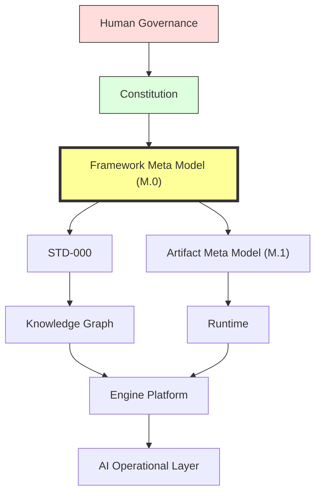
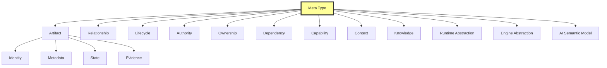
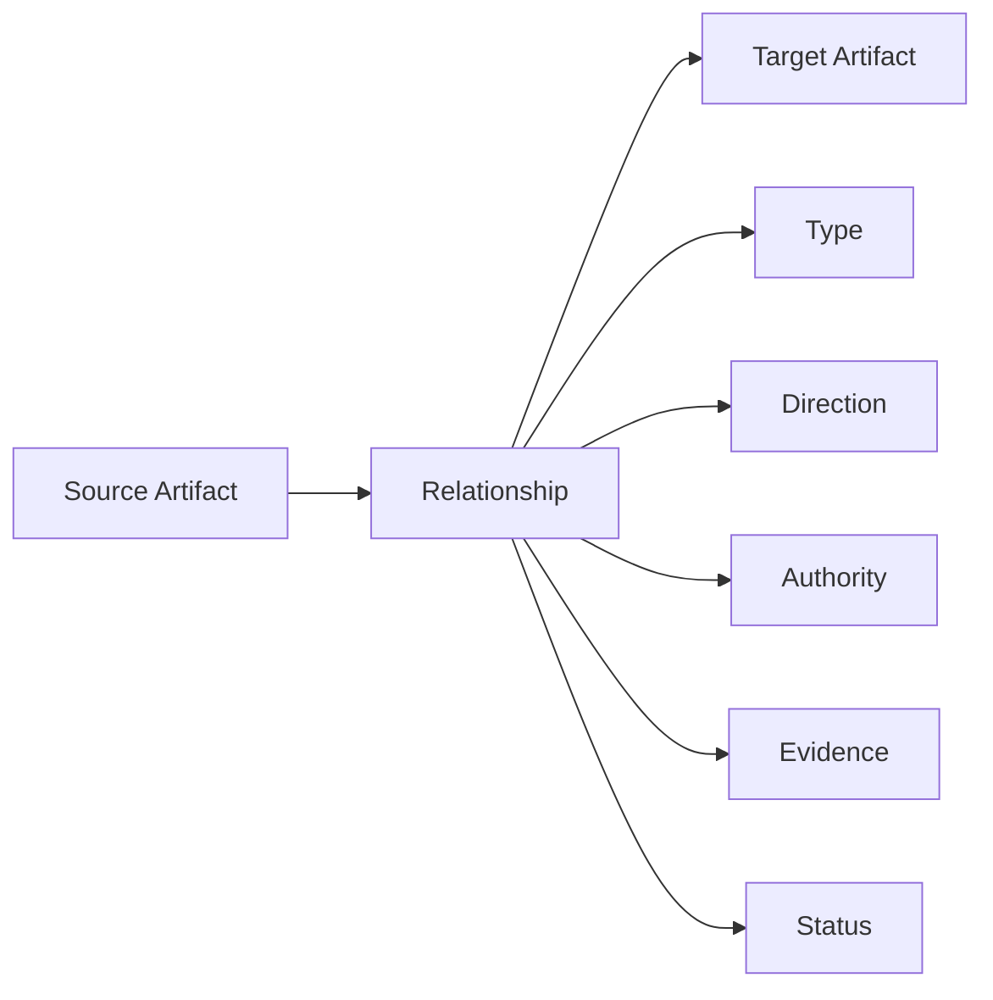
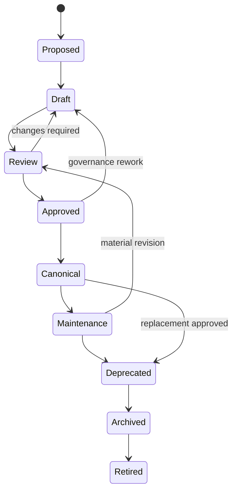
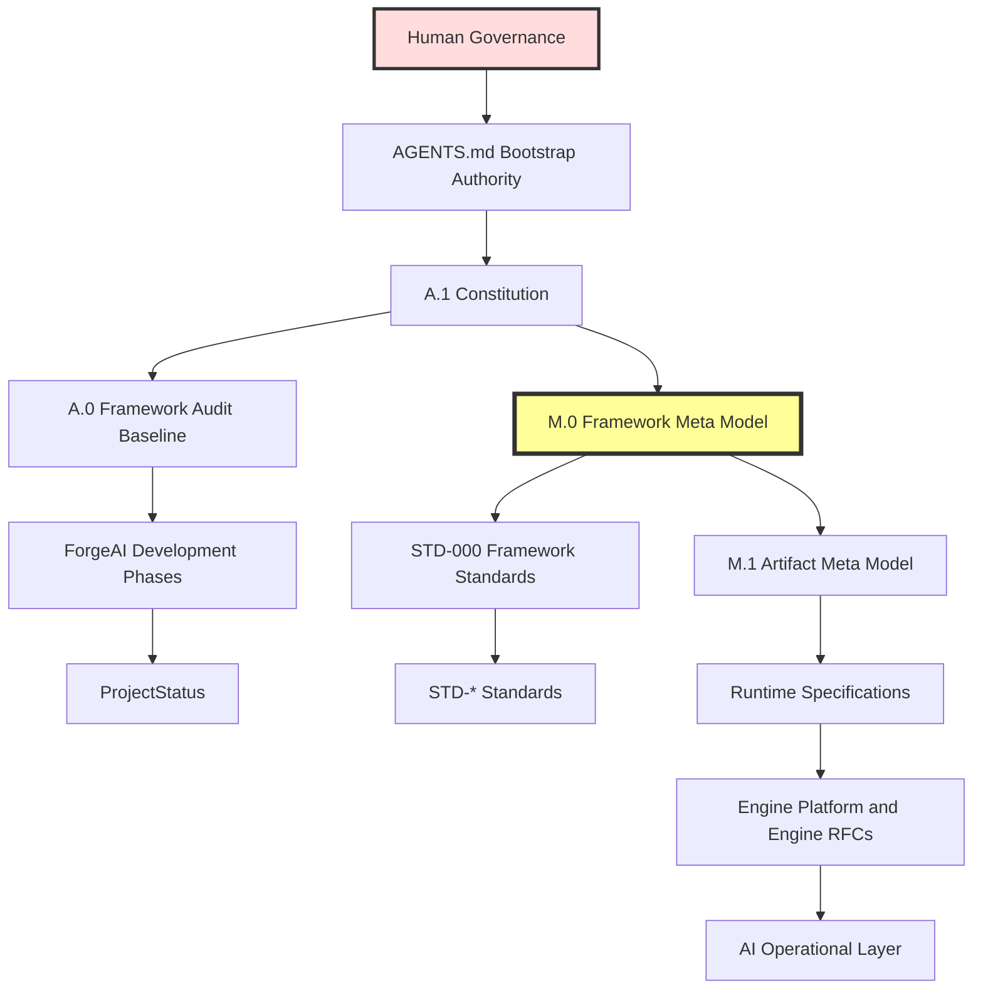
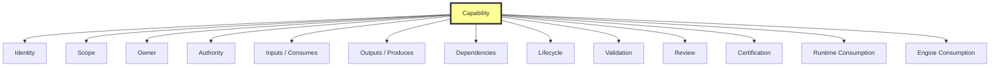
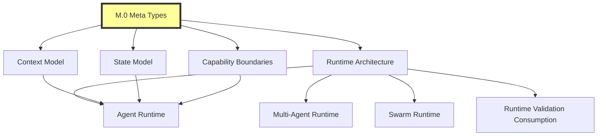
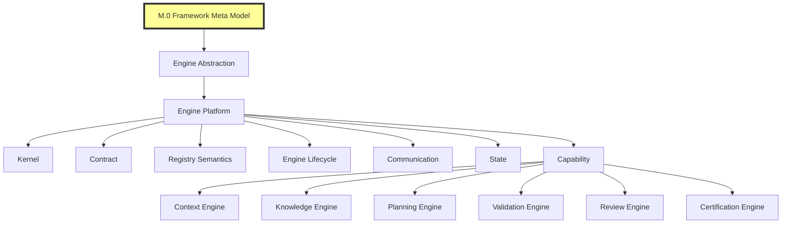
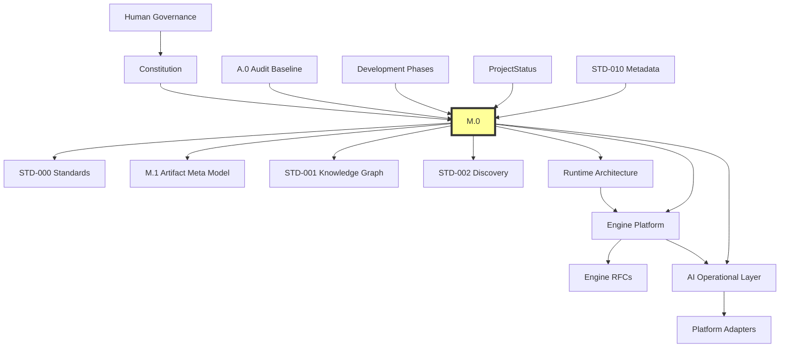

# M.0 — Framework Meta Model

> **AI-DOS v4 · Meta Foundation** 
> Canonical semantic type system forAI-DOS Architecture, Standards, Governance, Runtime, Engines, Knowledge, Context, AI Operations, Validation, Review, and Certification.

---

## Document Metadata

| Field | Value |
|:---|:---|
| Identifier | `AI-DOS-META-M.0` |
| Title | M.0 — Framework Meta Model |
| Version | 4.0.0-draft |
| Status | Draft |
| Canonical Status | Canonical candidate for Phase 1 — Meta Foundation; non-canonical until reviewed, approved, and promoted through Framework Governance |
| Classification | Framework Meta Model |
| Document Type | Meta Architecture Specification |
| Owner | Framework Governance |
| Maintainers | Framework Architecture Team |
| Review Authority | Enterprise Documentation Standards Board |
| Approval Authority | Human Governance / Framework Governance |
| Created | 2026-07-04 |
| Last Updated | 2026-07-07 |
| Lifecycle Phase | Draft |
| Traceability ID | AI-DOS-META-M.0 |
| Scope | Canonical semantic type system and dependency model forAI-DOS Framework artifacts |
| Out of Scope | Runtime implementation, engine implementation, registries, storage schemas, platform adapters, project code, and M.1 alignment |
| Normative Authority | Human Governance; `AGENTS.md`; `docs/AI/FrameworkGovernance.md`; `docs/AI/Architecture/A.1-Constitution.md`; `docs/AI/Architecture/A.0-Framework-Audit.md` |
| Normative References | `docs/Projects/ForgeAI/Planning/DevelopmentPhases.md`; `docs/Projects/ForgeAI/Planning/ProjectStatus.md`; `docs/AI/Architecture/Standards/STD-000-Framework-Standards.md`; `docs/AI/Architecture/Standards/STD-010-Document-Metadata-Standard.md` |
| Dependencies | Constitutional authority, audit baseline, roadmap scope, active project status, standards governance, metadata governance, artifact identity, lifecycle governance, and traceability model |
| Consumes | A.1 constitutional model; A.0 audit baseline; Phase 1 Meta Foundation roadmap; STD-000 standards governance; STD-010 metadata governance |
| Produces | Canonical Framework Meta Type System, artifact abstraction, identity abstraction, metadata abstraction, lifecycle abstraction, authority abstraction, ownership abstraction, relationship abstraction, dependency abstraction, capability abstraction, runtime abstraction, engine abstraction, context abstraction, knowledge abstraction, and AI semantic model |
| Related Specifications | M.1 Artifact Meta Model; STD-001 Knowledge Graph Standard; STD-002 Discovery Standard; Runtime Architecture RFC; Engine Architecture RFC family |
| Supersedes | M.0 v3 metadata-reference structure |
| Superseded By | None |
| Promotion Requirements | Framework Governance review, approval, traceability validation, metadata validation, downstream impact review, and explicit promotion |
| Certification Status | Not certified |

---

## 1. Status

M.0 is the canonical semantic model of theAI-DOS Framework.

It is the Phase 1 Meta Foundation artifact that transforms the prior metadata-oriented M.0 document into the Framework-wide type system from which all governed Framework artifacts, standards, runtime specifications, engine specifications, knowledge projections, capability models, operational documents, and platform adapter specifications derive.

M.0 is architecture-only. It does not implement runtime behavior, engine behavior, registries, storage, tooling, validation automation, project code, platform adapters, or operational commands.

### 1.1 Roadmap Position

The active roadmap position is:

| Roadmap Dimension | Current Value |
|:---|:---|
| Phase | Phase 1 — Meta Foundation |
| Stage | M.0 Framework Meta Model v3 Alignment |
| Active Work | Refactor M.0 into the v4 canonical Framework Meta Model |
| Next Queue | M.1 Alignment, then Engine RFC work |
| Frozen Areas | Legacy migration, RC2 relocation, AI Operational Layer alignment |

M.0 must not start M.1 alignment, runtime implementation, engine implementation, operational layer alignment, adapter design, or legacy migration.

### 1.2 Canonical Semantic Dependency Position

M.0 sits below constitutional authority and above downstream semantic consumers. Downstream documents consume M.0; they do not redefine its foundational concepts.

---

## 2. Purpose

The purpose of M.0 is to provide the single canonical semantic type system of AI-DOS.

M.0 exists so that every Framework artifact can answer the same foundational questions consistently:

1. What type of thing is this?
2. How is it identified?
3. Who owns it?
4. What authority governs it?
5. What lifecycle does it follow?
6. What relationships does it have?
7. What dependencies does it rely on?
8. What capability does it describe, provide, govern, validate, or consume?
9. How may Runtime, Engines, Knowledge Graphs, and AI agents consume it without redefining it?

M.0 prevents semantic duplication across Framework Core, Standards, Runtime, Engine Platform, Knowledge, Context, AI Operations, Validation, Review, Certification, and future Platform Adapter documents.

---

## 3. Design Philosophy

M.0 follows these design principles:

| Principle | Meaning |
|:---|:---|
| Constitution before meta model | M.0 expresses constitutional semantics; it does not override constitutional authority. |
| Semantics before implementation | M.0 defines meanings, types, abstractions, and dependency rules, not runtime behavior. |
| Artifact before specialization | Every governed Framework object derives from Artifact before becoming a document, standard, engine, capability, record, or operational unit. |
| Identity before reference | No artifact may be reliably referenced until it has stable identity. |
| Authority before dependency | A dependency never overrides its governing authority. |
| Ownership before execution | Execution may be delegated, but accountability remains owned. |
| Lifecycle before promotion | Artifacts must move through explicit lifecycle states before canonical or certified claims are made. |
| Relationship before inference | Relationships must be stated explicitly and must not be inferred from proximity, naming, or conversation. |
| Dependency before consumption | Consumers must know what they depend on before use. |
| AI consumes; AI does not redefine | AI agents may interpret, project, validate, and operationalize M.0, but must not create competing meta concepts. |

M.0 is intentionally platform-independent. Programming languages, databases, frameworks, editors, vendors, hosts, and product-specific architectures are outside its scope.

---

## 4. Framework Meta Type System

The Framework Meta Type System is the canonical set of semantic abstractions used to describe AI-DOS.

### 4.1 Meta Type Definition

A **Meta Type** is a canonical semantic category that defines what a governed Framework object is, what properties it must carry, what lifecycle rules apply to it, what relationships it may form, and how downstream systems may consume it.

A Meta Type is not an implementation class, database table, runtime object, registry entry, API schema, or code construct.

### 4.2 Root Meta Type Hierarchy

### 4.3 Meta Type Rules

- Every governed object shall derive from one or more M.0 Meta Types.
- Artifact is the root type for governed Framework objects.
- Relationship is the root type for governed connections between artifacts or abstractions.
- Lifecycle is the root type for governed state progression.
- Authority is the root type for governance precedence.
- Ownership is the root type for accountable responsibility.
- Dependency is the root type for required upstream concepts or artifacts.
- Capability is the root type for bounded ability, responsibility, or executable increment.
- Runtime, Engine, Context, Knowledge, and AI abstractions consume these root types.
- No downstream document may redefine a root Meta Type; downstream documents may only specialize it.

---

## 5. Canonical Meta Types

M.0 owns the following canonical Meta Types.

| Meta Type | Definition | Canonical Responsibility |
|:---|:---|:---|
| Artifact | Any governed Framework object requiring identity, ownership, lifecycle, traceability, authority, or certification. | Root abstraction for documents, standards, records, runtime descriptions, engine descriptions, capabilities, commands, workflows, templates, and operational artifacts. |
| Identity | Stable semantic reference for an artifact or abstraction. | Prevents ambiguity, reuse, and untraceable references. |
| Metadata | Structured descriptive, governance, relationship, and lifecycle information about an artifact. | Enables document governance and AI consumption. |
| Lifecycle | Governed state progression for artifacts and capabilities. | Controls draft, review, approval, canonical, maintenance, deprecation, archival, and retirement movement. |
| State | Current lifecycle position of an artifact. | Records present operational truth without relying on memory or conversation. |
| Authority | Governing precedence over interpretation, approval, and change. | Prevents lower-level documents or implementations from overriding higher authority. |
| Ownership | Accountable responsibility for artifact correctness and lifecycle. | Ensures exactly one accountable owner exists. |
| Relationship | Explicit typed connection between artifacts or abstractions. | Enables traceability, dependency analysis, governance validation, and knowledge projection. |
| Dependency | Required upstream artifact, concept, authority, or semantic model. | Separates requirement from authority and from consumption. |
| Reference | Traceable link to an artifact or source. | Distinguishes normative, informative, historical, deprecated, and external links. |
| Evidence | Verifiable support for a claim, finding, validation result, review result, or certification. | Grounds truth claims in auditable material. |
| Validation | Governed verification against defined requirements. | Produces evidence and findings; does not create authority. |
| Review | Independent readiness and governance assessment. | Consumes evidence and validation output. |
| Certification | Governed acceptance after review and validation. | May promote artifacts when governance allows. |
| Capability | Bounded semantic unit of responsibility, ability, or approved work. | Connects planning, runtime, engines, and AI operations without becoming implementation. |
| Runtime Abstraction | Semantic description of runtime responsibilities, boundaries, and consumption rules. | Allows runtime specifications to consume M.0 without redefining framework concepts. |
| Engine Abstraction | Semantic description of engine responsibilities, contracts, lifecycle, and capability boundaries. | Allows Engine Platform and engine RFCs to consume M.0 without redesigning it. |
| Context | Bounded assembled information used for interpretation or execution. | Ensures context derives from authority, state, dependencies, and relevance. |
| Knowledge | Governed reusable semantic memory or graph projection. | Specializes M.0 for long-term retrieval, discovery, and traceability. |
| AI Semantic Model | Rules by which AI agents consume, interpret, produce, validate, and report artifacts. | Prevents AI from inventing authority or competing concepts. |

---

## 6. Artifact Hierarchy

Artifact is the root abstraction for every governed thing in AI-DOS.

```mermaid
graph TD
    Artifact["Artifact"] --> Document["Document Artifact"]
    Artifact --> Governance["Governance Artifact"]
    Artifact --> Planning["Planning Artifact"]
    Artifact --> Standard["Standard Artifact"]
    Artifact --> Meta["Meta Artifact"]
    Artifact --> RuntimeDoc["Runtime Artifact"]
    Artifact --> EngineDoc["Engine Artifact"]
    Artifact --> Operational["Operational Artifact"]
    Artifact --> EvidenceArtifact["Evidence Artifact"]
    Artifact --> KnowledgeArtifact["Knowledge Artifact"]
    Artifact --> CapabilityArtifact["Capability Artifact"]

    Document --> Constitution["Constitution"]
    Document --> Audit["Audit"]
    Document --> RFC["RFC"]
    Document --> Report["Report"]
    Document --> Roadmap["Roadmap"]

    Governance --> Decision["Decision"]
    Governance --> Review["Review"]
    Governance --> Certification["Certification"]

    Planning --> Phase["Phase"]
    Planning --> Stage["Stage"]
    Planning --> Task["Task"]

    Operational --> Command["Command"]
    Operational --> Workflow["Workflow"]
    Operational --> Template["Template"]
    Operational --> Checklist["Checklist"]

    EvidenceArtifact --> Evidence["Evidence"]
    EvidenceArtifact --> Finding["Finding"]
    EvidenceArtifact --> Recommendation["Recommendation"]
    EvidenceArtifact --> Risk["Risk"]

    style Artifact fill:#ff9,stroke:#333,stroke-width:4px
```

### 6.1 Artifact Requirements

Every Artifact shall define or inherit:

- identifier;
- title or name;
- type;
- classification;
- purpose;
- scope;
- out-of-scope boundary;
- owner;
- maintainer when applicable;
- authority;
- lifecycle phase;
- current state;
- version when versioned;
- created date when applicable;
- last updated date when applicable;
- relationships;
- dependencies;
- references;
- evidence expectations when claims are made;
- validation, review, certification, or promotion expectations when applicable.

### 6.2 Artifact Rules

- If a Framework object is governed, it is an Artifact.
- If a Framework object is referenced for authority, dependency, validation, certification, traceability, or AI consumption, it shall be represented as an Artifact or as a Relationship to an Artifact.
- Artifact subtypes may add fields and lifecycle refinements but shall not remove M.0 identity, authority, ownership, relationship, and lifecycle requirements.
- Implementation objects may be represented by artifacts only when they become governed Framework objects; M.0 does not define code structures.

---

## 7. Identity Model

Identity is the stable semantic anchor for artifact traceability.

### 7.1 Identity Requirements

An identity shall be:

- unique within its governed namespace;
- stable after publication;
- never reused for a different artifact;
- reserved after deprecation or archival;
- traceable through references, dependencies, evidence, review, and certification;
- readable by humans and AI agents.

### 7.2 Identifier Families

| Family | Example | Use |
|:---|:---|:---|
| Meta | `AI-DOS-META-M.0` | Meta model documents and semantic foundations. |
| Architecture | `AI-DOS-ARCH-A.1` | Architecture and constitutional documents. |
| Audit | `AI-DOS-AUDIT-A.0` | Audit records and reports. |
| Standard | `AI-DOS-STD-000` | Standards Library documents. |
| Evidence | `EVID-000001` | Evidence records. |
| Finding | `FIND-000001` | Findings. |
| Recommendation | `REC-000001` | Recommendations. |
| Risk | `RISK-000001` | Risks. |
| Decision | `ADR-000001` | Decisions and decision records. |
| Certification | `CERT-000001` | Certification records. |
| Capability | `CAP-000001` or governed capability ID | Capability artifacts and approved increments. |

### 7.3 Identity Rules

- Identity shall not be inferred from file path alone.
- File path may support identity but shall not replace identifier metadata.
- Renaming a file shall not change artifact identity unless governance approves a new artifact.
- Deprecated identifiers remain reserved.
- Historical identifiers shall not be renumbered.

---

## 8. Relationship Model

A Relationship is a governed connection between artifacts, abstractions, authorities, or capability boundaries.

### 8.1 Relationship Diagram

### 8.2 Relationship Requirements

Every Relationship shall define:

- relationship type;
- source artifact or abstraction;
- target artifact or abstraction;
- direction;
- meaning;
- authority or rule that permits the relationship;
- evidence when the relationship supports a claim;
- lifecycle or status when material to governance.

### 8.3 Canonical Relationship Types

| Relationship Type | Meaning |
|:---|:---|
| governs | Source has authority over target interpretation, lifecycle, or approval. |
| conforms to | Source must follow target rules but target may not directly own source lifecycle. |
| depends on | Source requires target to be understood or valid. |
| consumes | Source uses target as input. |
| produces | Source creates, defines, or emits target. |
| specializes | Source narrows a broader M.0 concept without redefining it. |
| derives from | Source inherits semantic meaning from target. |
| references | Source links to target for normative, informative, historical, deprecated, or external context. |
| validates | Source verifies target against requirements. |
| reviews | Source independently assesses target. |
| certifies | Source records governed acceptance of target. |
| blocks | Source prevents target progression. |
| blocked by | Source cannot progress until target is resolved. |
| supersedes | Source replaces target. |
| superseded by | Source has been replaced by target. |

### 8.4 Relationship Rules

- Authority relationships are not the same as dependency relationships.
- Informative references do not create authority.
- Consumption does not create ownership.
- Production does not imply approval.
- Validation does not imply certification.
- Certification must not occur without required review and evidence.
- AI agents shall not infer unstated relationships when reporting compliance.

---

## 9. Lifecycle Model

Lifecycle describes governed state progression for artifacts and capabilities.

### 9.1 Canonical Lifecycle States

| State | Meaning |
|:---|:---|
| Proposed | Concept exists but is not yet a working artifact. |
| Draft | Artifact is being authored or refactored. |
| Review | Artifact is under independent readiness and governance review. |
| Approved | Artifact has approval but is not necessarily canonical. |
| Canonical | Artifact is the approved source of truth for its scope. |
| Maintenance | Canonical or approved artifact is receiving governed upkeep. |
| Deprecated | Artifact remains traceable but should not be used for new work. |
| Archived | Artifact is preserved for history and audit. |
| Retired | Artifact is no longer active but identity remains reserved. |

### 9.2 Lifecycle Rules

- State shall be explicit.
- State shall not be inferred from conversation, branch name, or assumed roadmap position.
- Promotion requires defined review and approval evidence.
- Canonical status requires governance approval.
- Certification status requires certification evidence.
- Specialized lifecycles shall remain compatible with this lifecycle.

---

## 10. Authority Model

Authority defines who or what may define, interpret, approve, promote, or change an artifact.

### 10.1 Authority Rules

- Human Governance remains the highest authority.
- Constitutional authority governs M.0.
- M.0 defines semantic foundations below the Constitution.
- STD-000 consumes M.0 for standards governance.
- M.1 specializes M.0 for artifacts.
- Runtime, Engines, Knowledge Graphs, and AI Operations consume M.0 and specialized downstream models.
- Lower authority documents shall not redefine higher authority concepts.
- Implementation, runtime behavior, engine design, or project code shall not define Framework semantics.

---

## 11. Ownership Model

Ownership is accountable responsibility for artifact correctness, governance alignment, lifecycle maintenance, and promotion readiness.

### 11.1 Ownership Requirements

Every Artifact shall have:

- one accountable owner;
- maintainers when applicable;
- review authority when review is required;
- approval authority when approval or promotion is possible;
- escalation path when ownership is unclear.

### 11.2 Ownership Rules

- Ownership may delegate work but not accountability.
- Shared maintenance does not create shared accountability unless governance explicitly defines an accountable body.
- Ownership changes require governance approval when the artifact is authoritative, canonical, or certification-bearing.
- AI agents may perform work on artifacts but do not become owners unless explicitly assigned by governance.

---

## 12. Capability Model

A Capability is a bounded semantic unit of responsibility, ability, or approved work within the Framework.

Capabilities connect planning, runtime, engines, validation, review, certification, and AI operations without becoming implementation code.

### 12.1 Capability Requirements

A Capability shall define:

- stable identity;
- purpose;
- scope;
- out-of-scope boundaries;
- owner;
- authority;
- required inputs;
- produced outputs;
- dependencies;
- lifecycle state;
- validation expectations;
- review expectations;
- certification expectations when applicable;
- downstream consumers.

### 12.2 Capability Rules

- Capabilities do not redefine Framework semantics.
- Capabilities derive type, identity, lifecycle, authority, ownership, relationship, and dependency rules from M.0.
- Runtime and Engines may execute or coordinate capabilities only after consuming their semantic boundaries.
- Capability identifiers are immutable after certification.

---

## 13. Runtime Integration

Runtime consumes M.0 as semantic authority for runtime specifications and runtime-coordinated artifacts.

M.0 does not define runtime execution behavior. It defines the semantic abstractions Runtime must preserve.

### 13.1 Runtime Consumption Rules

Runtime shall consume M.0 for:

- artifact identity;
- lifecycle state interpretation;
- authority resolution;
- ownership accountability;
- relationship traversal;
- dependency interpretation;
- capability boundaries;
- context assembly semantics;
- knowledge consumption semantics;
- validation, review, and certification evidence semantics.

Runtime shall not:

- redefine Artifact, Identity, Metadata, Lifecycle, Authority, Ownership, Relationship, Dependency, Capability, Context, Knowledge, Evidence, Validation, Review, or Certification;
- promote artifacts without governance;
- treat operational execution as architectural authority;
- infer authority from runtime availability.

---

## 14. Engine Integration

Engines consume M.0 through Framework, Runtime, and Engine Platform specifications.

M.0 does not design or implement engines. It defines the semantic boundaries engine specifications shall preserve.

### 14.1 Engine Consumption Rules

Engine specifications shall consume M.0 for:

- engine artifact identity;
- engine ownership;
- engine authority boundaries;
- engine lifecycle semantics;
- engine capability definitions;
- engine dependency relationships;
- engine contract semantics;
- engine-produced evidence, findings, reviews, and certifications.

Engine specifications shall not:

- redesign M.0;
- define new root meta concepts;
- bypass Runtime and Framework authority;
- make implementation behavior the source of semantic truth;
- introduce platform-specific assumptions into Framework semantics.

---

## 15. AI Consumption Rules

AI agents are consumers of M.0.

AI agents may use M.0 to plan, interpret, refactor, validate, review, summarize, and report Framework artifacts. AI agents shall not redefine M.0 concepts or create competing semantic models.

### 15.1 AI Rules

AI agents shall:

- read applicable authority before work;
- derive active scope from roadmap and project status;
- preserve architecture-only boundaries when requested;
- treat M.0 as the semantic foundation for downstream artifacts;
- distinguish authority, normative references, dependencies, consumes, produces, and related specifications;
- report blockers when authority, ownership, lifecycle, or scope is unclear;
- cite validation evidence honestly;
- avoid project state updates unless explicitly in scope and certified.

AI agents shall not:

- modify ProjectStatus during M.0 alignment;
- start M.1 alignment during M.0 alignment;
- implement runtime, engines, registries, tooling, adapters, or project code;
- infer canonical status without approval;
- treat draft documents as promoted authority unless the active governance chain permits transitional use;
- create hidden dependencies or unstated relationships.

---

## 16. Dependency Matrix

The following matrix defines canonical dependency and consumption expectations.

| Consumer | Depends On | Consumes | Produces | May Redefine M.0? |
|:---|:---|:---|:---|:---|
| Constitution | Human Governance | Governance intent and constitutional principles | Constitutional authority | No |
| M.0 | Constitution, A.0 audit baseline, roadmap scope, ProjectStatus scope, STD-000, STD-010 | Constitutional semantics and standards metadata rules | Framework Meta Type System | No |
| STD-000 | Constitution, M.0 | Meta Types and governance semantics | Standards governance model | No |
| M.1 | Constitution, M.0, STD-010 | Artifact, identity, metadata, relationship, lifecycle, ownership, authority concepts | Specialized Artifact Meta Model | No |
| STD-001 Knowledge Graph | M.0, STD-000, M.1 when applicable | Artifact and relationship semantics | Knowledge graph projection rules | No |
| STD-002 Discovery | M.0, STD-000, M.1 when applicable | Artifact and evidence semantics | Discovery specialization | No |
| Runtime Architecture | Constitution, M.0, M.1 when applicable | Meta Types, artifact semantics, context and capability abstractions | Runtime semantic architecture | No |
| Engine Platform | Constitution, M.0, Runtime Architecture | Engine abstraction, capability boundaries, lifecycle, dependency semantics | Engine platform architecture | No |
| Engine RFCs | M.0, Runtime, Engine Platform | Engine semantic boundaries and capability definitions | Engine-specific architecture | No |
| AI Operational Layer | AGENTS.md, AI Framework, Runtime, Engine Platform, M.0 | Commands, workflows, context, state, capability and evidence semantics | Operational execution artifacts | No |
| Platform Adapters | Constitution, M.0, Runtime, Engine Platform, operational layer | Framework semantics and adapter boundaries | Platform-specific mappings | No |

### 16.1 Dependency Graph

---

## 17. Migration Notes

M.0 v4 replaces the prior M.0 structure as a semantic architecture specification rather than a metadata reference document.

### 17.1 Migration Intent

The migration intent is to:

- establish M.0 as the canonical Framework Meta Type System;
- make downstream artifacts derive from M.0;
- normalize authority, relationship, lifecycle, ownership, dependency, and capability terminology;
- prepare for M.1 Artifact Meta Model alignment;
- support later standards, runtime, engine, knowledge graph, and operational alignment without implementing them.

### 17.2 Migration Boundaries

This migration does not:

- modify A.1 Constitution;
- modify A.0 Framework Audit;
- modify STD-000;
- modify STD-010;
- modify Runtime Architecture RFCs;
- modify Engine Architecture RFCs;
- modify ProjectStatus;
- modify ForgeAI-DevelopmentPhases;
- align M.1;
- relocate RC2 material;
- implement code, registries, engines, runtime, validation tooling, or adapters.

### 17.3 Downstream Migration Expectations

After M.0 is reviewed and approved, downstream work should align in roadmap order:

1. M.1 Artifact Meta Model specializes M.0 Artifact semantics.
2. STD-003 Terminology normalizes terms against M.0.
3. Standards Foundation consumes M.0 and M.1 consistently.
4. Runtime and Engine RFC work consumes M.0 without redefining meta concepts.
5. AI Operational Layer alignment occurs only when its roadmap phase becomes active.
6. Legacy migration remains frozen until Phase 12 conditions are met.

---

## 18. Quality Gates

M.0 quality gates are documentation and architecture quality gates.

| Gate | Requirement | Status Expectation |
|:---|:---|:---|
| Roadmap compliance | Work remains within Phase 1 — M.0 alignment. | Required |
| Scope compliance | No runtime, engine, registry, adapter, project code, ProjectStatus, or roadmap modification. | Required |
| Metadata compliance | Metadata follows STD-010 fields and relationship separation. | Required |
| Authority compliance | M.0 remains below Constitution and above downstream semantic consumers. | Required |
| Type completeness | Required root Meta Types are present. | Required |
| Diagram completeness | Required Mermaid diagrams are present. | Required |
| Dependency normalization | Authority, dependency, consumes, produces, and related specifications are separated. | Required |
| AI consumption clarity | AI rules prohibit semantic redefinition and out-of-scope implementation. | Required |
| Migration clarity | Downstream sequencing is documented without advancing roadmap state. | Required |

### 18.1 Required Validation Evidence

A completion report for M.0 alignment should include evidence that:

- only `docs/AI/Meta/M.0-Framework-Meta-Model.md` was modified;
- no forbidden files were modified;
- required chapters exist;
- required Mermaid diagrams exist;
- architecture-only boundaries were preserved;
- git diff was reviewed.

---

## 19. Success Criteria

M.0 alignment is successful when:

- M.0 is the canonical semantic model of AI-DOS;
- every Framework artifact can derive from the Framework Meta Type System;
- M.0 owns Framework Meta Types, hierarchy, artifact abstraction, identity abstraction, metadata abstraction, lifecycle abstraction, authority abstraction, ownership abstraction, relationship abstraction, dependency abstraction, capability abstraction, runtime abstraction, engine abstraction, context abstraction, knowledge abstraction, and AI semantic model;
- Runtime, Engines, Knowledge Graph, Standards, M.1, and AI Operations consume M.0 without redefining M.0 concepts;
- authority, ownership, lifecycle, relationship, dependency, and capability concepts are normalized;
- required diagrams are present and publication quality;
- migration notes prepare future M.1 and standards alignment without performing that work;
- the document remains platform-independent and implementation-free;
- the work remains within the active Phase 1 M.0 roadmap stage.

---

## Appendix A — Terminology Normalization

| Preferred Term | Avoid | Reason |
|:---|:---|:---|
| Artifact | Object, thing, item when governed meaning is intended | Artifact is the root governed abstraction. |
| Meta Type | Class, database table, runtime object | M.0 is semantic, not implementation. |
| Authority | Dependency, reference | Authority governs interpretation and approval. |
| Dependency | Authority | Dependency is required input, not governance precedence. |
| Consumes | Depends on when input use is intended | Consumption means use as input. |
| Produces | Owns | Production creates or defines output; ownership is accountability. |
| Canonical | Current, latest, active | Canonical requires governance approval. |
| Lifecycle State | Status by assumption | State must be explicit and traceable. |
| Capability | Feature, task, implementation unit | Capability is bounded semantic ability or responsibility. |

---

## Appendix B — Non-Goals

M.0 does not:

- implement runtime or engine behavior;
- define storage schemas;
- define registry mechanics;
- define APIs;
- define platform-specific behavior;
- relocate legacy material;
- update project state;
- certify itself;
- approve downstream documents;
- align M.1 during this stage.
