# M.1 — Artifact Meta Model

> Forge AI v4 · Meta Foundation
> Canonical Artifact Specialization Layer · Draft / Governance Candidate

---

## Document Metadata

| Field | Value |
|:---|:---|
| Identifier | `FORGE-META-001` |
| Title | M.1 — Artifact Meta Model |
| Version | 4.0.0-draft |
| Status | Draft; canonical candidate for Phase 1 — Meta Foundation |
| Canonical Status | Non-canonical until reviewed, approved, and promoted through Framework Governance |
| Classification | Meta Foundation / Artifact Type System |
| Document Type | Artifact Meta Model |
| Owner | Framework Governance |
| Maintainers | Framework Architecture Team |
| Review Authority | Enterprise Documentation Standards Board |
| Approval Authority | Human Governance / Framework Governance |
| Created | 2026-07-06 |
| Last Updated | 2026-07-07 |
| Lifecycle Phase | Draft |
| Traceability ID | `FORGE-META-001` |
| Scope | Concrete artifact type system derived from M.0 |
| Out of Scope | Runtime implementation, engine implementation, registries, tooling, automation, validation scripts, project code, file movement, and legacy migration |
| Normative Authority | Human Governance; `AGENTS.md`; A.1 Constitution; A.0 Framework Audit; active Phase 1 roadmap |
| Normative References | A.1; A.0; M.0; STD-000; STD-010; STD-001; STD-002 |
| Dependencies | M.0 abstract semantic type system, document metadata governance, standards governance, knowledge graph governance, discovery governance |
| Consumes | M.0 abstract meta types and higher-authority governance |
| Produces | Governed artifact families, artifact specialization rules, artifact identity, metadata, lifecycle, authority, ownership, relationship, and traceability contracts |
| Related Specifications | STD-000; STD-010; STD-001; STD-002; A.3; A.4 RFC family |
| Supersedes | Prior M.1 draft structure while preserving valid artifact concepts |
| Superseded By | None |
| Promotion Requirements | Framework Governance review, approval, metadata validation, relationship validation, traceability validation, and explicit promotion |
| Certification Status | Not certified |

---

## Revision History

| Version | Date | Author | Description |
|:---|:---|:---|:---|
| 0.1.0-draft | 2026-07-06 | Framework Architecture Team | Initial foundation draft for M.1 Artifact Meta Model. |
| 4.0.0-draft | 2026-07-07 | Framework Architecture Team | Refactored into the Forge AI v4 canonical artifact specialization layer derived from M.0. |

---

## Table of Contents

1. [Status](#1-status)
2. [Purpose](#2-purpose)
3. [Design Philosophy](#3-design-philosophy)
4. [Relationship to M.0](#4-relationship-to-m0)
5. [Artifact Type System](#5-artifact-type-system)
6. [Artifact Families](#6-artifact-families)
7. [Artifact Identity Model](#7-artifact-identity-model)
8. [Artifact Metadata Model](#8-artifact-metadata-model)
9. [Artifact Lifecycle Model](#9-artifact-lifecycle-model)
10. [Artifact Authority Model](#10-artifact-authority-model)
11. [Artifact Ownership Model](#11-artifact-ownership-model)
12. [Artifact Relationship Model](#12-artifact-relationship-model)
13. [Artifact Traceability Model](#13-artifact-traceability-model)
14. [Knowledge Artifact Model](#14-knowledge-artifact-model)
15. [Runtime Artifact Model](#15-runtime-artifact-model)
16. [Engine Artifact Model](#16-engine-artifact-model)
17. [Validation Artifact Model](#17-validation-artifact-model)
18. [Review Artifact Model](#18-review-artifact-model)
19. [Certification Artifact Model](#19-certification-artifact-model)
20. [Registry Artifact Model](#20-registry-artifact-model)
21. [Planning Artifact Model](#21-planning-artifact-model)
22. [Operational Artifact Boundary](#22-operational-artifact-boundary)
23. [Legacy / Historical Artifact Boundary](#23-legacy--historical-artifact-boundary)
24. [AI Consumption Rules](#24-ai-consumption-rules)
25. [Dependency Matrix](#25-dependency-matrix)
26. [Migration Notes](#26-migration-notes)
27. [Quality Gates](#27-quality-gates)
28. [Success Criteria](#28-success-criteria)
29. [Completion Checklist](#29-completion-checklist)

---

# 1. Status

M.1 is the Forge AI v4 Artifact Meta Model candidate for Phase 1 — Meta Foundation. It is the concrete artifact type system beneath [M.0 — Framework Meta Model](./M.0-Framework-Meta-Model.md) and above standards, knowledge graph projections, runtime artifacts, engine artifacts, registries, validation outputs, review records, certification packages, planning artifacts, operational artifacts, and historical artifacts.

M.1 remains a governance candidate until approved and promoted. It does not alter project state, certify itself, implement tooling, move files, or replace RC2 operational procedures.

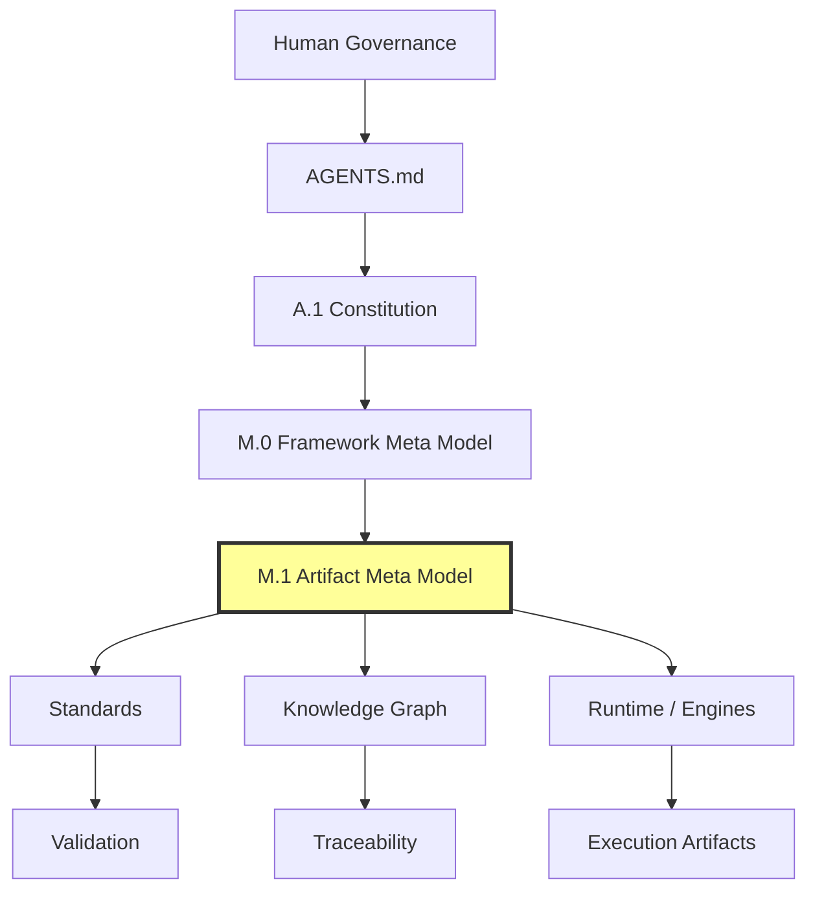

*Figure 1-1: M.0 to M.1 dependency and downstream consumers.*

# 2. Purpose

M.1 defines the canonical concrete artifact specialization layer for Forge AI. M.0 defines abstract semantic types; M.1 specializes those types into governed artifact families and artifact type rules.

M.1 exists so every standard, RFC, report, audit, schema, registry entry, validation result, review record, certification package, runtime record, engine record, planning document, operational document, and historical document can be classified consistently without inventing competing artifact semantics.

M.1 shall:

- define artifact families;
- define artifact specializations;
- define artifact identity, metadata, lifecycle, authority, ownership, relationship, and traceability rules;
- classify knowledge, runtime, engine, workflow, validation, review, certification, registry, planning, operational, and legacy artifacts;
- provide downstream consumers with a common artifact vocabulary;
- prevent standards, runtime, engines, registries, tools, agents, and graph projections from redefining artifact semantics.

M.1 shall not define implementation behavior, runtime engines, registries, tooling, automation, validation scripts, storage systems, serialization formats, project code, or file movement.

# 3. Design Philosophy

An Artifact is a governed knowledge object. It may be represented by a document, record, schema, graph node, registry entry, runtime trace, engine output, checklist, package, or status entry, but the representation is not the artifact itself.

M.1 follows these principles:

1. **M.0 before M.1** — abstract semantic concepts remain owned by M.0.
2. **Artifact families before specializations** — concrete artifact types are grouped by governed family.
3. **Governance before representation** — artifact authority, ownership, lifecycle, and traceability exist before files, records, nodes, or registry entries.
4. **Consumption without redefinition** — standards, knowledge graph, runtime, engines, and registries consume artifact types; they do not create competing roots.
5. **Operational boundary protection** — operational layer artifacts are classified but not promoted into Framework Core by classification alone.
6. **Legacy freeze preservation** — legacy and RC2 materials can be classified without being moved, rewritten, or migrated.

# 4. Relationship to M.0

M.0 defines the abstract semantic type system for the Framework. M.1 specializes M.0 into concrete artifact types.

M.1 shall not introduce new root meta types. M.1 shall not redefine Identity, Lifecycle, Authority, Ownership, Relationship, Capability, Runtime, Engine, Agent, Project, State, Context, Knowledge, Memory, Validation, Review, Certification, or Registry. M.1 may specialize only through governed artifact families.

| M.0 Abstract Concept | M.1 Artifact Specialization |
|:---|:---|
| Artifact | Concrete artifact families and artifact types |
| Identity | Artifact identifier, version, canonical path, aliases, and traceability ID |
| Lifecycle | Artifact lifecycle states and allowed transitions |
| Authority | Artifact authority chain, normative references, and conflict precedence |
| Ownership | Artifact owner, maintainer, reviewer, approver, and steward roles |
| Relationship | Artifact relationship types and graph-projection-safe relationship rules |
| Capability | Capability as planning artifact or engine capability declaration, not a redefined M.0 capability |
| Runtime | Runtime artifacts consumed by A.3 and produced by governed runtime activity |
| Engine | Engine artifacts consumed by A.4 family and produced by governed engine activity |
| Agent | Operational or runtime participant references, not independent authority |
| Project | Planning and status artifacts that record governed project state |

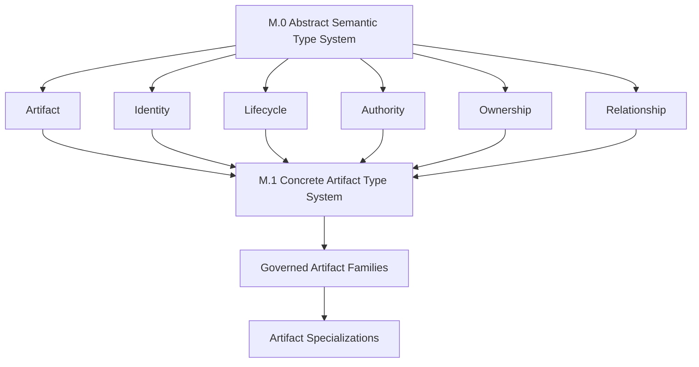

*Figure 4-1: M.1 specializes M.0 without redefining M.0 roots.*

# 5. Artifact Type System

The M.1 artifact type system has four layers:

1. **Artifact Root** — the M.0 Artifact concept consumed by M.1.
2. **Artifact Family** — a governed grouping that owns related artifact specializations.
3. **Artifact Type** — a concrete named specialization such as Discovery, Validation Result, Engine Contract, or Project Status.
4. **Artifact Instance** — a particular document, record, node projection, registry entry, or package with identity and metadata.

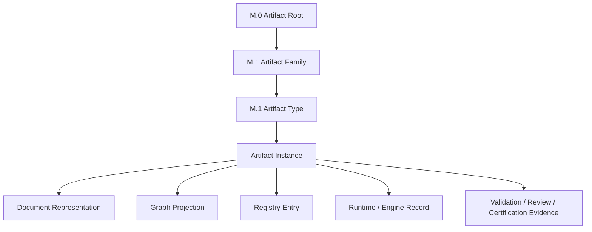

*Figure 5-1: Artifact type hierarchy.*

All artifact types shall declare:

- artifact family;
- artifact type;
- identity;
- metadata;
- lifecycle state;
- authority;
- owner;
- relationships;
- traceability;
- validation expectations;
- review expectations when applicable;
- certification expectations when applicable;
- representation boundaries.

# 6. Artifact Families

M.1 defines the following governed artifact families. Future families require governance approval and M.1 amendment.

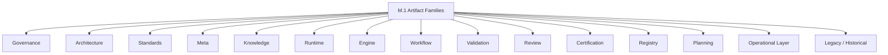

*Figure 6-1: Artifact family map.*

| Family | Purpose | Examples |
|:---|:---|:---|
| Governance Artifacts | Record governing authority, policies, decisions, compliance, and amendments. | Constitution; Governance Policy; Authority Model; Decision Record; Compliance Matrix; Amendment Record |
| Architecture Artifacts | Describe architecture proposals, maps, specifications, and architectural decisions. | Architecture RFC; Framework Architecture Specification; Runtime Architecture RFC; Engine Architecture RFC; Blueprint; Architecture Map; Architecture Decision Record |
| Standards Artifacts | Define governed standards consumed by artifacts, graph, runtime, engines, and operations. | Framework Standard; Technical Standard; Metadata Standard; Graph Standard; Discovery Standard; Terminology Standard; Schema Standard |
| Meta Artifacts | Define framework semantic models, artifact models, type systems, taxonomies, and glossaries. | Framework Meta Model; Artifact Meta Model; Type System; Taxonomy; Glossary |
| Knowledge Artifacts | Capture observed, derived, or decided knowledge. | Discovery; Finding; Evidence; Risk; Recommendation; Decision; Knowledge Node; Knowledge Edge; Graph Projection |
| Runtime Artifacts | Record runtime context, invocation, state, traces, failures, and handoffs. | Runtime Context; Runtime Invocation Record; Runtime State Snapshot; Runtime Trace; Runtime Failure Record; Runtime Handoff |
| Engine Artifacts | Declare, register, observe, invoke, trace, and capture engine outputs. | Engine Contract; Engine Registration; Engine Capability Declaration; Engine Lifecycle Record; Engine State Snapshot; Engine Communication Record; Engine Invocation Record; Engine Artifact Output; Engine Trace |
| Workflow Artifacts | Define or record planned execution procedures and handoffs. | Workflow; Command; Task; Task Plan; Execution Plan; Handoff Record |
| Validation Artifacts | Record validation expectations, evidence, results, reports, checklists, and gates. | Validation Result; Validation Evidence; Validation Checklist; Validation Report; Quality Gate Result |
| Review Artifacts | Record independent readiness assessment and verdicts. | Review Record; Review Finding; Review Verdict; Review Checklist |
| Certification Artifacts | Package and record certification evidence and decisions. | Certification Package; Certification Record; Certification Decision; Certification Evidence; Certification Checklist |
| Registry Artifacts | Record discoverability, indexing, synchronization, and resolution. | Registry Entry; Registry Snapshot; Registry Index; Registry Synchronization Record; Registry Resolution Record |
| Planning Artifacts | Record roadmap, phase, stage, capability, status, and migration planning. | Roadmap; Phase; Stage; Capability; Historical Capability; Project Status; Migration Plan |
| Operational Artifacts | Support agent operation and workflow execution; they are Operational Layer artifacts, not Framework Core artifacts. | Agent System Prompt; AI Framework Entry Point; AI Orchestrator Document; Agent Command; Agent Workflow; Agent Template |
| Legacy / Historical Artifacts | Preserve historical, deprecated, archived, transitional, or frozen material. | Legacy Document; Historical Document; Deprecated Artifact; Archived Artifact; RC2 Transitional Artifact |

# 7. Artifact Identity Model

Artifact identity specializes M.0 Identity for artifacts. It does not redefine Identity.

Every governed artifact instance shall identify:

- `identifier` — stable governance identifier when assigned;
- `title` — human-readable artifact title;
- `artifact_family` — one M.1 family;
- `artifact_type` — concrete M.1 type;
- `version` — governed version or draft marker;
- `canonical_path` — canonical document path when file-backed;
- `canonical_status` — canonical, candidate, draft, deprecated, archived, or transitional status;
- `traceability_id` — governance trace ID;
- `aliases` — prior names or alternate references when relevant;
- `supersedes` and `superseded_by` — replacement relationships when applicable.

Identity invariants:

- identity is explicit;
- identity is stable enough for governance use;
- identity is independent of temporary runtime context;
- identity is not created by graph projection alone;
- identity is not changed by file movement unless governance authorizes the movement;
- legacy identity is preserved while legacy movement remains frozen.

# 8. Artifact Metadata Model

Artifact metadata specializes M.0 metadata and consumes STD-010. M.1 defines the required artifact metadata categories; STD-010 governs document metadata field rules.

Required metadata categories are:

| Category | Required Content |
|:---|:---|
| Identity Metadata | Identifier, title, family, type, version, canonical path, traceability ID |
| Authority Metadata | authority chain, normative authority, normative references, conflict rules |
| Lifecycle Metadata | lifecycle phase, status, canonical status, certification status |
| Ownership Metadata | owner, maintainers, review authority, approval authority |
| Relationship Metadata | dependencies, consumes, produces, related specifications, supersession |
| Traceability Metadata | upstream source, downstream consumers, evidence links, registry links, graph projection links |
| Validation Metadata | validation requirements, quality gates, validation status |
| Review Metadata | review expectations, review authority, review status when applicable |
| Certification Metadata | certification expectations, certification status when applicable |
| Boundary Metadata | scope, out of scope, implementation boundary, legacy boundary when applicable |

Metadata shall be explicit, governed, synchronized with lifecycle changes, and understandable to humans and AI agents.

# 9. Artifact Lifecycle Model

Artifact lifecycle specializes M.0 Lifecycle for artifact governance. Specialized standards may refine lifecycle states but shall map back to this lifecycle.

Canonical artifact lifecycle:

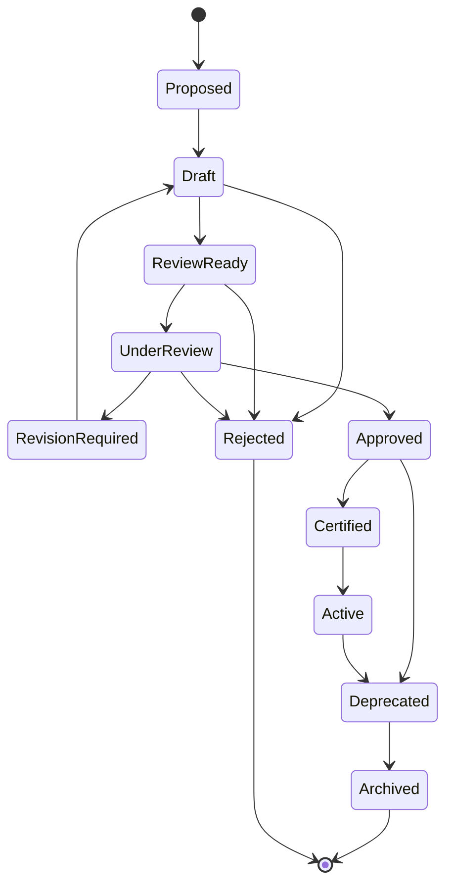

*Figure 9-1: Artifact lifecycle.*

Lifecycle invariants:

- artifacts cannot self-certify;
- AI agents cannot certify artifacts;
- failed validation blocks review-ready and certification claims;
- review does not implement new scope;
- certification requires evidence;
- Project Status updates require safe certification conditions where applicable;
- legacy movement remains frozen unless the roadmap permits migration.

# 10. Artifact Authority Model

Artifact authority specializes M.0 Authority for artifacts.

Authority is evaluated in this order:

1. Human Governance;
2. `AGENTS.md`;
3. A.1 Constitution;
4. A.0 Framework Audit;
5. active roadmap and ProjectStatus constraints;
6. M.0 Framework Meta Model;
7. M.1 Artifact Meta Model;
8. governing standards;
9. standards specializations, RFCs, reports, registries, workflows, runtime artifacts, engine artifacts, and operational artifacts.

Lower-authority artifacts shall not redefine higher-authority artifacts. A downstream consumer may specialize within scope but may not change artifact identity, lifecycle, authority, ownership, or relationship semantics unless governance amends M.1.

# 11. Artifact Ownership Model

Artifact ownership specializes M.0 Ownership for artifact stewardship.

Every governed artifact shall declare:

- **Owner** — accountable governance owner;
- **Maintainers** — responsible authors or maintenance group;
- **Review Authority** — party responsible for independent readiness review;
- **Approval Authority** — party empowered to approve or promote;
- **Consumers** — downstream artifacts, systems, or processes that rely on the artifact;
- **Stewards** — optional custodians of registry, graph, or archival representation.

Ownership invariants:

- owners do not override authority;
- maintainers do not self-certify;
- runtime and engines do not own governing standards;
- registries index artifacts but do not own artifact truth;
- graph projections represent artifact relationships but do not own artifact semantics.

# 12. Artifact Relationship Model

Artifact relationships specialize M.0 Relationship. STD-001 may represent relationships as graph edges, but M.1 owns artifact relationship semantics.

Required relationship classes:

| Relationship | Meaning |
|:---|:---|
| `derives_from` | Artifact specializes or inherits from an upstream artifact. |
| `governed_by` | Artifact is subject to an authority or standard. |
| `depends_on` | Artifact requires another artifact to be understood or valid. |
| `consumes` | Artifact uses another artifact as input. |
| `produces` | Artifact creates or defines downstream artifacts. |
| `validates` | Artifact evaluates conformance of another artifact. |
| `reviews` | Artifact records independent assessment of another artifact. |
| `certifies` | Artifact records certification decision or package for another artifact. |
| `references` | Artifact cites another artifact without dependency. |
| `supersedes` | Artifact replaces an earlier artifact. |
| `projects_to` | Artifact has graph, registry, schema, or operational projection. |
| `traces_to` | Artifact links to evidence, source, decision, task, or outcome. |

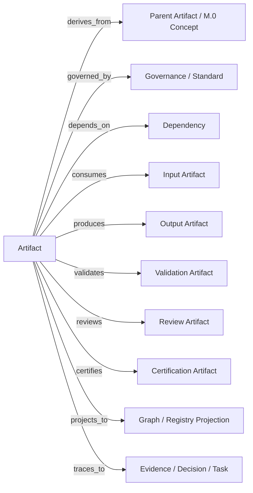

*Figure 12-1: Artifact relationship model.*

# 13. Artifact Traceability Model

Traceability links artifacts to source authority, evidence, decisions, validation, review, certification, registry entries, graph projections, tasks, and downstream consumers.

Minimum traceability requirements:

- upstream authority references;
- source documents or source observations;
- artifact relationships;
- validation evidence;
- review evidence when applicable;
- certification evidence when applicable;
- registry references when registered;
- graph projection references when projected;
- migration or historical references when applicable.

Traceability shall be bidirectional where governance requires impact analysis. Traceability does not make a lower-authority artifact canonical.

# 14. Knowledge Artifact Model

Knowledge Artifacts capture observed, analyzed, represented, or decided knowledge. Discovery is a Knowledge Artifact. Finding, Evidence, Risk, Recommendation, Decision, Knowledge Node, Knowledge Edge, and Graph Projection are Knowledge Artifacts or knowledge representations governed by M.1.

STD-001 Knowledge Graph consumes M.1 artifact types. Graph nodes may represent artifacts. Graph edges may represent M.0 and M.1 relationships. STD-001 shall not redefine artifact identity, lifecycle, authority, or ownership.

Discovery, Finding, Evidence, Risk, Recommendation, Decision, Validation, and Certification are artifact specializations governed by M.1 and graph representations governed by STD-001.

STD-002 specializes Discovery but does not redefine Artifact. Discovery lifecycle, metadata, ownership, and traceability derive from M.1. Discovery graph projection derives from STD-001.

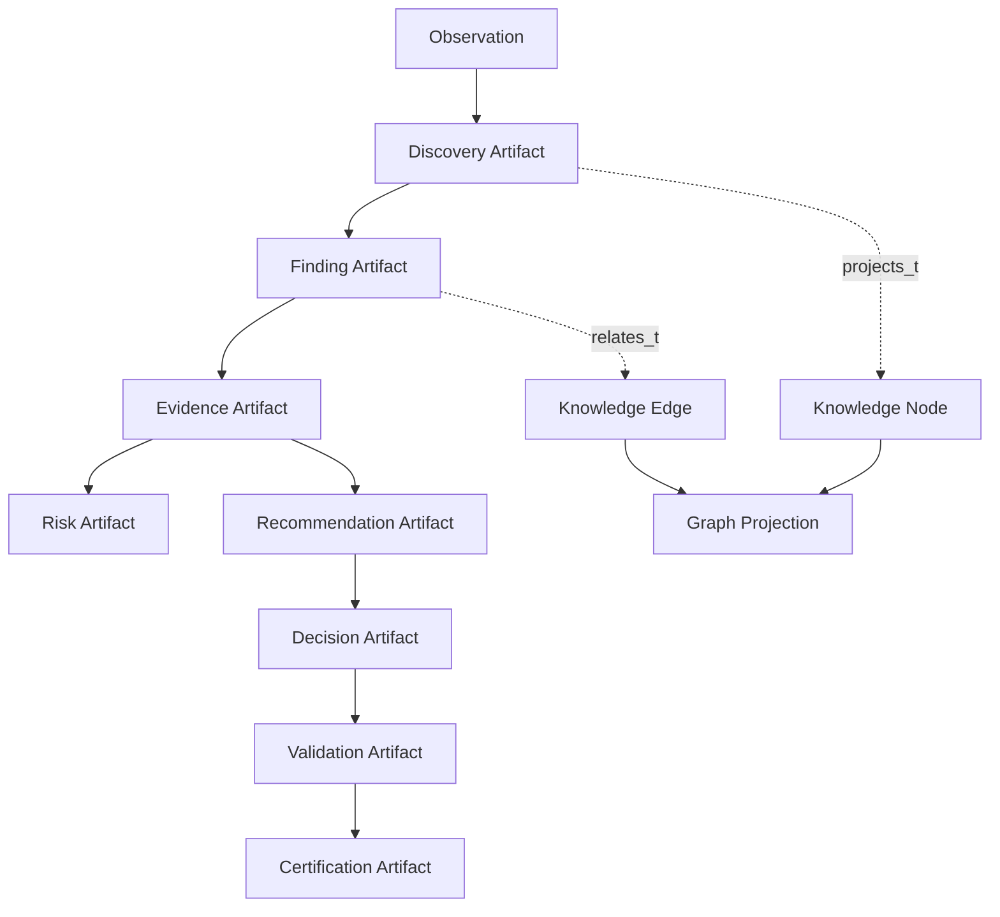

*Figure 14-1: Knowledge artifact flow.*

# 15. Runtime Artifact Model

Runtime consumes Runtime Artifacts. Runtime Artifacts record governed execution context and execution evidence without defining runtime implementation.

Runtime Artifact types include:

- Runtime Context;
- Runtime Invocation Record;
- Runtime State Snapshot;
- Runtime Trace;
- Runtime Failure Record;
- Runtime Handoff.

Runtime Artifacts shall declare artifact type, identity, lifecycle, authority, owner, traceability, and relationship metadata. Runtime Artifacts are evidence and coordination artifacts; they do not redefine standards, workflow, graph semantics, certification, project state, or artifact families.

# 16. Engine Artifact Model

The Engine Platform consumes Engine Artifacts. Engines produce governed artifacts. Engines shall not create new artifact families without M.1 governance.

Engine Artifact types include:

- Engine Contract;
- Engine Registration;
- Engine Capability Declaration;
- Engine Lifecycle Record;
- Engine State Snapshot;
- Engine Communication Record;
- Engine Invocation Record;
- Engine Artifact Output;
- Engine Trace.

Engine outputs must declare artifact type, identity, lifecycle, authority, owner, traceability, and relationship metadata.

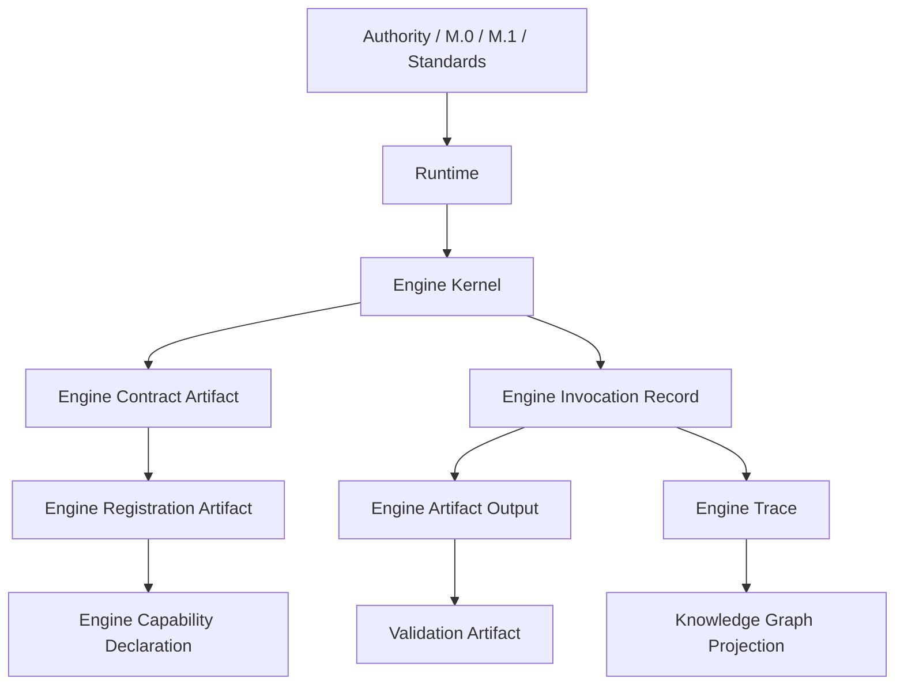

*Figure 16-1: Runtime and Engine artifact flow.*

# 17. Validation Artifact Model

Validation Artifacts record evidence-based conformance checks.

Validation Artifact types include:

- Validation Result;
- Validation Evidence;
- Validation Checklist;
- Validation Report;
- Quality Gate Result.

Validation Artifacts shall identify the artifact validated, governing criteria, evidence, result, limitations, failures, and required remediation. Validation does not certify and does not expand implementation scope.

# 18. Review Artifact Model

Review Artifacts record independent readiness assessment after validation evidence exists.

Review Artifact types include:

- Review Record;
- Review Finding;
- Review Verdict;
- Review Checklist.

Review Artifacts shall reference validation evidence, assess readiness, record findings, and state verdicts. Review shall not implement new functionality or change artifact ownership.

# 19. Certification Artifact Model

Certification Artifacts package and record certification decisions after validation and review.

Certification Artifact types include:

- Certification Package;
- Certification Record;
- Certification Decision;
- Certification Evidence;
- Certification Checklist.

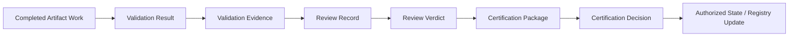

*Figure 19-1: Validation to Review to Certification flow.*

Certification Artifacts shall not be produced after failed validation or failed review. AI agents may prepare draft evidence but shall not self-certify.

# 20. Registry Artifact Model

Registry Artifacts record discoverability, indexing, synchronization, and resolution. A registry indexes artifact metadata and discoverability state; it does not own artifact truth.

Registry Artifact types include:

- Registry Entry;
- Registry Snapshot;
- Registry Index;
- Registry Synchronization Record;
- Registry Resolution Record.

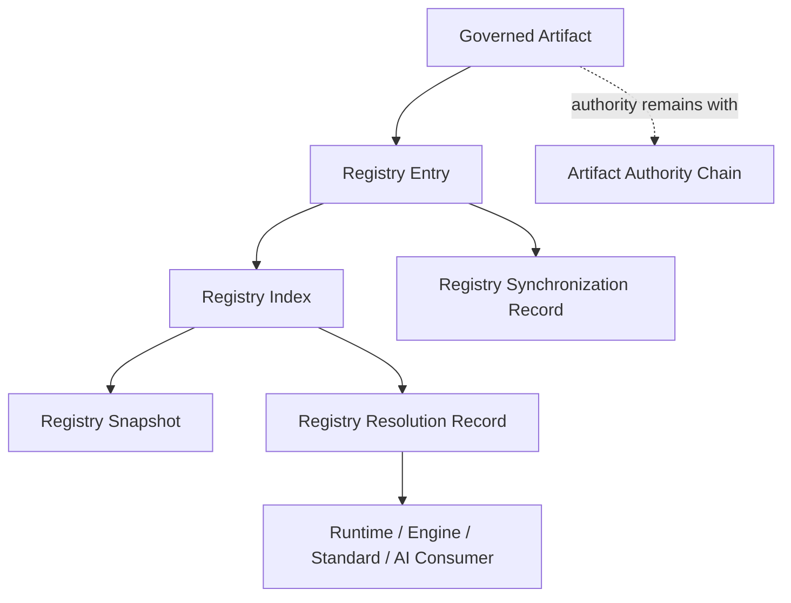

*Figure 20-1: Registry artifact flow.*

Registry Artifacts shall preserve identity, lifecycle, authority, ownership, traceability, and relationship metadata from the governed artifact they represent.

# 21. Planning Artifact Model

Planning Artifacts record approved roadmap, phase, stage, capability, task, status, and migration planning.

Planning Artifact types include:

- Roadmap;
- Phase;
- Stage;
- Capability;
- Historical Capability;
- Project Status;
- Migration Plan.

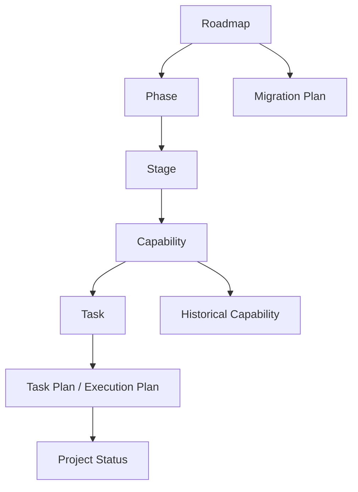

*Figure 21-1: Planning artifact flow.*

Planning Artifacts are authoritative only within their governance position. Project Status records live operational state; it does not redefine architecture.

# 22. Operational Artifact Boundary

Operational Artifacts support the AI Operational Layer. They are classified by M.1 but are not Framework Core artifacts by classification alone.

Operational Artifact types include:

- Agent System Prompt;
- AI Framework Entry Point;
- AI Orchestrator Document;
- Agent Command;
- Agent Workflow;
- Agent Template.

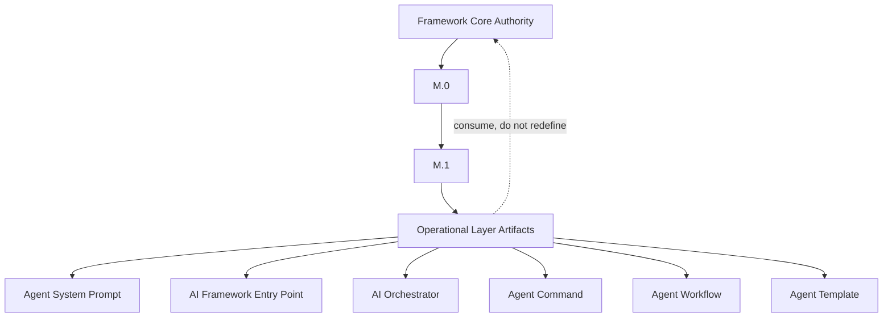

*Figure 22-1: Operational artifact boundary.*

Operational documents shall not be refactored by this M.1 alignment. Operational artifacts consume governance, commands, workflows, and templates under the current RC2 compatibility layer until replaced through approved governance.

# 23. Legacy / Historical Artifact Boundary

Legacy and Historical Artifacts preserve prior states, deprecated material, archives, and RC2 transitional material. Classification does not authorize movement or migration.

Legacy / Historical Artifact types include:

- Legacy Document;
- Historical Document;
- Deprecated Artifact;
- Archived Artifact;
- RC2 Transitional Artifact.

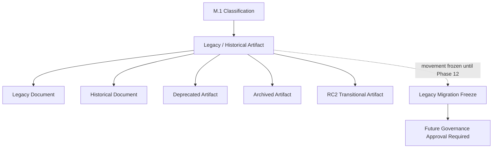

*Figure 23-1: Legacy boundary.*

Legacy movement remains frozen. M.1 may classify legacy artifacts for traceability and impact analysis, but it shall not move, rewrite, delete, or promote them.

# 24. AI Consumption Rules

AI may:

- classify artifacts;
- suggest artifact relationships;
- create draft artifacts within approved scope;
- validate artifact metadata;
- identify missing relationships;
- recommend artifact specialization.

AI shall never:

- create canonical artifact families without governance;
- redefine M.0 meta types;
- redefine M.1 artifact types;
- change artifact authority;
- change artifact ownership;
- bypass lifecycle rules;
- self-certify artifacts;
- move legacy artifacts;
- treat operational artifacts as Framework Core artifacts.

AI output concerning artifacts shall state the artifact family, artifact type, authority, owner, lifecycle state, traceability, and validation status when those fields are material to the task.

# 25. Dependency Matrix

| Consumer | Consumes from M.1 | Produces | Redefines M.1? |
|:---|:---|:---|:---|
| STD-000 Framework Standards | Artifact governance expectations | Standards governance rules | No |
| STD-010 Document Metadata Standard | Artifact metadata categories and document artifact needs | Metadata field rules | No |
| STD-001 Knowledge Graph Standard | Artifact types and relationship classes | Graph node, edge, traversal, and projection rules | No |
| STD-002 Discovery Standard | Discovery as Knowledge Artifact | Discovery specialization | No |
| Runtime Architecture RFC | Runtime Artifact family | Runtime architecture consumers and runtime records | No |
| Engine Architecture RFC family | Engine Artifact family | Engine contracts, registrations, lifecycle records, state records, communication records, capability declarations, outputs, traces | No |
| Registry Architecture | Registry Artifact family | registry entries, indexes, snapshots, synchronization, resolution records | No |
| Validation System | Validation Artifact family | validation evidence and results | No |
| Review System | Review Artifact family | review findings and verdicts | No |
| Certification System | Certification Artifact family | certification packages and decisions | No |
| Planning System | Planning Artifact family | roadmap, phase, stage, capability, task, status, migration artifacts | No |
| AI Operational Layer | Operational Artifact family | prompts, commands, workflows, templates, orchestration documents | No |
| Legacy / Historical Archive | Legacy / Historical Artifact family | preserved historical records | No |

# 26. Migration Notes

This refactor migrates valid prior M.1 concepts into a governed v4 structure:

- the prior common artifact contract is preserved;
- identity, lifecycle, authority, ownership, relationship, validation, registry, graph, and extension concepts are retained as M.0-derived artifact specializations;
- knowledge graph participation is clarified as projection, not artifact definition;
- Discovery remains a Knowledge Artifact specialized by STD-002;
- runtime and engine RFCs consume Runtime and Engine Artifact families;
- operational artifacts are classified at the Operational Layer boundary;
- legacy artifacts are classified without movement;
- no ProjectStatus, roadmap, standard, runtime, engine, M.0, Constitution, or implementation files are modified by this alignment.

M.1 prepares the next Phase 1 task, STD-003 Terminology Standard alignment, by establishing artifact families and terms without starting STD-003.

# 27. Quality Gates

This document is ready for review when these checks are complete:

- `git diff --check` passes;
- only `docs/AI/Meta/M.1-Artifact-Meta-Model.md` changed;
- `docs/DevelopmentPhases/ProjectStatus.md` was not modified;
- `docs/DevelopmentPhases/ForgeAI-DevelopmentPhases.md` was not modified;
- no legacy or RC2 files moved or modified;
- required sections exist;
- required diagrams exist;
- no implementation files changed;
- no runtime, engine, or standard files changed;
- M.1 references M.0 as its semantic parent;
- operational artifacts are classified but not refactored.

# 28. Success Criteria

M.1 is successful when:

- it is the canonical candidate artifact type system of Forge AI;
- every artifact type derives from M.0;
- artifact families are explicit and governed;
- every document artifact has a defined artifact family;
- standards, RFCs, reports, audits, schemas, registries, validation results, review records, and certification packages are modeled consistently;
- Knowledge Graph nodes and edges map to artifact types without redefining artifact semantics;
- Runtime and Engines consume artifact types without creating competing artifact definitions;
- future Engine RFCs specialize M.1 artifact types instead of inventing base artifacts;
- operational artifacts are classified as Operational Layer artifacts;
- legacy and RC2 artifacts remain frozen until future governance permits migration;
- the document is ready to support STD-003 Terminology Standard alignment without starting that task.

# 29. Completion Checklist

| Requirement | Status |
|:---|:---|
| Status chapter exists | Complete |
| Purpose chapter exists | Complete |
| Design Philosophy chapter exists | Complete |
| Relationship to M.0 chapter exists | Complete |
| Artifact Type System chapter exists | Complete |
| Artifact Families chapter exists | Complete |
| Artifact Identity Model chapter exists | Complete |
| Artifact Metadata Model chapter exists | Complete |
| Artifact Lifecycle Model chapter exists | Complete |
| Artifact Authority Model chapter exists | Complete |
| Artifact Ownership Model chapter exists | Complete |
| Artifact Relationship Model chapter exists | Complete |
| Artifact Traceability Model chapter exists | Complete |
| Knowledge Artifact Model chapter exists | Complete |
| Runtime Artifact Model chapter exists | Complete |
| Engine Artifact Model chapter exists | Complete |
| Validation Artifact Model chapter exists | Complete |
| Review Artifact Model chapter exists | Complete |
| Certification Artifact Model chapter exists | Complete |
| Registry Artifact Model chapter exists | Complete |
| Planning Artifact Model chapter exists | Complete |
| Operational Artifact Boundary chapter exists | Complete |
| Legacy / Historical Artifact Boundary chapter exists | Complete |
| AI Consumption Rules chapter exists | Complete |
| Dependency Matrix chapter exists | Complete |
| Migration Notes chapter exists | Complete |
| Quality Gates chapter exists | Complete |
| Success Criteria chapter exists | Complete |
| Completion Checklist chapter exists | Complete |
| M.0 to M.1 dependency diagram exists | Complete |
| Artifact type hierarchy diagram exists | Complete |
| Artifact family map diagram exists | Complete |
| Artifact lifecycle diagram exists | Complete |
| Artifact relationship model diagram exists | Complete |
| Knowledge artifact flow diagram exists | Complete |
| Runtime / Engine artifact flow diagram exists | Complete |
| Validation to Review to Certification flow diagram exists | Complete |
| Registry artifact flow diagram exists | Complete |
| Planning artifact flow diagram exists | Complete |
| Operational boundary diagram exists | Complete |
| Legacy boundary diagram exists | Complete |
| Implementation behavior excluded | Complete |
| Runtime, engine, standard, M.0, Constitution, ProjectStatus, roadmap, and legacy file modifications excluded | Complete |
