# M.1 — Artifact Meta Model

> **Forge AI v3 · Meta Model Library**
> Canonical Artifact Contract

---

## Document Metadata

| Property | Value |
|:---|:---|
| **Document** | M.1 — Artifact Meta Model |
| **Identifier** | `FORGE-META-001` |
| **Version** | `3.0.0-beta` |
| **Status** | Beta |
| **Type** | Meta Model |
| **Classification** | Canonical Artifact Model |
| **Authority** | [A.1 — Constitution](../A.1-Constitution.md), [M.0 — Framework Meta Model](./M.0-Framework-Meta-Model.md), [STD-000 — Framework Standards](../Standards/STD-000-Framework-Standards.md) |
| **Owner** | Framework Governance |
| **Maintainers** | Framework Architecture Team |
| **Created** | 2026-07-06 |
| **Last Updated** | 2026-07-06 |
| **Depends On** | `FORGE-A-001`, `FORGE-META-000`, `FORGE-STD-000`, `FORGE-STD-001` |
| **Consumed By** | `FORGE-STD-002`, `FORGE-STD-003`, `FORGE-STD-004`, `FORGE-STD-005`, `FORGE-STD-006`, registries, validation engines, graph projections, AI agents, runtime governance |
| **Produces** | Artifact Contract, Artifact Identity Model, Artifact Lifecycle Model, Artifact Relationship Contract, Artifact Metadata Contract, Artifact Projection Contract |

---

## Revision History

| Version | Date | Author | Description |
|:---|:---|:---|:---|
| 0.1.0-draft | 2026-07-06 | Framework Architecture Team | Initial foundation draft for M.1 Artifact Meta Model. |
| 0.2.0-draft | 2026-07-06 | Framework Architecture Team | Added Artifact Identity Model. |
| 0.3.0-draft | 2026-07-06 | Framework Architecture Team | Added Artifact Lifecycle Model. |
| 0.4.0-draft | 2026-07-06 | Framework Architecture Team | Added Artifact Anatomy. |
| 3.0.0-beta | 2026-07-06 | Framework Architecture Team | Publication-quality refactoring: consolidated iterative drafts, added Artifact Ownership, Metadata, Relationship, Validation, Projection, Serialization, Registry, Extension, and Compliance models. Converted all ASCII diagrams to Mermaid. Added cross-references, References section, and normalized formatting. |

---

## Table of Contents

1. [Status](#1-status)
2. [Preamble](#2-preamble)
3. [Purpose](#3-purpose)
4. [Scope](#4-scope)
5. [Authority](#5-authority)
6. [Relationship to M.0](#6-relationship-to-m0)
7. [Artifact Philosophy](#7-artifact-philosophy)
8. [Artifact Identity Model](#8-artifact-identity-model)
9. [Artifact Lifecycle Model](#9-artifact-lifecycle-model)
10. [Artifact Anatomy](#10-artifact-anatomy)
11. [Completion Checklist](#11-completion-checklist)
12. [Artifact Ownership & Authority Model](#12-artifact-ownership--authority-model)
13. [Artifact Metadata Model](#13-artifact-metadata-model)
14. [Artifact Relationship Contract](#14-artifact-relationship-contract)
15. [Artifact Validation Contract](#15-artifact-validation-contract)
16. [Artifact Projection Model](#16-artifact-projection-model)
17. [Artifact Serialization Model](#17-artifact-serialization-model)
18. [Artifact Registry Contract](#18-artifact-registry-contract)
19. [Artifact Extension Model](#19-artifact-extension-model)
20. [Artifact Compliance Model](#20-artifact-compliance-model)
- [References](#references)
- [Appendix A — Canonical Artifact Structure (Conceptual)](#appendix-a--canonical-artifact-structure-conceptual)
- [Appendix B — Artifact Inheritance](#appendix-b--artifact-inheritance)
- [Appendix C — JSON Example](#appendix-c--json-example)
- [Appendix D — YAML Example](#appendix-d--yaml-example)
- [Appendix E — Extension Example](#appendix-e--extension-example)
- [Appendix F — Validation Pipeline Example](#appendix-f--validation-pipeline-example)
- [Appendix G — Anti-Pattern Catalog](#appendix-g--anti-pattern-catalog)
- [Appendix H — Compliance Matrix](#appendix-h--compliance-matrix)
- [Appendix I — Glossary](#appendix-i--glossary)
- [Appendix J — Quick Reference](#appendix-j--quick-reference)

---

# 1. Status

## 1.1 Document Identity

M.1 is the canonical Artifact Meta Model for the Forge AI Framework. It defines what it means for something to be a governed Artifact.

Discovery, Finding, Recommendation, Risk, Evidence, Decision, Audit, Validation, Certification, Registry Entry, and other governed framework objects derive their common contract from M.1.

## 1.2 Standard Position

M.1 sits below M.0 and above specialized standards. This positioning ensures that all Artifact types inherit a common contract before specializing with domain-specific semantics defined in their respective standards.

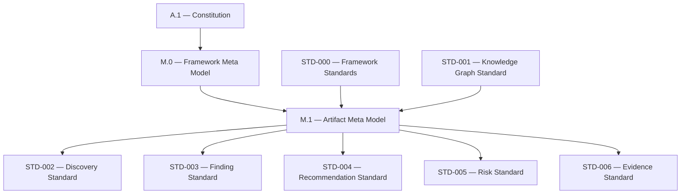

*Figure 1-1: M.1 Position in the Authority Hierarchy*

## 1.3 Classification

M.1 is classified as a **Canonical Artifact Model** because it defines the shared contract inherited by all governed Artifact types. This classification distinguishes it from domain-specific standards (e.g., [STD-002 — Discovery Standard](../Standards/STD-002-Discovery-Standard.md)) that specialize the contract for particular Artifact types.

## 1.4 Success Criteria

M.1 is successful when every governed Artifact can declare identity, ownership, authority, lifecycle, metadata, relationships, validation state, graph participation, projection, serialization, and registry participation through a common contract.

## 1.5 Completion Statement

The Status section is complete when M.1 has a stable identity, authority chain, classification, position, consumers, produced contracts, and success criteria.

---

# 2. Preamble

Forge AI is a governed knowledge framework. Its knowledge is not only stored in documents — it is expressed through Artifacts.

An Artifact is a governed unit of architectural knowledge with identity, lifecycle, ownership, authority, metadata, relationships, validation state, and graph participation. Without a shared Artifact model, each standard would redefine identity, lifecycle, ownership, validation, relationships, metadata, registry participation, and projection rules independently. That causes duplication, drift, and inconsistent governance.

M.1 exists to prevent that duplication. It establishes a single canonical Artifact contract consumed by specialized standards, ensuring that all governed objects share a common architectural foundation.

## 2.1 Guiding Statement

An Artifact is not merely a file, record, schema object, or graph node. An Artifact is a governed knowledge object that *may be represented* as a file, record, schema object, graph node, registry entry, runtime DTO, or document section — but the representation is not the Artifact itself. This distinction is foundational to the entire M.1 contract and is elaborated in [Section 7 — Artifact Philosophy](#7-artifact-philosophy) and [Section 8 — Artifact Identity Model](#8-artifact-identity-model).

## 2.2 Completion Statement

The Preamble is complete when M.1 establishes why a shared Artifact contract is required and distinguishes Artifact knowledge from its representations.

---

# 3. Purpose

## 3.1 Overview

The purpose of M.1 is to define the canonical contract shared by all governed Artifacts in the Forge AI Framework. This contract serves as the single source of truth for what constitutes a valid, governed Artifact, enabling specialized standards to build upon a stable foundation rather than redefining common infrastructure.

## 3.2 Objectives

M.1 shall:

- define Artifact as a governed meta-model concept;
- define universal Artifact identity requirements;
- define universal Artifact ownership and authority requirements;
- define universal Artifact lifecycle constraints;
- define universal Artifact metadata expectations;
- define universal Artifact relationship expectations;
- define Artifact participation in the [STD-001 — Knowledge Graph Standard](../Standards/STD-001-Knowledge-Graph-Standard.md);
- define how specialized standards extend the Artifact contract;
- prevent repeated redefinition of Artifact concepts across standards;
- support deterministic validation, registry indexing, AI reasoning, and runtime projection.

## 3.3 Strategic Role

M.1 allows specialized standards to focus on domain semantics instead of repeating common Artifact infrastructure. By centralizing the shared contract, M.1 reduces the surface area for inconsistency and enables cross-standard interoperability.

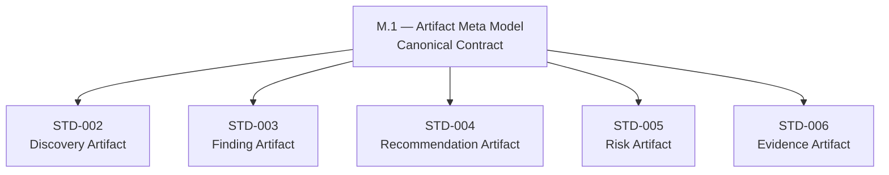

*Figure 3-1: M.1 Strategic Role — Common Contract Inherited by Specialized Standards*

## 3.4 Non-Goals

M.1 does not:

- define Discovery-specific semantics;
- define Finding-specific semantics;
- define Recommendation-specific semantics;
- define Risk-specific semantics;
- define Evidence-specific semantics;
- define canonical graph semantics owned by [STD-001](../Standards/STD-001-Knowledge-Graph-Standard.md);
- define framework standard governance owned by [STD-000](../Standards/STD-000-Framework-Standards.md);
- define constitutional authority owned by [A.1 — Constitution](../A.1-Constitution.md);
- replace specialized standards.

## 3.5 Completion Statement

The Purpose section is complete when M.1 defines its objective, strategic role, and non-goals.

---

# 4. Scope

## 4.1 In Scope

M.1 governs the common contract for:

- Artifact identity;
- Artifact UUID and human-readable identifiers;
- Artifact type;
- Artifact version;
- Artifact lifecycle;
- Artifact ownership;
- Artifact authority;
- Artifact metadata;
- Artifact relationships;
- Artifact traceability;
- Artifact validation;
- Artifact review;
- Artifact projection;
- Artifact serialization;
- Artifact registry participation;
- Artifact extension rules;
- Artifact compliance requirements.

## 4.2 Out of Scope

M.1 does not govern:

- Discovery classification catalogs;
- Finding severity rules;
- Recommendation priority rules;
- Risk probability models;
- Evidence admissibility rules;
- registry storage implementation;
- graph database implementation;
- OpenAPI transport contracts;
- runtime persistence;
- user interface behavior.

## 4.3 Boundary Rules

An Artifact standard shall not:

- redefine M.1 identity invariants (see [Section 8.8 — Identity Invariants](#88-identity-invariants));
- bypass Artifact ownership;
- remove Artifact traceability;
- redefine canonical graph semantics (owned by [STD-001](../Standards/STD-001-Knowledge-Graph-Standard.md));
- use serialization as source of truth;
- treat Markdown files as canonical knowledge by themselves;
- treat AI-generated claims as validated Artifact truth.

## 4.4 Completion Statement

The Scope section is complete when M.1 inclusions, exclusions, and boundary rules are defined.

---

# 5. Authority

## 5.1 Authority Chain

M.1 operates under the following authority chain, descending from human governance through constitutional, meta-model, and standard layers:

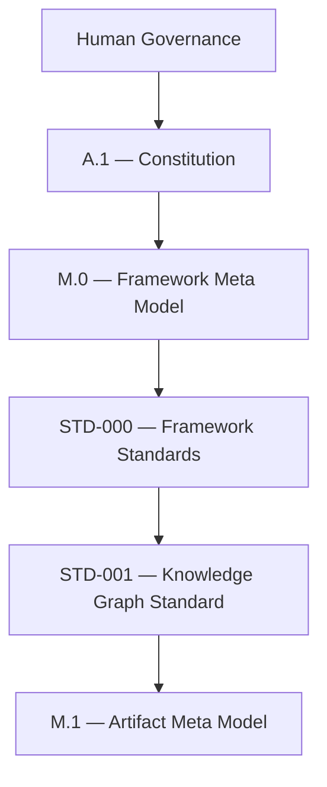

*Figure 5-1: M.1 Authority Chain*

## 5.2 Authority Responsibilities

| Authority | Responsibility |
|:---|:---|
| Human Governance | Final escalation authority for Artifact model disputes. |
| [A.1 — Constitution](../A.1-Constitution.md) | Defines constitutional invariants and human governance boundaries. |
| [M.0 — Framework Meta Model](./M.0-Framework-Meta-Model.md) | Defines framework-level meta concepts consumed by M.1. |
| [STD-000 — Framework Standards](../Standards/STD-000-Framework-Standards.md) | Defines governance rules for standards and standard-like Artifacts. |
| [STD-001 — Knowledge Graph Standard](../Standards/STD-001-Knowledge-Graph-Standard.md) | Owns canonical graph semantics consumed by Artifact projections. |
| M.1 — Artifact Meta Model | Defines common Artifact contract inherited by specialized Artifact standards. |
| Specialized Standards | Define Artifact-specific semantics without redefining the common contract. |

## 5.3 Conflict Resolution

If M.1 conflicts with a higher authority, the higher authority prevails.

If a specialized standard conflicts with M.1, M.1 prevails unless Human Governance approves a formal exception.

## 5.4 Completion Statement

The Authority section is complete when M.1 authority, dependencies, responsibilities, and conflict resolution rules are defined.

---

# 6. Relationship to M.0

## 6.1 Overview

M.0 defines the framework meta-concepts. M.1 specializes the Artifact concept into a reusable governed contract. This relationship ensures that M.1 does not invent foundational concepts but rather inherits and specializes them from the parent meta model, as described in [Section 5 — Authority](#5-authority).

## 6.2 Derivation Model

| M.0 Concept | M.1 Specialization |
|:---|:---|
| Concept | Artifact Concept |
| Identity | Artifact Identity |
| Lifecycle | Artifact Lifecycle |
| Authority | Artifact Authority |
| Ownership | Artifact Ownership |
| Relationship | Artifact Relationship Contract |
| Reference | Artifact Reference |
| Validation | Artifact Validation |
| Review | Artifact Review |
| Certification | Artifact Certification State |
| Projection | Artifact Projection |
| Representation | Artifact Serialization |

## 6.3 Reuse Rules

M.1 shall reuse M.0 definitions for identity, lifecycle, authority, ownership, relationship, reference, validation, review, certification, projection, and representation.

M.1 may specialize these concepts for Artifacts but shall not redefine their core meaning.

## 6.4 Completion Statement

The Relationship to M.0 section is complete when Artifact is derived from M.0 concepts without replacing them.

---

# 7. Artifact Philosophy

## 7.1 Core Principles

| Principle | Description |
|:---|:---|
| Artifact Before Document | A document may represent an Artifact, but it is not the Artifact itself. |
| Identity Is Immutable | Artifact identity shall remain stable across representations, migrations, and versions. |
| Authority Is Explicit | Every Artifact shall declare authority. |
| Ownership Is Mandatory | Every Artifact shall have accountable ownership. |
| Lifecycle Is Governed | Artifact state shall be explicit and transition-controlled. |
| Relationships Are First-Class | Artifact relationships shall be explicit, typed, directional, and traceable. |
| Projection Is Derived | JSON, YAML, Markdown, Registry, DTO, and OpenAPI are derived projections. |
| Graph Participation Is Mandatory | Every governed Artifact participates in the Knowledge Graph according to [STD-001](../Standards/STD-001-Knowledge-Graph-Standard.md). |
| Validation Is Structural Before Semantic | Artifact validity starts with contract compliance before domain-specific interpretation. |
| Extension Is Controlled | Specialized standards may extend Artifacts but shall not break the common contract. |

These principles inform every subsequent section of this document. In particular, the *Artifact Before Document* and *Identity Is Immutable* principles are operationalized in [Section 8 — Artifact Identity Model](#8-artifact-identity-model), while *Lifecycle Is Governed* is formalized in [Section 9 — Artifact Lifecycle Model](#9-artifact-lifecycle-model).

## 7.2 Design Values

Artifacts should be:

- small enough to validate;
- stable enough to reference;
- structured enough to automate;
- traceable enough to audit;
- flexible enough to specialize;
- strict enough to govern;
- representation-neutral.

## 7.3 Completion Statement

The Artifact Philosophy section is complete when the principles and design values governing all Artifacts are defined.

---

# 8. Artifact Identity Model

## 8.1 Overview

Artifact identity defines how a governed Artifact is uniquely identified across documents, schemas, registries, graph projections, runtime DTOs, migrations, and historical versions.

Every Artifact shall have two identity forms:

1. a human-readable Artifact Identifier;
2. an immutable machine identity.

The human-readable identifier supports governance, documentation, and traceability. The immutable machine identity supports graph integrity, registry indexing, serialization stability, and migration safety.

## 8.2 Identity Principle

Artifact identity shall identify the Artifact itself, not one representation of the Artifact. A Markdown file, JSON object, YAML object, registry row, runtime DTO, or graph node may represent an Artifact, but none of these representations replace Artifact identity.

This principle directly implements the *Artifact Before Document* and *Identity Is Immutable* philosophies defined in [Section 7.1 — Core Principles](#71-core-principles).

## 8.3 Canonical Identity Components

Every Artifact shall declare the following identity components:

| Component | Required | Description |
|:---|:---:|:---|
| `artifact_id` | Yes | Human-readable canonical Artifact identifier. |
| `uuid` | Yes | Immutable machine identity. |
| `artifact_type` | Yes | Canonical Artifact type. |
| `title` | Yes | Human-readable Artifact title. |
| `version` | Yes | Artifact version. |
| `state` | Yes | Current lifecycle state (see [Section 9](#9-artifact-lifecycle-model)). |
| `owner` | Yes | Accountable owner. |
| `authority` | Yes | Governing authority. |
| `created` | Yes | Creation date. |
| `updated` | Yes | Last update date. |

## 8.4 Human-Readable Artifact Identifier

The human-readable identifier is designed for governance and communication. It provides a stable, human-interpretable reference that can be used in documentation, traceability logs, and cross-standard linking without requiring machine-identity lookups.

Examples:

```text
FORGE-STD-002
DISC-ARCH-20260704-001
FIND-ARCH-20260704-001
RISK-GOV-20260704-001
EVID-AUDIT-20260704-001
```

The identifier shall be:

- stable;
- unique within its Artifact namespace;
- understandable to humans;
- safe for documentation references;
- safe for registry indexing.

The identifier should not encode mutable information unless the owning standard explicitly allows it.

## 8.5 Immutable Machine Identity

Every Artifact shall also declare an immutable machine identity. The recommended format is UUID.

```yaml
uuid: 9f5d3d92-6d6c-4eb6-86e5-7c296d0c3f7a
```

The immutable machine identity shall:

- never change after creation;
- remain stable across migration;
- remain stable across file rename;
- remain stable across format conversion;
- remain stable across registry import/export;
- remain stable across graph projection.

## 8.6 Artifact Type

Every Artifact shall declare exactly one canonical Artifact type.

| Artifact Type | Owning Standard |
|:---|:---|
| `Standard` | [STD-000](../Standards/STD-000-Framework-Standards.md) |
| `KnowledgeGraph` | [STD-001](../Standards/STD-001-Knowledge-Graph-Standard.md) |
| `Discovery` | [STD-002](../Standards/STD-002-Discovery-Standard.md) |
| `Finding` | [STD-003](../Standards/STD-003-Finding-Standard.md) |
| `Recommendation` | [STD-004](../Standards/STD-004-Recommendation-Standard.md) |
| `Risk` | [STD-005](../Standards/STD-005-Risk-Standard.md) |
| `Evidence` | [STD-006](../Standards/STD-006-Evidence-Standard.md) |

Multiple Artifact types are prohibited. An Artifact may have labels or classifications, but labels and classifications shall not replace Artifact type.

## 8.7 Title

Every Artifact shall declare a human-readable title. The title shall:

- describe the Artifact;
- remain understandable outside local file context;
- avoid acting as the primary identity;
- be changeable without changing `artifact_id` or `uuid`.

## 8.8 Identity Invariants

The following identity invariants are mandatory:

| Invariant | Requirement |
|:---|:---|
| Immutable UUID | `uuid` shall never change after creation. |
| Stable Artifact ID | `artifact_id` shall not change after Accepted state unless supersession is declared. |
| Single Type | Artifact shall declare exactly one Artifact type. |
| Version Independence | Version changes shall not create a new identity unless a new Artifact is intentionally created. |
| Representation Independence | File paths, filenames, serialization formats, registry rows, and graph storage IDs shall not define identity. |
| Governance Traceability | Identity changes, if allowed before acceptance, shall be recorded. |
| No Hidden Identity | Artifact identity shall be explicit in metadata. |

## 8.9 Identity Anti-Patterns

The following practices are prohibited:

| Anti-Pattern | Reason |
|:---|:---|
| Using filename as primary identity | File paths can change. |
| Using title as primary identity | Titles can change. |
| Encoding lifecycle state into UUID | State is mutable. |
| Treating registry row ID as canonical identity | Registry storage is a projection. |
| Treating graph database internal ID as canonical identity | Storage engine IDs are implementation details. |
| Reusing an old identifier for a different Artifact | Breaks traceability. |

## 8.10 Identity Migration Rules

Migration shall preserve:

- `uuid`;
- accepted `artifact_id`;
- identity history;
- supersession relationships;
- source references;
- downstream references.

If a migrated Artifact requires a new identifier, the migration shall create an explicit relationship from the old Artifact to the new Artifact. The recommended relationship type is `SUPERSEDED_BY`:

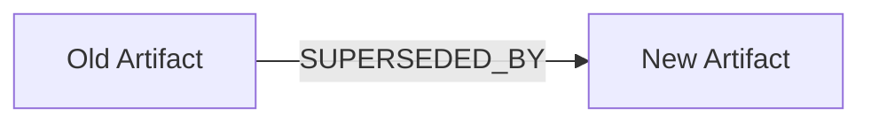

*Figure 8-1: Supersession Relationship During Migration*

## 8.11 Identity Validation

Validation engines shall verify:

- `artifact_id` exists;
- `uuid` exists;
- `artifact_type` exists;
- exactly one Artifact type is declared;
- `version` exists;
- `state` exists;
- owner exists;
- authority exists;
- identity does not depend on filename, path, registry ID, or graph database ID;
- accepted identity has not changed without governed supersession.

## 8.12 Example Identity Block

```yaml
artifact_id: FORGE-STD-002
uuid: 9f5d3d92-6d6c-4eb6-86e5-7c296d0c3f7a
artifact_type: Standard
title: STD-002 — Discovery Standard
version: 1.0.0-draft
state: Draft
owner: Framework Governance
authority: A.1 Constitution > M.0 > STD-000 > STD-002
created: 2026-07-04
updated: 2026-07-06
```

## 8.13 Completion Statement

The Artifact Identity Model is complete when every governed Artifact has a stable human-readable identifier, immutable machine identity, declared type, version, state, owner, authority, and validation rules that preserve identity across representations and migrations.

---

# 9. Artifact Lifecycle Model

## 9.1 Overview

Artifact lifecycle defines the governed states through which an Artifact may progress. Lifecycle exists to prevent unmanaged knowledge from becoming accepted, consumed, historical, or certified without traceable review.

M.1 defines the canonical lifecycle contract. Specialized standards may refine lifecycle states or add domain-specific sub-states, but they shall not violate M.1 lifecycle invariants.

## 9.2 Canonical Lifecycle

The canonical Artifact lifecycle follows a linear progression through seven governed states:

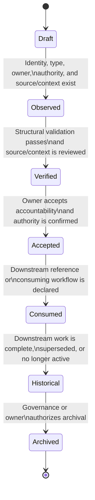

*Figure 9-1: Canonical Artifact Lifecycle State Machine*

## 9.3 Lifecycle State Definitions

| State | Meaning |
|:---|:---|
| Draft | Artifact is being prepared and may be incomplete. |
| Observed | Artifact has been captured with minimum source or context information. |
| Verified | Artifact has passed structural and source-level review. |
| Accepted | Artifact is accepted as a governed Artifact within its scope. |
| Consumed | Artifact has been used by a downstream Artifact, workflow, registry, validation process, or governance action. |
| Historical | Artifact remains traceable but is no longer active. |
| Archived | Artifact is retained for historical record and excluded from active workflows unless explicitly restored. |

## 9.4 Transition Rules

| Transition | Minimum Requirement |
|:---|:---|
| Draft to Observed | Identity, type, owner, authority, and source/context exist. |
| Observed to Verified | Structural validation passes and source/context is reviewed. |
| Verified to Accepted | Owner accepts accountability and authority is confirmed. |
| Accepted to Consumed | Downstream reference or consuming workflow is declared. |
| Consumed to Historical | Downstream work is complete, superseded, or no longer active. |
| Historical to Archived | Governance or owner authorizes archival. |

## 9.5 Optional Terminal States

Specialized standards may define terminal states such as:

- Rejected;
- Deprecated;
- Superseded;
- Withdrawn;
- Invalid.

These states shall preserve traceability and shall not delete Artifact history.

## 9.6 Lifecycle Invariants

| Invariant | Requirement |
|:---|:---|
| Explicit State | Every Artifact shall declare exactly one current lifecycle state. |
| Traceable Transition | Every state transition after Draft shall be recorded. |
| No Silent Promotion | Artifact shall not move to Accepted without owner accountability. |
| No Silent Consumption | Artifact shall not move to Consumed without a downstream reference. |
| No History Deletion | Lifecycle history shall not be erased. |
| Identity Preservation | Lifecycle changes shall not change Artifact identity. |
| Authority Preservation | Lifecycle transitions shall respect declared authority. |
| Specialized Compatibility | Specialized lifecycle states shall map to canonical M.1 states. |

## 9.7 Lifecycle Specialization

Specialized standards may define domain-specific lifecycle details. The following table illustrates how domain-specific states map to the canonical M.1 lifecycle:

| Artifact Type | Possible Specialized State | Canonical M.1 Mapping |
|:---|:---|:---|
| Discovery | Observed | Observed |
| Finding | Triaged | Verified |
| Recommendation | Proposed | Verified |
| Risk | Open | Accepted |
| Evidence | Admitted | Accepted |
| Decision | Approved | Accepted |
| Validation | Passed | Accepted |
| Certification | Certified | Accepted / Consumed |

Specialization shall clarify meaning without breaking canonical lifecycle semantics.

## 9.8 Lifecycle History

Every Artifact shall preserve lifecycle history. A lifecycle history entry should include:

```yaml
state: Verified
changed_at: 2026-07-06
changed_by: Framework Architecture Team
authority: Framework Governance
reason: Structural validation completed
previous_state: Observed
```

## 9.9 Lifecycle and Versioning

Lifecycle transitions may require version changes. The following table provides recommended version impact guidance:

| Lifecycle Event | Recommended Version Impact |
|:---|:---|
| Draft edits | Patch or draft revision. |
| Observed capture | Minor draft revision. |
| Verification | Minor revision. |
| Acceptance | Major or release-level revision. |
| Consumption | Minor revision. |
| Historical transition | Patch or governance revision. |
| Archival | Patch or archival marker. |

Versioning shall not replace lifecycle state. Lifecycle state shall not replace version.

## 9.10 Lifecycle Anti-Patterns

The following practices are prohibited:

| Anti-Pattern | Reason |
|:---|:---|
| Accepted without owner | Breaks accountability. |
| Consumed without downstream reference | Breaks traceability. |
| Archived without disposition | Breaks historical reasoning. |
| Lifecycle encoded only in filename | Filename is representation, not canonical state. |
| Deleting rejected Artifacts | Breaks duplicate prevention and audit traceability. |
| AI self-promoting Artifact to Accepted | Treats model output as governance. |

## 9.11 Lifecycle Validation

Validation engines shall verify:

- current lifecycle state exists;
- lifecycle state is valid;
- transition history exists after Draft;
- Accepted state has owner accountability;
- Consumed state has downstream reference;
- Historical and Archived states preserve disposition;
- specialized states map to canonical M.1 states;
- lifecycle transitions do not mutate Artifact identity.

## 9.12 Example Lifecycle Block

```yaml
state: Verified
lifecycle:
  current: Verified
  history:
    - state: Draft
      changed_at: 2026-07-06
      authority: Framework Architecture Team
      reason: Initial preparation
    - state: Observed
      changed_at: 2026-07-06
      authority: Framework Architecture Team
      reason: Source/context captured
    - state: Verified
      changed_at: 2026-07-06
      authority: Framework Governance
      reason: Structural validation completed
```

## 9.13 Completion Statement

The Artifact Lifecycle Model is complete when every governed Artifact has an explicit state, governed transitions, preserved lifecycle history, specialization rules, anti-pattern constraints, and validation requirements.

---

# 10. Artifact Anatomy

## 10.1 Overview

Artifact Anatomy defines the canonical internal structure shared by every governed Artifact. Building on the identity and lifecycle contracts defined in [Section 8](#8-artifact-identity-model) and [Section 9](#9-artifact-lifecycle-model), this section specifies **what components exist**, independent of the semantics defined by specialized standards.

## 10.2 Canonical Structure

```mermaid
graph TD
    Artifact["Artifact"]
    Artifact --> Identity["Identity"]
    Artifact --> Classification["Classification"]
    Artifact --> Lifecycle["Lifecycle"]
    Artifact --> Ownership["Ownership"]
    Artifact --> Authority["Authority"]
    Artifact --> Metadata["Metadata"]
    Artifact --> Relationships["Relationships"]
    Artifact --> Validation["Validation"]
    Artifact --> Review["Review"]
    Artifact --> Certification["Certification"]
    Artifact --> Registry["Registry"]
    Artifact --> Projection["Projection"]
    Artifact --> Serialization["Serialization"]
    Artifact --> Extensions["Extensions"]
    Artifact --> Audit["Audit"]
```

*Figure 10-1: Canonical Artifact Anatomy*

## 10.3 Component Responsibilities

| Component | Responsibility | Required |
|:---|:---|:---:|
| Identity | Stable identification. | Yes |
| Classification | Artifact categorization. | Yes |
| Lifecycle | Governed state. | Yes |
| Ownership | Accountability. | Yes |
| Authority | Governance legitimacy. | Yes |
| Metadata | Descriptive properties. | Yes |
| Relationships | Links to other Artifacts. | Yes |
| Validation | Structural and semantic verification. | Yes |
| Review | Human/AI review state. | Yes |
| Certification | Acceptance state. | Yes |
| Registry | Discoverability. | Yes |
| Projection | Graph/profile mapping. | Yes |
| Serialization | JSON/YAML/Markdown/DTO forms. | Yes |
| Extensions | Domain-specific additions. | Optional |
| Audit | Historical trace. | Yes |

## 10.4 Mandatory Component Matrix

| Component | Mandatory | Extensible |
|:---|:---:|:---:|
| Identity | Yes | No |
| Lifecycle | Yes | Yes |
| Ownership | Yes | Yes |
| Metadata | Yes | Yes |
| Relationships | Yes | Yes |
| Validation | Yes | Yes |
| Registry | Yes | No |
| Projection | Yes | No |
| Serialization | Yes | No |
| Audit | Yes | Yes |

## 10.5 Structural Rules

- Every Artifact shall contain all mandatory components.
- Specialized standards may extend components but shall not remove mandatory ones.
- Component semantics belong to M.1 unless explicitly delegated.
- Representations (Markdown, JSON, YAML, DTO, graph) are projections of this anatomy.

## 10.6 Completion Statement

The Artifact Anatomy section is complete when every governed Artifact shares the same structural component model while allowing controlled specialization.

---

# 11. Completion Checklist

- [x] Document identity defined
- [x] Authority chain defined
- [x] Purpose defined
- [x] Scope defined
- [x] Relationship to M.0 defined
- [x] Artifact philosophy defined
- [x] Artifact identity model defined
- [x] Artifact lifecycle model defined
- [x] Artifact anatomy defined
- [x] Artifact ownership model defined
- [x] Artifact metadata model defined
- [x] Artifact relationship contract defined
- [x] Artifact projection model defined
- [x] Artifact serialization model defined
- [x] Artifact registry participation defined
- [x] Artifact validation model defined
- [x] Artifact extension rules defined
- [x] Artifact compliance model defined

---

# 12. Artifact Ownership & Authority Model

## 12.1 Purpose

Define the governance model that establishes accountability, authority, review, approval, stewardship, and delegation for every governed Artifact.

## 12.2 Governance Principles

- Every Artifact shall have an accountable Owner.
- Every Artifact shall declare its governing Authority.
- Ownership and Authority are different concepts.
- Authority may delegate work but not constitutional responsibility.
- All governance actions shall be traceable.

## 12.3 Canonical Roles

| Role | Responsibility |
|:---|:---|
| Owner | Accountable for the Artifact and its quality. |
| Authority | Governing body that grants legitimacy. |
| Steward | Maintains long-term integrity. |
| Maintainer | Performs day-to-day maintenance. |
| Reviewer | Performs technical or governance review. |
| Approver | Authorizes promotion or acceptance. |
| Custodian | Protects storage and preservation. |
| AI Agent | Produces proposals only; never final authority. |
| Swarm | Collaborative execution group operating under delegated authority. |

## 12.4 Authority Chain

The Artifact-level authority chain extends the document-level chain defined in [Section 5.1](#51-authority-chain) with operational governance roles:

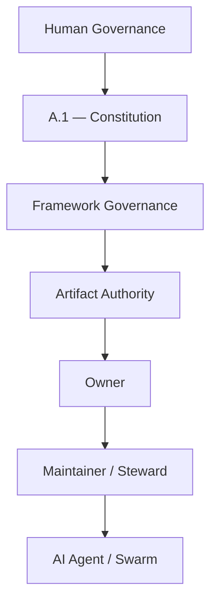

*Figure 12-1: Artifact-Level Governance Authority Chain*

## 12.5 Delegation Rules

- Authority may delegate execution.
- Authority shall not delegate constitutional accountability.
- AI Agents may recommend but shall not self-approve.
- Swarms operate under explicit delegated scope.

## 12.6 Ownership Transfer

Ownership transfer requires:

1. New Owner identified.
2. Authority approval.
3. Transfer reason recorded.
4. Audit history preserved.

Ownership transfer shall not change Artifact identity.

## 12.7 RACI Summary

| Activity | Owner | Authority | Reviewer | AI |
|:---|:---:|:---:|:---:|:---:|
| Create | R | A | C | C |
| Update | R | A | C | C |
| Review | C | A | R | C |
| Approve | I | A | C | — |
| Archive | C | A | C | — |

R = Responsible, A = Accountable, C = Consulted, I = Informed

## 12.8 Anti-Patterns

The following practices are prohibited:

- Missing owner;
- AI self-approval;
- Anonymous governance;
- Ownership inferred from filename;
- Authority bypass;
- Silent ownership transfer.

## 12.9 Validation Rules

Validation engines shall verify:

- Owner exists;
- Authority exists;
- Owner is not empty;
- Authority chain resolves;
- Approval is traceable;
- Transfers preserve audit history.

## 12.10 Completion Statement

This section is complete when every Artifact has explicit governance, accountability, authority, delegation rules, and validation requirements.

---

# 13. Artifact Metadata Model

## 13.1 Purpose

Define the canonical metadata contract shared by every governed Artifact. Metadata describes an Artifact without becoming its identity or replacing its semantics.

## 13.2 Design Principles

- Metadata shall be explicit.
- Metadata shall be machine-readable.
- Metadata shall be representation-independent.
- Metadata shall be extensible.
- Domain standards may extend metadata but shall not redefine canonical fields.

## 13.3 Canonical Metadata Categories

### 13.3.1 Identity Metadata

- `artifact_id`
- `uuid`
- `artifact_type`
- `version`
- `title`

### 13.3.2 Governance Metadata

- `owner`
- `authority`
- `reviewer`
- `approver`
- `steward`

### 13.3.3 Lifecycle Metadata

- `state`
- `created`
- `updated`
- `reviewed_at`
- `approved_at`
- `archived_at`

### 13.3.4 Classification Metadata

- `classification`
- `labels`
- `tags`
- `domain`
- `taxonomy`

### 13.3.5 Quality Metadata

- `confidence`
- `impact`
- `severity`
- `priority`
- `completeness`

### 13.3.6 Traceability Metadata

- `trace_id`
- `correlation_id`
- `repository`
- `branch`
- `commit`
- `project`

### 13.3.7 Runtime Metadata

- `agent`
- `swarm`
- `session`
- `execution_context`

## 13.4 Mandatory Metadata Matrix

| Field | Required |
|:---|:---:|
| `artifact_id` | Yes |
| `uuid` | Yes |
| `artifact_type` | Yes |
| `version` | Yes |
| `owner` | Yes |
| `authority` | Yes |
| `state` | Yes |
| `created` | Yes |
| `updated` | Yes |

## 13.5 Metadata Extension Rules

Specialized standards may introduce:

- Discovery-specific metadata;
- Finding-specific metadata;
- Recommendation-specific metadata;
- Risk-specific metadata;
- Evidence-specific metadata.

Canonical fields shall remain unchanged.

## 13.6 Anti-Patterns

The following practices are prohibited:

- Hidden metadata;
- Duplicate metadata;
- Metadata used as identity;
- Runtime-only metadata becoming canonical;
- Removing mandatory metadata.

## 13.7 Validation Rules

Validation engines shall verify:

- all mandatory fields exist;
- metadata types are valid;
- duplicate canonical fields do not exist;
- extensions do not override canonical metadata.

## 13.8 Example

```yaml
artifact_id: DISC-ARCH-20260706-001
uuid: 7d7fbeab-1111-4444-8888-aaaaaaaaaaaa
artifact_type: Discovery
owner: Framework Governance
authority: STD-002
state: Verified
confidence: High
trace_id: TRACE-001
repository: forge-ai
branch: main
commit: abc123
agent: z.ai
```

## 13.9 Completion Statement

The Metadata Model is complete when every Artifact exposes a consistent canonical metadata contract while allowing controlled specialization.

---

# 14. Artifact Relationship Contract

## 14.1 Purpose

Define the canonical relationship contract shared by every governed Artifact. Relationship semantics are **owned by [STD-001](../Standards/STD-001-Knowledge-Graph-Standard.md)**. This section defines the reusable contract that every Artifact must follow when declaring relationships.

## 14.2 Principles

- Relationships are first-class governance objects.
- Every relationship shall be explicit.
- Every relationship shall be directional.
- Every relationship shall have a declared type.
- Relationships shall be traceable.
- Relationship storage is a projection, not the source of truth.

## 14.3 Canonical Relationship Attributes

| Attribute | Required | Description |
|:---|:---:|:---|
| `relationship_id` | Yes | Unique relationship identifier. |
| `type` | Yes | Canonical relationship type. |
| `source` | Yes | Source Artifact. |
| `target` | Yes | Target Artifact. |
| `direction` | Yes | Source to Target. |
| `authority` | Yes | Governing authority. |
| `created` | Yes | Creation timestamp. |
| `state` | Yes | Relationship lifecycle. |

## 14.4 Canonical Relationship Types

The following contract is shared across all Artifacts:

- `REFERENCES`
- `RELATED_TO`
- `DEPENDS_ON`
- `PRODUCES`
- `CONSUMES`
- `SUPPORTS`
- `DERIVED_FROM`
- `SUPERSEDES`
- `DUPLICATES`
- `CONTRADICTS`
- `VALIDATED_BY`
- `APPROVED_BY`
- `BLOCKED_BY`

> **Note:** The meaning of these relationship types is defined by **[STD-001 — Knowledge Graph Standard](../Standards/STD-001-Knowledge-Graph-Standard.md)**. M.1 standardizes their usage as part of the Artifact contract.

## 14.5 Cardinality Rules

| Relationship | Cardinality |
|:---|:---|
| `REFERENCES` | Many to Many |
| `RELATED_TO` | Many to Many |
| `DEPENDS_ON` | Many to Many |
| `PRODUCES` | One to Many |
| `CONSUMES` | Many to Many |
| `VALIDATED_BY` | Many to Many |
| `APPROVED_BY` | Many to One |

Specialized standards may further restrict cardinality.

## 14.6 Relationship Invariants

- Source and target shall both be valid Artifacts.
- Relationships shall not bypass governance.
- Relationships shall remain traceable after migration.
- Relationship identifiers shall remain stable.
- Orphaned relationships are prohibited.

## 14.7 Anti-Patterns

The following practices are prohibited:

- Anonymous relationships;
- Circular dependency without explicit intent;
- Implicit relationships inferred from filenames;
- Duplicate parallel relationships with identical semantics;
- Storage-engine IDs used as canonical relationship identifiers.

## 14.8 Validation Rules

Validation engines shall verify:

- relationship identifier exists;
- source exists;
- target exists;
- type is valid;
- direction is explicit;
- authority exists;
- no prohibited orphan relationships exist.

## 14.9 Example

```yaml
relationship_id: REL-0001
type: PRODUCES
source: DISC-ARCH-20260706-001
target: FIND-ARCH-20260706-004
authority: STD-002
state: Active
```

## 14.10 Completion Statement

The Relationship Contract is complete when every Artifact can declare governed, traceable, typed, directional relationships without redefining STD-001 semantics.

---

# 15. Artifact Validation Contract

## 15.1 Purpose

Define the canonical validation contract shared by every governed Artifact. Validation determines whether an Artifact satisfies the structural, governance, and interoperability requirements of the Forge AI Framework.

## 15.2 Validation Layers

| Layer | Purpose |
|:---|:---|
| Structural | Required fields, schema, identity, lifecycle. |
| Governance | Ownership, authority, approvals. |
| Relationship | Valid references and graph integrity. |
| Cross-Artifact | Consistency with related Artifacts. |
| Representation | JSON, YAML, Markdown projections. |
| AI | AI-generated content boundaries. |
| Compliance | Conformance with M.1 and specialized standards. |

## 15.3 Validation Principles

- Validation shall be deterministic.
- Structural validation shall precede semantic validation.
- Validation shall be reproducible.
- Failed validation shall preserve traceability.
- AI output shall never bypass governance validation.

## 15.4 Validation Pipeline

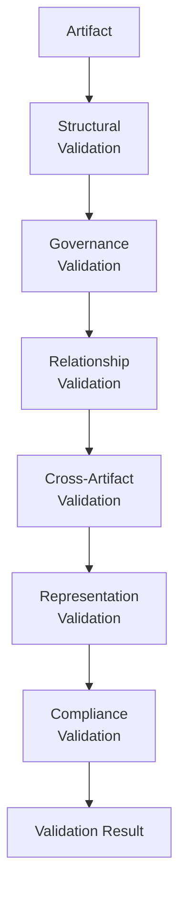

*Figure 15-1: Validation Pipeline*

## 15.5 Validation Result

Every validation shall produce:

- `validation_id`;
- `artifact_id`;
- `validator`;
- `timestamp`;
- `status` (`Passed`, `Warning`, `Failed`);
- `findings`;
- `evidence`;
- `recommendations`.

## 15.6 Severity

| Level | Meaning |
|:---|:---|
| Info | Informational only. |
| Warning | Non-blocking issue. |
| Error | Blocks progression. |
| Critical | Governance violation. |

## 15.7 Anti-Patterns

The following practices are prohibited:

- Validation after publication only;
- Ignoring failed structural validation;
- AI self-certification;
- Hidden validation rules;
- Non-repeatable validation.

## 15.8 Validation Rules

Validation engines shall verify:

- identity contract;
- lifecycle contract;
- ownership contract;
- metadata contract;
- relationship contract;
- required projections;
- compliance with specialized standards.

## 15.9 Example

```yaml
validation_id: VAL-0001
artifact_id: DISC-ARCH-20260706-001
status: Passed
validator: Framework Validation Engine
findings: []
```

## 15.10 Completion Statement

The Validation Contract is complete when every Artifact can be validated consistently across structure, governance, relationships, representations, and compliance.

---

# 16. Artifact Projection Model

## 16.1 Purpose

Define how a canonical Artifact is projected into multiple representations while preserving a single source of truth.

## 16.2 Projection Principle

An Artifact exists independently of its representations. Representations are derived projections and shall never become the canonical source of truth. This principle extends the *Projection Is Derived* philosophy defined in [Section 7.1](#71-core-principles).

## 16.3 Canonical Projection Flow

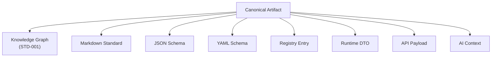

*Figure 16-1: Canonical Projection Flow*

## 16.4 Projection Targets

| Target | Purpose | Canonical |
|:---|:---|:---:|
| Knowledge Graph | Relationships and reasoning. | No |
| Markdown | Human governance. | No |
| JSON | Machine validation. | No |
| YAML | Configuration. | No |
| Registry | Discovery and indexing. | No |
| Runtime DTO | Runtime consumption. | No |
| API Payload | Integration. | No |
| AI Context | AI reasoning. | No |

## 16.5 Projection Rules

- Every projection shall originate from the canonical Artifact.
- Projections shall preserve identity.
- Projections shall preserve traceability.
- Projection-specific metadata may be added.
- Canonical metadata shall not be removed.
- Projections shall be reproducible.

## 16.6 Projection Invariants

- `artifact_id` remains unchanged.
- `uuid` remains unchanged.
- `authority` remains unchanged.
- Lifecycle state remains unchanged unless explicitly synchronized.
- Relationships remain semantically equivalent.

## 16.7 Synchronization

Changes shall originate from the canonical Artifact. Reverse synchronization from projections requires governance approval.

## 16.8 Anti-Patterns

The following practices are prohibited:

- Editing JSON as the canonical source;
- Registry becoming the source of truth;
- Runtime DTO divergence;
- AI-generated projection replacing canonical Artifact.

## 16.9 Validation

Projection validation shall verify:

- identity preservation;
- metadata preservation;
- relationship preservation;
- serialization consistency;
- projection completeness.

## 16.10 Example

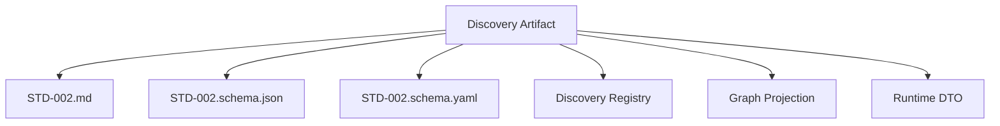

*Figure 16-2: Discovery Artifact Projections*

## 16.11 Completion Statement

The Projection Model is complete when every Artifact can be deterministically projected into all supported representations without creating multiple sources of truth.

---

# 17. Artifact Serialization Model

## 17.1 Purpose

Define the canonical serialization contract for every governed Artifact. Serialization transforms a canonical Artifact into portable representations while preserving meaning, identity, and governance.

## 17.2 Serialization Principles

- Serialization shall preserve canonical identity.
- Serialization shall not become the source of truth.
- Serialization shall be deterministic.
- Serialization shall support round-trip reconstruction.
- Serialization shall be version-aware.

## 17.3 Supported Formats

| Format | Primary Use |
|:---|:---|
| Markdown | Human governance. |
| JSON | Machine validation and APIs. |
| YAML | Configuration and authoring. |
| Runtime DTO | Internal runtime transport. |
| Registry Record | Discovery and indexing. |

## 17.4 Canonical Mapping

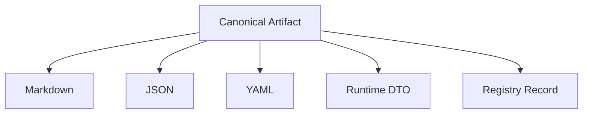

*Figure 17-1: Serialization Format Mapping*

## 17.5 Serialization Invariants

The following shall remain unchanged across all formats:

- `artifact_id`;
- `uuid`;
- `artifact_type`;
- `owner`;
- `authority`;
- lifecycle state;
- relationships;
- canonical metadata.

## 17.6 Round-Trip Requirement

Every supported serialization shall satisfy round-trip equivalence:

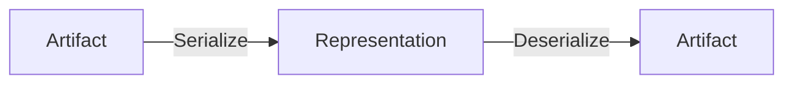

*Figure 17-2: Serialization Round-Trip Requirement*

The reconstructed Artifact shall be semantically equivalent to the original.

## 17.7 Version Compatibility

- Readers should support older compatible versions.
- Breaking serialization changes shall require a version increment.
- Deprecated fields shall remain readable until formally removed.

## 17.8 Migration Rules

Serialization migrations shall:

- preserve identity;
- preserve traceability;
- record migration history;
- avoid data loss.

## 17.9 Anti-Patterns

The following practices are prohibited:

- Format-specific business logic;
- Missing canonical fields;
- Divergent JSON and YAML content;
- Lossy serialization;
- Runtime-only fields becoming canonical.

## 17.10 Validation

Serialization validation shall verify:

- deterministic output;
- identity preservation;
- round-trip equivalence;
- required field completeness;
- version compatibility.

## 17.11 Example

```yaml
artifact_id: DISC-ARCH-20260706-001
uuid: 7d7fbeab-1111-4444-8888-aaaaaaaaaaaa
artifact_type: Discovery
version: 1.0.0
state: Verified
```

Equivalent JSON and Markdown representations shall preserve the same canonical meaning.

## 17.12 Completion Statement

The Serialization Model is complete when every Artifact can be serialized and reconstructed without loss of canonical identity, governance, or semantics.

---

# 18. Artifact Registry Contract

## 18.1 Purpose

Define the canonical Registry contract shared by every governed Artifact. A Registry is an index of Artifacts. It is **not** the source of truth.

## 18.2 Registry Principles

- Registry entries are projections of canonical Artifacts.
- Every Registry entry references exactly one Artifact.
- Registry identifiers never replace Artifact identity.
- Registries support discovery, governance, audit, and automation.

## 18.3 Canonical Registry Record

| Field | Required |
|:---|:---:|
| `artifact_id` | Yes |
| `uuid` | Yes |
| `artifact_type` | Yes |
| `title` | Yes |
| `owner` | Yes |
| `authority` | Yes |
| `state` | Yes |
| `version` | Yes |
| `created` | Yes |
| `updated` | Yes |
| `registry_status` | Yes |

## 18.4 Registry Capabilities

- Index;
- Search;
- Filter;
- Sort;
- Version awareness;
- Traceability;
- Cross-reference navigation;
- Audit support.

## 18.5 Registry Invariants

- Registry shall preserve Artifact identity.
- Registry shall never mutate Artifact semantics.
- Registry shall remain synchronized with canonical Artifacts.
- Registry shall expose historical entries without changing identity.

## 18.6 Synchronization Rules

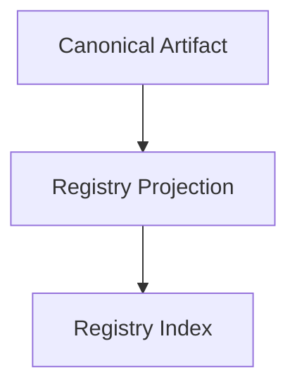

*Figure 18-1: Registry Synchronization Flow*

Changes originate from the Artifact and propagate to the Registry.

## 18.7 Anti-Patterns

The following practices are prohibited:

- Registry as source of truth;
- Registry-specific identities;
- Hidden registry-only metadata;
- Divergent registry state.

## 18.8 Validation

Registry validation shall verify:

- identity preservation;
- synchronization status;
- required fields;
- version consistency;
- traceability.

## 18.9 Example

```yaml
artifact_id: DISC-ARCH-20260706-001
uuid: 7d7fbeab-1111-4444-8888-aaaaaaaaaaaa
artifact_type: Discovery
registry_status: Active
```

## 18.10 Completion Statement

The Registry Contract is complete when every Artifact can be indexed, discovered, audited, and synchronized without replacing the canonical Artifact.

---

# 19. Artifact Extension Model

## 19.1 Purpose

Define how specialized standards extend the canonical Artifact contract without breaking compatibility.

## 19.2 Extension Philosophy

M.1 provides the immutable core contract. Specialized standards extend the contract by adding domain-specific capabilities rather than redefining canonical concepts.

## 19.3 Extension Layers

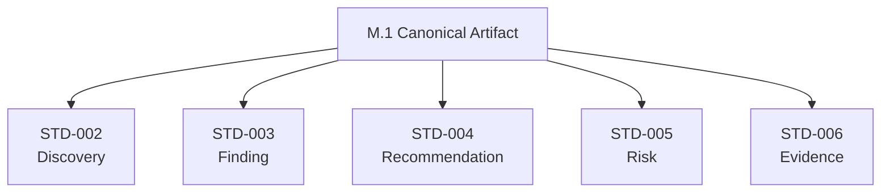

*Figure 19-1: Extension Layers*

## 19.4 What May Be Extended

- Metadata;
- Lifecycle sub-states;
- Validation rules;
- Relationship restrictions;
- Projection details;
- Serialization details;
- Domain-specific attributes.

## 19.5 What Shall Not Be Redefined

- Artifact identity;
- UUID semantics;
- Authority model;
- Ownership model;
- Canonical lifecycle invariants;
- Projection principle;
- Registry principle;
- Serialization principle.

## 19.6 Extension Rules

1. Preserve backward compatibility.
2. Keep canonical fields intact.
3. Document every extension.
4. Validate extensions independently.
5. Map specialized concepts back to M.1.

## 19.7 Compatibility Levels

| Level | Meaning |
|:---|:---|
| Fully Compatible | Pure extension, no contract changes. |
| Compatible | Optional additions only. |
| Conditionally Compatible | Requires documented migration. |
| Incompatible | Breaks M.1 contract (not permitted). |

## 19.8 Anti-Patterns

The following practices are prohibited:

- Replacing canonical fields;
- Changing Artifact identity semantics;
- Introducing hidden mandatory fields;
- Overriding governance rules;
- Breaking projection compatibility.

## 19.9 Validation

Extension validation shall verify:

- canonical contract preserved;
- extension documented;
- compatibility level declared;
- no forbidden redefinitions exist.

## 19.10 Example

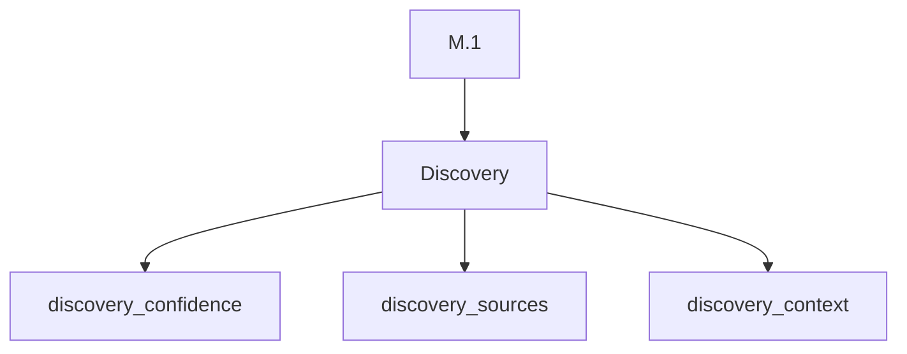

*Figure 19-2: Discovery Extension Example*

## 19.11 Completion Statement

The Extension Model is complete when specialized standards can safely extend M.1 while preserving interoperability, governance, and backward compatibility.

---

# 20. Artifact Compliance Model

## 20.1 Purpose

Define the canonical compliance model used to determine whether a governed Artifact conforms to M.1 and is ready for downstream consumption.

## 20.2 Compliance Layers

1. Contract Conformance
2. Governance Conformance
3. Validation Conformance
4. Projection Conformance
5. Registry Conformance
6. Readiness Assessment
7. Certification Status

## 20.3 Compliance States

| State | Meaning |
|:---|:---|
| Draft | Not yet evaluated. |
| In Review | Compliance assessment in progress. |
| Compliant | Meets all mandatory M.1 requirements. |
| Conditionally Compliant | Minor non-blocking deviations. |
| Non-Compliant | Mandatory requirements not satisfied. |
| Certified | Formally approved for framework consumption. |

## 20.4 Compliance Checklist

### 20.4.1 Identity

- Artifact identifier exists.
- UUID exists.
- Artifact type declared.

### 20.4.2 Governance

- Owner assigned.
- Authority declared.
- Review trace available.

### 20.4.3 Lifecycle

- Valid state.
- Valid transitions.

### 20.4.4 Metadata

- Mandatory metadata present.

### 20.4.5 Relationships

- Valid references.
- No orphan relationships.

### 20.4.6 Validation

- Structural validation passed.
- Governance validation passed.

### 20.4.7 Projection

- Canonical projections available.

### 20.4.8 Registry

- Registry synchronization verified.

## 20.5 Readiness Levels

| Level | Description |
|:---|:---|
| R0 | Draft only. |
| R1 | Structurally valid. |
| R2 | Governed. |
| R3 | Consumable by downstream standards. |
| R4 | Certified enterprise-ready. |

## 20.6 Certification Rules

Certification requires:

- Compliance = Compliant;
- No critical validation failures;
- Governance approval;
- Traceable audit history;
- Registry synchronization.

## 20.7 Anti-Patterns

The following practices are prohibited:

- Self-certification by AI;
- Hidden compliance exceptions;
- Consuming non-compliant Artifacts;
- Certification without governance approval.

## 20.8 Validation

Compliance validation shall verify:

- complete checklist;
- readiness level;
- certification prerequisites;
- audit trace;
- downstream compatibility.

## 20.9 Example

```yaml
compliance:
  state: Compliant
  readiness: R3
  certified: false
```

## 20.10 Completion Statement

The Compliance Model is complete when every Artifact can be assessed, certified, and consumed using a common governance process.

---

# References

| Reference | Identifier | Description |
|:---|:---|:---|
| [A.1 — Constitution](../A.1-Constitution.md) | `FORGE-A-001` | Constitutional invariants and human governance boundaries for the Forge AI Framework. |
| [M.0 — Framework Meta Model](./M.0-Framework-Meta-Model.md) | `FORGE-META-000` | Framework-level meta concepts from which M.1 derives the Artifact specialization. |
| [STD-000 — Framework Standards](../Standards/STD-000-Framework-Standards.md) | `FORGE-STD-000` | Governance rules for standards and standard-like Artifacts. |
| [STD-001 — Knowledge Graph Standard](../Standards/STD-001-Knowledge-Graph-Standard.md) | `FORGE-STD-001` | Canonical graph semantics consumed by Artifact projections. |
| [STD-002 — Discovery Standard](../Standards/STD-002-Discovery-Standard.md) | `FORGE-STD-002` | Specialized standard for Discovery Artifacts. |
| [STD-003 — Finding Standard](../Standards/STD-003-Finding-Standard.md) | `FORGE-STD-003` | Specialized standard for Finding Artifacts. |
| [STD-004 — Recommendation Standard](../Standards/STD-004-Recommendation-Standard.md) | `FORGE-STD-004` | Specialized standard for Recommendation Artifacts. |
| [STD-005 — Risk Standard](../Standards/STD-005-Risk-Standard.md) | `FORGE-STD-005` | Specialized standard for Risk Artifacts. |
| [STD-006 — Evidence Standard](../Standards/STD-006-Evidence-Standard.md) | `FORGE-STD-006` | Specialized standard for Evidence Artifacts. |

---

# Appendices

## Appendix A — Canonical Artifact Structure (Conceptual)

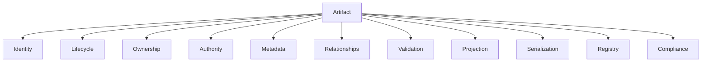

*Figure A-1: Canonical Artifact Conceptual Structure*

---

## Appendix B — Artifact Inheritance


*Figure B-1: Artifact Inheritance Hierarchy*

---

## Appendix C — JSON Example

```json
{
  "artifact_id": "DISC-ARCH-20260706-001",
  "artifact_type": "Discovery",
  "version": "1.0.0",
  "state": "Verified"
}
```

---

## Appendix D — YAML Example

```yaml
artifact_id: DISC-ARCH-20260706-001
artifact_type: Discovery
version: 1.0.0
state: Verified
```

---

## Appendix E — Extension Example

Discovery extends M.1 by adding:

- `discovery_confidence`
- `discovery_sources`
- `discovery_context`

without redefining canonical fields. See [Section 19 — Artifact Extension Model](#19-artifact-extension-model) for the full extension contract.

---

## Appendix F — Validation Pipeline Example

Structural > Governance > Relationship > Compliance

See [Section 15.4](#154-validation-pipeline) for the full pipeline definition.

---

## Appendix G — Anti-Pattern Catalog

| Anti-Pattern | Category | Reference |
|:---|:---|:---|
| Identity based on filename | Identity | [Section 8.9](#89-identity-anti-patterns) |
| Registry as source of truth | Registry | [Section 18.7](#187-anti-patterns) |
| AI self-certification | Governance | [Section 20.7](#207-anti-patterns) |
| Hidden ownership | Governance | [Section 12.8](#128-anti-patterns) |
| Duplicate canonical metadata | Metadata | [Section 13.6](#136-anti-patterns) |
| AI self-promoting to Accepted | Lifecycle | [Section 9.10](#910-lifecycle-anti-patterns) |
| Editing JSON as canonical source | Projection | [Section 16.8](#168-anti-patterns) |
| Lossy serialization | Serialization | [Section 17.9](#179-anti-patterns) |
| Replacing canonical fields | Extension | [Section 19.8](#198-anti-patterns) |
| Self-certification by AI | Compliance | [Section 20.7](#207-anti-patterns) |

---

## Appendix H — Compliance Matrix

| Area | Required |
|:---|:---:|
| Identity | Yes |
| Lifecycle | Yes |
| Metadata | Yes |
| Validation | Yes |
| Registry | Yes |

---

## Appendix I — Glossary

| Term | Definition |
|:---|:---|
| Artifact | A governed knowledge object with identity, lifecycle, ownership, authority, and graph participation. |
| Projection | A derived representation of a canonical Artifact in a specific format (JSON, YAML, Markdown, etc.). |
| Serialization | A portable representation of a canonical Artifact, supporting deterministic round-trip reconstruction. |
| Registry | An index of Artifacts used for discovery, governance, audit, and automation. Registry entries are projections, not the source of truth. |
| Compliance | Measured conformance of an Artifact to M.1 and its specialized standard. |
| Canonical | The authoritative, representation-independent definition of an Artifact. |
| Extension | Domain-specific additions to the M.1 contract made by specialized standards without redefining canonical concepts. |

---

## Appendix J — Quick Reference

| Topic | Section |
|:---|:---|
| Identity | [Section 8](#8-artifact-identity-model) |
| Lifecycle | [Section 9](#9-artifact-lifecycle-model) |
| Anatomy | [Section 10](#10-artifact-anatomy) |
| Ownership & Authority | [Section 12](#12-artifact-ownership--authority-model) |
| Metadata | [Section 13](#13-artifact-metadata-model) |
| Relationships | [Section 14](#14-artifact-relationship-contract) |
| Validation | [Section 15](#15-artifact-validation-contract) |
| Projection | [Section 16](#16-artifact-projection-model) |
| Serialization | [Section 17](#17-artifact-serialization-model) |
| Registry | [Section 18](#18-artifact-registry-contract) |
| Extension | [Section 19](#19-artifact-extension-model) |
| Compliance | [Section 20](#20-artifact-compliance-model) |