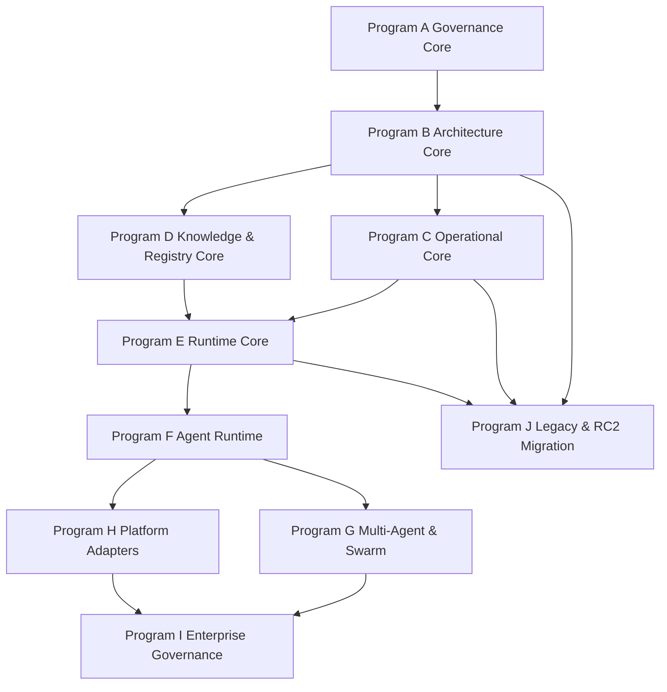

# Forge AI Program Architecture & Master Roadmap v4

> Forge AI v4 · Program Architecture · Master Roadmap  
> Strategic program model for architecture, governance, operational systems, runtime, knowledge, agents, swarm, platform, enterprise, and legacy migration.

---

## Document Metadata

| Field | Value |
|:---|:---|
| Identifier | `FORGE-AI.V4.MASTER-ROADMAP` |
| Title | Forge AI Program Architecture & Master Roadmap v4 |
| Version | `4.0.0-draft` |
| Status | Draft |
| Canonical Status | Non-canonical until reviewed, approved, and promoted by Human Governance |
| Classification | Strategic Architecture Roadmap |
| Document Type | Program Architecture Roadmap |
| Owner | Framework Governance |
| Maintainers | Framework Architecture Team |
| Review Authority | Human Governance / Framework Governance |
| Approval Authority | Human Governance |
| Created | 2026-07-09 |
| Last Updated | 2026-07-09 |
| Lifecycle Phase | Draft Roadmap |
| Traceability ID | `FORGE-AI.V4.MASTER-ROADMAP` |
| Scope | Program-level architecture roadmap for Forge AI v4, aligning governance, runtime, engine foundation, operational systems, knowledge systems, agent runtime, swarm, platform adapters, enterprise governance, and legacy migration. |
| Out of Scope | Implementation approval, Runtime activation, Agent Runtime activation, Swarm Runtime activation, ProjectStatus update, canonical promotion, certification, source-code changes, platform-specific implementation, and legacy file moves. |
| Normative Authority | Human Governance; `AGENTS.md`; `docs/AI/GOVERNANCE.md`; `docs/FrameworkGovernance.md`; `docs/DevelopmentPhases/ProjectStatus.md`; `docs/DevelopmentPhases/ForgeAI-DevelopmentPhases.md` |
| Normative References | `docs/AI/Architecture/A.1-Constitution.md`; `docs/AI/Meta/M.0-Framework-Meta-Model.md`; `docs/AI/Meta/M.1-Artifact-Meta-Model.md`; `docs/AI/Architecture/Standards/STD-000-Framework-Standards.md`; `docs/AI/Architecture/Standards/STD-003-Terminology-Standard.md`; `docs/AI/Architecture/Standards/STD-010-Document-Metadata-Standard.md`; `docs/AI/Runtime/A.3-Runtime-Architecture-RFC.md`; `docs/AI/Runtime/A.4-Engine-Architecture-RFC.md`; `docs/AI/Runtime/A.5.0-Engine-Specialization-RFC-Template.md`; `docs/AI/Runtime/Reports/Phase-2-Engine-Foundation-Canonical-Review.md` |
| Dependencies | Governance Core; Meta Foundation; Standards Foundation; Runtime Architecture; Engine Platform; Engine Foundation RFC family; Canonical Review package; RC2 migration and harvest reports; active ProjectStatus and DevelopmentPhases roadmap. |
| Consumes | Existing Forge AI Development Phases, Master Architecture Roadmap v3, Engine Foundation reviews, architecture consistency audit, authority cleanup plan, migration strategy, transitional authority verification, RC2 harvest report, and RC2 legacy migration plan. |
| Produces | Program architecture model, strategic program roadmap, program dependency graph, execution sequence, gate model, legacy/RC2 handling model, parallel-system separation policy, and recommended next actions. |
| Related Specifications | Governance Atlas v2; FrameworkGovernance; AGENTS.md; AIFramework; AIOrchestrator; AgentSystemPrompt; DevelopmentPhases; ProjectStatus; Engine Foundation Canonical Review; RC2 migration reports. |
| Supersedes | Strategic interpretation of `Forge-AI-v3-Master-Architecture-Development-Roadmap.md` for v4 planning purposes only; does not delete or rewrite the v3 roadmap. |
| Superseded By | None |
| Promotion Requirements | Framework Governance review, Human Governance review, alignment with ProjectStatus, DevelopmentPhases reconciliation, legacy migration safety review, and explicit approval. |
| Certification Status | Not certified |

---

## 1. Executive Summary

Forge AI v4 has moved beyond a document-generation roadmap and now requires a program-level architecture roadmap.

The earlier roadmap model described phases. That was useful during initial architecture creation, but the repository has now matured into multiple interdependent systems:

- Governance Core;
- Meta and Standards Foundation;
- Runtime and Engine Foundation;
- Operational Layer;
- Knowledge and Registry Systems;
- Agent Runtime;
- Multi-Agent and Swarm Runtime;
- Platform Adapters;
- Enterprise Governance;
- Legacy and RC2 Migration.

This document introduces a higher-level planning layer:

```text
Forge AI
    ↓
Programs
    ↓
Phases
    ↓
Milestones
    ↓
Tasks
    ↓
Artifacts
```

The purpose is to eliminate ambiguity around “what comes next” by defining the major programs, their dependencies, their freeze gates, and their acceptance gates.

This roadmap does not update ProjectStatus, approve implementation, activate runtime, move legacy files, or promote any document. It provides strategic planning structure only.

---

## 2. Why Program Architecture Is Needed

The Forge AI architecture now contains mature governance, standards, runtime, and engine documentation. The Engine Foundation has completed its RFC series and review package and is ready for Human Governance canonical consideration.

However, older roadmap documents still mix several concerns:

- document creation;
- architectural maturity;
- operational compatibility;
- implementation planning;
- legacy migration;
- agent runtime;
- swarm runtime;
- platform integration.

The result is that phase numbers alone no longer explain the real dependency structure.

Program Architecture solves this by separating:

| Concern | Owned By |
|:---|:---|
| Strategic direction | Master Roadmap |
| Current active state | ProjectStatus |
| Phase order | DevelopmentPhases |
| Governance navigation | Governance Atlas |
| Governance decisions | FrameworkGovernance |
| Architecture authority | Constitution / Meta / Standards / Runtime / Engine RFCs |
| Execution behavior | AGENTS / Operational Layer |
| Legacy compatibility | RC2 migration reports and compatibility bridge |

---

## 3. Roadmap Interpretation Rules

### 3.1 Master Roadmap

This document answers:

> Where is Forge AI going over the long term?

It defines programs and their dependencies.

### 3.2 DevelopmentPhases

`docs/DevelopmentPhases/ForgeAI-DevelopmentPhases.md` answers:

> What is the planned execution sequence?

It should remain the phase-level execution roadmap.

### 3.3 ProjectStatus

`docs/DevelopmentPhases/ProjectStatus.md` answers:

> What is active right now?

ProjectStatus is operational state only. It does not promote architecture, authorize implementation, or replace roadmap authority.

### 3.4 Governance Atlas

`docs/AI/GOVERNANCE.md` answers:

> Where are the governance authorities and document owners?

It is a navigation map, not a decision policy.

### 3.5 FrameworkGovernance

`docs/FrameworkGovernance.md` answers:

> How are governance decisions made?

It is the governance policy authority for decision, review, approval, promotion, escalation, and change control.

---

## 4. Program Architecture Overview

Forge AI v4 shall be managed through the following programs.

| Program | Name | Purpose | Current Status |
|:---|:---|:---|:---|
| Program A | Governance Core | Establish authority, policy, status, roadmap, and agent boot rules | Near complete / stabilization |
| Program B | Architecture Core | Constitution, Meta Models, Standards, Runtime, Engine Platform, Engine Foundation | Engine Foundation ready for canonical review |
| Program C | Operational Core | AIFramework, AIOrchestrator, AgentSystemPrompt, commands, workflows, templates | Transitional / requires v4 alignment |
| Program D | Knowledge & Registry Core | Knowledge Graph, Discovery, Evidence, Risk, Recommendation, Registry, Traceability | Partially specified / not operational |
| Program E | Runtime Core | Runtime kernel, executable engine runtime, context builder, state manager, execution bus | Not active |
| Program F | Agent Runtime | agent identity, roles, lifecycle, prompts, task execution, memory access | Not active |
| Program G | Multi-Agent & Swarm | collaboration, scheduling, conflict resolution, consensus, swarm orchestration | Frozen |
| Program H | Platform Adapters | IDE, GitHub, CLI, Codex, Cursor, Claude, OpenAI, CI integration | Frozen |
| Program I | Enterprise Governance | dashboards, compliance, audit, federated governance, multi-repository control | Future |
| Program J | Legacy & RC2 Migration | harvest, compatibility bridge, link remediation, legacy move | Frozen until replacements exist |

---

## 5. Program Dependency Graph



Dependency rule:

> A downstream program may begin only when its upstream authority, specification, and operational guardrails are sufficiently stable or explicitly waived by Human Governance.

---

## 6. Program A — Governance Core

### Purpose

Governance Core defines how Forge AI is governed, routed, approved, frozen, promoted, and updated.

### Includes

- `AGENTS.md`
- `docs/AI/GOVERNANCE.md`
- `docs/FrameworkGovernance.md`
- `docs/DevelopmentPhases/ProjectStatus.md`
- `docs/DevelopmentPhases/ForgeAI-DevelopmentPhases.md`
- Human Governance approval rules
- Canonical promotion policy
- ProjectStatus policy
- frozen-area policy

### Current Status

Near complete, but FrameworkGovernance should be refactored to v2 before Governance Core is frozen.

### Required Next Work

1. FrameworkGovernance v2 refactor.
2. AGENTS v2 bootloader/agent governance alignment.
3. Governance Core consistency review.
4. Governance Core freeze.

### Exit Criteria

- Governance Atlas is navigation-only.
- FrameworkGovernance is policy-only.
- AGENTS is bootloader/agent operating entrypoint.
- ProjectStatus remains live operational state only.
- DevelopmentPhases remains phase execution roadmap.
- No duplicated governance ownership remains.

---

## 7. Program B — Architecture Core

### Purpose

Architecture Core defines the canonical architectural substrate of Forge AI.

### Includes

- A.1 Constitution
- M.0 Framework Meta Model
- M.1 Artifact Meta Model
- STD-000, STD-001, STD-002, STD-003, STD-010
- A.3 Runtime Architecture
- A.4 Engine Platform
- A.5.0 Engine Specialization Template
- A.5.1 through A.5.12 Engine RFCs
- Review package:
  - Inventory & Compliance Review
  - Engine Architecture Consistency Review
  - Engine RFC Certification Review
  - Phase 2 Engine Foundation Canonical Review

### Current Status

Engine Foundation is complete as an RFC package and approved with observations for canonical consideration, pending Human Governance action.

### Required Next Work

1. Human Governance canonical decision.
2. Editorial Normalization.
3. ProjectStatus update if approved.
4. Architecture Core freeze.

### Exit Criteria

- Canonical baseline decision recorded.
- Draft/canonical status is unambiguous.
- Engine Foundation package is either accepted, accepted with conditions, or returned for follow-up.
- Implementation remains separate unless explicitly authorized.

---

## 8. Program C — Operational Core

### Purpose

Operational Core defines how AI agents, commands, workflows, templates, and orchestrators operate under the architecture.

### Includes

- `docs/AI/AIFramework.md`
- `docs/AI/AIOrchestrator.md`
- `docs/AI/AgentSystemPrompt.md`
- `docs/AI/System/*`
- `docs/AI/Commands/*`
- `docs/AI/Workflows/*`
- `docs/AI/Templates/*`
- validation/review/certification operational procedures

### Current Status

Transitional. RC2 operational compatibility remains useful and should not be moved or deprecated until v4 replacements exist.

### Required Next Work

1. AIFramework v2.
2. AIOrchestrator v2.
3. AgentSystemPrompt v2.
4. Commands/Workflows/Templates classification review.
5. Operational Core compatibility bridge.
6. Operational Core review.

### Exit Criteria

- Operational docs consume Governance Core and Architecture Core.
- Operational docs do not redefine architecture.
- RC2 operational compatibility is explicitly classified.
- Commands/workflows/templates are aligned to STD-010 and M.1.
- Agent-facing instructions are synchronized with AGENTS v2.

---

## 9. Program D — Knowledge & Registry Core

### Purpose

Knowledge & Registry Core defines the governed knowledge substrate and discoverability model.

### Includes

- Knowledge Graph
- Discovery
- Evidence
- Finding
- Recommendation
- Risk
- Decision records
- Registry
- Traceability
- Provenance
- Knowledge projection
- registry discovery and compatibility records

### Current Status

Partially specified through STD-001, STD-002, Engine Foundation, and Registry Engine RFC. Not yet operational.

### Required Next Work

1. Knowledge Graph projection consolidation.
2. Evidence/Finding/Recommendation/Risk standard continuation.
3. Registry model alignment with A.4.3 and A.5.12.
4. Traceability and provenance review.
5. Knowledge/Registry implementation planning only after Runtime Core activation.

### Exit Criteria

- Knowledge artifacts have explicit owners.
- Registry artifacts have explicit owners.
- Graph projection model is consistent with engines.
- No knowledge or registry implementation begins before runtime authorization.

---

## 10. Program E — Runtime Core

### Purpose

Runtime Core turns the architecture into an executable runtime model.

### Includes

- Runtime kernel
- Engine runtime
- execution bus
- engine registry runtime
- context builder
- state manager
- event manager
- validation/review/certification execution hooks

### Current Status

Not active. Runtime architecture exists as documentation. Implementation remains unapproved.

### Required Activation Gates

Runtime Core may begin only after:

1. Governance Core freeze.
2. Architecture Core canonical decision.
3. Operational Core compatibility alignment.
4. Runtime implementation authorization by Human Governance.
5. ProjectStatus update authorizing Runtime Core.

### Exit Criteria

- Runtime contracts are machine-checkable.
- Engine handoffs are executable.
- state and event models are testable.
- no runtime component redefines A.3/A.4/A.5.

---

## 11. Program F — Agent Runtime

### Purpose

Agent Runtime defines agent identity, lifecycle, prompt execution, task handling, and governed interaction with runtime, knowledge, memory, workflow, and registry systems.

### Current Status

Not active.

### Activation Gates

- Runtime Core active or sufficiently specified.
- AGENTS v2 complete.
- AgentSystemPrompt v2 complete.
- AIFramework/AIOrchestrator v2 complete.
- Human Governance approval.

### Exit Criteria

- agents have identities and roles;
- tasks are traceable;
- prompt behavior is governed;
- agent memory access is bounded;
- Human Governance remains final.

---

## 12. Program G — Multi-Agent & Swarm

### Purpose

Defines collaboration between multiple agents and future swarm orchestration.

### Current Status

Frozen.

### Activation Gates

- Agent Runtime stable.
- workflow/runtime coordination stable.
- conflict-resolution governance exists.
- Human Governance approval.

### Exit Criteria

- deterministic collaboration;
- governed scheduling;
- conflict resolution;
- consensus/approval boundaries;
- audit trail.

---

## 13. Program H — Platform Adapters

### Purpose

Defines integration with external tools and environments.

### Includes

- IDE adapters
- GitHub adapter
- CLI adapter
- Codex/Cursor/Claude/OpenAI integration
- CI adapter
- repository adapter

### Current Status

Frozen.

### Activation Gates

- Runtime Core stable.
- Agent Runtime stable.
- adapter boundary standard exists.
- Human Governance approval.

### Exit Criteria

- adapters consume Forge AI;
- adapters never redefine Forge AI;
- platform-specific behavior remains outside core architecture.

---

## 14. Program I — Enterprise Governance

### Purpose

Defines enterprise adoption, compliance, dashboards, audit, federation, and multi-repository governance.

### Current Status

Future.

### Activation Gates

- Platform adapters stable.
- governance metrics available.
- registry and traceability operational.
- Human Governance approval.

---

## 15. Program J — Legacy & RC2 Migration

### Purpose

Migrates or archives RC2 material after harvest, compatibility, replacement, and link remediation.

### Current Status

Frozen / not ready to move.

### Constraints from Prior Reports

RC2 Specification must not be moved until:

- runtime content is harvested or replaced;
- terminology is harvested or replaced;
- workflow/command/template boundaries are mapped;
- governance/certification content has a v4 destination;
- adapter/reference material has a v4 destination;
- active links are remediated;
- operational compatibility remains intact.

### Exit Criteria

- RC2 source material harvested;
- replacements exist or waivers are approved;
- link plan approved;
- compatibility bridge in place;
- legacy move explicitly authorized;
- ProjectStatus updated only through authorized task.

---

## 16. Strategic Execution Sequence

Recommended sequence from the current state:

```text
1. Finalize Governance Core
   - FrameworkGovernance v2
   - AGENTS v2
   - Governance Core consistency review

2. Complete Architecture Core governance actions
   - Human Governance canonical decision
   - Editorial Normalization
   - ProjectStatus update if approved

3. Stabilize Operational Core
   - AIFramework v2
   - AIOrchestrator v2
   - AgentSystemPrompt v2
   - operational compatibility bridge

4. Plan Knowledge & Registry Core
   - graph projection map
   - remaining standards
   - registry alignment

5. Activate Runtime Core only after explicit authorization

6. Proceed to Agent Runtime

7. Proceed to Multi-Agent / Swarm

8. Proceed to Platform Adapters

9. Proceed to Enterprise Governance

10. Perform Legacy / RC2 Migration only after replacements and harvest completion
```

---

## 17. Parallel System Separation Policy

Forge AI contains legacy-compatible RC2 operational material and newer v4 architecture material.

Codex or any AI agent should not “parallelize” or split the system by inventing a separate live architecture track.

Instead, future work should classify existing material into one of these categories:

| Category | Meaning | Allowed Action |
|:---|:---|:---|
| Canonical / Active | Current approved source of truth | Consume and preserve |
| Draft / Candidate | Proposed future authority | Review, improve, do not auto-promote |
| Transitional | Compatibility bridge or migration material | Preserve until replacement |
| Operational Compatibility | RC2 or legacy-compatible executable procedure | Keep operational until replacement exists |
| Evidence / Report | Audit, review, plan, migration report | Consume as evidence only |
| Legacy / Historical | Archived material | Reference only |
| Frozen | Not active until roadmap authorization | Do not edit or activate |

### 17.1 Codex Separation Rule

Codex may separate documents by classification, responsibility, and migration state.

Codex shall not create a second competing live system.

If a document appears duplicated, Codex shall classify it as:

- canonical;
- candidate;
- transitional;
- operational compatibility;
- evidence;
- legacy;
- or frozen.

Codex must not silently delete, move, promote, deprecate, or supersede a document.

### 17.2 RC2 Separation Rule

RC2 material is not automatically obsolete.

RC2 material may be:

- harvested;
- mapped;
- retained as operational compatibility;
- moved to legacy after replacement;
- or waived by Human Governance.

RC2 must not be moved merely because v4 architecture exists.

---

## 18. Program Gate Model

| Gate | Purpose | Approver |
|:---|:---|:---|
| Review Gate | Evidence and quality review | Framework Governance |
| Canonical Gate | Canonical-readiness decision | Human Governance |
| Freeze Gate | Stabilize a program boundary | Human Governance / Framework Governance |
| Activation Gate | Authorize implementation or runtime work | Human Governance |
| Migration Gate | Authorize legacy move or archive | Human Governance |
| Release Gate | Declare baseline or release package | Human Governance |

---

## 19. Current Recommended Next Steps

The recommended next steps are:

1. Commit this Master Roadmap v4.
2. Run a no-edit roadmap alignment review.
3. Update `DevelopmentPhases` only if Human Governance approves alignment.
4. Refactor `FrameworkGovernance.md` to v2.
5. Refactor `AGENTS.md` to v2.
6. Resume operational core alignment.
7. Do not begin Runtime implementation yet.
8. Do not move RC2 or split parallel systems yet.

---

## 20. Success Criteria

This roadmap is successful when:

- Forge AI has a clear program-level roadmap.
- Phase-level work is governed by program dependencies.
- ProjectStatus remains operational state.
- DevelopmentPhases remains execution sequence.
- Governance Atlas remains navigation.
- FrameworkGovernance remains policy.
- AGENTS remains bootloader / agent operating entrypoint.
- RC2 remains compatibility material until harvested.
- Codex does not create parallel live systems.
- Runtime activation remains explicitly governed.
- Legacy migration is delayed until replacements and link remediation exist.

---

## 21. Completion Statement

This document establishes the program-level master roadmap for Forge AI v4.

It should be committed as a strategic planning artifact before further governance, AGENTS, operational-layer, runtime, or legacy-migration work proceeds.

It does not modify ProjectStatus, promote documents, approve implementation, activate runtime, or move legacy files.
