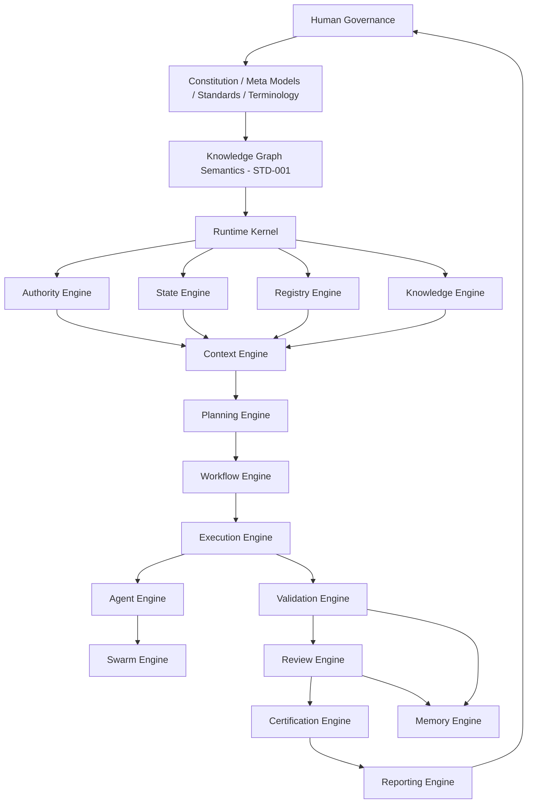
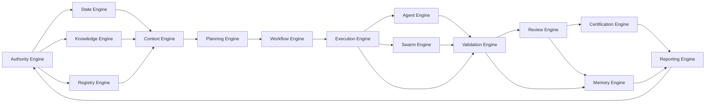
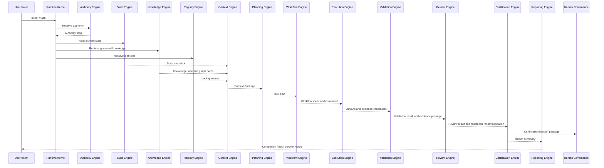
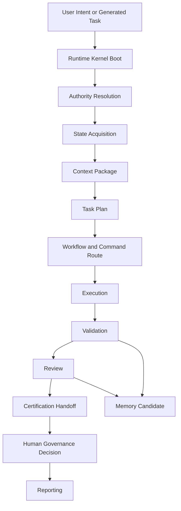

# A.4 — Engine Architecture RFC

> **Forge AI v3 · Runtime Engine Architecture · Request for Comments**

---

## 1. Status

| Property | Value |
|:---|:---|
| Document | A.4 — Engine Architecture RFC |
| Identifier | `FORGE-RUNTIME-A.4` |
| Version | `0.1.0-draft` |
| Status | RFC / Draft / Non-canonical |
| Type | Runtime Architecture RFC |
| Classification | Forge AI v3 Runtime |
| Owner | Runtime Architecture |
| Final Authority | Human Governance |
| Created | 2026-07-07 |

This document is a draft RFC. It does not promote itself to canonical status, does not supersede RC2 operational procedures, does not update `docs/ProjectStatus.md`, and does not define implementation language, API, database, queue, product, editor, or runtime-host choices.

## 2. Purpose

This RFC defines the conceptual engine architecture inside the Forge AI Runtime. It identifies which engines exist, what each engine owns, what each engine consumes, what each engine produces, and what each engine is forbidden to do.

The goal is to make Forge AI executable in architecture before implementation. The Runtime executes governed work; it does not redefine the Constitution, Meta Models, Standards, Knowledge Graph semantics, terminology, project state, or certification authority.

## 3. Scope

In scope:

- the required Forge AI v3 Runtime engine set;
- engine ownership boundaries;
- engine inputs and outputs;
- engine dependency order;
- engine communication and lifecycle rules;
- AI usage constraints;
- graph integration constraints;
- validation and certification handoff rules.

Out of scope:

- implementation code;
- runtime APIs;
- storage engines;
- queues;
- programming languages;
- product integrations;
- platform adapters;
- Project Status updates;
- canonical promotion of this RFC.

## 4. Authority

This RFC consumes the following governing inputs:

1. `AGENTS.md` as bootstrap authority.
2. `docs/AI/Architecture/A.1-Constitution.md` for constitutional principles, human authority, evidence, and ownership rules.
3. `docs/AI/Architecture/Blueprint/Forge-AI-Blueprint-v1.0-RFC.md` for non-canonical architectural layer orientation.
4. `docs/AI/Meta/M.0-Framework-Meta-Model.md` for framework entities, identity, relationships, lifecycle, state, authority, ownership, validation, review, and certification concepts.
5. `docs/AI/Meta/M.1-Artifact-Meta-Model.md` for governed Artifact contracts.
6. `docs/AI/Runtime/A.3-Runtime-Architecture-RFC.md` for Runtime Kernel, context, memory, validation, review, certification handoff, agent, and swarm alignment.
7. `docs/AI/Architecture/Standards/STD-000-Framework-Standards.md` for standards governance.
8. `docs/AI/Architecture/Standards/STD-001-Knowledge-Graph-Standard.md` for Knowledge Graph semantics, nodes, edges, traversal, and graph validation rules.
9. `docs/AI/Architecture/Standards/STD-002-Discovery-Standard.md` for Discovery artifact alignment and registry constraints.
10. `docs/AI/Architecture/Standards/STD-003-Terminology-Standard.md` for v3 terminology alignment.

If this RFC conflicts with a higher-authority input, the higher-authority input prevails. If it conflicts with another draft or RFC, the conflict is an open decision for Human Governance.

## 5. Engine Philosophy

Forge AI engines are bounded conceptual runtime components. Each engine has one primary responsibility and must consume authority rather than become authority.

Engine principles:

- Runtime executes; it does not redefine standards.
- Engines route, prepare, validate, assemble, propose, or report; they do not self-certify.
- Human Governance remains the final authority.
- The Registry Engine indexes; it is not a source of truth.
- The Memory Engine derives reusable learning; it is not authority.
- The Context Engine assembles temporary context; it is not project state.
- Knowledge Graph semantics belong to STD-001.
- Terminology follows STD-003.
- Engine boundaries protect explicit ownership.
- Engine outputs are evidence, proposals, context packages, reports, state-transition requests, or handoff packages unless another authority explicitly grants more.

## 6. Engine Architecture Overview

Forge AI v3 Runtime contains the following required engines:

1. Runtime Kernel
2. Authority Engine
3. State Engine
4. Context Engine
5. Knowledge Engine
6. Planning Engine
7. Execution Engine
8. Validation Engine
9. Review Engine
10. Certification Engine
11. Memory Engine
12. Registry Engine
13. Workflow Engine
14. Agent Engine
15. Swarm Engine
16. Reporting Engine

### 6.1 Engine Stack



## 7. Engine Responsibility Matrix

| Engine | Primary responsibility | Primary inputs | Primary outputs | Forbidden responsibility |
|:---|:---|:---|:---|:---|
| Runtime Kernel | Coordinate engine lifecycle and enforce runtime order | Authority map, task intent, runtime policies | Engine dispatch, lifecycle trace | Redefine authority or self-certify |
| Authority Engine | Resolve applicable authority chain | Governing documents, standards, state | Authority map, conflict notices | Promote RFCs or override Human Governance |
| State Engine | Read and expose authoritative project/artifact state | Project state artifacts, lifecycle records | State snapshot, transition request | Treat context or memory as state |
| Context Engine | Assemble temporary execution context | Authority map, state snapshot, knowledge, registry entries | Context Package | Persist state or define architecture |
| Knowledge Engine | Retrieve governed knowledge and graph paths | Standards, documents, Knowledge Graph | Knowledge slice, trace paths | Redefine graph semantics |
| Planning Engine | Derive scoped work from approved planning inputs | State, authority, context, workflows | Task plan, scope boundary | Invent work outside approved scope |
| Execution Engine | Execute approved commands/workflows through agents or automation | Task plan, workflow route, context | Execution outputs, evidence candidates | Validate or certify its own work |
| Validation Engine | Verify outputs against requirements and standards | Execution outputs, quality gates, evidence | Validation result, evidence package | Approve, review, or certify |
| Review Engine | Independently assess readiness | Validation result, evidence, outputs | Review result, findings, risks | Implement new functionality or self-certify |
| Certification Engine | Prepare governance certification handoff | Review result, validation evidence, authority map | Certification handoff package | Certify without Human Governance authority |
| Memory Engine | Derive reusable memory candidates | Validated/reviewed evidence, outcomes | Memory candidate, retention rationale | Become authority or project state |
| Registry Engine | Index identities and lookup references | Governed artifacts, graph nodes, standards | Registry lookup, uniqueness signal | Become source of truth |
| Workflow Engine | Select and route governed workflows | Task plan, command rules, lifecycle | Workflow route, command selection | Invent work or bypass validation |
| Agent Engine | Coordinate individual AI agents | Context Package, command, constraints | Agent output, rationale, evidence | Own architecture or self-certify |
| Swarm Engine | Coordinate multi-agent execution | Work partitions, agent constraints, context slices | Swarm result, coordination trace | Act as self-governing collective |
| Reporting Engine | Produce traceable runtime reports | Engine traces, validation, review, handoff | Completion report, risk report | Rewrite authority or hide failures |

## 8. Engine Dependency Graph



Dependency rules:

- Authority must be resolved before planning, execution, validation, review, or certification handoff.
- State must be read before task planning.
- Context must be assembled before execution.
- Validation must precede review.
- Review must precede certification handoff.
- Certification must precede project state update where a state update is applicable.
- Memory is derived after validation/review and may only inform future context.

## 9. Runtime Kernel

### Responsibility

The Runtime Kernel coordinates the engine lifecycle, initializes execution, enforces engine order, routes engine calls, records runtime traces, and stops execution when authority, state, scope, validation, review, or certification boundaries are violated.

### Inputs

- User intent or generated task.
- Authority Engine result.
- Runtime policies from A.3 Runtime Architecture.
- Workflow route.
- Engine traces and failure signals.

### Outputs

- Engine dispatch sequence.
- Runtime lifecycle trace.
- Blocker report when execution cannot proceed.
- Handoff request to Reporting Engine.

### Consumed authority

- `AGENTS.md`.
- A.1 Constitution.
- A.3 Runtime Architecture RFC.
- STD-000 through STD-003 as applicable.
- Human Governance decisions.

### Produced artifacts

- Runtime trace.
- Engine lifecycle record.
- Runtime blocker report.

### Forbidden responsibilities

- Redefining framework concepts, standards, graph semantics, or terminology.
- Treating runtime behavior as architecture authority.
- Certifying its own execution.
- Updating Project Status without certified authorization.

## 10. Authority Engine

### Responsibility

The Authority Engine identifies the governing authority chain for a task, resolves which documents control the current scope, detects authority conflicts, and provides an authority map to downstream engines.

### Inputs

- User intent or generated task.
- Bootstrap authority.
- Architecture, Meta Model, Standards, Runtime, Workflow, Command, and Project Status documents.
- Human Governance directives.

### Outputs

- Authority map.
- Applicable standards list.
- Conflict or ambiguity report.
- Escalation recommendation.

### Consumed authority

- `AGENTS.md`.
- A.1 Constitution.
- Framework Governance.
- Project Status for live operational state.
- STD-000 governance rules.
- STD-003 terminology rules.

### Produced artifacts

- Authority resolution record.
- Conflict notice.
- Governance escalation package.

### Forbidden responsibilities

- Promoting draft documents to canonical status.
- Overriding Human Governance.
- Treating lower-authority runtime output as higher-authority architecture.
- Resolving conflicts silently.

## 11. State Engine

### Responsibility

The State Engine reads authoritative project, artifact, lifecycle, and task state and exposes a bounded state snapshot to planning and context assembly.

### Inputs

- `docs/ProjectStatus.md`.
- Certified lifecycle records.
- Artifact state records.
- Certification outcomes authorized by Human Governance.

### Outputs

- State snapshot.
- State-transition eligibility signal.
- State inconsistency report.
- Project-state update request when certified and applicable.

### Consumed authority

- `AGENTS.md`.
- Framework Governance.
- Project Status.
- M.0 state and lifecycle concepts.
- M.1 Artifact lifecycle contract.

### Produced artifacts

- State snapshot.
- State transition request.
- State integrity report.

### Forbidden responsibilities

- Treating Context Packages as project state.
- Treating Memory as state authority.
- Updating Project Status without certification.
- Redefining lifecycle states.

## 12. Context Engine

### Responsibility

The Context Engine assembles a temporary, traceable Context Package for one execution cycle using authority, state, knowledge, registry lookups, workflow needs, and task scope.

### Inputs

- Authority map.
- State snapshot.
- Knowledge slices.
- Registry lookup results.
- Task plan.
- Workflow route.

### Outputs

- Context Package.
- Context source manifest.
- Context gap report.
- Context release record.

### Consumed authority

- A.3 Runtime Architecture RFC.
- STD-003 Context and Context Package terminology.
- STD-001 traversal constraints when context includes graph paths.
- Authority Engine output.

### Produced artifacts

- Context Package.
- Context manifest.
- Context gap report.

### Forbidden responsibilities

- Becoming project state.
- Persisting temporary context as memory without review.
- Redefining authority or standards.
- Expanding task scope beyond Planning Engine output.

## 13. Knowledge Engine

### Responsibility

The Knowledge Engine retrieves governed knowledge, graph paths, relevant artifacts, standards, terminology, and evidence references required for context, planning, validation, review, and reporting.

### Inputs

- Authority map.
- Knowledge Graph traversal request.
- Standards and governed documents.
- Registry references.
- Terminology needs.

### Outputs

- Knowledge slice.
- Graph trace path.
- Evidence reference set.
- Knowledge conflict or missing-link report.

### Consumed authority

- STD-001 Knowledge Graph Standard.
- STD-003 Terminology Standard.
- M.0 and M.1 model contracts.
- Governing architecture and standards documents.

### Produced artifacts

- Knowledge slice manifest.
- Graph traversal trace.
- Knowledge gap report.

### Forbidden responsibilities

- Redefining Knowledge Graph semantics.
- Treating a retrieved document excerpt as superseding its source authority.
- Creating canonical knowledge without governance.
- Treating Memory as authoritative Knowledge.

## 14. Planning Engine

### Responsibility

The Planning Engine derives scoped executable work from approved planning documents, current state, authority, workflow constraints, and user intent when the request is in scope.

### Inputs

- User intent or generated task.
- Authority map.
- State snapshot.
- Context Package.
- Current planning hierarchy.
- Workflow options.

### Outputs

- Task plan.
- Scope boundary.
- Required deliverables list.
- Planning blocker report.

### Consumed authority

- AGENTS planning hierarchy.
- Framework Governance.
- Project Status.
- Phase, Stage, Capability, and Task documents where applicable.
- STD-003 Task terminology.

### Produced artifacts

- Task plan.
- Scope boundary record.
- Deliverables checklist.

### Forbidden responsibilities

- Inventing work not grounded in approved state, planning, or explicit human tasking.
- Changing capability identifiers.
- Updating Project Status.
- Certifying plan completion.

## 15. Execution Engine

### Responsibility

The Execution Engine carries out approved workflow and command steps using the assembled Context Package, selected command, and bounded task plan.

### Inputs

- Task plan.
- Workflow route.
- Command selection.
- Context Package.
- Agent or swarm assignment.

### Outputs

- Execution outputs.
- Changed artifact candidates when the task permits changes.
- Evidence candidates.
- Execution trace.

### Consumed authority

- Selected Workflow and Command documents.
- Authority map.
- Context Package.
- A.3 Runtime execution constraints.

### Produced artifacts

- Execution trace.
- Output artifact candidate.
- Evidence candidate list.

### Forbidden responsibilities

- Executing outside approved scope.
- Treating implementation as architecture authority.
- Validating, reviewing, or certifying its own output.
- Selecting implementation technology in architecture-only documents.

## 16. Validation Engine

### Responsibility

The Validation Engine verifies that outputs satisfy the task, governing standards, required gates, structural rules, terminology constraints, graph constraints, and evidence expectations.

### Inputs

- Execution outputs.
- Task plan.
- Authority map.
- Validation rules.
- Quality gates.
- Evidence candidates.

### Outputs

- Validation result.
- Evidence package.
- Failure report.
- Validation trace.

### Consumed authority

- Validation standards and checklists.
- STD-000 validation expectations for standards.
- STD-001 graph validation rules where applicable.
- STD-003 terminology rules.
- Task-specific validation requirements.

### Produced artifacts

- Validation report.
- Evidence package.
- Gate result record.

### Forbidden responsibilities

- Performing independent review.
- Certifying work.
- Waiving failed validation without Human Governance.
- Expanding implementation scope to fix validation findings unless a new task authorizes it.

## 17. Review Engine

### Responsibility

The Review Engine performs independent readiness assessment after validation. It evaluates whether the work is complete, scoped, evidence-supported, aligned with authority, and ready for certification handoff.

### Inputs

- Validation result.
- Evidence package.
- Execution outputs.
- Authority map.
- Review checklist.

### Outputs

- Review result.
- Findings.
- Risks.
- Recommendation for certification handoff, rejection, deferral, or remediation.

### Consumed authority

- Review checklist.
- Framework Governance.
- A.1 evidence and human authority principles.
- STD-003 Review terminology.

### Produced artifacts

- Review report.
- Findings and risks.
- Certification readiness recommendation.

### Forbidden responsibilities

- Implementing new functionality during review.
- Certifying work.
- Hiding validation failures.
- Reclassifying failed outputs as complete.

## 18. Certification Engine

### Responsibility

The Certification Engine prepares certification handoff packages for Human Governance or delegated accountable governance authority. It checks that validation and review evidence is present and that the requested lifecycle transition is eligible for decision.

### Inputs

- Review result.
- Validation report.
- Evidence package.
- Authority map.
- State-transition eligibility signal.

### Outputs

- Certification handoff package.
- Certification eligibility report.
- Deferral or rejection rationale when handoff is not eligible.

### Consumed authority

- Human Governance.
- Framework Governance.
- A.1 Certification principles.
- M.0 Certification concept.
- A.3 Runtime certification handoff rules.
- STD-003 Certification terminology.

### Produced artifacts

- Certification handoff package.
- Certification eligibility record.
- Governance decision request.

### Forbidden responsibilities

- Self-certifying runtime, agent, swarm, or engine output.
- Substituting AI judgment for Human Governance.
- Updating Project Status.
- Certifying without validation and review evidence.

## 19. Memory Engine

### Responsibility

The Memory Engine derives reusable, non-authoritative memory candidates from validated and reviewed outcomes for possible future context support.

### Inputs

- Validation report.
- Review report.
- Certified outcomes when available.
- Evidence package.
- Reporting summaries.

### Outputs

- Memory candidate.
- Retention rationale.
- Memory conflict warning.
- Future context candidate reference.

### Consumed authority

- A.3 Runtime memory strategy.
- STD-003 Memory terminology.
- Human Governance retention decisions where required.

### Produced artifacts

- Memory candidate record.
- Memory retention rationale.
- Memory rejection rationale.

### Forbidden responsibilities

- Becoming authority.
- Becoming project state.
- Overriding Knowledge Graph or documentation.
- Persisting unreviewed execution context as memory.

## 20. Registry Engine

### Responsibility

The Registry Engine indexes identities, artifacts, standards, graph nodes, terms, workflows, commands, reports, and evidence references to support lookup, uniqueness, traceability, and discovery.

### Inputs

- Governed artifact identities.
- Registry standards and schemas.
- Knowledge Graph node references.
- Terminology entries.
- Lifecycle metadata.

### Outputs

- Registry lookup result.
- Identity uniqueness signal.
- Missing registry entry report.
- Registry consistency warning.

### Consumed authority

- M.0 Identity and Registry concepts.
- M.1 Artifact identity contract.
- STD-001 graph identity rules.
- STD-002 Discovery Registry alignment where applicable.
- STD-003 Registry terminology.

### Produced artifacts

- Registry index entry candidate.
- Lookup trace.
- Registry consistency report.

### Forbidden responsibilities

- Acting as source of truth.
- Redefining artifact identity.
- Creating authority by index entry.
- Treating storage location as canonical identity.

## 21. Workflow Engine

### Responsibility

The Workflow Engine selects and routes the governed workflow and command path required to execute a scoped task through validation, review, certification handoff, and reporting.

### Inputs

- Task plan.
- Authority map.
- State snapshot.
- Workflow catalog.
- Command catalog.
- Lifecycle stage.

### Outputs

- Workflow route.
- Command selection.
- Lifecycle route.
- Workflow blocker report.

### Consumed authority

- AI Orchestrator workflow rules.
- Workflow documents.
- Command documents.
- Framework Governance lifecycle rules.
- STD-003 Workflow and Command terminology.

### Produced artifacts

- Workflow route record.
- Command selection record.
- Lifecycle routing trace.

### Forbidden responsibilities

- Inventing work.
- Bypassing required validation, review, or certification.
- Redefining commands.
- Treating workflow convenience as governance authority.

## 22. Agent Engine

### Responsibility

The Agent Engine coordinates individual AI agents as constrained execution participants. It provides context, scope, authority constraints, command instructions, and evidence expectations.

### Inputs

- Context Package.
- Task plan.
- Command selection.
- Authority constraints.
- Validation expectations.

### Outputs

- Agent output.
- Agent rationale.
- Evidence candidates.
- Agent trace.
- Blocker report.

### Consumed authority

- A.3 agent lifecycle rules.
- AI Orchestrator.
- Command documents.
- STD-003 Agent terminology.
- Human Governance constraints.

### Produced artifacts

- Agent execution trace.
- Agent output package.
- Agent evidence candidate list.

### Forbidden responsibilities

- Owning architecture.
- Redefining scope.
- Self-certifying output.
- Treating generated content as canonical before review and certification.

## 23. Swarm Engine

### Responsibility

The Swarm Engine coordinates temporary multi-agent execution when a task is explicitly authorized for parallel or collaborative agent work. It partitions work, tracks ownership, merges evidence, and preserves governance boundaries.

### Inputs

- Authorized swarm task.
- Work partition plan.
- Context slices.
- Agent constraints.
- Ownership boundaries.

### Outputs

- Swarm coordination trace.
- Agent partition results.
- Consolidated evidence candidates.
- Conflict report.

### Consumed authority

- A.3 multi-agent and swarm coordination rules.
- Framework Governance ownership rules.
- STD-003 Swarm terminology.
- Human Governance authorization.

### Produced artifacts

- Swarm execution trace.
- Work partition record.
- Consolidated output package.

### Forbidden responsibilities

- Acting as a self-governing collective.
- Self-certifying swarm output.
- Allowing agents to overwrite each other's ownership boundaries.
- Expanding scope through parallelism.

## 24. Reporting Engine

### Responsibility

The Reporting Engine produces traceable human-readable and machine-consumable reports from runtime traces, validation results, review results, certification handoff packages, risks, blockers, and completion evidence.

### Inputs

- Runtime trace.
- Engine lifecycle records.
- Validation report.
- Review report.
- Certification handoff package.
- Memory candidate summary.
- Risks and blockers.

### Outputs

- Completion report.
- Validation summary.
- Review summary.
- Certification handoff summary.
- Risk and blocker report.
- RC2/v3 alignment notes when applicable.

### Consumed authority

- Reporting requirements from tasks and commands.
- Review and validation evidence rules.
- STD-003 Evidence, Finding, Risk, Recommendation, and Certification terminology.

### Produced artifacts

- Runtime report.
- Completion report.
- Risk report.
- Evidence summary.

### Forbidden responsibilities

- Hiding failed validation, review, or certification status.
- Rewriting authority to make a report pass.
- Updating Project Status without authorization.
- Treating report prose as certification.

## 25. Engine Communication Model

Engines communicate through bounded records, not informal implicit state. Each communication must identify its source engine, target engine, authority context, input artifact references, output artifact references, status, and evidence when applicable.

Communication rules:

1. Every downstream engine receives the authority map or a reference to it.
2. Context must be passed as a Context Package, not as unbounded conversation history.
3. State must be passed as a State snapshot, not inferred from temporary context.
4. Knowledge Graph paths must include traversal trace references and must not redefine STD-001 semantics.
5. Validation, review, and certification handoff records must remain separate.
6. Memory candidates must reference evidence and review status.
7. Reports must preserve failure, warning, and blocker status.

### 25.1 Engine Communication Flow



## 26. Engine Lifecycle

The engine lifecycle is:

```text
Intent Intake
  ↓
Runtime Initialization
  ↓
Authority Resolution
  ↓
State Acquisition
  ↓
Knowledge and Registry Lookup
  ↓
Context Assembly
  ↓
Planning
  ↓
Workflow Routing
  ↓
Execution
  ↓
Validation
  ↓
Review
  ↓
Certification Handoff
  ↓
Reporting
  ↓
Memory Candidate Derivation
  ↓
Context Release
```

Lifecycle gates:

- Execution must not start before authority and scope are known.
- Validation must not start without outputs and expected criteria.
- Review must not start before validation results exist.
- Certification handoff must not occur before validation and review evidence exists.
- Memory candidates must not be treated as authority.
- Context must be released after the execution cycle.

### 26.1 User Intent to Certification Flow



## 27. Engine Inputs and Outputs

Common input classes:

- Authority input: governing documents, standards, governance decisions, and task-specific constraints.
- State input: project state, lifecycle state, artifact state, and certification status.
- Knowledge input: governed documents, graph paths, standards, and terminology.
- Registry input: identities, indexes, lookup references, and uniqueness signals.
- Context input: temporary bounded Context Package for one execution cycle.
- Execution input: task plan, workflow route, command, agent constraints, and deliverables.
- Evidence input: validation results, review findings, risks, gate outputs, and trace records.

Common output classes:

- Authority maps.
- State snapshots.
- Context Packages.
- Task plans.
- Workflow routes.
- Execution outputs.
- Evidence packages.
- Validation reports.
- Review reports.
- Certification handoff packages.
- Memory candidates.
- Registry consistency reports.
- Completion reports.

No common output class is certification unless Human Governance or delegated accountable governance explicitly performs certification.

## 28. Engine Boundaries and Prohibitions

Universal engine prohibitions:

1. No engine may self-certify.
2. No engine may redefine the Constitution, Meta Models, Standards, Knowledge Graph semantics, or terminology.
3. No engine may promote an RFC to canonical authority.
4. No engine may treat runtime convenience as governance authority.
5. No engine may update Project Status without certified authorization.
6. No engine may treat Registry entries as source of truth.
7. No engine may treat Memory as authority.
8. No engine may treat Context as State.
9. No engine may bypass validation or review.
10. No engine may select implementation language, API, database, queue, or product tooling in this architecture RFC.

## 29. AI Usage Rules

AI agents and AI-assisted engines must:

- consume the authority map before proposing outputs;
- cite or trace governing sources when making claims;
- preserve scope boundaries;
- distinguish proposal, validation, review, and certification;
- report uncertainty, missing authority, failed validation, and conflicts;
- use STD-003 terminology where applicable;
- use STD-001 graph terminology without redefining graph semantics;
- treat generated text as draft until reviewed and certified where certification applies.

AI agents and AI-assisted engines must not:

- self-certify;
- claim Human Governance authority;
- convert memory into authority;
- convert registry lookup into source of truth;
- invent canonical vocabulary where STD-003 provides a term;
- silently ignore conflicts between governing inputs.

## 30. Graph Integration

The engine architecture integrates with the Knowledge Graph as a consumer of STD-001.

Graph integration responsibilities:

- The Knowledge Engine requests and returns graph paths.
- The Registry Engine supports graph identity lookup and uniqueness checks.
- The Context Engine may include graph paths in Context Packages.
- The Validation Engine may validate required graph relationships, traversal evidence, and referential integrity.
- The Reporting Engine may summarize graph traces.

Graph integration prohibitions:

- No engine defines node semantics, edge semantics, graph topology, traversal rules, or graph certification rules.
- No engine treats a diagram as the Knowledge Graph.
- No engine treats a storage mechanism as graph authority.
- No engine creates canonical graph relationships without the required governance path.

## 31. Validation and Certification Rules

Validation rules:

- Engine outputs must be validated against their declared responsibilities and forbidden responsibilities.
- Documentation outputs must satisfy required structure, terminology, authority, and scope constraints.
- Graph-related outputs must satisfy STD-001 constraints.
- Registry-related outputs must preserve index-not-authority boundaries.
- Memory-related outputs must preserve derived-not-authority boundaries.
- Context-related outputs must preserve temporary-not-state boundaries.

Certification rules:

- Certification requires validation evidence and review evidence.
- Certification handoff may be prepared by the Certification Engine.
- Certification decision authority remains with Human Governance or an accountable delegated governance authority.
- Runtime, engines, agents, automation, multi-agent groups, and swarms may not self-certify.
- Certification must precede any applicable Project Status update.

## 32. Open Decisions

1. Which future canonical document should own the final Engine Architecture after this RFC is reviewed?
2. Which engine trace fields are mandatory for graph projection?
3. Which registry schemas are required for engines, workflows, commands, reports, and evidence packages?
4. Which certification handoff fields belong in a future Certification Standard?
5. How should engine lifecycle records map to future Knowledge Graph node and edge types?
6. What minimum review independence rule is required when AI agents participate in both execution and review preparation?
7. Which memory candidate lifecycle states should be standardized?
8. Whether Runtime Kernel responsibilities should remain one engine or split into kernel coordination and runtime policy enforcement in a later specification.

## 33. RC2 Harvest / Alignment Notes

| RC2 / transitional concept | v3 engine alignment | Notes |
|:---|:---|:---|
| AI Orchestrator lifecycle | Runtime Kernel, Planning Engine, Workflow Engine, Reporting Engine | Preserves boot, context assembly, task planning, execution, validation, review, certification, and state-update order. |
| Framework authority hierarchy | Authority Engine | Makes authority resolution explicit before execution. |
| Project Status as live operational state | State Engine | Preserves Project Status as state input, not architecture authority. |
| Context assembly | Context Engine | Preserves context as temporary and task-specific. |
| Runtime memory strategy | Memory Engine | Preserves memory as derived and non-authoritative. |
| Validation lifecycle | Validation Engine | Preserves evidence-based validation before review. |
| Review checklist | Review Engine | Preserves review as independent readiness assessment. |
| Certification handoff | Certification Engine | Preserves no self-certification and Human Governance decision authority. |
| Multi-agent and swarm coordination | Agent Engine and Swarm Engine | Preserves bounded agent participation and no self-governing collective. |
| Knowledge and documentation consumption | Knowledge Engine and Registry Engine | Aligns with STD-001 and registry index boundaries. |

## 34. Completion Checklist

- [x] Status is RFC / Draft / Non-canonical.
- [x] Required engine set is defined.
- [x] Every required section is present.
- [x] Every engine includes Responsibility, Inputs, Outputs, Consumed authority, Produced artifacts, and Forbidden responsibilities.
- [x] Runtime executes and does not redefine standards.
- [x] Engines may propose, validate, route, prepare evidence, or prepare handoff but may not self-certify.
- [x] Human Governance remains final authority.
- [x] Registry is defined as an index, not a source of truth.
- [x] Memory is defined as derived, not authority.
- [x] Context is defined as temporary, not project state.
- [x] Knowledge Graph semantics remain owned by STD-001.
- [x] Terminology follows STD-003.
- [x] No implementation language, API, database, queue, or tool selection is introduced.
- [x] Engine Stack Mermaid diagram is included.
- [x] Engine Dependency Graph Mermaid diagram is included.
- [x] User Intent to Certification Flow Mermaid diagram is included.
- [x] Engine Communication Flow Mermaid diagram is included.
- [x] No existing file was intentionally modified.
- [x] Project Status was not updated.
