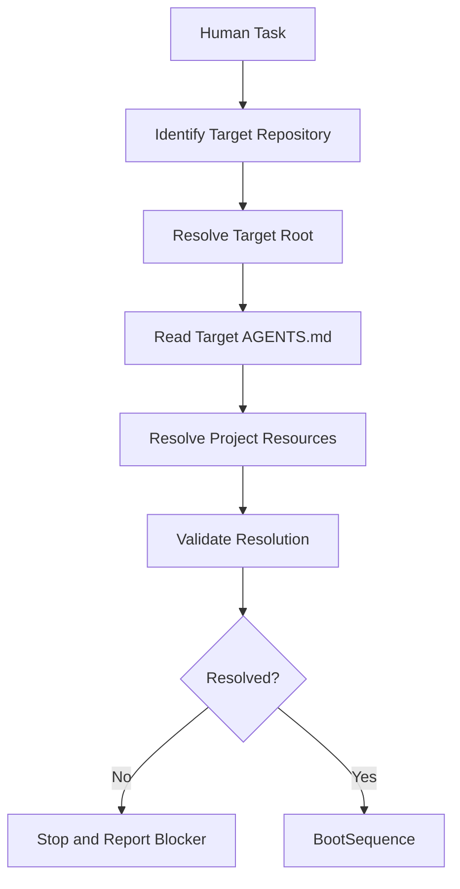

# Forge AI v2 Target Repository Resolution

---

## Document Metadata

| Field | Value |
|:---|:---|
| Identifier | `FORGE-AI.SYSTEM.TARGET-REPOSITORY-RESOLUTION` |
| Title | Forge AI v2 Target Repository Resolution |
| Version | `1.0.0-draft` |
| Status | Draft |
| Canonical Status | Non-canonical until reviewed, approved, and promoted through Framework Governance |
| Classification | System Layer Procedure |
| Document Type | Tool-Facing Target Repository Resolution Procedure |
| Owner | AI Operational Layer / Human Governance |
| Maintainers | Framework Architecture Team |
| Review Authority | Human Governance / Framework Governance |
| Approval Authority | Human Governance |
| Created | 2026-07-10 |
| Last Updated | 2026-07-10 |
| Lifecycle Phase | Draft System Layer Controlled Extension |
| Traceability ID | `FORGE-AI.V2.SYSTEM-EXT-001` |
| Scope | Active Target Repository identification, Target Repository root establishment, Target AGENTS.md location, target-project resource declaration resolution, repository-relative path resolution, target-resolution validation, blocker reporting, and handoff to BootSequence. |
| Out of Scope | Human Governance, Framework Governance, repository selection policy beyond the active task, AGENTS.md syntax, AGENTS.md content ownership, authority resolution, source-of-truth selection, context assembly, decision selection, execution, ProjectStatus ownership, DevelopmentPhases ownership, project architecture, source code, Runtime, Engines, Commands, Workflows, Templates, validation execution, certification, and canonical promotion. |
| Normative Authority | Human Governance; `AGENTS.md`; `docs/AI/GOVERNANCE.md`; `docs/FrameworkGovernance.md`; `docs/AI/Architecture/A.1-Constitution.md`; `docs/AI/Architecture/A.2-AI-DOS-Target-Repository-Operational-Boundary.md` |
| Normative References | `docs/AI/Architecture/A.2-AI-DOS-Target-Repository-Operational-Boundary.md`; `docs/AI/Architecture/Standards/STD-000-Framework-Standards.md`; `docs/AI/Architecture/Standards/STD-003-Terminology-Standard.md`; `docs/AI/Architecture/Standards/STD-010-Document-Metadata-Standard.md`; `docs/AI/Architecture/Reports/Target-Project-Path-Resolution.md`; `docs/AI/System/BootSequence.md` |
| Dependencies | Human task instruction, A.2 operational boundary, Target Repository root availability, Target Repository root AGENTS.md, target-project resource declarations, System Layer BootSequence, ProjectStatus policy, DevelopmentPhases roadmap policy, and protected-area declarations. |
| Consumes | Human task instruction, current working repository context, explicit target repository instruction, available repository roots when provided by the task context, Target Repository root AGENTS.md, A.2 operational-boundary rules, Forge AI self-hosting declaration, and external Target Repository declaration. |
| Produces | Target Repository Resolution Result, resolved Target Repository root, resolved Target AGENTS path, resolved project-resource paths, target authority declarations, protected areas, validation context, unresolved declaration list, resolution status, blocker status, and BootSequence handoff context. |
| Related Specifications | `docs/AI/System/README.md`; `docs/AI/System/AuthorityModel.md`; `docs/AI/System/BootSequence.md`; `docs/AI/System/SourceOfTruth.md`; `docs/AI/System/ContextAssembly.md`; `docs/AI/System/DecisionModel.md`; `docs/AI/System/ExecutionSequence.md`; `docs/AI/System/SystemLayerFreeze.md`; `docs/AI/AIFramework.md`; `docs/AI/AIOrchestrator.md`; `docs/AI/AgentSystemPrompt.md` |
| Supersedes | None |
| Superseded By | None |
| Promotion Requirements | Human Governance review, Framework Governance review, STD-010 metadata validation, STD-003 terminology validation, A.2 consistency validation, System Layer flow validation, controlled-unfreeze validation, and explicit Human Governance promotion authorization. |
| Certification Status | Not certified |

---

## 1. Purpose

This document defines how a Forge Agent establishes the active Target Repository and resolves its repository-local resources before normal boot, authority, context, decision, and execution procedures continue.

The procedure preserves this architectural rule:

```text
Forge AI / AI-DOS provides Framework truth.
The Target Repository provides project truth.
The Forge Agent consumes both.
```

## 2. Scope

This procedure is in scope for:

1. Active Target Repository identification.
2. `<TARGET_REPOSITORY_ROOT>` establishment.
3. `<TARGET_AGENTS_PATH>` resolution.
4. Target-project resource declaration resolution.
5. Repository-relative path resolution.
6. Target-resolution validation.
7. Ambiguity detection.
8. Missing-declaration detection.
9. Resolution blocker reporting.
10. Handoff to `docs/AI/System/BootSequence.md`.

This procedure does not perform BootSequence, authority resolution, source-of-truth selection, context assembly, decision selection, execution, validation execution, certification, canonical promotion, or ProjectStatus ownership.

## 3. Normative Position

Target Repository Resolution is a controlled System Layer pre-boot procedure. It occurs after receipt of the Human Task and before BootSequence loads target-project state.

The required System Layer flow is:

```text
Human Task
    ↓
Target Repository Resolution
    ↓
Boot Sequence
    ↓
Authority Resolution
    ↓
Source of Truth
    ↓
Context Assembly
    ↓
Decision
    ↓
Execution
    ↓
Completion Report
```

This procedure consumes A.2. It does not redefine A.2, create a Repository Adapter, create a Repository Registry, define a connector, define AGENTS syntax, create a machine-readable schema, implement repository discovery, or implement project selection.

## 4. Relationship to A.2

A.2 defines the operational boundary between Forge AI / AI-DOS, the active Target Repository, and the Forge Agent. This procedure operationalizes only the pre-boot resolution portion of that boundary.

This document uses the A.2 concepts of Framework truth, project truth, Target Repository, Forge Agent, Forge AI self-hosting, external Target Repository operation, protected areas, and repository-relative target paths. It does not change ownership: Forge AI / AI-DOS owns Framework truth, the Target Repository owns project truth, and the Forge Agent consumes both without becoming a source of truth.

## 5. Operational Responsibilities

### 5.1 Owns

TargetRepositoryResolution owns:

- active Target Repository identification;
- Target Repository root establishment;
- Target AGENTS.md location;
- target-resource declaration resolution;
- repository-relative path resolution;
- target-resolution validation;
- ambiguity detection;
- missing-declaration detection;
- resolution blocker reporting;
- handoff to BootSequence.

### 5.2 Does Not Own

TargetRepositoryResolution does not own:

- Human Governance;
- Framework Governance;
- repository selection policy beyond the active task;
- AGENTS.md syntax;
- AGENTS.md content ownership;
- authority resolution;
- source-of-truth selection;
- context assembly;
- decision selection;
- execution;
- ProjectStatus ownership;
- DevelopmentPhases ownership;
- project architecture;
- source code;
- Runtime;
- Engines;
- Commands;
- Workflows;
- Templates;
- validation execution;
- certification;
- canonical promotion.

## 6. Resolution Inputs

This procedure may consume:

- Human task instruction;
- current working repository context;
- explicit target repository instruction;
- available repository roots supplied by the task context;
- Target Repository root `AGENTS.md`;
- A.2 operational-boundary rules;
- Forge AI self-hosting declaration;
- external Target Repository declaration.

The procedure shall not invent a repository-discovery mechanism, define automatic filesystem scanning, or choose among multiple repositories without explicit authority.

## 7. Logical Resolution Concepts

This procedure uses the architecture concepts established by A.2:

| Concept | Meaning in This Procedure |
|:---|:---|
| `<TARGET_REPOSITORY_ROOT>` | Logical root of the active Target Repository. |
| `<TARGET_AGENTS_PATH>` | Root AGENTS.md for the active Target Repository. |
| `<PROJECT_STATUS_PATH>` | Target-project operational state path declared by the target project. |
| `<DEVELOPMENT_PHASES_PATH>` | Target-project roadmap or development phases path declared by the target project. |
| `<PROJECT_ARCHITECTURE_PATH>` | Target-project architecture path or paths declared by the target project. |
| `<SOURCE_ROOT>` | Target-project source root or roots declared by the target project. |
| `<VALIDATION_COMMANDS>` | Target-project validation commands declared by the target project. |
| `<PROTECTED_AREAS>` | Target-project protected and frozen areas declared by the target project. |

These are logical concepts only. This document does not define YAML, JSON, environment variables, configuration schemas, adapters, registries, implementation classes, APIs, or CLI commands.

## 8. Target Repository Resolution Procedure

Agents shall perform Target Repository Resolution in this sequence:

1. Receive the active Human Task.
2. Determine whether the task explicitly identifies the Target Repository.
3. Establish `<TARGET_REPOSITORY_ROOT>` from the explicit task instruction or authorized current repository context.
4. Confirm the Target Repository root exists and is accessible.
5. Resolve `<TARGET_AGENTS_PATH> = <TARGET_REPOSITORY_ROOT>/AGENTS.md`.
6. Confirm the Target AGENTS.md exists and is readable.
7. Read the Target AGENTS.md.
8. Resolve target-project declarations for ProjectStatus, DevelopmentPhases, project architecture, source root, validation commands, protected and frozen areas, target-project authority order, and Forge AI consumption rule.
9. Resolve all declared project paths relative to `<TARGET_REPOSITORY_ROOT>`.
10. Validate that required resources exist or are explicitly declared optional.
11. Produce a Target Repository Resolution Result.
12. Hand the resolved Target Repository context to BootSequence.
13. Stop if resolution is incomplete, ambiguous, conflicting, or unsafe.



**Figure 1 — Target Repository Resolution Flow.**

## 9. Resolution Result Model

The Target Repository Resolution Result is a conceptual procedure result. It is not a schema, implementation DTO, API contract, registry entry, adapter contract, or configuration format.

The conceptual result contains:

- Target Repository identity;
- Target Repository root;
- Target AGENTS path;
- ProjectStatus path;
- DevelopmentPhases path;
- architecture paths;
- source roots;
- validation commands;
- protected areas;
- target authority order;
- Forge AI provider/reference;
- unresolved declarations;
- resolution status;
- blocker status.

Allowed resolution statuses are:

- `RESOLVED`
- `BLOCKED_TARGET_NOT_IDENTIFIED`
- `BLOCKED_TARGET_ROOT_UNAVAILABLE`
- `BLOCKED_AGENTS_MISSING`
- `BLOCKED_REQUIRED_DECLARATION_MISSING`
- `BLOCKED_PATH_UNRESOLVED`
- `BLOCKED_AUTHORITY_CONFLICT`
- `BLOCKED_AMBIGUOUS_TARGET`

## 10. Forge AI Self-Hosting Rules

When Forge AI is the Target Repository, these mappings are valid:

```text
<TARGET_REPOSITORY_ROOT> = Forge AI repository root
<TARGET_AGENTS_PATH> = AGENTS.md
<PROJECT_STATUS_PATH> = docs/DevelopmentPhases/ProjectStatus.md
<DEVELOPMENT_PHASES_PATH> = docs/DevelopmentPhases/ForgeAI-DevelopmentPhases.md
```

These mappings are valid Forge AI self-hosting mappings only. They must not become fallback values for an external Target Repository.

Self-hosting is a specialization of the same resolution procedure. It is not a parallel boot system.

## 11. External Target Repository Rules

For an external Target Repository, including an external repository such as Axis Suite:

- the external repository root must be explicitly established;
- its own root `AGENTS.md` must be read;
- its own project-resource declarations must be resolved;
- all project paths must resolve relative to its own repository root;
- Forge AI self-hosting paths must not be substituted;
- missing declarations must produce a blocker;
- project truth must remain owned by the external Target Repository.

This document does not define final Axis Suite paths.

## 12. Resolution Validation

Before handing context to BootSequence, agents shall validate that:

1. The active Target Repository is identifiable.
2. `<TARGET_REPOSITORY_ROOT>` is established, accessible, and authorized for the task.
3. `<TARGET_AGENTS_PATH>` resolves to `<TARGET_REPOSITORY_ROOT>/AGENTS.md`.
4. The Target AGENTS.md exists and is readable.
5. Required target-project resource declarations are present or explicitly optional.
6. Declared paths resolve relative to `<TARGET_REPOSITORY_ROOT>`.
7. Declared paths do not escape the authorized Target Repository boundary without explicit authorization.
8. Forge AI self-hosting mappings are not applied to an external Target Repository.
9. Target-project authority routing does not conflict with A.2.
10. Protected-area and validation-command declarations required for the task are available.

## 13. Failure and Stop Rules

Agents shall stop when:

- the active Target Repository is not identifiable;
- multiple candidate repositories exist without explicit selection;
- the Target Repository root is inaccessible;
- root `AGENTS.md` is missing;
- root `AGENTS.md` cannot be read;
- required project-resource declarations are missing;
- declared paths cannot be resolved;
- declared paths escape the authorized Target Repository boundary without explicit authorization;
- Forge AI self-hosting paths are being applied to an external Target Repository;
- project authority routing conflicts with A.2;
- protected-area declarations required for the task are missing;
- validation commands required for implementation are unavailable.

On stop, agents shall:

- not infer missing values;
- not use Forge AI self-hosting defaults;
- not begin BootSequence;
- report the exact blocker;
- list missing or conflicting declarations;
- request Human Governance or target-project authority resolution.

## 14. Handoff to BootSequence

A successful resolution hands BootSequence:

- resolved Target Repository root;
- resolved Target AGENTS path;
- resolved project-resource paths;
- target authority declarations;
- protected areas;
- validation context;
- any explicitly optional or missing non-blocking resources.

BootSequence must not independently rediscover or override the Target Repository. BootSequence consumes the resolution result. TargetRepositoryResolution does not perform the remaining boot process.

## 15. Operational Boundaries

This procedure remains documentation-only and procedure-only. It does not authorize implementation, source-code changes, Runtime implementation, Engine implementation, Commands, Workflows, Templates, adapters, registries, schemas, connectors, repository discovery, project selection, Axis Suite file creation, legacy cleanup, ProjectStatus updates, certification, or canonical promotion.

## 16. Completion Criteria

This procedure is complete when:

1. The active Target Repository can be identified or blocked deterministically.
2. `<TARGET_REPOSITORY_ROOT>` can be established or blocked deterministically.
3. `<TARGET_AGENTS_PATH>` can be resolved or blocked deterministically.
4. Target-project declarations can be resolved relative to `<TARGET_REPOSITORY_ROOT>` or reported as blockers.
5. Forge AI self-hosting mappings are isolated from external Target Repository operation.
6. External Target Repository operation preserves target-project ownership of project truth.
7. The Resolution Result can be handed to BootSequence without BootSequence rediscovering or overriding the Target Repository.

## 17. Historical Context

The frozen Forge AI v2 System Layer assumed that the active Target Repository had already been identified before BootSequence loaded target-project state. `FORGE-AI.V2.SYSTEM-EXT-001` authorizes a controlled System Layer extension to add the missing deterministic pre-boot resolution procedure while preserving the existing System Layer architecture and freeze boundaries.

## 18. Version History

| Version | Date | Author | Summary |
|:---|:---|:---|:---|
| 1.0.0-draft | 2026-07-10 | Framework Architecture Team | Initial controlled System Layer extension for Target Repository Resolution. |
