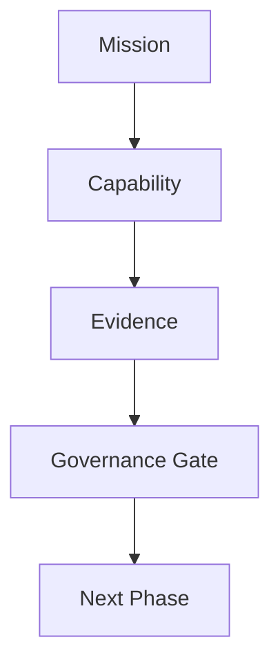
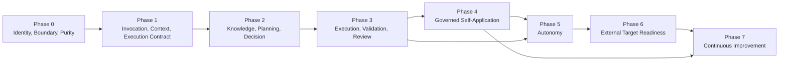
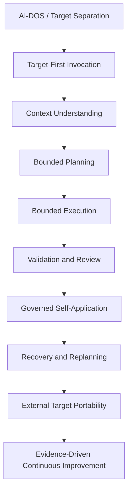

# Forge AI Development Phases

---

## Document Metadata

| Field | Value |
|:---|:---|
| Identifier | `FORGE-AI.TARGET.DEVELOPMENT-PHASES` |
| Title | Forge AI Development Phases |
| Version | `5.0.0-draft` |
| Status | Draft |
| Canonical Status | Active Forge AI Target Project strategic development program; not an AI-DOS lifecycle and not a universal phase model for external Target Projects |
| Classification | Target Project Strategic Capability Program |
| Document Type | Development Phase Program |
| Owner | Forge AI Target Project Governance |
| Approval Authority | Human Governance |
| Last Updated | 2026-07-11 |
| Traceability ID | `FORGE-AI.TARGET.DEVELOPMENT-PHASES` |
| Scope | AI-DOS capability maturity, evidence maturity, autonomy progression, governance checkpoints, reusable outcomes, and external Target readiness as directed by Forge AI. |
| Out of Scope | AI-DOS internal architecture, AI-DOS implementation design, live ProjectStatus updates, roadmap replacement, sprint planning, cleanup execution, repository disposition, certification, and automatic phase advancement. |
| Normative Authority | Human Governance; Forge AI Target Project contract; `docs/ForgeAI-Mission-and-Autonomy-Model.md` |
| Primary Authority | `docs/ForgeAI-Mission-and-Autonomy-Model.md` |
| Consumes | Forge AI mission, Human Governance decisions, resolved Target Context, ProjectStatus evidence, roadmap direction, and execution evidence. |
| Produces | Capability-oriented Forge AI development phases, governance gates, evidence expectations, autonomy progression model, and maturity criteria for AI-DOS development. |
| Certification Status | Not certified |

---

## 1. Purpose

This document defines Forge AI's strategic development program for maturing AI-DOS as a reusable, Target-independent capability system.

The phases answer one governing question:

```text
What capability must AI-DOS gain next?
```

Forge AI is the AI-DOS Development and Autonomy Enablement Target Project. These phases belong to Forge AI and describe AI-DOS capability maturity under Forge AI governance. They are not an AI-DOS lifecycle, not external Target Project lifecycle requirements, and not implementation authorization.

Every phase must increase AI-DOS capability, produce reusable outcomes, increase evidence, support autonomy, preserve AI-DOS purity, and pass an explicit Human Governance checkpoint before the next maturity claim is accepted.

---

## 2. Strategic Principles

1. **Capability before activity.** A phase is defined by the reusable AI-DOS capability it matures.
2. **Evidence before maturity claims.** Capability progression requires observable proof, validation output, review findings, blocker handling, and Human Governance acceptance.
3. **Human Governance remains final.** AI-DOS may assist, execute, validate, review, recover, and recommend, but it does not self-approve maturity.
4. **Target Context is explicit.** Forge AI supplies bounded Target Context, objectives, constraints, resources, and validation expectations.
5. **AI-DOS purity is mandatory.** AI-DOS product truth remains reusable, Target-independent, and free of Forge AI project planning truth.
6. **Autonomy is progressive.** Autonomy increases only through accepted evidence that AI-DOS can preserve boundaries, validate results, escalate blockers, and recover safely.
7. **Review is not approval.** AI-DOS review findings inform Human Governance; they do not replace governance gates.
8. **External readiness requires proof.** Self-application is necessary evidence, but independent Target operation is required before multi-Target readiness is accepted.

---

## 3. Capability Maturity Philosophy

Development phases are capability maturity levels for AI-DOS as developed and validated by Forge AI.

Each phase defines:

- a capability objective;
- reusable outcomes that should benefit any authorized Target Project;
- evidence required to prove the capability;
- governance gates that determine whether maturity is accepted;
- explicit non-goals to prevent scope drift; and
- risks that must be managed before claiming advancement.

A phase may generate artifacts, plans, validations, or changes, but those artifacts are evidence of capability maturity rather than the purpose of the phase.

---

## 4. Autonomy Progression

Autonomy means completing increasingly complex, multi-step, bounded work with less direct intervention while preserving explicit authority, constraints, validation, traceability, escalation, and safe-stop behavior.

The phase program maps onto the Forge AI autonomy ladder:

| Phase | Autonomy Emphasis | Expected Maturity Movement |
|:---:|:---|:---|
| 0 | Human-directed boundary discipline | Establishes safe Level 0 operation. |
| 1 | Context-aware invocation | Enables Level 1 context-aware assistance. |
| 2 | Bounded reasoning and planning | Enables Level 2 bounded planning. |
| 3 | Controlled execution and self-validation | Enables Levels 3 through 5. |
| 4 | Governed self-application | Strengthens Levels 5 through 7 under Forge AI oversight. |
| 5 | Recovery, replanning, and escalation | Matures Levels 6 through 8. |
| 6 | Independent Target portability | Proves Level 9 multi-Target operation readiness. |
| 7 | Sustained governed improvement | Maintains Level 8 continuous improvement without self-authorization. |

No phase completion automatically grants autonomy. Human Governance accepts autonomy only when the required evidence is present.

---

## 5. Evidence Model

Every phase must produce traceable evidence sufficient for Human Governance to decide whether AI-DOS has matured.

Minimum evidence categories:

| Evidence Category | Requirement |
|:---|:---|
| Input evidence | Objective, authorized scope, constraints, protected areas, and Target Context used. |
| Capability evidence | Demonstration that the phase capability works in bounded conditions. |
| Reuse evidence | Proof that outcomes remain reusable and are not hard-coded to Forge AI project truth. |
| Validation evidence | Commands, checks, outputs, failures, skipped checks, and environment limitations. |
| Review evidence | Findings, uncertainty, blocker handling, and safety assessment. |
| Governance evidence | Gate decision, acceptance conditions, rejected claims, or required follow-up. |
| Autonomy evidence | Reduced intervention, safe-stop behavior, recovery, replanning, or escalation proof where applicable. |
| Purity evidence | Audit result showing AI-DOS product truth remains Target-independent. |

Evidence is not optional. Missing, failed, or incomplete validation is recorded as evidence and may block phase advancement.

---

## 6. Governance Model

Each phase ends at a governance gate. A gate may accept, reject, defer, narrow, or require more evidence.

Gate acceptance requires:

1. the phase capability is demonstrated;
2. reusable outcomes are identified;
3. evidence is complete enough for audit;
4. AI-DOS purity is preserved;
5. autonomy claims are bounded and evidence-backed;
6. risks and blockers are reported honestly; and
7. Human Governance explicitly accepts the gate result.

Gate acceptance does not update ProjectStatus automatically, change the roadmap automatically, certify AI-DOS, or authorize unrelated implementation.

---

## 7. Development Flow

```text
Mission

↓

Capability

↓

Evidence

↓

Governance Gate

↓

Next Phase
```



---

## 8. Phase Dependency Graph



---

## 9. Capability Dependency Graph



---

## 10. Autonomy Progression Diagram

```mermaid
flowchart LR
    L0[Level 0<br/>Human-Directed Execution] --> L1[Level 1<br/>Context-Aware Assistance]
    L1 --> L2[Level 2<br/>Bounded Planning]
    L2 --> L3[Level 3<br/>Bounded Execution]
    L3 --> L4[Level 4<br/>Self-Validation]
    L4 --> L5[Level 5<br/>Review and Escalation]
    L5 --> L6[Level 6<br/>Recovery and Replanning]
    L6 --> L7[Level 7<br/>Autonomous Workflow Completion]
    L7 --> L8[Level 8<br/>Governed Continuous Improvement]
    L8 --> L9[Level 9<br/>Multi-Target Operation]
```



---

## 11. Phase Matrix

| Phase | Name | Primary Capability Gain | Reusable Outcome | Governance Gate |
|:---:|:---|:---|:---|:---|
| 0 | Identity, Boundary, Purity | Separates AI-DOS product truth from Target Project truth. | Purity rules and boundary validation. | Purity accepted. |
| 1 | Invocation, Context, Execution Contract | Invokes AI-DOS against explicit Target Context. | Reusable invocation and execution contract model. | Invocation contract accepted. |
| 2 | Knowledge, Planning, Decision | Understands context, plans bounded work, supports decisions. | Reusable planning and decision-support capability. | Planning quality accepted. |
| 3 | Execution, Validation, Review | Executes bounded work with validation and review. | Reusable execution evidence loop. | Execution evidence accepted. |
| 4 | Governed Self-Application | Uses AI-DOS to improve AI-DOS under Forge AI governance. | Safe self-application feedback loop. | Self-application accepted. |
| 5 | Autonomy | Recovers, replans, escalates, and completes bounded workflows. | Progressive autonomy controls. | Autonomy maturity accepted. |
| 6 | External Target Readiness | Operates across independent Target Contexts without leakage. | Portable multi-Target operation model. | External readiness accepted. |
| 7 | Continuous Improvement | Evolves capabilities from evidence over time. | Sustainable improvement governance. | Improvement governance accepted. |

---

## 12. Phases

### Phase 0 — Identity, Boundary, Purity

**Purpose**

Establish that AI-DOS and Forge AI are distinct: Forge AI is the Target Project developing AI-DOS, while AI-DOS is reusable product truth and capability behavior.

**Capabilities**

- AI-DOS / Target separation.
- Framework purity.
- Target independence.
- Product-project boundary recognition.
- Protected-area respect.

**Success Criteria**

- AI-DOS product truth is distinguishable from Forge AI project truth.
- Forge AI planning, status, roadmap, and governance remain outside AI-DOS product truth.
- Target independence is stated and testable.
- Protected areas are identified before execution.

**Evidence**

- Purity audit.
- Boundary validation.
- Product-project separation findings.
- Protected-area review.

**Governance Gate**

Purity accepted.

**Exit Criteria**

- Human Governance accepts that AI-DOS purity and Target independence are preserved.
- No Forge AI project truth is treated as reusable AI-DOS product truth.
- Boundary violations are remediated or recorded as blockers.

**Dependencies**

- Forge AI mission and autonomy model.
- Target Project contract.
- Human Governance decisions on `docs/AI/` and Forge AI identity.

**Non-goals**

- Defining AI-DOS internals.
- Certifying AI-DOS.
- Updating live project state.
- Authorizing implementation.

**Risks**

- Forge AI project-specific assumptions leak into AI-DOS product truth.
- Self-application is mistaken for identity merger.
- Boundary language becomes too vague to audit.

### Phase 1 — Invocation, Context, Execution Contract

**Purpose**

Mature AI-DOS from a separated product into an invocable reusable capability provider that operates only against explicit Target Context and bounded execution rules.

**Capabilities**

- Target-first invocation.
- Target Context intake.
- Execution boundary recognition.
- Invocation contract.
- Blocker reporting for missing context or authority.

**Success Criteria**

- AI-DOS can identify objective, scope, constraints, resources, validation expectations, and protected areas before action.
- Invocation input and output are traceable.
- Missing authority or context stops or narrows work.
- Reusable invocation behavior does not depend on Forge AI-specific paths or state.

**Evidence**

- Invocation records.
- Resolved Target Context summaries.
- Execution boundary checks.
- Blocker reports for absent or unsafe inputs.

**Governance Gate**

Invocation contract accepted.

**Exit Criteria**

- Human Governance accepts that AI-DOS can be invoked through a bounded, Target-first contract.
- Invocation records show what AI-DOS was allowed to do and what it refused or escalated.
- Execution boundaries are enforceable before planning or action.

**Dependencies**

- Phase 0 accepted purity boundary.
- Explicit Target Context supplied by Forge AI or another authorized Target Project.

**Non-goals**

- Performing broad execution.
- Inferring lifecycle authority.
- Owning Target Project resources.
- Becoming a project-resource registry.

**Risks**

- Invocation proceeds on implicit assumptions.
- Target resources are treated as AI-DOS product truth.
- Boundary failures appear only after execution has started.

### Phase 2 — Knowledge, Planning, Decision

**Purpose**

Mature AI-DOS capability to understand supplied context, integrate knowledge, produce bounded plans, and support human decisions without replacing Human Governance.

**Capabilities**

- Context understanding.
- Planning.
- Decision support.
- Knowledge integration.
- Risk and dependency identification.
- Validation strategy selection.

**Success Criteria**

- AI-DOS can ground recommendations in supplied Target Context and cited artifacts.
- Plans include scope, assumptions, dependencies, risks, validation, and escalation triggers.
- Decision support distinguishes options, tradeoffs, unknowns, and governance boundaries.
- Knowledge integration preserves Target isolation.

**Evidence**

- Grounded context analyses.
- Bounded plans.
- Decision records or recommendations.
- Risk and dependency matrices.
- Validation strategies.

**Governance Gate**

Planning quality accepted.

**Exit Criteria**

- Human Governance accepts that AI-DOS can plan and support decisions within explicit authority.
- Plans are actionable, bounded, and validation-ready.
- Uncertainty and blockers are reported rather than hidden.

**Dependencies**

- Phase 1 invocation contract.
- Available Target resources and validation expectations.

**Non-goals**

- Self-approval of plans.
- Silent expansion from planning into execution.
- Replacing roadmap authority or ProjectStatus.
- Encoding Forge AI planning truth into AI-DOS product truth.

**Risks**

- Plan confidence exceeds available evidence.
- Decision support is mistaken for approval.
- Knowledge integration crosses Target boundaries.

### Phase 3 — Execution, Validation, Review

**Purpose**

Mature AI-DOS capability to execute authorized bounded work, validate outcomes, review its own results, and produce certification-ready evidence without granting itself certification.

**Capabilities**

- Bounded execution.
- Validation.
- Review.
- Certification support.
- Evidence production.
- Defect and blocker reporting.

**Success Criteria**

- Execution remains inside approved scope and protected-area limits.
- Validation commands or checks are run, or limitations are reported.
- Review identifies defects, uncertainties, and residual risks.
- Evidence supports independent Human Governance evaluation.

**Evidence**

- Authorized scope records.
- Changed artifact lists.
- Validation outputs.
- Review findings.
- Safety and blocker reports.
- Certification-support packets where applicable.

**Governance Gate**

Execution evidence accepted.

**Exit Criteria**

- Human Governance accepts that AI-DOS can execute bounded work safely and traceably.
- Validation and review evidence is complete enough for governance assessment.
- Certification support is clearly separated from certification approval.

**Dependencies**

- Phase 2 bounded planning.
- Explicit execution authorization.
- Applicable validation resources.

**Non-goals**

- Unbounded execution.
- Bypassing validation.
- Treating review as approval.
- Declaring certification without Human Governance.

**Risks**

- Execution exceeds authorized boundaries.
- Validation is incomplete or environment-limited.
- Review misses product purity or Target isolation issues.

### Phase 4 — Governed Self-Application

**Purpose**

Mature AI-DOS capability to assist in improving AI-DOS itself while Forge AI remains the governing Target Project and AI-DOS remains reusable product truth.

**Capabilities**

- AI-DOS improving AI-DOS.
- Bounded self-application.
- Evidence-backed evolution.
- Feedback-loop analysis.
- Self-application safety enforcement.

**Success Criteria**

- Forge AI defines the AI-DOS development objective and supplies Target Context.
- AI-DOS performs bounded work that improves reusable capability.
- Evidence shows why the improvement was needed and how purity was preserved.
- Self-application does not merge Forge AI project identity with AI-DOS product identity.

**Evidence**

- Self-application task records.
- Capability gap evidence.
- Improvement evidence.
- Validation and review outputs.
- Purity-preservation audit.
- Human Governance acceptance or rejection.

**Governance Gate**

Self-application accepted.

**Exit Criteria**

- Human Governance accepts bounded self-application as safe and evidence-backed.
- Improvements are reusable and not Forge AI shortcuts.
- Failed or partial self-application attempts are captured as learning evidence.

**Dependencies**

- Phase 3 bounded execution, validation, and review.
- Explicit Forge AI authorization for AI-DOS improvement work.

**Non-goals**

- AI-DOS self-authorizing changes.
- Automatic ProjectStatus, roadmap, or phase updates.
- Treating Forge AI self-hosting evidence as sufficient external readiness.
- Relaxing protected areas.

**Risks**

- Self-application becomes self-approval.
- Improvement proposals are speculative rather than evidence-derived.
- Forge AI-specific behavior contaminates reusable AI-DOS behavior.

### Phase 5 — Autonomy

**Purpose**

Mature AI-DOS capability to complete increasingly complex bounded workflows with recovery, replanning, escalation, and safety controls while Human Governance remains final.

**Capabilities**

- Progressive autonomy.
- Recovery.
- Replanning.
- Escalation.
- Safety.
- Workflow completion under approved boundaries.

**Success Criteria**

- AI-DOS can detect failures and recover within authorized scope.
- Replanning does not expand authority or bypass protected areas.
- Escalation occurs when context, authority, validation, or safety is insufficient.
- Autonomous workflow claims are supported by repeated evidence.

**Evidence**

- Autonomy run records.
- Failure and recovery logs.
- Replanning records.
- Escalation reports.
- Validation and review evidence.
- Human acceptance of autonomy maturity claims.

**Governance Gate**

Autonomy maturity accepted.

**Exit Criteria**

- Human Governance accepts specific autonomy capabilities and boundaries.
- Recovery and replanning evidence shows no scope expansion.
- Safety invariants remain intact under multi-step work.

**Dependencies**

- Phase 4 governed self-application evidence.
- Repeated Phase 3 validation and review performance.

**Non-goals**

- Unrestricted operation.
- Self-approval.
- Continuous execution without governance.
- Automatic lifecycle or state changes.

**Risks**

- Autonomy claims outpace evidence.
- Recovery masks unresolved defects.
- Replanning becomes unauthorized expansion.

### Phase 6 — External Target Readiness

**Purpose**

Mature AI-DOS capability to operate as a reusable provider for independent Target Projects without Forge AI context leakage, authority crossover, or Target-specific coupling.

**Capabilities**

- Target independence.
- Reusable operation.
- Portability.
- Multiple Target compatibility.
- Target isolation validation.

**Success Criteria**

- AI-DOS can operate against an independent Target Context supplied by that Target Project.
- Target-specific resources remain outside AI-DOS product truth.
- Multiple Target Contexts remain isolated.
- External operation evidence is accepted by Human Governance.

**Evidence**

- External Target invocation records.
- Target isolation checks.
- Portability findings.
- Reusable-operation validation.
- Cross-Target leakage audit.
- Independent acceptance evidence where available.

**Governance Gate**

External readiness accepted.

**Exit Criteria**

- Human Governance accepts that AI-DOS is ready for bounded external Target operation.
- Multi-Target compatibility is proven by evidence, not assumed from Forge AI self-application.
- Any limitations are documented as operational boundaries.

**Dependencies**

- Phase 5 autonomy safety and escalation maturity.
- At least one authorized independent Target Context.

**Non-goals**

- Universal compatibility claims.
- Commercial productization.
- Cross-Target execution without separate authority.
- Importing external Target truth into AI-DOS product truth.

**Risks**

- Forge AI assumptions remain hidden in reusable behavior.
- External Target resources are under-specified.
- Multi-Target evidence is too narrow for the claimed readiness.

### Phase 7 — Continuous Improvement

**Purpose**

Mature AI-DOS and Forge AI governance into a sustainable, evidence-driven improvement system that keeps capability, autonomy, safety, and portability advancing over time.

**Capabilities**

- Continuous capability evolution.
- Evidence-driven improvements.
- Maturity governance.
- Long-term sustainability.
- Regression detection.
- Reuse-preserving adaptation.

**Success Criteria**

- Improvement proposals are derived from execution evidence, validation failures, review findings, blockers, recovery events, or external Target feedback.
- Maturity claims remain governed and auditable.
- Regressions trigger review, remediation, or rollback recommendations.
- Long-term evolution preserves AI-DOS purity and Target independence.

**Evidence**

- Improvement backlog derived from accepted evidence.
- Trend analysis across tasks and Targets.
- Regression and remediation records.
- Maturity review records.
- Governance decisions on improvement proposals.

**Governance Gate**

Improvement governance accepted.

**Exit Criteria**

- Human Governance accepts the continuous improvement model as safe, bounded, and sustainable.
- AI-DOS can recommend improvements without self-authorizing them.
- Evidence shows capability evolution remains reusable and Target-independent.

**Dependencies**

- Phase 6 external Target readiness evidence.
- Sustained validation, review, and governance records.

**Non-goals**

- Endless autonomous change.
- Self-authorized product direction.
- Bypassing governance for convenience.
- Treating trend signals as proof without validation.

**Risks**

- Continuous improvement becomes unbounded change.
- Evidence volume grows without governance clarity.
- Long-term sustainability is weakened by insufficient regression controls.

---

## 13. Capability Matrix

| Capability | Phase 0 | Phase 1 | Phase 2 | Phase 3 | Phase 4 | Phase 5 | Phase 6 | Phase 7 |
|:---|:---:|:---:|:---:|:---:|:---:|:---:|:---:|:---:|
| AI-DOS / Target separation | Primary | Reinforced | Reinforced | Reinforced | Critical | Critical | Critical | Sustained |
| Target-first invocation | Foundation | Primary | Reinforced | Reinforced | Reinforced | Reinforced | Critical | Sustained |
| Context understanding | Boundary | Foundation | Primary | Reinforced | Reinforced | Reinforced | Critical | Sustained |
| Planning and decision support | Not claimed | Foundation | Primary | Reinforced | Reinforced | Critical | Reinforced | Sustained |
| Bounded execution | Not claimed | Boundary | Planned | Primary | Reinforced | Critical | Reinforced | Sustained |
| Validation and review | Audit only | Boundary | Strategy | Primary | Critical | Critical | Critical | Sustained |
| Governed self-application | Not claimed | Not claimed | Prepared | Foundation | Primary | Reinforced | Reinforced | Sustained |
| Recovery and replanning | Not claimed | Not claimed | Risk-aware | Defect-aware | Prepared | Primary | Reinforced | Sustained |
| External Target operation | Not claimed | Portable contract | Portable plans | Portable evidence | Not sufficient alone | Prepared | Primary | Sustained |
| Continuous improvement | Not claimed | Not claimed | Insight | Evidence source | Feedback loop | Improvement proposals | External feedback | Primary |

---

## 14. Evidence Matrix

| Phase | Required Evidence | Acceptance Signal |
|:---:|:---|:---|
| 0 | Purity audit, boundary validation, protected-area review. | Human Governance accepts AI-DOS purity. |
| 1 | Invocation records, Target Context summaries, execution boundary checks. | Human Governance accepts invocation contract. |
| 2 | Bounded plans, decision support, risk and dependency analysis, validation strategy. | Human Governance accepts planning quality. |
| 3 | Changed artifact records, validation output, review findings, blocker handling. | Human Governance accepts execution evidence. |
| 4 | Self-application records, capability gap proof, improvement validation, purity audit. | Human Governance accepts self-application result. |
| 5 | Autonomy runs, recovery logs, replanning records, escalation evidence. | Human Governance accepts bounded autonomy maturity. |
| 6 | External Target invocations, portability checks, leakage audits, independent acceptance evidence. | Human Governance accepts external readiness. |
| 7 | Evidence-derived improvement proposals, trend analysis, regression records, maturity reviews. | Human Governance accepts improvement governance. |

---

## 15. Governance Matrix

| Phase | Governance Question | Gate Decision |
|:---:|:---|:---|
| 0 | Is AI-DOS pure, reusable, and separate from Forge AI project truth? | Purity accepted, rejected, or remediation required. |
| 1 | Can AI-DOS be invoked safely through explicit Target Context and boundaries? | Invocation contract accepted, narrowed, or blocked. |
| 2 | Can AI-DOS plan and support decisions without replacing governance? | Planning quality accepted or returned for evidence. |
| 3 | Can AI-DOS execute, validate, and review within authorized limits? | Execution evidence accepted or remediation required. |
| 4 | Can AI-DOS improve AI-DOS without self-approval or contamination? | Self-application accepted, constrained, or rejected. |
| 5 | Can AI-DOS operate with bounded autonomy, recovery, and escalation? | Specific autonomy claims accepted or denied. |
| 6 | Can AI-DOS operate for independent Targets without leakage? | External readiness accepted, limited, or blocked. |
| 7 | Can AI-DOS continue improving from evidence under governance? | Improvement governance accepted or revised. |

---

## 16. Autonomy Matrix

| Phase | Autonomy Level Relationship | Evidence Needed Before Claim |
|:---:|:---|:---|
| 0 | Supports Level 0 by enforcing boundary discipline. | Boundary and purity evidence. |
| 1 | Supports Level 1 context-aware assistance. | Resolved Target Context and invocation evidence. |
| 2 | Supports Level 2 bounded planning. | Bounded plans and decision-support evidence. |
| 3 | Supports Levels 3-5 through execution, validation, review, and escalation. | Validation output, review findings, and blocker handling. |
| 4 | Supports Levels 5-7 in self-application contexts. | Safe self-application evidence and Human Governance acceptance. |
| 5 | Supports Levels 6-8 through recovery, replanning, and governed improvement proposals. | Recovery, replanning, escalation, and repeated workflow evidence. |
| 6 | Supports Level 9 multi-Target operation. | Independent Target isolation and portability evidence. |
| 7 | Sustains Levels 8-9 under long-term governance. | Trend, regression, maturity, and governance evidence. |

---

## 17. Risk Matrix

| Risk | Affected Phases | Impact | Required Control |
|:---|:---|:---|:---|
| Product-project contamination | 0-7 | AI-DOS loses reusable purity. | Purity audits and protected-area enforcement. |
| Implicit authority | 1-7 | AI-DOS acts without authorization. | Target-first invocation and safe-stop behavior. |
| Evidence gaps | 0-7 | Maturity claims cannot be governed. | Mandatory evidence model and validation reporting. |
| Review treated as approval | 2-7 | Human Governance is bypassed. | Governance gates and explicit approval boundaries. |
| Autonomy overclaim | 4-7 | Unsafe or unsupported operation. | Level-specific evidence and repeated demonstration. |
| Target leakage | 4-7 | Context isolation fails. | Isolation checks and external readiness audits. |
| Recovery expands scope | 5-7 | Autonomy bypasses constraints. | Replanning records and boundary checks. |
| Improvement loop becomes unbounded | 7 | Continuous change loses governance. | Evidence-derived proposals and Human Governance decisions. |

---

## 18. Success Metrics

| Metric | Description |
|:---|:---|
| Capability gain | Each accepted phase demonstrates a new or stronger reusable AI-DOS capability. |
| Evidence completeness | Each gate has enough evidence to support Human Governance evaluation. |
| Purity preservation | No accepted phase inserts Forge AI project truth into AI-DOS product truth. |
| Boundary compliance | Work remains within explicit Target Context, authority, and protected areas. |
| Validation coverage | Applicable checks are run or limitations are reported honestly. |
| Review quality | Findings, uncertainty, risks, and blockers are visible to governance. |
| Autonomy progression | Reduced intervention is supported by safety, recovery, escalation, and repeated evidence. |
| External portability | AI-DOS can operate against independent Target Contexts without leakage. |
| Sustainability | Improvements are evidence-driven, governed, and regression-aware. |

---

## 19. Validation Rules for This Development Program

Validation of this program requires confirming that:

1. every phase is capability-oriented;
2. every phase increases AI-DOS capability;
3. every phase produces reusable outcomes;
4. every phase increases evidence;
5. every phase supports autonomy progression;
6. every phase preserves AI-DOS purity;
7. every phase contains a governance gate;
8. every phase contains evidence requirements;
9. the program does not define AI-DOS implementation details;
10. the program does not replace ProjectStatus or the roadmap.

---

## 20. Version History

| Version | Date | Description |
|:---|:---|:---|
| `4.1.0-draft` | 2026-07-10 | Established Forge AI self-hosting Target Repository phase ownership. |
| `4.2.0-draft` | 2026-07-10 | Completed Phase 8 and activated the definitive repository audit as Phase 9. |
| `4.3.0-draft` | 2026-07-10 | Removed direct AI-DOS internal path dependencies and bound project resources to root AGENTS declarations. |
| `5.0.0-draft` | 2026-07-11 | Rebuilt Forge AI Development Phases as the AI-DOS capability and autonomy maturity program. |
