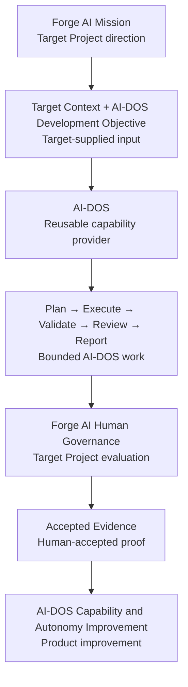

# Forge AI Mission and Autonomy Model

---

## Document Metadata

| Field | Value |
|:---|:---|
| Identifier | `FORGE-AI.TARGET.MISSION-AUTONOMY-MODEL` |
| Title | Forge AI Mission and Autonomy Model |
| Version | `1.0.0-draft` |
| Status | Draft |
| Classification | Forge AI Target Project Mission and Strategic Capability Model |
| Document Type | Target Project Mission and Autonomy Model |
| Owner | Forge AI Target Project Governance |
| Approval Authority | Human Governance |
| Scope | Forge AI mission, AI-DOS development responsibility, self-application model, autonomy-development goals, autonomy maturity levels, safety boundaries, evidence requirements, and planning-document alignment. |
| Out of Scope | AI-DOS internal architecture definition, AI-DOS System procedure definition, Runtime or Engine redesign, implementation activation, ProjectStatus update, DevelopmentPhases update, roadmap update, repository cleanup, Repository Freeze, and external Target execution. |
| Normative Authority | Human Governance |
| Consumes | Human Governance decisions, resolved Forge AI Target Project context, and repository evidence. |
| Produces | Forge AI Target Project mission model, autonomy-development direction, safety invariants, evidence expectations, and planning alignment requirements. |
| Supersedes | None |
| Superseded By | None |
| Certification Status | Not certified |

---

## 1. Purpose

This document defines the permanent mission and autonomy direction of Forge AI as a Target Project. It establishes why Forge AI exists, what Forge AI develops, how Forge AI uses AI-DOS to develop AI-DOS, what autonomy means, how autonomy matures safely, how progress is proven, and how Forge AI project truth remains separate from AI-DOS product truth.

This document is strategic direction for the Forge AI Target Project. It does not activate implementation, update live project state, revise phase sequencing, replace the roadmap, or define AI-DOS internal architecture.

---

## 2. Forge AI Identity

Forge AI is the AI-DOS Development and Autonomy Enablement Target Project.

Forge AI is not AI-DOS itself. Forge AI is the Target Project responsible for developing, validating, self-applying, hardening, and preparing AI-DOS for safe reuse by independent Target Projects.

Forge AI may govern work that changes AI-DOS because AI-DOS is the product Forge AI develops. That authority does not merge the Forge AI Target Project identity with the AI-DOS product identity.

---

## 3. AI-DOS Identity

AI-DOS is the reusable operating system and capability provider consumed by Target Projects. It supplies bounded assistance, planning, execution, validation, review, reporting, blocker handling, and related reusable capabilities without owning a Target Project lifecycle model.

```text
docs/AI/
    = AI-DOS product truth
```

AI-DOS product truth must remain reusable and Target-independent. It must not contain Forge AI project truth, planning state, lifecycle state, repository-specific validation commands, active work queues, or project governance.

---

## 4. Mission Statement

The Forge AI Target Project exists to develop, validate, self-apply, harden, and progressively autonomize AI-DOS through bounded, evidence-driven, and Human-Governed work.

---

## 5. Mission Pillars

1. **Develop AI-DOS.** Forge AI advances AI-DOS as the reusable system being built.
2. **Preserve AI-DOS purity and Target independence.** Forge AI protects AI-DOS from Target-specific contamination, self-hosting leakage, and hard-coded project lifecycle assumptions.
3. **Apply AI-DOS to Forge AI work.** Forge AI uses AI-DOS against its own authorized Target Project tasks to expose real operational strengths, weaknesses, and blockers.
4. **Validate AI-DOS behavior with real evidence.** Forge AI treats task inputs, outputs, validation, review, blockers, and human acceptance as the proof basis for capability maturity.
5. **Increase autonomy progressively.** Forge AI advances autonomy through governed capability levels rather than unrestricted execution.
6. **Preserve safety, traceability, and Human Governance.** Forge AI requires bounded scope, protected-area enforcement, mandatory validation, review, and evidence for every autonomy increase.
7. **Prove external Target readiness.** Forge AI must prove that AI-DOS can operate against independent Target Contexts without knowledge leakage, authority crossover, or Target-specific Framework coupling.
8. **Improve AI-DOS from observed evidence rather than speculation.** Forge AI changes AI-DOS because observed execution evidence demonstrates a need, not because hypothetical architecture suggests one.

---

## 6. Product–Project Separation

| Domain | Owner |
| :--- | :--- |
| AI-DOS reusable truth | `docs/AI/` |
| Forge AI project mission and planning | Forge AI Target Project documents |
| Forge AI live state | Forge AI ProjectStatus |
| Forge AI phase sequence | Forge AI DevelopmentPhases |
| Forge AI strategic direction | Forge AI roadmap |
| Target-provided execution context | Forge AI Target Project |
| AI-DOS internal handling | AI-DOS |

Forge AI may direct work that changes AI-DOS.

AI-DOS must not contain Forge AI project truth.

### Product–Project Separation Matrix

| Truth Type | Owner | Storage Boundary | Consumer |
|:---|:---|:---|:---|
| Reusable AI-DOS product truth | AI-DOS | AI-DOS product space | Target Projects through AI-DOS invocation |
| Forge AI mission and planning truth | Forge AI Target Project Governance | Forge AI Target Project documents outside AI-DOS product truth | Forge AI planning, governance, and task authorization |
| Forge AI live operational state | Forge AI ProjectStatus | Forge AI live-state resource | Forge AI Target Project and authorized AI-DOS work |
| Forge AI phase sequence | Forge AI DevelopmentPhases | Forge AI planning resource | Forge AI roadmap and governance decisions |
| Forge AI strategic direction | Forge AI roadmap | Forge AI roadmap resource | Forge AI planning and prioritization |
| Target execution context | Forge AI Target Project | Resolved Target Context supplied for the task | AI-DOS during bounded execution |
| AI-DOS internal handling | AI-DOS | AI-DOS internal authority and procedure space | AI-DOS itself |

---

## 7. Self-Application Model

Forge AI uses **Governed Self-Application** to apply AI-DOS to the development of AI-DOS without merging the Target Project and product identities.

```text
Forge AI defines an AI-DOS development objective
    ↓
Forge AI supplies Target Context
    ↓
Forge AI invokes AI-DOS
    ↓
AI-DOS performs bounded work
    ↓
AI-DOS produces changes, validation, review, and evidence
    ↓
Forge AI evaluates and governs the result
    ↓
AI-DOS improves
```

Self-application is an operational feedback loop, not a separate self-hosting architecture. Forge AI remains the Target Project. AI-DOS remains the reusable capability provider. The fact that Forge AI develops AI-DOS does not authorize AI-DOS to own Forge AI project truth, infer lifecycle state, bypass approvals, or treat internal product documents as Target Project governance.



---

## 8. Autonomy Definition

Autonomy is the ability of AI-DOS to complete increasingly complex, multi-step, bounded work with less direct intervention, while preserving explicit authority, constraints, validation, traceability, escalation, and safe-stop behavior.

Autonomy does not mean:

- unrestricted repository access;
- self-approval;
- silent scope expansion;
- automatic promotion;
- automatic ProjectStatus updates;
- bypassing Human Governance;
- bypassing protected areas; or
- uncontrolled continuous execution.

---

## 9. Autonomy Capability Ladder

Autonomy matures through progressive capability levels. Reaching any level requires evidence and Human Governance acceptance. No level is claimed as achieved by this document.

| Level | Name | Capability |
| :---: | :--- | :--- |
| 0 | Human-Directed Execution | Executes an explicitly scoped instruction with continuous human direction. |
| 1 | Context-Aware Assistance | Resolves supplied Target Context and produces grounded assistance. |
| 2 | Bounded Planning | Produces a scoped plan, required inputs, risks, and validation strategy. |
| 3 | Bounded Execution | Executes an approved multi-step task within explicit file and authority boundaries. |
| 4 | Self-Validation | Runs required validation and detects incomplete or incorrect results. |
| 5 | Review and Escalation | Reviews its own output, reports uncertainty, and escalates blockers safely. |
| 6 | Recovery and Replanning | Recovers from bounded failures and revises its plan without expanding scope. |
| 7 | Autonomous Workflow Completion | Completes an approved workflow from task intake to evidence-backed report. |
| 8 | Governed Continuous Improvement | Identifies improvement opportunities from evidence and proposes bounded follow-up work without self-authorizing it. |
| 9 | Multi-Target Operation | Safely operates across independent Target Contexts without knowledge leakage or authority crossover. |

### Autonomy Capability Matrix

| Level | Capability | Required Evidence | Activation Boundary |
|:---:|:---|:---|:---|
| 0 | Human-directed execution | Explicit task input, changed artifacts if any, completion report | Human-scoped instruction only |
| 1 | Context-aware assistance | Resolved Target Context, grounded answer, cited sources or artifacts | Supplied Target Context only |
| 2 | Bounded planning | Plan, assumptions, risks, required inputs, validation strategy | Planning approval required before execution |
| 3 | Bounded execution | Approved scope, files changed, validation attempt, completion evidence | Explicit file and authority boundaries |
| 4 | Self-validation | Validation commands, outputs, defect detection, remediation notes | Required validation scope only |
| 5 | Review and escalation | Review findings, uncertainty report, blocker report, safe-stop evidence | Review is not approval |
| 6 | Recovery and replanning | Failure evidence, revised plan, recovery result, no scope expansion proof | Bounded recovery within original authorization |
| 7 | Autonomous workflow completion | Intake, plan, execution, validation, review, report, acceptance evidence | Approved workflow boundaries only |
| 8 | Governed continuous improvement | Evidence-derived improvement proposal and non-authorized follow-up scope | Proposal only; no self-authorization |
| 9 | Multi-Target operation | Isolated Target Context records, no leakage evidence, independent acceptance | Separate Target authority per Target Context |

---

## 10. Autonomy Safety Invariants

Human Governance remains final.

Target Context is explicit.

Scope is bounded.

Protected areas are enforced.

No authority is inferred.

No lifecycle change is automatic.

No project state is modified without authorization.

Validation is mandatory.

Review is distinct from approval.

Blockers stop or safely redirect execution.

Every result is traceable.

Target Contexts remain isolated.

AI-DOS internals remain Target-independent.

### Safety Invariant Matrix

| Invariant | Enforcement Intent | Violation Response |
|:---|:---|:---|
| Human Governance remains final | Prevent self-approval and authority inversion | Stop and escalate for human decision |
| Target Context is explicit | Prevent hidden assumptions and context fabrication | Report missing context blocker |
| Scope is bounded | Prevent silent expansion | Stop work outside approved scope |
| Protected areas are enforced | Prevent unauthorized edits | Refuse modification and report blocker |
| No authority is inferred | Preserve declared authority order | Request explicit authorization |
| No lifecycle change is automatic | Prevent phase, roadmap, or status drift | Treat lifecycle change as unauthorized |
| No project state is modified without authorization | Protect live operational state | Stop and require dedicated authorization |
| Validation is mandatory | Ensure evidence-backed results | Report validation gap or failure |
| Review is distinct from approval | Prevent review from becoming governance acceptance | Submit review findings to Human Governance |
| Blockers stop or safely redirect execution | Avoid unsafe continuation | Stop, narrow, or request direction |
| Every result is traceable | Preserve auditability | Produce missing-evidence blocker |
| Target Contexts remain isolated | Prevent knowledge leakage and authority crossover | Stop multi-context work and isolate evidence |
| AI-DOS internals remain Target-independent | Preserve reusable product purity | Flag contamination and require decontamination task |

---

## 11. Evidence Model

Each capability claim or autonomy advancement requires evidence. Acceptable evidence includes:

- task input;
- resolved Target Context;
- produced plan;
- files or artifacts changed;
- validation commands;
- validation output;
- review findings;
- blocker handling;
- recovery behavior;
- completion report;
- human acceptance; and
- repeated execution evidence.

Evidence must be specific enough to show what was authorized, what was done, what was not done, how safety boundaries were preserved, what validation occurred, which blockers appeared, whether recovery was attempted, and whether Human Governance accepted the result.

---

## 12. Success Criteria

Forge AI succeeds when AI-DOS can repeatedly:

```text
receive a Target task;
consume supplied Target Context;
classify the task;
plan safely;
execute bounded work;
validate;
review;
stop or escalate on blockers;
return evidence;
repeat without Target-specific Framework coupling.
```

Forge AI succeeds only when AI-DOS becomes more reusable, safe, deterministic, and autonomous. Document creation alone is not proof of autonomy, and self-application alone is not proof of external Target readiness.

---

## 13. Planning Alignment Requirements

Future Forge AI planning documents must consume this mission model without turning it into AI-DOS internal architecture.

### Forge AI Canonical Target Project Contract

Must govern:

- Forge AI Target identity;
- mission;
- Target resources;
- AI-DOS invocation;
- protected areas;
- execution boundaries;
- autonomy safety; and
- evidence requirements.

### Forge AI DevelopmentPhases

Must describe the sequence for:

- AI-DOS purity;
- invocation;
- Target Context handling;
- deterministic execution;
- validation and review;
- safe self-application;
- autonomy maturity;
- external Target proof; and
- multi-Target readiness.

### Forge AI Roadmap

Must describe:

- capability outcomes;
- autonomy milestones;
- evidence gates;
- external proof;
- dependencies and sequencing.

It must not become AI-DOS architecture.

### Forge AI ProjectStatus

Must record:

- current operational state;
- active capability objective;
- current autonomy maturity;
- completed evidence;
- blockers; and
- next authorized work.

### Planning Alignment Matrix

| Document | Mission Role | Must Contain | Must Not Contain |
|:---|:---|:---|:---|
| `docs/Projects/ForgeAI/Mission/AGENTS.md` | Target Project contract and AI-DOS invocation boundary | Target identity, mission, Target resources, protected areas, execution boundaries, autonomy safety, evidence requirements | AI-DOS internal architecture replacement or Target-specific contamination inside AI-DOS |
| Forge AI DevelopmentPhases | Sequenced capability maturation | AI-DOS purity, invocation, Target Context handling, deterministic execution, validation, review, safe self-application, autonomy maturity, external proof, multi-Target readiness | Universal phase model for all Target Projects or implementation activation by implication |
| Forge AI roadmap | Strategic outcome and milestone direction | Capability outcomes, autonomy milestones, evidence gates, external proof, dependencies, sequencing | AI-DOS architecture definition or live operational state |
| Forge AI ProjectStatus | Live operational state | Current state, active capability objective, current autonomy maturity, completed evidence, blockers, next authorized work | Architecture, roadmap replacement, phase replacement, automatic updates, or external Target status |

---

## 14. Non-Goals

This document does not:

- redefine AI-DOS internal architecture;
- introduce unrestricted autonomous agents;
- start Multi-Agent or Swarm Runtime;
- enable automatic state updates;
- perform commercial productization;
- replace Human Governance;
- treat document completion as autonomy proof;
- treat self-application as external Target proof;
- execute repository cleanup;
- begin Repository Freeze; or
- activate external Target execution.

---

## 15. Decision Rules

Every proposed Forge AI task should be tested against:

```text
Does this develop AI-DOS?

Does this improve AI-DOS purity?

Does this improve safe execution?

Does this produce reusable capability?

Does this improve validation, review, recovery, or evidence?

Does this advance bounded autonomy?

Does it avoid Target-specific contamination inside AI-DOS?

Is it supported by the current authorized scope?
```

If the answer is no to all mission questions, the work should be challenged or deprioritized.

---

## 16. Required Next Alignment Sequence

This sequence is defined for future Human Governance consideration and is not executed by this document:

1. Human Governance accepts this mission model.
2. Forge AI canonical Target Project Contract is established at `docs/Projects/ForgeAI/Mission/AGENTS.md`, with the repository root `AGENTS.md` serving only as the repository entry and discovery file.
3. Forge AI DevelopmentPhases is realigned.
4. Forge AI roadmap is realigned.
5. Forge AI ProjectStatus is realigned.
6. AI-DOS decontamination is executed.
7. Target-first invocation is stabilized.
8. Safe autonomy capabilities are implemented and proven incrementally.

---

## 17. Version History

| Version | Date | Description |
|:---|:---|:---|
| `1.0.0-draft` | 2026-07-11 | Initial Forge AI Target Project mission and autonomy model. |

---

## Mission Ownership Matrix

| Concern | Forge AI | AI-DOS | Human Governance |
|:---|:---|:---|:---|
| Mission definition | Owns Target Project mission proposal and alignment | Consumes only as Target Context when supplied | Approves or rejects mission authority |
| AI-DOS product development | Directs authorized product work | Provides reusable capability and receives product changes | Authorizes scope and accepts results |
| Product purity | Detects and prioritizes decontamination needs | Must remain Target-independent | Resolves authority conflicts |
| Self-application | Supplies Target Context and objectives | Performs bounded work | Evaluates evidence and acceptance |
| Autonomy advancement | Defines desired capability outcomes | Demonstrates capability through bounded execution | Accepts or rejects capability-level claims |
| Evidence | Collects project evidence | Produces task evidence during execution | Determines sufficiency of evidence |
| External readiness | Plans and evaluates proof | Operates only within supplied Target Contexts | Approves external Target operation |
