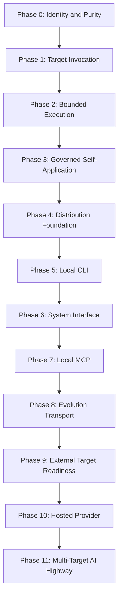

# Forge AI AI-DOS Product Capability, Distribution, Provider Integration, Evolution, External Target Readiness, and AI Highway Operations Development Phases

---

## Document Metadata

| Field | Value |
|:---|:---|
| Identifier | `FORGE-AI.TARGET.DEVELOPMENT-PHASES` |
| Title | Forge AI AI-DOS Product Capability, Distribution, Provider Integration, Evolution, External Target Readiness, and AI Highway Operations Development Phases |
| Version | `6.0.0-draft` |
| Status | Draft |
| Canonical Status | Active Forge AI Target Project strategic development program; not AI-DOS product truth and not a universal lifecycle for external Target Projects |
| Classification | Target Project Strategic Product Capability Program |
| Document Type | Development Phase Program |
| Owner | Forge AI Target Project Governance |
| Approval Authority | Human Governance |
| Last Updated | 2026-07-15 |
| Traceability ID | `FORGE-AI.TARGET.DEVELOPMENT-PHASES` |
| Scope | AI-DOS product capability maturity, private/public product boundary, runtime distribution, provider integration, independent Target operation, privacy-safe product evolution input, governed release progression, and multi-Target AI Highway operations as directed by Forge AI. |
| Out of Scope | Distribution implementation, CLI implementation, MCP implementation, hosted-provider implementation, adapter implementation, API design, package layout creation, RFC creation, `docs/AI-DOS/` changes, live ProjectStatus updates, Axis Suite activation, certification, pricing, vendor selection, and automatic phase advancement. |
| Normative Authority | Human Governance; Forge AI Target Project contract; `docs/Projects/ForgeAI/Mission/ForgeAI-Mission-Product-and-Autonomy-Model.md` |
| Primary Authority | `docs/Projects/ForgeAI/Mission/ForgeAI-Mission-Product-and-Autonomy-Model.md` |
| Consumes | Forge AI mission, Human Governance decisions, resolved Target Context, ProjectStatus evidence as read-only context, roadmap direction, execution evidence, distribution-readiness evidence, privacy evidence, and release-governance decisions. |
| Produces | Capability-oriented Forge AI development phases, distribution maturity gates, provider-integration readiness criteria, privacy-safe evolution criteria, independent Target readiness criteria, evidence expectations, and governance gates for AI-DOS product evolution. |
| Certification Status | Not certified |

---

## 1. Purpose

This document defines Forge AI's complete capability maturity program for developing, distributing, validating, operating, and evolving AI-DOS as a reusable AI Operating System.

The phase program answers:

```text
What reusable AI-DOS product capability
must be acquired next,
what evidence proves it,
and what Human Governance decision
permits progression?
```

Forge AI is the Target Project that governs AI-DOS product evolution. These phases remain Forge AI planning truth and do not become AI-DOS product truth, external Target obligations, implementation authorization, ProjectStatus transition authority, or release approval.

---

## 2. Governing Product Model

```text
Private AI-DOS Development Repository
        ↓
Build and Packaging
        ↓
Signed / Versioned AI-DOS Distribution
        ↓
Codex Adapter, CLI, MCP, or Hosted Provider
        ↓
Independent Target Repository
        ↓
Execution, Validation, Review, Evidence
        ↓
Privacy-Safe Evolution Input
        ↓
Governed AI-DOS Product Improvement
        ↓
New AI-DOS Distribution Release
```

AI-DOS development truth and distributable runtime artifacts are separate. AI-DOS is an AI Operating System, not a documentation bundle copied into every Target Repository.

---

## 3. Required Principles

1. AI-DOS is an AI Operating System, not a documentation bundle installed into every Target Repository.
2. The private AI-DOS development repository is not assumed to be visible to end users.
3. Independent Target Repositories do not contain AI-DOS internal architecture, workflows, engines, governance documents, or private development state.
4. Target Repositories expose only Target-owned contracts, resources, constraints, protected areas, validation commands, and execution authority.
5. Codex or another AI host acts between the Target Repository and the installed or hosted AI-DOS runtime.
6. AI-DOS development truth and runtime distribution artifacts are separate.
7. Feedback and improvement opportunities must not require future access to the originating Target Repository.
8. Private source code, credentials, personal data, proprietary repository content, and unnecessary Target Context must not leave the Target environment by default.
9. Human Governance remains final for capability acceptance, distribution release, hosted-provider activation, and AI-DOS product evolution.
10. Passing tests does not automatically authorize release or capability promotion.

---

## 4. Phase Dependency Graph

```text
Identity and Purity
    ↓
Target Invocation
    ↓
Bounded Execution
    ↓
Governed Self-Application
    ↓
Distribution Foundation
    ↓
Local CLI
    ↓
System Interface
    ↓
Local MCP
    ↓
Evolution Transport
    ↓
External Target Readiness
    ↓
Hosted Provider
    ↓
Multi-Target AI Highway
```



Future phases are maturity targets, not accepted active capabilities. No phase is accepted, released, or activated by planning language alone.

---

## 5. Phase Field Contract

Every phase below defines: Purpose, Capability Gain, Reusable Outcome, Dependencies, Required Evidence, Governance Gate, Success Criteria, Exit Criteria, Distribution Impact, Privacy and Security Boundary, Target Independence Requirement, Non-Goals, and Risks.

---

## 6. Development Phases

### Phase 0 — Product Identity, Boundary, and Purity

| Field | Definition |
|:---|:---|
| Expected State | `COMPLETED AS FOUNDATION EVIDENCE` |
| Purpose | Establish AI-DOS as reusable product truth; separate AI-DOS from Forge AI and all Target Project truth; preserve private-product and Target-owned boundaries. |
| Capability Gain | AI-DOS can be governed as a reusable product without treating Forge AI planning, Target contracts, or private development state as distributable runtime truth. |
| Reusable Outcome | Product/project separation rules, Target-owned truth boundary, purity expectations, and protected-area discipline. |
| Dependencies | Human Governance direction and Forge AI mission authority. |
| Required Evidence | Boundary audit evidence, accepted self-hosting foundation evidence, proof that Forge AI planning truth is not inserted into `docs/AI-DOS/`, and evidence that Target-owned contracts remain separate. |
| Governance Gate | Human Governance accepts identity and purity as foundation evidence only. |
| Success Criteria | Stakeholders can distinguish private AI-DOS development truth, Forge AI planning truth, distributable runtime artifacts, and independent Target truth. |
| Exit Criteria | Boundary evidence is accepted and remains reusable for downstream distribution planning. |
| Distribution Impact | Establishes that distribution artifacts are not simply a repository documentation copy. |
| Privacy and Security Boundary | Private AI-DOS source, internal governance, credentials, personal data, and unnecessary Target Context are not exposed by default. |
| Target Independence Requirement | Independent Targets need only Target-owned contracts and do not require AI-DOS internal documents. |
| Non-Goals | Does not implement packaging, publish artifacts, update ProjectStatus, or certify product readiness. |
| Risks | Self-hosting language may blur product and Target truth; repository convenience may encourage copying internals into Targets. |

### Phase 1 — Target-First Invocation and Execution Contract

| Field | Definition |
|:---|:---|
| Expected State | `COMPLETED AS SELF-HOSTING FOUNDATION` |
| Purpose | Accept explicit Target Context; preserve Target-owned authority; stop on missing authority; define bounded execution and evidence expectations. |
| Capability Gain | AI-DOS can consume a Target-supplied contract without owning Target truth or relying on private development repository visibility. |
| Reusable Outcome | Target-first invocation contract pattern, bounded execution expectations, validation expectations, and safe-stop behavior. |
| Dependencies | Phase 0. |
| Required Evidence | Invocation records, Target Context examples, blocker evidence for missing authority, and proof that Target contracts remain Target-owned. |
| Governance Gate | Human Governance accepts Target-first invocation as self-hosting foundation, not product distribution readiness. |
| Success Criteria | AI-DOS work can be traced from authorized Target Context to bounded execution and evidence. |
| Exit Criteria | Missing authority causes safe stop, not invented context or private-source fallback. |
| Distribution Impact | Prepares the contract that CLI, MCP, and hosted providers must consume. |
| Privacy and Security Boundary | Target data is consumed only within authorized boundaries and is minimized by default. |
| Target Independence Requirement | Target Repositories declare resources, constraints, protected areas, validation, and authority without containing AI-DOS internals. |
| Non-Goals | Does not create adapters, CLI commands, MCP tools, or hosted APIs. |
| Risks | Ambiguous Target contracts may be mistaken for authorization; Codex host behavior may be confused with AI-DOS runtime behavior. |

### Phase 2 — Planning, Decision, Execution, Validation, and Review

| Field | Definition |
|:---|:---|
| Expected State | `OPERATIONALLY DEMONSTRATED IN SELF-HOSTING` |
| Purpose | Resolve capability-grounded work; execute exactly bounded tasks; validate, review, and produce evidence; preserve Human Governance approval boundaries. |
| Capability Gain | AI-DOS can perform bounded planning and execution with validation and review evidence while avoiding self-approval. |
| Reusable Outcome | Evidence-backed planning, execution, validation, review, blocker, and completion-report patterns. |
| Dependencies | Phases 0 and 1. |
| Required Evidence | Bounded task records, changed-artifact evidence, validation command output, review findings, safe-stop evidence, and Human Governance boundary proof. |
| Governance Gate | Human Governance accepts operational demonstration as self-hosting evidence only. |
| Success Criteria | Work is completed only within authorized scope and produces traceable evidence sufficient for governance review. |
| Exit Criteria | Reusable execution and evidence patterns are demonstrated without claiming release readiness. |
| Distribution Impact | Provides behavior that future runtime distributions must preserve. |
| Privacy and Security Boundary | Execution evidence excludes unnecessary secrets, personal data, private source, and proprietary Target content. |
| Target Independence Requirement | Execution depends on explicit Target contracts and validation declarations, not Forge AI fallback. |
| Non-Goals | Does not certify AI-DOS, activate Axis Suite, implement distribution, or update ProjectStatus automatically. |
| Risks | Passing tests may be overclaimed as release approval; review may be mistaken for Human Governance acceptance. |

### Phase 3 — Governed Self-Application and Product Learning

| Field | Definition |
|:---|:---|
| Expected State | `ACTIVE / EARLY OPERATIONAL DEMONSTRATION` |
| Purpose | Identify AI-DOS improvement opportunities from real Target execution; separate observation, validation, authorization, correction, regression testing, and capability acceptance; prove AI-DOS can improve itself without self-authorization. |
| Capability Gain | AI-DOS can turn bounded execution evidence into governed product-learning input without treating the originating Target as the product-development repository. |
| Reusable Outcome | Governed self-application loop and evidence-derived improvement lifecycle. |
| Dependencies | Phases 0 through 2. |
| Required Evidence | Target execution evidence, improvement opportunity record, validation result, Human Governance authorization, bounded correction evidence, regression validation and review, and Human Governance capability acceptance. |
| Governance Gate | Human Governance authorizes each correction and separately accepts any capability improvement. |
| Success Criteria | Improvement opportunities are evidence-derived, validated, authorized, corrected within scope, regression-tested, and accepted only by Human Governance. |
| Exit Criteria | The lifecycle below is demonstrated without requiring future access to the originating Target Repository. |
| Distribution Impact | Creates product-learning criteria for future distributions without releasing a runtime artifact. |
| Privacy and Security Boundary | Opportunity records minimize Target data and avoid private code, credentials, personal data, and unnecessary context. |
| Target Independence Requirement | The originating Target Repository need not remain accessible after execution. |
| Non-Goals | Does not self-authorize changes, certify releases, create feedback transport implementation, or begin external Target execution. |
| Risks | Self-application can become circular authority; opportunity evidence may contain too much Target context unless minimized. |

Required lifecycle:

```text
Target Execution Evidence
    ↓
Improvement Opportunity
    ↓
Opportunity Validation
    ↓
Human Governance Authorization
    ↓
Bounded AI-DOS Correction
    ↓
Regression Validation and Review
    ↓
Human Governance Capability Acceptance
```

### Phase 4 — Distribution Foundation and Private/Public Product Boundary

| Field | Definition |
|:---|:---|
| Purpose | Define what remains private development source; define what becomes distributable runtime; establish build, packaging, versioning, signing, manifest, compatibility, installation, update, rollback, and release boundaries. |
| Capability Gain | AI-DOS gains a governed distribution boundary answering what exactly is shipped to users and what remains private. |
| Reusable Outcome | Private repository boundary, artifact boundary, public runtime contract, manifest model, version model, compatibility model, installation/removal model, update/rollback policy, and distribution validation profile. |
| Dependencies | Phases 0 through 3. |
| Required Evidence | Accepted private/public boundary, artifact inventory, manifest and versioning plan, signing and integrity criteria, compatibility criteria, install/remove/update/rollback criteria, and release-governance evidence. |
| Governance Gate | Human Governance accepts distribution architecture and package contract before any implementation or external product claim. |
| Success Criteria | The boundary clearly states what ships, what remains private, how versions are verified, and how release readiness is governed. |
| Exit Criteria | Distribution foundation is accepted as planning truth only, with no implementation claimed. |
| Distribution Impact | Enables Distribution v1 Local CLI planning and blocks external Target product claims until accepted. |
| Privacy and Security Boundary | Private source, internal development state, credentials, and nonessential Target Context remain outside distributable artifacts. |
| Target Independence Requirement | Target use requires no private AI-DOS development repository access. |
| Non-Goals | Does not create package layouts, schemas, CLI, MCP, adapters, hosted services, or RFCs. |
| Risks | Planning may be mistaken for implementation; distribution artifacts may accidentally expose internal product truth. |

### Phase 5 — Distribution v1: Local CLI Package

| Field | Definition |
|:---|:---|
| Purpose | Create the first locally installable and executable AI-DOS distribution; allow AI hosts such as Codex to invoke AI-DOS without access to the private development repository. |
| Capability Gain | AI-DOS becomes usable through a local runtime entrypoint that can operate against explicit Target paths. |
| Reusable Outcome | Local installation, runtime resolution, bounded command model, evidence output, local runtime-data storage, offline-first behavior, uninstall, and rollback criteria. |
| Dependencies | Phase 4. |
| Required Evidence | Local install validation, explicit provider-root or installed-runtime resolution evidence, Target argument handling, Target contract loading, bounded command evidence, validation/evidence output, local data behavior, offline evidence, uninstall, and rollback evidence. |
| Governance Gate | Human Governance validates Local CLI package before claiming Distribution v1 readiness. |
| Success Criteria | Codex or another AI host can invoke the local CLI against a Target Repository without seeing the private development repository. |
| Exit Criteria | Distribution v1 Local CLI is validated with no mandatory network connection and no private-source exposure. |
| Distribution Impact | Establishes Distribution v1 as the first maturity stage. |
| Privacy and Security Boundary | Target content remains local by default; runtime data is stored locally with explicit boundaries. |
| Target Independence Requirement | CLI consumes Target-owned contracts and does not require AI-DOS internals in the Target. |
| Non-Goals | This planning document does not authorize interface implementation; no CLI is claimed here. |
| Risks | Conceptual command examples may be overread as active interfaces; local data may expose sensitive Target context if not controlled. |

Target interaction model:

```text
Codex
    ↓
AI-DOS Local CLI
    ↓
Target Repository
```

Example conceptual interface only:

```text
ai-dos run --target <path>
ai-dos continue --target <path>
ai-dos validate --target <path>
ai-dos review --target <path>
```

### Phase 6 — AI-DOS System Interface and Codex Adapter

| Field | Definition |
|:---|:---|
| Purpose | Define the stable public contract between Codex or another AI host and AI-DOS; prevent hosts from depending on AI-DOS internal documents or private implementation. |
| Capability Gain | AI-DOS gains a public host-facing interface distinct from private internal architecture. |
| Reusable Outcome | Provider discovery, runtime handshake, Target registration, Target Context submission, work request, plan, authorization, validation, review, evidence, waiting, blocker, safe-stop, version, and compatibility negotiation contracts. |
| Dependencies | Phase 5. |
| Required Evidence | Public System Interface acceptance evidence, adapter conformance criteria, compatibility negotiation evidence, and proof that Codex is an AI host / adapter consumer rather than AI-DOS itself. |
| Governance Gate | Human Governance accepts the public System Interface before supported adapters are claimed. |
| Success Criteria | Hosts can integrate through stable public operations without reading private AI-DOS internal documents. |
| Exit Criteria | Codex adapter expectations are validated against the public interface boundary. |
| Distribution Impact | Enables supported adapters and prepares Local MCP provider maturity. |
| Privacy and Security Boundary | Interface contracts minimize Target Context and return structured evidence without exposing private internals. |
| Target Independence Requirement | Adapter sessions operate against Target-owned contracts and explicit authority. |
| Non-Goals | Does not implement adapters, APIs, schemas, or service endpoints. |
| Risks | Host convenience may couple to internals; adapter behavior may be mistaken for AI-DOS core authority. |

Required boundary:

```text
Public AI-DOS System Interface
≠
Private AI-DOS Internal Architecture
```

### Phase 7 — Distribution v2: Local MCP Server

| Field | Definition |
|:---|:---|
| Purpose | Expose AI-DOS as a local MCP-compatible provider for Codex and other supported AI hosts; keep Target code and sensitive context local by default. |
| Capability Gain | AI-DOS can operate as a local provider with authenticated sessions and public tools. |
| Reusable Outcome | Local MCP process, local authorization, public AI-DOS tools, Target-scoped sessions, permission boundaries, context minimization, structured evidence, session isolation, audit logs, installation, and update lifecycle criteria. |
| Dependencies | Phase 6. |
| Required Evidence | Local MCP validation, authenticated local connection evidence, tool-surface conformance, Target session isolation evidence, audit logs, update lifecycle evidence, and local-only data behavior. |
| Governance Gate | Human Governance validates Local MCP server before claiming Distribution v2 readiness. |
| Success Criteria | Codex can use AI-DOS through a local MCP provider without copying AI-DOS internals into the Target Repository. |
| Exit Criteria | Distribution v2 Local MCP is validated with local privacy and session isolation evidence. |
| Distribution Impact | Establishes Distribution v2 as the second maturity stage after Local CLI and System Interface. |
| Privacy and Security Boundary | Target code and sensitive context stay local by default; connection is authenticated and scoped. |
| Target Independence Requirement | Each Target session is isolated and relies on Target-owned contracts. |
| Non-Goals | This planning document does not implement MCP tools or server processes. |
| Risks | Tool surfaces may overexpose capabilities; session isolation failures could leak Target context. |

Interaction model:

```text
Codex
    ↓
Local AI-DOS MCP Server
    ↓
AI-DOS Runtime
    ↓
Target Repository
```

### Phase 8 — Feedback, Experience, and Capability Evolution Transport

| Field | Definition |
|:---|:---|
| Purpose | Convert observed AI-DOS deficiencies into portable, privacy-safe product-evolution input; allow opportunities discovered anywhere to reach AI-DOS product development without direct access to the originating Target Repository. |
| Capability Gain | AI-DOS can produce privacy-reviewed Evolution Capsules that survive loss of access to the originating Target. |
| Reusable Outcome | Opportunity detection, capability-gap classification, deduplication identifiers, evidence minimization, redaction, privacy classification, consent, local-only mode, manual export, optional approved upload, provenance, integrity checks, and product-development intake criteria. |
| Dependencies | Phase 7 and validated evidence, privacy, redaction, and consent controls. |
| Required Evidence | Capsule model acceptance, redaction review, privacy classification, user consent records, local queue/export/upload validation where authorized, provenance, authenticity, and integrity evidence. |
| Governance Gate | Human Governance accepts Evolution Capsule model and consent-based transport before product-intake use. |
| Success Criteria | Eligible opportunities become portable, privacy-reviewed, consent-controlled inputs without requiring future Target access. |
| Exit Criteria | Evolution transport is validated in local-only and approved-transfer modes as applicable. |
| Distribution Impact | Enables product evolution across distributions while preserving Target privacy. |
| Privacy and Security Boundary | Private source code, credentials, personal data, proprietary content, and unnecessary Target Context do not leave the Target environment by default. |
| Target Independence Requirement | AI-DOS never assumes future access to the originating Target Repository. |
| Non-Goals | Does not create feedback implementation, upload service, or schema in this work unit. |
| Risks | Overcollection may violate privacy; consent may be ambiguous; deduplication may leak sensitive identifiers if poorly designed. |

Required lifecycle:

```text
Target Execution
    ↓
Execution Evidence
    ↓
Potential AI-DOS Capability Deficiency
    ↓
Redaction and Privacy Review
    ↓
Portable Evolution Capsule
    ↓
User Consent
    ↓
Local Storage, Manual Export, or Approved Upload
    ↓
AI-DOS Product Evolution Intake
```

### Phase 9 — Independent External Target Readiness

| Field | Definition |
|:---|:---|
| Purpose | Prove AI-DOS can operate against a truly independent Target Repository; prove AI-DOS internals are not copied into or exposed through the Target; validate Target isolation and provider portability. |
| Capability Gain | AI-DOS demonstrates product portability beyond self-hosting. |
| Reusable Outcome | Independent Target onboarding evidence, no-Forge-fallback proof, no-private-source-exposure proof, complete bounded execution evidence, safe-stop evidence, and privacy-safe opportunity capture where applicable. |
| Dependencies | Phase 8 and accepted distribution/integration boundaries. |
| Required Evidence | Independent Target contract, independent Target state, independent source/protected boundaries, Target-declared validation, no Forge AI fallback, no private AI-DOS source exposure, bounded execution, evidence/safe-stop behavior, and privacy-safe opportunity capture. |
| Governance Gate | Human Governance accepts independent external Target proof before hosted-provider maturity claims. |
| Success Criteria | AI-DOS operates against an independent Target using distribution/runtime boundaries and Target-owned contracts only. |
| Exit Criteria | External Target pilot is complete, reviewed, and accepted without activating further external work automatically. |
| Distribution Impact | Validates provider portability and external product readiness evidence. |
| Privacy and Security Boundary | Independent Target content remains protected under Target authority and privacy controls. |
| Target Independence Requirement | Axis Suite may become the first external Target only after required distribution and integration capabilities exist and Human Governance authorizes it. |
| Non-Goals | Does not begin Axis Suite execution, certify broad readiness, or claim hosted-provider maturity. |
| Risks | External pilot may rely on hidden Forge AI assumptions; Target evidence may expose proprietary content if not minimized. |

### Phase 10 — Distribution v3: Managed / Hosted AI-DOS Provider

| Field | Definition |
|:---|:---|
| Purpose | Provide AI-DOS as a remotely managed runtime without requiring local installation; preserve privacy, consent, Target isolation, and auditable authority. |
| Capability Gain | AI-DOS can operate through an authenticated managed provider under strict privacy and isolation controls. |
| Reusable Outcome | Tenant and Target isolation, authentication, authorization, encrypted transport, minimal context transfer, consent controls, regional/retention controls, hosted execution policy, auditability, service versioning, rollback, availability/failure handling, and local/offline fallback strategy. |
| Dependencies | Phase 9. |
| Required Evidence | Managed provider architecture acceptance, authentication/authorization evidence, isolation evidence, encryption and retention evidence, consent controls, audit records, rollback evidence, failure handling, and fallback validation. |
| Governance Gate | Human Governance accepts hosted architecture and separately authorizes any hosted pilot or activation. |
| Success Criteria | Hosted operation preserves Target authority, minimal context transfer, consent, auditability, rollback, and safe-stop behavior. |
| Exit Criteria | Distribution v3 hosted pilot is completed and accepted before maturity claims. |
| Distribution Impact | Establishes Distribution v3 as the managed-provider maturity stage. |
| Privacy and Security Boundary | No hosted context transfer occurs without explicit policy, consent, encryption, retention, and regional controls. |
| Target Independence Requirement | Hosted sessions remain Target-scoped and isolated across tenants and Targets. |
| Non-Goals | Planning language does not activate hosted operation, choose a vendor, choose pricing, or implement a service. |
| Risks | Hosted convenience may overcollect context; service failure could disrupt Target execution; tenant isolation failures are high impact. |

Interaction model:

```text
Codex
    ↓
Authenticated AI-DOS Provider
    ↓
Target-Scoped Session
    ↓
Bounded AI-DOS Runtime
```

### Phase 11 — Multi-Target AI Highway and Product Operations

| Field | Definition |
|:---|:---|
| Purpose | Operate AI-DOS across many independent Targets; learn from privacy-safe evidence; release governed capability improvements; sustain distribution and compatibility over time. |
| Capability Gain | AI-DOS reaches governed multi-Target product operations without unrestricted autonomous evolution. |
| Reusable Outcome | Multi-Target isolation, distribution channels, release trains, compatibility matrix, migration policy, deprecation policy, telemetry boundaries, privacy-safe aggregate evidence, opportunity deduplication, regression suites, support model, and capability promotion governance. |
| Dependencies | Phase 10. |
| Required Evidence | Multi-Target isolation evidence, compatibility and migration evidence, release-train evidence, regression suite results, privacy-safe aggregate evidence, support evidence, and Human Governance capability-promotion decisions. |
| Governance Gate | Human Governance accepts Multi-Target AI Highway readiness and release-governance operating model. |
| Success Criteria | AI-DOS can sustain many independent Target relationships, learn only through privacy-safe inputs, and release improvements through governed distribution. |
| Exit Criteria | Broad multi-Target readiness is accepted after hosted-provider success and operational evidence. |
| Distribution Impact | Sustains the distribution ecosystem through channels, releases, migrations, deprecations, and compatibility support. |
| Privacy and Security Boundary | Aggregate learning excludes unnecessary Target Context and preserves consent, retention, provenance, and telemetry limits. |
| Target Independence Requirement | No Target receives or depends on another Target's private context or AI-DOS private source. |
| Non-Goals | Does not authorize unrestricted autonomous evolution, automatic promotion, or ungoverned telemetry. |
| Risks | Scale may weaken privacy controls; compatibility drift may fragment distribution; aggregate evidence may be overclaimed as universal readiness. |

---

## 7. Version History

| Version | Date | Description |
|:---|:---|:---|
| `5.1.0-draft` | 2026-07-11 | Prior Forge AI capability maturity planning baseline. |
| `6.0.0-draft` | 2026-07-15 | Realigned Forge AI around AI-DOS private development, runtime distribution, local CLI, local MCP, hosted provider, independent Target integration, privacy-safe evolution input, and multi-Target AI Highway operations. |
