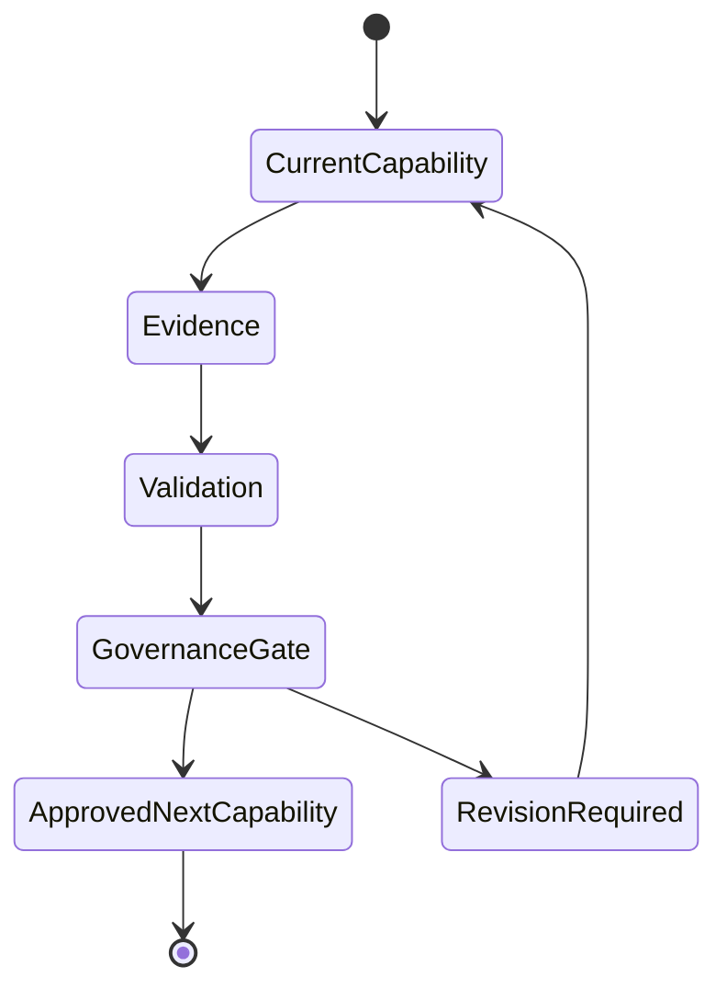

# Forge AI Operational State Model

---

## Document Metadata

| Field | Value |
|:---|:---|
| Identifier | `FORGE-AI.TARGET.PROJECT-STATUS` |
| Title | Forge AI Operational State Model |
| Version | `5.0.0-draft` |
| Status | Live Operational State |
| Classification | Target Project Operational State |
| Document Type | ProjectStatus |
| Owner | Forge AI Target Project Governance |
| Approval Authority | Human Governance |
| Last Updated | 2026-07-11 |
| Lifecycle Phase | Live Operational State |
| Scope | Current AI-DOS capability state, evidence state, governance gate, autonomy maturity, program health, Target independence, purity, and next approved capability for Forge AI as the AI-DOS Development and Autonomy Enablement Target Project. |
| Out of Scope | Roadmap definition, phase definition, AI-DOS architecture definition, implementation authorization, sprint tracking, backlog tracking, document inventory, historical logs, automatic state updates, and Human Governance replacement. |
| Normative Authority | Human Governance; Forge AI Target Project contract; Forge AI mission and autonomy model. |
| Consumes | `docs/Projects/ForgeAI/Mission/AGENTS.md`, `docs/Projects/ForgeAI/Mission/ForgeAI-Mission-and-Autonomy-Model.md`, `docs/Projects/ForgeAI/Planning/DevelopmentPhases.md`, `docs/Projects/ForgeAI/Planning/Roadmap.md`, and current repository evidence. |
| Produces | Current operational telemetry for AI-DOS capability maturity, evidence readiness, governance status, autonomy maturity, Target independence, and the next approved capability. |
| Update Rule | Update only through explicit Human Governance authorization or a dedicated ProjectStatus task. |

ProjectStatus reports current state only. It does not define strategy, define architecture, replace DevelopmentPhases, replace the roadmap, or authorize implementation.

---

## 1. Program Identity

Forge AI is the **AI-DOS Development and Autonomy Enablement Target Project**.

Forge AI owns Target Project truth: mission application, planning state, live operational state, evidence, authorization, protected-area boundaries, and Human Governance decisions. AI-DOS owns reusable capability behavior and reusable product truth. ProjectStatus is Forge AI Target Project truth and is not part of `docs/AI/` reusable AI-DOS truth.

---

## 2. Current Capability

Exactly one capability is active.

| Field | Current State |
|:---|:---|
| Active Capability | Forge AI Operational State Model Realignment |
| Objective | Rebuild ProjectStatus as the live operational telemetry model for AI-DOS capability, evidence, governance, autonomy, purity, and Target-independence state. |
| Reason | Human Governance approved ProjectStatus realignment so the live state answers where AI-DOS is today, what capability is active, what evidence exists, which gate is active, what autonomy is proven, and what capability is approved next. |
| Dependency | Forge AI mission and autonomy model, Target Project contract, DevelopmentPhases capability maturity model, roadmap capability streams, and current repository evidence. |
| Boundary | Documentation-only ProjectStatus update; no roadmap, phase, mission, AGENTS, `docs/AI/`, architecture, implementation, cleanup, or external Target execution changes. |

---

## 3. Current Phase

Current phase reference: **Phase 0 — Identity, Boundary, Purity**, with operational work aligned to the Phase 0 capability maturity emphasis on product-project separation, AI-DOS purity, Target independence, and protected-area respect.

This section references the capability maturity phase defined by `docs/Projects/ForgeAI/Planning/DevelopmentPhases.md`; it does not redefine DevelopmentPhases.

---

## 4. Capability Progress

| Progress State | Current Evidence |
|:---|:---|
| Started | Human Governance issued `FORGE-AI.V2.PROJECTSTATUS-REALIGNMENT-001` with explicit scope, authorities, protected areas, required sections, validation expectations, and completion reporting requirements. |
| In Progress | ProjectStatus is being reconstructed as the Forge AI Operational State Model within the authorized single-file scope. |
| Validated | Pending completion of required searches and repository status checks for this task. |
| Governance Pending | Human Governance review remains required before the rebuilt ProjectStatus is accepted as the authoritative live operational state. |
| Completed | Not complete until validation passes, changes are committed, and governance can review the evidence package. |

---

## 5. Evidence Status

| Evidence Category | Current State | Evidence Summary |
|:---|:---|:---|
| Architecture evidence | Emerging | Mission, Target contract, DevelopmentPhases, and roadmap establish product/project separation, Target-first operation, and capability maturity framing. ProjectStatus does not define AI-DOS internals. |
| Validation evidence | Pending | Required validation searches and git status confirmation must show only ProjectStatus changed and that forbidden historical patterns are absent. |
| Review evidence | Pending | Human Governance review is required; this document separates operational review evidence from approval. |
| Implementation evidence | Not applicable | Current work is documentation-only and does not authorize runtime, engine, cleanup, external Target, or architecture implementation. |
| Purity evidence | Emerging | Current authority states `docs/AI/` contains reusable AI-DOS truth only, while ProjectStatus remains Forge AI Target Project truth. |
| Target-independence evidence | Emerging | Current evidence supports boundary discipline and explicit Target Context; independent external Target execution evidence is not yet present. |

Evidence is not fabricated. Missing validation, review, or independent Target proof remains recorded as pending or not present.

---

## 6. Governance Gate

| Field | Current State |
|:---|:---|
| Current Gate | ProjectStatus Realignment Acceptance Gate |
| Outcome Status | Pending |
| Reason | The live operational state model has been authorized for reconstruction but has not yet been accepted by Human Governance after validation and review. |
| Required Evidence | Single-file modification proof; required-section coverage; exactly one active Current Capability; exactly one Next Approved Capability; absence of sprint history and document-writing history; current-state-only framing; validation command output; completion report. |
| Next Decision | Human Governance decides whether to accept ProjectStatus as the Forge AI Operational State Model or require revision. |

Possible outcomes remain Accepted, Pending, Rejected, Deferred, or Blocked. The current outcome is **Pending**.

---

## 7. Autonomy Status

| Field | Current State |
|:---|:---|
| Current Level | Level 0 — Human-Directed Execution, with emerging Level 1 context-aware assistance evidence. |
| Proof | Work is bounded by explicit Human Governance instructions, a single authorized file, protected-area exclusions, evidence requirements, validation expectations, and required completion reporting. |
| Limitations | No accepted proof yet of independent planning maturity, autonomous workflow completion, recovery/replanning maturity, or external Target operation. Human Governance remains final. |
| Next Maturity Objective | Prove Level 1 context-aware assistance through Target-first invocation records that show explicit context intake, boundary preservation, validation reporting, and safe blocker handling. |

No higher autonomy maturity is claimed.

---

## 8. Program Health

| Health Area | Current State | Summary |
|:---|:---|:---|
| Strengths | Stable | Mission, Target contract, DevelopmentPhases, and roadmap now align around capability, evidence, governance, autonomy safety, purity, and Target independence. |
| Risks | Active | ProjectStatus can drift into roadmap, backlog, historical log, or architecture authority if updates are not tightly governed. |
| Blockers | None for current authorized edit | No blocker is known for reconstructing ProjectStatus within the single-file documentation-only scope. |
| Technical Debt | Emerging | Repository and documentation structure still require alignment with the Target Project operating model. |
| Architectural Debt | Managed | AI-DOS internals are intentionally not redefined here; architectural debt must remain outside ProjectStatus unless separately authorized. |
| Governance Debt | Emerging | Human Governance acceptance records and evidence packages need consistent operational capture without turning ProjectStatus into a log. |

---

## 9. AI-DOS Purity Status

Current purity state: **Emerging and guarded**.

The current authority boundary states that `docs/AI/` contains reusable AI-DOS truth only, while ProjectStatus is Forge AI Target Project truth. Current ProjectStatus preserves that separation by reporting operational Target state without inserting Forge AI planning state into reusable AI-DOS product truth.

Audit-relevant evidence supports the need for continued purity checks, especially where self-hosting language could blur Forge AI Target Project truth with reusable AI-DOS truth. This section summarizes the purity posture only; it does not restate or replace any audit.

---

## 10. Target Independence Status

| Field | Current State |
|:---|:---|
| Current Target Independence | Emerging |
| Known Coupling | Forge AI remains the self-application Target Project and supplies current Target Context, governance, evidence, and state. |
| Known Contamination | No current contamination is asserted in this status model; continued audit is required before stronger claims. |
| Remaining Work | Demonstrate repeatable Target-first invocation, validation, purity preservation, blocker handling, and independent Target operation without Forge AI project-state leakage. |

---

## 11. Current Focus

Exactly one strategic objective is active:

```text
Rebuild ProjectStatus into a live operational state model that reports AI-DOS capability, evidence, governance, autonomy, purity, Target independence, and the next approved capability without becoming a roadmap, backlog, sprint tracker, document inventory, implementation log, or architecture authority.
```

---

## 12. Next Approved Capability

Only one next approved capability is identified.

| Field | Current State |
|:---|:---|
| Next Approved Capability | Forge AI Target Project Structure Realignment |
| Why | Human Governance identified the next authorized step as aligning Forge AI project document structure with the new Target Project operating model. |
| Dependencies | Accepted ProjectStatus realignment evidence; preserved product/project separation; protected-area compliance; no unauthorized `docs/AI/`, mission, AGENTS, roadmap, or DevelopmentPhases changes. |
| Expected Evidence | Structure alignment proposal or change evidence, affected-file list, protected-area review, purity check, Target-independence check, validation output, and governance-ready completion report. |
| Expected Governance Gate | Target Project Structure Realignment Acceptance Gate. |

---

## 13. Recent Governance Decisions

- `docs/AI/` contains only reusable AI-DOS truth.
- ProjectStatus is Forge AI Target Project truth and reports current operational state.
- Forge AI is the AI-DOS Development and Autonomy Enablement Target Project.
- ProjectStatus is not a roadmap, backlog, sprint tracker, document inventory, or implementation log.
- ProjectStatus must answer current AI-DOS capability, evidence, governance gate, autonomy proof, and next approved capability.

---

## 14. Operational Metrics

| Metric | Current Qualitative State | Basis |
|:---|:---|:---|
| Capability maturity | Emerging | Phase 0 boundary and purity capability is the current phase reference. |
| Evidence completeness | Emerging | Mission, Target contract, phase, and roadmap evidence exist; validation and governance acceptance remain pending for this update. |
| Governance readiness | Emerging | Gate, required evidence, and next decision are identified; acceptance is pending. |
| Target independence | Emerging | Target-first boundary is established, but independent Target proof is not yet present. |
| Purity | Guarded | Product/project separation is explicit; continued audit is required before verified status. |
| Autonomy maturity | Level 0 proven; Level 1 emerging | Current work is human-directed with explicit Target Context and bounded execution. |
| Review completeness | Pending | Human Governance review has not yet accepted this ProjectStatus reconstruction. |
| Validation coverage | Pending | Required searches and repository checks must complete for this task. |

---

## 15. Non-Goals

ProjectStatus does not:

- define the roadmap;
- define phases;
- define AI-DOS architecture;
- authorize implementation;
- replace governance;
- track sprints;
- maintain a backlog;
- inventory documents;
- record document-writing history;
- certify AI-DOS;
- execute repository cleanup;
- update `docs/AI/`; or
- authorize external Target operation.

---

## 16. Version History

| Version | Date | Description |
|:---|:---|:---|
| `5.0.0-draft` | 2026-07-11 | Rebuilt ProjectStatus as the Forge AI Operational State Model for current AI-DOS capability, evidence, governance, autonomy, purity, Target independence, and next approved capability state. |

---

## Operational State Flow


