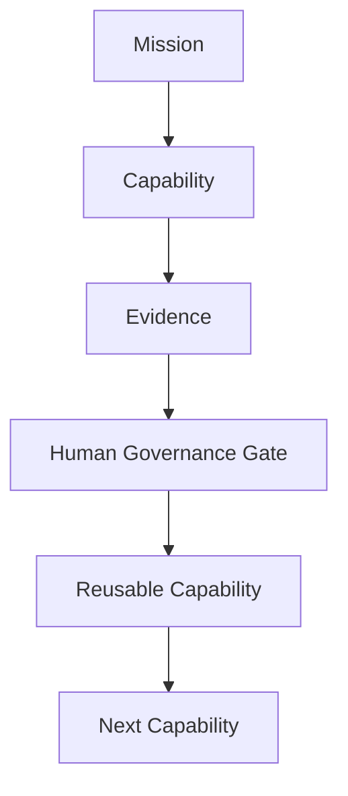
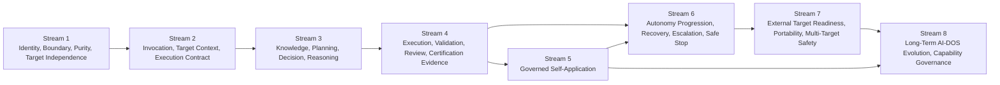
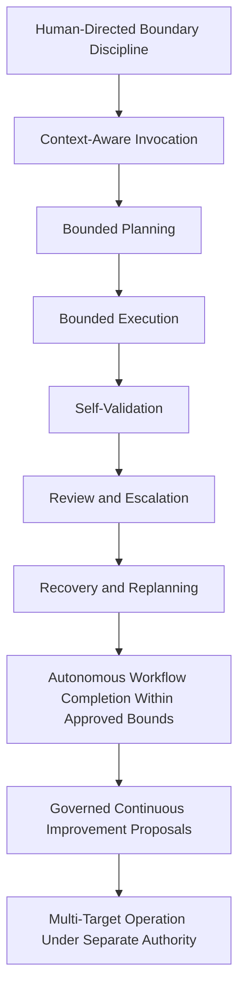
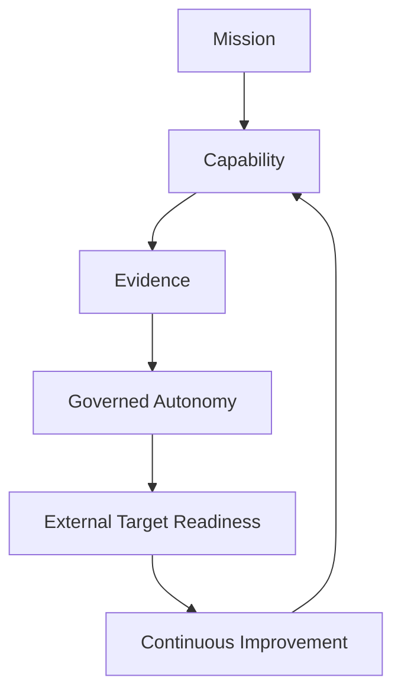

# Forge AI AI-DOS Capability Evolution Program

---

## Document Metadata

| Field | Value |
|:---|:---|
| Identifier | `FORGE-AI.V2.ROADMAP.V4` |
| Title | Forge AI AI-DOS Capability Evolution Program |
| Version | `5.1.0-draft` |
| Status | Draft |
| Canonical Status | Active Forge AI Target Project capability roadmap; not AI-DOS product truth and not authority for external Target Projects |
| Classification | Target Project Strategic Capability Roadmap |
| Document Type | Capability Evolution Program Roadmap |
| Owner | Forge AI Target Project Governance |
| Approval Authority | Human Governance |
| Last Updated | 2026-07-11 |
| Lifecycle Phase | Active Target Project Planning |
| Traceability ID | `FORGE-AI.V2.ROADMAP-REALIGNMENT-001` |
| Scope | AI-DOS capability acquisition, reusable outcomes, required evidence, governance gates, dependency chains, autonomy impact, Target independence proof, and long-term capability evolution directed by Forge AI. |
| Out of Scope | AI-DOS internal architecture, `docs/AI/` changes, live ProjectStatus updates, DevelopmentPhases replacement, operational work-list management, project-state mutation, certification, and automatic maturity advancement. |
| Normative Authority | Human Governance; canonical Target Project contract `docs/Projects/ForgeAI/Mission/AGENTS.md`; `docs/Projects/ForgeAI/Mission/ForgeAI-Mission-and-Autonomy-Model.md`; `docs/Projects/ForgeAI/Planning/DevelopmentPhases.md` |
| Read-Only Context | `docs/Projects/ForgeAI/Planning/ProjectStatus.md` |
| Consumes | Forge AI mission, Target Project contract, DevelopmentPhases capability program, live-state evidence as read-only context, Human Governance decisions, and completed execution evidence. |
| Produces | Capability-oriented roadmap describing what reusable AI-DOS capability is acquired next, what proves maturity, and what governance decision authorizes progression. |
| Certification Status | Not certified |

---

## 1. Purpose

This roadmap defines the Forge AI AI-DOS Capability Evolution Program.

Forge AI is the AI-DOS Development and Autonomy Enablement Target Project. The roadmap therefore belongs to Forge AI as Target Project planning truth. It is not an AI-DOS roadmap, not AI-DOS product truth, and not an external Target Project requirement.

The roadmap answers one governing question:

```text
Which reusable AI-DOS capability
must be acquired next,
and how do we know
it is mature enough
to become the foundation
for the following capability?
```

The roadmap describes capability acquisition rather than activity order. A milestone exists only when it names a reusable AI-DOS capability, explains why it matters, defines evidence, identifies a Human Governance gate, declares dependency relationships, and states autonomy impact.

---

## 2. Roadmap Philosophy

1. **Capability over activity.** Roadmap progress is measured by reusable AI-DOS capability gained, not by artifact volume or repository motion.
2. **Evidence over assumptions.** A capability is not mature until validation, review, blocker, reuse, purity, and governance evidence exists.
3. **Governance over velocity.** Human Governance decides whether evidence is sufficient to advance.
4. **Reusable outcomes over project shortcuts.** Forge AI may self-apply AI-DOS, but accepted outcomes must remain useful beyond Forge AI.
5. **Target independence over convenience.** Capability maturity requires proof that AI-DOS behavior is not coupled to Forge AI project truth.
6. **Autonomy through bounded proof.** Autonomy increases only when AI-DOS demonstrates explicit scope handling, validation, review, escalation, recovery, and safe-stop behavior.

---

## 3. Capability Evolution Model

```text
Mission

↓

Capability

↓

Evidence

↓

Governance

↓

Reusable Capability

↓

Next Capability
```



The model is cyclical. Forge AI mission identifies the next capability. AI-DOS capability work produces evidence. Human Governance accepts, defers, narrows, or rejects maturity. Accepted capability becomes a reusable foundation for the next capability.

---

## 4. Capability Dependency Principles

- Every capability declares required predecessor capabilities.
- Every capability declares capabilities unlocked after completion.
- A capability may be explored before all predecessors mature, but it cannot be accepted as mature until predecessors and evidence are accepted.
- Dependency acceptance is evidence-based, not implied by document existence.
- A downstream autonomy claim is invalid if any upstream safety, purity, invocation, validation, or governance evidence is missing.
- The roadmap is a directed capability graph: edges represent maturity prerequisites, not calendar order.

---

## 5. Capability Dependency Graph



---

## 6. Strategic Capability Streams

### Stream 1 — AI-DOS Identity, Boundary, Purity, Target Independence

#### Milestone C1 — Product–Project Separation Capability

| Required Element | Definition |
|:---|:---|
| Purpose | Ensure AI-DOS reusable truth remains separate from Forge AI Target Project truth. |
| Capability Description | AI-DOS can be reasoned about as a reusable capability provider while Forge AI retains project mission, planning, state, evidence, and authorization. |
| Capability Acquisition Interpretation | Advancement means AI-DOS gains stronger reusable product/project separation, not merely cleaner repository wording or navigation. |
| Business / Strategic Value | Prevents product contamination, protects reuse, and creates a stable basis for external Target adoption. |
| Dependencies | Required predecessor capabilities: none; this is the root capability. |
| Reusable Outcomes | Clear product/project boundary, purity rules, Target-independent capability language, and protected-area discipline. |
| Required Evidence | Boundary audit evidence; proof that Forge AI project truth is not inserted into AI-DOS product truth; protected-area review; cited mission and contract alignment. |
| Governance Gate | Human Governance accepts the product/project separation as sufficient foundation for invocation work. |
| Success Criteria | Stakeholders can identify which truth belongs to AI-DOS and which belongs to Forge AI without direct internal-path dependency or authority crossover. |
| Autonomy Impact | Establishes safe Level 0 to Level 1 boundary discipline by preventing AI-DOS from inferring authority it does not own. |
| Risks | Self-hosting language may blur identity; convenience may encourage Target-specific shortcuts; missing boundary evidence may create false maturity claims. |
| Non-goals | Does not define AI-DOS internals, rewrite mission authority, or update live operational state. |
| Exit Criteria | Boundary evidence accepted; no protected-area conflict remains unresolved; capabilities unlocked after completion: C2, all downstream Target-independent capability work. |

### Stream 2 — Invocation, Target Context, Execution Contract, Target Resolution Boundary

#### Milestone C2 — Target-First Invocation Capability

| Required Element | Definition |
|:---|:---|
| Purpose | Make every AI-DOS use depend on explicit Target Context, bounded objectives, constraints, validation expectations, and protected areas. |
| Capability Description | AI-DOS can accept a Target-supplied invocation contract and operate without owning Target Project truth or resolving unauthorized resources. |
| Capability Acquisition Interpretation | Advancement means AI-DOS gains stronger Target-first invocation behavior, explicit boundary handling, or missing-context blocker behavior. |
| Business / Strategic Value | Enables repeatable Target usage, lowers onboarding ambiguity, and prevents authority drift. |
| Dependencies | Required predecessor capabilities: C1. |
| Reusable Outcomes | Invocation contract pattern, Target Context boundary, execution constraints, blocker reporting expectations, and Target resolution safety rule. |
| Required Evidence | Invocation examples; Target Context records; blocker reports for missing context; proof that Target resources are explicit; validation of no fallback to unauthorized authority. |
| Governance Gate | Human Governance accepts that invocation boundaries are clear enough to support planning and reasoning. |
| Success Criteria | AI-DOS assistance can be traced from authorized objective to supplied resources, constraints, evidence, and completion report. |
| Autonomy Impact | Enables Level 1 context-aware assistance and creates prerequisites for Level 2 bounded planning. |
| Risks | Ambiguous Target Context may cause invented assumptions; unresolved resources may be mistaken for permission; invocation records may omit constraints. |
| Non-goals | Does not create implementation routing, or automatic Target discovery rules. |
| Exit Criteria | Invocation evidence accepted; Target Context completeness criteria exist; capabilities unlocked after completion: C3 and later validation/review capabilities. |

### Stream 3 — Knowledge, Planning, Decision, Reasoning

#### Milestone C3 — Evidence-Grounded Planning and Decision Capability

| Required Element | Definition |
|:---|:---|
| Purpose | Enable AI-DOS to convert bounded Target Context into scoped plans, decisions, assumptions, risk statements, and validation strategies. |
| Capability Description | AI-DOS can reason from supplied evidence, identify missing information, avoid unsupported claims, and produce bounded plans that require governance acceptance before maturity claims. |
| Capability Acquisition Interpretation | Advancement means AI-DOS gains stronger evidence-grounded planning, risk identification, assumption handling, or validation-strategy selection. |
| Business / Strategic Value | Improves decision quality, reduces rework from unsupported assumptions, and creates auditable planning evidence. |
| Dependencies | Required predecessor capabilities: C1 and C2. |
| Reusable Outcomes | Grounded planning model, decision-evidence trace, risk and assumption discipline, and maturity-claim restraint. |
| Required Evidence | Plans tied to Target Context; assumptions list; decision rationale; risk matrix; validation strategy; examples of safe stopping on missing authority. |
| Governance Gate | Human Governance accepts that planning and decision outputs are sufficiently grounded to permit controlled execution. |
| Success Criteria | Plans identify scope, non-goals, risks, required checks, dependencies, and blockers without expanding authority. |
| Autonomy Impact | Enables Level 2 bounded planning and prepares Level 3 bounded execution. |
| Risks | Plans may imply unauthorized work; reasoning may overfit Forge AI context; assumptions may be hidden rather than reported. |
| Non-goals | Does not replace Human Governance, update ProjectStatus, or authorize execution by itself. |
| Exit Criteria | Planning evidence accepted; unsafe assumptions reported; capabilities unlocked after completion: C4 and C6 recovery planning foundations. |

### Stream 4 — Execution, Validation, Review, Certification, Evidence

#### Milestone C4 — Evidence-Backed Execution and Review Capability

| Required Element | Definition |
|:---|:---|
| Purpose | Mature AI-DOS from planning into bounded execution that validates, reviews, reports evidence, and distinguishes review from approval. |
| Capability Description | AI-DOS can complete authorized work within explicit boundaries, run applicable checks, report failures honestly, review results, and provide certification-ready evidence without self-certifying. |
| Capability Acquisition Interpretation | Advancement means AI-DOS gains stronger bounded execution, validation, review, transparent failure reporting, or evidence packaging. |
| Business / Strategic Value | Creates reliable delivery, auditability, quality control, and trust in AI-DOS-assisted outcomes. |
| Dependencies | Required predecessor capabilities: C1, C2, and C3. |
| Reusable Outcomes | Execution evidence package, validation report pattern, review finding structure, certification input boundary, and failure transparency rule. |
| Required Evidence | Changed-artifact records; validation commands and outputs; skipped-check explanations; review findings; blocker reports; evidence that approval remains with Human Governance. |
| Governance Gate | Human Governance accepts that execution evidence is complete enough to support self-application and autonomy progression. |
| Success Criteria | Every completed bounded task has traceable input, changed artifacts, validation, review, risks, blockers, and acceptance boundary. |
| Autonomy Impact | Enables Levels 3 through 5: bounded execution, self-validation, review, and escalation. |
| Risks | Validation may be incomplete; review may be confused with approval; certification language may overclaim maturity. |
| Non-goals | Does not certify AI-DOS, bypass governance, or define internal architecture. |
| Exit Criteria | Evidence package accepted; review/approval separation demonstrated; capabilities unlocked after completion: C5 and C6. |

### Stream 5 — Governed Self-Application

#### Milestone C5 — Safe Self-Application Feedback Capability

| Required Element | Definition |
|:---|:---|
| Purpose | Use AI-DOS on authorized Forge AI work to improve AI-DOS without merging Forge AI and AI-DOS identities. |
| Capability Description | AI-DOS can assist in its own development through Forge AI Target Context while preserving product purity, bounded authority, evidence, and Human Governance evaluation. |
| Capability Acquisition Interpretation | Advancement means self-application produces reusable AI-DOS improvement evidence without self-approval or Forge AI-specific contamination. |
| Business / Strategic Value | Turns real work into improvement evidence and accelerates hardening without sacrificing independence. |
| Dependencies | Required predecessor capabilities: C1, C2, C3, and C4. |
| Reusable Outcomes | Governed self-application loop, evidence-derived improvement proposals, product-purity checks, and governance acceptance records. |
| Required Evidence | Self-application task records; Target Context used; improvement rationale derived from observed evidence; purity audit; governance decision records. |
| Governance Gate | Human Governance accepts self-application evidence as valid input for capability improvement without granting self-approval. |
| Success Criteria | AI-DOS improvements are justified by observed execution evidence and remain reusable beyond Forge AI. |
| Autonomy Impact | Strengthens Levels 5 through 7 by linking review, escalation, workflow completion, and governance feedback. |
| Risks | Self-hosting may create circular authority; Forge AI-specific patterns may leak into reusable behavior; improvement proposals may be treated as automatic authorization. |
| Non-goals | Does not grant AI-DOS ownership of Forge AI state, authorize automatic follow-up work, or modify protected areas without explicit approval. |
| Exit Criteria | Self-application evidence accepted; product purity maintained; capabilities unlocked after completion: C6 and C8. |

### Stream 6 — Autonomy Progression, Recovery, Escalation, Safe Stop, Continuous Execution Boundaries

#### Milestone C6 — Governed Autonomy and Recovery Capability

| Required Element | Definition |
|:---|:---|
| Purpose | Mature AI-DOS autonomy through bounded recovery, replanning, escalation, safe stop, and continuous-execution boundaries. |
| Capability Description | AI-DOS can detect failure, preserve scope, replan within authority, escalate blockers, stop safely when authority or evidence is missing, and propose bounded next work without self-authorizing it. |
| Capability Acquisition Interpretation | Advancement means AI-DOS gains stronger recovery, replanning, escalation, safe-stop, or bounded autonomy-control behavior. |
| Business / Strategic Value | Reduces human intervention for routine bounded work while preserving safety, traceability, and governance control. |
| Dependencies | Required predecessor capabilities: C1, C2, C3, C4, and C5 for self-application evidence; C4 alone may support early recovery trials. |
| Reusable Outcomes | Recovery protocol, escalation evidence, safe-stop standard, autonomy maturity criteria, and continuous-execution boundary. |
| Required Evidence | Failure cases; recovery attempts; revised plans; proof of no scope expansion; escalation records; safe-stop reports; governance acceptance of autonomy claims. |
| Governance Gate | Human Governance accepts a bounded autonomy maturity claim and specifies any allowed autonomy increase. |
| Success Criteria | AI-DOS handles bounded failures transparently, does not hide uncertainty, and stops rather than crossing authority boundaries. |
| Autonomy Impact | Matures Levels 6 through 8 while preserving Human Governance as final authority. |
| Risks | Recovery may become unauthorized redesign; continuous execution may exceed approved boundaries; autonomy claims may outpace evidence. |
| Non-goals | Does not authorize unrestricted operation, self-approval, automatic ProjectStatus updates, or open-ended continuous execution. |
| Exit Criteria | Recovery and safe-stop evidence accepted; autonomy boundary documented; capabilities unlocked after completion: C7 and sustained C8 improvement. |

### Stream 7 — External Target Readiness, Portability, Target Independence Proof, Multi-Target Safety

#### Milestone C7 — External Target Portability Capability

| Required Element | Definition |
|:---|:---|
| Purpose | Prove AI-DOS can operate against independent Target Contexts without Forge AI leakage or authority crossover. |
| Capability Description | AI-DOS can consume a separate Target Project's explicit context, perform bounded assistance, validate results, and preserve isolation between Targets. |
| Capability Acquisition Interpretation | Advancement means AI-DOS gains stronger portability, Target isolation, no-leakage proof, or separate-authority operation. |
| Business / Strategic Value | Demonstrates market and ecosystem readiness by proving AI-DOS is reusable outside Forge AI. |
| Dependencies | Required predecessor capabilities: C1 through C6. |
| Reusable Outcomes | External Target readiness criteria, Target isolation proof, portability evidence, multi-Target safety checks, and onboarding evidence expectations. |
| Required Evidence | Independent Target invocation records; Target Context isolation audit; no-leakage findings; validation output; blocker handling; Human Governance acceptance for each Target authority boundary. |
| Governance Gate | Human Governance accepts that external Target readiness is sufficiently proven for defined bounded use. |
| Success Criteria | AI-DOS works from explicit external Target resources and does not depend on Forge AI project state, assumptions, or protected authority. |
| Autonomy Impact | Supports Level 9 multi-Target operation readiness under separate Target authority. |
| Risks | Forge AI context may be assumed silently; Target authority may be conflated; external evidence may be too narrow for broad readiness claims. |
| Non-goals | Does not grant universal external certification, define external lifecycle requirements, or permit cross-Target work without explicit authority. |
| Exit Criteria | Independent Target evidence accepted; isolation proof complete; capabilities unlocked after completion: C8 long-term improvement and broader external-readiness governance. |

### Stream 8 — Long-Term AI-DOS Evolution, Continuous Improvement, Capability Governance, Long-Term Sustainability

#### Milestone C8 — Evidence-Driven Continuous Improvement Capability

| Required Element | Definition |
|:---|:---|
| Purpose | Sustain AI-DOS evolution through evidence-derived improvement, capability governance, and long-term maintainability. |
| Capability Description | AI-DOS can convert accumulated evidence into bounded improvement proposals, maturity reviews, risk controls, and sustainability decisions without self-authorizing change. |
| Capability Acquisition Interpretation | Advancement means AI-DOS gains stronger evidence-derived improvement selection, maturity review, regression control, or reuse-preserving adaptation. |
| Business / Strategic Value | Supports durable product evolution, predictable governance, and scalable reuse across Targets. |
| Dependencies | Required predecessor capabilities: C1 through C7; C5 may unlock early improvement proposals before external readiness is mature. |
| Reusable Outcomes | Capability governance model, improvement intake criteria, sustainability metrics, maturity review cadence, and retirement or revision evidence rules. |
| Required Evidence | Aggregated task evidence; recurring risk trends; governance decisions; accepted and rejected improvement proposals; Target independence metrics; autonomy maturity history. |
| Governance Gate | Human Governance accepts a continuous-improvement decision and authorizes any bounded follow-up capability work. |
| Success Criteria | Improvements trace to observed evidence, preserve product purity, and strengthen long-term reuse without uncontrolled expansion. |
| Autonomy Impact | Maintains Level 8 governed continuous improvement and informs future Level 9 multi-Target safety decisions. |
| Risks | Improvement demand may become unbounded; metrics may encourage activity instead of capability; governance records may lag evidence. |
| Non-goals | Does not self-approve changes, replace governance, or create commercial certification by roadmap statement alone. |
| Exit Criteria | Improvement governance evidence accepted; sustainable metrics active; capabilities unlocked after completion: renewed capability cycles across C1 through C8 as evidence requires. |

---

## 7. Capability Acquisition Interpretation

Every capability stream in this roadmap is interpreted as capability acquisition, not repository maintenance. A stream advances only when the work produces reusable AI-DOS capability evidence for the declared milestone.

Roadmap progress requires an explicit trace from the active milestone to:

- the reusable capability being acquired;
- the operational outcome expected from that capability;
- the predecessor capability evidence being relied on;
- the validation, review, blocker, purity, reuse, or governance evidence proving advancement; and
- the Human Governance boundary for accepting or rejecting the maturity claim.

The following activities do not advance a roadmap capability unless Human Governance explicitly declares one of them to be the active capability objective and the resulting evidence demonstrates reusable capability acquisition:

- README alignment;
- repository navigation;
- formatting;
- documentation cleanup;
- planning maintenance;
- audits;
- operational evidence reports;
- ProjectStatus maintenance;
- DevelopmentPhases maintenance; and
- Roadmap maintenance.

These activities may support governance, clarify evidence, or prepare a future work unit. They are not roadmap progress by themselves because roadmap progress is the acquisition of reusable AI-DOS capability.

---

## 8. Evidence Strategy

Evidence is the proof layer between capability claims and governance decisions. Required evidence must be specific, traceable, honest, and sufficient for review.

Minimum evidence categories:

- task input and authorized scope;
- Target Context actually used;
- changed artifacts, or explicit statement that none changed;
- validation commands, outputs, failures, and skipped checks;
- review findings and uncertainty;
- blocker and safe-stop records;
- product-purity and Target-independence checks;
- governance acceptance, deferral, rejection, or narrowing decision.

---

## 9. Governance Strategy

Human Governance remains final for maturity acceptance, autonomy progression, external readiness, and continuous improvement authorization.

A governance gate may:

- accept a capability as mature for its declared boundary;
- reject the maturity claim;
- defer pending more evidence;
- narrow the accepted capability boundary;
- require additional validation;
- authorize a bounded next capability objective.

Governance acceptance does not automatically modify live project state, alter DevelopmentPhases, certify AI-DOS, or authorize unrelated work.

---

## 10. Autonomy Strategy

Autonomy grows only from accepted capability evidence.



Autonomy is invalid if it bypasses scope, protected areas, validation, review, escalation, safe stop, or Human Governance.

---

## 11. Target Independence Strategy

Target independence is proven when AI-DOS uses explicit Target Context, preserves Target-specific authority outside AI-DOS product truth, validates against Target-provided expectations, and produces evidence without relying on Forge AI project state.

Target independence requires:

- product purity evidence;
- invocation boundary evidence;
- Target Context isolation;
- no hidden Forge AI assumptions;
- external Target proof before multi-Target maturity claims;
- separate Human Governance authority per Target Context.

---

## 12. Long-Term Evolution Diagram

```text
Mission

↓

Capability

↓

Evidence

↓

Autonomy

↓

External Target

↓

Continuous Improvement
```



---

## 13. Required Matrices

### 13.1 Capability Matrix

| Capability | Stream | Reusable Outcome | Primary Evidence | Gate |
|:---|:---|:---|:---|:---|
| C1 | Identity and purity | Product/project separation | Boundary and purity audit | Boundary accepted |
| C2 | Invocation | Target-first execution contract | Invocation and Target Context records | Invocation accepted |
| C3 | Planning and reasoning | Evidence-grounded plans | Plans, assumptions, risks, validation strategy | Planning accepted |
| C4 | Execution and review | Evidence-backed execution package | Validation, review, blocker evidence | Execution accepted |
| C5 | Self-application | Governed feedback loop | Self-application and purity evidence | Self-application accepted |
| C6 | Autonomy and recovery | Recovery, escalation, safe stop | Failure, recovery, safe-stop records | Autonomy boundary accepted |
| C7 | External readiness | Portability and isolation proof | Independent Target evidence | External readiness accepted |
| C8 | Long-term evolution | Capability governance | Aggregated evidence and improvement decisions | Improvement accepted |

### 13.2 Evidence Matrix

| Capability | Required Evidence |
|:---|:---|
| C1 | Boundary audit, purity review, protected-area confirmation. |
| C2 | Invocation records, supplied Target Context, missing-context blockers. |
| C3 | Grounded plans, assumptions, risks, decisions, validation strategy. |
| C4 | Changed artifacts, validation output, review findings, approval boundary. |
| C5 | Self-application records, observed improvement rationale, purity audit. |
| C6 | Failure evidence, replanning records, safe-stop and escalation reports. |
| C7 | Independent Target records, isolation audit, no-leakage evidence. |
| C8 | Aggregated evidence, trend analysis, accepted and rejected proposals. |

### 13.3 Governance Matrix

| Gate | Decision Question | Possible Outcomes |
|:---|:---|:---|
| G1 | Is product/project separation sufficient? | Accept, reject, defer, narrow. |
| G2 | Is invocation bounded and explicit? | Accept, reject, defer, require more context evidence. |
| G3 | Is planning grounded enough for execution? | Accept, reject, narrow scope, require risk evidence. |
| G4 | Is execution evidence complete enough? | Accept, reject, require validation, require review. |
| G5 | Is self-application safe and reusable? | Accept, reject, require purity evidence. |
| G6 | Is autonomy maturity evidence-backed? | Accept bounded autonomy, reject claim, require recovery proof. |
| G7 | Is external Target readiness proven? | Accept bounded readiness, reject broad claim, require isolation evidence. |
| G8 | Is improvement warranted by evidence? | Authorize bounded follow-up, reject, defer, narrow. |

### 13.4 Dependency Matrix

| Capability | Required Predecessors | Unlocks |
|:---|:---|:---|
| C1 | None | C2 and all downstream purity-dependent capabilities. |
| C2 | C1 | C3. |
| C3 | C1, C2 | C4 and recovery-planning foundations. |
| C4 | C1, C2, C3 | C5 and C6. |
| C5 | C1, C2, C3, C4 | C6 and early C8 feedback. |
| C6 | C1, C2, C3, C4, C5 | C7 and sustained C8 improvement. |
| C7 | C1, C2, C3, C4, C5, C6 | C8 and broader Target-readiness decisions. |
| C8 | C1 through C7 for full maturity; C5 for early proposals | Renewed capability cycles. |

### 13.5 Autonomy Matrix

| Capability | Autonomy Contribution | Autonomy Boundary |
|:---|:---|:---|
| C1 | Human-directed boundary discipline. | No inferred authority. |
| C2 | Context-aware assistance. | Supplied Target Context only. |
| C3 | Bounded planning. | Planning is not approval. |
| C4 | Bounded execution, validation, review. | Review is not Human Governance approval. |
| C5 | Workflow feedback under governance. | Self-application is not self-authorization. |
| C6 | Recovery, escalation, safe stop. | No unrestricted continuous execution. |
| C7 | Multi-Target readiness. | Separate authority per Target Context. |
| C8 | Governed improvement proposals. | Proposal does not authorize execution. |

### 13.6 Risk Matrix

| Risk | Affected Capabilities | Control |
|:---|:---|:---|
| Product/project contamination | C1, C5, C7, C8 | Purity audits and protected-area enforcement. |
| Missing Target Context | C2, C3, C4 | Blocker reporting and safe stop. |
| Unsupported maturity claims | C3, C4, C6, C7 | Evidence gates and Human Governance acceptance. |
| Review mistaken for approval | C4, C5, C6 | Explicit review/approval separation. |
| Autonomy overreach | C6, C7, C8 | Bounded autonomy gates and no self-authorization. |
| External Target leakage | C7 | Isolation evidence and separate authority records. |
| Metrics incentivize activity | C8 | Capability, evidence, governance, and Target-independence metrics only. |

### 13.7 Target Independence Matrix

| Capability | Target Independence Proof |
|:---|:---|
| C1 | AI-DOS truth excludes Forge AI project truth. |
| C2 | Invocation consumes explicit Target Context. |
| C3 | Plans cite supplied resources and expose assumptions. |
| C4 | Validation uses Target-provided expectations and reports gaps. |
| C5 | Self-application improvements remain reusable beyond Forge AI. |
| C6 | Recovery preserves original Target authority. |
| C7 | Independent Target operation succeeds without Forge AI leakage. |
| C8 | Improvement governance tracks portability and isolation trends. |

### 13.8 Success Metrics Matrix

| Metric | Measurement | Desired Signal |
|:---|:---|:---|
| Reusable capability count | Number of capabilities accepted by Human Governance with evidence. | Increasing accepted capability maturity. |
| Evidence completeness | Percentage of accepted gates with input, context, validation, review, blocker, purity, and governance evidence. | High completeness before maturity claims. |
| Governance acceptance quality | Ratio of accepted claims that include explicit boundaries and conditions. | Acceptance is specific, not broad or implied. |
| Autonomy maturity progression | Highest accepted autonomy level supported by evidence. | Gradual growth with no unsupported jumps. |
| Target independence | Number of accepted capabilities with purity and isolation evidence. | No Forge AI leakage into reusable AI-DOS truth. |
| External Target readiness | Independent Target runs accepted with isolation and validation evidence. | Repeatable bounded external operation. |
| Safe-stop reliability | Blockers reported instead of unauthorized expansion. | Increased safe stops when context is missing. |
| Reuse durability | Improvements justified by repeated evidence across Target contexts. | Stable, reusable capability evolution. |

---

## 14. Success Metrics

Success is measured by capability maturity, evidence quality, governance clarity, autonomy safety, and Target independence.

The roadmap explicitly does not measure success by activity throughput, artifact volume, or queue movement.

---

## 15. Roadmap Lifecycle

This roadmap changes only through explicit Human Governance authorization. Updates must preserve the mission, product/project separation, protected areas, DevelopmentPhases alignment, evidence requirements, and Target independence.

A roadmap update may add, split, merge, retire, or reword capabilities only when evidence or governance shows that the capability graph needs adjustment. It must not silently update ProjectStatus, certify AI-DOS, change DevelopmentPhases, or modify AI-DOS product truth.

---

## 16. Version History

| Version | Date | Description |
|:---|:---|:---|
| `4.1.0-draft` | 2026-07-10 | Established active Forge AI Target Project roadmap ownership. |
| `4.2.0-draft` | 2026-07-10 | Added repository audit direction under prior roadmap model. |
| `4.3.0-draft` | 2026-07-10 | Removed direct AI-DOS internal references and adopted Target Project planning boundary. |
| `5.0.0-draft` | 2026-07-11 | Rebuilt roadmap as the Forge AI AI-DOS Capability Evolution Program focused on capability, evidence, governance, dependency, autonomy, and Target independence. |
| `5.1.0-draft` | 2026-07-14 | Refined capability acquisition semantics to distinguish reusable capability progress from repository maintenance after Pilot Execution #2. |
